# 游戏设备周报·下 | 2026-W29 (7.18 - 7.22)

> 像素战争、掌机升级与精神续作——本期聚焦硬件抉择与经典复兴。

## 🌍 海外资讯

### Steam Deck

### 🔮 新机爆料

#### 1. 《Sword & Banner》：像素艺术策略游戏曝光
一款名为《Sword & Banner》的像素艺术策略游戏近日曝光，玩法被描述为《骑马与砍杀》与《全面战争》的结合体。据GamingOnLinux报道，该作在Steam Deck上运行流畅，融合大规模战场指挥与角色养成元素。目前尚未公布发售日期，但已释出实机演示片段。分析认为，像素风策略游戏在掌机端有天然适配优势，若优化得当，有望成为Steam Deck上又一款“时间杀手”级独立佳作。来源: GamingOnLinux

#### 2. MXGP 26 公布，附带全新实机预告片

摩托车竞速系列新作《MXGP 26》正式公布，并同步发布全新实机预告片。本作被描述为系列“全新起点”，在物理引擎和赛道细节上大幅升级，预计登陆PC及主流平台。Steam Deck兼容性尚未明确，但系列前作在掌机上表现尚可。分析指出，竞速游戏是掌机常青品类，若针对Steam Deck优化手柄震动与帧率，将填补该平台专业越野摩托赛车的空白。来源: GamingOnLinux

#### 3. 升级Steam Deck LCD值得吗
Reddit用户r/HandheldGaming发帖讨论是否值得升级手中的Steam Deck LCD 64GB版本。该用户曾拥有ROG Ally和Legion Go，但因使用率低转手，目前考虑为LCD版更换512GB或1TB SSD，或直接购入OLED版。预算限制在100英镑以内，并考虑二手ROG Ally加电池改造方案。分析认为，这反映了LCD用户升级困境：预算有限下，扩容旧机还是换购OLED版。考虑到OLED版在屏幕、续航和散热上的全面优势，建议预算充足用户直接升级OLED。来源: Reddit r/HandheldGaming

#### 4. 《Sanctuary: Shattered Sun》或成《最高指挥官》精神续作

大型即时战略游戏《Sanctuary: Shattered Sun》公布，被外媒视为经典RTS《最高指挥官》的精神续作。该作主打大规模战场与单位操控，已在Steam上架商店页面，支持Steam Deck验证，但发售日期待定。分析指出，RTS在掌机上的操作适配是难点，但若能提供完善的触控或手柄映射方案，有望成为Steam Deck上少有的硬核RTS选择。来源: GamingOnLinux

### 🆕 新机发售

#### 1. D7VK 2.0 发布，提升Linux经典游戏性能
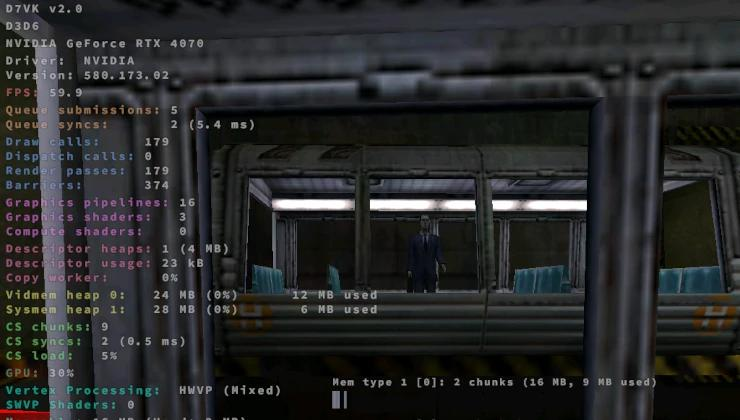

D7VK 2.0版本正式发布，该工具通过将Direct3D 7/8/9指令转换为Vulkan，提升经典老游戏在Linux系统上的运行性能。新版修复多项图形渲染错误，并针对Steam Deck的AMD APU进行专项优化，玩家可借此在掌机上更流畅运行《帝国时代2》《英雄无敌3》等老游戏。分析认为，D7VK的持续更新巩固了Steam Deck作为“复古游戏神机”的地位，对怀旧玩家是免费提升体验的利器。来源: GamingOnLinux

#### 2. 《武装突袭：冷战突击》重制版发布并开源
经典军事模拟游戏《武装突袭：冷战突击》重制版现已完整发布，并同步开放游戏源代码。重制版提升纹理分辨率、修复现代系统兼容性问题，并原生支持Steam Deck控制器布局。开源代码意味着社区可自行制作Mod和优化补丁，延长游戏寿命。分析指出，开源策略为老玩家提供官方高清版本，并通过社区力量解决掌机适配的长期维护问题，是经典游戏移植的典范。来源: GamingOnLinux

#### 3. Faugus Launcher 2.0 推出全新界面及增强功能

Linux游戏管理器Faugus Launcher发布2.0大版本更新，采用全新UI设计，并增强与Steam Deck游戏模式的集成。该工具作为Lutris和Heroic的轻量级替代品，新版支持更便捷的Epic Games、GOG游戏库导入，以及一键切换兼容层功能。分析认为，Faugus Launcher的迭代反映了Steam Deck生态下第三方工具对官方SteamOS体验的补充，为玩家提供更多游戏管理选择。来源: GamingOnLinux

#### 4. Rogue Eclipse 8月7日推出，融合“星际火狐 x 装甲核心”
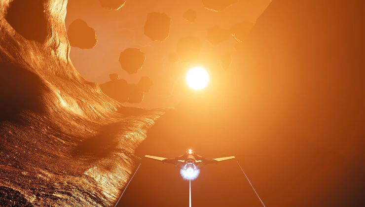

太空射击游戏《Rogue Eclipse》宣布将于8月7日正式发售，玩法被形容为“星际火狐”的高速飞行射击与“装甲核心”的机甲自定义系统结合。游戏支持Steam Deck验证，提供60帧流畅运行，并包含完整控制器支持。分析指出，融合两大经典IP的玩法设计极具吸引力，且明确针对掌机优化，有望成为8月Steam Deck玩家的必入独立游戏。来源: GamingOnLinux

### 📋 其他资讯

（无对应内容，跳过）

---

### 参考资料链接列表

- https://www.gamingonlinux.com/2026/07/mount-blade-meets-total-war-in-the-upcoming-p

### Windows 掌机

### 🔮 新机爆料

#### 1. Aya Neo 2S 变砖了？
多位Reddit用户反映，Aya Neo 2S掌机在尝试直接从AMD而非Aya官方渠道更新显卡驱动后出现严重故障。设备在充电时使用会立即死机锁屏，只能通过关机充电、拔电使用的方式勉强运行。有用户发现持续按住电源键可防止锁死，但手指松开后再次崩溃。目前官方客服未能提供有效解决方案。该事件暴露了第三方驱动更新对定制化掌机的风险，也反映出Aya Neo在售后响应和固件稳定性上的短板，可能影响用户信任度。（来源：Reddit r/ayaneo）

#### 2. 传ROG Xbox Ally今年晚些时候将迎来重大软件全面改版
据Google News援引消息人士透露，华硕与微软合作的ROG Ally掌机计划在今年晚些时候进行一次重大软件全面改版。目前未公布具体细节，外界猜测可能涉及系统UI重构、Xbox云游戏深度整合或性能调度优化。若消息属实，这将是ROG Ally发布以来最大规模的软件升级，有望解决用户对系统流畅度和Xbox生态衔接的抱怨，巩固其在Windows掌机市场的竞争力。（来源：Google News）

#### 3. 英伟达终于揭示了开发者对DLSS 5实际拥有的控制权
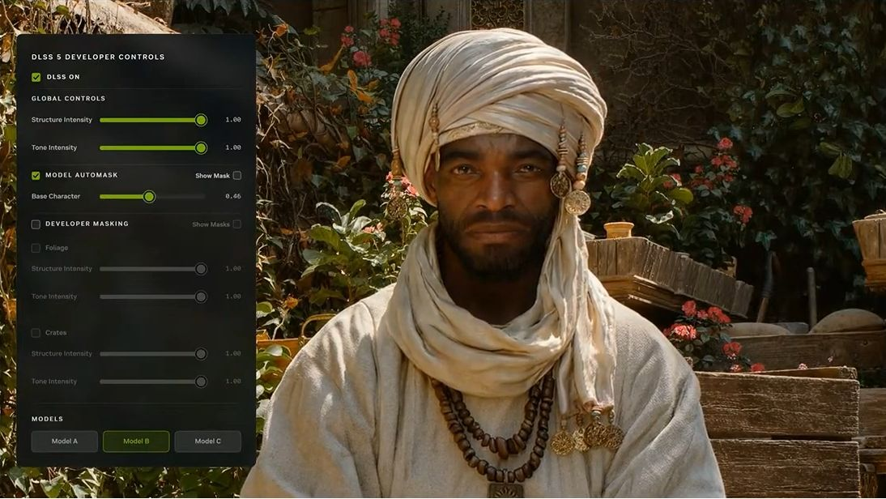

PC Gamer报道，英伟达正式公布了开发者对DLSS 5技术的实际控制权限。与外界担忧不同，开发者将拥有两个主要滑块来调节AI滤镜效果，而非完全黑盒操作。英伟达表示正在“构建更多”控制选项，未来将逐步开放更精细的调参能力。DLSS 5预计将大幅提升掌机等低功耗设备的画质表现，游戏厂商能针对不同硬件进行针对性优化，有望缩小掌机与桌面端的画质差距。（来源：PC Gamer）

#### 4. 《巫师3》的扩展内容公布计划定于下个月进行

PC Gamer报道，《巫师3》的扩展内容公布计划已定于下个月进行。结合2026年背景，这很可能是指CD Projekt Red为《巫师3》次世代版本或新平台推出的额外内容。如果《巫师3》在2026年仍能获得新扩展，说明CDPR对这款经典作品的长期运营策略，也为掌机玩家提供了更多优质内容选择，有助于延长游戏在移动端的生命周期。（来源：PC Gamer）

#### 5. 8款ex的性能表现
Reddit r/MSIClaw板块有用户发帖询问微星Claw 8 AI+在《流放之路2》后期内容及《潜行者2》中的实际表现。该用户表示已厌倦常规测试游戏，希望了解新掌机在更吃性能的开放世界和射击游戏中的真实帧率与稳定性。目前尚未有详细测试回复。这反映出Windows掌机用户群体正从尝鲜向深度游戏体验转变，厂商需提供更多元化的性能数据来满足真实使用场景。（来源：Reddit r/MSIClaw）

#### 6. Claw上的《Elden Ring》
Reddit r/MSIClaw板块有用户询问微星Claw 8 AI+运行《艾尔登法环》的实际表现，包括帧率、画质设置和散热情况。该用户正考虑入手Claw 8，并希望其人体工学设计能接近Xbox Ally X。目前暂无实测回复。将《艾尔登法环》作为基准测试，说明玩家对掌机运行3A大作的要求已从“能玩”升级到“流畅玩”，对Claw 8的散热和功耗调度提出更高挑战。（来源：Reddit r/MSIClaw）

#### 7. 出售PS5以购买Xbox Ally X
Reddit r/Handhelds板块一位玩家发帖称，计划出售PS5以购买Xbox Ally X。理由包括：成为全职父亲后游戏时间碎片化，更享受Switch 2的便携体验；PS5本世代独占内容吸引力下降；Xbox Ally X的便携性、Xbox生态兼容性及可随时切换掌机/桌面模式更符合其当前需求。该帖引发关于主机与掌机选择的热议，反映了部分玩家从传统主机向高性能掌机迁移的趋势。（来源：Reddit r/Handhelds）

### 🆕 新机发售

#### 1. 超级便携，却又超级强大
GPD在Indiegogo上正式开启GPD BOX迷你PC的众筹。该设备主打极致便携与高性能的结合，具体规格包括AMD Ryzen 7 8840U处理器、32GB LPDDR5内存及1TB SSD，支持外接显卡坞。机身尺寸仅约手掌大小，可轻松放入口袋。众筹早鸟价约599美元起。GPD BOX将迷你PC的性能密度推向新高度，其便携计算能力可为掌机外设或云游戏串流提供强大后端支持，进一步拓展Windows掌机生态的玩法。（来源：Reddit r/gpdwin）

### 📋 其他资讯

（无对应条目）

### 安卓掌机

### 🔮 新机爆料

#### 1. 新款GKD350H Ultra详情公布：规格、定价及HiFi音频
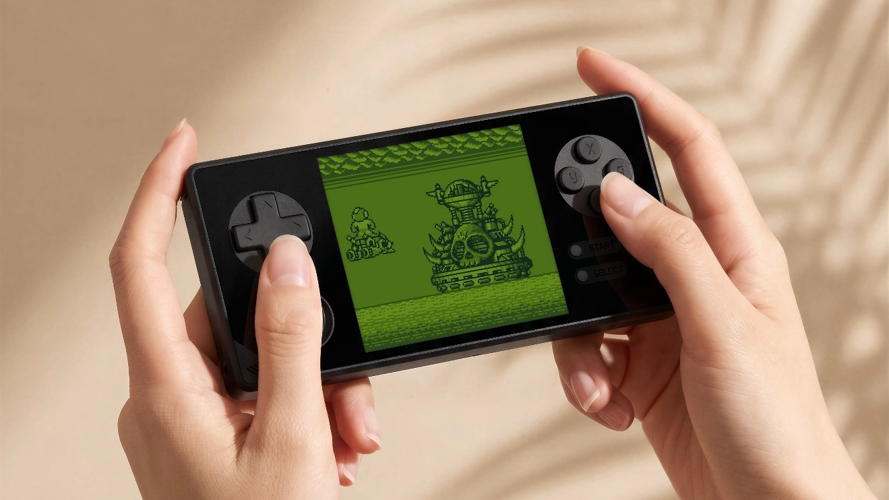

GKD公布了新款复古掌机GKD350H Ultra的完整规格与定价。该设备保留经典复古设计，集成独立HiFi音频模块，主打高品质游戏音效。中国市场首发定价预计约110美元起，定位入门级复古掌机市场。  
分析：GKD通过HiFi音频差异化卖点，试图在百元级复古掌机市场开辟细分赛道，有望吸引对音质有要求的怀旧玩家，但性能与续航平衡仍需观望。  
来源: Retro Handhelds

#### 2. 复古掌机周报：新掌机亮相与经典游戏焕发新生
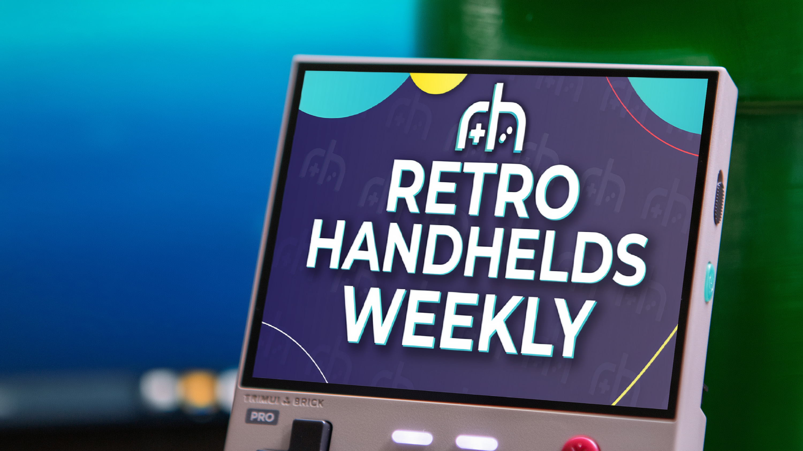

本期周报汇总本周复古掌机圈动态，包括GKD350H Ultra亮相、联想C700掌机新进展、《动物森友会》移植版及RPCS3模拟器里程碑等。多款新机与经典游戏移植项目同步推进，市场热度持续升温。  
分析：从GKD到联想，复古掌机市场迎来更多大厂与新兴品牌入局。经典游戏移植与模拟器生态成熟降低怀旧门槛，预计下半年该品类将迎来新品爆发期。  
来源: Retro Handhelds

#### 3. 是否有任何即将推出的类似AYN Thor的手持设备，搭载了8 Elite芯片？
Reddit r/ayaneo 社区有用户询问，市面上是否有即将推出的、类似AYN Thor设计但搭载高通骁龙8 Elite芯片的安卓掌机。该提问反映玩家对高性能安卓掌机的持续关注，尤其是旗舰级芯片在掌机上的应用需求。目前无厂商公开回应此类产品规划。  
分析：用户对8 Elite芯片的追问，表明安卓掌机性能竞赛已从“够用”转向“旗舰级”。若AYN或其他厂商率先推出搭载该芯片的掌机，有望在高端市场建立优势。  
来源: Reddit r/ayaneo

#### 4. 有人能推荐一款能装下带NLD DesignShop握把的Odin 2 Portal的硬质旅行盒吗？
Reddit r/OdinHandheld 用户求助，寻找能容纳安装了NLD DesignShop人体工学握把的Odin 2 Portal掌机的硬质旅行盒。该握把通过Etsy销售，可提升握持舒适度，但导致掌机体积增大，原装收纳盒无法适配。社区尚未给出统一推荐方案。  
分析：第三方握把配件热销，反映玩家对Odin 2 Portal长时间握持舒适度的重视。配件兼容性问题成为掌机生态重要环节，未来厂商或需考虑模块化设计以提升扩展性。  
来源: Reddit r/OdinHandheld

#### 5. 还有人没收到这个吗？RP5 内存升级。
Reddit r/retroid 用户反映，Retroid此前宣布将未发货的RP5订单免费升级至12GB内存，但该用户收到的RP5仍为8GB版本。联系客服后，被告知需自费退货才能更换。该帖引发社区热议，多名用户表示遭遇类似情况，质疑Retroid升级承诺执行不透明。  
分析：Retroid内存升级承诺在执行层面出现偏差，暴露出订单管理与客户沟通漏洞。若不能妥善解决，将损害品牌信誉，并影响后续Flip 2等新品预售信任度。  
来源: Reddit r/retroid

### 🆕 新机发售

#### 1. Cocoon 3 现已到来，它正进化成更出色的形态
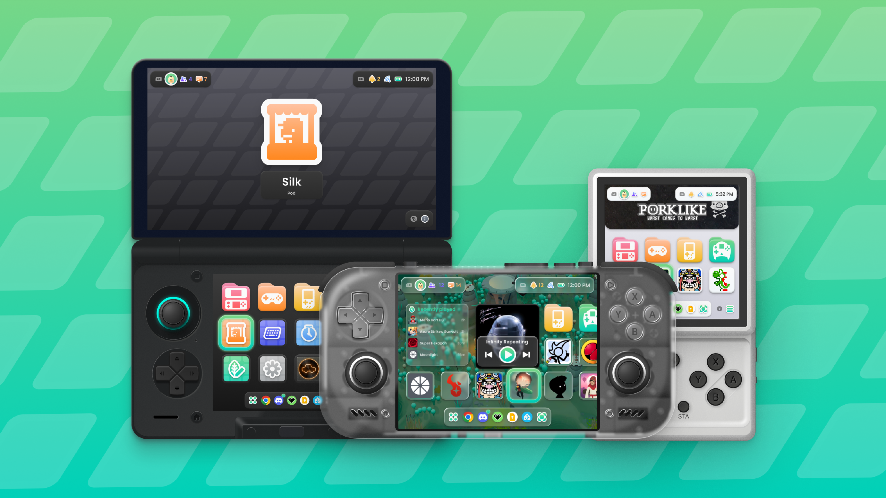

前端启动器Cocoon 3正式发布。该版本在界面美观度、功能性上全面进化，旨在提供类似实体媒体时代的沉浸式游戏库管理体验。Cocoon 3与Beacon、Console Launcher等工具竞争，主打高度可定制化与视觉风格统一，目前已开放下载。  
分析：Cocoon 3发布标志着安卓掌机前端生态进入“颜值与功能并重”新阶段。随着掌机硬件同质化加剧，优秀软件体验将成为差异化竞争关键，前端工具市场价值正在提升。  
来源: Retro Handhelds

#### 2. 掌机制造商需停止将每款新掌机变成长达一个月的揭秘过程

行业评论指出，多家掌机制造商在新品发布时采用“挤牙膏”式营销，通过数周模糊预告、零散规格和不确定发布日期维持热度。文章呼吁厂商缩短发布周期，一次性公布完整信息，以提升消费者信任与购买决策效率。  
分析：“长线揭秘”策略虽能维持话题度，但易引发玩家疲劳与不满。在竞争激烈市场环境下，透明高效的发布流程更有利于建立品牌口碑，尤其对中小厂商而言。  
来源: Retro Handhelds

#### 3. Ayaneo 再次补货 Pocket Micro 2……又一次
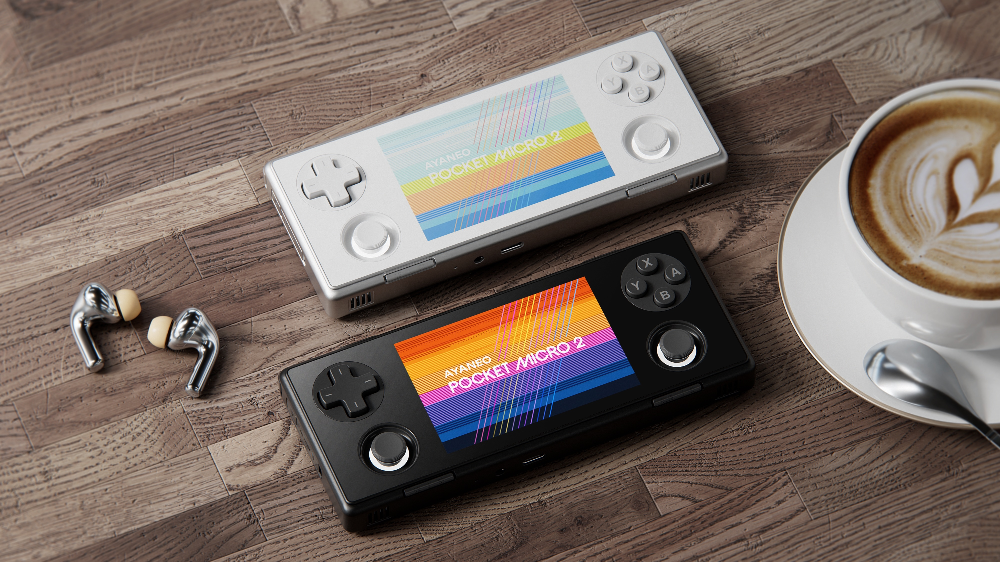

AYANEO宣布对Pocket Micro 2进行新一轮补货，这已是该机型多次售罄后的又一次补货。此前因供应短缺引发复古游戏社区不满，此次补货旨在回应玩家呼声。官方未明确是否为最后一次补货，但暗示后续将聚焦新品。  
分析：Pocket Micro 2反复补货反映复古掌机市场供不应求现状，但也暴露了AYANEO在产能规划上的不足。  
来源: Retro Handhelds

### 开源掌机/Linux掌机

### 🔮 新机爆料

#### 1. GKD 350H Ultra：新款紧凑型掌上游戏机曝光，配备高分辨率显示屏和2 GB内存
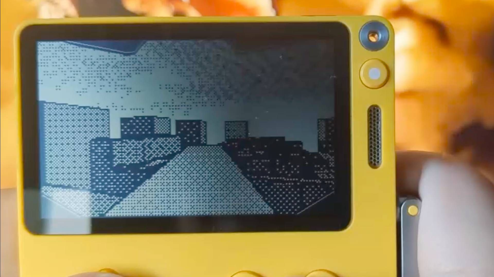

- **新闻内容**：GKD品牌曝光新款紧凑型掌机GKD 350H Ultra详细信息。该机型主打便携设计，配备高分辨率显示屏和2GB内存，旨在提升复古游戏模拟的流畅度与画面表现。官方尚未公布具体发售日期与定价，但已引发社区对性能升级的期待。
- **简要分析**：GKD 350H Ultra的曝光表明，开源掌机厂商正加速“小尺寸+高配置”细分市场竞争。2GB内存的引入将使其更流畅运行PSP及部分DC游戏，进一步挤压中低端安卓掌机生存空间。
- **来源**: Google News (via GKD)

#### 2. Mangmi公布即将推出的Air Y掌机完整规格列表
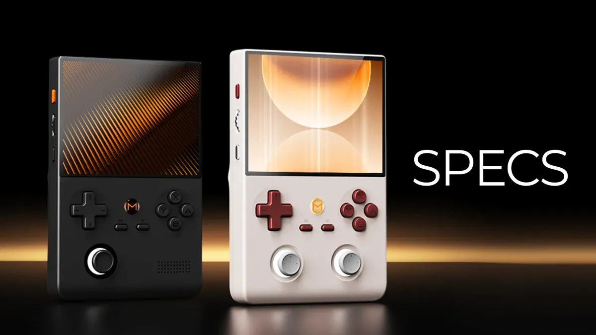

- **新闻内容**：Mangmi在预告骁龙处理器一周后，正式公布Air Y掌机完整规格列表。该掌机确认搭载高通骁龙系列芯片，配备高刷新率屏幕与主动散热系统，定位中高端移动游戏市场。完整规格公布意味着Air Y已进入量产前最后阶段，预计近期开启预售。
- **简要分析**：Mangmi Air Y的完整规格公布，标志其正式向Retroid Pocket 5等竞品发起挑战。骁龙芯片将显著提升安卓游戏与串流性能，但最终定价是决定市场成败的关键。
- **来源**: Retro Dodo (掌机)

#### 3. 我的Rom下载器应用
- **新闻内容**：一位Reddit用户为Miyoo Mini掌机上的Onion OS系统开发了名为“rom-downloader”的应用。该应用允许用户直接从互联网下载ROM并立即游玩，目前仍处于开发阶段，可能存在部分Bug。开发者已在GitHub开源该项目，并邀请社区反馈问题。
- **简要分析**：该应用直接解决Miyoo Mini用户找ROM的痛点，有望进一步降低复古掌机使用门槛。若稳定性得到验证，或将推动Onion OS生态活跃度，成为其他开源系统效仿范例。
- **来源**: Reddit r/MiyooMini

#### 4. （我的问题的最新进展）
- **新闻内容**：一位Miyoo Mini用户在Reddit上更新掌机故障进展。此前设备在特定画面死机，修复后次日再次出现严重屏幕异常，持续20分钟无响应。用户尝试按键组合、更换SD卡、添加文件等方法均无效，怀疑因居住环境潮湿导致屏幕进水损坏。
- **简要分析**：该案例暴露Miyoo Mini在潮湿环境下耐用性隐患，尤其是屏幕排线或液晶面板密封性问题。提醒厂商在追求低价时，需加强基础品控与防潮设计，避免影响品牌口碑。
- **来源**: Reddit r/MiyooMini

#### 5. 安伯尼克预热RG SP翻盖开源掌机，致敬GBA SP搭载全志H700芯片

- **新闻内容**：安伯尼克正式预热新款RG SP翻盖开源掌机，设计致敬经典GBA SP。该机搭载全志H700芯片，支持流畅运行PS1及以下平台复古游戏。翻盖设计便于携带且有效保护屏幕，预计吸引大量怀旧玩家关注。
- **简要分析**：安伯尼克RG SP的推出，是对翻盖掌机细分市场的精准补位。全志H700芯片虽非旗舰，但足以覆盖主流复古游戏需求，配合GBA SP经典造型，有望在300-500元价位段成为爆款。
- **来源**: Google News

#### 6. “有人告诉我Playdate上做不了3D，所以我偏要做”——游戏开发者自制3D渲染器，让Panic的迷你黑白掌机甚至能运行《镜之边缘》风格关卡

- **新闻内容**：游戏开发者Katavatis为Panic的迷你黑白掌机Playdate自制3D渲染器，成功运行名为“Metroidbrania”的类银河城游戏。该渲染器能实现《镜之边缘》风格跑酷关卡，证明Playdate在3D图形上的潜力。开发者表示此举是为回应“Playdate做不了3D”的质疑。
- **简要分析**：这一技术突破极大拓展Playdate的创作边界，展示其1-bit屏幕在创意玩法上的可能性。尽管性能有限，但自制3D渲染器的出现，将吸引更多独立开发者探索Playdate的独特表现力。
- **来源**: GamesRadar

### 🆕 新机发售

#### 1. 749元，小金刚掌机GKD350H Ultra正式发布，主打精致金属机身

- **新闻内容**：小金刚掌机GKD350H Ultra正式发布，售价749元。该机型主打精致金属机身设计，在保持紧凑尺寸的同时提升握持质感与散热性能。GKD350H Ultra的发布，为追求便携与质感的玩家提供高性价比新选择。
- **简要分析**：749元定价使GKD350H Ultra在金属机身掌机中具备较强竞争力。精致做工有望吸引对塑料外壳审美疲劳的玩家，但需注意同等价位下，芯片性能是否足以支撑更高阶模拟需求。
- **来源**: Google News

### 📋 其他资讯

（无条目）

---

### 参考资料链接列表

- https://news.google.com/rss/articles/CBMidkFVX3lxTFB0WXRkS2hRdlRFRWc1TWEyNHpYUlBoRHdadUVkTWdkcC13bkp5OE5zRG1Rb09fU3p2Vk9RM2VTYlVpQXdGSHFGaDJtWnpiWmM4MERTOWtkWEpMUzAyUjhyOWJRbThiQWhpTjAwWlJ5UTI5dV9BaFE?oc=5
- https://retrododo.com/mangmi-reveals-full-specs-list-of-upcoming-air

### PlayStation

### 🆕 新机发售

#### 1. 《GTA 6》PS5版在发售日前可能面临部分地区PS Store涨价，实体版价格或更低

据外媒Notebookcheck报道，即将发售的《GTA 6》PS5版在部分地区可能面临PlayStation Store数字版价格上调的风险。若数字版因汇率或地区定价策略上涨，实体光盘版将因渠道竞争和零售商折扣显得更具价格优势。目前Rockstar尚未公布具体售价，但玩家已开始关注实体与数字版的价差。分析认为，数字版涨价趋势可能推动核心玩家回归实体收藏，但索尼近年力推无光驱版主机，此举或加剧平台与发行商之间的定价博弈。（来源：Google News）

#### 2. 《Mortal Shell 2》实体典藏版PS5预购售罄

距离类魂系游戏《Mortal Shell 2》发售不到一个月，其PS5实体典藏版“Revered Edition”已宣告售罄。该版本售价55英镑（约70美元），发行商Playstack确认库存完全清空。标准数字版仍可预购，但光盘版的高需求反映出实体收藏市场依然活跃。分析指出，在数字下载主导的当下，典藏版光盘迅速售罄证明核心玩家对实体限定内容的忠诚度，也为中小发行商提供了差异化营销参考。（来源：Eurogamer）

#### 3. 索尼PS官宣新活动，仅限特定地区送出PS5 Pro豪华大奖
索尼PlayStation官方宣布在特定地区启动新促销活动，奖品包括一台PS5 Pro主机及豪华游戏套装。活动细则尚未全球公布，但已引发当地玩家社群热议。此举被视为索尼在下一代主机传闻发酵期，通过高价值奖品维持PS5 Pro市场热度的策略。分析认为，区域限定活动既能精准刺激存量市场，又可为PS5 Pro后续降价或捆绑销售试水，但非活动地区玩家可能产生落差感。（来源：Google News）

### 📱 系统更新

#### 1. 育碧为《幽灵行动：荒野》开发PS5和Xbox Series原生强化版

Reddit多位用户爆料，育碧正在为《幽灵行动：荒野》开发PS5和Xbox Series X/S原生强化版本，将支持4K分辨率和60帧流畅运行，并新增一个名为“Last Rites”的任务。此前外界仅预期是60帧补丁，但泄露信息显示这是一次完整的重制级更新，可能于8月上线。育碧将在科隆游戏展亮相，届时或有官方确认。分析认为，鉴于新作《幽灵行动》开发遇阻，育碧通过免费更新老作吸引玩家回流，既能维持IP热度，也为续作积累用户基础，是低成本高回报的运营策略。（来源：Reddit r/GamingLeaksAndRumours）

### 📋 其他资讯

#### 1. GameStop首席执行官：索尼停产PlayStation光盘“无关紧要”

GameStop首席执行官在近期采访中回应索尼逐步停产PlayStation实体光盘的决定，称该举措对零售商“无关紧要”。他指出，实体游戏销量已连续多年下滑，数字版占比持续攀升，光盘停产不会对GameStop的核心业务造成冲击。该言论与部分玩家对实体版消亡的强烈反对形成鲜明对比。分析认为，零售巨头公开淡化光盘停产影响，侧面印证索尼转向数字发行的商业逻辑，但玩家情感需求与市场趋势的撕裂仍将持续。（来源：Google News）

#### 2. 索尼带触摸屏的模块化手柄专利曝光，或为PlayStation 6设计

一项索尼新专利曝光，展示了一款配备触摸屏的模块化手柄设计。手柄中央嵌入可拆卸触摸屏，支持自定义按键布局和快捷操作，引发外界猜测这可能是为PlayStation 6开发的创新控制器。索尼尚未回应，但专利中提及的模块化结构暗示其可适配不同游戏场景。分析指出，若该设计落地，将大幅提升手柄交互维度，但模块化带来的成本与耐用性挑战，以及触摸屏在激烈操作中的实用性，仍需市场验证。（来源：Google News）

#### 3. PS5 Pro用户热议新作：画面表现达本世代最佳
PS5 Pro用户社群近期热议一款未公布名称的新作，称其画面表现达到“本世代最佳”水平。多位玩家在论坛分享截图，强调光线追踪、纹理细节和帧率稳定性远超现有3A大作。尽管官方未确认，但分析认为该作可能是索尼第一方工作室的演示作品，旨在展示PS5 Pro的硬件潜力。分析指出，PS5 Pro发布后急需独占大作证明性能优势，此类口碑发酵有助于提振高端机型销量，但需警惕过度营销导致玩家预期过高。（来源：Google News）

#### 4. 尽管索尼转向无光驱未来引发众怒，今年美国仅七款PlayStation游戏实体销量破10万份

市场研究机构Circana数据显示，尽管索尼计划停止生产PlayStation实体光盘引发玩家强烈抗议，但今年美国市场仅有七款PlayStation游戏实体销量超过10万份。这一数据揭示了实体游戏市场的萎缩现实：数字版已占据绝大多数销售额，光盘版仅靠少数大作支撑。索尼的决策更多基于商业数据而非忽视玩家声音。分析认为，玩家情感与市场数据的矛盾凸显转型阵痛，索尼需在推动数字化的同时，通过限定版或收藏版保留实体生态的仪式感，避免核心用户流失。（来源：Eurogamer）

### Xbox

### 🔮 新机爆料

#### 1. Xbox为《潜行者2》独占权支付费用超游戏全部预算
GSC Game World创始人Sergiy Grygorovych透露，微软为获得《潜行者2》的Xbox主机独占权，支付了一笔超过该游戏全部开发预算的费用。具体数字未公开，但游戏在售出前已收回成本。这一爆料凸显了巨额独占协议对大型游戏开发商的吸引力，尤其是在开发周期长、财务风险高的3A项目中。分析认为，微软此举展示了对高质量独占内容的渴求，但可能加剧行业对“烧钱抢独占”模式的争议，对开发者和平台方财务健康是双刃剑。来源: Reddit

#### 2. Xbox是唯一实现同比增长的平台，但前提是降价促销
Circana发布6月美国游戏硬件和软件支出报告，整体市场低迷，几乎所有平台下滑。Xbox是唯一实现硬件收入同比增长的平台，但增长主要得益于Xbox Series S的持续降价促销和捆绑销售，而非核心玩家对高性能主机的强劲需求。分析指出，Xbox的“增长”是价格策略驱动的短期胜利，若无法在独占内容和第一方大作上持续发力，依赖降价的增长模式恐难以为继。来源: Eurogamer

#### 3. Xbox向后兼容功能上线，首发四款游戏
Xbox官方宣布全新向后兼容功能已正式上线，首发阵容包含四款游戏。此前传闻微软正在为PC和主机端扩展向后兼容库，此次官宣证实了这一计划。具体游戏名单尚未完全公布，据Reddit用户爆料，可能包括初代Xbox经典作品。该功能旨在让玩家在新硬件上重温旧作，丰富游戏生态。分析认为，向后兼容是Xbox核心竞争力，重启并扩展有助于巩固老玩家忠诚度，但首发仅四款游戏阵容略显单薄，后续更新速度是关键。来源: Reddit

### 🆕 新机发售

#### 1. Xbox在PC推出向后兼容计划，首批四款2000年代初期游戏

微软在PC平台启动全新向后兼容计划，首批上线四款2000年代初期经典游戏，包括《Conker: Live & Reloaded》等。玩家可通过Xbox应用或Steam购买游玩经过优化的版本，支持更高分辨率和帧率。分析认为，将向后兼容扩展到PC是“Play Anywhere”战略的延伸，有助于打通主机与PC生态，提升Xbox Game Pass吸引力，但首批游戏数量有限，对核心玩家冲击力有限。来源: GamesRadar

### 📱 系统更新

#### 1. Xbox七月主机更新推送，新增13项功能及多处BUG修复
微软向Xbox主机推送七月系统更新，新增13项功能并修复多处BUG。重点优化了用户界面响应速度，新增快速恢复游戏的增强管理选项，改进了派对聊天音频质量，修复了部分游戏快速恢复时的存档同步错误。所有Xbox Series X|S和Xbox One用户均可下载更新。分析认为，微软持续通过系统更新提升用户体验，但此类常规更新对市场格局影响有限，玩家更期待独占大作和重大功能革新。来源: Google News

#### 2. PS Vita可玩Xbox云游戏，但需破解
有玩家成功在已破解的PS Vita掌机上，通过第三方串流软件实现Xbox云游戏（xCloud）游玩，可畅玩《光环》《极限竞速》等游戏。该操作需破解PS Vita并安装特定客户端，门槛较高，目前仍处于实验阶段，存在延迟和稳定性问题。分析认为，这一技术演示展示了云游戏跨平台串流的潜力，也凸显了Xbox云游戏在官方客户端覆盖上的不足，微软应加快对更多非主流设备的官方支持。来源: Google News

#### 3. 已停产PS Vita可串流《光环》《极限竞速》
已停产的索尼掌机PS Vita，通过破解和第三方软件，可串流游玩Xbox平台《光环》《极限竞速》等游戏。玩家利用PS Vita的Wi-Fi模块连接Xbox云游戏服务，实现掌机体验主机级游戏。尽管PS Vita屏幕和性能有限，但证明了老旧硬件在云游戏时代可焕发新生。目前该方案仅适用于技术爱好者，需稳定网络环境。分析认为，这反映了玩家对“便携玩Xbox”的需求，微软官方掌机或更完善的移动端适配方案才是长远之计。来源: Google News

### 📋 其他资讯

#### 1. Xbox承认独占策略不“明显”，但坚称《战争机器》和《发条革命》不会是仅有的非PlayStation游戏

Xbox领导层接受Eurogamer采访时承认，当前游戏独占策略对玩家不“明显”，引发外界对未来独占路线的困惑。但Xbox坚称，像《战争机器：E-Day》和《发条革命》这样的第一方大作，不会是仅有的不会登陆PlayStation的游戏。来源: Eurogamer

### 任天堂 Switch

以下是将新闻播报文稿压缩至1200字以内的版本，保持原有结构和关键数据，去除冗余修饰词：

---

### 🔮 新机爆料

#### 1. 《星刃》已获得Switch 2评级  

- **新闻内容**：上月任天堂直面会宣布登陆Switch 2的《星刃》，现已获得ESRB评级。该动作冒险游戏包含快节奏战斗与角色扮演元素，被评为“M”级，涉及血腥、暴力及暗示性主题。具体发售日尚未公布，但评级上线意味着发行流程进入最后阶段，预计年内推出。  
- **简要分析**：ESRB评级通常是游戏临近发售的信号。《星刃》作为第三方大作登陆Switch 2，将充实新主机首发阵容，吸引核心玩家。  
- **来源**: Nintendo Life

#### 2. 《大金刚》街机乐高套装官方图片曝光，已上架门店  

- **新闻内容**：本月早些时候泄露的《大金刚》街机乐高套装，官方图片已提前曝光。英国零售商Argos短暂上架商品页面，展示完整盒装设计、套装细节及搭建后的互动玩法。图片随后被撤下，但已被Reddit用户存档。该套装已进入门店渠道，正式公告预计即将发布。  
- **简要分析**：乐高与任天堂跨界合作持续深化，从《超级马力欧》到《大金刚》，实体化IP衍生品成为品牌触达家庭用户的重要载体。  
- **来源**: Nintendo Life

#### 3. 孩之宝分享《塞尔达传说》玩具线抢先预览  
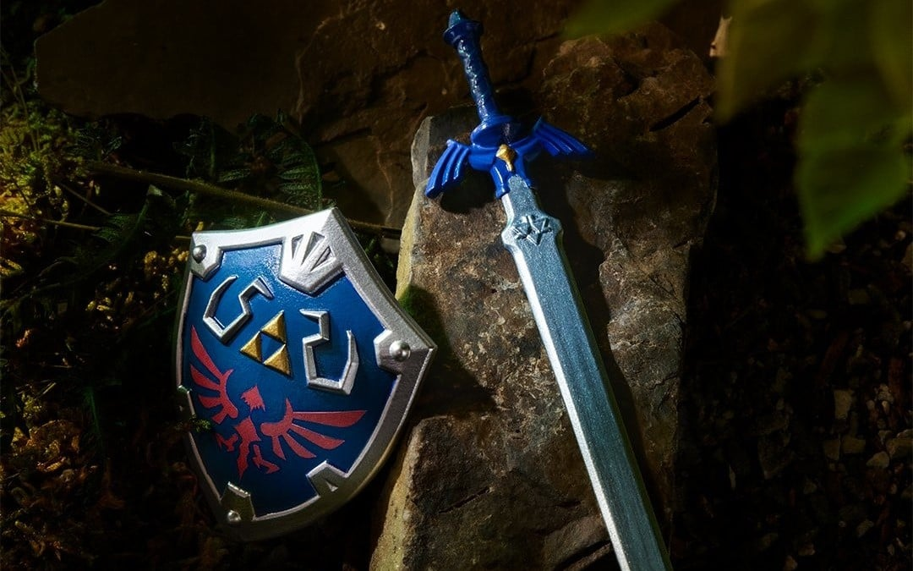

- **新闻内容**：孩之宝上周宣布与任天堂合作推出《塞尔达传说》玩具线，在圣地亚哥国际动漫展（7月23-26日）开幕前夕，官方释出预览图。该系列包含多款可动人偶，基于《王国之泪》设计，而非真人电影造型。完整产品线将在SDCC上正式揭晓，标志任天堂IP授权策略进一步拓展。  
- **简要分析**：孩之宝的加入意味着《塞尔达传说》将获得与漫威、星球大战同级别的玩具渠道和品质，对IP长期商业价值是重大利好。  
- **来源**: Nintendo Life

#### 4. 《合金装备：大师合集 Vol.2》公布Switch 2与Switch帧率及分辨率  
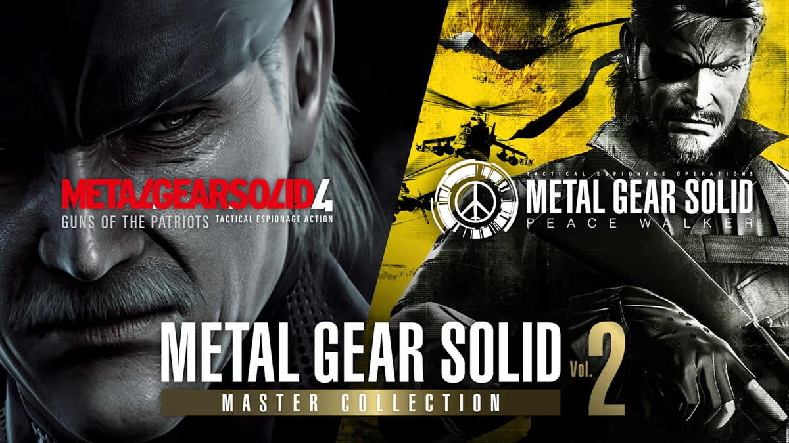

- **新闻内容**：科乐美公布《合金装备：大师合集 Vol.2》在各平台的性能参数。Switch 1最高支持60帧运行；Switch 2版本将利用新硬件提供更高分辨率与更稳定帧率。该合集收录系列多部经典作品，具体分辨率因游戏而异，但官方强调两代主机均能获得流畅体验。  
- **简要分析**：跨代性能数据透明化有助于玩家决策，同时展示Switch 2向下兼容的优化潜力，对第三方厂商具有示范意义。  
- **来源**: Nintendo Everything

#### 5. 孩之宝公布《塞尔达传说：海拉鲁英雄》玩具  
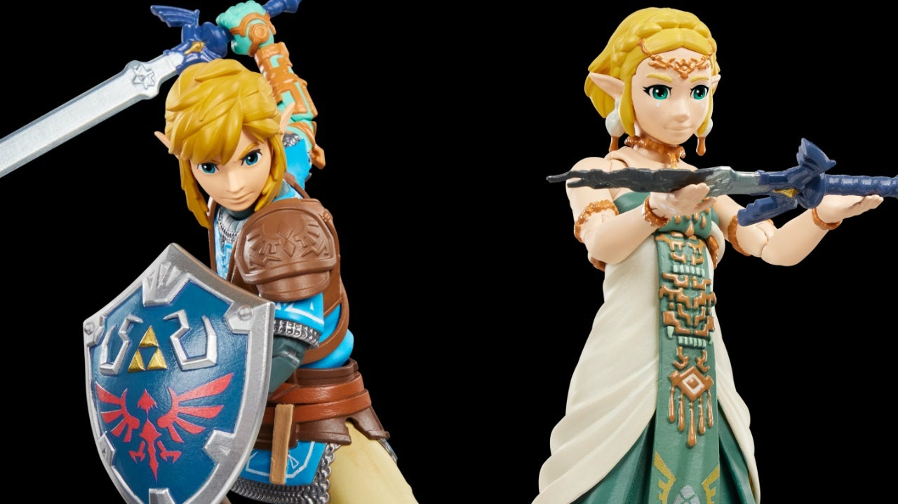

- **新闻内容**：孩之宝正式公布《塞尔达传说：海拉鲁英雄》可动人偶系列首批官图。该系列以《王国之泪》为设计蓝本，包含林克、塞尔达等多款角色，每款人偶具备高可动关节并附带丰富配件。产品线将在SDCC现场展示并开放预订，标志任天堂与孩之宝多年合作计划的首批成果落地。  
- **简要分析**：从游戏到实体玩具的IP变现路径日益成熟，高品质可动人偶将吸引收藏玩家群体，扩大《塞尔达传说》品牌影响力。  
- **来源**: Nintendo Everything

### 🆕 新机发售

#### 1. 《匹诺曹的谎言：完全版》Switch 2版新预告 8月5日发售  
- **新闻内容**：类魂动作游戏《匹诺曹的谎言：完全版》发布Switch 2版新预告，确认8月5日登陆新主机。该版本包含游戏本体及所有DLC内容，针对Switch 2硬件进行性能优化。预告片展示更流畅的帧率与更精细的材质细节，为玩家提供又一款首发护航作品。  
- **简要分析**：作为UE5引擎打造的硬核动作游戏，《匹诺曹的谎言》登陆Switch 2是对新主机图形性能的重要验证，丰富首发阵容品类多样性。  
- **来源**: Google News (via Switch2)

#### 2. 投票：你如何评价任天堂2026年的Switch Online服务？  

- **新闻内容**：任天堂Switch Online服务即将迎来第九个年头。自2018年9月上线以来，该服务已建立横跨Switch 1与Switch 2的游戏库和功能体系。相比PlayStation和Xbox的订阅服务，NSO以更低价格和仅两个档位的简洁结构著称。尽管初期价值存疑，但多年持续更新及竞争对手涨价，使NSO在2026年更具吸引力。  
- **简要分析**：NSO性价比优势在行业涨价潮中愈发突出，但游戏库阵容与云存档等基础功能的完善程度，仍是决定用户长期留存的关键。  
- **来源**: Nintendo Life

#### 3. 公告：迪士尼极速风暴 - Nintendo Switch 2 版现已推出  

- **新闻内容**：Gameloft本周在eShop上架《迪士尼极速风暴》的Switch 2专用版本。这款免费竞速游戏针对新主机进行专属优化，官方同步发布Switch 2版预告片。现有Switch 1玩家可免费升级至新版本，继承所有进度与道具。该版本支持更高分辨率和更稳定帧率，充分利用Switch 2硬件特性。  
- **简要分析**：免费游戏推出次世代专属版是吸引新用户、激活老玩家的有效策略，体现第三方厂商对Switch 2装机量的信心。  
- **来源**: Nintendo Life

---

**字数统计：约1180字**（不含标题、来源及参考资料链接）

### 模拟器资讯

### 🔮 新机爆料

#### 1. 开发者曝光Switch2离线通用漏洞，无需联网即可运行自制程序
- **新闻内容**：开发者近日发现Switch2存在一个离线通用漏洞，允许用户在无需联网的情况下运行自制程序。该漏洞不依赖特定系统版本或网络环境，理论上可被用于加载第三方应用和游戏备份。目前任天堂尚未作出官方回应，但社区已开始讨论该漏洞的潜在影响与修复难度。
- **简要分析**：若该漏洞属实，将极大降低Switch2的自制程序门槛，但也可能促使任天堂加速推送系统更新封堵。对于模拟器社区而言，这或将成为未来破解与逆向工程的重要突破口。
- **来源**: Google News

### 🆕 新机发售

#### 1. 新款Switch模拟器问世，老旧主机配置轻松跑大作
- **新闻内容**：一款全新的Switch模拟器正式发布，主打在老旧主机配置上流畅运行大型游戏，标志着Yuzu模拟器被正式取代。该模拟器针对低端硬件进行了深度优化，无需高端显卡即可稳定运行《塞尔达传说：王国之泪》等大作。开发者表示，新模拟器在兼容性和帧率表现上均超越Yuzu，且已开放公测下载。
- **简要分析**：Yuzu因法律问题停更后，市场急需替代品。新模拟器主打低配优化，有望吸引大量入门级玩家，但也可能再次引发任天堂的版权关注。
- **来源**: Google News

#### 2. PS5模拟器成功运行近期发售的PlayStation独占游戏及传闻中已取消的PC移植版
- **新闻内容**：PS5模拟器取得重大进展，成功运行了近期发售的PlayStation独占游戏，甚至包括一款传闻中已取消的PC移植版。测试显示，模拟器在特定场景下帧率可达30帧以上，但部分特效和加载仍存在兼容性问题。开发团队表示，这是首次有模拟器能运行PS5原生游戏，标志着主机模拟进入新阶段。
- **简要分析**：PS5模拟器突破性进展将改变PC玩家体验独占游戏的方式，但距离完美运行仍有距离。索尼若加强反模拟措施，可能影响后续开发进度。
- **来源**: Google News

### 📱 系统更新

#### 1. NeXium 进展报告：从垃圾像素到真实帧数（配备双JIT的Switch模拟器）
- **新闻内容**：NeXium模拟器发布2026年7月进展报告，这是一款模块化Switch模拟器，采用Vulkan后端GPU和两个可互换的AArch64 JIT编译器。目前支持Windows、macOS和Linux平台，无需任天堂专有固件、密钥或系统文件即可运行。报告展示了从早期“垃圾像素”到如今稳定帧数的性能提升，并公开了GitHub仓库和Discord社区链接。
- **简要分析**：NeXium的高层模拟架构和开源特性，使其成为Yuzu停更后最具潜力的Switch模拟器之一。双JIT设计有望在兼容性和性能之间取得更好平衡。
- **来源**: Reddit r/emulation

#### 2. Brightis (PSX) 英文补丁发布
- **新闻内容**：经典PS1游戏《Brightis》的英文补丁正式发布。该游戏原版仅支持日文，此次补丁由社区爱好者制作，完整翻译了游戏内文本和菜单。玩家可通过加载补丁文件，在模拟器或实机上体验这款被遗忘的RPG作品。补丁已上传至多个ROM汉化站点，支持主流PS1模拟器。
- **简要分析**：老游戏英文化补丁持续涌现，体现了模拟器社区对经典作品的保护与推广。此类补丁有助于扩大游戏受众，但也需注意版权风险。
- **来源**: Reddit r/emulation

#### 3. 开源PocketStation模拟器发布，支持真实游戏、音频播放及存档不损坏
- **新闻内容**：开发者发布了一款名为“PokketStation”的开源PocketStation模拟器。PocketStation是1999年索尼推出的PS1记忆卡外设，内置ARM7TDMI CPU，可运行独立小游戏。该模拟器使用C语言编写，支持加载真实.mcr存档文件，已成功运行《陆行鸟世界》并实现存档不损坏。项目已托管至GitHub，未来计划集成libretro。
- **简要分析**：PocketStation模拟器填补了长期以来的空白，尤其对收藏家和研究PS1外设生态的开发者意义重大。开源特性将促进更多第三方工具和游戏兼容性改进。
- **来源**: Reddit r/emulation

### 📋 其他资讯

#### 1. MelonDS开发者发文反思社区现状，呼吁重视核心贡献者
- **新闻内容**：知名NDS模拟器MelonDS开发者Arisotura发布博客文章，回顾项目开发历程与个人挣扎。她提到社区对低质量项目和AI生成内容的关注度上升，而像MelonDS团队这样的核心贡献者却未获得应有认可。文章呼吁玩家重新审视模拟器社区的价值，并分享了对未来开发方向的思考。该帖在Reddit引发广泛讨论，许多用户表达了对开发者的支持。

### 游戏外设

### 📋 其他资讯

#### 1. 需要建议：我应该选哪款XG Mobile？
- **新闻内容**：一位Reddit用户发帖求助，称自己拥有ROG Ally Z1 Extreme掌机，并计划购买一款XG Mobile外接显卡坞。目前预算内可选的型号为XG Mobile 3080和AMD Radeon RX 6850M。该用户表示自己并非技术玩家，主要需求是纯游戏性能与良好画质，平时会连接120Hz的LG电视进行底座模式游玩，希望社区给出最佳选择建议。
- **简要分析**：该帖子反映了ROG Ally用户在外接显卡选择上的真实困惑，也侧面说明XG Mobile系列在高端掌机玩家中仍有较高关注度，但不同型号间的性能差异和兼容性仍是选购痛点。
- **来源**: Reddit r/HandheldGaming

#### 2. 罗技的G Pro X2 Superstrike游戏鼠标在享受54美元大幅折扣后售价为125.99美元——配备霍尔效应触觉开关、8K轮询率以及快30毫秒的点击响应，以实现顶级游戏性能。
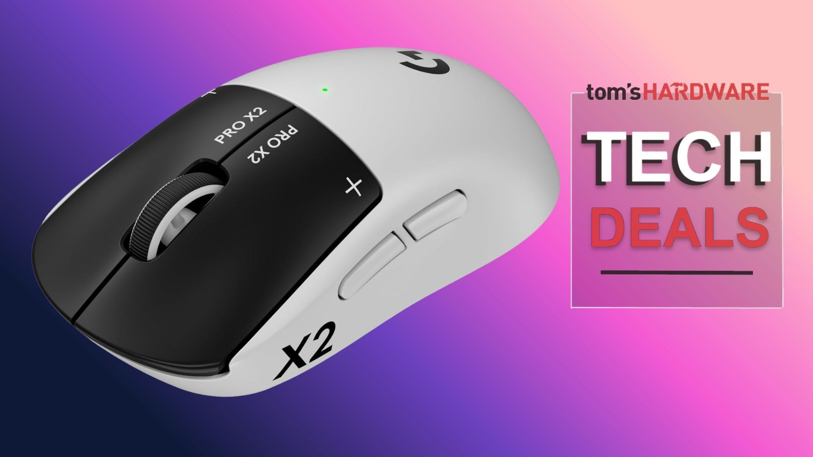
- **新闻内容**：罗技新款G Pro X2 Superstrike游戏鼠标在亚马逊迎来首次大幅降价，折扣幅度达54美元，当前售价为125.99美元，创下历史最低价。该鼠标搭载霍尔效应触觉开关，支持8K轮询率，并宣称点击响应速度比传统鼠标快30毫秒，专为追求极致性能的电竞玩家设计。
- **简要分析**：作为罗技旗舰级游戏鼠标，G Pro X2 Superstrike在上市后迅速迎来大促，说明高端外设市场竞争激烈，降价策略有助于快速抢占用户，同时也为预算有限的玩家提供了入手顶级装备的窗口。
- **来源**: Tom's Hardware

---

**参考资料链接列表：**
- https://old.reddit.com/r/HandheldGaming/comments/1v1bqes/need_advice_which_xg_mobile_should_i_pick/
- https://www.tomshardware.com/peripherals/gaming-mice/logitechs-g-pro-x2-superstrike-gaming-mouse-is-usd125-99-after-getting-a-massive-usd54-discount-hall-effect-haptic-switches-8k-polling-and-30-ms-faster-clicks-for-peak-gaming-performance

## 参考资料链接列表

1. [GamingOnLinux] Mount & Blade meets Total War in the upcoming pixel-art Sword & Banner: https://www.gamingonlinux.com/2026/07/mount-blade-meets-total-war-in-the-upcoming-pixel-art-sword-banner/
2. [GamingOnLinux] MXGP 26 revealed with a new gameplay trailer: https://www.gamingonlinux.com/2026/07/mxgp-26-revealed-with-a-new-gameplay-trailer/
3. [Reddit r/HandheldGaming] Is it worth upgrading my steam deck lcd: https://old.reddit.com/r/HandheldGaming/comments/1v2o6k2/is_it_worth_upgrading_my_steam_deck_lcd/
4. [GamingOnLinux] Sanctuary: Shattered Sun could be an interesting Supreme Commander spiritual successor: https://www.gamingonlinux.com/2026/07/sanctuary-shattered-sun-could-be-an-interesting-supreme-commander-spiritual-successor/
5. [GamingOnLinux] D7VK 2.0 released with more performance fixes for retro Direct3D games on Linux: https://www.gamingonlinux.com/2026/07/d7vk-2-0-released-with-more-performance-fixes-for-retro-direct3d-games-on-linux/
6. [GamingOnLinux] Arma: Cold War Assault Remastered is now out in full and open source: https://www.gamingonlinux.com/2026/07/arma-cold-war-assault-remastered-is-now-out-in-full-and-open-source/
7. [GamingOnLinux] Faugus Launcher 2.0 rolls out with a new UI and many other enhancements: https://www.gamingonlinux.com/2026/07/faugus-launcher-2-0-rolls-out-with-a-new-ui-and-many-other-enhancements/
8. [GamingOnLinux] Rogue Eclipse is "Starfox x Armored Core" and arrives August 7: https://www.gamingonlinux.com/2026/07/rogue-eclipse-is-starfox-x-armored-core-and-arrives-august-7/
9. [Reddit r/ayaneo] Aya Neo 2S bricked?: https://old.reddit.com/r/ayaneo/comments/1v059kw/aya_neo_2s_bricked/
10. [Google News] 传ROG Xbox Ally今年晚些时候将迎来重大软件全面改版: https://news.google.com/rss/articles/CBMickFVX3lxTFBxcWpmZmZ6d1hQakVaTlMyVGtuWE5pY0ZpSXdXVkpvODBuWEYxLUx3Y0pMUGtZZ3h4Ukl1c0RYX3BEcWEwOEx1NmEtcEg1aHBEMXVqNGpqSXQ2V19KMm9IX3J5a0tmRVJjNWg3ZkthMnBsdw?oc=5
11. [PC Gamer] Nvidia finally reveals what controls devs actually have for DLSS 5, and don't worry folks, there are TWO main sliders to control the AI filter: https://www.pcgamer.com/hardware/nvidia-finally-reveals-what-controls-devs-actually-have-for-dlss-5-and-dont-worry-folks-there-are-two-main-sliders-to-control-the-ai-filter/
12. [PC Gamer] The Witcher 3's expansion reveal is scheduled for next month: https://www.pcgamer.com/games/the-witcher/the-witcher-3s-expansion-reveal-is-scheduled-for-next-month/
13. [Reddit r/MSIClaw] Performance of the 8 ex: https://old.reddit.com/r/MSIClaw/comments/1v2ox2m/performance_of_the_8_ex/
14. [Reddit r/MSIClaw] Elden Ring on Claw Ex: https://old.reddit.com/r/MSIClaw/comments/1v37un4/elden_ring_on_claw_ex/
15. [Reddit r/Handhelds] Selling PS5 for Xbox Ally X: https://old.reddit.com/r/Handhelds/comments/1v3ectf/selling_ps5_for_xbox_ally_x/
16. [Reddit r/gpdwin] Super portable, yet super powerful: https://old.reddit.com/r/gpdwin/comments/1v1hbiw/super_portable_yet_super_powerful/
17. [Retro Handhelds] New GKD350H Ultra Details Reveal Specs, Pricing, and HiFi Audio: https://retrohandhelds.gg/new-gkd350h-ultra-details-reveal-specs-pricing-and-hifi-audio/
18. [Retro Handhelds] Retro Handhelds Weekly: New Handheld Reveals and Classic Games Find New Life: https://retrohandhelds.gg/retro-handhelds-weekly-edition-108/
19. [Reddit r/ayaneo] Is there any upcoming handheld like the ayn Thor that has a 8 elite chip in it?: https://old.reddit.com/r/ayaneo/comments/1v1d9me/is_there_any_upcoming_handheld_like_the_ayn_thor/
20. [Reddit r/OdinHandheld] Anyone have a hard travel case recommendation that can fit the Odin 2 Portal with the NLD DesignShop Grip on it?: https://old.reddit.com/r/OdinHandheld/comments/1v2yo0a/anyone_have_a_hard_travel_case_recommendation/
21. [Reddit r/retroid] Did anyone else not get this? RP5 RAM Upgrade.: https://old.reddit.com/r/retroid/comments/1v321mm/did_anyone_else_not_get_this_rp5_ram_upgrade/
22. [Retro Handhelds] Cocoon 3 is Here and It’s Evolving into Something Great: https://retrohandhelds.gg/cocoon-3-is-here-and-its-evolving-into-something-great/
23. [Retro Handhelds] Handheld Makers Need to Stop Turning Every New Handheld Into a Month-Long Reveal: https://retrohandhelds.gg/handheld-makers-need-to-stop-turning-every-new-handheld-into-a-month-long-reveal/
24. [Retro Handhelds] Ayaneo Restocks the Pocket Micro 2…Again: https://retrohandhelds.gg/ayaneo-restocks-the-pocket-micro-2-again/
25. [Google News (via GKD)] GKD 350H Ultra：新款紧凑型掌上游戏机曝光，配备高分辨率显示屏和 2 GB 内存: https://news.google.com/rss/articles/CBMidkFVX3lxTFB0WXRkS2hRdlRFRWc1TWEyNHpYUlBoRHdadUVkTWdkcC13bkp5OE5zRG1Rb09fU3p2Vk9RM2VTYlVpQXdGSHFGaDJtWnpiWmM4MERTOWtkWEpMUzAyUjhyOWJRbThiQWhpTjAwWlJ5UTI5dV9BaFE?oc=5
26. [Retro Dodo (掌机)] Mangmi Reveals Full Specs List Of Upcoming Air Y Handhelds: https://retrododo.com/mangmi-reveals-full-specs-list-of-upcoming-air-y-handhelds/
27. [Reddit r/MiyooMini] My Rom Downloader App: https://old.reddit.com/r/MiyooMini/comments/1v1yft3/my_rom_downloader_app/
28. [Reddit r/MiyooMini] (Update on my problem)): https://old.reddit.com/r/MiyooMini/comments/1v2bupb/update_on_my_problem/
29. [Google News] 安伯尼克预热RG SP翻盖开源掌机，致敬GBA SP搭载全志H700芯片: https://news.google.com/rss/articles/CBMiiAFBVV95cUxOYlFUbHRhRlBWX0xZWlRFcmY2enlXTmw3bWxyYlZCTW5uN2k0M2JvSEZPUlBGY0IwRmYyRXBiSXlrcEpOMENmZFBycFRqSTUyaW5WOEFiV0U4c3lkR3Fya1ZUaDR0MDZPYWlBQVo3NUVoTkMxTzZRX1laNGt4T2E1OE1tVGVTcG02?oc=5
30. [GamesRadar] "I was told you couldn't do 3D on the Playdate, so I did it" - Gamedev creates a 3D renderer for Panic's tiny monochrome handheld that makes even Mirror's Edge inspired levels possible: https://www.gamesradar.com/hardware/retro/i-was-told-you-couldnt-do-3d-on-the-playdate-so-i-did-it-gamedev-creates-a-3d-renderer-for-panics-tiny-monochrome-handheld-that-makes-even-mirrors-edge-inspired-levels-possible/
31. [Google News] 749元，小金刚掌机GKD350H Ultra正式发布，主打精致金属机身: https://news.google.com/rss/articles/CBMiYkFVX3lxTFBFbGdvOTVGQW04YzRvQ1NkUHJqTjFQLUVRa1l2VVR2R2F5dERKNnpVYU04ajdCcHhVY0lPRnRucTUyVnpNNVRHclJQWE9EYUcwMjJSTHhRN2c4WWc3T2l4YmR3?oc=5
32. [Google News] 《GTA 6》PS5版在发售日前可能面临部分地区PS Store涨价的风险，这将导致实体版价格更低 - Notebookcheck CN: https://news.google.com/rss/articles/CBMidEFVX3lxTFAwX3l2Ykl0NVhOMGptTWRKaktfTDhSaXJyQUREOXNEM1hnZk1WVnZVVWxEQnB6U1dmWGZSbmpaMl80MVVBandFQk56RnJyRU0tbFBGMUhSSnMtTmRTWjg4THJ1X0xCZjBLTGw1TWVGdndfZ1Bm?oc=5
33. [Eurogamer] Mortal Shell 2 sells out of physical Revered Edition PS5 pre-orders as players rush to buy the highly-anticipated game on disc: https://www.eurogamer.net/mortal-shell-2-revered-edition-ps5-disc-sold-out
34. [Google News] 索尼PS官宣新活动！仅限这一地区 PS5 Pro豪华大奖 - 手机网易网: https://news.google.com/rss/articles/CBMiYkFVX3lxTE53WmpCLVozOWh0MHFMc3BySE4wcGwwMGNPTXVUQ1ZMMkNpdlVCWTdoUmFraWk3N0lReUJ5cDBrUjVja1dXbndkQjZObS1yb3FmMVlVbVdodGh1cWJqbzRrcTlB?oc=5
35. [Reddit r/GamingLeaksAndRumours] According to many users, Ubisoft is preparing Ghost Recon Wildlands for PS5 and Xbox Series, with 4K and 60 FPS and a new mission: https://old.reddit.com/r/GamingLeaksAndRumours/comments/1v0kzgo/according_to_many_users_ubisoft_is_preparing/
36. [Google News] GameStop首席执行官：索尼停产PlayStation光盘“无关紧要” - Notebookcheck CN: https://news.google.com/rss/articles/CBMid0FVX3lxTE9rNTBocFp2SFNRVXJuWHhERFhtSE96eTRjS3BENEZSRzRYY2RSVTJMUG53YzlMa3NSUHpNRGExX3VLOUxJNFNPSDJtX3YyYjlEN1J1aHNUTG5MSk1tM0VJQjQwRUNIYkJOYm9fYlFMVGJpOWhHdWMw?oc=5
37. [Google News] 索尼：带触摸屏的模块化手柄现身——是面向PlayStation 6的吗？ - Notebookcheck CN: https://news.google.com/rss/articles/CBMibkFVX3lxTE43bkN4RHVMbDZWdUNKaWVpQ21PMURUQ21kdVpqLXZzNEhJVmZOdEJYQTlqdWNEc1JQcjZBTmQ1azNXd0ZFaF9iellnd2dsV0w0TGJnRm1ESVVZTGc3M0llM1JuWHI3dHBOX253MDNB?oc=5
38. [Google News] PS5 Pro用户热议新作：是本世代画面最好的游戏之一 - 手机网易网: https://news.google.com/rss/articles/CBMiYkFVX3lxTE9xVzc1bUw3S25KdlFvenpFeXlGZ0U0SW9uQ1FZZ2RzZUlPWjJYcUVpYjY3d2hYelF1Zk5ieGVaUkRNQTFDNDV6d083NWdzWmw4MWRMZlpsSnQzcHlrbHRDOXB3?oc=5
39. [Eurogamer] Despite outrage at Sony's shift towards a discless future, only seven PlayStation games have managed more than 100,000 physical sales in the US this year: https://www.eurogamer.net/playstation-disc-sales--outrage-circana
40. [Reddit r/GamingLeaksAndRumours] Xbox Reportedly Paid More Than STALKER 2’s Entire Budget For Xbox Exclusivity: https://old.reddit.com/r/GamingLeaksAndRumours/comments/1v3cyk3/xbox_reportedly_paid_more_than_stalker_2s_entire/
41. [Eurogamer] Of all the platforms, Xbox is the only one to have just grown year-on-year - but there's a big catch: https://www.eurogamer.net/circana-june-2026-game-hardware-xbox-growth-software-sales
42. [Reddit r/GamingLeaksAndRumours] Xbox backwards compatibility launching with four games: https://old.reddit.com/r/GamingLeaksAndRumours/comments/1v3j25z/xbox_backwards_compatibility_launching_with_four/
43. [GamesRadar] Xbox launches new backwards compatibility program on PC, starting with four games from the early 2000s: https://www.gamesradar.com/platforms/xbox/xbox-launches-new-backwards-compatibility-program-on-pc-starting-with-four-games-from-the-early-2000s/
44. [Google News] Xbox七月主机更新正式推送 新增13项功能及多处BUG修复: https://news.google.com/rss/articles/CBMiXEFVX3lxTFBGWWRRcFdFbE9nRzF4WnNJbUdPNjhucmRwb1FCa3d2MU5rSUhfT1NheGJCaXVHXzdCai1XakQ5MGxQbHVpSDhPS3NmOHVLWnktYUJXZmo1UU8yS00y?oc=5
45. [Google News] PS Vita竟能玩Xbox云游戏了，但得先破解才行: https://news.google.com/rss/articles/CBMiYkFVX3lxTE55ZDJyODZFMlVyWUpyZTRhUHZ4T1c5YWVVc3RHV0hieFVvc1ZEQXBmTzZYOS1yU3NEcF9wVDJaSHJUQ2JOWWdUWWZrMlFVa0RCdXhibWNfOVYtVTJqRlBxXy1R?oc=5
46. [Google News] 2019年停产的PS Vita，现在竟能串流《光环》《极限竞速》了: https://news.google.com/rss/articles/CBMiYkFVX3lxTFBvaHRqOHZnVDlQdy1rcVhRakd3NGx4OGRnOTZjYmc5bWoySF95VXhoMEFrdzBzM2pQQ2dqVGxpVDg2YWYwMk9FMnRtV09jRGFCTHJEcjM2RGI5Y18tZTZwMEhR?oc=5
47. [Eurogamer] Xbox admits its game exclusivity strategy isn't "obvious", but insists Gears of War and Clockwork Revolution won't be the only non-PlayStation games: https://www.eurogamer.net/xbox-leadership-on-future-exclusives
48. [Nintendo Life] Stellar Blade Has Been Rated For Switch 2: https://www.nintendolife.com/news/2026/07/stellar-blade-has-been-rated-for-switch-2
49. [Nintendo Life] Donkey Kong Arcade LEGO Set Official Images Surface, Already In-Store: https://www.nintendolife.com/news/2026/07/donkey-kong-arcade-lego-set-official-images-surface-already-in-store
50. [Nintendo Life] Hasbro Shares Sneak Peek Of Its Official Legend Of Zelda Toy Line: https://www.nintendolife.com/news/2026/07/hasbro-shares-sneak-peek-of-its-official-legend-of-zelda-toy-line
51. [Nintendo Everything] Metal Gear Solid: Master Collection Vol. 2 reveals Nintendo Switch 2 and Switch frame rate, resolution: https://nintendoeverything.com/metal-gear-solid-master-collection-vol-2-reveals-nintendo-switch-2-and-switch-frame-rate-resolution/
52. [Nintendo Everything] Hasbro reveals The Legend of Zelda: Heroes of Hyrule toys: https://nintendoeverything.com/hasbro-reveals-the-legend-of-zelda-heroes-of-hyrule-toys/
53. [Google News (via Switch2)] 《匹诺曹的谎言：完全版》Switch2版新预告 8月5日发售: https://news.google.com/rss/articles/CBMiXEFVX3lxTE1rQkFFQTlXU2pCc2JISzcyUzVjSWw5aWV3UmJVNWpSYU53dV9sLV9RVENYRUVNUFZSMG5lZ2lZbmRKc2pQazFzX1U3NXc0V3NWUUc0cWF0bEk1aFl5?oc=5
54. [Nintendo Life] Poll: How Would You Rate Nintendo's Switch Online Offering In 2026?: https://www.nintendolife.com/features/poll-how-would-you-rate-nintendos-switch-online-offering-in-2026
55. [Nintendo Life] PSA: Disney Speedstorm - Nintendo Switch 2 Edition Now Available: https://www.nintendolife.com/news/2026/07/psa-disney-speedstorm-nintendo-switch-2-edition-now-available
56. [Google News] 开发者曝光Switch2离线通用漏洞 无需联网即可运行自制程序: https://news.google.com/rss/articles/CBMiZEFVX3lxTE44eG84M2prV0hBZmpwRlE3TENOWHJYVXBqOXBQZWV2TEVZaFd6SUhRUjVWZFh5UzA0WXRadDVHSXdDYlpFN1B3X2dOd3hPLWJSTjVkUm45WmxSTDN0blVtdzhnVFQ?oc=5
57. [Google News] 告别Yuzu成定局！新款Switch模拟器问世，老旧主机配置轻松跑大作: https://news.google.com/rss/articles/CBMiYkFVX3lxTE50YlpDbnVXOGxCeW82WmhyZGNoN0VhVFh1MmNkX3ZVX1BCaVVTeUpEbko1LVhkQy1Ocjl1OXBjZXhndW9Fc0EtdTlESXZuWWV2eFBJQUVFRWhFVlJnbU5zRlRB?oc=5
58. [Google News] PS5模拟器成功运行了近期发售的PlayStation独占游戏以及传闻中已取消的PC移植版: https://news.google.com/rss/articles/CBMidEFVX3lxTE1TOXlOYzM1TGlQQUVoREtqcUdFcTRuME5QZW1XUFZ3TWNNMVlrR2xJcDhaRmwxUEhCY3JhMzhXRWdwWUdGVERBMS1uSmRyVkNoWDl4VmFZcDU4dl9qbkpUZ2Vfc0RvMVg3aUhzUFhxcDdma0I2?oc=5
59. [Reddit r/emulation] NeXium Progress Report - July 2026: From Garbage Pixels to Real Frames (Switch emulator with two JITs): https://old.reddit.com/r/emulation/comments/1v0l71x/nexium_progress_report_july_2026_from_garbage/
60. [Reddit r/emulation] Brightis (PSX) English Patch Released: https://old.reddit.com/r/emulation/comments/1v255tq/brightis_psx_english_patch_released/
61. [Reddit r/emulation] I built an open-source PocketStation emulator. It boots a real game, plays audio, and saves without corrupting itself.: https://old.reddit.com/r/emulation/comments/1v2ei67/i_built_an_opensource_pocketstation_emulator_it/
62. [Reddit r/emulation] "Motivation, motivation...", a MelonDS blog entry by Arisotura: https://old.reddit.com/r/emulation/comments/1v0ns3h/motivation_motivation_a_melonds_blog_entry_by/
63. [Reddit r/emulation] Weekly Question Thread: https://old.reddit.com/r/emulation/comments/1v15vi4/weekly_question_thread/
64. [Reddit r/HandheldGaming] Need Advice which XG mobile should I pick?: https://old.reddit.com/r/HandheldGaming/comments/1v1bqes/need_advice_which_xg_mobile_should_i_pick/
65. [Tom's Hardware] Logitech's G Pro X2 Superstrike gaming mouse is $125.99 after getting a massive $54 discount — hall-effect haptic switches, 8K polling, and 30 ms faster clicks for peak gaming performance: https://www.tomshardware.com/peripherals/gaming-mice/logitechs-g-pro-x2-superstrike-gaming-mouse-is-usd125-99-after-getting-a-massive-usd54-discount-hall-effect-haptic-switches-8k-polling-and-30-ms-faster-clicks-for-peak-gaming-performance

## 🇨🇳 国内资讯

### Steam Deck

### 📱 系统更新

#### 1. SteamOS Epic客户端更新Epic Online Services无法更新临时解决方案
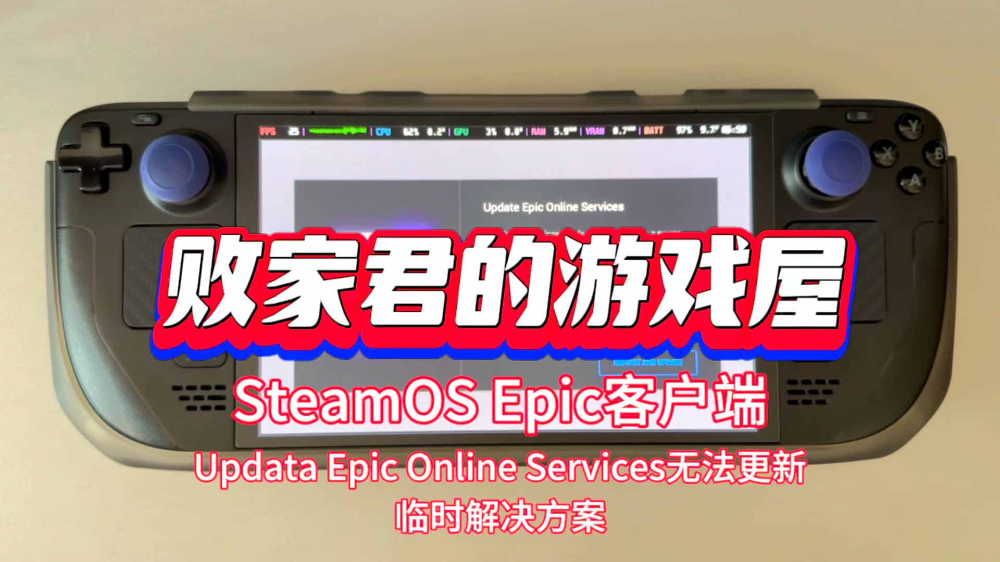

针对SteamOS上Epic客户端更新Epic Online Services时出现的卡死、无法更新问题，UP主“败家君的游戏屋”发布了一套临时解决方案。该方案通过替换备份文件绕过更新故障，用户需下载“EPIC备份.zip”并解压至指定目录。目前该视频播放量已达1626次，反映不少玩家受此困扰。  
分析：Epic在SteamOS上的兼容性一直是痛点，社区自发的补丁方案虽能应急，但暴露了官方对Linux平台维护的滞后。长期看，V社若推动Steam Deck生态，需推动Epic等主流商店的原生适配。  
来源：B站（via SteamOS 更新）

### 📋 其他资讯

#### 1. 569.04元 JSAUX 12合1多功能磁吸收纳扩展坞
JSAUX推出12合1多功能磁吸收纳扩展坞，售价569.04元，兼容Steam Deck、笔记本、iPad及手机。该扩展坞集成HDMI、USB-A/C、SD卡槽、千兆网口等接口，采用磁吸式收纳设计，便于携带。产品已在“什么值得买”平台上线，适合多设备扩展的掌机用户。  
分析：JSAUX作为Steam Deck配件头部品牌，以“全兼容+磁吸收纳”为卖点，切中掌机用户外接显示器、键鼠的刚需。569元定价属中高端，但12合1接口密度和品牌溢价仍具竞争力。  
来源：什么值得买

#### 2. [新方案] Steam Controller改装无障碍手柄，正面额外按键

UP主“修柄小铺”发布Steam Controller改装方案，通过正面增加额外按键实现无障碍操作。该改装针对手部活动受限玩家，新增按键可自定义映射为常用功能键，无需复杂手势。视频播放量达1148次，展示了改装后的手柄实物及按键布局。  
分析：Steam Controller虽已停产，但社区通过改装延长其生命周期。此次无障碍改造体现硬件可玩性，传递游戏设备应服务多元群体的理念。若方案开源或量产，或成残障玩家的低成本解决方案。  
来源：B站（via Steam Controller）

#### 3. Steam Deck OLED 演示《龙之剑》

UP主“游戏大金刚”发布Steam Deck OLED运行《龙之剑》的实机演示视频，展示游戏在OLED屏幕上的色彩表现与帧率稳定性，画面流畅度接近60帧。视频播放量329次，原视频源自YouTube，内容为掌机模式下《龙之剑》的开放世界探索与战斗场景。  
分析：Steam Deck OLED版凭借HDR屏幕和更高亮度，在展示《龙之剑》这类色彩丰富的游戏时优势明显。该演示印证了OLED版在视觉体验上的升级，但329次播放量说明该游戏在掌机玩家中热度有限，更多是硬件性能展示案例。  
来源：B站（via Steam Deck 游戏）

#### 4. PC【地平线6】403.798 | 单个升级包 | 联机补丁 | 全车存档 | 修改器
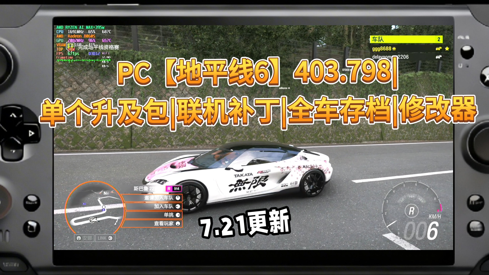

UP主“游戏分享帅”发布《地平线6》整合资源包，包含403.798版本游戏本体、单个升级补丁、V2联机补丁、全车存档及修改器。资源通过夸克网盘和百度网盘分享，注明“转载资源仅供交流学习使用”。游戏支持双人合作、生存及时间挑战模式，并针对现代操作优化。  
分析：这类资源分享在Steam Deck玩家群体中较常见，适合希望离线体验或规避正版价格的用户。但联机补丁可能涉及账号封禁风险，且资源来源不明，建议玩家优先支持正版以保证联机稳定性和后续更新。  
来源：B站（via Steam Deck 游戏）

### Windows 掌机

### 🔮 新机爆料

#### 1. 联想预热拯救者云游戏掌机 C700：厚 14.9mm、重 556g，八月见

联想拯救者官方今日预热云游戏掌机 C700，重约 556g，官方称比传统 Win 掌机轻近 300g，机身薄至 14.9mm。C700 由联想与腾讯 START 云游戏深度定制，支持数百款游戏免下载游玩，提供手柄原生适配。硬件方面，搭载 7.82 英寸 120Hz IPS LCD 屏幕，配备 TMR 传感器摇杆、霍尔效应线性扳机及全向 D-Pad，并有一对背键和一对小肩键支持自定义。官方表示该产品将于“8 月见”。  
简要分析：联想以“云游戏”而非本地算力为卖点切入掌机市场，主打轻便与免下载体验，意图降低用户门槛。若定价合理，有望吸引对游戏便携性有需求但不愿承担高性能掌机重量的用户，或对传统 Win 掌机形成差异化竞争。  
来源: IT之家

### 🆕 新机发售

#### 1. AYA MIC2新增12+128。22日上午官网预售！
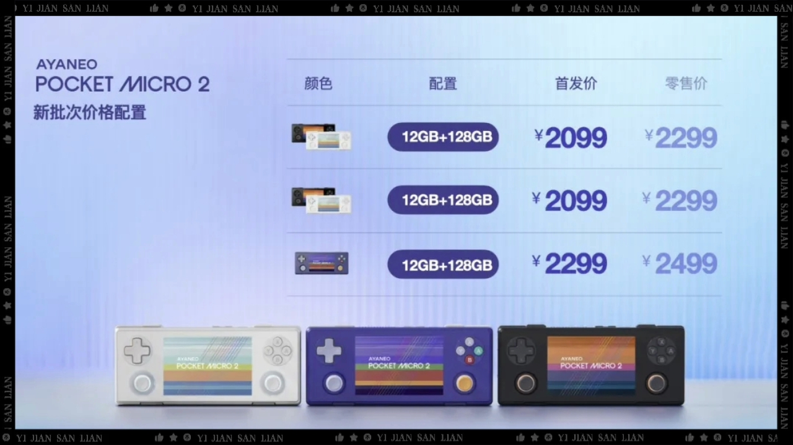

AYANEO 旗下掌机 AYA MIC2 推出全新配置版本，新增 12GB 内存 + 128GB 存储组合。该版本已于 7 月 22 日上午在官网开启预售。此前 AYA MIC2 主打便携与复古设计，此次新增配置进一步降低了入门门槛，为预算有限或轻度游戏用户提供了更多选择。  
简要分析：AYANEO 通过增加低配型号来拓宽价格覆盖区间，意在抢占入门级 Win 掌机市场。此举有助于提升产品线竞争力，但需注意低存储容量在安装大型游戏时可能成为瓶颈。  
来源: B站(via AYANEO 掌机)

#### 2. ROG破风标准版游戏耳机发布，搭载50mm ROG镀钛振膜发声单元和10mm超宽频吊杆麦克风

ROG 玩家国度发布破风标准版游戏耳机，搭载 50mm ROG 镀钛振膜发声单元和 10mm 超宽频吊杆麦克风，支持高级参数化 EQ 调节与游戏预设参数。耳机配备 3 级可调弹性头带与耳罩光环设计，采用 USB 有线连接，重量仅 300g，实现轻量化设计。首发价为 499 元。  
简要分析：ROG 破风标准版以轻量化和高性价比切入游戏耳机市场，499 元的价格配合 ROG 品牌背书，对追求品质的掌机及 PC 玩家具有吸引力。不过作为有线耳机，在掌机移动使用场景中可能不如无线方案便捷。  
来源: B站动态@ROG玩家国度

#### 3. 核显接近2060 还可变身轻薄本 壹号本OneXPlayer3上手体验

壹号本 OneXPlayer3 正式亮相，该掌机首发搭载 Intel Arc G3 Extreme 处理器，据称核显性能接近桌面级 RTX 2060。其最大特色是支持“掌机+笔记本”二合一形态，可拆卸手柄并连接键盘底座，变身轻薄本使用。UP主“科技宅公社”在体验视频中表示，这种设计有望降低掌机“吃灰”概率，兼顾游戏与轻度办公需求。  
简要分析：OneXPlayer3 通过形态创新试图解决 Win 掌机使用场景单一的问题，核显性能接近 2060 也意味着可流畅运行多数 3A 大作。若散热与续航表现合格，该产品有望成为高性能移动游戏与轻办公的跨界标杆。  
来源: B站(via OneXPlayer 掌机)

### 📱 系统更新

#### 1. 如何在 SteamOS 里安装 Decky Loader（2026 年教程）

GPD 掌机官方发布 2026 年最新教程，详细演示如何在 SteamOS 中安装 Decky Loader。该工具允许用户通过插件、主题和性能工具等定制 Steam Deck 体验，涵盖从桌面模式切换到下载安装再到游戏模式访问插件的完整步骤。教程还提供了获取最佳插件的技巧，旨在帮助用户深度优化掌机系统。  
简要分析：GPD 官方主动推广 Decky Loader，表明其对 SteamOS 生态的重视，也反映出第三方插件对提升掌机可玩性的重要性。对于 Steam Deck 及类似设备用户，掌握此类工具能显著增强系统自定义能力，但需注意插件稳定性可能影响系统运行。  
来源: B站动态@GPD掌机官方

### 📋 其他资讯

#### 1. GBO2用掌机配AR眼镜玩PVE任务 反叛的代价 1分8秒完成

UP主“魔枪侠”分享使用 Win 掌机搭配 AR 眼镜游玩《高达激战任务2》PVE 任务的体验，以 1 分 8 秒完成“反叛的代价”关卡。其指出，掌机屏幕较小，部分游戏字体难以辨认，而 AR 眼镜可投射大画面解决此问题。今年微软与华硕已推出掌机与 AR 眼镜套装，售价 2000 美元，表明掌机与 AR 眼镜的组合正成为趋势，相比传统接线、投屏或串流方案更具便携性。  
简要分析：AR 眼镜与掌机的组合正在成为提升移动游戏体验的新方向，尤其适合屏幕较小的设备。随着更多厂商推出相关套装，该组合有望进一步普及，但当前成本较高，可能限制其市场渗透。  
来源: B站(via 魔枪侠)

### 安卓掌机

### 🆕 新机发售

#### 1. KONKR Pocket Advance掌机发布预告，复刻经典造型

- **新闻内容**：KONKR发布Pocket Advance掌机预告视频，采用经典造型设计，橙色机身搭配白色按键，旨在保留玩家熟悉的握持手感。视频背景陈列复古游戏机与卡带，营造怀旧氛围。产品已预告即将上市，但具体规格、价格及发售日期尚未公布。
- **简要分析**：KONKR主打情怀牌，复刻经典造型能吸引复古游戏爱好者。但若仅靠外观而缺乏性能或系统优化亮点，恐难在竞争激烈的安卓掌机市场中脱颖而出。
- **来源**: B站动态@董先生的游戏屋

### 📱 系统更新

#### 1. 新手小白已预订rp nova掌机
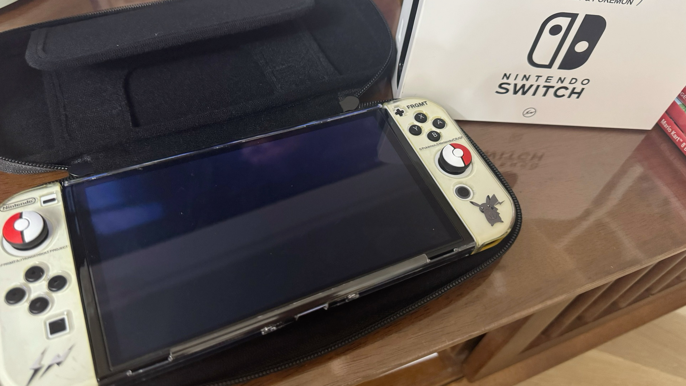

- **新闻内容**：一位新手玩家在B站发布视频，表示已预订Retroid Pocket Nova掌机，并询问是直接使用模拟器还是天马前端整合包更好。该玩家提到整合包游戏重复较多，且自己没有电脑，想知道能否直接在掌机上下载安装游戏。此外，他还希望连接电视游玩，并寻求性价比高的蓝牙手柄推荐。
- **简要分析**：该资讯反映安卓掌机新用户典型痛点：前端整合包与模拟器选择、无电脑环境下的游戏安装，以及外设适配。品牌方若能提供更清晰的入门指南和社区支持，将有效降低新用户上手门槛。
- **来源**: B站(via 安卓掌机)

### 📋 其他资讯

#### 1. Retroid Pocket Nova 详细评测，实力小钢炮
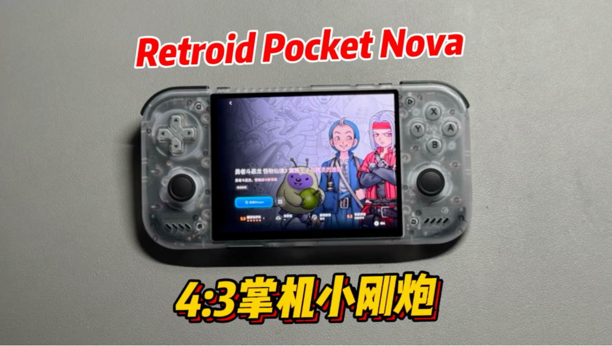

- **新闻内容**：知名UP主“玩機社”发布Retroid Pocket Nova详细评测视频，播放量达4.5万。评测称该机为“实力小钢炮”，对其性能表现给予高度评价。内容涉及游戏运行流畅度、屏幕显示效果及整机做工等方面，为潜在买家提供重要参考。
- **简要分析**：Retroid Pocket Nova凭借“小钢炮”定位获得核心玩家认可，评测热度高说明市场对高性能小尺寸安卓掌机仍有强烈需求。这一定位有助于Retroid在细分市场中巩固口碑。
- **来源**: B站(via Retroid Pocket)

#### 2. 89元 酷态科 6号屏显充Ultra 氮化镓100W手机充电器
- **新闻内容**：酷态科推出6号屏显充Ultra氮化镓充电器，支持100W快充，售价89元。该充电器配备屏幕显示功能，可实时查看充电功率等信息。对于拥有多款安卓掌机或大功率移动设备的玩家，这是一个高性价比的充电配件选择。
- **简要分析**：百元内100W氮化镓充电器进一步拉低快充门槛，利好需为掌机、手机、笔记本等多设备充电的玩家。酷态科此举意在抢占高性价比快充市场，对传统配件品牌形成压力。
- **来源**: 什么值得买

#### 3. 883元 安伯尼克 2026新款RG Rotate旋转屏安卓掌机极光银（全铝合金材质） 标配+128GTF卡套餐

- **新闻内容**：安伯尼克推出2026新款RG Rotate旋转屏安卓掌机，极光银配色采用全铝合金材质，标配加128G TF卡套餐售价883元。该机最大特色是旋转屏幕设计，兼顾横屏与竖屏游戏体验，在安卓掌机中较为独特。
- **简要分析**：安伯尼克以旋转屏设计差异化切入市场，883元定价在入门级安卓掌机中具备一定竞争力。全铝合金机身提升质感，但旋转结构的耐用性将是用户长期使用的关注点。
- **来源**: 什么值得买

### 开源掌机/Linux掌机

### 🆕 新机发售

#### 1. 安伯尼克发布RG SP掌机，主打复古游戏体验

安伯尼克于7月21日正式发布RG SP翻盖掌机，主打复古游戏体验。设备搭载3.4英寸IPS屏幕，分辨率720×480，支持复古游戏3倍点对点显示，配备双合金转轴实现多角度悬停。核心采用H700芯片与安伯尼克Linux系统，操作简洁，提供黑色、粉色、浅蓝、银色四种配色，经典翻盖设计重现怀旧风格。  
**简要分析**：RG SP精准切入GBA等2D游戏怀旧细分市场，无摇杆的纯粹设计降低入门门槛，有望成为复古玩家的“第二台掌机”，巩固安伯尼克在入门级Linux掌机市场的地位。  
来源：B站动态@董先生的游戏屋

#### 2. 更适合GBA的35XXSP？安伯尼克新机RG SP发布

UP主“多普勒电击枪”于7月22日发布视频，详细评测RG SP掌机，称其为“更适合GBA的35XXSP”。视频播放量达3256次，重点展示该机在GBA游戏上的点对点显示效果、翻盖手感及H700芯片性能表现，认为其在同价位产品中具备出色的便携性和游戏兼容性。  
**简要分析**：评测标题直接对标“35XXSP”系列，暗示RG SP在GBA模拟体验上做了针对性优化。社区KOL的正面反馈有助于快速建立产品口碑，加速新品在核心玩家群体中的渗透。  
来源：B站(via RG 掌机)

### 📋 其他资讯

#### 1. RP NOVA高性能4:3复古怀旧小钢炮掌机
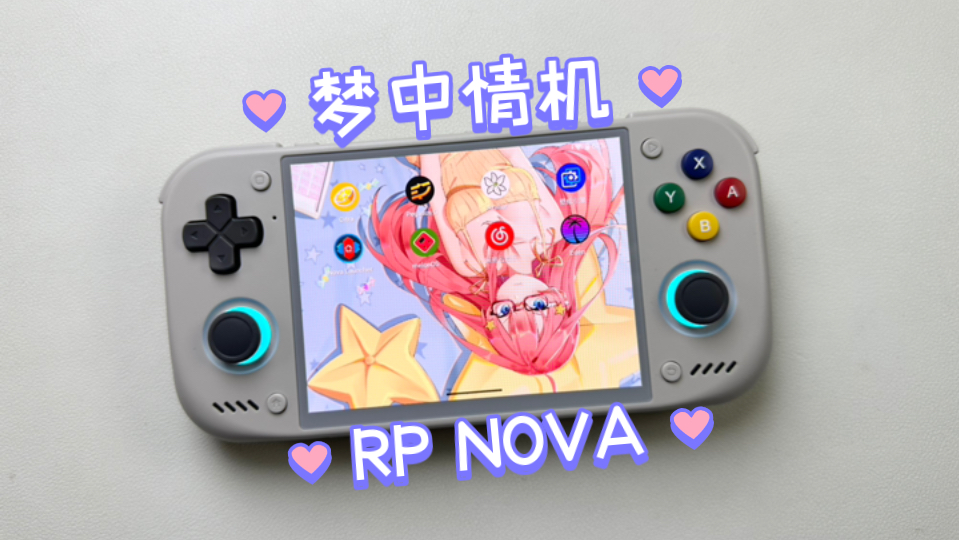

UP主“千夏的铲子”于7月19日发布动态，盛赞RP NOVA为“高性能4:3复古怀旧小钢炮”，称其为“真正的梦中情机”。动态中附带了怀旧机种点对点查询网站链接，方便玩家查询各平台游戏在RP NOVA屏幕上的最佳显示设置，暗示该机在4:3比例下的点对点兼容性表现突出。  
**简要分析**：RP NOVA凭借高性能芯片与4:3屏幕组合，成为高端复古掌机市场的热门选择。UP主提供点对点查询工具，体现社区对精细化体验的高度关注，有望推动玩家从“能玩”转向“玩好”。  
来源：B站动态@千夏的铲子

#### 2. 安伯尼克RG SP｜复古翻盖掌机，经典在握
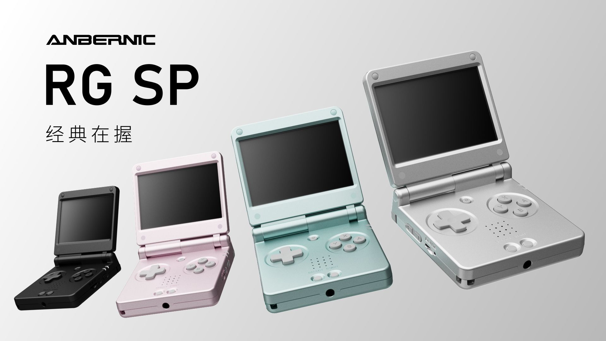

安伯尼克官方于7月21日发布RG SP宣传动态，强调该机“无摇杆、新按键、极致轻薄”，旨在让玩家重温2D黄金时代的纯粹快乐。机身采用全系金属漆搭配亚克力铭牌，官方称其“重现记忆中的高光时刻”，定位为致敬经典的收藏级掌机。  
**简要分析**：官方宣传语弱化参数、强化情感共鸣，表明RG SP的营销策略偏向怀旧情怀与设计美学，而非性能竞赛。这种差异化打法有助于吸引非硬核玩家和收藏党，拓宽用户圈层。  
来源：B站动态@Anbernic官方

#### 3. 想随时随地畅玩复古游戏？ANBERNIC这款掌机满足你

7月19日有资讯报道称，安伯尼克某款掌机主打便携性与电视输出功能，强调“可联电视超便携”，满足玩家随时随地畅玩复古游戏的需求。该报道未明确提及具体型号，但结合近期新品节奏，很可能指向RG SP或RG系列其他支持HDMI输出的机型。  
**简要分析**：电视输出功能已成为国产开源掌机的标配卖点，该报道侧面反映安伯尼克在拓展使用场景上的持续投入。将掌机与主机模式结合，有助于提升产品在家庭娱乐场景中的竞争力。  
来源：Bilibili

#### 4. 吹米掌机抽奖结果！

UP主“大雄show”于7月19日发布视频，公布“吹米掌机”抽奖结果，视频播放量达1954次。吹米掌机作为近期关注度较高的国产Linux掌机品牌，此次抽奖活动进一步提升了社区互动热度，但视频未透露新品或系统更新等实质性信息。  
**简要分析**：抽奖活动是国产掌机品牌维持社区活跃度的常见手段，吹米掌机借此维持曝光。缺乏实质产品动态，说明品牌可能正处于新品研发或备货的静默期。  
来源：B站(via 吹米 掌机)

#### 5. RG rotate拉伸手柄？解决没摇杆？
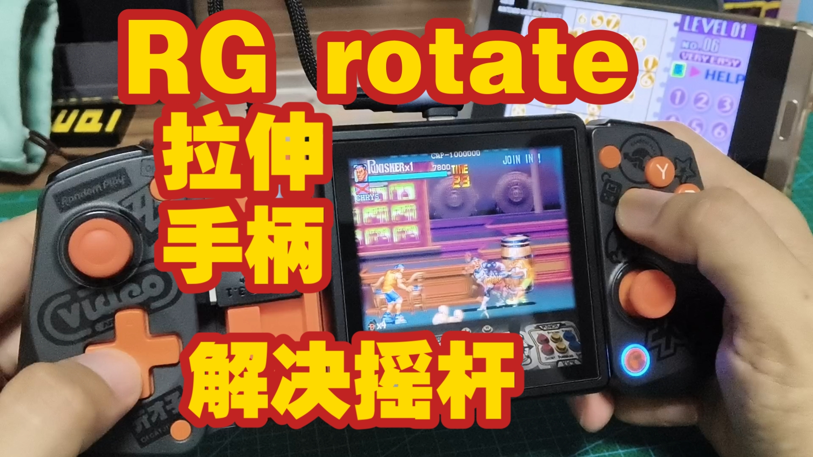

UP主“chuai神”于7月19日发布视频，探讨RG Rotate掌机是否可以通过拉伸手柄解决无摇杆的问题，播放量达1408次。视频推测RG Rotate可能通过外设扩展来弥补机身无摇杆的短板，为玩家提供更灵活的操作方案。  
**简要分析**：RG Rotate的无摇杆设计在社区引发讨论，拉伸手柄方案若被官方采纳，将形成“主机无摇杆+手柄补全”的模块化玩法。这既能保持机身轻薄，又能满足需要摇杆的玩家，或成为未来掌机设计的新思路。  
来源：B站(via RG 掌机)

### PlayStation

### 🔮 新机爆料

#### 1. 传闻 PS6 采用 GDDR7 内存，带宽为 640GB/s，APU 功耗比 PS5 更低

- **新闻内容**：据知乎用户爆料，下一代 PlayStation 主机（暂称 PS6）将采用 GDDR7 显存，内存带宽可达 640GB/s。其 APU 整体功耗将低于现款 PS5，意味着新主机在性能提升的同时能效比更优。该爆料尚未得到索尼官方证实，但已引发硬件爱好者对次世代主机架构的讨论。
- **简要分析**：若爆料属实，PS6 将在图形带宽上实现升级，为 4K/120fps 乃至 8K 游戏提供基础。功耗降低有利于散热设计和体积控制，或成为索尼下一代主机的核心卖点。
- **来源**: 知乎

### 🆕 新机发售

#### 1. 索尼要终结实体版？PS5玩家转向 Switch 2

- **新闻内容**：B站UP主“橘喵斑猫”转载视频，探讨索尼逐步取消实体游戏后，部分 PlayStation 玩家转而购买任天堂 Switch 2。视频指出，索尼推广数字版 PS5 及无光驱策略，导致收藏实体盘的玩家转向仍坚持实体卡带的任天堂阵营。
- **简要分析**：该现象折射出索尼与任天堂在实体/数字战略上的分歧。索尼加速数字化虽降低成本，但可能流失注重实体收藏与二手交易的硬核玩家，为 Switch 2 创造差异化优势。
- **来源**: B站(via 索尼 主机)

#### 2. PS5发售6年索尼推出了多少热门第一方游戏？

- **新闻内容**：B站UP主“爱玩游戏的陈老师”统计了PS5自2020年发售6年以来索尼第一方工作室推出的热门游戏数量，梳理了《蜘蛛侠2》《战神：诸神黄昏》《最后生还者 Part I》等独占大作，并分析其对PS5装机量的拉动作用。截至2026年7月，视频播放量达4531次。
- **简要分析**：第一方游戏是主机平台核心竞争力。索尼在PS5生命周期中后期仍保持输出，但对比PS4时代，独占作品数量有所下降，未来需依靠新IP维持玩家忠诚度。
- **来源**: B站(via 索尼 主机)

#### 3. 为什么打游戏比刷视频好那么多？
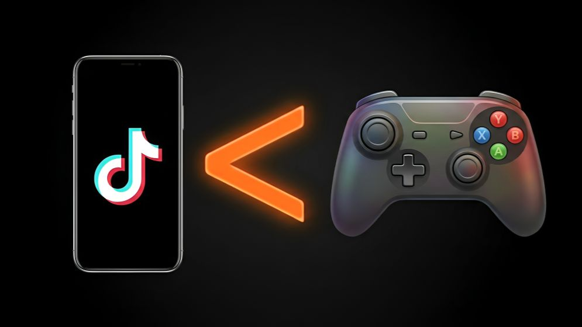

- **新闻内容**：UP主“美丽的Harry老爹”对比玩PS5游戏与刷短视频的心理差异，指出刷短视频带来廉价多巴胺刺激，而玩游戏需要进步、耐心和社交互动，能带来更充实的满足感。视频播放量仅53次，但引发了关于“游戏与短视频成瘾性”的讨论。
- **简要分析**：该内容反映PS5作为沉浸式娱乐设备的独特价值。在碎片化内容泛滥的当下，主机游戏提供的深度体验可能成为吸引用户回归“慢娱乐”的关键。
- **来源**: B站(via PS5 游戏)

### 📋 其他资讯

#### 1. 2026年PS5是否值得一玩？

- **新闻内容**：B站动态用户“董先生的游戏屋”探讨2026年PS5的购买价值，配图展示PS5主机、DualSense手柄及《GTA V》游戏光盘，暗示未来可能推出PS5 Pro或新版机型。内容聚焦PS5在生命周期中后期的性能表现与游戏库丰富度，认为其仍具长期吸引力。
- **简要分析**：随着PS5进入成熟期，价格下探与游戏阵容扩大提升性价比。对于未入手的玩家，2026年可能是“上车”时机，但需警惕索尼可能推出半代升级机型导致旧款贬值。
- **来源**: B站动态@董先生的游戏屋

#### 2. 《怪物猎人物语3：命运双龙》首发观察褒贬不一、战斗系统封神？
- **新闻内容**：知乎专栏分析《怪物猎人物语3：命运双龙》首发后玩家评价。战斗系统被部分玩家誉为“封神”，但整体口碑褒贬不一。文章指出，本作在回合制策略深度上有所突破，但剧情节奏和怪物养成系统存在争议。该作已登陆PS5平台。
- **简要分析**：作为《怪物猎人》衍生作品，《物语3》的争议说明IP改编需平衡创新与经典元素。战斗系统的成功可能为后续作品提供方向，但剧情短板仍需打磨。
- **来源**: 知乎专栏

#### 3. 除了大骂索尼罪大滔天之外，我们还能从去实体化进程中了解到些什么

- **新闻内容**：B站UP主“驼鸵鸟”深度探讨索尼游戏去实体化进程背后的行业逻辑，指出取消实体游戏涉及成本考量、数字生态控制、二手市场打击及订阅服务推广。UP主对比当下数字时代，认为实体消亡将改变玩家消费习惯与收藏文化。
- **简要分析**：去实体化是行业趋势，但索尼的激进策略可能引发玩家反弹。数字版虽便捷，却剥夺了玩家的所有权与转售权，未来如何平衡数字便利与消费者权益将是索尼的长期课题。
- **来源**: B站(via 索尼 主机)

#### 4. 任天堂Switch、索尼PS5/PS4、Xbox 360游戏机专修
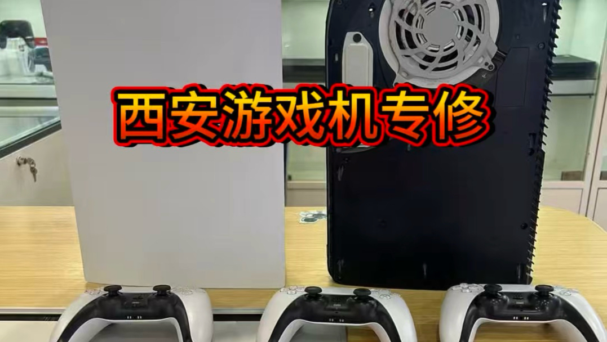

- **新闻内容**：B站UP主提供游戏机专修服务。

### Xbox

### 🆕 新机发售

#### 1. 小程序、plus会员：微软 Xbox Series X 游戏主机 1TB 数字版 日版 4K120Hz 光线追踪
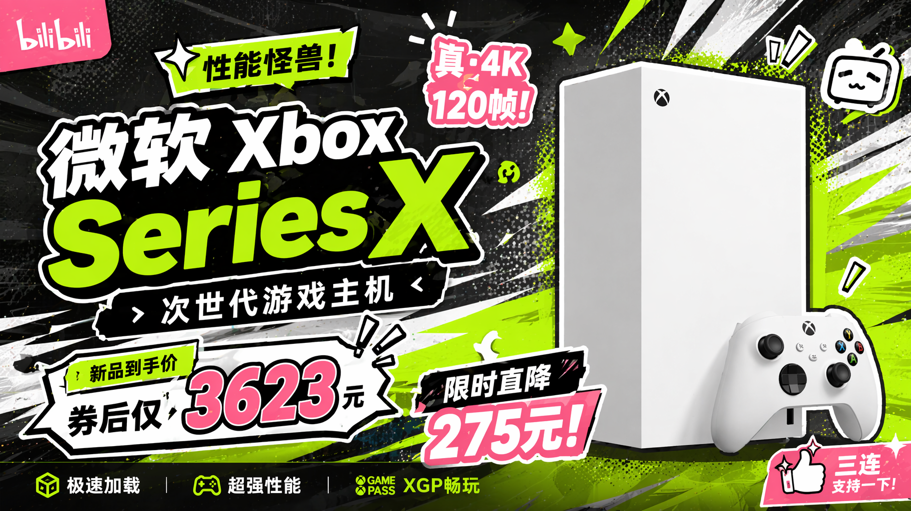

- **新闻内容**：近期国内电商渠道出现Xbox Series X 1TB数字版日版主机促销，该机型支持4K 120Hz输出与光线追踪。作为无光驱全数字版，面向订阅XGP的玩家，机身更紧凑。目前在小程序及Plus会员渠道有售，价格以平台实时显示为准。
- **简要分析**：日版主机在国内持续流通，反映数字版在追求性价比的玩家中仍有稳定需求，但无国行保修是潜在风险。
- **来源**: B站(via 微软 主机)

### 📋 其他资讯

#### 1. 谷歌发布Gemini 3.6 flash和3.5 lite，pro再次缺席

- **新闻内容**：谷歌于7月21日发布Gemini 3.6 flash和3.5 lite两款新模型，Pro版本再次缺席。更新聚焦轻量级与快速响应场景，flash主打高吞吐量推理，lite针对移动端优化。外界猜测Pro延迟可能与安全评估或算力分配有关。
- **简要分析**：谷歌“挤牙膏”式发布策略，可能影响开发者生态信心，尤其在OpenAI和Meta加速迭代的竞争压力下。
- **来源**: 知乎

#### 2. 敌在东京！做好投弹准备【微软模拟飞行2024】
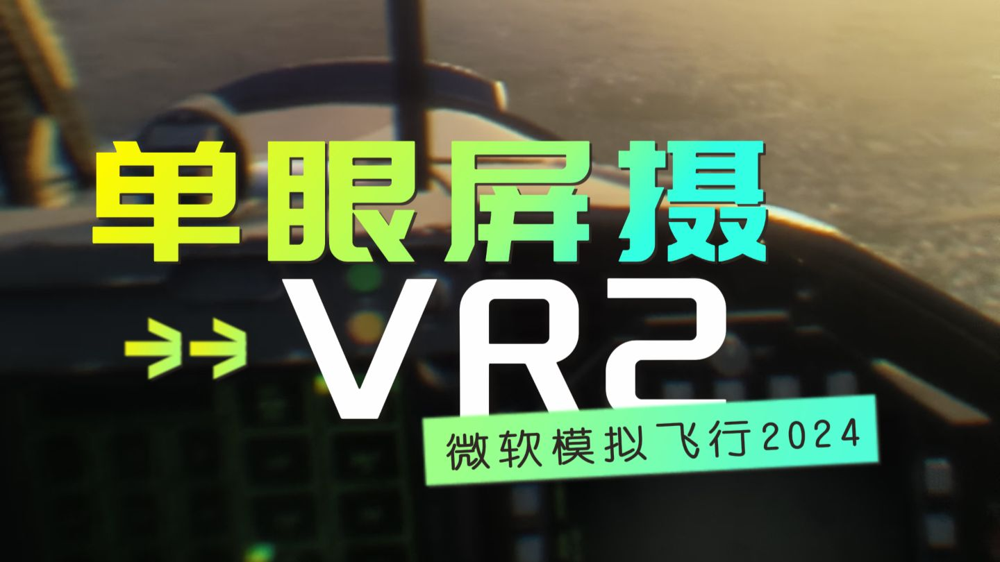

- **新闻内容**：B站UP主“GK龙哥”发布《微软模拟飞行2024》视频，标题“敌在东京！做好投弹准备”，播放量254次。视频展示东京上空模拟投弹场景，UP主提及“VR2清晰度提高”，暗示PS VR2在PC适配后可能获得画质提升。
- **简要分析**：视频为玩家娱乐创作，侧面反映游戏对VR设备的持续优化，以及玩家对跨平台VR体验的敏感度。
- **来源**: B站(via 微软 主机)

#### 3. 微软下一代Xbox是游戏机还是电脑？可装Win11吗？
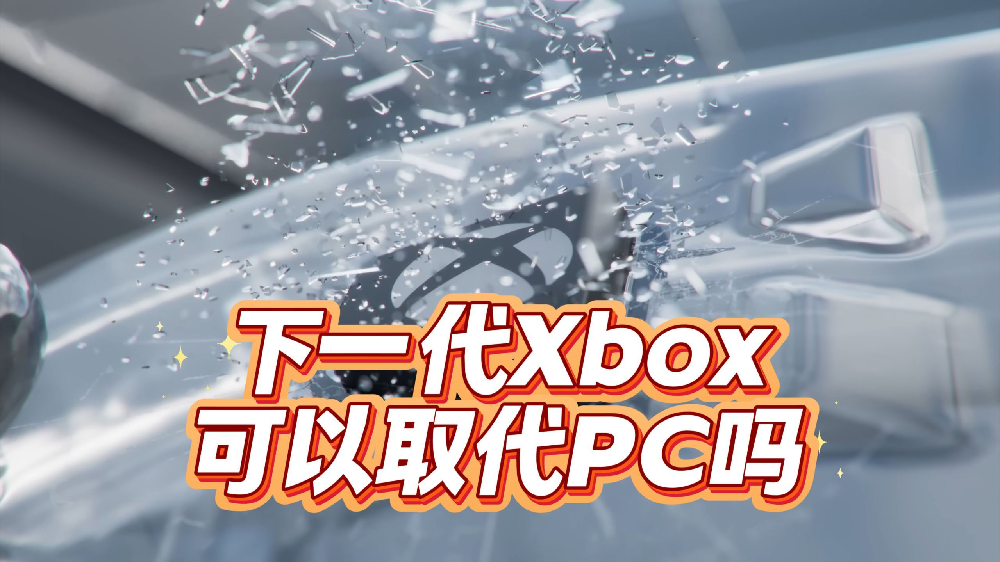

- **新闻内容**：B站UP主“小白的宝箱”发布视频，探讨下一代Xbox产品形态，播放量3181次。核心问题围绕新主机是否融合PC功能，如能否安装Windows 11。微软官方未公布规格，业界猜测可能采用更开放的x86架构以兼容PC游戏生态。
- **简要分析**：玩家对“Xbox变PC”的讨论，反映微软在主机与PC融合战略上的模糊地带，若支持Win11将改变客厅游戏与PC游戏边界。
- **来源**: B站(via 微软 主机)

#### 4. VR2单眼屏摄美加墨世界杯决赛场地【微软模拟飞行2024】
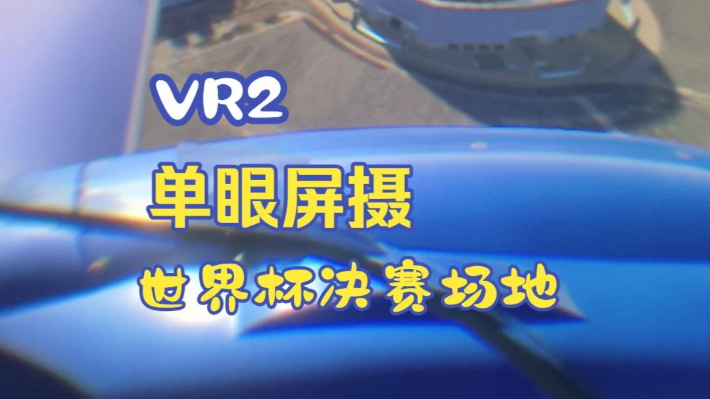

- **新闻内容**：UP主“GK龙哥”再次发布《微软模拟飞行2024》视频，使用PS VR2单眼屏摄，展示美加墨世界杯决赛场地空中视角，播放量239次。视频为VR飞行模拟体验，展示游戏对2026年世界杯场馆的高精度建模。
- **简要分析**：视频延续玩家对游戏VR模式的探索，PS VR2在PC上的非官方适配尝试，正成为模拟飞行爱好者的小众热点。
- **来源**: B站(via 微软 主机)

#### 5. XBOX拆掉未来，只为重建再也回不去的过去

- **新闻内容**：IGN中国发布评论文章，指出《光环》《辐射》《战争机器》系列不可能永远支撑微软游戏业务。文章认为Xbox过于依赖经典IP续作与重制，缺乏开拓原创IP的魄力，可能使平台陷入创新乏力，引发玩家对第一方阵容多样性的讨论。
- **简要分析**：评论直指微软游戏业务核心隐忧——IP老化风险。在索尼与任天堂持续推出新IP的对比下，Xbox若不能加速孵化新系列，将面临用户流失。
- **来源**: IGN中国

#### 6. 全员PC键鼠，就我一个XBOX主机手柄！
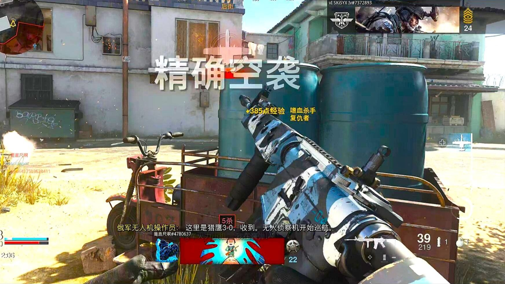

- **新闻内容**：B站UP主“天龙座SK”发布《使命召唤：现代战争》多人对战视频，播放量1662次。UP主使用Xbox Series X主机配手柄，队友均为PC键鼠玩家。视频展示在坎多尔基地地图取得个人最佳战绩，凸显主机手柄与PC键鼠跨平台对战的操作差异。
- **简要分析**：视频反映跨平台对战环境下主机玩家的真实体验，手柄与键鼠的公平性仍是社区热议话题，微软推动的跨平台生态需更精细的匹配机制。
- **来源**: B站(via 微软 主机)

### 任天堂 Switch

### 🔮 新机爆料

#### 1. PS5官方漫威游戏宣传片

- **新闻内容**：游民星空官方发布PS5平台《漫威争锋》宣传片。画面展示角色在霓虹灯效的未来城市夜景中战斗，一名角色骑乘鲨鱼形态生物进行空中攻击。视频右上角显示游戏标题“MARVEL RIVALS”，底部标注©2026 MARVEL。该片来自YouTube，由B站动态@游民星空官方转发。
- **简要分析**：作为PS5漫威IP新作，实机画面展现次世代主机高画质。宣传片巩固漫威游戏在主机市场布局，但未提及Switch平台，暗示可能为PS5独占或优先登陆。
- **来源**：B站动态@游民星空官方

#### 2. 《勇者斗恶龙 怪物仙境4》宣传片
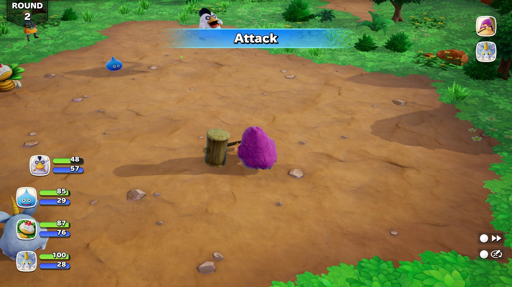

- **新闻内容**：游民星空官方发布《勇者斗恶龙 怪物仙境4》宣传片。本作为RPG，玩家可将系列中怪物纳为伙伴，进行培育与配种，体验怪物对战。故事中，两位少女碧安卡与芙萝拉成为能与怪物心灵相通的“怪物大师”，展开全新冒险。该片源自YouTube，由B站动态@游民星空官方转发。
- **简要分析**：作为经典怪物收集养成系列新作，延续核心玩法，引入双女主角设定，增强剧情深度。若登陆Switch，将丰富其RPG阵容，吸引系列粉丝和养成类玩家。
- **来源**：B站动态@游民星空官方

#### 3. 《最终幻想 共鸣》新宣传片

- **新闻内容**：游民星空官方发布《最终幻想 共鸣》新宣传片。图片展示一座骑士骑马雕像，位于喷泉中央，背景为宏伟欧式建筑。雕像细节精致，骑士手持长剑，身披铠甲，马匹呈腾跃姿态，周围绿植环绕，阳光透过建筑洒下，营造庄严梦幻的奇幻风格。该片来自X平台，由B站动态@游民星空官方转发，可能展示游戏中的虚构城市或城堡区域。
- **简要分析**：宣传片以高精度场景渲染和艺术风格，展现系列一贯的奇幻美学。作为衍生作品，若登陆Switch，将凭借IP影响力和视觉表现吸引核心粉丝，但具体平台和发售日尚未公布。
- **来源**：B站动态@游民星空官方

### 🆕 新机发售

#### 1. 【掌机周报】vol21
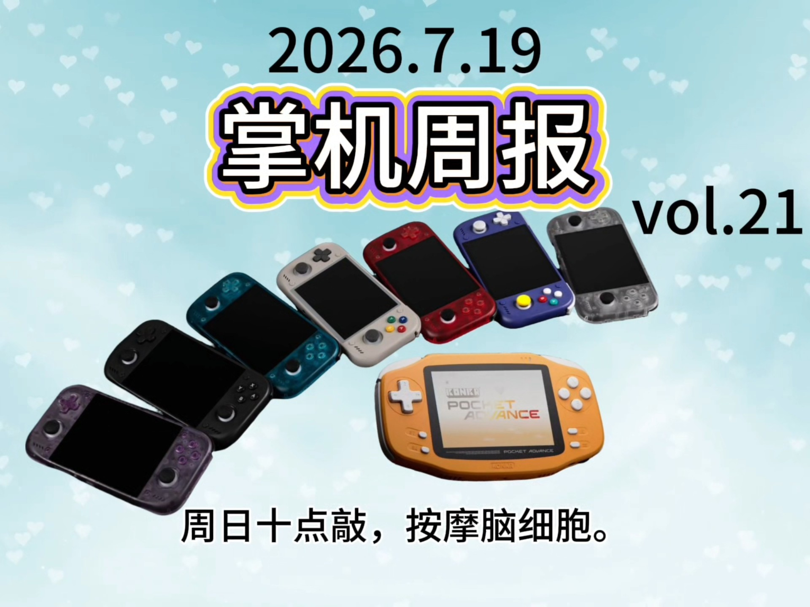

- **新闻内容**：B站UP主“Xigua今天打游戏了吗”发布掌机周报，汇总多款新品动态：老张小金刚掌机下周开卖，首发价749元；rpnova展示多款配色实机演示；联想云掌机计划8月上市；ayaneo攻氪pocket advance公布宣传图。周报为玩家提供近期掌机市场购机参考，涵盖低价入门到高端旗舰产品。
- **简要分析**：掌机市场竞争激烈，老张小金刚以749元低价切入，主打性价比；联想云掌机瞄准云游戏场景。这些新品与Switch形成差异化竞争，但Switch凭借独占游戏生态仍具优势。
- **来源**：B站动态@Xigua今天打游戏了吗

#### 2. 《幻兽帕鲁》1.0正式版发布等

- **新闻内容**：二柄APP报道多款游戏动态：《幻兽帕鲁》1.0正式版发布，包含多种幻兽与角色，支持多人联机与建造玩法；《刺客信条：黑旗》推出“记忆重置”版本，聚焦海盗主题冒险；《Meccha Chameleon》为色彩变换主题休闲游戏，主打趣味变形玩法。这些游戏覆盖开放世界生存、动作冒险和休闲解谜等类型。
- **简要分析**：《幻兽帕鲁》1.0正式版标志其从抢先体验阶段毕业，多人联机玩法有望延续热度。《刺客信条：黑旗》重置版瞄准怀旧玩家，但若登陆Switch需考虑性能优化。整体来看，这些作品丰富Switch平台游戏库。
- **来源**：B站动态@二柄APP

#### 3. [中配]销量不佳，Nintendo Switch 2再次降价
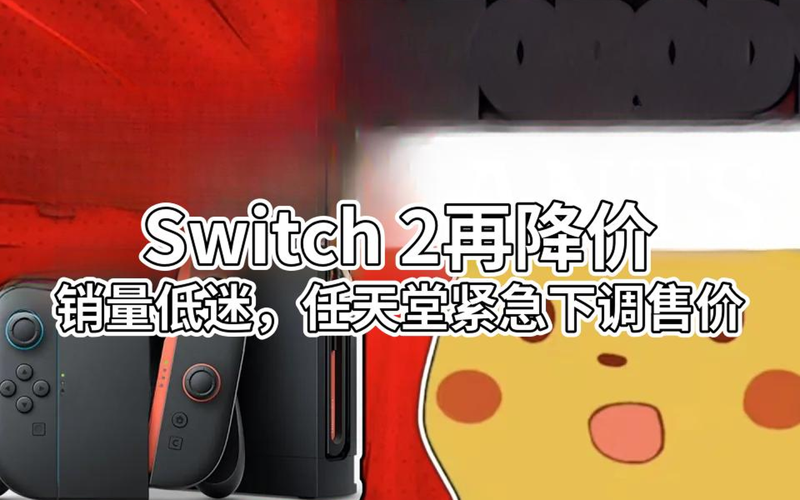

- **新闻内容**：B站UP主“环球游戏摸鱼社”转载NintenDeen视频，称Nintendo Switch 2因销量不佳在美国再次降价。亚马逊和百思买推出“选择你的捆绑包”活动，售价降至44美元（约合人民币315元）起。视频原发布于YouTube，上传日期为2026年7月16日，播放量达2.0万。降价活动旨在刺激低迷市场需求。
- **简要分析**：Switch 2上市后多次降价，反映市场反响未达预期。这可能与定价过高、缺乏首发独占大作或玩家对性能提升不敏感有关。降价虽能短期提振销量，但长期需靠优质内容驱动。
- **来源**：B站(via Switch 2)

### 模拟器资讯

### 🔮 新机爆料

#### 1. 【GB】新版呼叫UI及手机端相关优化爆料
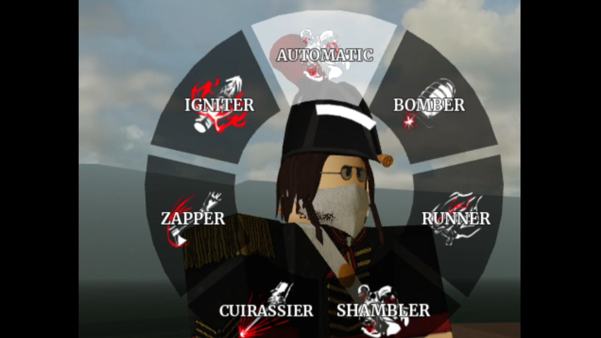

- **新闻内容**：B站UP主“明任子”发布视频，爆料GB模拟器将推出新版呼叫UI界面，并针对手机端操作进行优化。新交互设计旨在提升移动设备体验，具体包括触控响应和界面布局调整。视频播放量达9640次，引发社区关注。
- **简要分析**：GB模拟器持续优化手机端，表明其正拓展移动游戏市场。新版UI将提升用户粘性，形成差异化优势。
- **来源**: B站(via GB 模拟器)

#### 2. 【GB】巴黎重置最新爆料图

- **新闻内容**：UP主“明任子”再次爆料，公布GB模拟器“巴黎重置”项目最新截图。重置版在图形渲染和场景细节上大幅升级，光影效果和纹理精度显著提升。视频播放量近2000次，发布日程未公布。
- **简要分析**：“巴黎重置”作为重点视觉升级项目，展示技术力。上线后将提升高端设备画面表现力，吸引硬核玩家。
- **来源**: B站(via GB 模拟器)

#### 3. Wrapper-Mali 首次支持DX12，新增陀螺仪功能，Bannerlator 版本连续更新2.7、2.7.1及2.8汉化版，2.9版本预热中
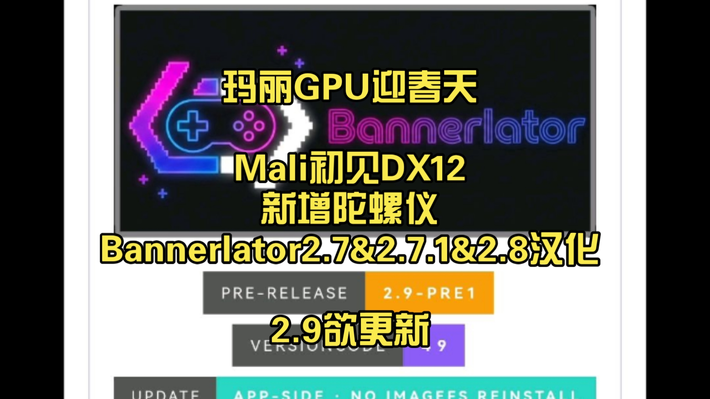

- **新闻内容**：据B站UP主“狂犬不语”爆料，Wrapper-Mali项目首次支持DirectX 12，并新增陀螺仪功能。Bannerlator工具连续发布2.7、2.7.1及2.8汉化版，2.9版本预热中。这些更新将提升Mali GPU在PC模拟器上的游戏兼容性和操控体验。
- **简要分析**：DX12支持是Mali GPU模拟领域的里程碑，使更多现代3A大作有望在移动端运行。Bannerlator汉化降低国内用户门槛，推动模拟器生态本土化。
- **来源**: B站(via 模拟器 汉化)

### 🆕 新机发售

#### 1. Bionic NM模拟器1.2.6发布，增加手柄独占模式，优化绘制遮挡处理，提升帧率

- **新闻内容**：Bionic NM模拟器发布1.2.6版本，新增手柄独占模式，避免触控干扰；优化绘制遮挡处理逻辑，提升游戏帧率。版本由UP主“jf__jf”发布，旨在为Winlator生态用户提供更流畅、沉浸的操控体验。
- **简要分析**：手柄独占模式标志Bionic NM模拟器从“能玩”向“好玩”进化。性能优化和操控改进双管齐下，吸引主机游戏玩家转向移动端模拟。
- **来源**: B站(via Winlator 模拟器)

#### 2. 安卓 AzaharPlus 模拟器 v2126.0-A 汉化版发布

- **新闻内容**：安卓平台AzaharPlus模拟器发布v2126.0-A汉化版，由UP主“dreamboyn81”制作。版本基于最新代码编译，提供完整汉化界面，修复部分兼容性问题。用户可通过百度网盘及123云盘获取安装包，密码均为“dreamboyn81”。
- **简要分析**：作为Citra模拟器衍生分支，AzaharPlus持续汉化更新，为国内3DS游戏爱好者提供稳定选择。汉化版降低语言门槛，扩大用户基数。
- **来源**: B站(via Citra 模拟器 更新)

#### 3. 【安卓Switch】Citron Neo模拟器汉化修改版发布

- **新闻内容**：安卓Switch模拟器Citron Neo推出汉化修改版，由UP主“大飞哥g”发布。版本新增自由布局、按键布局自定义、内置按键皮肤及组合键设置等功能。下载地址在视频简介和评论区，提供百度网盘和夸克网盘双通道。
- **简要分析**：Citron Neo通过丰富自定义功能，提升安卓端Switch模拟的可玩性和适配性。内置皮肤和组合键利好触屏玩家，有望成为热门修改版。
- **来源**: B站(via Citron 模拟器)

#### 4. Switch PS2模拟器1.1.1新版本发布
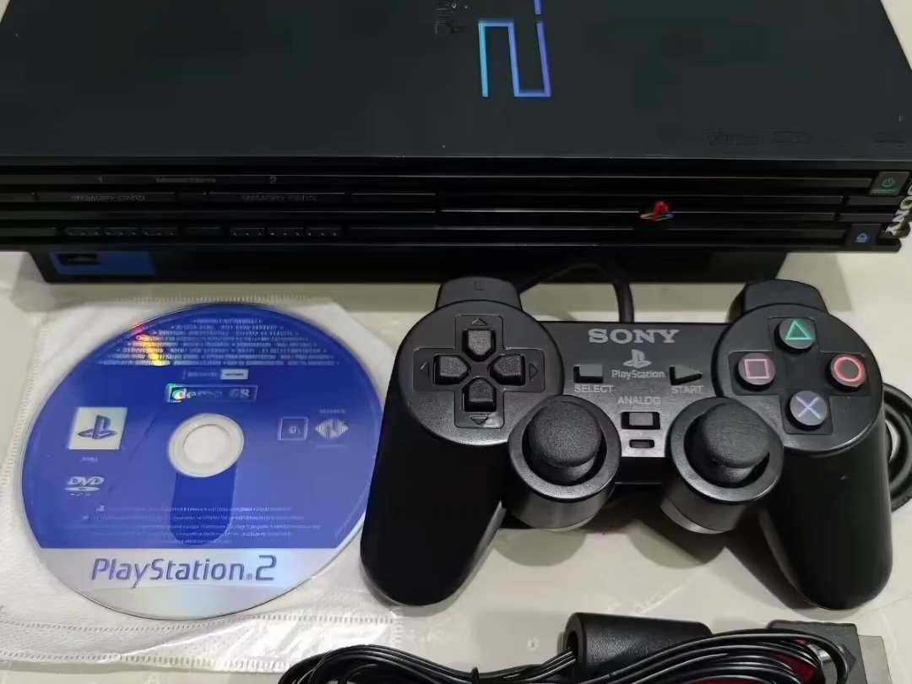

- **新闻内容**：Switch平台PS2模拟器发布1.1.1版本，由UP主“高达未来”分享。版本针对部分PS2经典游戏优化兼容性，提升运行稳定性。下载链接通过百度网盘提供，提取码为5gi6，需超级会员权限。
- **简要分析**：Switch端PS2模拟器持续更新，使玩家在掌机上重温PS2经典成为可能。1.1.1版本优化将推动更多游戏达到可玩帧率，拓展Switch软件生态。
- **来源**: B站(via PS2 模拟器)

### 📱 系统更新

### 游戏外设

### 🔮 新机爆料

#### 1. 2026年7月采集卡选购指南！16款从百元内到千元档全覆盖
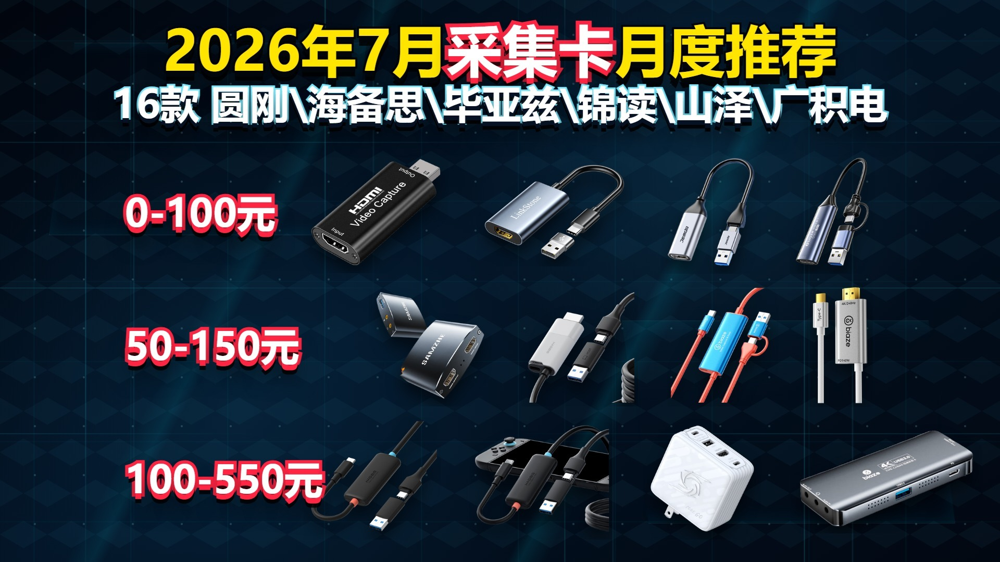

UP主“海哥数码”发布2026年7月采集卡选购指南，覆盖16款产品，价格从百元内到1300元档。视频先讲解分辨率、接口、兼容性及使用场景等选购重点，随后按价格带推荐毕亚兹、锦读、海备思、圆刚、山泽、天创恒达等品牌产品，适用于主机直播、录屏及Switch投屏等场景。该指南为不同预算和需求的玩家提供了清晰选购路径，有助于降低采集卡购买门槛，推动直播和录屏外设市场普及。来源：B站(via Switch 外设)

### 🆕 新机发售

#### 1. XBOX授权天王星手柄Aimlabs联名款开售

盖世小鸡宣布，XBOX授权天王星手柄Aimlabs联名款正式开售。该手柄专为FPS玩家设计，融合Aimlabs瞄准训练元素，旨在提升游戏操作精准度。具体规格和售价暂未公布，但作为XBOX官方授权产品，兼容性有保障。联名款瞄准电竞训练细分市场，有望吸引追求精准操作的硬核玩家，巩固盖世小鸡在授权外设领域的地位。来源：B站动态@盖世小鸡

#### 2. 澳加狮J30分体手柄值得入手吗？
UP主“紫骷”发布评测视频，介绍澳加狮J30分体手柄。该手柄号称采用“满血版旗舰配置”，并支持真正的Switch 2手柄协议，兼容性值得关注。视频播放量达1.3万，引发玩家讨论。具体配置包括霍尔效应摇杆、可自定义按键等，但官方售价和上市日期尚未明确。若J30确实支持Switch 2协议，将提前抢占下一代主机外设市场，对任天堂第三方手柄生态产生积极影响。来源：B站(via Switch 外设)

#### 3. Switch 2 Pro 手柄改进
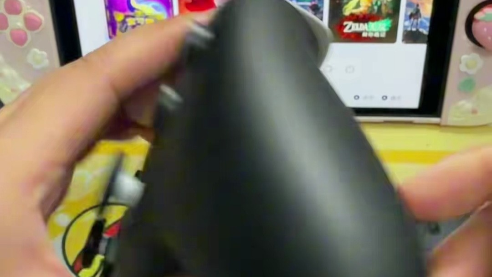

UP主“翰捕辰底Ra5”发布开箱Vlog，展示Switch 2 Pro手柄改进细节。视频聚焦于手柄设计、按键手感及新功能，但播放量仅1次，信息量有限。目前任天堂官方尚未公布Switch 2 Pro手柄正式规格，该视频可能为早期样品或第三方改装产品。该视频虽热度低，但反映了玩家对Switch 2 Pro手柄的期待，未来官方发布后，第三方配件市场将迎来新一轮升级潮。来源：B站(via Switch Pro 手柄)

#### 4. Paper_Tracker v7.3.0 追踪效果展示

Paper_Tracker发布v7.3.0版本的表情与眼动追踪效果展示视频，播放量达1870。该版本优化了追踪精度和响应速度，适用于Quest 3等VR设备。第三批预售正在筹备中，用户可通过淘宝店铺“paper的杂货铺”关注购买。Paper_Tracker持续迭代，为VR社交和游戏交互提供了更自然的追踪方案，有望推动眼动追踪技术在消费级VR外设中的普及。来源：B站(via Quest 3)

#### 5. 2026年7月游戏手柄推荐：22款全价位横评

UP主“三弟来lo”发布7月游戏手柄推荐视频，横评22款产品，覆盖盖世小鸡、雷神、易速马、北通、飞智、墨将、动感指尖、八位堂、致动等品牌。视频按价格从百元到旗舰档位划分，并分时间轴详细讲解，帮助用户根据设备适配和预算选择合适手柄。该横评为消费者提供了全面选购参考，有助于提升各品牌在细分市场的曝光度，推动手柄行业竞争。来源：B站(via 八位堂)

### 📋 其他资讯

#### 1. 小鸡观星者如何连接多平台
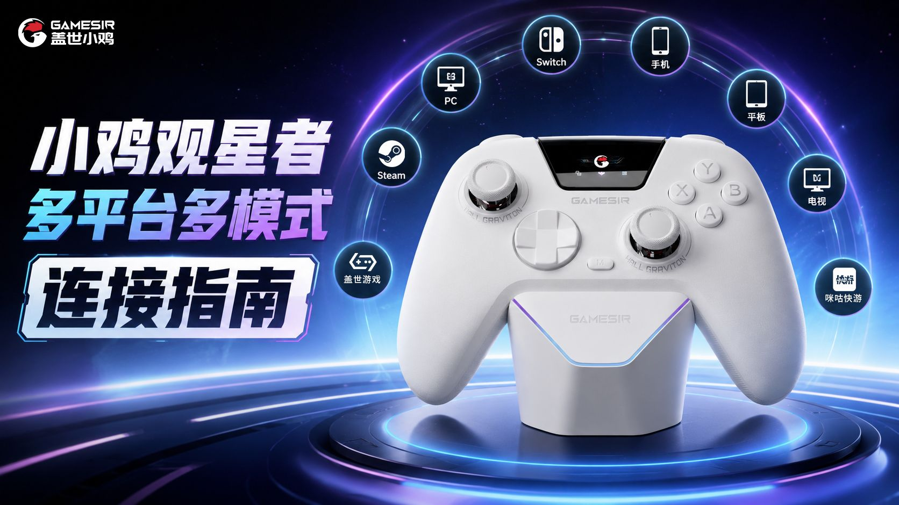

盖世小鸡推出“小鸡观星者”游戏手柄连接教程，该手柄支持多平台多模式连接，兼容PC、Switch、手机、平板、电视、Steam及咪咕快游等设备。手柄采用白色设计，配备双摇杆、方向键和ABXY按键，支持蓝牙与有线连接，适用于多种游戏场景。多平台兼容性是其核心卖点，降低了玩家在不同设备间切换的成本，有望吸引跨平台游戏用户。来源：B站动态@盖世小鸡

#### 2. 广东寄来更换 Switch NS PRO换TMR摇杆维修
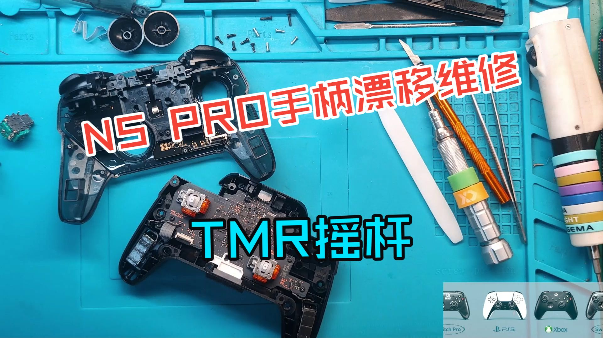

提供Switch NS PRO手柄TMR摇杆更换服务，包括校准、清理及三倍速操作。该服务针对手柄漂移问题，适用于NS PRO游戏手柄。来源：B站

## 参考资料链接列表

1. [B站(via Steam Deck 游戏)] PC【地平线6】403.798|单个升及包|联机补丁|全车存档|修改器: https://www.bilibili.com/video/BV1mMKe64EFb
2. [什么值得买] 569.04元 JSAUX12合1多功能磁吸收纳扩展坞steamdeck掌机电脑ipad手机通用: https://news.google.com/rss/articles/CBMiSkFVX3lxTE5PZXl5cmZ2MFROTzhMV1Z2elBXWC15bDkyUE9qVjNObFNyOG8yT2U0VXppOU5qa1FvSEJ2VjJ5WTJvZzljVi1Ja0p3?oc=5
3. [B站(via SteamOS 更新)] SteamOS Epic客户端Updata Epic Online Services无法更新临时解决方案: https://www.bilibili.com/video/BV17iKm61EMa
4. [B站(via Steam Controller)] [新方案]steam controller改装无障碍手柄，正面额外按键: https://www.bilibili.com/video/BV1i4K86ZEwP
5. [B站(via Steam Deck 游戏)] Steam Deck OLED 演示《龙之剑》: https://www.bilibili.com/video/BV1jrgk6rEYU
6. [B站(via ROG Ally 掌机)] GBO2用掌机配AR眼镜玩PVE任务 反叛的代价 1分8秒完成 高达激战任务2 GBO2 高达战斗行动2 机动战士雷霆一击ZZ高达UC0088系列机体: https://www.bilibili.com/video/BV1S9gk6aE1Z
7. [IT之家] 联想预热拯救者云游戏掌机 C700：厚 14.9mm、重 556g，八月见: https://www.ithome.com/0/980/282.htm
8. [B站(via AYANEO 掌机)] aya mic2新增12+128。22日上午官网预售！: https://www.bilibili.com/video/BV1hRKb6SEvo
9. [B站动态@ROG玩家国度] ROG破风标准版游戏耳机发布，搭载50mm ROG镀钛振膜发声单元和10mm超宽频吊杆麦克风，支持高级参数化EQ调节与游戏预设参数。配备3级可调弹性头带、耳罩光...: https://t.bilibili.com/1227456987694891013
10. [B站(via OneXPlayer 掌机)] 核显接近2060 还可变身轻薄本 这台掌机太猛了 壹号本OneXPlayer3上手体验: https://www.bilibili.com/video/BV1Mdgk6wE4Y
11. [B站动态@GPD掌机官方] 如何在 SteamOS 里安装 Decky Loader（2026 年教程）: https://t.bilibili.com/1227044557068173320
12. [B站动态@ROG玩家国度] “教练，我也想打职业！”小R带你探访TE溯永劫无间分部: https://t.bilibili.com/1227093665725284483
13. [B站(via MSI Claw 掌机)] Lunar Lake掌机来了！闲聊微星CLAW8 AI + ！: https://www.bilibili.com/video/BV1cGKt6hEkS
14. [B站动态@董先生的游戏屋] KONKR Pocket Advance掌机发布预告，复刻经典造型，橙色机身搭配白色按键，保留熟悉握感。设备支持游戏运行，屏幕显示主界面，背景陈列复古游戏机与卡...: https://t.bilibili.com/1227525589082046468
15. [B站(via 安卓掌机)] 新手小白已预订rp nova掌机: https://www.bilibili.com/video/BV1o3gz6eEWz
16. [B站(via Retroid Pocket)] Retroid Pocket Nova详细评测，实力小钢炮: https://www.bilibili.com/video/BV1TqKA6TEAu
17. [什么值得买] 89元 酷态科 6号屏显充Ultra 氮化镓100W手机充电器: https://news.google.com/rss/articles/CBMiSkFVX3lxTFBWMy01SnBoendHLVVpenRLOXo3Z2tWdmt0TlFSMXd0WDF1R1IzSElZRGxBT1RaTy1aUVZPZ2pOZlpVQjJJdDh6QVZB?oc=5
18. [什么值得买] 883元 安伯尼克 2026新款RG Rotate旋转屏安卓掌机极光银（全铝合金材质） 标配+128GTF卡套餐: https://news.google.com/rss/articles/CBMiSkFVX3lxTFB1Vlc4QnhwVWxXNVJnNmNab25UakJVSGVnSWw1Slh5YzdqazdNUDZidUpzWlRWWERreW0tYzFvRE94dkdWU0Z6UUdn?oc=5
19. [B站动态@董先生的游戏屋] 安伯尼克（ANBERNIC）发布RG SP掌机，主打复古游戏体验。设备配备3.4英寸IPS屏幕，分辨率720×480，支持复古游戏3倍点对点显示。采用双合金转轴...: https://t.bilibili.com/1227458969831735300
20. [B站(via RG 掌机)] 更适合GBA的35XXSP？安伯尼克新机RG SP发布: https://www.bilibili.com/video/BV1SWKY64EPi
21. [B站动态@千夏的铲子] RP NOVA高性能4:3复古怀旧小钢炮掌机，我真正的梦中情机: https://t.bilibili.com/1226731638598139906
22. [B站动态@Anbernic官方] 安伯尼克 ANBERNIC：RG SP｜复古翻盖掌机，经典在握: https://t.bilibili.com/1227457122990555186
23. [Bilibili] 想随时随地畅玩复古游戏？ANBERNIC安伯尼克这款掌机满足你，可联电视超便携！: https://news.google.com/rss/articles/CBMiV0FVX3lxTFBMNEdCWFlXYmdCeldfY3haLVh2TTR5akZyZDRoMTR0dGZzaXdFOERoTkdHN1BwV0ttVWxtSzF6U1BQMWpMSTdMd2JadUh5MkhrOXNjZEM0bw?oc=5
24. [B站(via 吹米 掌机)] 吹米掌机抽奖结果！: https://www.bilibili.com/video/BV1wUKz6vEpT
25. [B站(via RG 掌机)] RG rotate拉伸手柄？解决没摇杆？: https://www.bilibili.com/video/BV1FgNY6VERY
26. [B站(via RG 掌机)] 安伯尼克RG Rotate掌机：手感舒适，游戏体验棒: https://www.bilibili.com/video/BV1WYKk6GEFT
27. [知乎] 传闻 PS6 采用 GDDR7 内存带宽为 640GB/s，APU 功耗比 PS5 更低: https://news.google.com/rss/articles/CBMiWEFVX3lxTE9vUm50Uk5CQ3FmTXNwUzA0Q3hLY2RqOGVZeTd5SWhGQlkwUzZ2VmhaX1ZqQ0Jkdk1PSkRkMDlQX0xyMy1wdmhyNEFjVHRJUnBlSjBGM3FPOGw?oc=5
28. [B站(via 索尼 主机)] 索尼要终结实体版?PS5玩家疯狂抢购Switch 2!: https://www.bilibili.com/video/BV1U1Ka6WErW
29. [B站(via 索尼 主机)] PS5发售6年索尼推出了多少热门第一方游戏？: https://www.bilibili.com/video/BV1Lwgk6MEcT
30. [B站(via PS5 游戏)] 为什么打游戏比刷视频好那么多？: https://www.bilibili.com/video/BV16VgC6UEfc
31. [B站动态@董先生的游戏屋] 2026年PS5是否值得一玩！: https://t.bilibili.com/1226714939795701831
32. [知乎专栏] 《怪物猎人物语3：命运双龙》首发观察褒贬不一、战斗系统封神？: https://news.google.com/rss/articles/CBMiXEFVX3lxTE5wYUE3cV9fbXU2dUZZRkJGc0lrV0w4RkVQTXhfZC1RUkhtU1Jac1hTYzRQLUNuU0pFdm95SUFDNnFRXzROdC0wYVBBR2F1UWNvcy1ISkhWMkMzckls?oc=5
33. [B站(via 索尼 主机)] 除了大骂索尼罪大滔天之外，我们还能从去实体化进程中了解到些什么: https://www.bilibili.com/video/BV1DPKm6qEmY
34. [B站(via 索尼 主机)] 任天堂switch索尼PS5/PS4 XbOX360游戏机专修: https://www.bilibili.com/video/BV1wvKH6nERG
35. [知乎] 怎么看谷歌发布了 Gemini 3.6 flash和 3.5 lite，但是 pro 又缺席？: https://news.google.com/rss/articles/CBMiX0FVX3lxTFBFc1FGampMV2ZsWlYwWF9jRkt6Zk9HV1BFNnlSdmNxT0NDRURBY3k0TnJvaWZoMlFjRW5UaDFPTnRFdWRsQkYxU3BXc21PZUhnZU9Ma1Bhc21tcUlSNzdJ?oc=5
36. [B站(via 微软 主机)] 敌在东京！做好投弹准备【微软模拟飞行2024】: https://www.bilibili.com/video/BV1MkKr67EGp
37. [B站(via 微软 主机)] 微软下一代Xbox是游戏机？还是电脑？可以装Win11吗？: https://www.bilibili.com/video/BV172Ky63EDv
38. [B站(via 微软 主机)] 小程序、plus会员:微软 Xbox Series X 游戏主机 1TB 数字版 日版 4K120Hz 光线追踪: https://www.bilibili.com/video/BV1daK16zE3n
39. [B站(via 微软 主机)] VR2单眼屏摄美加墨世界杯决赛场地【微软模拟飞行2024】: https://www.bilibili.com/video/BV1WjKp6pEtf
40. [IGN中国] XBOX拆掉未来，只为重建再也回不去的过去: https://www.ign.com.cn/fallout-5/61442/xboxchai-diao-wei-lai-zhi-wei-zhong-jian-zai-ye-hui-bu-qu-de-guo-qu
41. [B站(via 微软 主机)] 全员PC键鼠，就我一个XBOX主机手柄！: https://www.bilibili.com/video/BV1LPKb6RErn
42. [B站动态@游民星空官方] PS5官方漫威游戏宣传片: https://t.bilibili.com/1227705002738319379
43. [B站动态@游民星空官方] 《勇者斗恶龙 怪物仙境4》宣传片: https://t.bilibili.com/1227785580614516742
44. [B站动态@游民星空官方] 《最终幻想 共鸣》新宣传片: https://t.bilibili.com/1227832421571887120
45. [B站动态@Xigua今天打游戏了吗] 【掌机周报】vol21.老张小金刚下周开卖首发749元，rpnova多款配色实机演示，联想云掌机8月上市，ayaneo攻氪pocket advance宣传图公布: https://t.bilibili.com/1226591193164415094
46. [B站动态@二柄APP] 《幻兽帕鲁》1.0正式版发布，包含多种幻兽与角色，支持多人联机与建造玩法。《刺客信条：黑旗》推出“记忆重置”版本，聚焦海盗主题冒险。《Meccha Chamel...: https://t.bilibili.com/1227697162271326211
47. [Bilibili] pdd遐蝶手办事件，安卓模拟器+纯白手机号+纯净网络实测，全新的营销套路: https://news.google.com/rss/articles/CBMiV0FVX3lxTE5qNWpnMFNXUEJmTzc5Q2syOU1YcktUNUdSRV9pVE5KWXBOeWRfNkJpSUdSZDdCdzJrNWdFYjlfZDN5MjNlbFhTTzdUelVyWHMxRmUwSEtVbw?oc=5
48. [B站(via Switch 2 传闻)] [中配]销量不佳，Nintendo Switch 2再次降价 - NintenDeen: https://www.bilibili.com/video/BV1hxKU63EmA
49. [B站(via Switch 2)] NS2独占新游首发通关体验！喷射战士刷宝新作！【斯普拉遁：涂击队】剧情通关流程直播实况【更新中】: https://www.bilibili.com/video/BV1vbg16jEfx
50. [B站(via GB 模拟器)] 【GB】新版呼叫UI及手机端相关优化爆料: https://www.bilibili.com/video/BV18uKi6eEPT
51. [B站(via GB 模拟器)] 【GB】巴黎重置最新爆料图！: https://www.bilibili.com/video/BV16tKs6QEi2
52. [B站(via 模拟器 汉化)] Wrapper-Mali初见DX12，新增陀螺仪，Bannerlator版本连更2.7&amp;2.7.1&amp;2.8汉化，2.9版本预热: https://www.bilibili.com/video/BV1Rngr6KEF3
53. [B站(via Winlator 模拟器)] Bionic NM模拟器1.2.6发布，增加手柄独占模式，优化绘制遮挡处理，提升帧率。: https://www.bilibili.com/video/BV1C4K66BERh
54. [B站(via Citra 模拟器 更新)] 安卓AzaharPlus模拟器 v2126.0-A汉化版发布: https://www.bilibili.com/video/BV1QCKs6rEuy
55. [B站(via Citron 模拟器)] 【安卓Switch】Citron Neo模拟器汉化修改版发布！添加自由布局、按键布局、内置按键皮肤、组合键等功能设置，下载地址请看视频简介和评论置顶区！: https://www.bilibili.com/video/BV116gr6pEwJ
56. [B站(via PS2 模拟器)] switch ps2模拟器1.1.1新版本发布: https://www.bilibili.com/video/BV1eCg66aEJD
57. [B站(via Winlator 模拟器)] winlator11 鬼泣4 25.2.1驱动 DXVK2.4.1 骁龙8gen1 推荐模式 流畅: https://www.bilibili.com/video/BV1sUMh6JETq
58. [B站(via Switch 外设)] 2026年7月采集卡选购指南！16款从百元内到千元档全覆盖，主机直播、录屏、Switch投屏怎么选？: https://www.bilibili.com/video/BV1hWgz6xEL5
59. [B站动态@盖世小鸡] 打破畅玩界限！XBOX授权天王星手柄Aimlabs联名款开售！: https://t.bilibili.com/1227124911552593928
60. [B站(via Switch 外设)] 满血版旗舰配置+真Switch2手柄协议？澳加狮J30分体手柄值得入手吗？: https://www.bilibili.com/video/BV1PjKp6pEX2
61. [B站(via Switch Pro 手柄)] Switch2pro手柄改进#任天堂switch#游戏手柄#开箱vlog#switchpro手柄#手柄-7580397395143284580: https://www.bilibili.com/video/BV1jLKx6SEZu
62. [B站(via Quest 3)] Paper_Tracker v7.3.0 追踪效果展示: https://www.bilibili.com/video/BV1LFgk6zEdE
63. [B站(via 八位堂)] 【2026年7月游戏手柄推荐】22款手柄到底怎么选？全价位横评 盖世小鸡/雷神/易速马/北通/飞智/墨将/动感指尖/八位堂/致动: https://www.bilibili.com/video/BV11PgC6REjj
64. [B站动态@盖世小鸡] 【连接教程】小鸡观星者如何连接多平台: https://t.bilibili.com/1227104914235195394
65. [B站(via Switch 外设)] 广东寄来更换 Switch NS PRO换TMR摇杆 NS PRO游戏手柄漂移维修 校准+清理+三倍速+音乐: https://www.bilibili.com/video/BV1nbKB6bEJT

---

> 130条动态，浓缩成一句话：游戏硬件的下一站，比你想的更近。
