# 游戏设备周报·上 | 2026-W30 (7.19 - 7.23)

> 像素艺术融合骑砍与全战，精神续作与舌控设备齐登场。

## 🌍 海外资讯

### Steam Deck

### 🔮 新机爆料

#### 1. 《Sword & Banner》：像素艺术策略新作
一款名为《Sword & Banner》的像素艺术游戏曝光，玩法融合《骑马与砍杀》与《全面战争》。游戏主打大规模战场指挥与角色扮演，玩家可单兵作战或排兵布阵，战斗节奏紧凑。发售日期未公布，但已在Steam Deck兼容性测试中表现良好。  
分析：像素风与硬核策略组合在掌机端罕见，若优化操作逻辑，有望成为Steam Deck差异化爆款。  
来源：GamingOnLinux

#### 2. MXGP 26 实机预告片发布

摩托车竞速系列新作《MXGP 26》公布实机预告，展示全新物理引擎、赛道环境及摩托车细节。本作定位“全新开始”，旨在提供更真实越野体验。预计登陆PC及主机平台，Steam Deck可期待原生优化，发售日期待定。  
分析：作为老牌IP，“重启”意味技术革新，若能稳定60帧，将巩固Steam Deck在体育模拟类游戏中的优势。  
来源：GamingOnLinux

#### 3. 《Sanctuary: Shattered Sun》或成《最高指挥官》精神续作
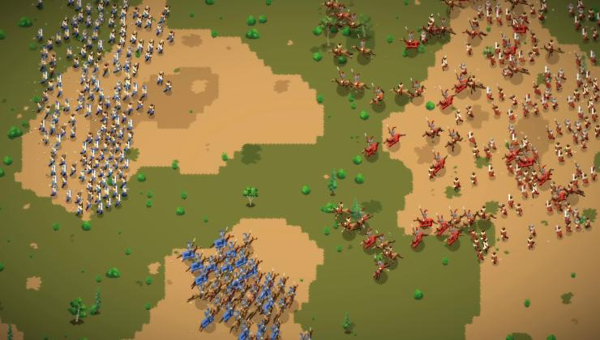

大型RTS《Sanctuary: Shattered Sun》亮相，被视为《最高指挥官》精神续作。游戏强调超大规模单位同屏作战，含海陆空协同与资源管理，计划登陆Steam并支持Steam Deck。开发团队已针对手柄操作适配，后续将优化UI缩放与性能。  
分析：RTS在掌机操作是痛点，若解决键鼠到手柄映射，将为Steam Deck开辟重度策略游戏品类。  
来源：GamingOnLinux

### 🆕 新机发售

#### 1. 《Arma: Cold War Assault 重制版》发布并开源
经典军事模拟游戏《Arma: Cold War Assault》重制版正式发布，同步开放源代码。重制版提升纹理分辨率、改进光照系统，修复兼容性问题，保留硬核战术玩法。Steam售价约9.99美元，Steam Deck可流畅运行，开源代码助力Mod开发。  
分析：重制加开源满足老玩家情怀，为MOD社区注入活力，强化Steam Deck开放平台吸引力。  
来源：GamingOnLinux

#### 2. Faugus Launcher 2.0 更新全新界面
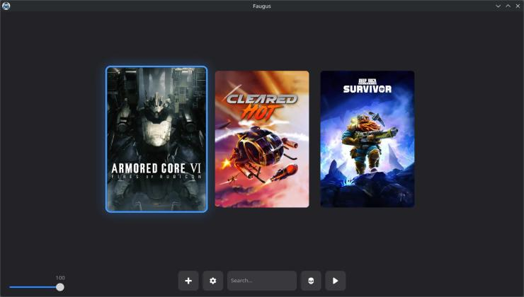

Linux游戏管理器Faugus Launcher推出2.0版本，采用全新UI，增强游戏库管理、启动参数配置及性能监控。作为Lutris和Heroic替代方案，专注简化非Steam游戏安装流程，适合Steam Deck管理Epic、GOG等平台游戏。2.0版本免费下载。  
分析：第三方启动器迭代反映Steam Deck生态成熟，跨平台管理需求增长，优化提升游戏兼容性体验。  
来源：GamingOnLinux

#### 3. Rogue Eclipse 8月7日发售
太空射击游戏《Rogue Eclipse》定于8月7日发售，玩法被形容为“星际火狐遇上装甲核心”。玩家操控高度自定义太空战机，高速飞行中切换武器模块，完成近战与远程混合战斗。确认支持Steam Deck，适配陀螺仪瞄准，售价19.99美元。  
分析：街机射击与机甲自定义结合在掌机有潜力，陀螺仪瞄准提升沉浸感，有望成暑期档独立游戏黑马。  
来源：GamingOnLinux

#### 4. 宏碁掠夺者Atlas 8掌机公布英国定价
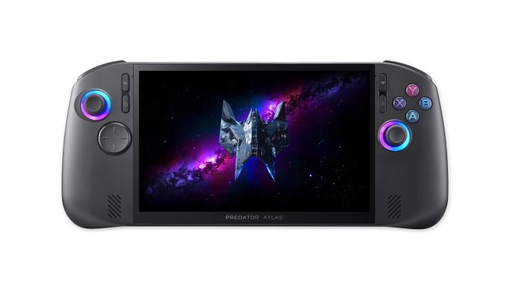

宏碁掠夺者Atlas 8掌机公布英国定价与发售时间。搭载Intel Arc G3独立显卡，8英寸高刷屏，起售价699英镑，预计2026年9月英国率先上市。作为Steam Deck竞品，主打更强图形性能与XeSS超分技术，游戏兼容性待评测验证。  
分析：Intel Arc G3加剧掌机硬件竞争，若驱动优化到位，可在光追和AI超分形成差异化，但SteamOS生态壁垒是挑战。  
来源：GamingOnLinux

### 📱 系统更新

#### 1. Valve发布Proton 11.0-2候选版本

Valve发布Proton 11.0-2候选版本（Release Candidate），面向Steam Deck及Linux玩家。

### Windows 掌机

### 🔮 新机爆料

#### 1. 《星际争霸2》被纳入暴雪BlizzCon数字礼包，进一步表明新游戏即将公布
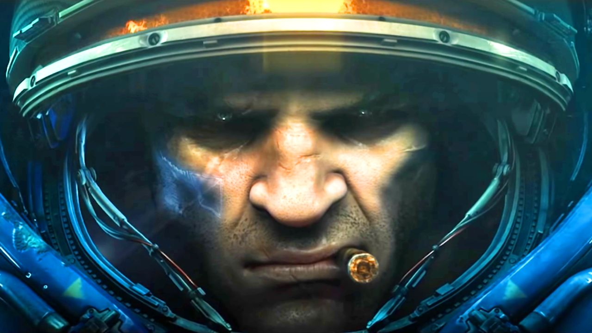

暴雪在2026年BlizzCon数字礼包中重新纳入《星际争霸2》，此举被解读为在为传闻中的星际争霸题材射击游戏预热。多个爆料渠道指出，暴雪正在开发一款全新的星际争霸FPS作品，此次将老牌RTS作品打包进礼包，可能是为了唤醒玩家社区对星际IP的关注。目前该礼包已开放购买，包含游戏内虚拟物品及数字内容。分析认为，暴雪意在测试市场水温，为即将公布的新作铺路。若传闻成真，将标志暴雪时隔多年重返FPS领域，对PC游戏生态和电竞格局产生深远影响。来源: PC Gamer

#### 2. 用舌头舔舐Mouth Pad即可获得胜利——蓝牙设备让你仅凭舌头控制PC

一款名为“Mouth Pad”的蓝牙输入设备引发关注，允许用户仅通过舌头动作控制PC光标和点击操作。早期原型被描述为“带有大量传感器的棒棒糖”，通过口腔内触控感应实现精准操控。该设备主要面向残障人士及追求新奇交互方式的玩家，目前仍处于原型阶段，未公布售价及上市日期。分析指出，这种非传统输入设备拓宽了游戏外设边界，对无障碍游戏体验有积极意义，但能否从原型走向量产并适配主流游戏，仍需观察其延迟和精度表现。来源: PC Gamer

#### 3. 微星庆祝成立40周年，推出SEVEN GRAND LAPTOP
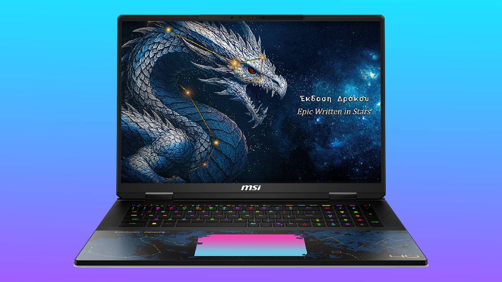

微星为庆祝成立40周年，发布旗舰级游戏本“SEVEN GRAND LAPTOP”，命名直指其7000美元起售价，定位顶级发烧友市场。配置预计搭载最新一代旗舰处理器和RTX 50系列显卡，并采用微星最顶级的散热与屏幕技术。目前仅公布概念图，具体规格和发售时间待定。分析认为，微星意在树立品牌高端形象，通过天价机型吸引眼球，但7000美元定价远超主流游戏本，实际销量可能有限，更多作为技术展示和品牌营销手段。来源: PC Gamer

#### 4. FromSoftware公布《艾尔登法环》新职业最终数据，其中一个职业已遭小幅削弱

FromSoftware正式公布《艾尔登法环》DLC“黄金树之影”新增职业的最终属性数据。其中，“重装骑士”职业相比此前测试版本已遭小幅削弱，初始耐力值和负重能力下调。其他新增职业如“咒术师”和“刺客”数据维持原样。该DLC预计2026年晚些时候登陆PC及主机平台。分析指出，FromSoftware在发售前根据测试反馈调整职业平衡，体现对游戏体验的精细打磨，削弱重装骑士可能意在防止其在PVP中过于强势，维持战斗系统多样性。来源: PC Gamer

#### 5. AMD称CUDA为“非事件”，表示企业编程层级已使英伟达技术无关紧要

AMD高管在近期采访中公开表示，英伟达的CUDA生态已不再是护城河，称其为“非事件”。AMD认为，随着企业级编程向更高抽象层级（如Python、PyTorch）迁移，底层硬件差异对开发者影响越来越小。AMD强调其ROCm平台已能无缝运行主流AI框架，并计划进一步降低开发者迁移成本。这一言论正值AMD与英伟达在AI算力市场激烈竞争之际。分析指出，AMD言论虽有营销成分，但反映了行业趋势——软件生态壁垒正在被更高层级框架消解。若AMD能持续优化ROCm兼容性，有望在AI工作站和云游戏服务器领域蚕食英伟达份额。来源: PC Gamer

### 🆕 新机发售

#### 1. 宏碁和技嘉也将推出RTX Spark笔记本电脑，但不会早于微软及其他公司

宏碁和技嘉确认将加入RTX Spark笔记本电脑阵营，但首批产品不会早于微软及其他首发厂商。RTX Spark是英伟达针对轻薄游戏本推出的新显卡系列，主打能效比与光追性能。首批搭载该显卡的机型（包括微软Surface系列）将于2026年秋季率先上市，宏碁和技嘉的对应产品计划在2027年初跟进，具体型号和定价未公布。分析指出，宏碁和技嘉的加入意味着RTX Spark系列将覆盖更广泛价格区间，但晚于微软等品牌发布，可能使其在初期竞争中处于被动，需依靠差异化设计或性价比吸引用户。来源: PC Gamer

#### 2. Faker成为韩国名誉警察，协助劝阻网络赌博

韩国电竞传奇选手Faker被任命为韩国名誉警察，主要职责是协助劝阻网络赌博行为。这一任命发生在Riot Games为《英雄联盟》引入博彩赞助商一年之后，形成鲜明对比。Faker将参与反赌博公益广告拍摄及青少年教育活动，利用其巨大影响力引导健康电竞文化。韩国警方表示，Faker的加入将有效提升反赌博宣传在年轻群体中的触达率。分析指出，Faker此举进一步巩固了其正面形象。来源: PC Gamer

### 安卓掌机

### 🔮 新机爆料

#### 1. 一加官方自曝新形态掌机设备
一加官方近日透露，正在开发一款新形态掌机设备，具体细节尚未公布。该设备将采用不同于传统安卓掌机的设计思路，可能融合手机与掌机功能。一加此前在游戏手机领域有积累，此次跨界掌机市场引发关注。具体型号、规格及发售日期待后续披露。  
**分析**：一加入局掌机市场，安卓掌机赛道竞争加剧。凭借品牌影响力和供应链优势，若产品定位精准，有望打破现有格局，推动行业向高性能与创新形态发展。  
来源：Google News

### 🆕 新机发售

#### 1. 掌机制造商需停止将新机变成长达一个月的揭秘过程
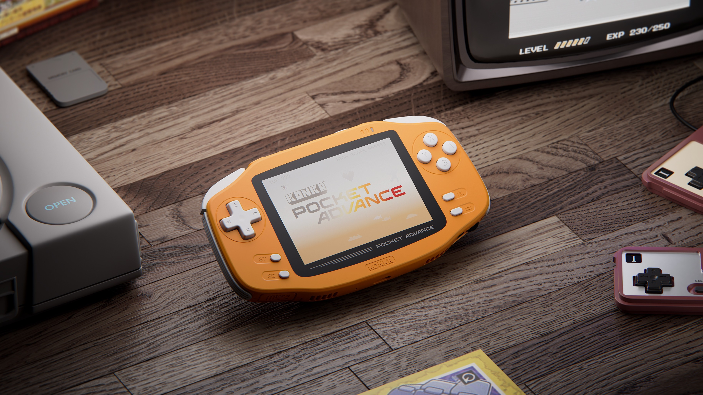

Retro Handhelds 发表评论文章，批评掌机制造商普遍采用“长线揭秘”营销策略：新机发布前数周放出模糊预告、零散规格和不确定发售日期，导致消费者耐心耗尽。文章呼吁厂商应像传统消费电子品牌一样，在正式发布时一次性公布完整信息，包括最终设计、核心配置、定价及确切上市时间，以提升市场透明度与用户信任度。  
**分析**：该评论直击行业痛点。碎片化爆料虽能维持热度，但过度消耗用户期待。转向高效发布模式有助于建立品牌信誉，减少因信息不透明导致的预订后反悔或退货。  
来源：Retro Handhelds

#### 2. Hyperkin 宣布 SupaBoy 更新配色方案
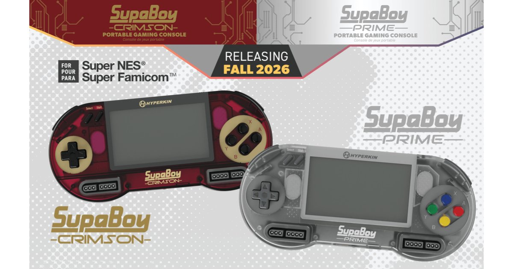

Hyperkin 宣布为其经典掌机 SupaBoy 推出全新配色方案。SupaBoy 系列自2012年问世，以兼容超级任天堂（SNES）卡带为特色，是体型较大、造型复古的便携设备。此次更新未改动硬件规格，仅提供新外观颜色选项，旨在吸引怀旧玩家和收藏爱好者。新配色版本预计近期上市，具体价格未公布。  
**分析**：SupaBoy 作为上市十余年的产品，通过换色策略延长生命周期，是典型的怀旧市场打法。此举成本低、风险小，能刺激老用户复购，但缺乏创新，难以吸引新用户。  
来源：Retro Handhelds

### 📋 其他资讯

#### 1. AceMagic K1（7430U版）评测：熟悉的感觉

Retro Handhelds 发布 AceMagic K1（搭载 AMD 7430U 处理器版本）详细评测。评测指出，在当今硬件水平下，价格相对低廉、体积仅三明治大小的迷你PC，已能胜任多数用户日常计算需求。K1 在性能、散热和便携性之间取得平衡，但设计缺乏突破性创新，整体体验“熟悉”且中规中矩。该设备面向需要便携办公或轻度游戏场景的用户。  
**分析**：AceMagic K1 代表迷你PC/掌机跨界产品的成熟化趋势。性能足够，但“熟悉感”意味着同质化竞争。未来差异化将体现在软件优化、接口丰富度及特定场景适配（如串流游戏）上。  
来源：Retro Handhelds

#### 2. Anthropic遭遇史上最大15亿美元版权诉讼罚款

美国联邦法官批准 Anthropic 与版权方之间15亿美元的诉讼和解，为AI领域史上最大金额版权赔偿。法院裁定，基于已发表书籍等材料训练AI模型属于“合理使用”，但 Anthropic 内部使用的包含700万本盗版书籍的文库直接侵犯作者权利。部分原告因赔偿金额过低拒绝接受，计划另行起诉。该判决为AI训练数据版权边界提供重要判例。  
**分析**：此案对AI行业影响深远。法院明确区分“合理使用”与“盗版文库”的界限，AI公司不能以“训练需要”为由随意使用盗版资源。未来，掌机等设备上运行的AI功能（如本地语音助手、游戏推荐算法）的数据来源合规性将受更严格审视。  
来源：Tom's Hardware

### 开源掌机/Linux掌机

### 🔮 新机爆料

#### 1. MANGMI AIR Y 与 AIR Y Pro 完整规格表公布

MANGMI 公布了 AIR Y 与 AIR Y Pro 完整规格。AIR Y 搭载骁龙 662 处理器，Pro 版升级为骁龙 865。两者均提供多种 RAM 选项，但存储配置存在差异。具体型号、价格及发售日期尚未披露，但规格表公布意味着发布临近。分析认为，高低配双机策略覆盖中端与性能市场，骁龙 865 使 Pro 版在模拟 PS2/GameCube 时更具竞争力，有望在开源掌机市场掀起性能竞赛。来源: Retro Handhelds

#### 2. 安伯尼克预热RG SP翻盖开源掌机
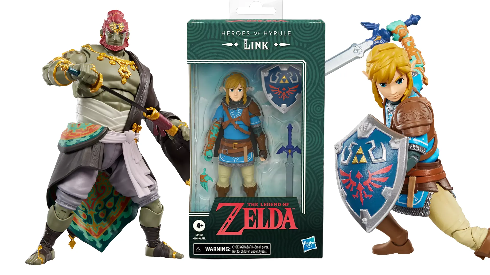

安伯尼克预热新款 RG SP 翻盖开源掌机，设计致敬 GBA SP，搭载全志 H700 芯片。官方未公布发售日期与定价，但延续品牌对复古设计的执着，预计吸引怀旧玩家。分析指出，全志 H700 是成熟方案，RG SP 主打性价比与稳定体验，翻盖设计在便携性和屏幕保护上优势明显，有望成为 GBA SP 情怀玩家的首选替代品。来源: Google News

### 🆕 新机发售

#### 1. 任天堂为《大金刚》乐高套装发布诡异广告

任天堂为《大金刚》乐高套装发布风格诡异的广告，瞄准成年怀旧玩家，通过独特视觉唤起情感记忆。乐高套装已上市，广告另类创意引发社交媒体广泛讨论。分析认为，此举意在拓展乐高联名产品受众边界，用成人向营销打破“玩具=儿童”刻板印象，成功制造话题热度，为 IP 衍生品营销提供新思路。来源: Retro Dodo

#### 2. 孩之宝公布首批《塞尔达传说》可动人偶

孩之宝公布首批《塞尔达传说》可动人偶，包括林克、塞尔达公主和加侬多夫三款。该系列已在亚马逊开启预购，人偶高度还原游戏造型，附带多种配件。这是孩之宝获任天堂授权后首批《塞尔达》主题产品，标志 IP 在收藏玩具领域拓展。分析指出，此举填补高端可动人偶市场空白，首发角色精准击中粉丝需求，预购即开启显示市场信心，未来有望推出更多角色。来源: Retro Dodo

### 📱 系统更新

#### 1. 《宝可梦 火红》与《绿宝石》融合为扩展ROM改版

ROM 改版“Fire Emerald”发布，融合《宝可梦 火红》与《绿宝石》核心内容，整合两作地区地图与剧情，加入新可捕捉宝可梦、改进战斗机制及自定义功能。玩家可在开源掌机或模拟器上运行。分析认为，两代经典合二为一提升可玩性与重复价值，代表 ROM 社区技术新高度，证明 GBA 平台宝可梦改版生态活跃，对开源掌机用户是绝佳免费内容补充。来源: Retro Dodo

### 📋 其他资讯

#### 1. 《上古卷轴：晨风》移植至双屏掌机
MOD 社区成功将《上古卷轴：晨风》移植到任天堂 DS 双屏掌机。项目需玩家自行编译和配置，过程复杂，但能实现完整 3D 探索与战斗体验。分析指出，这是社区技术力证明，但安装门槛限制大众化。案例展示开源掌机与 MOD 社区结合潜力，未来简化流程将极大丰富掌机游戏库。来源: Eurogamer

#### 2. Anbernic推出新款翻盖式复古掌机
Anbernic 在全球推出新款翻盖式复古掌机，作为 RG34XX SP 升级型号。新款在屏幕素质、按键手感及电池续航方面显著提升，保留经典翻盖设计。目前已在官方渠道上架销售，定价因地区而异。分析认为，快速迭代翻盖机型说明市场反响良好，升级点集中在核心体验，体现品牌对用户反馈的重视，巩固其在翻盖掌机细分领域的领先地位。来源: Google News

#### 3. Steam掌机
（注：原文未提供具体内容，无法压缩。建议补充完整信息。）

### PlayStation

### 🔮 新机爆料
#### 1. 爆料者预计索尼PS6和Xbox Helix将采用硬件订阅模式
- **新闻内容**：据Notebookcheck CN援引爆料者消息，下一代游戏主机，包括索尼PS6和微软Xbox Helix，预计将全面转向硬件订阅模式。玩家可能不再需要一次性购买主机硬件，而是通过按月付费获得主机及游戏服务。该模式旨在降低入门门槛，并为厂商提供更稳定的收入流。目前消息仍处于传闻阶段，具体细节未获官方证实。
- **简要分析**：若硬件订阅制成为主流，将彻底改变游戏主机销售逻辑，从“卖硬件”转向“卖服务”。这对索尼和微软既是锁定用户忠诚度的机会，也对供应链和定价策略提出新挑战。
- **来源**: Google News

### 📋 其他资讯
#### 1. 分析师称索尼取消PlayStation光盘的决定可能摧毁价值72亿美元的二手游戏市场

- **新闻内容**：Eurogamer报道，索尼计划在2028年1月前停止生产PlayStation光盘，引发行业震动。分析师指出，此举可能摧毁全球价值约72亿美元的二手游戏市场。实体游戏零售业将面临致命打击，因二手交易高度依赖光盘介质。索尼的转向被视为全面拥抱数字下载和订阅服务的信号，但也引发玩家和零售商对游戏所有权和可访问性的担忧。
- **简要分析**：索尼“去光盘化”是行业数字化的必然一步，但直接放弃72亿美元二手市场生态，可能激怒核心玩家群体，加速实体零售商倒闭潮，对行业生态造成短期阵痛。
- **来源**: Eurogamer

#### 2. 日本开发者表示：“索尼‘干脆取消硬件算了’”
- **新闻内容**：Notebookcheck CN报道，继索尼宣布停止光盘生产后，多位日本游戏开发者表达强烈不满。有开发者直言，索尼既然放弃实体介质，不如“干脆取消硬件算了”，意指索尼正在削弱PlayStation作为实体游戏平台的根基。批评声音认为，索尼决策过于激进，忽视了日本市场对实体游戏和收藏版的高度依赖。
- **简要分析**：日本开发者的反应反映了东西方市场对实体游戏认知的差异。索尼若想维持在日本市场的地位，必须在数字化转型与本土文化习惯之间找到平衡。
- **来源**: Google News

#### 3. 据报道，在实体游戏抗议活动期间，PlayStation员工受到社交媒体限制

- **新闻内容**：Notebookcheck CN援引报道称，在近期玩家和开发者针对索尼取消光盘生产的抗议活动中，PlayStation内部员工被限制在社交媒体上讨论相关话题。公司要求员工避免就实体游戏政策发表公开评论，以防止信息泄露或引发更大舆论风波。这一限制被外界解读为索尼在危机公关中的谨慎态度。
- **简要分析**：限制员工发声是危机公关的常见手段，但也易引发“压制言论”的批评。索尼此举表明其对取消光盘决策的争议性有充分认知，但沟通策略仍需优化。
- **来源**: Google News

#### 4. 前PlayStation负责人Shawn Layden希望通过复兴双A级游戏来拯救游戏行业

- **新闻内容**：Eurogamer报道，前PlayStation全球工作室负责人Shawn Layden再次呼吁游戏行业回归“双A级”游戏开发模式。他指出，随着开发成本每代翻倍，3A级大作模式已不可持续。Layden建议行业更多关注中等规模、创意驱动的作品，以降低风险并丰富游戏类型。通过合理控制预算和开发周期，双A级游戏能填补3A大作与独立游戏之间的市场空白。
- **简要分析**：Layden的观点切中行业“高成本、高风险”的痛点。若行业采纳其建议，未来可能出现更多像《RoboCop: Rogue City》这样的中等体量佳作，有助于缓解大厂对“服务型游戏”的过度依赖。
- **来源**: Eurogamer

#### 5. 《魔界战记》创作者抨击索尼取消光盘，称PlayStation不如“一不做二不休”连主机也一并取消

- **新闻内容**：IGN报道，《魔界战记》系列创作者、前日本一软件CEO Sohei Niikawa公开抨击索尼取消光盘的决定。他讽刺地表示，索尼既然抛弃实体游戏，不如“一不做二不休”连主机也一并取消。Nikawa认为，做出这一决策的高管“根本不理解受影响玩家的感受”，并警告此举将严重损害PlayStation品牌在核心玩家心中的形象。
- **简要分析**：作为日本游戏界资深人士，Nikawa的言论代表大量中小型开发商的心声。索尼的数字化激进策略，正在疏远依靠实体版销量和收藏文化的合作伙伴，可能影响未来第三方独占内容的合作意愿。
- **来源**: IGN

#### 6. 分析师称，PlayStation停止光盘生产将危及72亿美元的二手游戏市场：“实体游戏零售业注定消亡”

- **新闻内容**：GamesRadar报道，多位分析师一致认为，索尼停止光盘生产的决定将直接导致价值72亿美元的二手游戏市场崩溃。分析师指出，实体游戏零售业“注定消亡”，因为二手交易是实体店的核心利润来源。一旦光盘停产，GameStop等零售商将失去主要业务支柱，玩家也将失去买卖二手游戏的权利。索尼此举被视为彻底转向纯数字生态的宣言。
- **简要分析**：二手游戏市场的消亡对玩家意味着“买断制”的终结，游戏将彻底变为“授权使用”。数字版虽方便，但玩家将失去转售和收藏的自由，可能催生更多关于“游戏所有权”的法律争议。
- **来源**: GamesRadar

**参考资料链接列表：**
1. https://news.google.com/rss/articles/CBMib0FVX3lxTE5oTzU1U09tdl9VSDV5eHMzMkdRTDdpSlk1dFNrc1I1M3ZBY0hvUm9JUlNjR045Uk1hMzFwN0tlLUx1bDJsc1pSQzZ3TjROcmQ0Q2dt

### Xbox

### 🔮 新机爆料

#### 1. 以下是您7月份的下一批Xbox Game Pass游戏
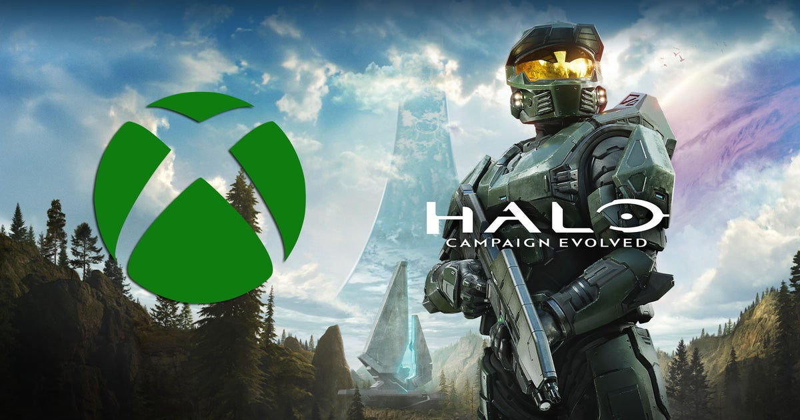

- **新闻内容**：Xbox公布7月下旬至8月初加入Game Pass的游戏阵容，《光环：战斗进化 周年纪念版》和《地狱即我们》领衔。新作涵盖经典射击与全新动作冒险，具体上线日期已公布。
- **简要分析**：经典《光环》重制版强化了Game Pass“首发/经典”双轮驱动策略，《地狱即我们》作为新IP入库，体现微软持续投资第三方独立作品，维持订阅服务吸引力。
- **来源**: Eurogamer

#### 2. 在所有平台中，Xbox是唯一实现同比增长的平台——但有一个重大前提
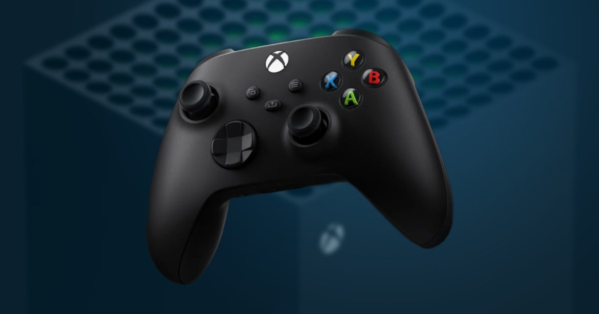

- **新闻内容**：Circana发布6月美国游戏硬件与软件支出报告，整体市场近乎全面下滑。Xbox是唯一同比增长的平台，但增长主要得益于硬件销量拉动，而非软件或服务收入，整体市场环境依然严峻。
- **简要分析**：Xbox硬件逆势增长可能得益于促销或特定机型需求，但软件与订阅收入疲软，表明微软需在内容吸引力与用户付费转化上发力，单纯硬件增长难以支撑长期生态健康。
- **来源**: Eurogamer

#### 3. 《潜行者2》开发者驳斥工作室创始人关于Xbox为独占该游戏支付了超过其开发成本的声明

- **新闻内容**：GSC Game World创始人Sergiy Grygorovych透露微软为将《潜行者2》作为限时Xbox独占支付了超过开发成本的费用。现任开发者随后驳斥该说法，称金额与协议细节存在争议。
- **简要分析**：内部口径不一暴露了游戏开发中资金与独占协议的复杂性。事件引发对“独占交易是否物有所值”的讨论，尤其在Xbox多平台战略转型背景下。
- **来源**: Eurogamer

### 🆕 新机发售

#### 1. Xbox版《阿凡达传奇：格斗游戏》延期一个多月，距原定发售不足24小时

- **新闻内容**：距原定发售日不足24小时，开发商宣布Xbox和Switch版本延期一个多月。官方未给出具体原因，仅表示需更多时间优化体验，已预购玩家将获退款或保留资格。
- **简要分析**：临发售前紧急延期对玩家信任和发行商信誉是重大打击，可能暗示Xbox和Switch平台存在未解决的性能或认证问题，反映跨平台同步发售的质量把控风险。
- **来源**: Eurogamer

### 📱 系统更新

#### 1. PS Vita竟能玩Xbox云游戏了，但得先破解才行
- **新闻内容**：通过破解后的PS Vita掌机，可运行Xbox云游戏服务，串流游玩《光环》《极限竞速》等游戏。操作利用硬件破解和第三方串流客户端，过程复杂且存在账号封禁风险，官方不支持。
- **简要分析**：现象本质是玩家对“掌机玩Xbox游戏”需求的另类满足，侧面反映Xbox云游戏在设备兼容性上的潜力。但破解涉及安全与合规问题，微软更可能通过官方渠道拓展云游戏场景。
- **来源**: Google News

### 📋 其他资讯

#### 1. Asha Sharma 被任命为 Xbox 工程副总裁，但在从微软 CoreAI 团队调任仅三个月后便离职

- **新闻内容**：今年2月，微软任命Asha Sharma为Xbox部门新负责人，接替Phil Spencer，并带来CoreAI团队同事。其中一位调任至Xbox的工程副总裁，在入职三个月后离职。微软未透露原因，表示尊重个人职业选择。
- **简要分析**：高管快速离职可能反映Xbox在战略转型期（如AI整合、组织架构调整）存在磨合问题，对团队稳定性和新领导层执行力构成挑战，外界将关注后续人事变动。
- **来源**: Eurogamer

#### 2. 2019年停产的PS Vita，现在竟能串流《光环》《极限竞速》了
- **新闻内容**：继破解版PS Vita可运行Xbox云游戏后，更多玩家验证并成功串流《光环》《极限竞速》等第一方大作。画面和操作体验受限于Vita硬件性能，但“跨界”玩法在复古游戏社区引发热议。
- **简要分析**：现象凸显Xbox云游戏在设备无关性上的优势，也暴露官方在掌机串流体验上的空白。相比依赖破解，玩家更期待微软推出官方适配的移动串流方案或专用云游戏设备。
- **来源**: Google News

#### 3. 在经历裁员和模糊的战略调整后，Xbox宣布推出PC版向下兼容计划，Blinx和Conker领衔首批游戏阵容

- **新闻内容**：Xbox宣布推出PC版向下兼容计划，Blinx和Conker领衔首批游戏阵容。
- **简要分析**：此举在裁员和战略调整后推出，旨在拓展PC平台生态，增强经典游戏的可及性。
- **来源**: Eurogamer

### 任天堂 Switch

### 🔮 新机爆料

#### 1. 开发者曝光Switch2离线通用漏洞 无需联网即可运行自制程序
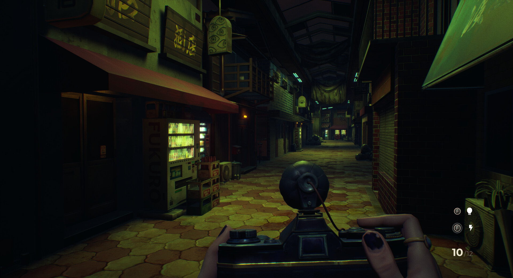

- **新闻内容**：开发者曝光了Switch 2的离线通用漏洞，无需联网即可运行自制程序。该漏洞利用系统底层权限，允许用户在未连接网络的情况下加载自定义代码。目前任天堂尚未对此作出官方回应，但这一发现可能为后续系统安全更新带来挑战。
- **简要分析**：若漏洞属实，将大幅降低Switch 2的自制程序门槛，但可能影响任天堂对数字版权和在线服务的管控策略，或加速系统固件更新频率。
- **来源**: Google News

#### 2. 孩之宝公布其全新《塞尔达传说》玩具
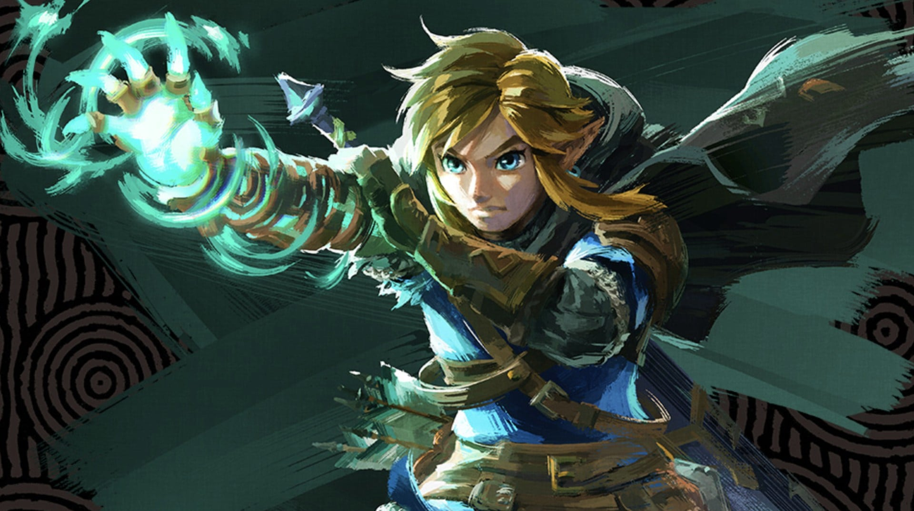

- **新闻内容**：孩之宝正式公布了全新《塞尔达传说：王国之泪》主题玩具系列“Heroes of Hyrule”。首批包含林克、塞尔达公主和加侬多夫三款人偶，均基于《王国之泪》造型设计。该系列已于7月22日亮相，部分玩家猜测这可能是未来电影造型的提前曝光。
- **简要分析**：跳过经典造型直接采用《王国之泪》设计，表明孩之宝与任天堂正积极推动IP跨媒体联动，玩具线或为后续影视化项目预热。
- **来源**: Nintendo Life

#### 3. 《大金刚》街机乐高套装正式公布，将于2026年8月发售

- **新闻内容**：乐高与任天堂正式公布了《大金刚》街机套装，还原了1981年经典街机外观，包含大金刚、马里奥及桶等可动元素。套装将于2026年8月发售，具体价格尚未公布。此前已有资深玩家对模型进行了试玩测试，确认其互动性。
- **简要分析**：乐高与任天堂的持续合作拓展了怀旧IP的实体化边界，街机套装瞄准核心收藏玩家与亲子市场，有望成为暑期爆款。
- **来源**: Nintendo Life

#### 4. 传任天堂正在评估OLED版本Switch2

- **新闻内容**：据传闻，任天堂正在评估推出OLED版本Switch 2的可能性。目前Switch 2首发采用LCD屏幕，OLED版本因成本上升可能推迟或取消。任天堂内部正在权衡显示效果提升与定价策略之间的平衡，最终决策尚未落地。
- **简要分析**：OLED版若推出将提升视觉体验，但可能拉高售价至449美元以上。任天堂的谨慎态度表明其更注重初期销量与成本控制。
- **来源**: Google News

#### 5. 指南：《斯普拉遁》攻略指南、技巧与窍门

- **新闻内容**：Nintendo Life发布了《斯普拉遁：突袭者》完整攻略指南，涵盖Spirhalite群岛生存技巧、最佳武器与装备推荐、坦克升级与Boss战解析，以及全服装解锁方法。该指南面向新老玩家，旨在帮助玩家快速上手新作复杂的战斗与升级系统。
- **简要分析**：作为系列衍生作品，攻略需求旺盛，官方指南的发布有助于降低新手门槛，维持社区活跃度。
- **来源**: Nintendo Life

#### 6. 《Sombras：负帧》公布Nintendo Switch 2发售日期与新预告片

- **新闻内容**：发行商Entalto Publishing与开发商Maboroshi Artworks确认，第一人称轻恐怖冒险游戏《Sombras：负帧》将于2026年12月3日登陆Nintendo Switch 2，并同步发布新预告片。该作于今年5月首次公布，原计划2026年第四季度发售，此次明确了具体日期。
- **简要分析**：Switch 2首发阵容持续扩充，恐怖题材独立游戏的加入丰富了平台类型多样性，12月档期瞄准年末购物季。
- **来源**: Nintendo Everything

### 🆕 新机发售

#### 1. 《匹诺曹的谎言：完全版》Switch2版新预告 8月5日发售
- **新闻内容**：类魂动作游戏《匹诺曹的谎言：完全版》发布Switch 2版新预告，确认将于2026年8月5日发售。该版本包含本体及所有DLC内容，针对Switch 2硬件进行了性能优化，支持更高帧率与加载速度。此前游戏已登陆其他平台，Switch 2版为首次移植。
- **简要分析**：作为热门类魂作品，登陆Switch 2将填补平台硬核动作游戏空白，8月发售可承接暑期档玩家需求。
- **来源**: Google News (via Switch2)

#### 2. Nintendo Switch 2 在 Woot 售价降至 399 美元，即将迎来涨价

- **新闻内容**：Nintendo Switch 2 在电商平台Woot限时降价至399美元，较原价449美元优惠50美元。但消息称该促销为短期活动，预计很快将恢复原价。此次降价可能为清库存或应对竞争对手促销，但任天堂官方未调整建议零售价。
- **简要分析**：399美元是Switch 2首发以来最低公开售价，短期降价或刺激销量，但涨价预期可能促使消费者提前入手，对二手市场产生波动。
- **来源**: Google News

### 📋 其他资讯

#### 1. 指南：《斯普拉遁》攻略指南、技巧与窍门

- **新闻内容**：同“新机爆料”第5条，该指南已作为独立资讯发布，提供完整游戏攻略。
- **简要分析**：攻略内容兼具实用性与时效性，是玩家社区的重要参考资料。
- **来源**: Nintendo Life

### 模拟器资讯

### 📱 系统更新

#### 1. 《咖啡店主理人模拟器》版本更新 - 1.0.8 - 修复死锁与性能优化
模拟经营类游戏《咖啡店主理人模拟器》近日推送1.0.8版本更新，主要修复游戏运行中的死锁问题，并进行多项性能优化，旨在提升经营咖啡店时的流畅度与稳定性。该更新已在各平台同步上线。分析认为，对于模拟经营类游戏，频繁的Bug修复与性能优化是维持玩家留存的关键，此次更新体现了开发团队对玩家体验的持续关注，有助于巩固其在小众模拟器品类中的口碑。来源：Google News

### 📋 其他资讯

#### 1. 《圣旨模拟器：一统天下》7月20日首次更新
国产模拟器游戏《圣旨模拟器：一统天下》于7月20日迎来上线后首次更新。具体内容尚未完全披露，但据开发团队此前预告，预计将包含新圣旨内容、优化部分历史事件逻辑以及修复已知文本错误，玩家可期待更丰富的“批阅奏折”体验。分析指出，作为创意题材模拟器，首次更新的内容与频率将直接影响其初期热度，若能持续推出新玩法或历史剧本，有望吸引更多对“皇帝模拟”题材感兴趣的玩家。来源：Google News

#### 2. Android版PS2模拟器采用Material You主题
知名Android平台PS2模拟器（AetherSX2等）近期迎来界面更新，正式适配谷歌Material You动态主题设计。更新后，模拟器的UI控件、菜单栏及通知栏将自动跟随系统主题色适配，提供更统一的视觉体验。该更新已面向所有用户推送。分析认为，Material You主题适配是模拟器向现代移动端设计规范靠拢的重要一步，不仅能提升用户操作愉悦感，也表明开发团队在核心性能优化之外，开始重视应用的美观性与易用性。来源：Notebookcheck CN

#### 3. PlayStation 3模拟器在Linux上新增对ATI Radeon HD 2000、3000及4000系列显卡支持
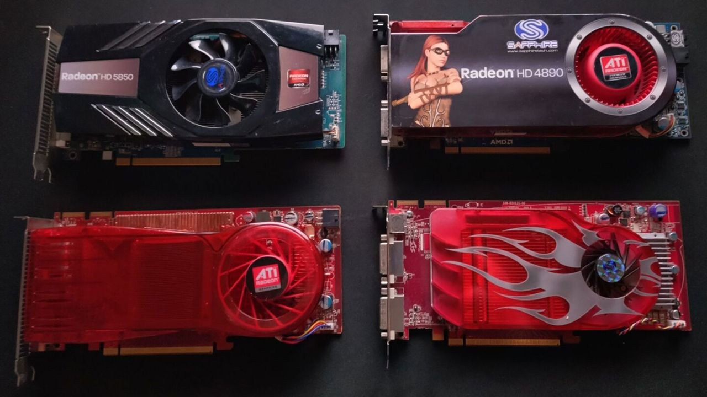

RPCS3（PlayStation 3模拟器）开发团队宣布，其Linux版本最低系统需求已扩展，新增对ATI Radeon HD 2000、3000及4000系列老旧显卡的支持。实测显示，20年前的HD 2600显卡在运行《传送门》时表现挣扎，仅能以273p分辨率输出，帧率低至13帧。该更新主要面向怀旧硬件收藏家。分析指出，RPCS3此举更多是象征性兼容性扩展，实际体验价值有限，但展示了开发团队对开源社区和极客玩家的尊重，也侧面反映了模拟器在驱动兼容性方面取得的底层技术进步。来源：Tom's Hardware

## 参考资料链接列表

1. [GamingOnLinux] Mount & Blade meets Total War in the upcoming pixel-art Sword & Banner: https://www.gamingonlinux.com/2026/07/mount-blade-meets-total-war-in-the-upcoming-pixel-art-sword-banner/
2. [GamingOnLinux] MXGP 26 revealed with a new gameplay trailer: https://www.gamingonlinux.com/2026/07/mxgp-26-revealed-with-a-new-gameplay-trailer/
3. [GamingOnLinux] Sanctuary: Shattered Sun could be an interesting Supreme Commander spiritual successor: https://www.gamingonlinux.com/2026/07/sanctuary-shattered-sun-could-be-an-interesting-supreme-commander-spiritual-successor/
4. [GamingOnLinux] Valve puts up a Proton 11.0-2 Release Candidate for testing: https://www.gamingonlinux.com/2026/07/valve-puts-up-a-proton-11-0-2-release-candidate-for-testing/
5. [GamingOnLinux] Arma: Cold War Assault Remastered is now out in full and open source: https://www.gamingonlinux.com/2026/07/arma-cold-war-assault-remastered-is-now-out-in-full-and-open-source/
6. [GamingOnLinux] Faugus Launcher 2.0 rolls out with a new UI and many other enhancements: https://www.gamingonlinux.com/2026/07/faugus-launcher-2-0-rolls-out-with-a-new-ui-and-many-other-enhancements/
7. [GamingOnLinux] Rogue Eclipse is "Starfox x Armored Core" and arrives August 7: https://www.gamingonlinux.com/2026/07/rogue-eclipse-is-starfox-x-armored-core-and-arrives-august-7/
8. [GamingOnLinux] Acer Predator Atlas 8 Handheld with Intel Arc G3 gets UK pricing and launch month: https://www.gamingonlinux.com/2026/07/acer-predator-atlas-8-handheld-with-intel-arc-g3-gets-uk-pricing-and-launch-month/
9. [PC Gamer] StarCraft 2 is included in Blizzard's BlizzCon digital goodies, which is more evidence a new game will be announced soon, right?: https://www.pcgamer.com/gaming-industry/starcraft-2-is-included-in-blizzards-blizzcon-digital-goodies-which-is-more-evidence-a-new-game-will-be-announced-soon-right/
10. [PC Gamer] Lick your way to victory with the Mouth Pad, a Bluetooth device that lets you control your PC with just your tongue: https://www.pcgamer.com/hardware/controllers/lick-your-way-to-victory-with-the-mouth-pad-a-bluetooth-device-that-lets-you-control-your-pc-with-just-your-tongue/
11. [PC Gamer] MSI celebrates 40 year anniversary by unveiling a SEVEN GRAND LAPTOP: https://www.pcgamer.com/hardware/gaming-laptops/msi-celebrates-40-year-anniversary-by-unveiling-a-seven-grand-laptop/
12. [PC Gamer] FromSoftware reveals final stats of new Elden Ring classes, and one of them already got a tiny nerf: https://www.pcgamer.com/games/rpg/fromsoftware-reveals-final-stats-of-new-elden-ring-classes-and-one-of-them-already-got-a-tiny-nerf/
13. [PC Gamer] AMD calls CUDA a 'non-event', says companies are programming at levels where the Nvidia tech doesn't really matter: https://www.pcgamer.com/hardware/amd-calls-cuda-a-non-event-says-companies-are-programming-at-levels-where-the-nvidia-tech-doesnt-really-matter/
14. [PC Gamer] Acer and Gigabyte will launch RTX Spark laptops too, but not before Microsoft and Co.: https://www.pcgamer.com/hardware/gaming-laptops/acer-and-gigabyte-will-launch-rtx-spark-laptops-too-but-not-before-microsoft-and-co/
15. [PC Gamer] Faker becomes an honorary Korean police officer to help discourage online gambling: https://www.pcgamer.com/games/moba/faker-becomes-an-honorary-korean-police-officer-to-help-discourage-online-gambling/
16. [Retro Handhelds] Handheld Makers Need to Stop Turning Every New Handheld Into a Month-Long Reveal: https://retrohandhelds.gg/handheld-makers-need-to-stop-turning-every-new-handheld-into-a-month-long-reveal/
17. [Retro Handhelds] Hyperkin Announces Updated Colorways for the SupaBoy: https://retrohandhelds.gg/hyperkin-announces-updated-colorways-for-the-supaboy/
18. [Google News] 一加官方自曝新形态掌机设备: https://news.google.com/rss/articles/CBMiSkFVX3lxTE5ZVHRWYTlNMThuWUI1TG9TX2hYQXBsY0gxWFVjdFlLZnJoTmRGV3kxR3ZiaFdiZU1TYXI2NUNBd3ltY1VJWm9ITW1B?oc=5
19. [Retro Handhelds] AceMagic K1 (7430U Edition) Review: Feels Familiar: https://retrohandhelds.gg/acemagic-k1-7430u-review/
20. [Tom's Hardware] Anthropic hit with largest-ever $1.5 billion penalty in copyright lawsuit — court says training AI on published material is fair use, but startup’s pirated library infringes on authors’ rights: https://www.tomshardware.com/tech-industry/artificial-intelligence/anthropic-slapped-with-usd1-5-billion-settlement-in-copyright-lawsuit-largest-payout-ever-court-says-that-training-ai-on-books-other-publications-is-fair-use-but-ruled-that-the-startups-7-million-book-pirated-library-infringes-authors-rights
21. [Retro Handhelds] MANGMI AIR Y and AIR Y Pro Full Spec Sheet Finally Revealed: https://retrohandhelds.gg/mangmi-air-y-and-air-y-pro-full-spec-sheet-finally-revealed/
22. [Google News] 安伯尼克预热RG SP翻盖开源掌机，致敬GBA SP搭载全志H700芯片: https://news.google.com/rss/articles/CBMiiAFBVV95cUxOYlFUbHRhRlBWX0xZWlRFcmY2enlXTmw3bWxyYlZCTW5uN2k0M2JvSEZPUlBGY0IwRmYyRXBiSXlrcEpOMENmZFBycFRqSTUyaW5WOEFiV0U4c3lkR3Fya1ZUaDR0MDZPYWlBQVo3NUVoTkMxTzZRX1laNGt4T2E1OE1tVGVTcG02?oc=5
23. [Retro Dodo (掌机)] Nintendo Launches Creepy Advert For Donkey Kong Lego Set: https://retrododo.com/nintendo-launches-creepy-advert-for-donkey-kong-lego-set/
24. [Retro Dodo (掌机)] Hasbro Reveals First Wave Of Legend of Zelda Action Figures: https://retrododo.com/hasbro-reveals-first-wave-of-legend-of-zelda-action-figures/
25. [Retro Dodo (掌机)] Pokémon FireRed & Emerald Have Been Fused Into An Extended ROM Hack: https://retrododo.com/pokemon-firered-emerald-have-been-fused-into-an-extended-rom-hack/
26. [Eurogamer] Ever wanted to play The Elder Scrolls: Morrowind on a dual-screen handheld? Well, now you can - if you don't mind putting in some legwork: https://www.eurogamer.net/morrowind-ds-mod
27. [Google News] Anbernic在全球推出新款翻盖式复古掌机，相比旧款RG34XX SP进行了多项升级: https://news.google.com/rss/articles/CBMidEFVX3lxTE5XVlRPY0ctX0w2REoxQWFkcEowclRWZ1BYcFJKZmY1ZlJ5VkhSNDY3YVhIZ3oxSkpDeVgyck1BOVl6cUo0dTJtRmkza0VmS2FabTdoa2dhRExacGFFdnIybnkyTVdwODA3RDFfWUpNZmFZT3lw?oc=5
28. [Google News] Steam掌机"大崩盘"！销量暴跌82% 太贵了买不起: https://news.google.com/rss/articles/CBMiYkFVX3lxTE5DbDd1bDJScE1odGJuNnhjSTh2QzJxaWJQRFZjR3VhLVMxVW5GTFlMSDJZS1A3NThOcnNmcTg4c09fWDFwOFJyNVZPYUJKQ1d5eWFMcVNQQmdpZndILVVQaTlB?oc=5
29. [Google News] 爆料者预计索尼PS6和Xbox Helix将采用硬件订阅模式 - Notebookcheck CN: https://news.google.com/rss/articles/CBMib0FVX3lxTE5oTzU1U09tdl9VSDV5eHMzMkdRTDdpSlk1dFNrc1I1M3ZBY0hvUm9JUlNjR045Uk1hMzFwN0tlLUx1bDJsc1pSQzZ3TjROcmQ0Q2dtQTJIVUFXT1pjRUZ6TnoySTUzV3dmWXgxNnBYVQ?oc=5
30. [Eurogamer] Sony's decision to kill off PlayStation discs could destroy the $7.2bn used game market, according to analysts: https://www.eurogamer.net/used-video-game-market-at-risk-sony-killing-playstation-discs
31. [Google News] 日本开发者表示：“索尼‘干脆取消硬件算了’” - Notebookcheck CN: https://news.google.com/rss/articles/CBMiW0FVX3lxTE5Wb3d4NE1SRmFIeFN1eGhCLVo3VUViNHpNYUEzcUlFV3BxQnlSTVNmdDhkeVBsUWk3R0R5U2xjNG9mczRxV08xQ29BWE4tbXktWU41NEVfQ25yLTA?oc=5
32. [Google News] 据报道，在实体游戏抗议活动期间，PlayStation员工受到社交媒体限制 - Notebookcheck CN: https://news.google.com/rss/articles/CBMia0FVX3lxTE1GR1k5TWloT3NlUUhJOERhY0VodHEwU1JaOTRSSkx6S2N5Wnd0b3FrdHRSNURpNGpmZG1iSDFlNk1EUjZ3cEpBZHNGMWpRZW1oYU1OZ3FhMkNReVQ5YUFHV0FOd1pja0NsWEVn?oc=5
33. [Eurogamer] Former PlayStation boss Shawn Layden wants to save games by bringing back double-A - and he has a plan: https://www.eurogamer.net/former-playstation-boss-shawn-layden-bringing-double-a-back
34. [IGN] Disgaea Creator Slams Sony for Scrapping Discs, Says PlayStation Might as Well 'Go All the Way' and Scrap Consoles Too: https://www.ign.com/articles/disgaea-creator-slams-sony-for-scrapping-discs-says-playstation-might-as-well-go-all-the-way-and-scrap-consoles-too
35. [GamesRadar] PlayStation is risking a $7.2 billion used games market by ending disc production, analysts say: "Brick and mortar game retail is doomed": https://www.gamesradar.com/games/playstation-is-risking-a-usd7-2-billion-used-games-market-by-ending-disc-production-analysts-say-brick-and-mortar-game-retail-is-doomed/
36. [Eurogamer] Here's your next batch of Xbox Game Pass games for July: https://www.eurogamer.net/xbox-game-pass-july-wave-2
37. [Eurogamer] Of all the platforms, Xbox is the only one to have just grown year-on-year - but there's a big catch: https://www.eurogamer.net/circana-june-2026-game-hardware-xbox-growth-software-sales
38. [Eurogamer] Stalker 2 developer refutes claims by studio founder that Xbox paid more than game's development cost to make it exclusive: https://www.eurogamer.net/stalker-2-xbox-timed-exclusivity-claim-refuted
39. [Eurogamer] Xbox version of Avatar Legends: The Fighting Game delayed by over a month, less than 24 hours before launch: https://www.eurogamer.net/avatar-legends-fighting-game-xbox-delay-switch-version
40. [Google News] PS Vita竟能玩Xbox云游戏了，但得先破解才行: https://news.google.com/rss/articles/CBMiYkFVX3lxTE55ZDJyODZFMlVyWUpyZTRhUHZ4T1c5YWVVc3RHV0hieFVvc1ZEQXBmTzZYOS1yU3NEcF9wVDJaSHJUQ2JOWWdUWWZrMlFVa0RCdXhibWNfOVYtVTJqRlBxXy1R?oc=5
41. [Eurogamer] Asha Sharma-appointed Xbox VP of engineering leaves just three months after moving over from Microsoft's CoreAI team: https://www.eurogamer.net/xbox-vp-engineering-leaves-after-three-months
42. [Google News] 2019年停产的PS Vita，现在竟能串流《光环》《极限竞速》了: https://news.google.com/rss/articles/CBMiYkFVX3lxTFBvaHRqOHZnVDlQdy1rcVhRakd3NGx4OGRnOTZjYmc5bWoySF95VXhoMEFrdzBzM2pQQ2dqVGxpVDg2YWYwMk9FMnRtV09jRGFCTHJEcjM2RGI5Y18tZTZwMEhR?oc=5
43. [Eurogamer] Following layoffs and muddy strategy shifts, Xbox announces Backward Compatibility on PC program, with Blinx and Conker leading the first wave: https://www.eurogamer.net/xbox-backward-compatibility-on-pc-announced
44. [Google News] 开发者曝光Switch2离线通用漏洞 无需联网即可运行自制程序: https://news.google.com/rss/articles/CBMiZEFVX3lxTE44eG84M2prV0hBZmpwRlE3TENOWHJYVXBqOXBQZWV2TEVZaFd6SUhRUjVWZFh5UzA0WXRadDVHSXdDYlpFN1B3X2dOd3hPLWJSTjVkUm45WmxSTDN0blVtdzhnVFQ?oc=5
45. [Nintendo Life] Hasbro Reveals Its New Legend Of Zelda Toys, And Yeah, We Want Them: https://www.nintendolife.com/news/2026/07/hasbro-reveals-its-new-legend-of-zelda-toys-and-yeah-we-want-them
46. [Nintendo Life] Donkey Kong Arcade LEGO Set Officially Revealed, Available August 2026: https://www.nintendolife.com/news/2026/07/donkey-kong-arcade-lego-set-officially-revealed-available-august-2026
47. [Google News] 【硬件资讯】换个屏还要思量半天？传任天堂正在评估OLED版本Switch2，成本影响很大吗？？: https://news.google.com/rss/articles/CBMiYkFVX3lxTE1hTVJIaTQweHUtTFZ3RFBBVVJkYXVFNmR5SzM3N2dMdWpBaS1DYXdaeUl3MU5YWXFBQjZ2LVdDYUNscUl2RXl1dUdLaHNyTkRQaENuSHRweFA5VVAwRHJLMlJB?oc=5
48. [Nintendo Life] Guide: Splatoon Raiders Guide, Tips & Tricks: https://www.nintendolife.com/guides/splatoon-raiders-guide-tips-tricks
49. [Nintendo Everything] Sombras: Negative Frames shares Nintendo Switch 2 release date, new trailer: https://nintendoeverything.com/sombras-negative-frames-shares-nintendo-switch-2-release-date-new-trailer/
50. [Google News (via Switch2)] 《匹诺曹的谎言：完全版》Switch2版新预告 8月5日发售: https://news.google.com/rss/articles/CBMiZEFVX3lxTE9zbjhiZGYxR1p2YVB0VGJfUXpoSWlIVlhJUEJLYXJEcHhxLTVGa3Vsb1drbUVKdmVrQkVNWExrMEZOVTIxZlR6dnlIaExxVk1PUW5UNmhONGlENU1QWkVUSUs3REY?oc=5
51. [Google News] Nintendo Switch 2 在 Woot 售价降至 $399，即将迎来涨价: https://news.google.com/rss/articles/CBMi7AFBVV95cUxPUGlaWENQTGd0Rlo2Nm52bXNRa1owck1XdlgxNkJaOEtvUGl5enNnVHp0UmczanV0NURJMVRIWHNFQmhQRV94MUpXeDFGd1pNWUx5TmtYSU1yQk45aTN2M2RSb0NaOEVSSjlhZVR6ZXdnSDVQWE9sRDByR3p4SG5KMjNmY2F6T2hTaTNsTHVmU1hVMkU0M2s0YkhxZnI2TWJGdUdPMFE5SWI1d0N5by1BejdNenp2MzBPWUxyVE15QW1ab1hpajY2MThBdjZxeE1hN3lvbGhhVVVVMW5wRjc5NlhOQk9xWlFXUklweQ?oc=5
52. [Google News] 《咖啡店主理人模拟器》版本更新 - 1.0.8 - 修复死锁与性能优化 - news.17173.com: https://news.google.com/rss/articles/CBMiZEFVX3lxTE9ZS0lIRWJ1OXJGVlk2UW1xdDFrZzFQdVJobkpKUXhLS2NHQ2tlMGhQVk5URFExdWNlRUF6SXVuWUVuZUlWVjZzVkdlbHhwRW5leUFGZ3lCaWhBVVFJRnBvQTlEamU?oc=5
53. [Google News] 《圣旨模拟器：一统天下》7-20 第一次更新 - news.17173.com: https://news.google.com/rss/articles/CBMiZEFVX3lxTFA0RXZPOFJqM2liRklfRmpLWkV6d1Q3VDNpcEM5Z1VST2tqeTZaaTVvZEkweGozWUpVZW40TjZCZEVfNWdEN2lkZlN3R3doa091b1BfOVBoeFVxWEpnUy1qYkk3dGE?oc=5
54. [Google News] Android版PS2模拟器刚刚采用了Material You主题 - Notebookcheck CN: https://news.google.com/rss/articles/CBMifEFVX3lxTE1rcjY0Nk1DRjBVVXl6MFo1T1VrN044SHZmZi1tS1pMWk9Zb3c1SUhXSlVGTlc5NTctWUhFOWFhV2p4Q1d6eklsR1VuYlBiQW5uZkZJQjJrMUZxN0w1WUtMRndBc1RNNUx5NFlfMDR3VG9NV2V1UFEySWhTNm8?oc=5
55. [Tom's Hardware] PlayStation 3 emulator adds support for ATI Radeon HD 2000, 3000, and 4000 series graphics cards on Linux — 20-year-old HD 2600 crumbles, can only run Portal at 13 fps in 273p: https://www.tomshardware.com/video-games/retro-gaming/playstation-3-emulator-adds-support-for-ati-radeon-hd-2000-3000-and-4000-series-graphics-cards-on-linux-20-year-old-hd-2600-crumbles-can-only-run-portal-at-13-fps-in-273p

## 🇨🇳 国内资讯

### Steam Deck

### 🆕 新机发售

#### 1. Steam Machine开箱：他为何已经想改装？

知名科技UP主@JayzTwoCents（订阅433万）发布Steam Machine开箱视频，由B站账号“阿布看AI”译制。视频中他展示了新机外观与配置，但随即表示已有改装计划，暗示官方设计在散热或扩展性上留有遗憾。该视频于7月22日上线，播放量41次，引发核心玩家对Steam Machine可玩性的讨论。

**简要分析**：百万级UP主第一时间开箱并提及改装，说明Steam Machine在硬核玩家眼中仍有优化空间。这既为第三方配件市场带来机会，也可能倒逼Valve在后续批次中改进设计。

**来源**：B站（via Steam Machine）

---

### 📋 其他资讯

#### 1. 八位堂天刃星街机控制器 Hitbox 格斗键盘 适配Switch2/PC/Steam
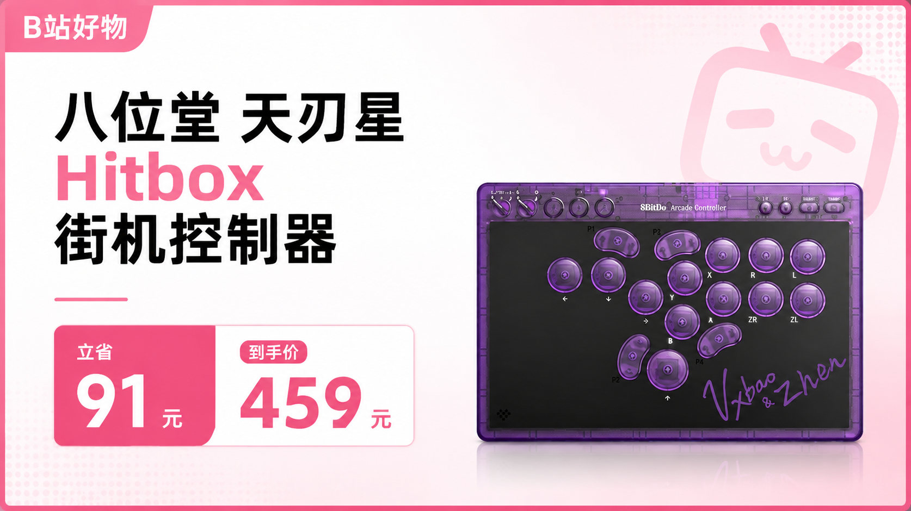

外设厂商八位堂推出“天刃星”街机控制器，采用Hitbox格斗键盘布局，兼容Switch 2、PC及Steam平台。该控制器专为格斗游戏玩家设计，提供精准按键响应与低延迟连接，适合《街霸》《铁拳》等作品。B站UP主“数码情报局さ”于7月22日发布介绍视频，播放量98次。

**简要分析**：八位堂持续深耕跨平台格斗外设，Hitbox布局在职业玩家中接受度渐高。适配Steam Deck和Switch 2意味着移动端格斗场景正在被重视。

**来源**：B站（via Steam 控制器）

#### 2. 龙之剑觉醒修改器护肝控制台，无限生命|金钱|体力耐力|一击必杀，风灵mod下载安装教程攻略

B站UP主“星星会有猫的”发布《龙之剑觉醒》修改器教程，提供无限生命、金钱、体力耐力及一击必杀等功能的“护肝控制台”，并附风灵月影Mod下载链接。视频播放量436次，教程指向第三方文档站点，方便玩家快速安装。该修改器旨在降低游戏重复刷取门槛，适合时间有限的Steam Deck玩家。

**简要分析**：修改器内容在掌机社区热度较高，反映部分玩家对“减负”体验的刚需。但需注意第三方链接安全性，建议玩家从官方Mod平台获取。

**来源**：B站（via Steam 控制器）

#### 3. Steam Deck OLED 演示《龙之剑》
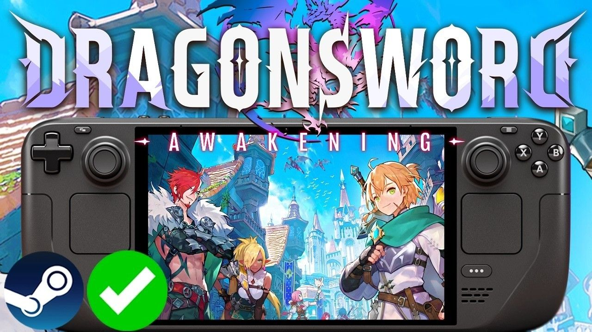

B站UP主“游戏大金刚”发布Steam Deck OLED运行《龙之剑》的实机演示视频，播放量达1863次。视频展示了OLED屏幕在游戏中的色彩表现与帧率稳定性，并附YouTube原链接供参考。该演示为玩家提供了掌机端实际体验参考，尤其关注HDR效果与续航表现。

**简要分析**：OLED版Steam Deck的屏幕素质是核心卖点，此类实机演示能直观吸引潜在买家。随着《龙之剑》这类新作登陆，掌机性能验证内容需求持续增长。

**来源**：B站（via Steam Deck 游戏）

#### 4. 军团塔防修改器全功能Mod工具｜无限资源刷单位刷建筑 建筑升级 卡牌符石 战场控制玩法修改教学

UP主“QIQI-Game”发布《军团塔防》全功能Mod工具教学，支持无限资源、单位控制、建筑编辑、卡牌系统及战场状态调整等修改。视频播放量172次，旨在帮助玩家自由探索不同防守策略，降低策略游戏重复试错成本。该工具适用于Steam Deck掌机，通过控制器即可操作。

**简要分析**：塔防类游戏在掌机上操作适配良好，Mod工具进一步延长了游戏寿命。此类内容侧面印证了Steam Deck作为“便携修改器平台”的独特定位。

**来源**：B站（via Steam 控制器）

#### 5. 工业巨头!编辑资源+快速研究！内置GM控制台来袭！

UP主“鲤兔理理兔”发布《工业巨头》内置GM控制台教程，支持资源编辑与快速研究，帮助玩家加速工厂建设流程。视频播放量163次，附第三方文档链接。该控制台可大幅缩短经营模拟类游戏的初期积累时间，适合希望在Steam Deck上快速体验核心玩法的用户。

**简要分析**：经营模拟游戏在掌机上操作复杂度较高，GM控制台能有效降低上手门槛。此类工具若被官方整合，或可提升游戏在移动端的吸引力。

**来源**：B站（via Steam 控制器）

#### 6. [中配]龙剑觉醒：Steam Deck性能与最佳设置指南！ - Steam Flow

B站UP主“环球游戏摸鱼社”译制了YouTube频道Steam Flow的《龙剑觉醒》Steam Deck性能评测与最佳设置指南。原视频于7月21日发布，详细测试了这款动漫风格开放世界动作RPG在掌机上的帧率、画质与功耗表现，并给出优化建议。译制版播放量1264次，为中文玩家提供了实用的调参参考。

**简要分析**：Steam Flow是专注掌机性能评测的知名频道，其设置指南对玩家极具实操价值。中文译制填补了国内玩家获取外网优化信息的空白，有助于提升《龙剑觉醒》在掌机上的体验。

**来源**：B站（via Steam Deck 游戏）

### Windows 掌机

### 🔮 新机爆料

#### 1. 核显接近2060 还可变身轻薄本 壹号本OneXPlayer3上手体验
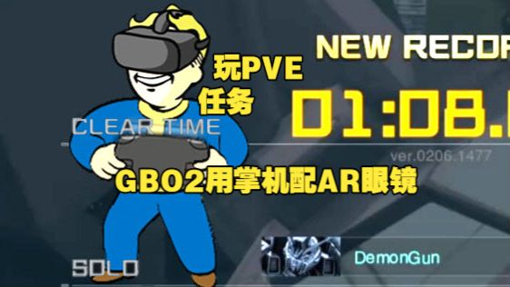

- **新闻内容**：壹号本OneXPlayer3正式亮相，搭载Intel Arc G3 Extreme掌机处理器，核显性能接近桌面级RTX 2060。该设备采用可拆卸手柄设计，拆下后可变为轻薄笔记本电脑，兼顾掌机游戏与移动办公。UP主“科技宅公社”已发布上手体验视频，播放量达2.8万，引发玩家对Windows掌机“吃灰”问题的讨论。
- **简要分析**：OneXPlayer3的“掌机+笔记本”二合一形态，直击Windows掌机使用场景单一的痛点。若性能与便携性平衡得当，有望开辟高端掌机细分市场，但也考验壹号本在散热和续航上的调校。
- **来源**: B站(via OneXPlayer 掌机)

### 🆕 新机发售

#### 1. V社推出全新SteamOS：5分钟一键安装！
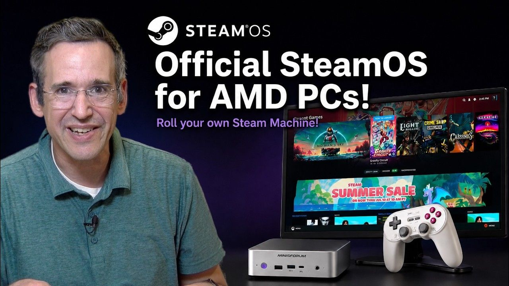

- **新闻内容**：Valve发布全新SteamOS安装工具，支持5分钟一键安装，降低非Steam Deck设备体验SteamOS的门槛。GPD掌机官方发布安装教程视频，并设立SteamOS专题页面（softwincn.com/steamos），演示了在GPD掌机上安装SteamOS后运行《无人深空》等游戏的性能表现。该工具已面向所有Windows掌机用户开放。
- **简要分析**：V社此举意在扩大SteamOS生态覆盖，打破硬件绑定。对于GPD、AYANEO等第三方掌机厂商，SteamOS的开放安装既是机遇（提升系统体验）也是挑战（可能削弱自家系统差异化）。
- **来源**: B站动态@GPD掌机官方

#### 2. AYANEO发布Pocket Micro 2掌机，提供白色、黑色和紫色三种配色

- **新闻内容**：AYANEO发布Pocket Micro 2复古掌机，提供白色、黑色和紫色三种配色。设备采用经典掌机设计，配备方向键、ABXY按键和双摇杆，屏幕色彩表现丰富，主打便携游戏体验。官方展示画面显示该机可流畅运行像素风格游戏，定位怀旧游戏爱好者市场。
- **简要分析**：Pocket Micro 2延续AYANEO在复古掌机领域的布局，切入“情怀”细分赛道。在性能卷向3A大作的当下，这类主打便携与复古体验的产品，有望吸引非核心硬核玩家群体。
- **来源**: B站动态@AYANEO官方

#### 3. ROG破风标准版游戏耳机发布，首发价499元

- **新闻内容**：ROG玩家国度发布破风标准版游戏耳机，搭载50mm ROG镀钛振膜发声单元和10mm超宽频吊杆麦克风，支持高级参数化EQ调节与游戏预设参数。耳机采用3级可调弹性头带，轻量化设计仅重300g，支持USB有线连接，耳罩配备光环灯效。首发价499元，已在京东等平台开售。
- **简要分析**：ROG破风标准版以499元价位切入中端游戏耳机市场，镀钛振膜和宽频麦克风是核心卖点。轻量化设计（300g）和USB有线连接适合长时间游戏场景，但缺少无线版本可能限制部分用户选择。
- **来源**: B站动态@ROG玩家国度

#### 4. 宏碁公布掌机掠夺者Atlas 8售价！999英镑起步！
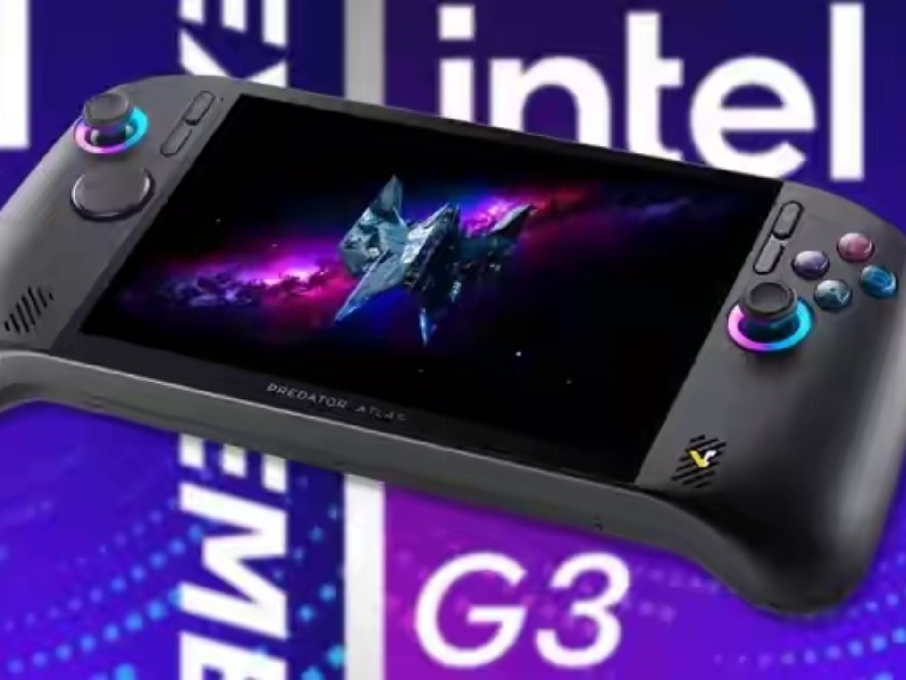

- **新闻内容**：宏碁公布旗下首款Windows掌机“掠夺者Atlas 8”售价，起售价为999英镑（约合人民币9300元）。该消息由B站UP主“日月山河千古秀”发布，视频播放量达6491次。目前官方尚未公布完整配置参数，但999英镑的定价已使其跻身高端掌机行列，与ROG Ally X、OneXPlayer等旗舰产品直接竞争。
- **简要分析**：宏碁以掠夺者品牌入局掌机市场，999英镑的定价表明其定位高端性能旗舰。作为PC大厂，宏碁在散热和品控上有传统优势，但掌机市场的品牌认知度仍需从零建立，定价能否被玩家接受有待观察。
- **来源**: B站(via Win 掌机)

#### 5. 壹号本OneXPlayer3上手体验（已在上方“新机爆料”板块播报，此处不再重复）

### 📱 系统更新

#### 1. ROG Ally X Z2 Extreme /《底特律：化身为人》性能测试 / SteamOS 3.8.24

- **新闻内容**：UP主“Deck_HQ”发布ROG Ally X（搭载Z2 Extreme处理器）运行《底特律：化身为人》的性能测试视频，涵盖从720P低画质13W到1080P高画质35W共8个功耗与画质档位。测试结果显示，在17W功耗下720P高画质可流畅运行，25W功耗下900P超高画质可锁定30帧。同时，该视频还涉及SteamOS 3.8.24版本的兼容性验证。
- **简要分析**：Z2 Extreme处理器在ROG Ally X上的表现证明，新一代掌机芯片已能在中低功耗下流畅运行3A大作。SteamOS 3.8.24的兼容性测试，进一步印证了第三方掌机安装SteamOS的可行性。

### 安卓掌机

### 🆕 新机发售

#### 1. AYANEO推出全新掌机KONKR Pocket Advance，采用经典复古设计

- **新闻内容**：AYANEO官方于7月21日在B站动态宣布，推出全新掌机KONKR Pocket Advance。该机型采用经典复古设计，以橙色为主色调，延续经典轮廓，旨在复刻熟悉握感，强调便携与怀旧体验。官方表示产品即将发布，但具体规格、售价及发售日期尚未公布，玩家可通过官网或QQ群获取最新动态。
- **简要分析**：AYANEO此举瞄准复古掌机细分市场，通过情怀设计吸引老玩家。但仅靠外观复刻难以形成差异化，若性能与定价无法匹配，可能沦为小众收藏品，对品牌主流产品线影响有限。
- **来源**: B站动态@AYANEO官方

#### 2. 安卓AzaharPlus模拟器v2126.0-A汉化版发布

- **新闻内容**：7月20日，UP主dreamboyn81发布安卓AzaharPlus模拟器v2126.0-A汉化版。该版本基于最新上游代码编译，针对中文用户进行界面与功能汉化，提升操作易用性。目前提供百度网盘和123云盘下载链接，并附有永久更新地址，方便玩家获取后续版本。
- **简要分析**：汉化版模拟器降低国内玩家使用门槛，有助于扩大AzaharPlus在安卓掌机用户中的普及率。但模拟器性能优化仍依赖上游更新，汉化版更多是本地化适配，对行业技术推动有限。
- **来源**: B站（via 安卓 模拟器 掌机）

### 📱 系统更新

#### 1. Y700五代【盖世游戏】模拟运行PC漫威蜘蛛侠重置版效果演示
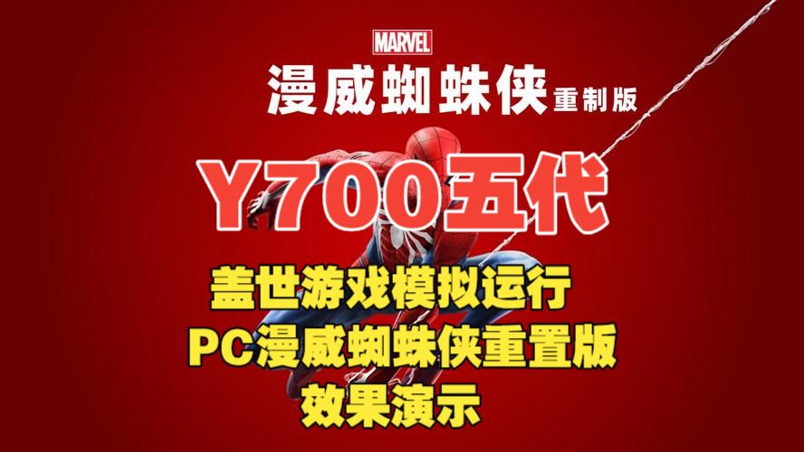

- **新闻内容**：7月20日，UP主“二度混合”发布视频，演示在联想Y700五代平板上使用“盖世游戏”6.0.9版本模拟运行PC版《漫威蜘蛛侠：重置版》。视频展示游戏运行效果，并分享推荐配置方案，已上传至盖世云分享，同设备玩家可直接应用。UP主强调视频内容仅供参考，并呼吁支持正版游戏。
- **简要分析**：该演示展示安卓设备通过模拟层运行PC游戏的潜力，但破解版游戏的使用存在版权风险。对于Y700五代用户，这提供了一种尝鲜PC大作的可能，但实际体验受限于设备性能，难以替代原生PC掌机。
- **来源**: B站（via 安卓 模拟器 掌机）

#### 2. PSX2 Mali优化版实测：天玑最强PS2模拟器？最佳设置与流畅调优指南

- **新闻内容**：7月21日，UP主“非梦nanjing”发布PSX2模拟器v1.2.5版本实测视频。该版本基于PCSX2底层构建，重点针对Mali GPU和联发科天玑处理器进行优化。视频详细讲解BIOS与游戏目录配置、Vulkan/OpenGL渲染器切换、分辨率缩放及混合精确度等关键设置，旨在帮助玩家在安卓掌机上获得最佳PS2游戏画质与流畅度。
- **简要分析**：PSX2针对Mali GPU的优化，直接利好采用联发科芯片的安卓掌机（如部分国产机型），有望提升PS2模拟的兼容性与帧率。这或推动更多厂商考虑天玑平台，但模拟器稳定性仍需长期打磨，短期内难以撼动骁龙在模拟器领域的统治地位。
- **来源**: B站（via 安卓 模拟器 掌机）

### 开源掌机/Linux掌机

### 🆕 新机发售

#### 1. Anbernic RG SP掌机发布，提供黑、粉、青、银四色版本
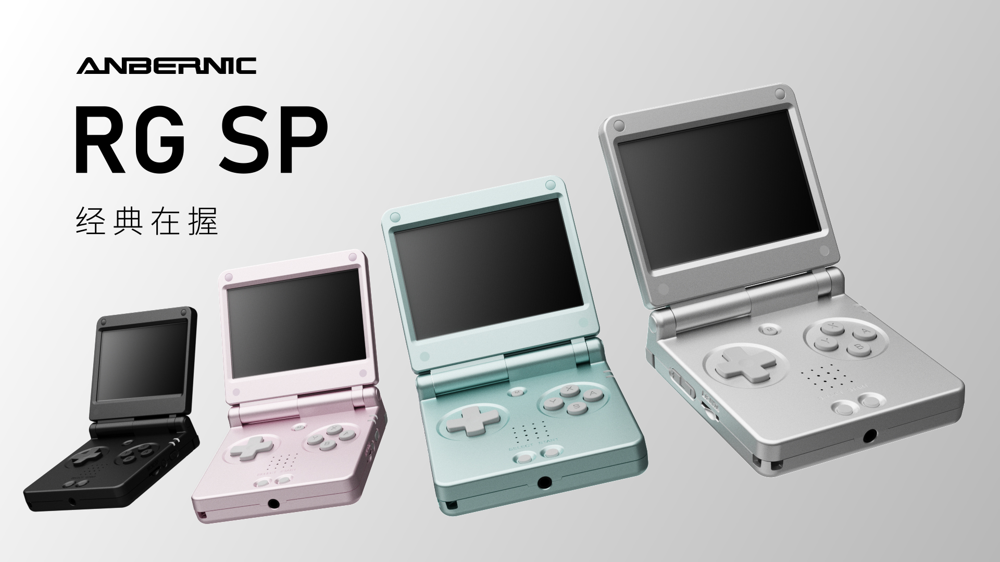

- **新闻内容**：Anbernic发布RG SP翻盖掌机，提供黑、粉、青、银四色。配备3.4英寸IPS屏幕，分辨率720×480，支持复古游戏3倍点对点显示。采用双合金转轴设计，支持多角度悬停，搭载H700芯片，运行安伯尼克Linux系统。
- **简要分析**：RG SP以翻盖形态和点对点显示切入复古市场，H700芯片方案成熟，四色选择兼顾怀旧与个性化，有望成为入门级翻盖掌机热门选择。
- **来源**: B站动态@董先生的游戏屋

### 📋 其他资讯

#### 1. KTR2教程，KOS系统配置，天马G专属配置包安装，256G整合包

- **新闻内容**：UP主“千夏的铲子”发布KTR2掌机完整教程，涵盖KOS系统配置、天马G专属配置包安装及256G整合包资源。资源已上传百度网盘（提取码KTR2），并开放KTR掌机高级群（719631484）和KOS系统内测群（903338346）供玩家交流。
- **简要分析**：整合包和教程降低玩家上手门槛，适合新手快速体验KTR2掌机生态，反映社区对KOS系统的持续关注。
- **来源**: B站动态@千夏的铲子

#### 2. R46H掌机被恶意退货退款，仅退款成功，线下维权找回
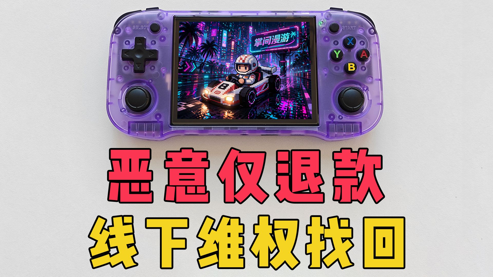

- **新闻内容**：UP主“掌间漫游”发布视频，曝光R46H掌机遭遇买家恶意退货退款，平台“仅退款”成功后，卖家通过线下维权找回机器。视频播放量9313次，引发社区对二手交易风险的讨论。
- **简要分析**：事件暴露部分电商平台“仅退款”规则在二手掌机交易中的漏洞，提醒卖家加强发货前验机与维权意识，呼吁平台优化审核机制。
- **来源**: B站(via ArkOS)

#### 3. 周哥h700新品来袭，韭菜们长好了没？
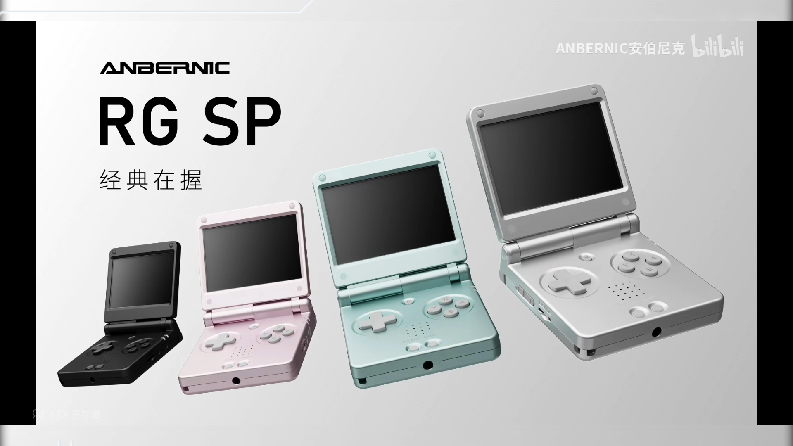

- **新闻内容**：UP主“香甜大萝布”发布视频，调侃周哥（Anbernic）即将推出基于H700芯片的新品，标题直指“韭菜们长好了没”。视频播放量3670次，评论区对周哥频繁迭代H700方案、定价策略展开热议。
- **简要分析**：H700芯片已成国产开源掌机“万金油”方案，但频繁换壳出新引发玩家对性价比和创新的质疑，品牌需平衡迭代速度与用户期待。
- **来源**: B站(via 周哥 掌机)

#### 4. 【Pyrrha×Jaune】这里有两种求婚

- **新闻内容**：UP主“GTF-DM-L-016”发布同人动画作品，内容为《RWBY》角色Pyrrha与Jaune的求婚场景，素材源自BV1DZWHzxEHn。视频播放量114次，与掌机资讯无关，疑似误收录。
- **简要分析**：该条目与开源掌机板块无直接关联，推测为数据抓取或分类错误，建议后续审核加强内容相关性校验。
- **来源**: B站(via ArkOS)

#### 5. 掌机加Hifi有搞头？—GKD 小金刚初评

- **新闻内容**：UP主“真忘私绵”发布GKD小金刚掌机初评视频，播放量1467次。该机主打“掌机+Hifi”融合概念，评测重点探讨音频表现与游戏体验的结合，未公布具体硬件规格。
- **简要分析**：GKD尝试将HiFi音频作为差异化卖点，若调音与游戏场景匹配得当，或能吸引对音质有要求的复古玩家，但需避免“噱头大于实用”。
- **来源**: B站(via GKD 掌机)

#### 6. HiFi级掌机？GKD350H Ultra小金刚
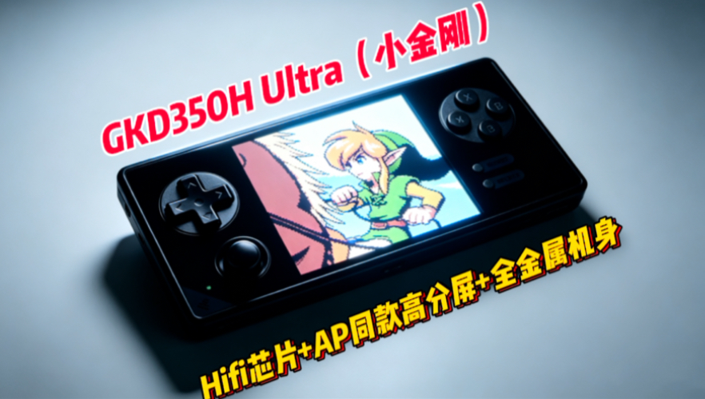

- **新闻内容**：UP主“玩機社”发布GKD350H Ultra小金刚掌机评测，播放量8372次。该机定位“HiFi级掌机”，重点展示音频硬件与系统调校，未公布具体芯片与价格信息，引发玩家对“HiFi掌机”实用性的讨论。
- **简要分析**：GKD连续推出两款HiFi向掌机，试图在性能内卷中开辟音频赛道，但能否形成稳定用户群仍需市场检验，定价是关键。
- **来源**: B站(via GKD 掌机)

#### 7. **8097901:01
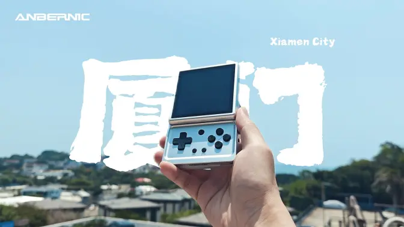

- **新闻内容**：Anbernic官方发布标题为“**8097901:01**”的短视频，内容未明确说明，推测为新品预热或产品展示。封面显示设备轮廓，具体信息暂未披露。
- **简要分析**：官方账号发布模糊标题视频，通常为新品预告或系统更新提示，建议玩家保持关注，后续或有正式公告。
- **来源**: B站

### PlayStation

### 🆕 新机发售

#### 1. 陆夫人反驳“二游社区不如单机社区和谐”观点
B站UP主“神奇陆夫人”在直播中表示，所谓“二游社区爱吵架，单机社区更和谐”的说法不成立。他指出，索尼、微软、任天堂的主机大战暂且不论，光是索尼自家老玩家之间就经常争吵，单机与二游社区在争论程度上并无本质区别。该视频播放量达1.4万，引发玩家对社区生态的讨论。分析认为，索尼用户群体内部对第一方游戏策略、订阅制等议题的争议，与二游社区冲突逻辑相似，社区氛围更多取决于用户构成而非游戏类型。来源：B站（via 索尼 主机）

#### 2. 当代大龄主机玩家现状

B站UP主“汪酱游戏”发布视频，探讨30岁以上主机玩家在家庭、工作与游戏爱好间的平衡，以及消费习惯和游戏时间的变化。视频播放量达16.2万，UP主在简介中推广个人微信公众号及淘宝店铺。高播放量表明“大龄玩家”已成为主机市场消费主力，其游戏时间碎片化、购买力强但选择谨慎的特点，正影响索尼等厂商的营销策略和游戏内容设计方向。来源：B站（via 索尼 主机）

#### 3. 《神秘海域5》被传为PS6护航大作，2030年发售
B站UP主“崇战”发布视频，声称《神秘海域5》将作为PS6顶级护航大作，副标题“命运交汇”，预计2030年发售。视频播放量仅946次，内容属玩家自制或推测，索尼官方未公布任何关于PS6或《神秘海域》新作的正式消息。分析认为，此类爆料虽缺乏依据，但反映玩家对PS6首发阵容的高度期待。若该IP回归，将对PS6初期销量形成强力拉动，但目前信息可信度极低。来源：B站（via PS6 游戏）

#### 4. 索尼停产实体光盘引发玩家焦虑
B站UP主“第九频道OLDNinE”发布视频，围绕索尼宣布停产实体光盘的决定展开分析，播放量达1.4万。视频认为，主机市场正走向事实垄断，索尼在竞争减弱后拥有无视玩家声音的底气。实体版游戏消失不仅是技术进步，更是垄断环境下对渠道与定价权的收紧。通过对比开放的PC生态与封闭的主机体系，指出“全数字化”可能演变为对玩家的收割。分析指出，该视频精准击中了索尼玩家群体的核心焦虑，随着微软在独占策略上退缩，索尼在高端主机市场的优势地位可能加速核心玩家向PC平台迁移。来源：B站（via 索尼 主机）

### 📱 系统更新

#### 1. PS5推送13.6固件更新

索尼于7月23日向PS5推送13.6版本固件更新。据B站UP主“PGAMES”报道，本次更新主要优化了部分系统界面并修复已知问题，更新包体积较小，未引入重大功能变更。视频播放量达1.3万，显示玩家对系统稳定性关注度较高。分析认为，13.6固件属于常规维护性更新，表明PS5系统已进入稳定成熟期，索尼当前工作重心可能已转向为PS6筹备新系统架构。来源：B站（via PS6 游戏）

### 📋 其他资讯

#### 1. 《地平线3》被批毫无进步，衍生项目却众多
B站UP主“游戏之美”发布视频，批评索尼王牌IP《地平线》系列陷入创新困局。视频指出，《地平线3》在玩法、剧情和画面上相比前作毫无进步，但索尼却为该IP规划了大量衍生项目，包括多人游戏、影视改编等。视频播放量仅1585次，但观点尖锐，直指索尼第一方工作室在续作开发上的保守策略。分析认为，该批评反映了部分核心玩家对索尼第一方游戏“罐头化”的担忧。在《地平线》系列销量虽高但口碑疲软的情况下，若索尼继续依赖IP衍生而非核心玩法创新，可能损害品牌长期价值。来源：B站（via 索尼 主机）

#### 2. 分析师：美国年内仅七款PS5实体游戏销量超10万

（内容待补充）

### Xbox

### 🔮 新机爆料

#### 1. 关于Xbox的真相，终于藏不住了
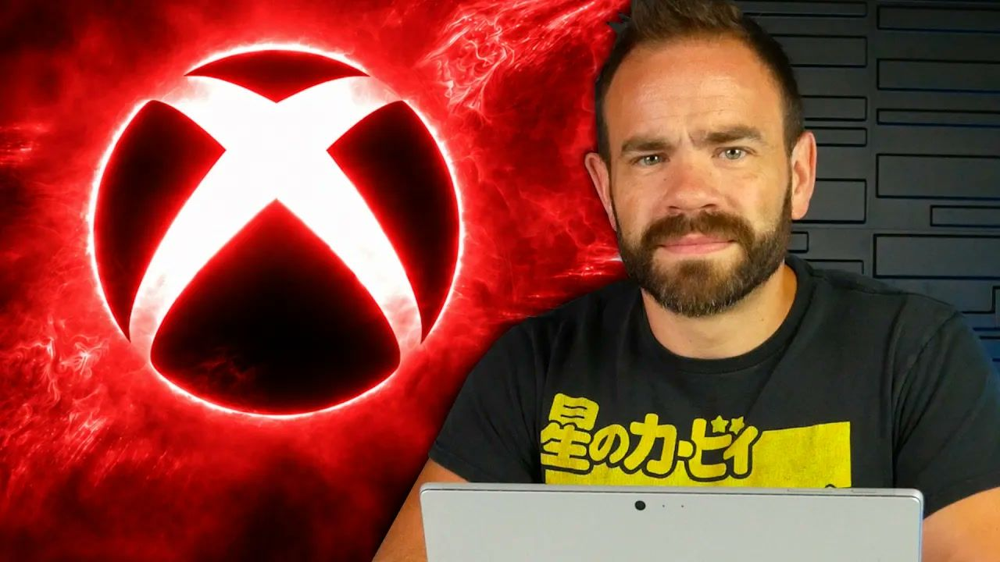

- **新闻内容**：微软近期对Xbox部门进行大规模内部调整，开发者爆料逐渐浮出水面。据B站UP主“橘喵斑猫”编译自Spawn Wave的视频，有Xbox员工透露幕后细节，暗示微软正重新评估硬件与订阅服务策略。调整涉及多个工作室整合与项目重组，外界认为这是微软应对市场压力的关键举措。
- **简要分析**：内部调整与员工爆料预示战略转向。若微软收缩战线，可能意味着Xbox硬件迭代放缓，转而更依赖云游戏和PC生态，对主机玩家是重要信号。
- **来源**: B站(via Xbox Game Pass)

### 🆕 新机发售

#### 1. PS5和Xbox玩GTA6的玩法体验细节有哪些？PS5和Xbox哪个体验更好？

- **新闻内容**：B站UP主“玩数码的夏木”对比分析《GTA6》在PS5和Xbox Series X|S上的玩法体验差异。视频指出，两款主机在光追、加载速度和手柄适配（如PS5触觉反馈与Xbox扳机震动）上各有侧重，但Xbox Series X在原生4K分辨率下帧率更稳定。UP主建议，追求极致画质选Xbox，注重沉浸操控感选PS5。
- **简要分析**：此类对比热度高，反映玩家对跨平台大作体验差异的敏感度。Xbox性能优势能否转化为销量，仍取决于独占内容与Game Pass吸引力。
- **来源**: B站(via Xbox 掌机)

#### 2. 微软开窍了？PC也能兼容XBOX老主机游戏了！首批阵容官宣

- **新闻内容**：微软宣布PC平台将兼容Xbox老主机游戏，首批阵容已官宣。据B站UP主“厨16君”报道，该功能允许玩家在Windows PC上直接运行部分Xbox 360及初代Xbox游戏，无需模拟器或额外订阅。首批支持游戏包括《光环：战斗进化》《神鬼寓言》等经典作品，微软承诺后续分批加入更多兼容库。
- **简要分析**：此举打通Xbox与PC生态壁垒，提升老游戏资产价值。对微软而言，这是推动“Xbox Everywhere”战略的关键一步，也能吸引怀旧玩家回归。
- **来源**: B站(via 微软 主机)

#### 3. 最无聊的使命召唤
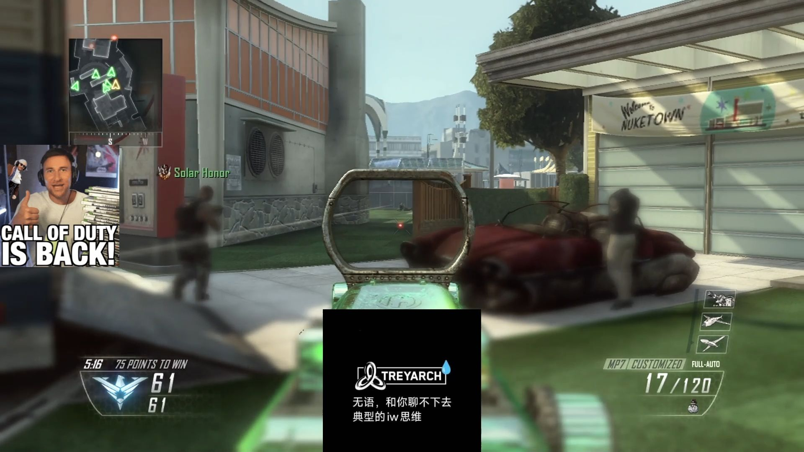

- **新闻内容**：B站UP主“YellowZZZZZZZZ”发布视频吐槽《使命召唤》最新作，称其“乐趣在于高死区情况下看谁的蹩脚操作更好”，并认为该作是系列最无聊一代。视频播放量493次，UP主调侃若索尼《星鸣特攻》在PS3时代发售，或许不会招致如今骂名。该视频引发玩家对《使命召唤》创新乏力的讨论。
- **简要分析**：作为Xbox平台年货大作，《使命召唤》口碑下滑直接影响微软订阅服务吸引力。若动视不能扭转颓势，Xbox Game Pass的“首发日入库”优势将大打折扣。
- **来源**: B站(via Xbox Series)

### 📋 其他资讯

#### 1. 为何微软800亿美元的Xbox豪赌适得其反 | WSJ出了什么问题

- **新闻内容**：华尔街日报（WSJ）分析指出，微软在Xbox业务上投入超800亿美元收购工作室并推行Game Pass首发日策略，却陷入巨额亏损与零售额蚕食困境。报道称，微软被迫剥离部分工作室、提高订阅价格，甚至放弃下一款《使命召唤》首发日入库以挽救订阅增长。B站UP主“旁白_B”制作中文配音版视频，播放量224次。
- **简要分析**：WSJ报道印证外界对微软“烧钱换增长”模式的担忧。800亿美元豪赌未达预期，表明单纯资金堆砌难撼动索尼独占壁垒，微软需重新平衡订阅制与零售利润。
- **来源**: B站(via Xbox Game Pass)

#### 2. Xbox要自救，是不是必须砍掉曾经的王牌Game Pass？

- **新闻内容**：B站UP主“被迫营业的AI”编译自GamingBolt的视频，探讨Xbox Game Pass存亡问题。视频指出，Game Pass曾让玩家“白嫖”所有大作，但如今订阅用户暴跌、第一方工作室纷纷出走，它已从王牌变成烫手山芋。分析认为，微软若想自救，可能不得不调整Game Pass模式，例如减少首发日入库游戏或提高高级订阅层级价格。
- **简要分析**：Game Pass困境本质是“低价订阅”与“高额内容成本”的矛盾。若微软砍掉首发日入库，将彻底改变Xbox竞争逻辑，但短期内可能引发用户流失。
- **来源**: B站(via Xbox Game Pass)

#### 3. ROG Xbox Ally X 运行《真三国无双7》实机60帧测试

- **新闻内容**：B站UP主“贝尔蒙多丶”发布ROG Ally X掌机运行《真三国无双7》实机测试视频。测试显示，该游戏功耗吃不满，无论设置多少瓦数，ROG Ally X均能稳定维持60帧，表现优于同引擎的《无双大蛇Z》。
- **来源**: B站(via Xbox 掌机)

### 任天堂 Switch

### 🔮 新机爆料

#### 1. 《最终幻想 共鸣》新宣传片  
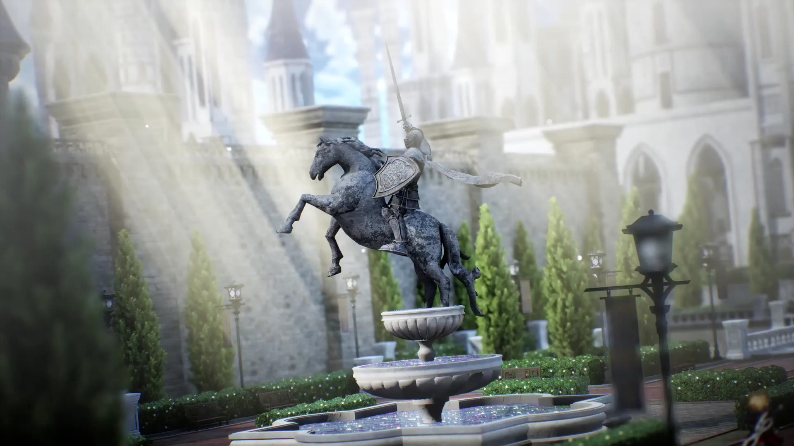

7月22日，游民星空发布《最终幻想 共鸣》全新宣传片。画面展示一座骑士骑马雕像，位于喷泉中央，骑士手持长剑、身披铠甲，马匹腾跃，背景为欧式城堡与绿植，呈现中世纪奇幻风格。宣传片展示精美画面与艺术设计，未透露发售日期或平台信息。  
分析：该宣传片或为Switch 2平台预热，暗示经典作品可能登陆任天堂新主机，丰富第三方阵容。  
来源：B站动态@游民星空官方

#### 2. 《最终幻想 10/10-2 HD Remaster》Switch 2版宣传片  
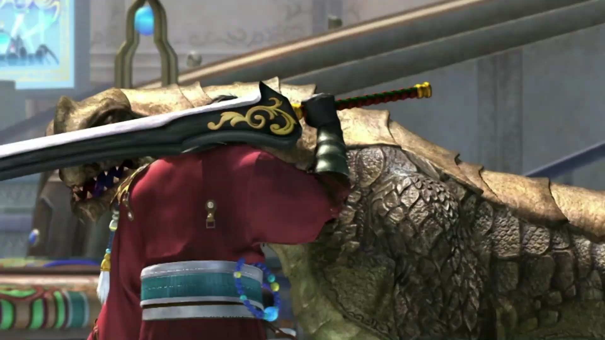

7月23日，游民星空发布《最终幻想 10/10-2 HD Remaster》Switch 2版宣传片，源自Youtube，确认该高清重制作品将登陆任天堂下一代主机。游戏包含两部作品，支持高清画质与优化性能，发售日期和价格未公布。  
分析：作为系列人气作品，登陆Switch 2将吸引老玩家重温经典，为新主机首发增添重量级JRPG内容，强化任天堂在日式RPG领域的布局。  
来源：B站动态@游民星空官方

#### 3. 《光环：战役进化》上线宣传片  
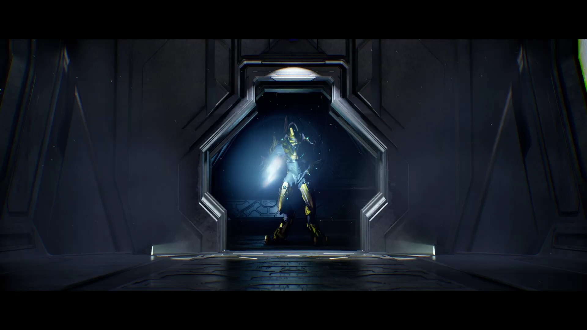

7月23日，游民星空发布《光环：战役进化》上线宣传片。画面显示一名身穿黄黑装甲的角色站在未来感舱门内，手持发光武器，背景为深色金属结构，充满科幻感。宣传片源自Youtube，未明确标注平台，外界猜测可能为Switch 2跨平台作品。  
分析：若《光环》登陆任天堂平台，将标志微软与任天堂进一步合作，对Switch 2第三方吸引力具有里程碑意义。  
来源：B站动态@游民星空官方

#### 4. Switch 2 OLED 机型爆料  
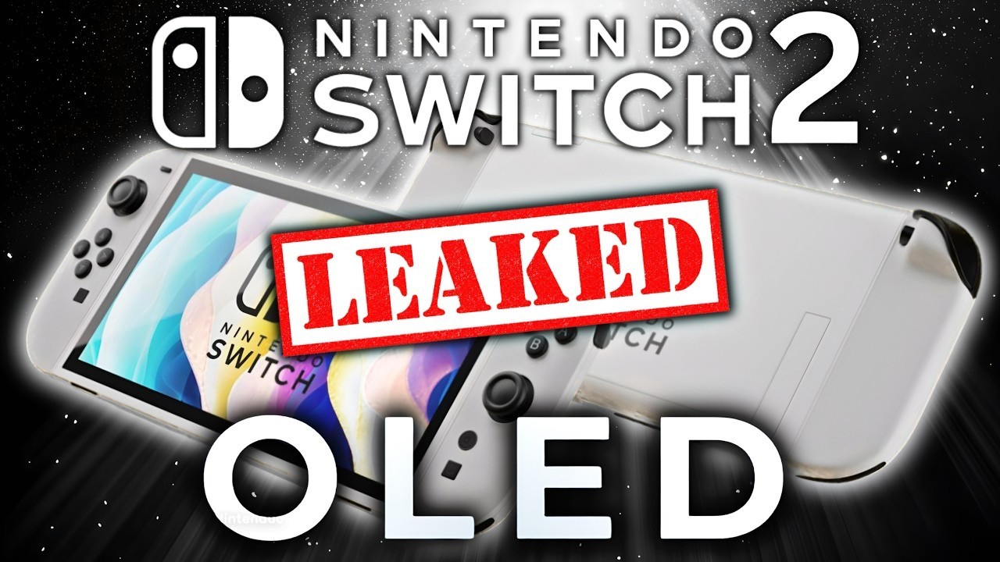

7月21日，B站UP主“indie数码”发布视频，爆料Switch 2 OLED机型信息。视频引用Youtube来源，播放量404次，涉及屏幕规格与设计改进。任天堂官方尚未确认，爆料包括更鲜艳显示效果与续航优化，具体参数和发售时间仍为传闻。  
分析：OLED机型爆料延续Switch一代升级策略，若属实将提升掌机模式视觉体验，但需警惕非官方信息准确性。  
来源：B站(via Switch 2 爆料)

#### 5. [中配]任天堂Switch 2最新消息重磅来袭！ - Sunbro Nation  

7月21日，B站UP主“环球游戏摸鱼社”发布中配视频，翻译自Sunbro Nation的《NEW Nintendo Switch 2 Updates Just Dropped!》。视频涵盖游戏模改进展（与盗版无关）、《塞尔达传说：时之笛》新增文本细节及市场预热迹象等。原视频播放量1636次，内容涉及百条以上细节汇总。  
分析：视频整合多方爆料，为玩家提供Switch 2生态全面预览，但模改和文本细节需官方验证，建议保持观望。  
来源：B站(via Switch 2 爆料)

#### 6. 爆料人破大防：我求求《阳光马里奥》别上Switch！但老任不答应……  

7月23日，B站UP主“次元裂痕电子羊”发布视频，爆料《阳光马里奥》可能登陆Switch 2。视频播放量2368次，以爆料人“破防”口吻表达对移植的无奈，暗示任天堂已决定将该经典作品引入新平台。该作原为GameCube平台，若移植将支持高清化与操作优化。  
分析：爆料带有娱乐性质，但《阳光马里奥》作为经典，登陆Switch 2将填补3D平台游戏阵容，提升新主机首发吸引力。  
来源：B站(via Switch 2 爆料)

### 🆕 新机发售

#### 1. 奇幻风格3D动作游戏画面  
7月23日，B站UP主“二柄APP”发布图片，展示一款奇幻风格3D动作游戏画面。内容包含角色骑乘白猫、双龙飞行战斗及与巨型怪物对战，环境涵盖城堡、森林和雪山，战斗特效华丽。图片未标注设备信息或发售详情，推测为Switch 2新作预览。  
分析：画面体现高水准图形表现力，或为Switch 2独占或跨平台大作，暗示新主机图形性能提升，值得关注后续官方公布。  
来源：B站动态@二柄APP

#### 2. 《斯普拉遁 途撃隊》发布预告，为《Splatoon》系列新作，具体信息待公布。

### 模拟器资讯

以下是将新闻播报文稿压缩至1200字以内的版本，保持原有结构和关键数据不变，去除冗余修饰词：

### 🔮 新机爆料

#### 1. 【GB】巴黎重置最新爆料图
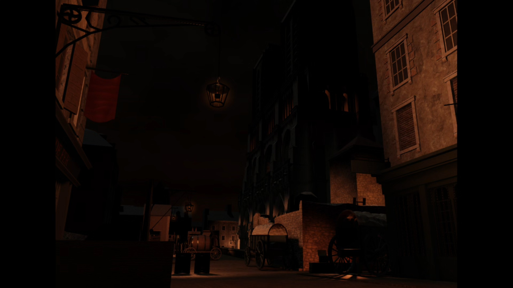

B站UP主“明任子”发布Game Boy模拟器“巴黎重置”最新爆料截图，播放量超2000次。截图展示界面优化和兼容性新进展，疑似针对特定游戏进行画面增强。具体更新日志尚未公布，社区关注度上升。  
分析：作为GB模拟器第三方修改版，其持续爆料反映玩家对经典掌机高清化体验的需求，但非官方版本存在稳定性风险。  
来源：B站（via GB模拟器）

### 🆕 新机发售

#### 1. pdd遐蝶手办事件：安卓模拟器+纯白手机号+纯净网络实测，全新营销套路

B站用户发布视频，揭露拼多多“遐蝶手办”事件中商家利用安卓模拟器、纯白手机号及纯净网络环境刷单和虚假营销。视频通过实测展示如何用模拟器伪造用户行为以规避平台风控，引发对电商监管漏洞的讨论。  
分析：该事件暴露安卓模拟器在灰色产业链中的滥用风险，模拟器厂商或需加强设备指纹识别机制以配合平台打击虚假交易。  
来源：Bilibili

#### 2. 【安卓Switch】Citron Neo模拟器汉化修改版发布

B站UP主“大飞哥g”发布安卓Switch模拟器Citron Neo汉化修改版，新增自由布局、按键布局自定义、内置按键皮肤及组合键设置。视频简介提供百度网盘和夸克网盘下载链接，提取码分别为dfg6和38qG。该版本基于2026年7月19日原版汉化修改，旨在提升安卓设备上Switch游戏操控体验。  
分析：汉化修改版降低国内用户使用门槛，但第三方版本可能无法同步官方更新，存在安全风险，建议谨慎下载。  
来源：B站（via Switch模拟器安卓）

#### 3. 《战地模拟器》EA38最新汉化老牧师口音全流程讲解

B站UP主“紫鼠酥Unreal”发布《战地模拟器》（Ravenfield）EA38版本汉化讲解视频，重点介绍新增“自定义战役”功能。模组制作者可创建故事战役、街机模式变体或重制原版征服模式。UP主还提到“老牧师”角色口音汉化细节，播放量1436次。  
分析：EA38自定义战役工具标志该游戏从单纯射击游戏向模组创作平台转型，汉化工作降低国内玩家创作门槛，有助于扩大社区生态。  
来源：B站（via模拟器汉化）

#### 4. PS3版合金装备4（美版附旧版模拟器CODEC汉化）
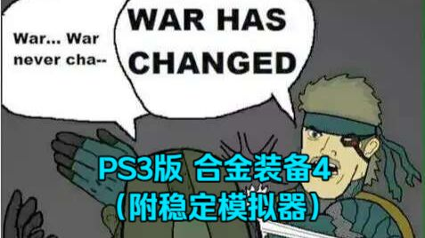

B站UP主“jacksonce”分享PS3版《合金装备4》美版资源，附带旧版模拟器CODEC汉化补丁。UP主表示在《合金装备传奇版2》发售前整理旧作资源，强调该作为MGS时间线正传结局且长期独占，值得体验。资源通过夸克、迅雷、百度网盘分享，提供迅雷链接。  
分析：PS3模拟器汉化资源需求反映玩家对经典独占游戏的怀旧情怀，但分享版权游戏资源存在法律风险，建议支持官方重制版。  
来源：B站（via模拟器汉化）

### 📱 系统更新

#### 1. 【PS2】战国无双1 猛将传 pcsx2 免盘金手指
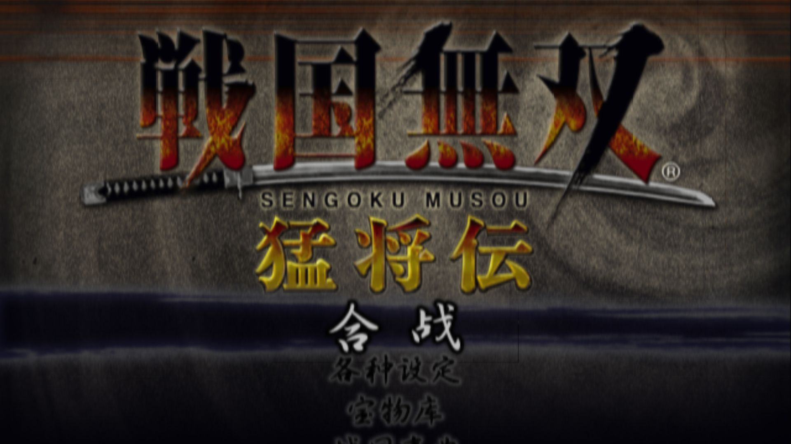

B站UP主“conancocke”为PCSX2模拟器发布《战国无双1 猛将传》免盘金手指代码，CRC为DBD2230B。UP主透露此前手动研究数周未果，后借助AI工具WorkBuddy在20分钟内生成代码（虽有显示bug）。金手指代码可直接应用于PCSX2模拟器，实现免盘启动等功能。  
分析：AI工具在模拟器金手指开发中显著提升效率，但生成代码可能存在兼容性问题。这一趋势可能改变未来模拟器辅助工具的创作模式。  
来源：B站（via PCSX2更新）

#### 2. Winlator 11 绝对战略仁慈之女 26.2.0驱动 DXVK 2.7.1 骁龙8 Gen 1 推荐模式 流畅

B站UP主“龙组白龙”测试Winlator 11模拟器运行《绝对战略仁慈之女》，采用26.2.0驱动和DXVK 2.7.1，在骁龙8 Gen 1设备上以推荐模式实现流畅运行。视频播放量271次，展示安卓设备运行Windows游戏的可行性。  
分析：Winlator 11持续优化表明安卓平台运行Windows游戏的性能瓶颈正被逐步突破，骁龙8 Gen 1的流畅表现对移动游戏玩家具有参考价值。  
来源：B站（via Winlator模拟器）

---

**参考资料链接：**  
https://www.bilibili.com/video/BV16

### 游戏外设

### 🆕 新机发售

#### 1. 打破畅玩界限！XBOX授权天王星手柄Aimlabs联名款开售
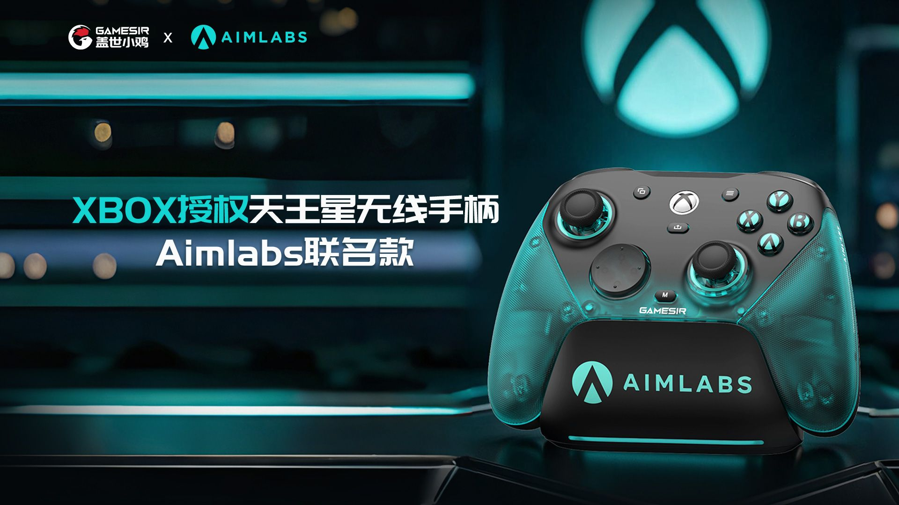

- **新闻内容**：盖世小鸡宣布，旗下XBOX授权天王星手柄Aimlabs联名款正式开售。该手柄专为FPS玩家打造，融合Aimlabs精准训练理念，旨在提升玩家瞄准与反应速度。产品支持Xbox Series X|S、Xbox One及PC多平台，具体售价及首发优惠可关注官方渠道。
- **简要分析**：与专业瞄准训练平台Aimlabs联名，精准切入硬核FPS用户痛点，有望在电竞外设细分市场建立差异化优势，巩固盖世小鸡在授权手柄领域的地位。
- **来源**: B站动态@盖世小鸡

#### 2. 智控交互 给你的游戏一些新体验！小鸡观星者手柄开箱
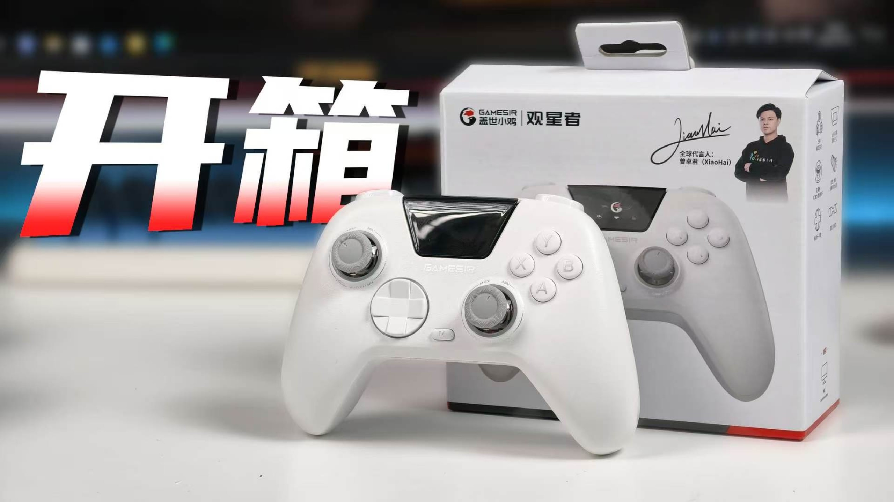

- **新闻内容**：盖世小鸡推出双星者游戏手柄（观星者系列），白色外观，配备双摇杆、方向键及ABXY按键，支持多平台连接。包装盒标注全球代言人曾卓君（XiaoHai），产品主打高精度操控与舒适握感，适合主机与移动端游戏。目前该产品已开启开箱展示，具体发售日期及价格待官方公布。
- **简要分析**：签约格斗游戏世界冠军XiaoHai代言，强化产品在格斗与高精度操控场景的专业背书，有助于吸引核心玩家群体，提升品牌在高端手柄市场的认知度。
- **来源**: B站动态@盖世小鸡

#### 3. 老闻试玩报告！HKC隐刃L1拉伸手柄！手机变掌机！
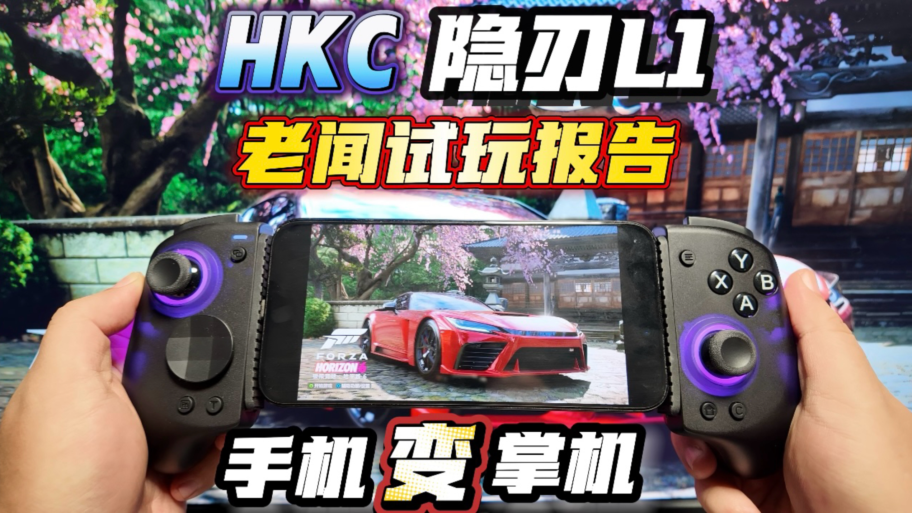

- **新闻内容**：UP主“趣闻叔叔”发布HKC隐刃L1拉伸手柄深度体验报告，称使用一个月后认为该产品能低成本提升游戏体验。手柄支持串流PC或主机，延迟较低，适合躺在床上玩3A大作，沉浸感接近掌机。在怀旧游戏如《绿色兵团》《魂斗罗》中方向识别准确，跳坑蹲走操作稳定，比触屏舒适。
- **简要分析**：HKC隐刃L1凭借低延迟串流和精准操控，切入手机变掌机的细分需求，适合怀旧游戏和串流玩家，有望成为性价比突出的拉伸手柄选择。
- **来源**: B站（via 游戏手机 掌机）

#### 4. PlayStation 索尼 国行PS5手柄 DualSense无线控制器 午夜黑
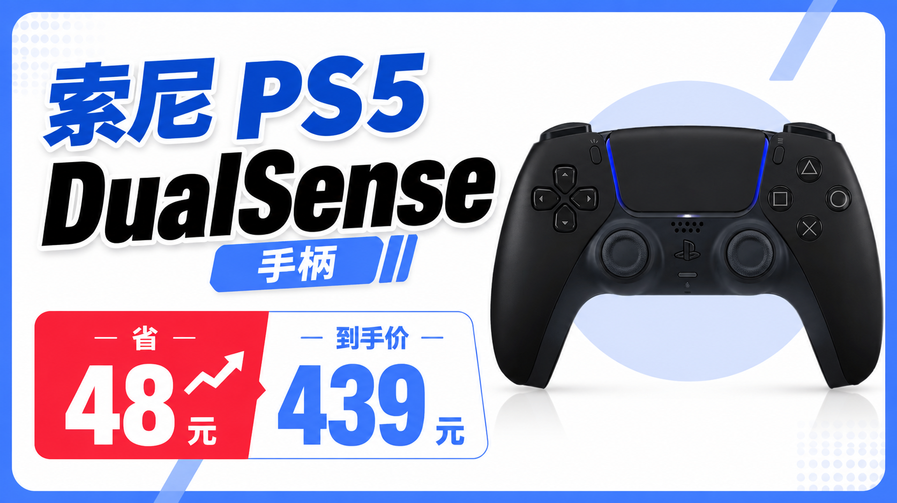

- **新闻内容**：索尼国行PS5 DualSense无线控制器（午夜黑配色）在B站等渠道持续推广，支持Steam平台及多款游戏如《FIFA》《FC世界杯》等。DualSense以自适应扳机和触觉反馈为特色，提供沉浸式游戏体验。目前该手柄在电商平台有售，价格稳定在官方指导价附近。
- **简要分析**：DualSense手柄作为PS5核心外设，跨平台兼容性（尤其是Steam支持）拓展了用户群，午夜黑配色满足个性化需求，持续巩固索尼在高端手柄市场的份额。
- **来源**: B站（via DualSense 手柄）

#### 5. 游戏AI · 跨代进化 红魔游戏平板5Pro配置丰富AI功能
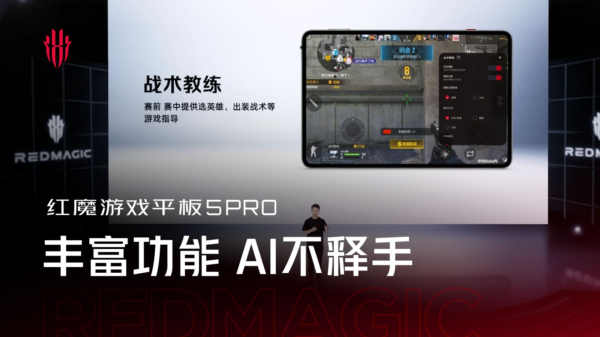

- **新闻内容**：红魔游戏平板5Pro宣布将于7月24日10点开启下一轮开售，现已开放预约。该平板主打“游戏AI·跨代进化”，配置丰富AI功能，包括智能帧率优化、游戏场景识别等，硬件方面预计搭载高性能处理器与高刷屏。预约通道已开启，售价待公布。
- **简要分析**：红魔将AI功能作为核心卖点，标志着游戏平板从堆硬件向智能化体验转型，有望在移动游戏外设领域开辟新赛道，吸引追求智能辅助的玩家。
- **来源**: B站（via 红魔 游戏手机）

#### 6. QCC 推出 Dongle Pro2 蓝牙发射器：基于第二代高通 S5 音频平台、支持专属游戏模式，499 元

- **新闻内容**：QCC旷世之声推出Dongle Pro2蓝牙发射器，定价499元。该产品基于第二代高通S5音频平台，支持Snapdragon Sound骁龙畅听技术，搭载蓝牙6.1，兼容LHDC 5.0、LE Audio、LDAC、aptX Lossless等主流高清音频编解码。无需额外驱动即可连接iPhone/iPad、Mac、Windows PC、Android手机、Switch及PS5等设备。专属游戏模式最低可实现20ms时延，解决FPS或开放世界游戏的声画不同步问题。
- **简要分析**：Dongle Pro2以20ms超低延迟和全平台兼容性，精准解决蓝牙音频在游戏场景的痛点，499元定价在高端蓝牙发射器市场具备竞争力，有望成为游戏玩家和音频发烧友的优选配件。
- **来源**: IT之家

### 📋 其他资讯

#### 1. 免折腾版真4k60帧机皇Xbox天蝎座了解一下！内置1t，外置6tb移动硬盘，超多免下载正版游戏离线共享

- **新闻内容**：B站UP主“闲鱼银元阁当铺”推广一款“免折腾版”Xbox天蝎座，宣称内置1TB存储，外置6TB移动硬盘，提供超多免下载正版游戏离线共享。

## 参考资料链接列表

1. [B站(via Steam Machine)] Steam Machine开箱：他为何已经想改装？: https://www.bilibili.com/video/BV1PAgr6UEir
2. [B站(via Steam 控制器)] 八位堂天刃星街机控制器 Hitbox 格斗键盘 适配Switch2/PC/Steam: https://www.bilibili.com/video/BV161gz63E6z
3. [B站(via Steam 控制器)] 龙之剑觉醒修改器护肝控制台，无限生命|金钱|体力耐力|一击必杀，风灵mod下载安装教程攻略: https://www.bilibili.com/video/BV1Htgk6nEjF
4. [B站(via Steam Deck 游戏)] Steam Deck OLED 演示《龙之剑》: https://www.bilibili.com/video/BV1jrgk6rEYU
5. [B站(via Steam 控制器)] 军团塔防修改器全功能Mod工具｜无限资源刷单位刷建筑 建筑升级 卡牌符石 战场控制玩法修改教学: https://www.bilibili.com/video/BV1RCgk6uE5V
6. [B站(via Steam 控制器)] 工业巨头!编辑资源+快速研究！内置GM控制台来袭！: https://www.bilibili.com/video/BV1yTg16hEpR
7. [B站(via Steam Deck 游戏)] [中配]龙剑觉醒：Steam Deck性能与最佳设置指南！ - Steam Flow: https://www.bilibili.com/video/BV1o1g26WEjD
8. [B站(via ROG Ally 掌机)] GBO2用掌机配AR眼镜玩PVE任务 反叛的代价 1分8秒完成 高达激战任务2 GBO2 高达战斗行动2 机动战士雷霆一击ZZ高达UC0088系列机体: https://www.bilibili.com/video/BV1S9gk6aE1Z
9. [B站动态@GPD掌机官方] V 社推出全新 SteamOS：5分钟一键安装！: https://t.bilibili.com/1227074952552775702
10. [B站动态@AYANEO官方] AYANEO发布Pocket Micro 2掌机，提供白色、黑色和紫色三种配色。设备采用复古设计，配备方向键、ABXY按键和摇杆，屏幕显示色彩丰富。支持便携游戏...: https://t.bilibili.com/1227410406658539541
11. [B站动态@ROG玩家国度] ROG破风标准版游戏耳机发布，搭载50mm ROG镀钛振膜发声单元和10mm超宽频吊杆麦克风，支持高级参数化EQ调节与游戏预设参数。配备3级可调弹性头带，采用轻...: https://t.bilibili.com/1227456987694891013
12. [B站(via Win 掌机)] 震惊！宏碁公布掌机 掠夺者 Atals 8 售价！999英镑起步！: https://www.bilibili.com/video/BV1Awgr6JEiL
13. [B站(via OneXPlayer 掌机)] 核显接近2060 还可变身轻薄本 这台掌机太猛了 壹号本OneXPlayer3上手体验: https://www.bilibili.com/video/BV1Mdgk6wE4Y
14. [B站(via ROG Ally 掌机)] ROG Xbox Ally X Z2 Extreme /《底特律：化身为人》性能测试 / SteamOS 3.8.24: https://www.bilibili.com/video/BV1vBK46XEzr
15. [B站动态@AYANEO官方] AYANEO推出全新掌机KONKR Pocket Advance，采用经典复古设计，复刻熟悉握感。产品以橙色为主色调，延续经典轮廓，强调便携与怀旧体验。官方宣布...: https://t.bilibili.com/1227361903612788757
16. [B站(via 安卓 模拟器 掌机)] 安卓AzaharPlus模拟器 v2126.0-A汉化版发布: https://www.bilibili.com/video/BV1QCKs6rEuy
17. [B站(via 安卓 模拟器 掌机)] Y700五代【盖世游戏】模拟运行PC漫威蜘蛛侠重置版效果演示: https://www.bilibili.com/video/BV1K8KH6REqs
18. [B站(via 安卓 模拟器 掌机)] PSX2 Mali 优化版实测：天玑最强 PS2 模拟器？最佳设置与流畅调优指南 | 安卓PS2模拟器: https://www.bilibili.com/video/BV1uqKt6VEwv
19. [B站动态@董先生的游戏屋] Anbernic RG SP掌机发布，提供黑、粉、青、银四色版本。配备3.4英寸IPS屏幕，分辨率720×480，支持复古游戏3倍点对点显示。采用双合金转轴，支...: https://t.bilibili.com/1227458969831735300
20. [B站动态@千夏的铲子] KTR2教程，KOS系统配置，天马G专属配置包安装，256G整合包: https://t.bilibili.com/1228224981576450064
21. [B站(via ArkOS)] R46H掌机被恶意退货退款，仅退款成功，线下维权找回！: https://www.bilibili.com/video/BV1aDKb6pEaR
22. [B站(via 周哥 掌机)] 周哥h700新品来袭，韭菜们长好了没?: https://www.bilibili.com/video/BV1RQKh68EsX
23. [B站(via ArkOS)] 【Pyrrha×Jaune】这里有两种求婚: https://www.bilibili.com/video/BV1qng16QEXE
24. [B站(via GKD 掌机)] 掌机加Hifi有搞头？—GKD 小金刚初评: https://www.bilibili.com/video/BV15mgy6LE4F
25. [B站(via GKD 掌机)] HiFi级掌机？GKD350H Ultra小金刚: https://www.bilibili.com/video/BV1YBgS6dEZ7
26. [B站官号@Anbernic官方] 8097901:01: https://www.bilibili.com/video/BV1n17D6xEv7/
27. [B站(via 索尼 主机)] 陆夫人刷到说二游社区老吵架不如单机社区气笑了：索微任主机大战不谈，索尼自家牢玩家一样吵，单机二游一个样【神奇陆夫人】: https://www.bilibili.com/video/BV1gVgy6BEri
28. [B站(via 索尼 主机)] 当代大龄主机玩家现状~: https://www.bilibili.com/video/BV1Qdg262EyF
29. [B站(via PS6 游戏)] 【神秘海域】PS6顶级护航大作 神秘海域5命运交汇！ 2030年发售！: https://www.bilibili.com/video/BV1Q1gQ6fEAT
30. [B站(via 索尼 主机)] 当索尼这种上市公司不再需要你时，你越忠诚，它越收割你: https://www.bilibili.com/video/BV1KLgQ6nE4c
31. [B站(via PS6 游戏)] PS5推送13.6固件更新: https://www.bilibili.com/video/BV1zbgQ66EEB
32. [B站(via 索尼 主机)] 索尼王牌IP陷入困局《地平线3》毫无进步但衍生项目却一堆: https://www.bilibili.com/video/BV1fpg16nE5r
33. [机核] 分析师：美国年内仅有七款PS5实体游戏版销售超过10万: https://www.gcores.com/articles/217431
34. [IGN中国] 索尼停产PlayStation光盘或重创72亿美元二手市场: https://www.ign.com.cn/playstation-5/61493/suo-ni-ting-chan-playstationguang-pan-huo-zhong-chuang-72yi-mei-yuan-er-shou-shi-chang
35. [B站(via Xbox Game Pass)] 关于Xbox的真相,终于藏不住了: https://www.bilibili.com/video/BV1HKKx6dEah
36. [知乎] 怎么看谷歌发布了 Gemini 3.6 flash和 3.5 lite，但是 pro 又缺席？: https://news.google.com/rss/articles/CBMiX0FVX3lxTFBFc1FGampMV2ZsWlYwWF9jRkt6Zk9HV1BFNnlSdmNxT0NDRURBY3k0TnJvaWZoMlFjRW5UaDFPTnRFdWRsQkYxU3BXc21PZUhnZU9Ma1Bhc21tcUlSNzdJ?oc=5
37. [B站(via Xbox 掌机)] PS5和Xbox玩GTA6的玩法体验细节有哪些？有哪些新玩法？PS5和XBox哪个体验更好？: https://www.bilibili.com/video/BV1vJKU6LEEh
38. [B站(via 微软 主机)] 微软开窍了？PC也能兼容XBOX老主机游戏了！首批阵容官宣: https://www.bilibili.com/video/BV19mgy65EDL
39. [B站(via Xbox Series)] 最无聊的使命召唤: https://www.bilibili.com/video/BV1Scgm6VEG3
40. [B站(via Xbox Game Pass)] 为何微软800亿美元的Xbox豪赌适得其反 | WSJ 出了什么问题 - The Wall Street Journal - 中配: https://www.bilibili.com/video/BV1L7Kx6EEJ7
41. [B站(via Xbox Game Pass)] Xbox要自救，是不是必须砍掉曾经的王牌Game Pass？: https://www.bilibili.com/video/BV1jxK86bEPe
42. [B站(via Xbox 掌机)] ROG Xbox Ally X游玩真三国无双7实机60帧测试: https://www.bilibili.com/video/BV1HaKb6iEiu
43. [B站动态@游民星空官方] 《最终幻想 共鸣》新宣传片: https://t.bilibili.com/1227832421571887120
44. [B站动态@游民星空官方] 《最终幻想 10/10-2 HD Remaster》Switch2版宣传片: https://t.bilibili.com/1228223744630063124
45. [B站动态@游民星空官方] 《光环：战役进化》上线宣传片: https://t.bilibili.com/1228286867735052304
46. [B站(via Switch 2 爆料)] Switch 2 OLED 机型爆料来了: https://www.bilibili.com/video/BV1NRK16REuP
47. [B站(via Switch 2 爆料)] [中配]任天堂Switch 2最新消息重磅来袭！ - Sunbro Nation: https://www.bilibili.com/video/BV1nfKa6yEkJ
48. [B站(via Switch 2 爆料)] 爆料人破大防：我求求《阳光马里奥》别上Switch！但老任不答应……: https://www.bilibili.com/video/BV197gU6HEC3
49. [B站动态@二柄APP] 图片展示了一款奇幻风格的3D动作游戏画面，包含角色骑乘白猫、双龙飞行战斗以及与巨型怪物对战的场景。游戏画面精美，环境细节丰富，有城堡、森林和雪山等多样地貌。角色...: https://t.bilibili.com/1228189389181419552
50. [B站动态@二柄APP] 《斯普拉遁 途撃隊》发布预告，为《Splatoon》系列新作，主打团队合作与涂鸦战斗。《异度神剑编年史》《异度神剑2》《异度神剑3》将推出Nintendo Sw...: https://t.bilibili.com/1228199673441812502
51. [B站(via GB 模拟器)] 【GB】巴黎重置最新爆料图！: https://www.bilibili.com/video/BV16tKs6QEi2
52. [Bilibili] pdd遐蝶手办事件，安卓模拟器+纯白手机号+纯净网络实测，全新的营销套路: https://news.google.com/rss/articles/CBMiV0FVX3lxTE5qNWpnMFNXUEJmTzc5Q2syOU1YcktUNUdSRV9pVE5KWXBOeWRfNkJpSUdSZDdCdzJrNWdFYjlfZDN5MjNlbFhTTzdUelVyWHMxRmUwSEtVbw?oc=5
53. [B站(via Switch 模拟器 安卓)] 【安卓Switch】Citron Neo模拟器汉化修改版发布！添加自由布局、按键布局、内置按键皮肤、组合键等功能设置，下载地址请看视频简介和评论置顶区！: https://www.bilibili.com/video/BV116gr6pEwJ
54. [B站(via 模拟器 汉化)] 《战地模拟器》EA38最新汉化老牧师口音全流程讲解: https://www.bilibili.com/video/BV1RvgS6ZEsS
55. [B站(via 模拟器 汉化)] PS3版合金装备4（美版附旧版模拟器CODEC汉化）: https://www.bilibili.com/video/BV1qQgt6qEpc
56. [B站(via PCSX2 更新)] 【PS2】战国无双1 猛将传 pcsx2 免盘金手指: https://www.bilibili.com/video/BV1ibKp6VERp
57. [B站(via Winlator 模拟器)] winlator11 绝对战略仁慈之女 26.2.0驱动 DXVK2.7.1 骁龙8gen1 推荐模式 流畅: https://www.bilibili.com/video/BV1N2Mh6QE5C
58. [B站动态@盖世小鸡] 打破畅玩界限！XBOX授权天王星手柄Aimlabs联名款开售！: https://t.bilibili.com/1227124911552593928
59. [B站动态@盖世小鸡] 智控交互 给你的游戏一些新体验！小鸡观星者手柄开箱: https://t.bilibili.com/1228223645809115172
60. [B站(via 游戏手机 掌机)] 老闻试玩报告！HKC隐刃L1拉伸手柄！牛批～手机变掌机！: https://www.bilibili.com/video/BV1rPKU6xEf5
61. [B站(via DualSense 手柄)] PlayStation 索尼 国行PS5手柄 DualSense无线控制器 支持Steam游戏电玩GME FIFA足球FC世界杯 PS5手柄 午夜黑: https://www.bilibili.com/video/BV1ieKs6mEZR
62. [B站(via 红魔 游戏手机)] 游戏AI · 跨代进化  红魔游戏平板5Pro配置丰富AI功能: https://www.bilibili.com/video/BV1zVKt6fEyH
63. [IT之家] QCC 推出 Dongle Pro2 蓝牙发射器：基于第二代高通 S5 音频平台、支持专属游戏模式，499 元: https://www.ithome.com/0/980/829.htm
64. [B站(via Xbox 手柄)] 免折腾版真4k60帧机皇Xbox天蝎座了解一下！内置1t，外置6tb移动硬盘，超多免下载正版游戏离线共享！超越取消光碟，强制30天离线验证索尼PS5，破解PS4: https://www.bilibili.com/video/BV1r7gm6aECh

---

> 119条动态，浓缩一周游戏硬件的脉搏。下期见。
