# 游戏设备周报·上 | 2026-W30 (7.22 - 7.26)

> 本期SteamOS生态加速，多款大作定档，硬件与模拟器亦有突破。

## 🌍 海外资讯

### Steam Deck

### 🔮 新机爆料
#### 1. Valve 发布 Proton 11.0-2 候选版本供测试

- **新闻内容**：Valve 于7月23日发布 Proton 11.0-2 候选版本，供社区测试。该版本旨在修复 SteamOS/Linux 上运行 Windows 游戏时发现的更多问题，是 Proton 11.0 系列的迭代更新。目前候选版本已面向测试渠道开放，用户可通过 Steam 客户端切换至“beta”分支体验。
- **简要分析**：Proton 持续更新是 Steam Deck 游戏兼容性提升的核心驱动力。此次候选版本快速推出，表明 Valve 正积极响应用户反馈，巩固 SteamOS 作为掌机游戏平台的生态优势。
- **来源**: GamingOnLinux

### 🆕 新机发售
#### 1. Yet Another Zombie Survivors 1.0 版本将于8月发布
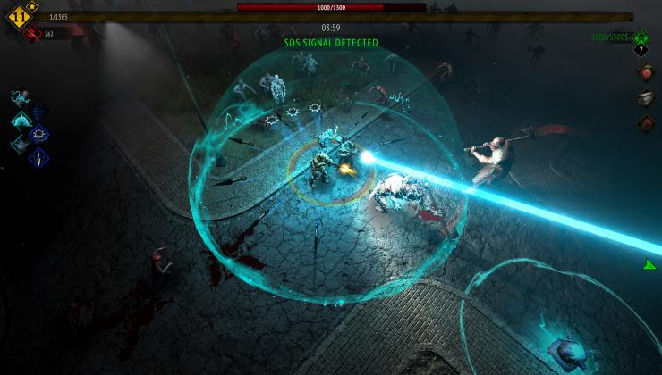

- **新闻内容**：僵尸生存游戏《Yet Another Zombie Survivors》宣布将于8月20日推出1.0版本。开发商发布全新预告片，透露正式版将包含更多敌人类型、武器和挑战模式。该游戏在 Steam Deck 上一直有不错的兼容性表现。
- **简要分析**：1.0版本发布意味着游戏内容趋于完整，对 Steam Deck 玩家而言是值得关注的休闲生存佳作。正式版优化通常会进一步提升掌机运行稳定性。
- **来源**: GamingOnLinux

#### 2. 《MARVEL Tōkon: Fighting Souls》疑似屏蔽SteamOS/Linux

- **新闻内容**：漫威格斗游戏《MARVEL Tōkon: Fighting Souls》正在进行公开测试，但据玩家反馈，游戏因反作弊系统原因屏蔽了 SteamOS/Linux 平台访问。Steam Deck 用户目前无法参与公测或正式游玩，除非通过 Windows 双系统启动。
- **简要分析**：这暴露了第三方反作弊系统对 Steam Deck 生态的兼容性障碍。虽 Valve 推动反作弊支持，但部分厂商保守策略仍会导致玩家流失，影响游戏多平台受众覆盖。
- **来源**: GamingOnLinux

#### 3. 007 First Light 已移除 Denuvo 防篡改 DRM

- **新闻内容**：今年5月底发售的《007 First Light》，在不到两个月内被发现已移除 Denuvo 防篡改 DRM。移除加密后，游戏在 Steam Deck 上的启动速度和运行流畅度有望提升，同时减少因反篡改机制导致的兼容性问题。目前 Steam 版本已无 Denuvo 标识。
- **简要分析**：Denuvo 快速移除对 Steam Deck 玩家是利好消息。这通常意味着游戏销量已过峰值，开发商选择放弃加密以换取更好玩家体验和口碑，尤其利好掌机这类性能敏感平台。
- **来源**: GamingOnLinux

#### 4. 我终于成功让陀螺仪在Vita3k的《重力眩晕》中生效了。
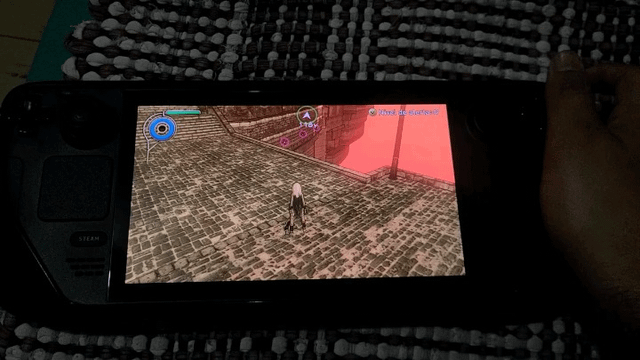

- **新闻内容**：Reddit 用户分享 Steam Deck 模拟器突破：通过安装特定版本 Vita3K 模拟器（build 3829），配合 Steam Input 将陀螺仪映射为鼠标、启用原生触屏支持，成功在《重力眩晕》中实现原生陀螺仪操控。该用户提醒，此方法仅适用于旧版 AppImage 构建，新版已失效且无法在 Deck 上运行。
- **简要分析**：社区教程展示 Steam Deck 在模拟器领域的可玩性。通过自定义配置，玩家能获得超越原平台的操控体验，但依赖特定旧版软件说明模拟器兼容性仍有待官方优化。
- **来源**: Reddit r/SteamDeck

#### 5. 适用于LCD Deck的53Wh电池
- **新闻内容**：一位哈萨克斯坦 Steam Deck LCD 用户发帖询问电池升级方案，希望将原装电池更换为容量更大的 53Wh 版本。该用户表示已在 AliExpress 和拼多多上找到相关产品，但因亚马逊运费过高无法购买。他寻求已升级用户的建议，特别是 AAA 游戏下的续航提升幅度和电池温度表现。
- **简要分析**：第三方大容量电池出现，反映 LCD 版 Steam Deck 用户对续航的迫切需求。虽更换电池存在风险，但若方案成熟，将显著延长老款机型服役寿命，对 Valve 官方升级服务构成补充。
- **来源**: Reddit r/SteamDeck

### 📱 系统更新
#### 1. Valve 对 Steam 愿望单和 Steam 礼物进行了重大升级

- **新闻内容**：Valve 于7月23日对 Steam 愿望单和礼物系统进行重大升级。新功能包括：愿望单支持添加备注和自定义分类标签，方便管理游戏库；礼物系统新增定时发送、附言及更灵活退款选项。这些改动旨在提升用户社交互动和购物体验。
- **简要分析**：虽不直接涉及硬件，但 Steam 平台体验优化直接影响 Steam Deck 软件生态。更智能的愿望单和礼物功能，有助于玩家在掌机上高效管理游戏购买计划，增强平台粘性。
- **来源**: GamingOnLinux

### 📋 其他资讯
#### 1. KONAMI公布《METAL GEAR SOLID: MASTER COLLECTION Vol.2》更多平台规格详情

- **新闻内容**：KONAMI 于7月23日公布《METAL GEAR SOLID: MASTER COLLECTION Vol.2》更多平台规格详情。

### Windows 掌机

### 🔮 新机爆料

#### 1. Legion Go 2 还是等 MSI Claw 8 EX AI+？玩家陷入选择困境

- **新闻内容**：一位计划在度假前入手Windows掌机的玩家在Reddit r/LegionGo发帖求助，纠结于购买联想Legion Go 2，还是等待即将上市的MSI Claw 8 EX AI+。该玩家表示，MSI新款性能更快，定价相近，但加拿大百思买仍显示“即将上市”，担心无法在出发前到货。他主要玩JRPG，希望获得购买建议。
- **简要分析**：这则帖子反映了Windows掌机市场的竞争格局：玩家在“现有机型”与“性能更强但上市时间不确定”的新品之间权衡。准时交付和清晰的市场节奏，正成为影响消费者决策的关键因素。
- **来源**: Reddit r/LegionGo

### 🆕 新机发售

#### 1. Ayaneo Next II 开始发货

- **新闻内容**：Ayaneo Next II 已进入发货阶段。有用户在Reddit r/ayaneo发帖称，其Indiegogo众筹订单状态已从“已承诺”变更为“准备发货”。该用户询问了从状态变更到收到发货通知的等待时间，以及欧盟地区的运输时长。官方称将提供快递运输服务，但具体时效待首批用户反馈。
- **简要分析**：作为旗舰级Windows掌机，Ayaneo Next II 的发货标志着该品牌进入交付验证阶段。能否在承诺时间内完成全球发货，将直接影响其品牌信誉和后续产品口碑。
- **来源**: Reddit r/ayaneo

#### 2. 《我的世界》Java版系统要求首次提出需要8/16 GB内存

- **新闻内容**：微软近日更新了《我的世界》Java版的系统要求，首次建议玩家配备8GB至16GB内存。官方解释称，这并非因游戏硬件要求提高，而是微软已有相当一段时间未更新规格说明。当前版本的运行需求与以往相比并无显著变化。
- **简要分析**：这一更新是规范化的技术文档维护，而非性能门槛提升。对于掌机玩家，8GB内存已是主流配置，该变动不会对现有Windows掌机运行造成实质影响，但提醒厂商需定期更新产品兼容性说明。
- **来源**: PC Gamer

#### 3. Optiscaler / OptiClick 现已登陆 Claw 8 EX AI+？

- **新闻内容**：一位即将收到MSI Claw 8 EX AI+的玩家在Reddit r/MSIClaw发帖询问，Optiscaler与OptiClick组合工具在该掌机上的实用性及安装难度。该玩家指出，约75-80%的游戏未原生支持XeSS，因此想知道该工具是否值得安装，以及是否像在Steam Deck上使用Lossless Scaling那样，需为每个游戏手动添加启动命令。
- **简要分析**：Optiscaler这类第三方画质/帧率优化工具在掌机玩家中关注度极高，尤其对于不支持原生超分技术的游戏。MSI Claw 8 EX AI+若能通过此类工具实现更广泛的游戏兼容性，将提升其作为Windows掌机的实用价值。
- **来源**: Reddit r/MSIClaw

#### 4. 从Steam启动游戏不会自动切换窗口

- **新闻内容**：一位使用白色基础版ROG Ally的玩家在Reddit r/ROGAlly反馈，通过Steam启动游戏时，无论是直接启动还是通过Xbox FSE启动，游戏窗口都无法自动成为主窗口，每次需手动切换。该玩家询问是否为正常现象，以及是否存在修复方法。
- **简要分析**：这是典型的Windows掌机系统交互问题，可能源于Steam大屏模式与Windows窗口管理之间的兼容性冲突。这属于软件层面的小瑕疵，但长期存在会影响用户体验，建议通过驱动或Armoury Crate更新修复。
- **来源**: Reddit r/ROGAlly

### 📋 其他资讯

#### 1. 贝塞斯达表示裁员未影响《上古卷轴6》的路线图，也未遗忘《湮没 重制版》

- **新闻内容**：贝塞斯达近日澄清，近期裁员未对《上古卷轴6》的开发路线图造成影响，同时强调团队未遗忘《上古卷轴4：湮没 重制版》项目。官方表示，此次透露信息并非因外部压力（如记者阿莎·夏尔马的追问）而被迫回应。这一声明旨在平息玩家对项目进度的担忧。
- **简要分析**：贝塞斯达的主动澄清，反映出玩家对经典IP重制及新作开发进度的敏感。在行业裁员潮背景下，明确项目状态有助于稳定社区情绪，但“未受影响”的说法仍需后续实际成果验证。
- **来源**: PC Gamer

#### 2. 拉瑞安再次提醒：未参与任何《博德之门3》相关项目

- **新闻内容**：随着《博德之门3》角色卡菈克漫画的公布，拉瑞安工作室再次声明，强调其“未参与任何与《博德之门3》相关的项目”。此前在游戏DLC及续作传闻出现时，工作室也曾多次划清界限。此次回应旨在消除玩家对拉瑞安继续开发《博德之门3》内容的猜测。
- **简要分析**：拉瑞安反复强调不参与《博德之门3》后续项目，表明其已转向新IP开发。对于Windows掌机玩家，这意味着短期内不会有来自拉瑞安的《博德之门3》原生掌机优化或专属内容，但第三方兼容性仍可保障游戏体验。
- **来源**: PC Gamer

#### 3. 《龙与地下城》与《魔兽世界》的跨界联动内容已泄露

- **新闻内容**：（原文未提供具体内容，此处保留标题，内容待补充）
- **来源**: （原文未提供）

### 安卓掌机

### 🆕 新机发售

#### 1. Ayaneo Pocket Micro Classic 屏幕保护膜和保护壳选项？
- **新闻内容**：有玩家入手 Ayaneo Pocket Micro Classic 后提出两个问题：市面上是否存在覆盖整个正面的玻璃屏幕保护膜？目前仅见普通膜。此外，除丑陋的网状保护壳外，是否有其他选择？官方皮质保护壳外观不错，但第三方售价高达50美元以上。
- **简要分析**：这款复古掌机虽已发售，但配件生态尚未完善，玩家对高品质配件的需求反映小众掌机在周边支持上的短板。
- **来源**: Reddit r/ayaneo

#### 2. Game Bub 终于“即将发货”，你仍可预购一台

- **新闻内容**：作为 Analogue Pocket 的替代品，Game Bub FPGA 掌机终于进入“即将发货”阶段，目前仍有少量预购名额开放。该设备采用 FPGA 硬件模拟方案，旨在提供低延迟、高精度的复古游戏体验，适合追求原汁原味模拟效果的玩家。
- **简要分析**：Game Bub 的延迟发货曾让部分玩家失去耐心，如今“即将发货”信号表明项目已进入量产尾声，对 FPGA 掌机市场是一剂强心针。
- **来源**: Retro Handhelds

#### 3. 立即获取您想要的 Nova 按键

- **新闻内容**：Retroid 官方提醒，预购 Nova 掌机的用户若想更换按键颜色，需随预购订单一同下单。有玩家询问能否后续单独加购按键，官方回复表示无法单独追加，建议用户在预购时一步到位选择心仪的按键配色。
- **简要分析**：这一政策意在简化生产与库存管理，但也要求玩家在预购阶段做出最终决定，对个性化需求较高的用户需提前规划。
- **来源**: Reddit r/retroid

### 📱 系统更新

#### 4. Armada OS (20260714) 登陆 Odin 3
- **新闻内容**：有玩家在 Odin 3 上成功刷入 Armada OS 20260714 版本，并分享体验。由于没有 microSD 读卡器，他不得不通过“以 root 身份运行脚本”的方式刷写，过程耗时一整天。更新后系统界面流畅，音效出色，且能自动识别家庭网络中的 PC 并直接传输游戏，例如《Mega Man Star Force Legacy Collection》在测试中表现良好。
- **简要分析**：Armada OS 的跨设备游戏传输功能是一大亮点，但刷机门槛依然较高，建议玩家提前准备读卡器等工具，以简化安装流程。
- **来源**: Reddit r/OdinHandheld

### 📋 其他资讯

#### 5. RP6双屏Cemu游戏手柄问题

- **新闻内容**：有玩家反映在 Retroid Pocket 6 上使用 Cemu 模拟器运行《塞尔达传说：风之杖 HD》时，无法实现 Wii U GamePad 画面显示在内屏、电视画面显示在外接双屏附件的效果。尝试将 Cemu 启动至外屏后，内屏仅停留在桌面界面，反之亦然。该玩家希望获得相关教程或解决方案。
- **简要分析**：RP6 的双屏功能在模拟 Wii U 时存在软件适配问题，目前社区尚未形成成熟方案，建议玩家关注 Cemu 更新或等待第三方教程。
- **来源**: Reddit r/retroid

### 开源掌机/Linux掌机

### 🔮 新机爆料

#### 1. ANBERNIC 展示 RG SP 复古掌机游戏画面及部分规格
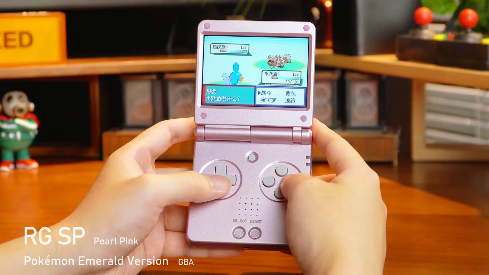

ANBERNIC 本周揭晓新款翻盖掌机 RG SP 更多细节。该设备是 SP 系列改进版，机身厚度减少10%，采用全新屏幕边框设计。官方已放出多款游戏实际运行画面，完整规格参数尚未全部公布。ANBERNIC 持续发力翻盖复古掌机市场，轻薄化改进有望吸引追求便携性的核心玩家，巩固其在开源掌机市场的领先地位。（来源：Retro Dodo）

#### 2. 铁拳/MUGEN 与 Pushover 移植版

Reddit 用户爆料，正在为 Miyoo Mini Plus 掌机移植开源格斗游戏引擎 Ikemen（支持 MUGEN 内容）及益智游戏 Pushover。因 Miyoo Mini Plus 仅有128MB内存，开发者通过提供多种分辨率选项优化性能，并表示新设备上运行效果更佳。移植工作已接近完成。社区开发者对低端掌机的持续优化，展现了开源掌机生态活力，能极大丰富老旧机型游戏库，延长设备生命周期。（来源：Reddit r/MiyooMini）

#### 3. 现在购买安卓掌机是否为时已晚？
Reddit 社区有玩家发帖讨论，因 AYN Thor 等安卓掌机二手市场价格飙升（UFS 4.0版本二手价约1000欧元，近乎官方售价两倍），担心现在入手是否为时已晚。该玩家考虑出售手中的 New 3DS XL 换取 AYN Thor，但忧虑价格继续上涨。安卓掌机市场供不应求，二手价格倒挂反映出核心玩家对高性能设备的强烈需求，提示厂商稳定供货和合理定价将是未来竞争关键。（来源：Reddit r/SBCGaming）

### 🆕 新机发售

#### 1. Mattel & Hot Wheels 可拼装《光环》UNSC 疣猪号战车开启预购
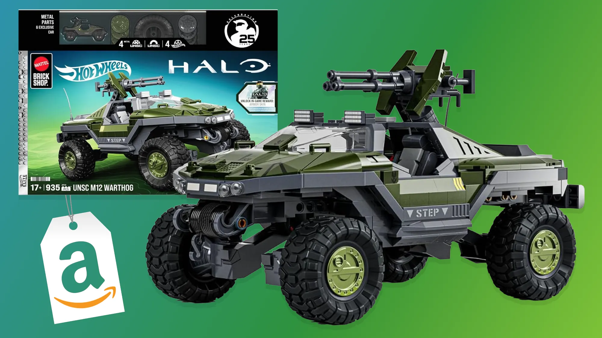

Mattel 与 Hot Wheels 联合推出的《光环》UNSC M12 疣猪号战车拼装模型已在圣地亚哥国际动漫展正式公布，并同步在亚马逊开启预购。该套装为可拼装设计，具体零件数和售价暂未完全公开。Hot Wheels 将经典游戏载具实体化，精准抓住《光环》粉丝收藏需求，这类跨界合作能带动周边销售，反向提升游戏 IP 热度。（来源：Retro Dodo）

#### 2. 任天堂为《大金刚》乐高套装发布诡异广告

任天堂近日为即将发售的《大金刚》乐高套装发布风格诡异的广告片。广告主打怀旧情怀，但画面和配乐呈现不寻常的惊悚氛围，引发玩家热议。该套装面向成年玩家群体，旨在通过乐高形式还原经典游戏场景。任天堂尝试用非传统广告风格吸引成年消费者，虽风格争议较大，但成功制造话题，有助于提升乐高套装在非儿童群体中的关注度。（来源：Retro Dodo）

#### 3. 孩之宝公布首批《塞尔达传说》可动人偶

孩之宝正式公布首批《塞尔达传说》系列可动人偶，包括林克、塞尔达公主和加农多夫三款角色。该系列人偶已于7月23日在亚马逊开启预购，具体售价和发售日期尚未公布。这是孩之宝获得任天堂授权后推出的首批塞尔达主题玩具。孩之宝进军《塞尔达传说》玩具市场，标志着任天堂在授权周边领域的进一步拓展，高质量可动人偶将满足核心粉丝收藏需求，有望带动新一轮周边消费热潮。（来源：Retro Dodo）

### 📋 其他资讯

#### 1. 高达机甲乐高概念套装含驾驶舱，高16.5英寸，配有支架

一款由粉丝设计的高达机甲乐高概念套装在网络上引发关注。该套装高度达16.5英寸（约42厘米），包含可开启驾驶舱和展示支架，设计细节丰富。目前仍是非官方概念作品，但已获得大量玩家支持，呼吁乐高官方量产。玩家社区对高达与乐高联动的呼声极高，若乐高能正式获得万代授权，将开辟全新机甲拼装玩具品类。（来源：Retro Dodo）

### PlayStation

### 🔮 新机爆料

#### 1. 索尼新专利曝光：为PS6手柄研发TMR磁吸摇杆 精度更高更耐用
索尼一项新专利近日曝光，显示公司正在为下一代PS6手柄研发TMR（隧道磁阻）磁吸摇杆技术。该技术旨在替代传统碳膜摇杆，通过磁感应方式实现非接触式操作，提供更高定位精度和更长使用寿命，有望从根本上解决玩家长期诟病的摇杆漂移问题。若该技术落地，PS6手柄将成为行业耐用性标杆，倒逼竞争对手跟进。但专利到量产仍有距离，玩家需理性期待。（来源: Google News）

#### 2. PS5 Pro重磅升级！升级版PSSR超分来袭，生化危机安魂曲率先适配

据爆料，PS5 Pro即将迎来一次重要系统升级，核心是推出增强版PSSR（PlayStation Spectral Super Resolution）超分辨率技术。该技术将利用AI算法提升画面细节与帧率表现，卡普空《生化危机：安魂曲》将成为首批适配游戏，为玩家带来更流畅的4K/60帧体验。PSSR升级是PS5 Pro兑现“性能标杆”承诺的关键一步，尤其对第三方大作优化意义重大，或推动更多开发商针对Pro机型做深度适配。（来源: Google News）

#### 3. 消息称索尼/微软有望效仿苹果，为PS6/XBOX Helix推游戏主机月租计划

行业消息称，索尼和微软正考虑效仿苹果硬件订阅模式，计划为下一代主机PS6和Xbox Helix推出按月付费的硬件租赁计划。玩家无需一次性支付高昂购机费，每月支付固定费用即可获得主机使用权，该模式可能包含订阅服务捆绑包，以降低新世代主机入手门槛。月租模式能加速主机普及，尤其对价格敏感市场有吸引力，但需平衡租赁周期与硬件成本，避免影响传统零售渠道。（来源: Google News）

#### 4. “索尼发布了他们见过的最严格的社交媒体准则，”前第一方开发者谈及实体光盘争议时表示

在索尼近期关于实体光盘政策的争议后，一位前第一方开发者透露，公司已向其第一方工作室员工发布了“有史以来最严格的社交媒体准则”。该准则旨在规范员工在公开平台上的发言，避免因个人观点引发舆论风波。此举被外界解读为索尼在经历玩家强烈反弹后，试图收紧内部信息管控。索尼此举虽能短期控制舆论，但可能抑制员工与社区的正常互动，长期看不利于建立透明、信任的品牌形象。（来源: Eurogamer）

### 🆕 新机发售

#### 1. 国行PS5 Pro售罄！索尼自家商城都卖完了？
国行版PS5 Pro在索尼官方商城已显示售罄状态，第三方渠道也出现不同程度缺货。这一现象表明，尽管PS5 Pro定价较高，但国内核心玩家对高性能硬件需求依然旺盛，首发库存迅速被消化。目前索尼尚未公布补货时间表。国行Pro版快速售罄印证了高端主机市场潜力，但也暴露了备货不足问题。索尼需加快供应链调整，避免因缺货错失销售窗口期。（来源: Google News）

### 📱 系统更新

#### 1. 《007 First Light》首个重大补丁现已发布——若在PS5上游玩，内容相当重磅

动作冒险游戏《007 First Light》发布了上市后首个重大更新，版本号1.1.0。该补丁针对社区及内部测试人员反馈的超过200个问题进行了修复与改进，涵盖性能优化、BUG修复及部分关卡平衡性调整。在PS5平台上游玩时，玩家将获得更稳定的帧率和更少的崩溃情况。如此大规模的售后补丁体现了开发商对玩家反馈的重视，有助于挽回首发口碑。对于PS5用户而言，这是体验该游戏的最佳时机。（来源: Eurogamer）

### 📋 其他资讯

#### 1. PS手柄或有革命性升级！磁感应摇杆 PS6玩家要享福？
近期多方报道指出，PlayStation手柄可能迎来革命性升级，下一代PS6或将全面采用磁感应摇杆技术。该技术通过磁场变化检测摇杆位置，完全避免物理接触磨损，理论上可彻底杜绝摇杆漂移问题，同时提升操控精度。目前索尼已申请相关专利，但尚未确认是否用于量产机型。磁感应摇杆是玩家期待多年的技术革新，若PS6率先搭载，将显著提升产品竞争力。不过，成本控制和量产良率仍是索尼需要跨越的障碍。（来源: Google News）

### Xbox

### 🔮 新机爆料

#### 1. Xbox广告支持的游戏流媒体测试

微软已正式向Xbox Insider测试用户推送广告支持的游戏流媒体测试。根据Xbox Wire官方公告，此次测试旨在探索通过广告补贴降低云游戏门槛的可行性。此前Reddit用户曾爆料微软即将推出免费带广告的Xbox云游戏服务，如今官方测试证实了这一方向。测试期间，用户可在观看广告后免费游玩部分游戏，无需订阅Game Pass。

**简要分析**：广告支持模式若能落地，将大幅降低云游戏体验门槛，吸引非订阅用户。但广告时长和频率的控制将直接影响用户体验，微软需在商业变现与玩家留存间找到平衡。

**来源**：Reddit r/GamingLeaksAndRumours

---

### 📱 系统更新

#### 1. 游戏下载速度终于能跑满网络带宽，微软 Xbox Series X|S 主机喜提预览版系统更新
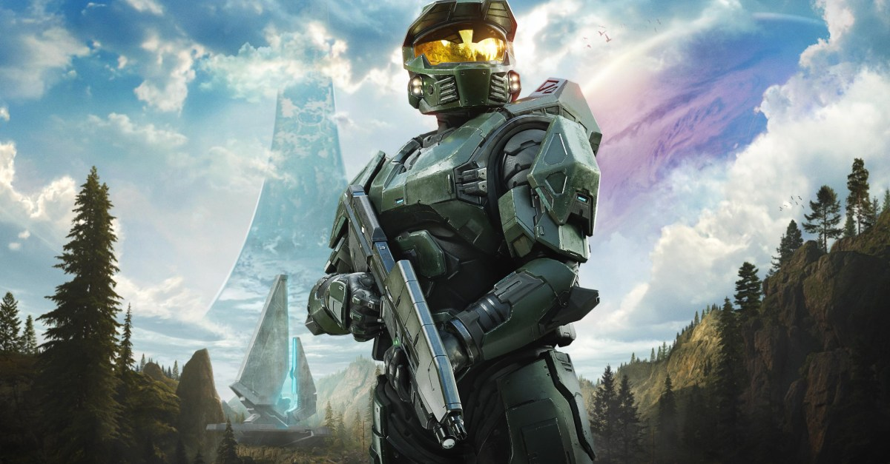

微软为Xbox Series X|S主机推送了预览版系统更新，重点优化了游戏下载机制。更新后，主机将更充分地利用用户网络带宽，实现接近理论峰值的下载速度，尤其对千兆宽带用户提升显著。此前部分玩家反映下载速度受限于系统调度，此次更新直接针对该痛点进行底层优化。该更新目前仅面向预览版用户，正式版推送时间待定。

**简要分析**：下载速度优化是玩家长期呼声最高的功能之一，此次更新将显著改善大容量游戏（如《使命召唤》系列）的安装体验。微软通过系统层面而非网络协议调整解决问题，体现了对主机硬件潜力的持续挖掘。

**来源**：Google News

---

### 📋 其他资讯

#### 1. PC版Xbox向下兼容功能中发现了Xbox 360支持的数据挖掘证据

数据挖掘者在PC版Xbox向下兼容功能的代码中发现了Xbox 360游戏的支持证据。TrueAchievements报道称，相关字符串和模拟器配置文件指向微软正在为PC平台开发Xbox 360游戏兼容层。目前Xbox主机端已支持数百款Xbox 360游戏，但PC端始终缺失官方兼容方案。此次发现暗示微软可能将主机端的兼容技术移植到Windows平台。

**简要分析**：若Xbox 360游戏正式登陆PC，将极大丰富PC Game Pass的游戏库，同时为微软的“Play Anywhere”生态补上关键一环。但模拟器性能优化和版权授权仍是潜在挑战。

**来源**：Reddit r/GamingLeaksAndRumours

#### 2. 数据挖掘发现后，Xbox 360 游戏或可通过微软模拟器在 PC 上运行

继数据挖掘发现代码证据后，更多细节显示Xbox 360游戏可能通过微软官方模拟器在PC上运行。该模拟器疑似基于Xbox主机端的Hyper-V虚拟化技术，而非传统模拟器方案。目前挖掘出的文件包括GPU驱动适配层和音频处理模块，表明微软已进行实质性开发。若实现，PC玩家将能原生运行《战争机器》《光环》等Xbox 360经典作品。

**简要分析**：微软选择自研模拟器而非依赖第三方方案，体现了对兼容性质量和性能的掌控野心。此举将强化Windows作为游戏平台的吸引力，但需解决与现有Xbox主机版兼容服务的定位重叠问题。

**来源**：Google News

#### 3. 微软确定XSX|S第三轮涨价 2TB存储版停产

微软确认Xbox Series X|S将进行第三轮涨价，同时宣布停产2TB存储版主机。此次涨价涉及全球主要市场，幅度因地区而异，官方称受供应链成本及汇率波动影响。2TB版停产意味着未来XSX|S仅提供512GB和1TB版本，玩家需通过官方扩展卡解决存储需求。这是自2023年以来微软第三次上调主机价格，累计涨幅已超20%。

**简要分析**：持续涨价可能进一步削弱Xbox在价格敏感市场的竞争力，尤其面对PS5 Pro和任天堂新机的夹击。停产2TB版则暗示微软正优化产品线，将产能集中于走量型号，但玩家对大容量存储的需求并未减少。

**来源**：Google News

#### 4. 你可以以几乎半价的价格获得三个月的Xbox Game Pass Ultimate订阅

The Verge报道，第三方平台Eneba正以39.01美元的价格出售三个月Xbox Game Pass Ultimate数字兑换码，而官方定价为69美元，折扣幅度达43%。此前微软已将月费从29.99美元降至22.99美元，但此次第三方促销仍具吸引力。该兑换码为全球通用，购买后可直接在微软账户兑换，适合新用户或短期体验玩家。需注意第三方平台交易存在一定风险，建议选择信誉卖家。

**简要分析**：第三方渠道的深度折扣反映了Game Pass订阅市场供过于求的现状，微软官方降价后仍难阻止灰色市场流通。对于玩家而言，这是低成本体验《星空》《极限竞速》等大作的好机会，但需警惕账号封禁风险。

**来源**：The Verge

### 任天堂 Switch

### 🔮 新机爆料

#### 1. Necrolipe和Mike Odyssey爆料：任天堂将推出《塞尔达》主题Switch 2 Pro手柄，而非主机
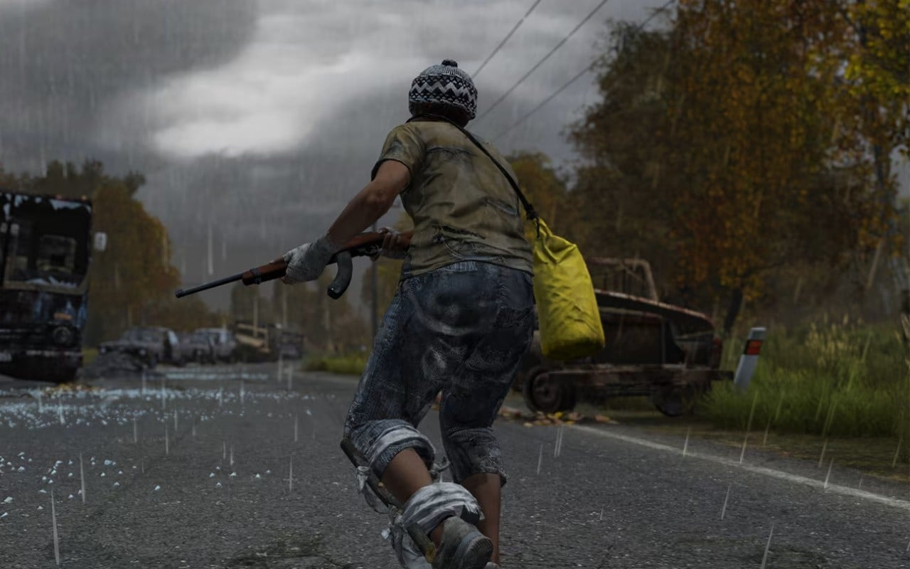

- **新闻内容**：Reddit用户Necrolipe与Mike Odyssey爆料，任天堂计划推出《塞尔达》主题Switch 2 Pro手柄，而非此前传闻的限定版主机。手柄设计细节：中央三角力量徽章位于+和-键之间，握把采用绿色与金色配色，类似《斯普拉遁》主题Pro手柄。任天堂官方未回应。
- **简要分析**：若属实，这将是任天堂首次在主机世代初期推出主题手柄而非主机限定机，意在降低玩家入手门槛，为后续主机限定版留空间，或改变第三方配件市场策略。
- **来源**: Reddit r/GamingLeaksAndRumours

#### 2. 《斯普拉遁》攻略指南发布
- **新闻内容**：Nintendo Life发布《斯普拉遁》完整攻略指南，涵盖新手到老玩家技巧，解析斯普拉哈莱特群岛生存策略，推荐最佳武器与装备组合，拆解坦克升级与Boss战机制，揭示服装解锁方法。
- **简要分析**：作为任天堂热门射击IP，攻略需求旺盛。官方媒体发布深度指南有助于维持社区活跃度，尤其在新作或大型更新前后，能引导玩家消费。
- **来源**: Nintendo Life

#### 3. Shpeshal Nick：塞尔达主题Switch 2主机仍在推出中

- **新闻内容**：爆料人Shpeshal Nick驳斥“仅推出塞尔达主题手柄”传闻，明确表示塞尔达主题特别版Switch 2主机仍在开发中。他回应：“手柄和主机都是‘塞尔达主题’，不一定是《时之笛》主题。”此说法与Necrolipe爆料冲突，任天堂未置评。
- **简要分析**：两位爆料人信息矛盾，反映任天堂保密严密或存在多套方案。主机与手柄双线推进可能性更高，限定主机历来是拉动硬件销量的利器。
- **来源**: Reddit r/GamingLeaksAndRumours

#### 4. DayZ将于下月登陆Switch 2
- **新闻内容**：硬核丧尸生存游戏《DayZ》确认2026年8月20日登陆Switch 2，售价69.99美元。消息源自eShop更新列表，6月任天堂直面会曾低调预告。Switch 2版包含“酷炫版”内容，支持跨平台联机，画质与帧率未公布。游戏以开放世界生存为核心，玩家需搜集资源、对抗其他玩家。
- **简要分析**：作为PC经典生存游戏，《DayZ》登陆Switch 2标志硬核生存类游戏向掌机平台渗透。69.99美元定价略高于常规移植作品，考验玩家付费意愿。
- **来源**: Nintendo Life

#### 5. 任天堂可能已收购《异度传说》
- **新闻内容**：在《异度神剑2：Switch 2版》预告片中，出现《异度传说》角色MOMO作为客串异刃。预告未标注万代南梦宫授权水印，结合万代日本官网去年10月至11月将《异度传说》从授权作品列表移除，外界推测任天堂可能已收购该IP。任天堂与万代均未证实。
- **简要分析**：若收购属实，任天堂将直接掌控《异度传说》开发权，有望重启这一经典JRPG，巩固其JRPG阵容，并与《异度神剑》系列形成联动宇宙。
- **来源**: Reddit r/GamingLeaksAndRumours

#### 6. 《拔天海拓史》重制版开发者协助《异度神剑》Switch 2版开发

- **新闻内容**：日本开发商Logicalbeat确认参与《异度神剑：决定版》Switch 2版本开发，主要负责4K分辨率与60帧性能增强。该公司曾负责《拔天海拓史》重制版开发，代表董事Domae Yoshiki在社交媒体公布此信息。任天堂曾邀请Panic Button等外部团队协助第一方游戏优化，此次合作延续该策略。
- **简要分析**：Logicalbeat加入表明任天堂正整合外部资源提升Switch 2首发游戏画面表现。4K/60帧优化目标暗示Switch 2性能较初代显著提升，为后续大作树立标杆。
- **来源**: Nintendo Life

#### 7. 《最终幻想XIV：永寒之域》扩展预告片公布

- **新闻内容**：Square Enix在公布《最终幻想XIV》Switch 2版发售日时，发布第六个扩展包“永寒之域”预告片。扩展定于2027年1月上线，确认登陆Switch 2。预告片展示新职业及联动突袭系列，细节后续公布。Switch 2版支持与PC、PS5等平台数据互通。
- **简要分析**：作为MMORPG标杆，《最终幻想XIV》登陆Switch 2将拓展用户基数。2027年1月发售窗口表明Square Enix对Switch 2性能有信心，愿为其定制长期运营内容。
- **来源**: Nintendo Life

#### 8. 《最终幻想14》Switch 2版容量117GB，或成最大游戏
- **新闻内容**：据Google News援引消息源报道，《最终幻想XIV》Switch 2版安装容量可能高达117GB，将是Switch 2平台体积最大游戏。考虑到PC版包含多年扩展内容，该容量符合预期。任天堂未公布Switch 2存储规格，此容量暗示玩家需准备大容量存储设备。
- **简要分析**：117GB容量对掌机存储提出挑战，可能推动玩家购买扩展存储或数字版策略调整。
- **来源**: Nintendo Life

### 模拟器资讯

### 🔮 新机爆料

#### 1. Xbox 360游戏或将通过向后兼容功能登陆PC平台
据外媒报道，微软正计划将Xbox 360的向后兼容功能引入PC平台。消息人士透露，该功能将允许玩家在Windows系统上直接运行Xbox 360游戏，无需额外硬件。微软尚未公布具体时间表，但内部测试已在进行，预计最早可能在2026年底前推出。若消息属实，这将极大扩展PC玩家的游戏库，同时强化微软跨平台生态竞争力。但模拟兼容性的稳定性与版权问题仍是潜在挑战。（来源：Google News）

### 🆕 新机发售

#### 1. 微软移植初代Xbox游戏到PC，同步放出官方模拟器
微软近日正式将初代Xbox游戏移植至PC平台，并同步发布官方模拟器。该模拟器支持《光环：战斗进化》《忍者龙剑传》等经典作品，玩家可通过Xbox应用直接下载游玩。模拟器基于Xbox 360的XeFu技术开发，实现对初代Xbox硬件的完整模拟，首批游戏已于7月26日上线。此举不仅盘活经典IP，更展示了微软通过官方模拟器推动PC游戏兼容性的战略，或为后续Xbox 360游戏登陆PC铺平道路。（来源：Google News）

### 📋 其他资讯

#### 1. PS5模拟器进展神速，《恶魔之魂 重制版》已可创建角色
PS5模拟器项目取得重大突破，开发团队宣布已能在《恶魔之魂 重制版》中成功创建角色。尽管游戏画面仍存在渲染问题，但角色创建界面的完整运行标志着模拟器对PS5架构的初步破解。目前该模拟器仅支持特定硬件配置，未公开下载，但社区对此进展高度关注。模拟器的快速迭代可能打破主机独占壁垒，但索尼或加强反模拟措施。（来源：Google News）

#### 2. PS5《恶魔之魂 重制版》未上PC，模拟器已能创建角色
尽管《恶魔之魂 重制版》未正式登陆PC，但第三方PS5模拟器已能运行该游戏并进入角色创建界面。测试视频显示，模拟器在加载角色模型时帧率稳定在30帧左右，但场景渲染仍存在贴图错误。开发团队表示下一步将优化图形管线，争取实现完整游戏流程。模拟器进展凸显了社区破解能力，也暴露了索尼在PC移植策略上的滞后。（来源：Google News）

#### 3. Xbox PC向下兼容功能使用模拟技术，或为Xbox 360支持铺路
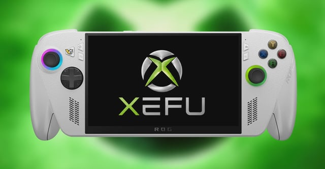

技术分析指出，微软新推出的Xbox PC向下兼容功能基于模拟技术，而非简单代码移植。该技术通过XeFu模拟器直接运行初代Xbox游戏，已实现对《星球大战：旧共和国武士》等作品的完美支持。开发者透露，同一技术框架已预留Xbox 360模拟接口，未来只需更新配置文件即可扩展兼容范围。模拟技术降低了移植成本，但可能引发性能开销问题。（来源：Google News）

#### 4. 微软初代Xbox游戏在PC上通过Xbox 360的XeFu模拟器运行

Reddit用户爆料称，微软PC版初代Xbox游戏实际运行在Xbox 360的XeFu模拟器之上。该模拟器最初为Xbox 360向后兼容功能设计，现被微软直接用于PC端。测试显示，模拟器在运行《光环2》时能保持60帧稳定输出，但部分游戏存在音频延迟。微软尚未对此技术细节做出官方回应。这一发现揭示了微软“借壳”模拟器的低成本策略。（来源：Reddit r/emulation）

#### 5. 第三方小组成功让Xbox 360游戏跑在PC上，微软底层技术已就绪

第三方开发小组宣布，通过逆向工程成功让《战争机器2》等Xbox 360游戏在PC上原生运行。该小组利用微软未公开的XeFu模拟器接口，实现对Xbox 360系统调用的完整模拟。测试显示游戏运行帧率接近原版主机，但需较高配置（如RTX 3060以上显卡）。微软内部人士透露，公司已为官方支持准备了技术文档。第三方突破倒逼微软加速官方支持。（来源：Google News）

#### 6. 微软新Xbox PC模拟器已能运行导出的Xbox 360游戏
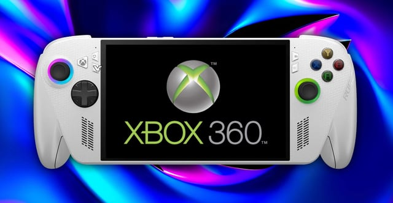

Reddit社区曝光，微软最新Xbox PC模拟器已成功运行从Xbox 360导出的游戏镜像。用户上传截图显示，模拟器界面可识别《极限竞速4》等游戏，并支持手柄映射功能。目前该模拟器仅限内部测试版本，但已能实现基本游戏流程。微软尚未公布正式发布日期，社区推测可能在2026年秋季随Windows更新推送。模拟器对导出镜像的支持意味着玩家可自由备份游戏，但可能引发盗版争议。（来源：Reddit r/emulation）

## 参考资料链接列表

1. [GamingOnLinux] Valve puts up a Proton 11.0-2 Release Candidate for testing: https://www.gamingonlinux.com/2026/07/valve-puts-up-a-proton-11-0-2-release-candidate-for-testing/
2. [GamingOnLinux] Yet Another Zombie Survivors 1.0 release announced for August: https://www.gamingonlinux.com/2026/07/yet-another-zombie-survivors-1-0-release-announced-for-august/
3. [GamingOnLinux] MARVEL Tōkon: Fighting Souls appears to block SteamOS / Linux: https://www.gamingonlinux.com/2026/07/marvel-tokon-fighting-souls-appears-to-block-steamos-linux/
4. [GamingOnLinux] 007 First Light has Denuvo Anti-Tamper DRM removed: https://www.gamingonlinux.com/2026/07/007-first-light-has-denuvo-anti-tamper-drm-removed/
5. [Reddit r/SteamDeck] I finally managed to get gyro working for Gravity Rush in Vita3k: https://old.reddit.com/r/SteamDeck/comments/1v6roly/i_finally_managed_to_get_gyro_working_for_gravity/
6. [Reddit r/SteamDeck] 53wh battery for lcd deck: https://old.reddit.com/r/SteamDeck/comments/1v75n9o/53wh_battery_for_lcd_deck/
7. [GamingOnLinux] Valve give Steam Wishlist and Steam Gifts a major needed upgrade: https://www.gamingonlinux.com/2026/07/valve-give-steam-wishlist-and-steam-gifts-a-major-needed-upgrade/
8. [GamingOnLinux] KONAMI detail more platform specifications for METAL GEAR SOLID: MASTER COLLECTION Vol.2: https://www.gamingonlinux.com/2026/07/konami-detail-more-platform-specifications-for-metal-gear-solid-master-collection-vol-2/
9. [PC Gamer] Bethesda says layoffs haven't affected 'the roadmap' for The Elder Scrolls 6, it hasn't forgotten Oblivion Remastered, and it's not telling you this because Asha Sharma forced it to: https://www.pcgamer.com/games/the-elder-scrolls/bethesda-says-layoffs-havent-affected-the-roadmap-for-the-elder-scrolls-6-it-hasnt-forgotten-oblivion-remastered-and-its-not-telling-you-this-because-asha-sharma-forced-it-to/
10. [PC Gamer] Larian once again reminds us it's 'not involved in any BG3-related projects' in response to Karlach comic reveal: https://www.pcgamer.com/games/baldurs-gate/larian-once-again-reminds-us-its-not-involved-in-any-bg3-related-projects-in-response-to-karlach-comic-reveal/
11. [PC Gamer] A crossover between Dungeons & Dragons and World of Warcraft has leaked: https://www.pcgamer.com/games/world-of-warcraft/a-crossover-between-dungeons-and-dragons-and-world-of-warcraft-has-leaked/
12. [Reddit r/LegionGo] Legion Go 2 or wait for MSI Claw 8 EX AI+?: https://old.reddit.com/r/LegionGo/comments/1v7g0e4/legion_go_2_or_wait_for_msi_claw_8_ex_ai/
13. [Reddit r/ayaneo] Ayaneo Next II Shipping: https://old.reddit.com/r/ayaneo/comments/1v4luld/ayaneo_next_ii_shipping/
14. [PC Gamer] Minecraft Java Edition system requirements want 8/16 GB RAM for the first time, but it isn't more demanding now, Microsoft just hadn't updated the specs in a while: https://www.pcgamer.com/hardware/minecraft-java-edition-system-requirements-want-8-16-gb-ram-for-the-first-time-but-it-isnt-more-demanding-now-microsoft-just-hadnt-updated-the-specs-in-a-while/
15. [Reddit r/MSIClaw] Optiscaler / OptiClick on Claw 8 EX AI+?: https://old.reddit.com/r/MSIClaw/comments/1v6ky3b/optiscaler_opticlick_on_claw_8_ex_ai/
16. [Reddit r/ROGAlly] Launching games from Steam doesn't automatically switch window: https://old.reddit.com/r/ROGAlly/comments/1v6lldm/launching_games_from_steam_doesnt_automatically/
17. [Reddit r/ayaneo] Ayaneo Pocket Micro Classic screen protector and case options?: https://old.reddit.com/r/ayaneo/comments/1v4wrdn/ayaneo_pocket_micro_classic_screen_protector_and/
18. [Retro Handhelds] Game Bub is Finally ‘Shipping Soon’ and You Can Still Pre-order One: https://retrohandhelds.gg/game-bub-is-finally-shipping-soon-and-you-can-still-pre-order-one/
19. [Reddit r/OdinHandheld] Armada OS (20260714) on Odin 3: https://old.reddit.com/r/OdinHandheld/comments/1v73sqz/armada_os_20260714_on_odin_3/
20. [Reddit r/retroid] RP6 Dual Screen Cemu Gamepad Issues: https://old.reddit.com/r/retroid/comments/1v761zu/rp6_dual_screen_cemu_gamepad_issues/
21. [Reddit r/retroid] Get the Nova buttons you want now: https://old.reddit.com/r/retroid/comments/1v7d9h8/get_the_nova_buttons_you_want_now/
22. [Retro Dodo (掌机)] Mattel & Hot Wheels Buildable Halo UNSC Warthog Is Up For Pre-Order On Amazon: https://retrododo.com/mattel-hot-wheels-buildable-halo-unsc-warthog-is-up-for-pre-order-on-amazon/
23. [Retro Dodo (掌机)] ANBERNIC Shows Gameplay & A Few Specs Of Upcoming RG SP Retro Handheld: https://retrododo.com/anbernic-shows-gameplay-a-few-specs-of-upcoming-rg-sp-retro-handheld/
24. [Retro Dodo (掌机)] This Gundam Suit LEGO Set Concept Comes Complete With Cockpit & Stands At 16.5" Tall: https://retrododo.com/this-gundam-suit-lego-set-concept-comes-complete-with-cockpit-stands-at-16-5-tall/
25. [Reddit r/MiyooMini] Ikemen/mugen and pushover port: https://old.reddit.com/r/MiyooMini/comments/1v7as53/ikemenmugen_and_pushover_port/
26. [Reddit r/SBCGaming] Is it too late to buy an Android handheld now ?: https://old.reddit.com/r/SBCGaming/comments/1v7ggo5/is_it_too_late_to_buy_an_android_handheld_now/
27. [Retro Dodo (掌机)] Nintendo Launches Creepy Advert For Donkey Kong Lego Set: https://retrododo.com/nintendo-launches-creepy-advert-for-donkey-kong-lego-set/
28. [Retro Dodo (掌机)] Hasbro Reveals First Wave Of Legend of Zelda Action Figures: https://retrododo.com/hasbro-reveals-first-wave-of-legend-of-zelda-action-figures/
29. [Google News] 索尼新专利曝光：为PS6手柄研发TMR磁吸摇杆 精度更高更耐用: https://news.google.com/rss/articles/CBMiUkFVX3lxTE1GWXplUXdnOGhsYjNBVGR6UE1OaWh2QklhS0dpNXRiWTlrWXBKbDU5YXlDOGZWb1RLUGkwLUY2ZEdfNnQwczBESnZHd3dHY1lnT3c?oc=5
30. [Google News] PS5 Pro重磅升级！升级版PSSR超分来袭，生化危机安魂曲率先适配: https://news.google.com/rss/articles/CBMiT0FVX3lxTE95TzNNY25Wek1wRUlELW1rVUtlbmJKRUpGd3hHUE4zeUpfOVkxb0tfcDVQZkU3bzVKSERZZkpqNEJfN2M0ZGNQWm83SzQxU1k?oc=5
31. [Google News] 消息称索尼/微软有望效仿苹果，为PS6/XBOX Helix推游戏主机月租计划: https://news.google.com/rss/articles/CBMif0FVX3lxTE9kNEl3eGVGVThVNUNDa1lXQlltV1phcFJZSjIxSTZRUU81MzYyS0FwemE2NlNwVzFNS2l6RDB4Wk50X2hPZ3psZjdoamkteWdoTVVuSlcxc2U3S3Zwbk5BNFZWV1hNV01lT25SQlRlMmhDd051M1huT25kT2pmOUk?oc=5
32. [Eurogamer] "Sony had the strictest social media guidelines they've ever seen issued," says former first-party dev about physical disc backlash: https://www.eurogamer.net/sony-disc-backlash-no-surprise-says-former-dev
33. [Google News] 国行PS5 Pro售罄！索尼自家商城都卖完了？: https://news.google.com/rss/articles/CBMiYkFVX3lxTFBMMEtqNnlMWmZsYWlSZzJJeTZhVVdRYUZrNUxfVDdnZTZ1WHlTMnpEeFVWelNIMWpiX21HNU92X05wcklsNDVyUVhpb2JEeldGTkZBNS1ZcTFjRjNSZmphZTdn?oc=5
34. [Eurogamer] 007 First Light's first major patch is here – and it's a doozy if you're playing on PS5: https://www.eurogamer.net/007-first-light-first-major-patch-details
35. [Google News] PS手柄或有革命性升级！磁感应摇杆 PS6玩家要享福？: https://news.google.com/rss/articles/CBMiYkFVX3lxTE90dzNBVVRfUFhpaGJaR3Y0WkpBZUxhMjBuRUFIMENsLXBSN1pFNVNpa08yZFZ6TkN3QzZEcGo4WXBuMWVUUnF0SjhhRE8wU1pOS3lOZ3pLbHk0OEZ5amdMU0RR?oc=5
36. [Reddit r/GamingLeaksAndRumours] Ad supported game streaming testing for XBOX: https://old.reddit.com/r/GamingLeaksAndRumours/comments/1v4igkn/ad_supported_game_streaming_testing_for_xbox/
37. [Google News] 游戏下载速度终于能跑满网络带宽，微软 Xbox Series X|S 主机喜提预览版系统更新: https://news.google.com/rss/articles/CBMiZEFVX3lxTFBrb1pKOElkcXhodUt3SXB5czJ1c0RMZW1hMFBJZUxnMTQ5bmNPb1BhRlcyUmxHQ3JPZG8weWdPVV9VMkhwTzU1VGdoNVZiVlZnQUd1cEszbXppOUZIZTNzTXdyeDg?oc=5
38. [Reddit r/GamingLeaksAndRumours] Xbox 360 support for Xbox BC on PC has been datamined: https://old.reddit.com/r/GamingLeaksAndRumours/comments/1v4k0u4/xbox_360_support_for_xbox_bc_on_pc_has_been/
39. [Google News] 数据挖掘发现后，Xbox 360 游戏或可通过微软模拟器在 PC 上运行: https://news.google.com/rss/articles/CBMia0FVX3lxTE95TFZ1UHMxQXk0ek8tNHgzMWdSUlREVGUzeXFHWVdjX0pKajBVRVhxYlRDYWtaOE1YZ0p4V1Z4eTRDSFRwQmY3T1g5cVp5bzQ5bnZIclkzdWlxQmF3YWNZQnQ3ZEhGdU44QzMw?oc=5
40. [Google News] 微软确定XSX|S第三轮涨价 2TB存储版停产: https://news.google.com/rss/articles/CBMigAFBVV95cUxOTjZlaVFtTXlZYWFkUzlMcml1TWNLZE9vLVVSVU9iUjVfQWc2OEhKaVZHZUh1TnZiVVA0VHpaRW5uNW05enZRazhQdkg4WWsxVzk4ODFfRVFidDgzSWN1X3ZzWWVTZ280eHZqZG9ES0FaR2tZMFF6ZzBiUmdlYVI5ag?oc=5
41. [The Verge] You can get three months of Xbox Game Pass Ultimate for almost half off: https://www.theverge.com/gadgets/970775/xbox-game-pass-ultimate-deal-sale
42. [Reddit r/GamingLeaksAndRumours] Necrolipe and Mike Odyssey heard that Nintendo is about to reveal a Zelda-themed Switch 2 Pro Controller instead of a Zelda-Themed Switch 2 console: https://old.reddit.com/r/GamingLeaksAndRumours/comments/1v4i9a0/necrolipe_and_mike_odyssey_heard_that_nintendo_is/
43. [Nintendo Life] Guide: Splatoon Raiders Guide, Tips & Tricks: https://www.nintendolife.com/guides/splatoon-raiders-guide-tips-tricks
44. [Reddit r/GamingLeaksAndRumours] Shpeshal Nick: Zelda-themed special edition Switch 2 console is indeed still coming — disputing previous rumors that only a special edition controller will release: https://old.reddit.com/r/GamingLeaksAndRumours/comments/1v4qik5/shpeshal_nick_zeldathemed_special_edition_switch/
45. [Nintendo Life] DayZ Brings Gritty, Zombie-Survival Multiplayer To Switch 2 Next Month: https://www.nintendolife.com/news/2026/07/dayz-brings-gritty-zombie-survival-multiplayer-to-switch-2-next-month
46. [Reddit r/GamingLeaksAndRumours] Nintendo may have acquired Xenosaga: https://old.reddit.com/r/GamingLeaksAndRumours/comments/1v5gvhs/nintendo_may_have_acquired_xenosaga/
47. [Nintendo Life] Baten Kaitos Remaster Dev Helped Out With Xenoblade Chronicles' Switch 2 Edition: https://www.nintendolife.com/news/2026/07/baten-kaitos-remaster-dev-helped-out-with-xenoblade-chronicles-switch-2-edition
48. [Nintendo Life] Round Up: Final Fantasy XIV: Evercold Extended Teaser Revealed, New Job And Crossover Raid Series Announced: https://www.nintendolife.com/news/2026/07/round-up-final-fantasy-xiv-evercold-extended-teaser-revealed-new-job-and-crossover-raid-series-announced
49. [Google News (via Switch 2)] 消息称《最终幻想 14》Switch 2 版容量 117GB，或成 Switch 2 体积最大游戏: https://news.google.com/rss/articles/CBMif0FVX3lxTE91bm8xeURXUTlSMXJ4dXRpT3hjb3BKMUREU3FVQW1nQnZQc3B1cDRER1R4XzJOOHhlOHg4TWR3NVRJcUtZdmgtT1hFbU9aVDRsZW5NZ1g4Rm96OVowbmt2ZUFrLXdJNDN5YW81a18yRzZBb2NvUUFhczhucW0wLTg?oc=5
50. [Google News] Xbox 360游戏或将通过向后兼容功能登陆PC平台: https://news.google.com/rss/articles/CBMikAJBVV95cUxNSlBJRTdFQkNiMkRxSTJOeThScnZnX21CU1k5QWZhS0lYOW5QUnpCRHZKc0YweTFsSGlsblJlZ3ZiYVVTRUJkTTlhV0llWUpxUDdKV3pVOWRWcTNYNFJyUGRrc2VUSjdJYnRVUXFraW1yN2J1VENaSUc2b2dkc095YktmMkxRRmRqV1I0SnB3WDhWS1lMN0hQd29aX1BsRl84Nlh0QXhyb2VHbFVReldUd2VMVmNLaEczeERlNDV4eHRaLUdxRVA0ZDZnT1VVRk94Y3lWT0FyVG10cFdoV0xfWGNXUE1WREJwTDdpcXhvUGJHUDd1SUE0dlIzTkhiZnZvSUp6QjZmMHdFSHRrMDlUVA?oc=5
51. [Google News] 微软为用户送大礼！移植初代Xbox游戏到PC：竟同步放出官方模拟器: https://news.google.com/rss/articles/CBMif0FVX3lxTE1wdlg1cS1qdVM0NXh0UE1kU3FyZFJEdmt3Q3JjWDZQXzZLUWZ4UzluR0lqU3dldXhNTUZ5OGNQTFh4c1VDUUFTQS1qeGVjbTZKdTV4NFF6NDkzeWptWjFOMU1qWUc0T3dkUmJCeUZwbGxFc2JGZHRKb2FDU29JMzA?oc=5
52. [Google News] PS5模拟器进展神速 《恶魔之魂 重制版》已可创建角色: https://news.google.com/rss/articles/CBMiYkFVX3lxTFByZkEzVk1McEpLZWpxVmNXM2RpaFkzY0xEQzZaSGdxZTJVU1ZGaDlRVXk3NTJFNXk2REpSZmlVSTRvUW1UOGRnRGRmcVc1dzZVV3RqMm5GUDRiOTdianZoNDZR?oc=5
53. [Google News] PS5《恶魔之魂 重制版》没上PC，模拟器却已能创建角色了: https://news.google.com/rss/articles/CBMiYkFVX3lxTE1iY2ZmNDZ5cTd3OG1kQkFFaDBkdHUzb2dRUlB2Qy1DTHNBalE2N0ZGU2VfZUVHNjdQQ1l2T1RDWXBnSW1xUVV1Y0VtQkFFNE1xNjd0SHE1aVNtMDVQLUQtZ0Rn?oc=5
54. [Google News] XBOX PC向下兼容功能据称使用模拟技术，或为XBOX 360支持铺平道路: https://news.google.com/rss/articles/CBMiYkFVX3lxTE1pZ0VFQmNjWHVkenh6U2ZJZVRxcWM1NVNsUnpKZnpsdFI2dWFUWnVGaHNsMWgza1p5dmhLV3pLZUwwS1gwY25qUk52eVlyajlPQ1dHRXB3X1d1SDBXZjZNSUd3?oc=5
55. [Reddit r/emulation] Microsoft’s original Xbox games on PC reportedly run through the Xbox 360’s XeFu emulator: https://old.reddit.com/r/emulation/comments/1v4bb4c/microsofts_original_xbox_games_on_pc_reportedly/
56. [Google News] 第三方小组成功让Xbox 360游戏跑在PC上，微软底层技术已就绪: https://news.google.com/rss/articles/CBMiYkFVX3lxTE1QOGNFTlI1RE5FRVJFUGRYa3E5cEdUVVp6eVE3c2R2TFVYRXZjcFBDY0FPem5CcDdLWHlRNmNUbGR2THN3V0RnQWFsUm5nbWZsZ3JGQnoxMFdyMnBxeEEzeFZ3?oc=5
57. [Reddit r/emulation] Microsoft’s new Xbox PC emulator already runs dumped Xbox 360 games: https://old.reddit.com/r/emulation/comments/1v585mj/microsofts_new_xbox_pc_emulator_already_runs/

## 🇨🇳 国内资讯

### Steam Deck

### 🔮 新机爆料

#### 1. Steam Machine塞回SSD 外国博主：像演动作片

知名硬件博主@JayzTwoCents（订阅433万）发布视频，演示将SSD重新塞回Steam Machine的过程，形容操作“像演动作片”。该视频由B站UP主“阿布看AI”译制，于7月24日发布，播放量52次。Steam Machine作为Valve早期客厅游戏机，因模块化设计导致拆装困难，此次操作再次引发对老硬件维护难度的讨论。  
简要分析：百万粉博主关注Steam Machine，说明复古游戏硬件仍有话题热度，但低播放量也反映出国内受众对这款“失败产品”兴趣有限。  
来源: B站(via Steam Machine)

### 🆕 新机发售

#### 1. 这不是Steam Machine！DIY复刻迷你主机

B站UP主“高手苦力怕”发布视频，展示其完全还原尺寸的Steam Machine DIY复刻迷你主机。因原版Steam Machine价格昂贵且难以购买，该UP主尝试自制，但面临选型难、散热差等问题。目前仅作为个人兴趣项目，待完善后才会公开模型文件。视频于7月26日发布，播放量3071次。  
简要分析：民间DIY复刻反映了玩家对Steam Machine经典设计的怀念，但散热和选型难题也凸显了Valve当年产品设计的妥协，复刻门槛依然很高。  
来源: B站(via Steam Machine)

### 📋 其他资讯

#### 1. Steam Deck需求据称暴跌，销量同比下滑82%

据IGN中国7月24日报道，Steam Deck需求出现暴跌，销量同比下滑82%。报道指出，涨价是导致需求骤降的主要原因。此前Valve曾因零部件成本上涨上调了Steam Deck售价，这一举措直接影响了消费者的购买意愿，尤其是在掌机市场竞争日益激烈的背景下。  
简要分析：82%的同比跌幅相当惊人，说明价格敏感度在掌机市场极高。若数据属实，Valve可能需要通过降价或推出新机型来挽回颓势，否则将被ROG Ally等竞品进一步蚕食份额。  
来源: IGN中国

#### 2. 你看過這種手把？Steam Controller從初代就充滿特色？今天來開箱這組經典中的經典吧！ | 羅卡Rocca

台湾UP主“羅卡Rocca”于7月25日发布开箱视频，展示初代Steam Controller。该手柄以独特的双触控板设计和高度自定义功能著称，是Valve进军控制器领域的标志性产品。视频中UP主详细介绍了其按键布局和手感，播放量218次。Steam Controller已于2019年停产，目前成为收藏级硬件。  
简要分析：初代Steam Controller的开箱内容虽小众，但能唤起核心玩家对Valve硬件探索历史的回忆。其触控板设计理念至今仍被部分Steam Deck用户怀念。  
来源: B站(via Steam Controller)

#### 3. 《风暴怕死队》最新修改内置适配控制台，武器、配件、护符、遗物自由编辑。还有传说词条/药品等。

B站UP主“丶落白衣”于7月25日发布视频，介绍《风暴怕死队》最新修改器，该修改器内置控制台，支持武器、配件、护符、遗物等自由编辑，并包含传说词条和药品修改功能。视频播放量241次，UP主在简介中提供了同款修改器下载链接。此类修改器通常用于降低游戏难度或体验隐藏内容。  
简要分析：Steam平台游戏修改器内容活跃，反映出部分玩家对“爽玩”体验的追求。但需注意，使用第三方修改器可能违反游戏服务条款，存在封号风险。  
来源: B站(via Steam 控制器)

#### 4. 【龙之剑觉醒】最新修改器控制台，无敌+伤害倍率+金币修改+内置物品面板，轻松提升战力，修改器一键安装教程

B站UP主“巴巴博一游戏资讯分享”于7月25日发布《龙之剑觉醒》修改器教程，该修改器提供无敌、伤害倍率、金币修改及内置物品面板功能，号称一键安装即可提升战力。视频播放量110次，简介中附有下载链接。此类修改器在国产独立游戏中较为常见，旨在满足玩家快速通关或测试需求。  
简要分析：修改器内容在B站游戏区持续有流量，但《龙之剑觉醒》作为相对小众的游戏，该视频传播范围有限。建议玩家谨慎使用，避免影响游戏平衡或账号安全。  
来源: B站(via Steam 控制器)

#### 5. 《风暴怕死队》强力编辑器 | 内置面板+必定暴击+游戏调速

B站UP主“最后的天锁斩月月”于7月25日发布《风暴怕死队》编辑器视频，功能包括内置面板、必定暴击和游戏调速。视频播放量123次，UP主在简介中提供了主播同款修改器链接。该编辑器与前述“丶落白衣”发布的修改器功能类似，均针对同一款游戏，说明该游戏在修改器社区有一定热度。  
简要分析：同一款游戏出现多个修改器视频，表明《风暴怕死队》的玩家群体对自定义功能需求旺盛。但内容重复度较高。

### Windows 掌机

### 🆕 新机发售

#### 1. 价值1750美元的壹号本ONEXPLAYER 3 PC游戏掌机开箱+游戏体验｜作者 讲究哥

- **新闻内容**：UP主“油管科技TV”发布壹号本ONEXPLAYER 3开箱与游戏体验视频，该掌机售价1750美元。视频展示设备外观、性能及实际游戏运行效果，播放量达178次。作为旗舰级Windows掌机，ONEXPLAYER 3定位高端市场，主打极致性能与便携体验。
- **简要分析**：1750美元的定价使其成为目前最昂贵掌机之一，巩固壹号本在高端细分市场地位，但对目标用户购买力提出更高要求。
- **来源**: B站（via AYANEO掌机）

#### 2. 【掌机周报特别篇】老张GKD小金刚发售风波，一波未平一波又起，精彩程度堪比三顾茅庐七擒孟获

- **新闻内容**：UP主“Xigua今天打游戏了吗”发布掌机周报特别篇，聚焦老张GKD小金刚发售风波。事件一波三折，被形容为“三顾茅庐、七擒孟获”，引发社区广泛讨论。视频播放量达2116次，反映玩家对这款掌机发售进程的高度关注与争议。
- **简要分析**：GKD小金刚发售风波暴露国产掌机在供应链、营销节奏上的不成熟，可能影响品牌信誉，但也为后续产品积累话题热度。
- **来源**: B站（via AYANEO掌机）

### 📱 系统更新

#### 1. OneXConsole又双叒叕更新啦！快来看看你的建议有被采纳吗

- **新闻内容**：壹号本科技官方宣布，掌机控制软件OneXConsole迎来超大版本更新。官方表示此次更新采纳大量用户反馈建议，旨在提升操作流畅度与功能实用性。具体更新日志尚未完全公开，但已引发用户期待，评论区互动活跃。
- **简要分析**：OneXConsole持续迭代体现壹号本对软件生态的重视，通过用户共创优化体验，有助于增强品牌粘性并提升产品竞争力。
- **来源**: B站动态@壹号本科技

#### 2. Xbox ally win掌机轻松加愉快简单几步就安装好官方steamos系统～~

- **新闻内容**：UP主“GamerJT”发布教程，演示如何在Windows掌机（如ROG Ally等）上安装官方SteamOS系统。步骤包括：准备U盘、下载SteamOS镜像与Rufus工具制作启动盘、进入BIOS关闭安全启动并设置USB启动，最后重启完成安装。视频播放量达1325次，为玩家提供跨系统体验新路径。
- **简要分析**：该教程降低SteamOS在非Steam Deck设备上的安装门槛，可能推动更多Windows掌机用户尝试双系统，但需注意驱动兼容性与性能损耗问题。
- **来源**: B站（via Win掌机）

### 📋 其他资讯

#### 1. AMD AI MAX+395处理器，壹号本Mini AI工作站——ONEXStation，性能与颜值双在线

- **新闻内容**：壹号本科技发布Mini AI工作站ONEXStation，搭载AMD AI MAX+395处理器与128GB高频内存，最高支持千亿级参数本地AI模型部署。设备采用简约科技美学设计，融合16种RGB幻彩氛围灯，兼具强悍游戏性能，可高帧畅玩全平台主流3A大作。
- **简要分析**：ONEXStation将AI算力与游戏性能合二为一，开辟掌机/迷你主机跨界新赛道，有望吸引AI开发者和硬核游戏玩家双重关注。
- **来源**: B站动态@壹号本科技

#### 2. 壹号本OneXPlayer游侠X2 G3e：10.95寸2.5K大屏+手写笔+无极支架，这到底是游戏掌机还是移动生产力工具？

- **新闻内容**：UP主“汤姆爱数码”体验壹号本OneXPlayer游侠X2 G3e，该设备配备10.95英寸2.5K大屏、手写笔及无极支架，模糊游戏掌机与移动生产力工具界限。视频播放量达454次，展示其在游戏、绘图、办公等多场景下的使用表现。
- **简要分析**：游侠X2 G3e形态创新试图打破掌机单一娱乐定位，若能在散热与续航上平衡，有望成为创作者与玩家的二合一选择。
- **来源**: B站（via OneXPlayer壹号本掌机）

#### 3. 「UP主的拍摄间」ROG玩家国度：官号环境太令人羡慕了！

- **新闻内容**：ROG玩家国度官方账号发布视频，带领观众参观其总部拍摄间与展台，并与内容团队交流。视频使用Canon EOS C50拍摄，展示ROG在内容创作与品牌展示上的专业投入。该内容属于品牌幕后花絮，播放量尚未公开。
- **简要分析**：ROG通过展示官方拍摄环境，强化品牌专业形象与社区亲和力，有助于提升玩家对ROG掌机及硬件的关注。
- **来源**: B站（via ROG玩家国度）

### 安卓掌机

### 🆕 新机发售

#### 1. AYANEO Pocket MICRO 2 发布，新一代横版复古安卓掌机
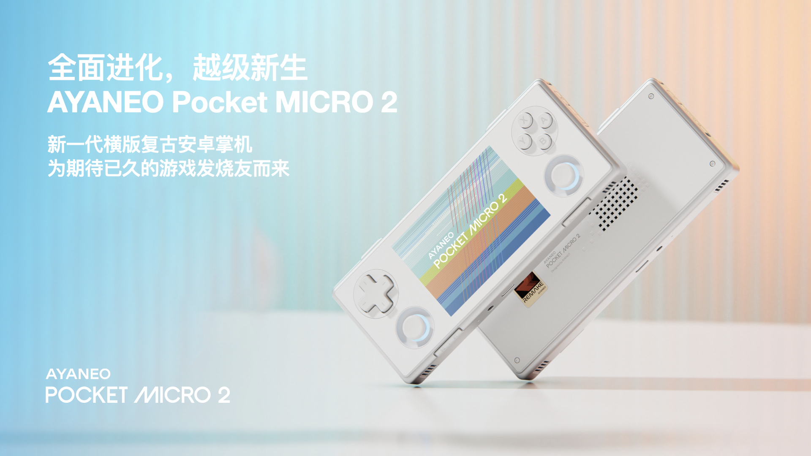

AYANEO官方于7月23日发布新一代横版复古安卓掌机Pocket MICRO 2。该机搭载3.5英寸960×640分辨率LCD屏幕，核心采用高通骁龙865定制处理器，官方称性能较前代提升220%。内置3950mAh电池，续航提升52%。机身采用CNC中框设计，配备下沉式TMR摇杆与分离式大尺寸肩键，支持AYAHome与AYASpace自研软件生态，提供银色与黑色两种配色。分析认为，骁龙865使该掌机性能跃升至旗舰级，满足模拟器需求，并可流畅运行部分原生安卓大作，拓宽了复古掌机应用场景。来源：B站动态@AYANEO官方

#### 2. AYANEO推出KONKR Pocket Advance掌机，主打“掌中图腾 全面觉醒”概念

AYANEO于7月23日公布新款掌机KONKR Pocket Advance，主打“掌中图腾 全面觉醒”概念。该设备采用橙色机身设计，配备贴合指尖的大尺寸L1/R1肩键及分离式L2/R2肩键，旨在提升操作舒适度。目前该产品尚未正式发布，官方提示“即将到来，敬请期待”，并提供QQ群与官网链接供玩家关注。分析指出，AYANEO连续推出两款新品，显示其在安卓掌机市场加速布局。KONKR系列以独特配色和人体工学设计为卖点，有望吸引追求个性与操控体验的硬核玩家。来源：B站动态@AYANEO官方

#### 3. 【开源掌机】高性能4:3？这次对了！Retroid Pocket Nova沙雕小钢炮详细测评

知名UP主“玩具窝”于7月25日发布Retroid Pocket Nova（沙雕小钢炮）详细测评视频，播放量达2.4万。该机主打高性能4:3屏幕比例，定位为开源掌机中的“小钢炮”。测评涵盖开箱、试玩及性能表现，重点展示其在模拟经典游戏时的画面适配与流畅度。分析认为，4:3屏幕比例精准切合复古游戏玩家需求，避免宽屏黑边问题。Retroid Pocket Nova在细分市场找到精准定位，有望成为怀旧游戏玩家的高性价比选择。来源：B站(via Retroid Pocket)

### 📋 其他资讯

#### 1. 抱歉，您提供的标题内容似乎不完整或存在乱码
7月23日，贴吧沙雕吧出现一条来源为Google News的资讯，标题因编码问题显示为乱码（%E6%B2%90%E6%B6%9F%E6%A9%99%E6%BC%AA），无法识别原文信息。该条目仅有标题与来源链接，无有效内容。分析认为，此类乱码信息通常为RSS抓取或转码错误所致，建议玩家忽略或通过来源链接查看原始页面。来源：贴吧沙雕吧

#### 2. 白熊119的关注
7月23日，贴吧沙雕吧出现标题为“白熊119的关注”的资讯，来源为Google News。该条目无有效摘要内容，仅包含标题与链接，推测为社区用户动态或关注列表分享，不具备明确新闻价值。分析认为，此类信息属于社区个人动态，与安卓掌机硬件或系统更新无直接关联，建议玩家选择性忽略。来源：贴吧沙雕吧

#### 3. 超便携 高性能四比三 你的梦中情机来了 沙雕RP NOVA

UP主“十万伏特BOLT”于7月24日发布视频，介绍Retroid Pocket Nova（沙雕RP NOVA）为“超便携高性能4:3梦中情机”，播放量达9910。视频末尾附带一款宝可梦与火纹结合的改版游戏《宝可梦纹章-上吧，宝可梦训练家！》的百度网盘链接，供玩家下载。分析认为，UP主在测评硬件时附带推荐改版游戏，体现掌机社区“硬件+内容”联动的生态特点，有助于提升玩家对机型的关注度与购买意愿。来源：B站(via 沙雕 掌机)

### 开源掌机/Linux掌机

### 🔮 新机爆料

（本板块暂无内容）

### 🆕 新机发售

#### 1. 2025年反向推荐安伯尼克RG35XXH掌机
UP主“祭酝蚀潭Gn0”发布视频，在2025年推荐安伯尼克去年发布的RG35XXH掌机。该机型作为成熟横向开源掌机，凭借稳定系统生态和亲民定价，在2025年仍具极高性价比，成为入门玩家首选。分析认为，该视频反映开源掌机市场“老机型长尾效应”，预算有限或初次接触的玩家更倾向购买成熟旧款，也说明RG35XXH生命周期管理成功。来源: B站（开源掌机）

### 📱 系统更新

（本板块暂无内容）

### 📋 其他资讯

#### 1. 安伯尼克RG SP游戏演示

安伯尼克官方发布RG SP掌机游戏演示。该机型采用翻盖设计，搭载3.4英寸720×480分辨率IPS屏幕及1GB内存，可实现GBA游戏3倍点对点显示，画面清晰锐利。设备支持PSP、PS1、DC、NDS及移植游戏等30多个复古平台，主打便携与经典体验。分析指出，RG SP以翻盖设计和GBA点对点显示为卖点，精准切入怀旧玩家细分需求，官方持续放出演示内容，表明该机型是近期主推的差异化产品。来源: B站动态@Anbernic官方

#### 2. 安伯尼克RG ROTATE复古FC外壳保护膜推荐

UP主“KURO贴”发布视频，为ANBERNIC RG ROTATE掌机推荐机身外壳保护膜，展示“涂装系列”中复古FC配色色号。该保护膜旨在保护机身，同时让玩家还原经典红白机外观风格，提升个性化与收藏价值。分析认为，第三方配件厂商推出定制化保护膜，反映RG ROTATE在玩家群体中已形成改装与美化需求，配件生态丰富度是衡量掌机市场热度的指标之一。来源: B站（Anbernic 安伯尼克 掌机）

#### 3. 大连存储哥聊山寨GBC
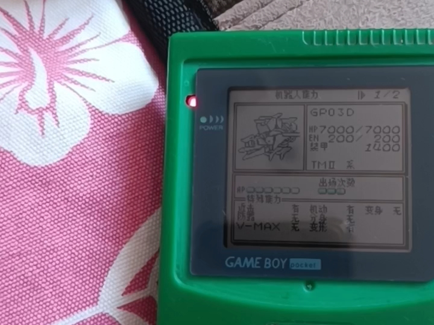

UP主“大连存储哥”发布视频，探讨山寨GBC掌机，聚焦市场上各类仿制或山寨版GBC，分析其硬件做工、游戏兼容性及与原版差异，为玩家提供辨别与选购参考。分析指出，山寨GBC话题持续讨论，说明怀旧游戏市场仍存在大量低价仿制产品，内容有助于玩家避坑，但也反映正规开源掌机厂商在低端市场面临山寨产品竞争压力。来源: B站（山寨掌机）

#### 4. TRIMUI BRICK PRO忍者主题诞生记
UP主“极客Kevin”为TRIMUI BRICK系列掌机制作“BLACK RED MASTER”忍者风原创主题。该主题从主背景、导航图标、设置图标、焦点动画到菜单水滴音效全面重做，建立完整黑红水墨视觉系统，理论上支持Trimui Brick、Brick Hammer和Brick Pro三款机型。分析认为，深度定制主题的出现，标志TRIMUI BRICK系列拥有活跃第三方创作者社区，沉浸式主题制作提升个性化体验，有助于增强用户粘性和品牌忠诚度。来源: B站（TrimUI 掌机）

#### 5. 42美元山寨PS5掌机拆解
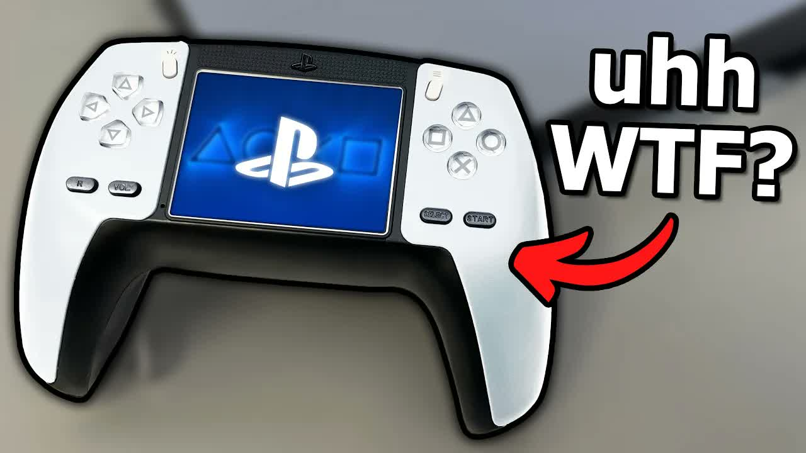

UP主“A-电容爆炸”搬运并翻译国外博主Jacob R视频，展示一款售价42美元的山寨PS5掌机。拆解发现其内部做工粗糙，硬件配置与宣传严重不符。视频旨在提醒玩家警惕低价山寨产品。分析指出，该拆解再次为消费者敲响警钟，这类产品利用大厂外观吸引眼球，但内部用料和性能无保障，选择正规开源掌机品牌更稳妥。来源: B站（山寨掌机）

#### 6. 贴吧关注类帖子
贴吧“霸王小子吧”出现标题为URL编码“E8%8D%94%E6%9E%9D%E6%98%AF%E4%B8%AA%E5%A5%BD%E5%AD%A9%E5%AD%90的关注”的帖子，解码后意为“荔枝是个好孩子的关注”，可能涉及玩家社区内个人关注或互动行为，具体细节不明。分析认为，该条目信息量有限。

### PlayStation

### 🔮 新机爆料

#### 1. GTA6第三支预告片预测：日期锁定8.6，但别高兴太早

B站UP主“次元裂痕电子羊”发布视频预测，《GTA6》第三支预告片将于2026年8月6日发布。该预测基于对R星过往宣发节奏的分析，但UP主提醒玩家“别高兴太早”，因R星跳票频繁，且官方尚未确认任何具体日期。视频播放量已超2100次，引发社区热议。此类预测虽无官方背书，但反映玩家对《GTA6》新信息的极度渴望。若预告未如期而至，可能进一步消耗玩家耐心，对R星品牌信誉造成影响。

来源: B站(via PS6 游戏)

### 🆕 新机发售

#### 1. 《战神：劳菲》将于27年2月16日在PS5发售

索尼互动娱乐宣布，《战神：劳菲》将于2027年2月16日登陆PS5。玩家将扮演奎托斯的第二任妻子、阿特柔斯的母亲劳菲（菲）。故事设定在菲死后，她在众神死后世界“万时界”苏醒，发现生前为保护奎托斯与阿特柔斯所做的安排岌岌可危。玩家需运用菲的速度与精准战斗能力，在危险魔法世界中对抗各路神祇。该作首次以女性主角视角拓展《战神》宇宙，是对系列叙事深度的重大补充。选择2027年2月发售，避开了年末大作扎堆期，有望成为PS5春季档的独占王牌。

来源: 机核

#### 2. 经典新生！《古墓丽影：亚特兰蒂斯遗迹》官宣2027年2月13日发售，多平台现已开放预购

经典系列新作《古墓丽影：亚特兰蒂斯遗迹》正式宣布将于2027年2月13日发售，登陆PS5、Xbox Series X|S及PC平台，目前各平台已开启预购。本作将带领玩家探索传说中的亚特兰蒂斯遗迹，劳拉·克劳馥将面对全新的谜题与致命陷阱。具体售价及版本信息暂未公布，但官方承诺提供次世代画质与光追支持。该作定档2月13日，与《战神：劳菲》仅隔3天，形成2027年2月“硬核女主动作游戏”对撞局面，可能互相分流销量。

来源: 知乎专栏

### 📋 其他资讯

#### 1. 《魔界战记》创作者抨击索尼放弃光盘

《魔界战记》系列创作者在采访中公开抨击索尼逐步放弃光盘介质的策略，直言“不如连PlayStation主机也取消”。他认为，全面数字化将剥夺玩家对游戏的所有权，并损害实体收藏爱好者的权益。该言论引发业界对索尼数字转型策略的再次讨论。作为日本老牌游戏制作人，其批评代表了部分传统开发者对纯数字未来的担忧。索尼若继续推进无光驱策略，可能面临核心玩家群体的抵触情绪，尤其是在实体版文化深厚的日本市场。

来源: IGN中国

#### 2. PS5 Pro版《光环：战役进化》实机演示

预购了高级版的玩家现已可进入《光环：战役进化（Halo: Campaign Evolved）》游戏。该作是《光环：战斗进化》战役模式的现代化重制版，包含高清画面、优化控制、最多4人在线合作、3个全新任务，以及扩充武器库与新增敌人。游戏将于7月28日正式登陆PS5、Xbox Series及PC平台，同步加入Game Pass游戏库。PS5 Pro版本实机演示展示了60帧稳定运行与光追效果。这是《光环》系列首次正式登陆PlayStation平台，标志着微软第一方游戏跨平台策略的深化。PS5 Pro版的高画质表现将吸引索尼平台FPS玩家，但可能削弱Xbox独占优势。

来源: IGN中国

#### 3. 优派VX24G26J-4K与华硕ROG XG27UCGR区别对比

知乎专栏发布对比评测，解析优派VX24G26J-4K与华硕ROG绝神27二代XG27UCGR两款显示器的差异。优派主打24英寸4K高性价比，适合小桌面玩家；华硕ROG提供27英寸4K 160Hz高刷与Fast IPS面板，定位电竞旗舰。评测从色域、响应时间、HDR效果等维度对比，为PS5玩家选购显示器提供参考。随着PS5 Pro支持更高刷新率与4K输出，玩家对显示器的需求转向“高刷+低延迟”，此类内容反映了主机玩家外设升级的刚需趋势。

来源: 知乎专栏

#### 4. 雷鸟25Q6A Pro显示器全面解析

知乎专栏发布雷鸟25Q6A Pro显示器的全面解析文章，介绍其25英寸2K分辨率、240Hz高刷新率、HDR600认证及1ms响应时间等核心参数。文章提供选购建议，指出该型号适合追求高帧率体验的PS5玩家，尤其是射击与竞速类游戏场景。价格定位中端，主打性价比。雷鸟作为新兴显示器品牌，正通过高刷+低价格策略切入主机外设市场，若产品口碑稳定，可能对传统电竞显示器品牌形成冲击。

来源: 知乎专栏

#### 5. Switch 2 的 NAT 类型到底

### Xbox

### 🆕 新机发售

#### 1. 如何评价Anthropic发布的Claude Opus 5？
Anthropic近期发布最新AI模型Claude Opus 5，在推理、编程和多模态理解能力上较前代显著提升。官方尚未公布具体性能基准测试分数，开发者社区已围绕API调用成本和应用场景展开讨论。该模型目前通过Anthropic的API向部分用户开放测试。该新闻与Xbox硬件及游戏生态无直接关联，属于跨领域资讯。来源：知乎

#### 2. Xbox手柄开箱
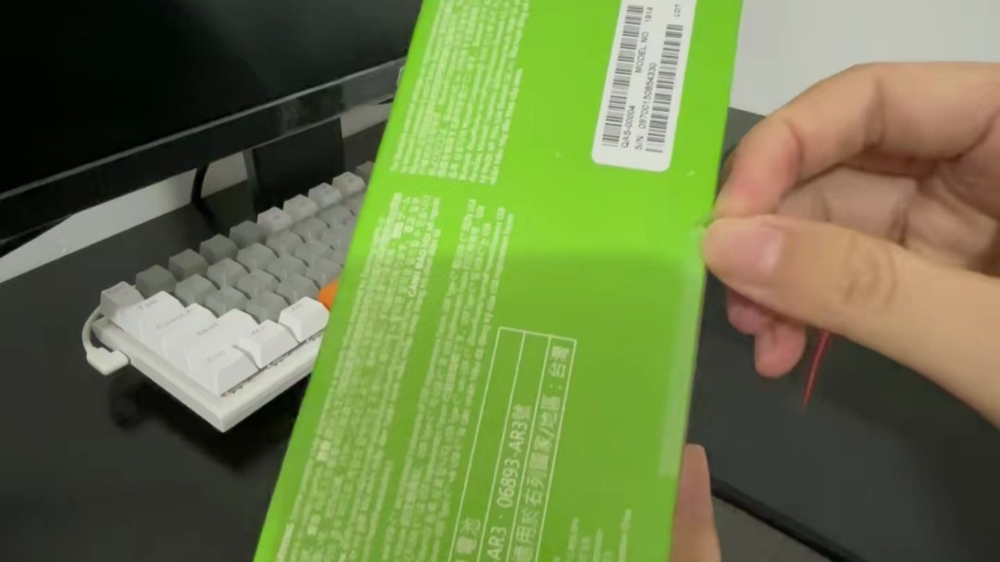

B站UP主“这是沸羊羊的胜利”发布Xbox手柄开箱视频，展示Xbox Series系列标准版手柄的包装、外观及握持手感。视频时长较短，播放量3次，内容聚焦按键布局、材质细节及与主机的配对流程。该手柄兼容Xbox Series X|S、Xbox One及Windows PC平台。此类开箱内容属于玩家社区日常分享，对行业趋势影响有限，但反映Xbox配件在玩家群体中的持续关注度。来源：B站(via Xbox Series)

#### 3. 微软将为“XBOX向下兼容功能”引入的初代XBOX游戏添加成就系统

IT之家7月26日消息，微软宣布为Xbox向下兼容功能中新增的初代Xbox游戏引入成就系统。首批支持游戏包括《布林克斯：时间清扫者》《疯狂大乱斗》《血色苍穹：复仇之路》《百战坏松鼠：重装上阵》四款。微软成就系统最早于2005年随Xbox 360推出，曾支持解锁角色饰品，该特性在Xbox One时代被移除。成就不会追溯记录，玩家需在系统上线后重新挑战。为经典老游戏添加成就系统，能有效提升玩家重玩旧作的动力，增强Xbox Game Pass库的长期吸引力，是微软盘活经典IP的低成本高回报策略。来源：IT之家

### 📱 系统更新

#### 4. ROG Ally X Z2 Extreme运行《光环：战役进化》性能测试

B站UP主“Deck_HQ”发布ROG Ally X（搭载Z2 Extreme处理器）运行《光环：战役进化》的性能测试视频。测试涵盖多种功耗与画质预设组合，包括17W/720p极低预设、25W/720p低预设、35W/720p中预设等，并测试通过Lossless Scaling补帧至1080p的表现。测试平台为Windows 11系统，驱动版本为2026年7月版。该测试展示新款掌机在经典Xbox IP上的实际性能，为玩家选购掌机提供参考，印证Z2 Extreme芯片在低功耗场景下的能效优势。来源：B站(via Xbox 掌机)

#### 5. 《漫威斗魂》ROG Ally X性能初体验
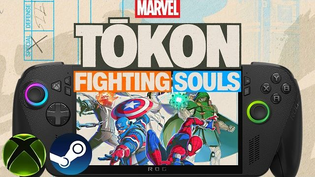

UP主“Deck_HQ”使用ROG Ally X测试《漫威斗魂》性能表现。测试环境为Windows 11 25H2，游戏安装在固态硬盘，显卡驱动版本为2026年7月2日发布的V32.0.31019.2002。测试以35W功耗、低预设、720P分辨率配合FSR性能模式运行，分别展示对战模式和剧情战斗场景的帧率稳定性。测试表明ROG Ally X在35W功耗下能流畅运行《漫威斗魂》，为格斗游戏爱好者提供掌机游玩可能性，但画质妥协较大。来源：B站(via Xbox 掌机)

### 📋 其他资讯

#### 6. 如何评价荣耀最新的logo？
荣耀近期更新品牌Logo，新标识在字体和图形设计上进行了简化与现代化调整。官方尚未公布具体换标原因，行业分析认为此举可能与荣耀独立运营后重塑品牌形象、强化高端定位的战略有关。该新闻与Xbox业务无直接关联，属于泛科技资讯。来源：知乎

#### 7. 黄仁勋反对美国封禁中国AI模型
NVIDIA CEO黄仁勋公开反对美国政府对部分中国AI模型的封禁措施，认为此举将损害全球AI产业生态。美方封禁理由主要涉及数据安全与技术竞争，业界对禁令实际执行效果存在争议。该事件涉及芯片出口管制与AI技术竞争，可能间接影响游戏硬件供应链，但短期内对Xbox生态影响有限。来源：知乎

#### 8. 2026最新！Mac安装Windows零成本教程
知乎专栏发布教程，介绍如何在Mac设备上免费安装Windows系统，适用于需要运行Windows专属软件或游戏的用户。教程详细说明使用Boot Camp或第三方虚拟机工具的步骤。该内容与Xbox硬件无直接关联，但可能帮助Mac用户通过Windows平台体验Xbox Game Pass，间接有利于Xbox PC Game Pass的推广。来源：知乎专栏

### 任天堂 Switch

### 🔮 新机爆料

#### 1. 国产修仙ARPG《黄天逆途》最新实机演示公开

国内独立团队望虚社公布《黄天逆途》最新实机演示。本作是融合肉鸽要素的俯视角ARPG，玩家扮演“天魔”陆沉穿梭时空寻找证道契机。演示展示了BOSS战与角色养成系统，官方确认画面为100%实机录制。项目已开发两年，玩法功能验证基本完成，进入内容堆量阶段，不考虑EA则还需一年以上开发时间。
分析：国产修仙ARPG稀缺，本作表现力不俗，若登陆Switch有望填补品类空白，但开发周期较长，落地仍需观察。
来源：B站动态@二柄APP

#### 2. 爆料人称《阳光马里奥》将移植Switch，情绪激动

据B站UP主“次元裂痕电子羊”援引Switch 2爆料，任天堂计划将《阳光马里奥》移植至Switch。爆料人情绪激动表示“求求别上”，但暗示任天堂已决定推进。消息尚未官方证实，属社区传闻。若移植成真，将是NGC经典首次登陆现代任天堂平台。
分析：爆料可信度较低，更多是情绪宣泄。若移植，将丰富Switch怀旧游戏库，但操作适配和画面重制是挑战。
来源：B站(via Switch 2 爆料)

#### 3. Claude Opus 5系统提示词泄露，提及《神鬼寓言5》
据知乎专栏报道，AI模型Claude Opus 5系统提示词疑似泄露，包含20万字符内容，意外提及《神鬼寓言5》。泄露引发关注，但具体关联性不明，微软及Playground Games未回应。该消息与Switch无直接关联，但作为跨平台潜在作品引发讨论。
分析：此消息与Switch关联度极低，更像AI行业新闻。若《神鬼寓言5》未来登陆Switch 2，可能成为重磅第三方，但现阶段纯属猜测。
来源：知乎专栏

#### 4. 宝可梦黑白复刻版Switch 2新作预测

B站UP主“宝可梦情报”发布视频，预测《宝可梦 黑/白》复刻版或将登陆Switch 2，并展望合众地区新作。视频基于系列惯例与Switch 2性能提升，推测复刻版将采用高清化开放世界设计，并加入新剧情与联机功能。目前仅为社区推测，任天堂与宝可梦公司未发布官方信息。
分析：宝可梦复刻是粉丝长期期待，但缺乏实质证据。若Switch 2性能足够，复刻版有望成为初期护航作品，需警惕过度解读。
来源：B站(via Switch 2 爆料)

#### 5. 《Splatoon Raiders》预告片发布，真实性存疑

据B站UP主“橘喵斑猫”转载，任天堂美国官方YouTube发布《斯普拉遁掠夺者》预告片，宣布独占登陆Switch 2。故事设定在斯珀拉莱特群岛，加入全新掠夺模式。游戏官网已上线，但任天堂官方未在国区发布公告，视频播放量极低，真实性存疑。
分析：该消息来源为单一转载视频，播放量仅1次，极可能是粉丝自制或虚假信息。建议以官方消息为准。
来源：B站(via Switch 2)

### 🆕 新机发售

#### 1. 多人联机《一起来开大商场》现已发售

多人联机模拟经营游戏《一起来开大商场》于7月24日登陆Steam。游戏主打低门槛经营，玩家可单人或组队打造商场，体验创业快感。支持中文，售价暂未公布。该作未明确登陆Switch，但模拟经营类在掌机平台适配性较高。
分析：目前仅登陆PC，若后续移植Switch，将丰富平台联机经营品类。建议关注官方跨平台计划。
来源：B站动态@游民星空官方

#### 2. 模拟经营《电商大亨》7月28日发售

模拟经营游戏《电商大亨》宣布将于7月28日登陆Steam。玩家

### 模拟器资讯

### 🆕 新机发售

#### 1. GBA光明之魂2改版 恶魔之炎大爆炸

- **新闻内容**：B站UP主“帕昂虎”发布GBA《光明之魂2》改版演示视频，展示“恶魔之炎大爆炸”技能效果。改版扩大了爆炸范围，使玩家能同时攻击更多敌人。UP主强调视频仅用于演示改版可能性，不发布任何ROM文件，并开放FC、SFC、GBA、NDS游戏修改定制服务。
- **简要分析**：此类改版视频展示社区对经典游戏的创作热情，但“不发布ROM”的声明反映改版作者对版权风险的谨慎态度，未来或推动更多非商业性技术演示。
- **来源**: B站(via GBA 模拟器)

### 📋 其他资讯

#### 1. KTR2教程，KOS系统配置，天马G专属配置包安装，256G整合包
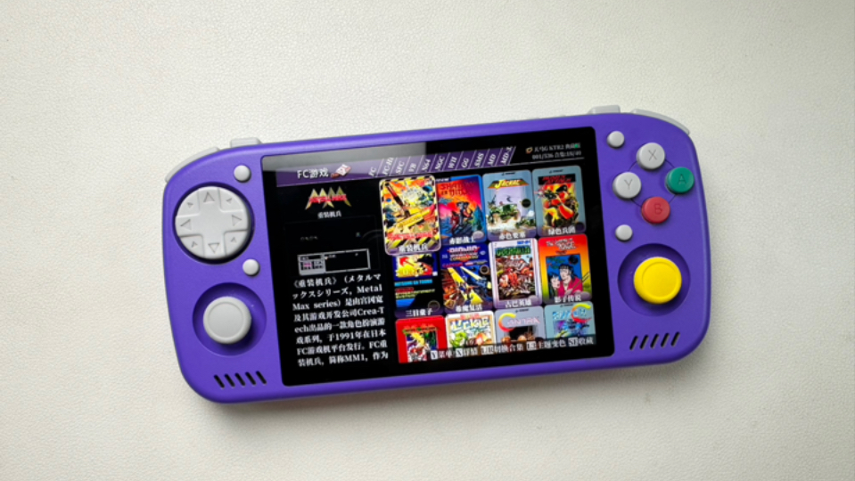

- **新闻内容**：UP主“千夏的铲子”发布KTR2掌机教程，涵盖KOS系统配置、天马G专属配置包安装及256G整合包使用指南。整合包及配置包通过百度网盘分享，提取码为KTR2，解压密码为“跳坑者联盟”。UP主还提供KTR掌机高级群和KOS系统内测群入口。
- **简要分析**：整合包和教程降低玩家上手开源掌机门槛，但依赖网盘分享和社群内测模式，资源获取的时效性和稳定性存在风险。
- **来源**: B站动态@千夏的铲子

#### 2. RP NOVA新手教程，天马G配置和256G整合包，PSV、NS模拟器配置教程

- **新闻内容**：UP主“千夏的铲子”同步推出RP NOVA掌机新手教程，同样提供天马G配置包和256G整合包。资源通过百度网盘分享，提取码为NOVA，解压密码仍为“跳坑者联盟”。教程内容扩展至PSV和Nintendo Switch模拟器配置指导。
- **简要分析**：连续为KTR2和RP NOVA提供配置包，表明UP主正尝试建立跨设备通用模拟器配置方案，有助于统一用户体验，但整合包长期维护更新将是挑战。
- **来源**: B站动态@千夏的铲子

#### 3. 安卓Switch模拟器Citron Neo 0720版
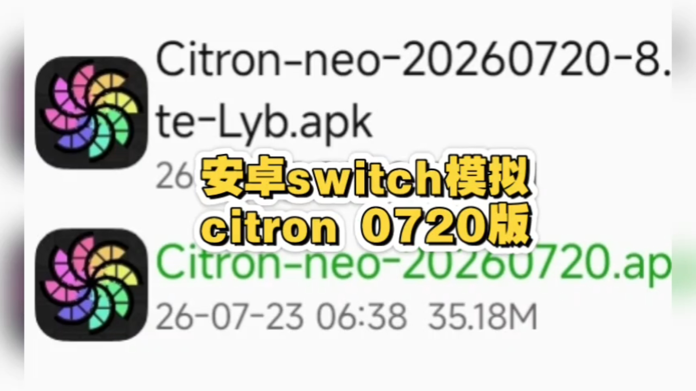

- **新闻内容**：B站UP主“大头雀游戏屋”发布安卓端Switch模拟器Citron Neo 0720版本更新。该版本在兼容性和性能上有所优化，具体更新内容需通过UP主提供的QQ频道获取。视频播放量达703次，显示安卓Switch模拟器社区持续关注。
- **简要分析**：Citron Neo作为安卓端Switch模拟器分支，持续更新表明开发者仍在维护，但通过QQ频道分发资源的方式限制用户获取便利性，增加传播门槛。
- **来源**: B站(via Switch 模拟器 安卓)

#### 4. Vita3k神秘海域通关啦！

- **新闻内容**：B站UP主“hsvfkhs”发布视频，宣布在Vita3k模拟器上成功通关《神秘海域》。视频播放量达831次，展示PSV模拟器在运行大型3A游戏方面的进展。Vita3k是目前最成熟的PSV模拟器之一，此次通关演示进一步验证其对高画质游戏的兼容能力。
- **简要分析**：成功通关《神秘海域》是Vita3k模拟器成熟度的重要里程碑，意味着PSV模拟器已具备运行完整商业大作能力，未来有望吸引更多玩家尝试PSV游戏库。
- **来源**: B站(via PSV 模拟器)

#### 5. 安卓switch模拟器试玩《流行之神2》汉化版
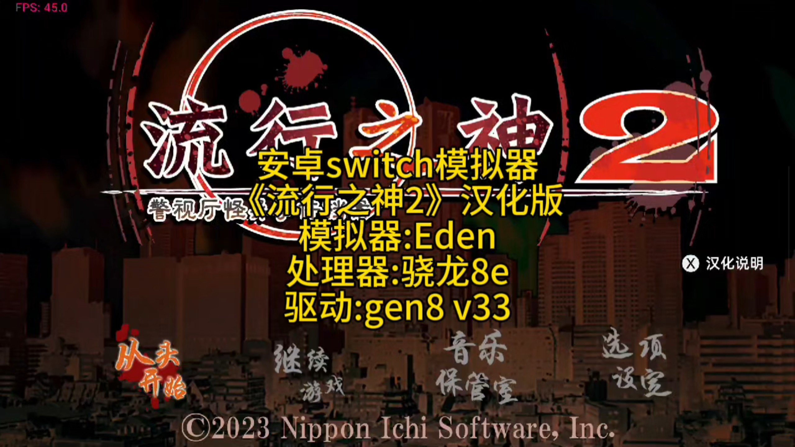

- **新闻内容**：UP主“大头雀游戏屋”使用安卓Switch模拟器试玩《流行之神2》汉化版，视频播放量477次。该游戏为文字冒险类作品，对模拟器性能要求较低，但汉化版使其更受国内玩家关注。UP主同样通过QQ频道提供模拟器及游戏资源。
- **简要分析**：文字冒险类游戏在模拟器上运行流畅度较高，此类试玩视频有助于吸引非硬核玩家关注安卓Switch模拟器，但汉化版版权问题仍是潜在风险点。
- **来源**: B站(via Switch 模拟器 安卓)

#### 6. PSP用WSC模拟器

- **新闻内容**：B站UP主“我迪迦在东北い”分享PSP专用WSC（WonderSwan Color）模拟器及游戏合集。资源分为两个压缩包：一个包含WSC模拟器和100个游戏合集，另一个为单独模拟器与游戏整合包，均通过夸克网盘提供下载。
- **简要分析**：PSP通过模拟器运行WSC游戏，进一步扩展PSP怀旧游戏库。这种“模拟器套模拟器”玩法虽小众，但满足核心玩家对多平台复古游戏需求，体现PSP硬件性能潜力。
- **来源**: B站(via PSP 模拟器)

#### 7. 手机模拟PSP《铁拳6》动作格斗游戏模拟器PPSSPP

- **新闻内容**：B站UP主发布手机模拟PSP《铁拳6》的PPSSPP模拟器演示，展示动作格斗游戏在移动端的运行效果。视频未提供具体资源链接，但PPSSPP作为成熟模拟器，已广泛支持PSP游戏在安卓平台运行。
- **简要分析**：手机模拟PSP游戏进一步降低怀旧游戏门槛，PPSSPP的持续优化使移动端体验接近原生，但操作适配和性能优化仍是关键挑战。
- **来源**: B站(via PSP 模拟器)

### 游戏外设

### 🔮 新机爆料

#### 1. 努比亚红魔8Pro磁吸散热背夹：低噪音半导体降温

- **新闻内容**：B站UP主“拾光小筑56586”发布视频，展示努比亚红魔8Pro磁吸散热背夹。该产品采用半导体降温方案，主打低噪音设计，适用于游戏直播场景及平板设备。视频演示了磁吸安装方式和降温效果，目前可在红魔官方渠道关注。
- **简要分析**：红魔深耕游戏散热市场，磁吸+低噪音组合精准切中直播用户痛点，有望成为手游主播标配外设，巩固红魔在游戏配件领域的专业形象。
- **来源**: B站(via 红魔 游戏手机)

#### 2. 赛睿 Rival Pro (Mini) 鼠标确认搭载UWB技术
- **新闻内容**：据IT之家7月26日报道，SteelSeries为Rival Pro和Rival Pro Mini两款电竞鼠标进行FCC注册。Rival Pro长约129mm、宽约70mm，Mini版长约122mm、宽约65mm。两款均支持UWB超宽带无线技术，搭载可更换310mAh电池模块，无线基站兼具备用电池充电功能。主控采用NXP LPC5528JBD64 MCU，配合TrueMove 30K传感器，支持9000Hz无线轮询率和8000Hz传感器报告率。
- **简要分析**：赛睿将UWB技术引入电竞鼠标，实现无线性能飞跃，9000Hz轮询率刷新行业响应速度标准。可换电设计解决高刷无线鼠标续航焦虑，对高端电竞玩家极具吸引力。
- **来源**: IT之家

### 🆕 新机发售

#### 1. 小鸡观星者手柄开箱：智控交互新体验
- **新闻内容**：盖世小鸡官方发布“观星者”游戏手柄开箱视频。手柄采用白色外观，配备双摇杆、方向键及ABXY按键，支持多平台连接。包装盒印有全球代言人、格斗游戏世界冠军曾卓君（XiaoHai）签名及形象，主打高性能与舒适握感，定位为核心玩家进阶手柄。
- **简要分析**：盖世小鸡签约XiaoHai代言，强化产品在格斗游戏领域的专业口碑。“观星者”作为代言人同款，有望借助冠军效应吸引硬核玩家，提升品牌在高端手柄市场的竞争力。
- **来源**: B站动态@盖世小鸡

#### 2. Switch及配件福袋促销：大表哥1/双点博物馆/涂击队
- **新闻内容**：B站UP主“欢乐多EX”发布视频，介绍Switch及Switch Pro 2手柄福袋活动。内容涉及《大表哥1》NS版（128元）、《双点博物馆》（166元）及NS2游戏《涂击队》国内现货信息，包含“宝森 Pro2手柄”福袋促销。视频播放量2028次，面向Switch玩家提供游戏及配件优惠。
- **简要分析**：此类福袋反映国内Switch配件市场以价格敏感型用户为主，捆绑游戏与手柄的促销方式能有效刺激消费，但需注意产品来源与售后保障。
- **来源**: B站(via Switch Pro 手柄)

#### 3. 八位堂猎户座二代手柄测评：N64透明配色版
- **新闻内容**：B站UP主“玩具窝”发布八位堂猎户座二代手柄开箱测评视频，重点展示N64透明配色版。视频介绍其设计理念，包括复古透明外壳、按键布局优化及握持手感。猎户座二代延续八位堂对经典手柄的复刻风格，同时针对现代游戏需求进行功能升级。
- **简要分析**：八位堂通过N64透明配色唤起老玩家怀旧情怀，以“教你设计”视角提升品牌技术调性。复古+创新策略有助于在竞争激烈的手柄市场中建立差异化优势。
- **来源**: B站(via 八位堂)

### 参考资料
- https://www.bilibili.com/video/BV1mF376xECb
- https://www.ithome.com/0/981/795.htm
- https://t.bilibili.com/1228223645809115172
- https://www.bilibili.com/video/BV1Qjgv6yEjY
- https://www.bilibili.com/video/BV1qmgx6aErh

## 参考资料链接列表

1. [B站(via Steam Machine)] Steam Machine塞回SSD 外国博主：像演动作片: https://www.bilibili.com/video/BV1Ng3M6ZEAx
2. [B站(via Steam Machine)] 这不是SteamMachine！DIY复刻迷你主机: https://www.bilibili.com/video/BV12P3J6hEUa
3. [IGN中国] Steam Deck需求据称暴跌，销量同比下滑82%: https://www.ign.com.cn/steam-deck/61541/steam-deckxu-qiu-ju-cheng-bao-die-xiao-liang-tong-bi-xia-hua-82
4. [B站(via Steam Controller)] 你看過這種手把？Steam Controller從初代就充滿特色？今天來開箱這組經典中的經典吧！ | 羅卡Rocca: https://www.bilibili.com/video/BV1dHKE6aER4
5. [B站(via Steam 控制器)] 《风暴怕死队》最新修改内置适配控制台，武器、配件、护符、遗物自由编辑。还有传说词条/药品等。: https://www.bilibili.com/video/BV1oK3u6JEiJ
6. [B站(via Steam 控制器)] 【龙之剑觉醒】最新修改器控制台，无敌+伤害倍率+金币修改+内置物品面板，轻松提升战力，修改器一键安装教程: https://www.bilibili.com/video/BV1Rb3M6yE2o
7. [B站(via Steam 控制器)] 《风暴怕死队》强力编辑器 | 内置面板+必定暴击+游戏调速: https://www.bilibili.com/video/BV1dx3M62EiH
8. [B站(via AYANEO 掌机)] 价值 $1750 美元的壹号本 ONEXPLAYER 3  PC游戏掌机开箱+游戏体验｜作者 讲究哥: https://www.bilibili.com/video/BV1GY3K6NE8P
9. [B站(via AYANEO 掌机)] 【掌机周报特别篇】老张GKD小金刚的发售风波，一波未平一波又起，精彩程度堪比三顾茅庐 七擒孟获: https://www.bilibili.com/video/BV1CWg96QEfR
10. [B站动态@壹号本科技] OneXConsole 又双叒叕更新啦!快来看看你的建议有被采纳吗: https://t.bilibili.com/1228794446996308001
11. [B站(via Win 掌机)] Xbox ally win掌机轻松加愉快简单几步就安装好官方steamos系统～~: https://www.bilibili.com/video/BV1BP3u6DEZd
12. [B站动态@壹号本科技] AMD AI MAX+395处理器，壹号本Mini AI 工作站——ONEXStation，性能与颜值双在线: https://t.bilibili.com/1228052276611907623
13. [B站(via OneXPlayer 壹号本 掌机)] 壹号本OneXPlayer游侠X2 G3e：10.95寸2.5K大屏+手写笔+无极支架，这到底是游戏掌机还是移动生产力工具？: https://www.bilibili.com/video/BV1HHgS6BER2
14. [B站动态@ROG玩家国度] 「UP主的拍摄间」ROG玩家国度：官号环境太令人羡慕了！: https://t.bilibili.com/1228199250433671209
15. [B站(via OneXPlayer 壹号本 掌机)] 厉害了！壹号本onexplayer3，XESS3倍插帧流畅体验红色沙漠光追+高特效，OLED高刷+HDR画面效果拉满了: https://www.bilibili.com/video/BV1Uiga6PEu1
16. [B站动态@AYANEO官方] AYANEO Pocket MICRO 2 发布，新一代横版复古安卓掌机。搭载3.5英寸960×640 LCD屏幕，采用高通骁龙865定制处理器，性能提升220...: https://t.bilibili.com/1228160423875837971
17. [B站动态@AYANEO官方] AYANEO推出KONKR Pocket Advance掌机，主打“掌中图腾 全面觉醒”概念。设备采用橙色机身设计，配备贴合指尖的大尺寸L1/R1肩键和分离式L...: https://t.bilibili.com/1228186374077677574
18. [B站(via Retroid Pocket)] 【开源掌机】高性能4:3？这次对了！Retroid Pocket Nova沙雕小钢炮。详细测评。开箱。试玩。: https://www.bilibili.com/video/BV12U3g6zECL
19. [贴吧沙雕吧] %E6%B2%90%E6%B6%9F%E6%A9%99%E6%BC%AA的粉丝: https://news.google.com/rss/articles/CBMinAFBVV95cUxOTEw5QTN4N0czUXNoZnR5bXpTejZJcUJweEhaMXc1S3lONjNQQXZCSkc0UlhwMGd6SDhlWkJ3R1NVQXUwOTJzYTBGbWFuXzhLdG0yTWJfYmU5dWVON3NFVGxrLUVEampNMF9UNUFzR0tXVnZrajEzWmtLT3dQalVGU3VfXzl0WGF6ZldLVmxXSjA2TWMxeFJ6YWZjSTg?oc=5
20. [贴吧沙雕吧] %E7%99%BD%E7%86%8A119的关注: https://news.google.com/rss/articles/CBMijgFBVV95cUxPSDRoa1pBbVR1cTM1OUF5NWdscHNpNXU4dThOZEN1WEl1emtJemMtbVhuMTl2UXprS01JRVNWWG5kMVFaMkhQWHk0Ylh1VUxmVy04cmJBN3dNbkRrbTgyRkFvelVKLUZRejNtLXREbVpBLVpZOExwQ2F6aG0tX0xjMTE3SXlqT2ZDYUEwRlh3?oc=5
21. [B站(via 沙雕 掌机)] 超便携 高性能四比三 你的梦中情机来了 沙雕RP NOVA: https://www.bilibili.com/video/BV1VDgv6HEQY
22. [B站(via 开源掌机)] 2025年，为什么我反而推荐大家入手这款安伯尼克去年发布的RG35XXH掌机？#安伯尼克#RG35XXH#掌机#开源掌机-7534356132334144777: https://www.bilibili.com/video/BV1aUg96vENh
23. [B站动态@Anbernic官方] 安伯尼克 ANBERNIC：RG SP 游戏演示: https://t.bilibili.com/1228570412910116917
24. [B站(via Anbernic 安伯尼克 掌机)] 安伯尼克RG ROTATE复古FC机身外壳保护膜推荐: https://www.bilibili.com/video/BV15U3E6kE6y
25. [B站(via 山寨掌机)] 大连存储哥和大家聊聊山寨gbc: https://www.bilibili.com/video/BV1gHgU6UERz
26. [B站(via TrimUI 掌机)] 从图标到音效全部重做！开源掌机 TRIMUI BRICK PRO｜忍者主题诞生记: https://www.bilibili.com/video/BV1FFgx6vEUr
27. [B站(via 山寨掌机)] 42美元山寨PS5掌机拆开后更离谱: https://www.bilibili.com/video/BV1vRgt6vE6y
28. [贴吧霸王小子吧] E8%8D%94%E6%9E%9D%E6%98%AF%E4%B8%AA%E5%A5%BD%E5%AD%A9%E5%AD%90的关注: https://news.google.com/rss/articles/CBMixgFBVV95cUxPeVVjSk11bmZYNm11WGN0TDJJbTZHQ3JYLUpvSjlhTVRjQXIwUGp3TkZMTmVRN2lPTEczcnBYTVUzNk40N2t6WVBrZVVkYWFEMUc5MDBkYUlqU2Y3MGVHTVp2NEVnLVVjbVcxdHJBWWxWUGg0alVIMU9rdzZySHVUcHNhUUJicVBUWm5JNFJ1eW44SmFrdERscmRpenV4OTFyZ0FLTXN0eVNwaV9pYy1jaTc1MWdibkMzeTRXT1UyM19hNWVnaHc?oc=5
29. [B站官号@芒米科技] MANGMI AIR Y 实机游戏演示: https://www.bilibili.com/video/BV1Sdgh6aE4q
30. [B站(via PS6 游戏)] GTA6第三支预告片预测：日期锁定8.6，但别高兴太早: https://www.bilibili.com/video/BV1TE3j6sEfn
31. [机核] 《战神：劳菲》将于27年2月16日在PS5发售: https://www.gcores.com/articles/217560
32. [知乎专栏] 经典新生！《古墓丽影：亚特兰蒂斯遗迹》官宣2027年2月13日发售，多平台现已开放预购: https://news.google.com/rss/articles/CBMiXEFVX3lxTE1xQlVUXzZ2eGlaR3ZyTmFGcTJYa3JILXN3VllKWmFSMDUtdEVUcWU2SVg0MFQ3VHlZbHdNaWQzRnZ4bHdiT2ZNYjBRZ1VLMEZ2bFhlTWNldmJHUXlP?oc=5
33. [IGN中国] 《魔界战记》创作者抨击索尼放弃光盘: https://www.ign.com.cn/mjzjgame/61524/mo-jie-zhan-ji-chuang-zuo-zhe-peng-ji-suo-ni-fang-qi-guang-pan
34. [IGN中国] PS5 Pro版《光环：战役进化》实机演示: https://www.ign.com.cn/halo-campaign-evolved/61530/ps5-proban-guang-huan-zhan-yi-jin-hua-shi-ji-yan-shi
35. [知乎专栏] 优派VX24G26J-4K和华硕ROG XG27UCGR区别对比：优派VX24G26J-4K和华硕ROG绝神27二代XG27UCGR哪个好？: https://news.google.com/rss/articles/CBMiXEFVX3lxTFA4M0k5QUFfazVXWlB0ZE1hLVJPTzVfd1VDOG5xYXVLSFdRWGozNWRKZW9WZThJcGZreG1IRXljRXIyWFRKbHhMaExmTkVjVmZPaVk0MVhwZnZSTnpT?oc=5
36. [知乎专栏] 雷鸟25Q6A Pro显示器（雷鸟Q6APro）全面解析，雷鸟 25Q6APro选购建议: https://news.google.com/rss/articles/CBMiXEFVX3lxTE1SWEx1aVdMM29Gc1NCel82TWJKdms0SHZxWGxOY3JnMGs1SGpRSHNSWFZZTmlLZXBwQmFTSTJXbDQ0YlVyY2hNRnZfTXRDRlZyajh3eWZxcDN4b1lw?oc=5
37. [知乎专栏] Switch 2 的 NAT 类型到底怎么测？我用四种 NAT 实测给你答案: https://news.google.com/rss/articles/CBMiXEFVX3lxTE1iOXFOX3NzSEJ6a3JuZnZqR0ZOLTFiR1FvbXdRU2hUMmZVcG1XSGhsbTF0azhXN1l5eG5haWVXcEpxbm84X3lUYnA1emJrZUpEWXdTRE43N3JlR3lR?oc=5
38. [知乎] 如何评价Anthropic发布的Claude Opus 5？: https://news.google.com/rss/articles/CBMiX0FVX3lxTFBOTEgtSnZuV1NVMnVIZTRkcFYxMXEwcXJNM09XVmF6VDMtQ3JjY0lvNGRwZGhfcFZITEotakh1SkxnUlZPUnYzb1NTQmdtZlRRN1pJMVVQdEpkUUE4TG5j?oc=5
39. [B站(via Xbox Series)] Xbox手柄开箱#xbox#xboxseries#一起xbox更好玩#数码产品-7301245519676919077: https://www.bilibili.com/video/BV11f356EEhL
40. [IT之家] 微软将为“XBOX 向下兼容功能”引入的初代 XBOX 游戏添加成就系统: https://www.ithome.com/0/981/807.htm
41. [B站(via Xbox 掌机)] ROG Xbox Ally X Z2 Extreme / 《光环：战役进化》性能测试 / SteamOS 3.8.24: https://www.bilibili.com/video/BV1Eegh62EGz
42. [B站(via Xbox 掌机)] 《漫威斗魂》ROG Xbox Ally X 性能初体验：能玩吗？: https://www.bilibili.com/video/BV14H3T6hESU
43. [知乎] 如何评价荣耀最新的 logo？为啥要在这个时间点更换logo？: https://news.google.com/rss/articles/CBMiX0FVX3lxTE4zMW15TEVkU2s0R3N3bXNKcW85Z1cwZXRqOTV6NENPZ3lvQmpLWVJxNTFlLVo5RzVucWIwXzMwb0trOHRBMktaLWxKcEpDRndyS3hBMmRrWVdoZVFvX3pR?oc=5
44. [知乎] 黄仁勋反对美国封禁中国 AI 模型，美方为什么要封禁？禁令真能落地吗？: https://news.google.com/rss/articles/CBMiX0FVX3lxTE1HWDBJTzQ1czRoLWtQejM3UWI1Sm1NZGNpbTVCR3JEeEd4TDFydnN1QkhUSFctY3dVdl9TOGYtYVp4ZGdZQ2E5UHMxbEF5WHlIa1o5a3A2T05sUTdrNDY0?oc=5
45. [知乎专栏] 2026最新！Mac 安装Windows零成本教程，新手也能上手: https://news.google.com/rss/articles/CBMiXEFVX3lxTFB2YWpkd0tfY2xUNFIyX0I4NjdiRUhWbWpxX2pQQm5tck9lc3BqUzd4MTkwejhPRi1YdUdwcVFCaFVMazJYSk8yTERTQlhxYnM5QkFKZ0RBWW1lLXll?oc=5
46. [B站动态@二柄APP] 证道之路渐近！国产修仙题材ARPG《黄天逆途》最新实机演示公开: https://t.bilibili.com/1229215998047944706
47. [B站(via Switch 2 爆料)] 爆料人破大防：我求求《阳光马里奥》别上Switch！但老任不答应……: https://www.bilibili.com/video/BV197gU6HEC3
48. [知乎专栏] Claude Opus 5 系统提示词泄漏，20 万提示词泄漏 Fable 5 原罪: https://news.google.com/rss/articles/CBMiXEFVX3lxTE1lMko1OFd6QXJrZEkxYURpcHA5U1NBeGVWd1NsWFhzNTNCT21QY2tUaUVTYjdpUGx2a040dktST2lnWlZwdHFQeXRFVWNIQ1dGYVBNaTBhR1kwV25J?oc=5
49. [B站(via Switch 2 爆料)] 全新宝可梦黑白复刻版Switch 2合众地区新作预测与移植版前瞻: https://www.bilibili.com/video/BV1Ek3u6REv8
50. [B站(via Switch 2)] Splatoon Raiders 发布预告片 —— Nintendo Switch 2 震撼来袭: https://www.bilibili.com/video/BV1jWgR6rEua
51. [B站动态@游民星空官方] 打造高人气商圈！多人联机《一起来开大商场》现已发售！: https://t.bilibili.com/1228610811350482953
52. [B站动态@游民星空官方] 打造世界级电商!模拟经营游戏《电商大亨》7.28发售！: https://t.bilibili.com/1228848662364291128
53. [B站动态@二柄APP] 《仁王2》游戏宣传图，展示主角与妖怪战斗场景。画面中包含武士角色挥剑对抗巨大怪物，背景为日本古代风格建筑与诡异天象。游戏强调高难度战斗与日式妖怪设定，支持PS4...: https://t.bilibili.com/1229189362745344020
54. [B站(via GBA 模拟器)] GBA光明之魂2改版 恶魔之炎大爆炸: https://www.bilibili.com/video/BV1zF3T61ETg
55. [B站动态@千夏的铲子] KTR2教程，KOS系统配置，天马G专属配置包安装，256G整合包: https://t.bilibili.com/1228224981576450064
56. [B站动态@千夏的铲子] RP NOVA新手教程，天马G配置和256G整合包，PSV、NS模拟器配置教程: https://t.bilibili.com/1228935429246418980
57. [B站(via Switch 模拟器 安卓)] 安卓switch模拟器citron neo 0720版: https://www.bilibili.com/video/BV1fUgU6FEhT
58. [B站(via PSV 模拟器)] Vita3k神秘海域通关啦！: https://www.bilibili.com/video/BV1fsgm6oE9R
59. [B站(via Switch 模拟器 安卓)] 安卓switch模拟器试玩《流行之神2》汉化版: https://www.bilibili.com/video/BV11dgS65E2G
60. [B站(via PSP 模拟器)] PSP用WSC模拟器: https://www.bilibili.com/video/BV1f4gS6PE1v
61. [B站(via PSP 模拟器)] 手机模拟PSP《铁拳6》动作格斗游戏模拟器PPSSPP: https://www.bilibili.com/video/BV1pAgX67Ed1
62. [B站(via 红魔 游戏手机)] 努比亚红魔8Pro磁吸散热器散热背夹游戏直播低噪音半导体平板降温: https://www.bilibili.com/video/BV1mF376xECb
63. [IT之家] 赛睿 Rival Pro (Mini) 鼠标“证件照”亮相，确认搭载 UWB 技术: https://www.ithome.com/0/981/795.htm
64. [B站动态@盖世小鸡] 智控交互 给你的游戏一些新体验！小鸡观星者手柄开箱: https://t.bilibili.com/1228223645809115172
65. [B站(via Switch Pro 手柄)] 福袋-50！ns大表哥1/128 双点博物馆/166 ns2涂击队国内现货 福袋宝森 pro2手柄: https://www.bilibili.com/video/BV1Qjgv6yEjY
66. [B站(via 八位堂)] 【手柄测评】八位堂教你如何设计手柄！猎户座二代。N64 透明配色版。开箱。测评: https://www.bilibili.com/video/BV1qmgx6aErh

---

> 123条动态，浓缩一周游戏硬件的脉搏与风向。
