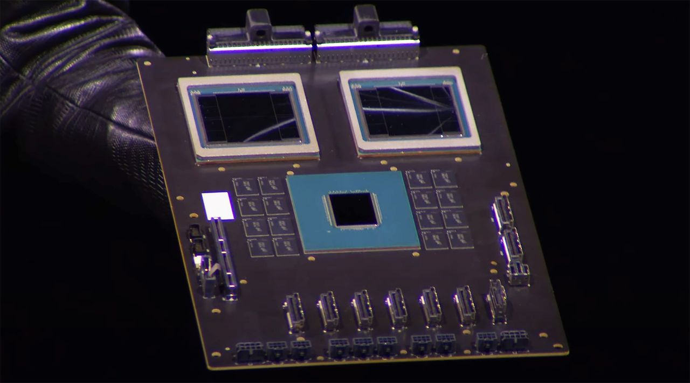
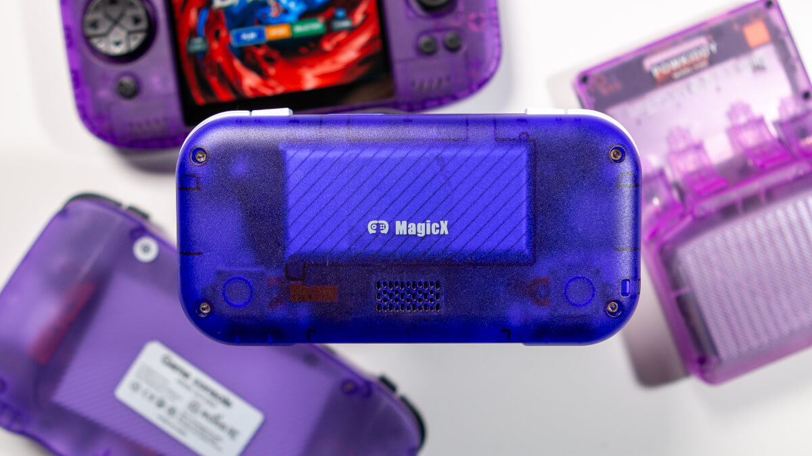
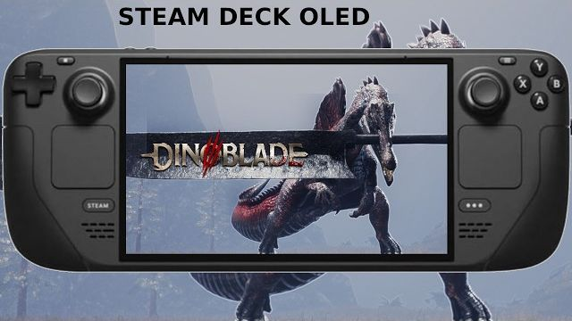
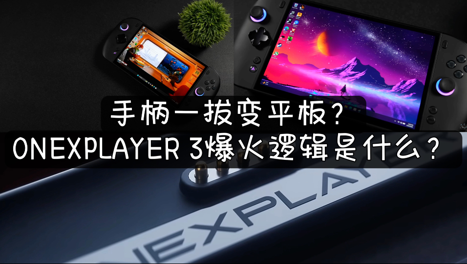
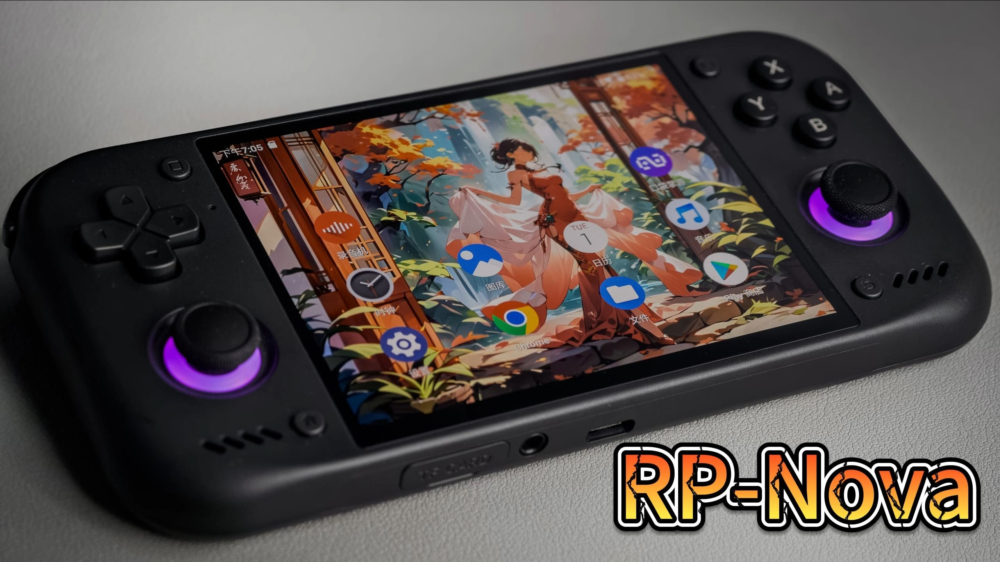
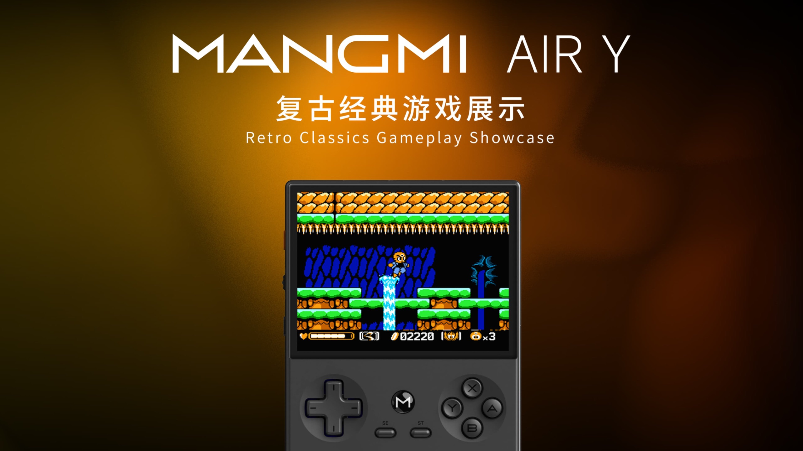
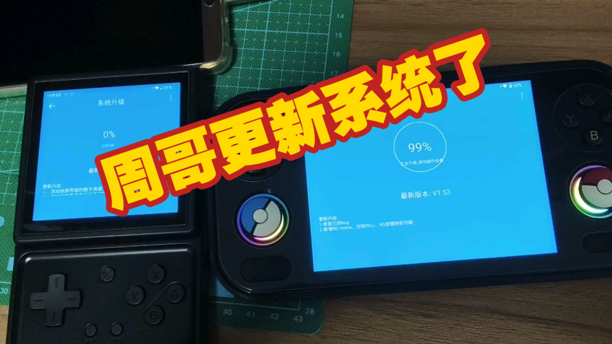
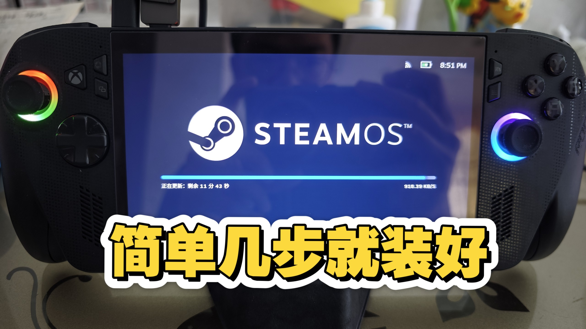

# 游戏设备周报·上 | 2026-W30 (7.22 - 7.26)

> 本期Steam生态与硬件动态密集，Proton更新、愿望单升级及国产万元掌机成焦点。

## 🌍 海外资讯

### Steam Deck

### 🔮 新机爆料

#### 1. Valve 发布 Proton 11.0-2 候选版本供测试

- **新闻内容**：Valve 于7月23日发布 Proton 11.0-2 候选版本，供社区测试。该版本旨在修复 SteamOS/Linux 环境下运行 Windows 游戏的兼容性问题，是 Proton 11.0 系列第二轮重大更新。候选版本已开放下载，Valve 鼓励玩家反馈问题。
- **简要分析**：Proton 持续迭代是 Steam Deck 生态的核心驱动力。快速推出候选版本表明 Valve 正积极响应用户反馈，加速修复问题，对提升 Deck 玩家体验至关重要。
- **来源**: GamingOnLinux

### 🆕 新机发售

#### 1. 《Yet Another Zombie Survivors》1.0 版本发布定于八月

- **新闻内容**：僵尸生存游戏《Yet Another Zombie Survivors》宣布8月20日发布1.0版本。官方放出预告片，介绍新内容包括最终章节、新角色和平衡性调整。游戏在抢先体验阶段获高评价，正式版备受期待。
- **简要分析**：该游戏在 Steam Deck 上表现优异，1.0版本将吸引新玩家，标志开发进入成熟期，有望成为品类标杆。
- **来源**: GamingOnLinux

#### 2. 《MARVEL Tōkon: Fighting Souls》疑似封锁SteamOS/Linux

- **新闻内容**：漫威格斗游戏《MARVEL Tōkon: Fighting Souls》公开 Beta 测试中，因反作弊系统问题，主动封锁 SteamOS/Linux 平台。Steam Deck 玩家无法参与测试，即便通过 Proton 也无法运行。
- **简要分析**：反作弊系统与 Linux 兼容性仍是 Steam Deck 痛点。开发商封锁将导致玩家流失，对需要在线人数的格斗游戏不利。
- **来源**: GamingOnLinux

#### 3. 007 First Light 已移除 Denuvo 反篡改 DRM

- **新闻内容**：5月底发售的《007 First Light》近日移除 Denuvo DRM，从发售到移除不到两个月。移除 DRM 通常提升游戏性能，尤其在 Steam Deck 上帧数有望改善。
- **简要分析**：Denuvo 快速移除对玩家利好，尤其 Steam Deck 用户。反映部分发行商重新评估 Denuvo 价值，在首发保护期后放弃以换取口碑和兼容性。
- **来源**: GamingOnLinux

### 📱 系统更新

#### 1. Valve 对 Steam 愿望单和 Steam 礼物进行了重大升级

- **新闻内容**：Valve 于7月23日升级 Steam 愿望单和礼物系统。愿望单新增“通知偏好”设置，可精细控制折扣提醒；礼物系统引入“定时发送”功能，优化接收与兑换流程。旨在提升购物和社交体验。
- **简要分析**：虽不直接涉及硬件，但平台功能优化影响 Deck 用户。智能愿望单提醒和便捷礼物系统增强 Steam 生态粘性，间接促进 Deck 游戏消费。
- **来源**: GamingOnLinux

### 📋 其他资讯

#### 1. KONAMI公布《METAL GEAR SOLID: MASTER COLLECTION Vol.2》更多平台规格详情

- **新闻内容**：KONAMI 公布《METAL GEAR SOLID: MASTER COLLECTION Vol.2》平台规格，8月27日发售。确认支持 Steam Deck 验证，公布各平台分辨率和帧率目标。合集包含《MGS2》《MGS3》及《MGS Peace Walker》等经典作品。
- **简要分析**：KONAMI 明确支持 Steam Deck 验证，显示对掌机市场重视。良好兼容性提升便携体验，有望带动怀旧游戏销售。
- **来源**: GamingOnLinux

#### 2. 在两个新的Humble Bundles中获取一些精彩的点击式冒险游戏和数字桌游

- **新闻内容**：Humble Bundle 于7月23日推出两个新游戏包，聚焦点击式冒险游戏和数字桌游。冒险包含《Deponia》系列等经典，桌游包收录《Gloomhaven》等热门改编。均提供“自选价格”模式，最低1美元解锁部分游戏。
- **简要分析**：Humble Bundle 是 Steam Deck 玩家扩充游戏库的高性价比选择。两个主题包游戏类型适合掌机触屏或手柄操作，预计受 Deck 用户欢迎。
- **来源**: GamingOnLinux

### Windows 掌机

### 🔮 新机爆料

#### 1. AMD称CUDA为“非事件”，表示企业编程层级已使英伟达技术无关紧要

- **新闻内容**：AMD高管近日公开表示，CUDA并非英伟达的“护城河”，而是一个“非事件”。AMD认为，随着企业编程层级的提升，开发者已在高层次框架（如PyTorch、TensorFlow）上工作，底层CUDA技术已不再关键。这一言论直接挑战了英伟达在AI计算领域的长期优势地位。
- **简要分析**：AMD此番表态意在为自家ROCm生态造势，并降低开发者对CUDA的依赖心理。若企业级用户真能实现跨平台无缝迁移，英伟达的硬件绑定优势将面临实质性削弱。
- **来源**: PC Gamer

#### 2. 《星球大战：零号连队》公布演员阵容，包括来自《克隆人战争》动画系列的粉丝喜爱演员

- **新闻内容**：在近日的发布会上，《星球大战：零号连队》正式公布演员阵容，确认Dee Bradley Baker和Matt Lanter等《克隆人战争》动画系列的知名配音演员加盟。现场粉丝反响热烈，高呼“Lan-ter”口号。该游戏预计登陆PC及主机平台，具体发售日期尚未公布。
- **简要分析**：启用原班配音人马是精准的情怀牌，能有效吸引星战核心粉丝群体。对于一款策略类游戏而言，角色辨识度和情感连接是提升初期销量的关键。
- **来源**: PC Gamer

#### 3. 贝塞斯达表示裁员未影响《上古卷轴6》的路线图，也未遗忘《湮没 重制版》，且并非因阿莎·夏尔马逼迫才透露这些信息

- **新闻内容**：贝塞斯达近日发表声明，澄清近期裁员并未影响《上古卷轴6》的开发路线图，同时强调并未遗忘《上古卷轴4：湮没 重制版》项目。声明还特别指出，这些信息是主动披露，并非受到微软游戏内容负责人阿莎·夏尔马的压力。此前社区对项目进度和内部管理存在广泛猜测。
- **简要分析**：贝塞斯达此举意在稳定玩家信心，避免因裁员传闻导致《上古卷轴6》预期崩盘。但“主动澄清”本身也反映出内部沟通压力，后续实际开发进度仍需观望。
- **来源**: PC Gamer

#### 4. Larian再次提醒我们，它“未参与任何与BG3相关的项目”，以回应Karlach漫画的公布

- **新闻内容**：随着《博德之门3》角色Karlach的衍生漫画公布，Larian Studios再次明确声明，该公司“未参与任何与BG3相关的项目”。这已是Larian多次强调与《博德之门》IP切割的立场，暗示其已完全转向新原创作品的开发。漫画由威世智授权其他团队制作。
- **简要分析**：Larian持续划清界限，表明其不愿被单一IP绑定，正全力投入新IP开发。这对期待Larian继续做D&D游戏的玩家是明确信号，但也凸显了威世智在IP运营上的独立性。
- **来源**: PC Gamer

#### 5. 《龙与地下城》与《魔兽世界》的联动内容遭泄露

- **新闻内容**：据PC Gamer报道，一份疑似《龙与地下城》与《魔兽世界》的联动内容遭泄露。泄露信息显示，此次联动规模可能远超此前与《怪奇物语》《瑞克和莫蒂》的简单套装合作，或将包含完整的战役模组和角色设定。具体内容预计将在未来数月内正式公布。
- **简要分析**：两大奇幻IP的深度联动极具商业想象力，既能吸引D&D桌游玩家尝试魔兽世界观，也能让魔兽粉丝体验TRPG魅力。若成真，将是跨媒体合作的一次标志性事件。
- **来源**: PC Gamer

### 🆕 新机发售

#### 1. 能买5台Switch 2！这款国产掌机起售价高达1.69万元
- **新闻内容**：一款国产Windows掌机近日公布售价，起售价高达1.69万元人民币，价格足以购买约5台任天堂Switch 2。该掌机定位顶级性能，搭载最新旗舰处理器和高刷新率屏幕，瞄准硬核PC游戏玩家和移动工作站用户。目前已在海外平台开启预售，具体型号和配置尚未完全公开。
- **简要分析**：1.69万元的定价将国产掌机推入超高端市场，直接对标高端游戏笔记本和迷你PC。此举虽能树立品牌技术形象，但极小的目标用户群意味着销量难以规模化，更像是一次技术秀。
- **来源**: Google News

#### 2. 《我的世界》Java版系统要求首次提出需8/16 GB内存，但并非现在需求更高，只是微软有一段时间未更新规格说明

- **新闻内容**：微软近日更新了《我的世界》Java版的系统要求，首次建议玩家配备8GB至16GB内存。官方解释称，这并非游戏本身变得更吃配置，而是微软长时间未更新规格说明，此次调整是为了反映当前主流硬件水平。实际游戏运行需求依然较低，老配置仍可流畅运行。
- **简要分析**：这一更新更多是规范层面的“补课”，而非性能门槛提升。对于掌机玩家而言，这意味着《我的世界》Java版在主流Windows掌机上依然能轻松运行，无需担心硬件瓶颈。
- **来源**: PC Gamer

#### 3. 《地狱潜者2》将于10月向玩家免费赠送一辆汽车，但6月已获得该奖励的玩家除外

- **新闻内容**：开发商Arrowhead宣布，《地狱潜者2》将于今年10月向所有玩家免费发放M-103 Supply FR

### 安卓掌机

### 🆕 新机发售

#### 1. Hyperkin 宣布 SupaBoy 更新配色方案

Hyperkin 为其经典 SupaBoy 掌机系列推出全新配色方案。该系列最早可追溯至2012年，是一款运行超任（SNES）卡带的大型掌机。此次更新为复古设备带来更现代的外观选择，核心硬件规格保持不变。新配色版本已公布，具体上市日期和售价暂未披露。此举有助于维持其在复古收藏圈的热度，但在安卓掌机和高性能FPGA设备当道的今天，更多是象征性品牌维护，难以影响主流市场。

#### 2. Game Bub 终于“即将发货”，你仍可预购一台

作为 Analogue Pocket 的强力竞争对手，FPGA 掌机 Game Bub 宣布“即将发货”。该设备采用 FPGA 方案实现硬件级模拟，目前仍有少量预购名额开放。官方表示工厂已开始打包出货，等待已久的玩家即将收到产品。Game Bub 主打低延迟和高兼容性。其即将发货标志着 FPGA 掌机市场不再是 Analogue 一家独大，成功交付将为后续开源FPGA项目树立信心，并为安卓掌机阵营提供差异化竞争思路。

### 📋 其他资讯

#### 3. XBOX将向后兼容功能带到PC

微软XBOX部门经历裁员、工作室重组及主机涨价后，新任CEO决定将XBOX向后兼容技术引入PC平台。未来玩家可在Windows系统上通过官方兼容层运行大量XBOX经典游戏。该功能预计整合进XBOX应用或Windows系统更新中，具体技术细节和上线时间待公布。此举对安卓掌机生态构成间接利好——若PC端向后兼容成熟，基于Windows的掌机（如ROG Ally）将获得更丰富游戏库，并可能推动模拟器社区发展。

#### 4. MagicX Mini Dream 已“官方”发布，但引发诸多疑问

MagicX 正式发布 Mini Dream 掌机，配备3.3英寸OLED屏幕，将推出Linux和安卓双版本，售价区间80至180美元。但官方规格信息模糊，具体芯片型号、电池容量及安卓版本等关键参数未明确，引发社区对其实际性能和定位的广泛讨论。MagicX 试图以OLED屏幕和双系统切入中低端市场，但信息不透明可能削弱玩家信任，明确性能指标和定价策略才是赢得市场的关键。

#### 5. Anbernic RG SP 在首次实机演示中亮相

Anbernic 新款翻盖掌机 RG SP 在首次实机演示中亮相。演示视频展示其流畅运行GBA、Dreamcast、DS游戏，并通过串流游玩《星露谷物语》和《茶杯头》的能力。RG SP 采用翻盖设计，致敬经典GBA SP，具体售价和发售日期尚未公布。其性能足以覆盖大部分复古游戏及轻度串流需求。翻盖设计精准抓住复古玩家情怀痛点，串流功能增加现代实用性，若定价合理，有望成为2026年下半年爆款。

#### 6. Pepsiman Recompiled 让你在浏览器中游玩这款邪典经典游戏

经典PS1邪典游戏《Pepsiman》迎来粉丝重编译项目“Pepsiman Recompiled”。玩家可直接在浏览器中游玩，支持60帧流畅运行、16:9宽屏显示、离线游玩、存档持久化及在线排行榜功能，无需模拟器或下载。该项目展示了社区对冷门经典游戏的修复能力，为安卓掌机玩家提供新游戏来源。该技术路径未来可能应用于更多PS1经典游戏，丰富安卓掌机可玩内容。

### 开源掌机/Linux掌机

### 🔮 新机爆料

#### 1. ANBERNIC 展示 RG SP 复古掌机实机画面及部分规格

ANBERNIC 本周揭晓新款翻盖掌机 RG SP 的更多细节。该机型是 SP 系列的改进版，厚度减少10%，采用新屏幕边框设计。官方实机演示视频展示了多款配色方案及运行复古游戏的模拟性能。芯片型号及售价尚未公布，预计定位中端市场。  
**分析**：轻薄化改进和实机演示表明 ANBERNIC 正打磨经典翻盖设计以应对竞品压力。若定价合理，有望成为复古掌机玩家新宠。  
来源: Retro Dodo

#### 2. Anbernic RG SP 实机视频展示全部配色及模拟能力
另一媒体发布 RG SP 实机视频，全面展示所有配色（经典灰、透明紫等），并重点测试模拟运行 PlayStation、GBA 等平台游戏的能力。视频显示该机运行2D及部分3D游戏流畅，未提及处理器型号。  
**分析**：多角度实机视频集中曝光，说明 ANBERNIC 已进入密集预热期，意在提前锁定用户关注度。  
来源: Google News

### 🆕 新机发售

#### 3. Mattel & Hot Wheels 可拼装《光环》疣猪号开启预购

在圣地亚哥动漫展亮相后，Mattel 与 Hot Wheels 合作推出的《光环》UNSC M12 疣猪号可拼装模型现已登陆亚马逊开启预购。该套装为拼装式玩具，非掌机，但作为热门游戏IP周边硬件受硬核玩家关注。售价及发货日期暂未公布，预计年内出货。  
**分析**：游戏IP衍生拼装模型热销反映玩家对实体收藏品的持续热情，此类跨界产品属于泛游戏硬件生态。  
来源: Retro Dodo

### 📋 其他资讯

#### 4. 任天堂为《大金刚》乐高套装发布诡异广告

任天堂为推广与乐高合作的《大金刚》套装，发布风格诡异的广告片。片中成年玩家在昏暗房间内组装乐高，沉浸于童年回忆，引发热议。该套装面向成年玩家群体，以怀旧情感驱动销售。  
**分析**：任天堂采用非传统、略带惊悚的广告风格，意在突破常规营销，吸引成年核心玩家，反映其在IP衍生品推广上的创新策略。  
来源: Retro Dodo

#### 5. 孩之宝公布首批《塞尔达传说》可动人偶

孩之宝正式公布首批《塞尔达传说》系列可动人偶，包括林克、塞尔达公主和加侬多夫三款6英寸人偶。现已于亚马逊开启预购，细节还原度高，附带多种配件。这是孩之宝获任天堂授权后推出的首批《塞尔达》主题可动玩具，标志该IP在收藏玩具领域进一步拓展。  
**分析**：孩之宝入局将直接与Good Smile等品牌竞争，凭借成熟渠道和品控，有望成为该IP周边市场重要力量，利好收藏玩家。  
来源: Retro Dodo

#### 6. 纪录片首次公开《钻石／珍珠》未公开测试版宝可梦

在近期关于《宝可梦 钻石／珍珠》开发历程的纪录片中，首次公开多只未在正式游戏中出现的测试版宝可梦设计，包括波加曼、小火焰猴、草苗龟的早期废案及完全被取消的概念图。该纪录片由宝可梦公司官方授权制作，纪念游戏发售20周年。  
**分析**：官方授权纪录片公开废案是宝可梦公司常用的怀旧营销手段，既能满足核心粉丝考古需求，又可为新作或重制版预热。  
来源: Retro Dodo

#### 7. 发现1997年E3展会上《班卓熊大冒险》早期片段

一段1997年E3展会的《班卓熊大冒险》早期开发片段被重新发现。该片段由前任天堂高管Ken Lobb提供，展示游戏在Nintendo 64平台上的原始原型，包括未完成关卡设计和角色动作。视频揭示了游戏从早期概念到最终成品的演变过程，对研究Rare工作室历史具有重要价值。  
**分析**：此类早期开发片段的发现常引发复古游戏社区强烈讨论，对开源掌机玩家而言，经典游戏的开发历史也是重要文化内容。  
来源: Retro Dodo

### PlayStation

### 🔮 新机爆料

#### 1. 爆料者预计索尼PS6和Xbox Helix将采用硬件订阅模式
- **新闻内容**：据Google News援引爆料者消息，下一代主机索尼PS6和微软Xbox Helix可能效仿苹果月租方案，推出硬件订阅模式。玩家无需一次性支付高昂主机费用，而是按月付费获得使用权。该模式已在手机行业普及，若主机领域跟进，将改变玩家消费习惯。
- **简要分析**：硬件订阅模式降低入门门槛，但长期成本可能更高。对索尼和微软而言，有助于稳定收入流并绑定用户生态，但需平衡订阅价格与硬件折旧风险。
- **来源**: Google News

#### 2. 消息称索尼微软效仿苹果，为PS6、Xbox Helix推月租计划
- **新闻内容**：另一则来自Google News的消息进一步确认，索尼和微软正计划为PS6和Xbox Helix推出硬件月租服务。该计划类似苹果“年年焕新”或租赁方案，玩家每月支付固定费用即可获得最新主机，并可能捆绑游戏订阅服务。具体定价和推出时间尚未公布，但业界认为这将是下一代主机竞争的关键策略。
- **简要分析**：月租计划将主机从“一次性购买”转向“服务型消费”，可能加速主机迭代周期。但需注意，若订阅费用过高或合约过长，可能引发玩家抵触，尤其是对价格敏感的市场。
- **来源**: Google News

#### 3. 索尼新专利曝光：为PS6手柄研发TMR磁吸摇杆 精度更高更耐用
- **新闻内容**：索尼一项新专利被曝光，显示其正在为PS6手柄研发TMR（隧道磁阻）磁吸摇杆技术。与传统电位器摇杆相比，TMR摇杆通过磁场感应实现非接触式操作，精度更高、寿命更长，且能有效避免漂移问题。该专利表明索尼正致力于解决PS5手柄长期存在的摇杆耐用性痛点。
- **简要分析**：若TMR摇杆量产，将提升手柄可靠性，减少售后投诉。这不仅是技术升级，更是索尼巩固高端手柄市场地位的关键举措，可能迫使微软等竞争对手跟进。
- **来源**: Google News

#### 4. PS5 Pro重磅升级！升级版PSSR超分来袭，生化危机安魂曲率先适配

- **新闻内容**：PS5 Pro即将迎来一次重要系统升级，新版PSSR（PlayStation Spectral Super Resolution）超分辨率技术即将推出。据爆料，该技术将提升画面渲染效率，在4K甚至8K分辨率下实现更高帧率。首款适配游戏为《生化危机：安魂曲》，预计将率先展示PSSR的视觉提升效果。具体更新日期尚未公布。
- **简要分析**：PSSR是PS5 Pro的核心卖点，此次升级将强化其与标准版PS5的差异，吸引追求极致画质的玩家。但技术适配需开发商投入资源，初期支持游戏数量可能有限。
- **来源**: Google News

### 🆕 新机发售

#### 1. 国行PS5 Pro售罄！索尼自家商城都卖完了？
- **新闻内容**：国行版PS5 Pro在索尼官方商城已显示售罄，市场反应热烈。尽管索尼未公布具体销量数据，但官方渠道快速售罄表明玩家对这款升级版主机需求旺盛。PS5 Pro主打更强GPU和PSSR技术，定价较标准版高出约200美元，但依然供不应求。目前第三方渠道仍有少量现货，但价格普遍溢价。
- **简要分析**：国行PS5 Pro售罄反映出中国主机市场的强劲购买力，也说明玩家对高性能主机的接受度在提升。索尼需加快补货节奏，避免因缺货影响后续游戏阵容推广。
- **来源**: Google News

### 📱 系统更新

#### 1. 《007 First Light》首个重大补丁已上线——若在PS5上游玩，内容相当重磅

- **新闻内容**：Eurogamer报道，《007 First Light》的首个重大更新补丁1.1.0版本已正式上线。该补丁针对社区和内部测试人员报告的超过200个问题进行了修复和改进，涵盖性能优化、Bug修复及部分游戏平衡调整。在PS5上游玩时，补丁还特别优化了光线追踪效果和加载速度，提升游戏体验。开发商表示将继续根据玩家反馈推出后续更新。
- **简要分析**：如此大规模的补丁说明《007 First Light》首发时存在较多问题，但开发商积极响应的态度值得肯定。对PS5玩家而言，这次更新让游戏达到“完整版”水准，有助于挽回口碑并延长游戏生命周期。
- **来源**: Eurogamer

### Xbox

### 🔮 新机爆料

#### 1. 《潜行者2》开发者驳斥创始人关于Xbox独占费用超开发成本的声明

- **新闻内容**：本周早些时候，GSC Game World工作室创始人Sergiy Grygorovych在采访中称，微软为将《潜行者2：切尔诺贝利之心》作为限时Xbox独占支付了超过游戏开发成本的巨额费用。但该工作室现任开发者迅速驳斥，强调独占协议未涉及如此高昂支出，双方合作基于正常商业条款。此争议引发对Xbox独占策略真实成本的讨论。
- **简要分析**：创始人说法与开发者矛盾，可能反映内部信息分歧或公关策略调整。若持续发酵，或影响外界对微软独占投入力度的信任，但《潜行者2》热度不减，独占价值仍存。
- **来源**：Eurogamer

### 📱 系统更新

#### 1. 微软Xbox Series X|S预览版系统更新优化游戏下载速度

- **新闻内容**：微软为Xbox Series X|S推送预览版系统更新，重点优化游戏下载速度，使其能充分利用用户网络带宽。此前部分玩家反映下载速度受系统瓶颈限制。此次更新通过改进下载调度算法和网络协议栈，显著提升体验，尤其利好高带宽用户。预览版已可体验，正式版预计近期推送。
- **简要分析**：下载速度优化直击玩家痛点，提升Xbox平台服务竞争力，有助于巩固其在数字游戏分发领域的口碑，尤其在与PS5的体验对比中占据优势。
- **来源**：Google News

### 📋 其他资讯

#### 1. 微软将初代Xbox游戏带到PC平台，支持4倍分辨率提升

- **新闻内容**：微软通过兼容功能将初代Xbox游戏引入PC平台，并支持4倍分辨率提升。该功能依托模拟器或硬件兼容层技术，让经典游戏以更高画质运行。具体支持游戏列表尚未公布，此举被视为打通Xbox与PC生态的重要一步，为老玩家提供怀旧体验，同时扩展Game Pass库吸引力。
- **简要分析**：初代Xbox游戏登陆PC强化了微软跨平台战略，利用兼容性盘活经典IP，或推动更多老游戏重获新生，增强Xbox品牌在PC市场的存在感。
- **来源**：Google News

#### 2. 数据挖掘发现Xbox 360游戏或可通过微软模拟器在PC上运行

- **新闻内容**：数据挖掘结果显示，Xbox 360游戏未来可能通过微软官方模拟器在PC上运行。挖掘出的代码片段显示，微软正开发针对Xbox 360架构的模拟器，支持硬件兼容层技术。若实现，大量Xbox 360经典游戏可在PC上原生运行，无需第三方模拟器。微软尚未官方确认，但数据挖掘者认为项目已进入内部测试阶段。
- **简要分析**：Xbox 360模拟器若落地，将极大丰富PC端Xbox游戏阵容，进一步整合微软游戏生态，既是技术突破，也是对抗Steam等平台差异化竞争的关键举措。
- **来源**：Google News

#### 3. 微软确定XSX|S第三轮涨价，2TB存储版停产

- **新闻内容**：微软确认Xbox Series X|S将进行第三轮涨价，同时2TB存储版主机已停产。具体涨幅和生效日期未公布，此举直接影响硬件市场供应和价格。2TB版停产意味着玩家需选择1TB或更小容量版本，或依赖外接存储扩展。涨价原因与全球供应链成本上升及汇率波动有关，这已是Xbox Series X|S自2023年以来第三次价格调整。
- **简要分析**：连续涨价和停产高配版可能抑制部分玩家购买意愿，尤其在PS5价格相对稳定背景下。微软需通过Game Pass等服务价值抵消硬件涨价负面影响。
- **来源**：Google News

#### 4. 三个月Xbox Game Pass Ultimate订阅可享近半价优惠

- **新闻内容**：Xbox Game Pass Ultimate月度费用已从29.99美元降至22.99美元，但玩家仍可通过第三方平台Eneba获更优惠价格。目前三个月订阅（价值69美元）的数字兑换码仅售39.01美元，相当于近半价。该优惠适用于新老用户，但需注意Eneba为第三方零售商，购买时需确认兑换码有效性。此举为玩家提供低成本体验XGP全服务的机会。
- **简要分析**：半价订阅优惠是微软吸引新用户、提升留存率的常见策略，尤其在硬件涨价背景下。通过第三方渠道促销可间接扩大Game Pass用户基数，但需平衡官方定价体系。
- **来源**：The Verge

### 任天堂 Switch

### 🔮 新机爆料

#### 1. 指南：《斯普拉遁》攻略指南、技巧与窍门

- **新闻内容**：无论你是系列老手还是新手，《斯普拉遁》最新作都充满需掌握的游戏玩法、机制和升级内容。本指南分享在斯普拉哈特群岛生存的提示和技巧，推荐最佳武器和小工具，解析坦克升级和Boss战，并揭示如何解锁所有服装。该指南已发布于Nintendo Life，提供全面攻略支持。
- **简要分析**：指南发布表明《斯普拉遁》社区活跃，深度内容有助于维持游戏热度和延长生命周期。
- **来源**: Nintendo Life

#### 2. 更新 | 《时之笛》重制版或将随《塞尔达传说》Switch 2 Pro手柄一同发售

- **新闻内容**：最新传闻指出，《塞尔达传说：时之笛》重制版可能不会随Switch 2主机首发，而是与一款Switch 2 Pro手柄捆绑发售。消息来自Google News汇总的爆料，任天堂官方尚未确认。若属实，将改变玩家对经典重制版首发平台的预期。
- **简要分析**：将重制版与配件捆绑，可能是任天堂刺激高端配件销售、分散首发游戏阵容压力的策略，但需警惕玩家对“捆绑销售”的抵触。
- **来源**: Google News

#### 3. DayZ 将于下月将僵尸生存多人游戏体验带到 Switch 2

- **新闻内容**：6月任天堂直面会上，官方宣布《DayZ》将登陆Switch 2。eShop列表显示，这款“酷版”游戏将于2026年8月20日发售，售价69.99美元。玩家可在任天堂新主机上体验硬核生存与PvPvE玩法。
- **简要分析**：《DayZ》登陆Switch 2标志着硬核生存类游戏在任天堂平台的重要拓展，69.99美元定价反映3A移植游戏普遍价位，对平台游戏阵容多样性是积极补充。
- **来源**: Nintendo Life

#### 4. 40周年献礼？爆料称全新《塞尔达》Switch 2限定机正在准备
- **新闻内容**：据外媒爆料，为庆祝《塞尔达传说》系列40周年，任天堂正筹备一款全新《塞尔达传说》主题Switch 2限定主机。消息来自Google News（via Switch2），尚无具体设计或发售日期。若属实，将是继《王国之泪》限定机后又一重磅主题硬件。
- **简要分析**：限定主机是任天堂拉动硬件销量的经典手段，结合40周年节点推出，能激发粉丝情怀，为Switch 2销售注入动力，可信度较高。
- **来源**: Google News (via Switch2)

#### 5. 《拔天海拓史》重制版开发者协助了《异度神剑》的Switch 2版开发

- **新闻内容**：任天堂曾邀请外部开发商协助第一方游戏更新，现证实日本开发商Logicalbeat参与了《异度神剑：决定版》Switch 2版本开发。该公司官网及代表董事Domae Yoshiki分享了信息。据RPG Site翻译，Logicalbeat主要负责游戏在4K分辨率和60帧运行方面的增强工作。
- **简要分析**：这表明任天堂在Switch 2次世代升级上广泛借助外部技术力量，Logicalbeat的参与也侧面印证了《拔天海拓史》重制版团队的技术实力，对第三方合作有示范意义。
- **来源**: Nintendo Life

#### 6. 汇总：《最终幻想XIV：永寒之域》扩展预告片公布，新职业与联动突袭系列揭晓

- **新闻内容**：在公布《最终幻想XIV》Switch 2版发售日期的同时，Square Enix分享了第六个扩展包“永寒之域”详情。该扩展包定于2027年1月上线，并确认登陆任天堂新平台。预告片展示了新职业及全新联动突袭系列，为MMO玩家带来更多期待。
- **简要分析**：FF14扩展内容与Switch 2版同步推进，显示Square Enix对任天堂平台的长期承诺。新职业和联动内容有助于维持玩家活跃度，是MMO保持生命力的关键。
- **来源**: Nintendo Life

#### 7. 消息称《最终幻想14》Switch 2版容量117GB，或成Switch 2体积最大游戏

- **新闻内容**：eShop列表显示，《最终幻想14 Online》Switch 2版本所需存储空间高达117.2 GB，极可能成为Switch 2平台上体积最大的游戏。考虑到游戏包含大量高清材质和多年扩展内容，如此体积在意料之中，但对玩家存储空间提出严峻挑战。
- **简要分析**：117GB容量凸显MMO在主机上的存储压力，也暗示Switch 2可能支持更大容量游戏卡带或高速外置存储，将成为未来大型游戏移植的参考基准。
- **来源**: Google News (via Switch 2)

#### 8. 任天堂Switch 2与Switch文件大小——《异度神剑2：任天堂Switch 2版》《最终幻想14》等

- **新闻内容**：eShop列表曝光多款Switch 2及Switch游戏文件大小。其中，《异度神剑2 – 任天堂Switch 2版》容量45.8GB，《最终幻想14 Online》117.2GB，另有《蓝色反射 四重奏》等作品。这些数据为玩家提前规划存储空间提供参考，也展示次世代游戏画质提升后的体积增长趋势。
- **简要分析**：文件大小列表直观反映Switch 2游戏画质升级幅度。45.8GB的《异度神剑2》重制版表明其4K/60帧增强并非小修小补，117GB的FF14则预示未来大型网游在主机端的存储需求将大幅提升。

### 模拟器资讯

### 🔮 新机爆料
#### 1. PS5模拟器进展神速，《恶魔之魂 重制版》已可创建角色
- **新闻内容**：PS5模拟器开发取得突破性进展。据外媒报道，该模拟器已能成功加载《恶魔之魂 重制版》并进入角色创建界面。此前模拟器仅能运行部分2D或低负载游戏，此次实现对PS5首发3A大作的初步图形渲染和输入响应，标志着模拟器从“可启动”迈入“可交互”阶段。开发团队尚未公布具体技术细节，但表示已解决关键的内存映射与GPU指令翻译问题。
- **简要分析**：PS5模拟器若能保持此速度，将打破主机独占壁垒，对索尼硬件生态构成潜在冲击。但距离流畅运行完整游戏仍有数年差距，目前更多是技术验证意义。
- **来源**: 手机网易网

### 📱 系统更新
#### 1. 微软PC端新版向下兼容游戏内置原生Xbox 360模拟器，模组作者微调后即可运行360游戏

- **新闻内容**：微软近日在PC端发布四款初代Xbox向下兼容游戏，游戏包内嵌原生Xbox 360模拟器。游戏文件以Xbox 360格式打包，模拟器先运行360环境，再通过第二层模拟器翻译初代Xbox代码。模组作者发现，只需对配置文件简单调整，就能直接运行未经修改的Xbox 360游戏，包括《战争机器》等经典作品。目前该模拟器仅随特定游戏分发，未开放独立下载。
- **简要分析**：微软此举可能是为未来PC端Xbox完整模拟生态铺路，通过“官方模拟器+模组社区”双轨制，低成本扩充PC游戏库。若开放通用版本，将直接冲击第三方模拟器如Xenia的生存空间。
- **来源**: Tom's Hardware

### 📋 其他资讯
#### 1. “90分vs即时比分滚球”发布全新版本，新增实用功能与工具
- **新闻内容**：据青海日报社旗下中国藏族网通报道，模拟器类工具“90分vs即时比分滚球”发布全新版本。新增功能包括更精准的比分预测模型、多联赛数据整合及自定义提醒，旨在提升体育赛事模拟的实时追踪体验。该工具主要面向体育竞猜与模拟爱好者，已在部分应用商店上架。
- **简要分析**：此类工具反映模拟技术向体育数据领域的跨界应用。“即时比分滚球”功能可能涉及实时数据抓取，需注意合规性风险。
- **来源**: Google News

#### 2. 《圣旨模拟器：一统天下》7月24日第一次更新，开发者请假带娃
- **新闻内容**：国产独立游戏《圣旨模拟器：一统天下》于7月24日发布上线后第一次更新。本次更新修复了部分剧情文本错误，优化了圣旨撰写系统的响应速度。开发者同时公告，因个人家庭原因（带娃）将于次日暂停更新一天，后续计划加入更多历史事件分支与随机臣子互动。该游戏以模拟古代皇帝批阅奏章、颁布圣旨为核心玩法，此前在Steam上获得“特别好评”。
- **简要分析**：开发者坦诚的“请假带娃”公告成为社区话题，体现独立游戏团队的人情味。但频繁临时停更可能影响玩家留存，建议建立稳定更新节奏。
- **来源**: 17173

## 参考资料链接列表

1. [GamingOnLinux] Valve puts up a Proton 11.0-2 Release Candidate for testing: https://www.gamingonlinux.com/2026/07/valve-puts-up-a-proton-11-0-2-release-candidate-for-testing/
2. [GamingOnLinux] Yet Another Zombie Survivors 1.0 release announced for August: https://www.gamingonlinux.com/2026/07/yet-another-zombie-survivors-1-0-release-announced-for-august/
3. [GamingOnLinux] MARVEL Tōkon: Fighting Souls appears to block SteamOS / Linux: https://www.gamingonlinux.com/2026/07/marvel-tokon-fighting-souls-appears-to-block-steamos-linux/
4. [GamingOnLinux] 007 First Light has Denuvo Anti-Tamper DRM removed: https://www.gamingonlinux.com/2026/07/007-first-light-has-denuvo-anti-tamper-drm-removed/
5. [GamingOnLinux] Valve give Steam Wishlist and Steam Gifts a major needed upgrade: https://www.gamingonlinux.com/2026/07/valve-give-steam-wishlist-and-steam-gifts-a-major-needed-upgrade/
6. [GamingOnLinux] KONAMI detail more platform specifications for METAL GEAR SOLID: MASTER COLLECTION Vol.2: https://www.gamingonlinux.com/2026/07/konami-detail-more-platform-specifications-for-metal-gear-solid-master-collection-vol-2/
7. [GamingOnLinux] Get some great point and click adventures, and digital board games in two new Humble Bundles: https://www.gamingonlinux.com/2026/07/get-some-great-point-and-click-adventures-and-digital-board-games-in-two-new-humble-bundles/
8. [PC Gamer] AMD calls CUDA a 'non-event', says companies are programming at levels where the Nvidia tech doesn't really matter: https://www.pcgamer.com/hardware/amd-calls-cuda-a-non-event-says-companies-are-programming-at-levels-where-the-nvidia-tech-doesnt-really-matter/
9. [PC Gamer] Star Wars Zero Company reveals cast, including fan favorite actors from Clone Wars animated series: https://www.pcgamer.com/games/strategy/star-wars-zero-company-reveals-cast-including-fan-favorite-actors-from-clone-wars-animated-series/
10. [PC Gamer] Bethesda says layoffs haven't affected 'the roadmap' for The Elder Scrolls 6, it hasn't forgotten Oblivion Remastered, and it's not telling you this because Asha Sharma forced it to: https://www.pcgamer.com/games/the-elder-scrolls/bethesda-says-layoffs-havent-affected-the-roadmap-for-the-elder-scrolls-6-it-hasnt-forgotten-oblivion-remastered-and-its-not-telling-you-this-because-asha-sharma-forced-it-to/
11. [PC Gamer] Larian once again reminds us it's 'not involved in any BG3-related projects' in response to Karlach comic reveal: https://www.pcgamer.com/games/baldurs-gate/larian-once-again-reminds-us-its-not-involved-in-any-bg3-related-projects-in-response-to-karlach-comic-reveal/
12. [PC Gamer] A crossover between Dungeons & Dragons and World of Warcraft has leaked: https://www.pcgamer.com/games/world-of-warcraft/a-crossover-between-dungeons-and-dragons-and-world-of-warcraft-has-leaked/
13. [Google News] 能买5台Switch 2！这款国产掌机起售价高达1.69万元: https://news.google.com/rss/articles/CBMiYkFVX3lxTE1LTVV0V1U4eHNtWktUbDdnWUVyZ1RTWFVkWWZhSGc0NEhLYmZnem13M3I0eGs3a0tCMW5BNkt3TUl3YmZWZF9OaHlXdWJYVURnNlFZWmhkdmpzOGR3eVZmYTZ3?oc=5
14. [PC Gamer] Minecraft Java Edition system requirements want 8/16 GB RAM for the first time, but it isn't more demanding now, Microsoft just hadn't updated the specs in a while: https://www.pcgamer.com/hardware/minecraft-java-edition-system-requirements-want-8-16-gb-ram-for-the-first-time-but-it-isnt-more-demanding-now-microsoft-just-hadnt-updated-the-specs-in-a-while/
15. [PC Gamer] Helldivers 2 is giving players a free car in October, except for those who already earned it in June: https://www.pcgamer.com/games/action/helldivers-2-is-giving-players-a-free-car-in-october-except-for-those-who-already-earned-it-in-june/
16. [Retro Handhelds] Hyperkin Announces Updated Colorways for the SupaBoy: https://retrohandhelds.gg/hyperkin-announces-updated-colorways-for-the-supaboy/
17. [Retro Handhelds] Game Bub is Finally ‘Shipping Soon’ and You Can Still Pre-order One: https://retrohandhelds.gg/game-bub-is-finally-shipping-soon-and-you-can-still-pre-order-one/
18. [Retro Handhelds] XBOX Brings Backwards Compatibility to PC: https://retrohandhelds.gg/xbox-brings-backwards-compatibility-to-pc/
19. [Retro Handhelds] The MagicX Mini Dream Is ‘Official’, but It Raises Plenty of Questions: https://retrohandhelds.gg/the-magicx-mini-dream-is-official-but-it-raises-plenty-of-questions/
20. [Retro Handhelds] Anbernic RG SP Gets Shown Off in First Gameplay Showcase: https://retrohandhelds.gg/anbernic-rg-sp-gets-shown-off-in-first-gameplay-showcase/
21. [Retro Handhelds] Pepsiman Recompiled Lets You Play This Cult-Classic in Your Browser: https://retrohandhelds.gg/pepsiman-recompiled-lets-you-play-this-cult-classic-in-your-browser/
22. [Retro Dodo (掌机)] Mattel & Hot Wheels Buildable Halo UNSC Warthog Is Up For Pre-Order On Amazon: https://retrododo.com/mattel-hot-wheels-buildable-halo-unsc-warthog-is-up-for-pre-order-on-amazon/
23. [Retro Dodo (掌机)] ANBERNIC Shows Gameplay & A Few Specs Of Upcoming RG SP Retro Handheld: https://retrododo.com/anbernic-shows-gameplay-a-few-specs-of-upcoming-rg-sp-retro-handheld/
24. [Retro Dodo (掌机)] This Gundam Suit LEGO Set Concept Comes Complete With Cockpit & Stands At 16.5" Tall: https://retrododo.com/this-gundam-suit-lego-set-concept-comes-complete-with-cockpit-stands-at-16-5-tall/
25. [Google News] Anbernic RG SP：游戏实机视频展示了其全部配色方案和模拟能力: https://news.google.com/rss/articles/CBMib0FVX3lxTE5HWUYwZEdSdHdteUVqNkpOeS1jMmpaR2VoYk1oOVc5R01VOXUwX21jQ0NGRldvNjFYMEhxZWFRTlBsUlVPNnpTNElUbmxKTUxpLUdjbVpOSlYxOUkzMGswQ3JDUWtmYWF6Yy1LQjdNMA?oc=5
26. [Retro Dodo (掌机)] Nintendo Launches Creepy Advert For Donkey Kong Lego Set: https://retrododo.com/nintendo-launches-creepy-advert-for-donkey-kong-lego-set/
27. [Retro Dodo (掌机)] Hasbro Reveals First Wave Of Legend of Zelda Action Figures: https://retrododo.com/hasbro-reveals-first-wave-of-legend-of-zelda-action-figures/
28. [Retro Dodo (掌机)] Never-Before-Seen Beta Pokémon From Diamond & Pearl Revealed In Documentary: https://retrododo.com/never-before-seen-beta-pokemon-from-diamond-pearl-revealed-in-documentary/
29. [Retro Dodo (掌机)] Discover Early Footage Of Banjo-Kazooie From E3 Back In 1997: https://retrododo.com/discover-early-footage-of-banjo-kazooie-from-e3-back-in-1997/
30. [Google News] 爆料者预计索尼PS6和Xbox Helix将采用硬件订阅模式: https://news.google.com/rss/articles/CBMib0FVX3lxTE5oTzU1U09tdl9VSDV5eHMzMkdRTDdpSlk1dFNrc1I1M3ZBY0hvUm9JUlNjR045Uk1hMzFwN0tlLUx1bDJsc1pSQzZ3TjROcmQ0Q2dtQTJIVUFXT1pjRUZ6TnoySTUzV3dmWXgxNnBYVQ?oc=5
31. [Google News] 消息称索尼微软效仿苹果，为PS6、XBOX Helix推月租计划: https://news.google.com/rss/articles/CBMicEFVX3lxTE5OTDNNRG11c2ItX25mbkhBbUM1eTR1WU9uYVFCalJabmN2Zkh1ZlhxWTM1dUhYajVTRVdZa1BjQWRMeEtSYUlZRFpEY3Z6T3ozRW50MzJ1LWYySjlDQTJ3MHhPVWJZZExRLUl0T295Y2Q?oc=5
32. [Google News] 索尼新专利曝光：为PS6手柄研发TMR磁吸摇杆 精度更高更耐用: https://news.google.com/rss/articles/CBMiUkFVX3lxTE1GWXplUXdnOGhsYjNBVGR6UE1OaWh2QklhS0dpNXRiWTlrWXBKbDU5YXlDOGZWb1RLUGkwLUY2ZEdfNnQwczBESnZHd3dHY1lnT3c?oc=5
33. [Google News] PS5 Pro重磅升级！升级版PSSR超分来袭，生化危机安魂曲率先适配: https://news.google.com/rss/articles/CBMiT0FVX3lxTE95TzNNY25Wek1wRUlELW1rVUtlbmJKRUpGd3hHUE4zeUpfOVkxb0tfcDVQZkU3bzVKSERZZkpqNEJfN2M0ZGNQWm83SzQxU1k?oc=5
34. [Google News] 国行PS5 Pro售罄！索尼自家商城都卖完了？: https://news.google.com/rss/articles/CBMiYkFVX3lxTFBMMEtqNnlMWmZsYWlSZzJJeTZhVVdRYUZrNUxfVDdnZTZ1WHlTMnpEeFVWelNIMWpiX21HNU92X05wcklsNDVyUVhpb2JEeldGTkZBNS1ZcTFjRjNSZmphZTdn?oc=5
35. [Eurogamer] 007 First Light's first major patch is here – and it's a doozy if you're playing on PS5: https://www.eurogamer.net/007-first-light-first-major-patch-details
36. [Eurogamer] Stalker 2 developer refutes claims by studio founder that Xbox paid more than game's development cost to make it exclusive: https://www.eurogamer.net/stalker-2-xbox-timed-exclusivity-claim-refuted
37. [Google News] 游戏下载速度终于能跑满网络带宽，微软 Xbox Series X|S 主机喜提预览版系统更新: https://news.google.com/rss/articles/CBMiZEFVX3lxTFBrb1pKOElkcXhodUt3SXB5czJ1c0RMZW1hMFBJZUxnMTQ5bmNPb1BhRlcyUmxHQ3JPZG8weWdPVV9VMkhwTzU1VGdoNVZiVlZnQUd1cEszbXppOUZIZTNzTXdyeDg?oc=5
38. [Google News] 微软将初代Xbox游戏带到PC平台，并支持4倍分辨率提升: https://news.google.com/rss/articles/CBMiaEFVX3lxTE5WUkdfeDVVUE1qc2tNSVVGRl9KQTVRZXU1U0FjZ0NBTWhrdXB2TEdYNFBfczZIbnZOUEM0bVlVQ2Q2eWFtODFIS05rcDQ2b1VlbGNhSUNCeXVSS2ZmQXBzY0tvSnBBTmY4?oc=5
39. [Google News] 数据挖掘发现后，Xbox 360 游戏或可通过微软模拟器在 PC 上运行: https://news.google.com/rss/articles/CBMia0FVX3lxTE95TFZ1UHMxQXk0ek8tNHgzMWdSUlREVGUzeXFHWVdjX0pKajBVRVhxYlRDYWtaOE1YZ0p4V1Z4eTRDSFRwQmY3T1g5cVp5bzQ5bnZIclkzdWlxQmF3YWNZQnQ3ZEhGdU44QzMw?oc=5
40. [Google News] 微软确定XSX|S第三轮涨价 2TB存储版停产: https://news.google.com/rss/articles/CBMigAFBVV95cUxOTjZlaVFtTXlZYWFkUzlMcml1TWNLZE9vLVVSVU9iUjVfQWc2OEhKaVZHZUh1TnZiVVA0VHpaRW5uNW05enZRazhQdkg4WWsxVzk4ODFfRVFidDgzSWN1X3ZzWWVTZ280eHZqZG9ES0FaR2tZMFF6ZzBiUmdlYVI5ag?oc=5
41. [The Verge] You can get three months of Xbox Game Pass Ultimate for almost half off: https://www.theverge.com/gadgets/970775/xbox-game-pass-ultimate-deal-sale
42. [Nintendo Life] Guide: Splatoon Raiders Guide, Tips & Tricks: https://www.nintendolife.com/guides/splatoon-raiders-guide-tips-tricks
43. [Google News] 更新 | 《时之笛》重制版或将随《塞尔达传说》Switch 2 Pro手柄一同发售，而非主机: https://news.google.com/rss/articles/CBMibEFVX3lxTE9ZRjdFSFlnUWIxMHZfbDUzZDRqTE9ZSmNOX29ZME1uWFA0QlJKQ1dEX1ZoRkpYTjVraUc1RXdLUy15eC1la09OTElraFdhMV9mMmV2VmFnTEZSSF9SdlFEU091dXNtcEdyeVQ0QQ?oc=5
44. [Nintendo Life] DayZ Brings Gritty, Zombie-Survival Multiplayer To Switch 2 Next Month: https://www.nintendolife.com/news/2026/07/dayz-brings-gritty-zombie-survival-multiplayer-to-switch-2-next-month
45. [Google News (via Switch2)] 40周年献礼？爆料称全新《塞尔达》Switch2限定机正在准备: https://news.google.com/rss/articles/CBMiVkFVX3lxTFBscmF4WTV2cFJjckpQVlNqa25VMXFOdWpnVVg5UkdTbzdsZldLeElsMG1rRGx2aGNtUnlybzdybWJWVTdPR3JhTWtPWTB1dDFkVzF1Yktn?oc=5
46. [Nintendo Life] Baten Kaitos Remaster Dev Helped Out With Xenoblade Chronicles' Switch 2 Edition: https://www.nintendolife.com/news/2026/07/baten-kaitos-remaster-dev-helped-out-with-xenoblade-chronicles-switch-2-edition
47. [Nintendo Life] Round Up: Final Fantasy XIV: Evercold Extended Teaser Revealed, New Job And Crossover Raid Series Announced: https://www.nintendolife.com/news/2026/07/round-up-final-fantasy-xiv-evercold-extended-teaser-revealed-new-job-and-crossover-raid-series-announced
48. [Google News (via Switch 2)] 消息称《最终幻想 14》Switch 2 版容量 117GB，或成 Switch 2 体积最大游戏: https://news.google.com/rss/articles/CBMif0FVX3lxTE91bm8xeURXUTlSMXJ4dXRpT3hjb3BKMUREU3FVQW1nQnZQc3B1cDRER1R4XzJOOHhlOHg4TWR3NVRJcUtZdmgtT1hFbU9aVDRsZW5NZ1g4Rm96OVowbmt2ZUFrLXdJNDN5YW81a18yRzZBb2NvUUFhczhucW0wLTg?oc=5
49. [Nintendo Everything] Nintendo Switch 2 and Switch file sizes – Xenoblade Chronicles 2 – Nintendo Switch 2 Edition, Final Fantasy 14, more: https://nintendoeverything.com/nintendo-switch-2-and-switch-file-sizes-xenoblade-2-switch-2-final-fantasy-14-more/
50. [Google News] 全新版本！90分vs即时比分滚球带来更多实用功能与工具- 青海日报社 - 中国藏族网通: https://news.google.com/rss/articles/CBMiVkFVX3lxTE5sZk5MVEJKV0dzNURIS0hxcFdIY1RCQTdndHptOU0tWGkwS1M5bldiNE5IUWxmWHRkZXRUTzRtV0lrVWUwUzBISUJxOFJFemdTLTdoVzJR?oc=5
51. [Google News] PS5模拟器进展神速 《恶魔之魂 重制版》已可创建角色 - 手机网易网: https://news.google.com/rss/articles/CBMiYkFVX3lxTFByZkEzVk1McEpLZWpxVmNXM2RpaFkzY0xEQzZaSGdxZTJVU1ZGaDlRVXk3NTJFNXk2REpSZmlVSTRvUW1UOGRnRGRmcVc1dzZVV3RqMm5GUDRiOTdianZoNDZR?oc=5
52. [Google News] 《圣旨模拟器：一统天下》7-24 第一次更新（明天请假带娃） - 17173: https://news.google.com/rss/articles/CBMiZEFVX3lxTE1kRTM1cEl1OUdaNTJxYWppUFBDcGtsQXdwcFNRd2hxNlZ5WWtwR2hvNFh4VGZleXpxRmJEcjFDVW1kNm4xdEJlVFExQ0lEcDc3X2hEZ0xrQ0oyaDd4VjFxWVZjTUM?oc=5
53. [Tom's Hardware] Microsoft shipped a native Xbox 360 emulator with its new backwards-compatible releases on PC — modders quickly got 360 games running with minor tweaks: https://www.tomshardware.com/video-games/xbox/microsoft-shipped-a-native-xbox-360-emulator-with-its-new-backwards-compatible-releases-on-pc-modders-quickly-got-360-games-running-with-minor-tweaks

## 🇨🇳 国内资讯

### Steam Deck

### 🔮 新机爆料
（无内容，跳过）

### 🆕 新机发售

#### 1. Steam Machine塞回SSD，外国博主：像演动作片

- **新闻内容**：拥有433万订阅的海外硬件博主JayzTwoCents发布视频，展示将SSD重新塞回Steam Machine的过程，形容操作难度“像演动作片”。该视频由B站UP主“阿布看AI”译制，于7月24日发布，播放量52次。Steam Machine是Valve早期客厅游戏机尝试，因市场表现不佳停产，此次DIY修复引发怀旧讨论。
- **简要分析**：Steam Machine虽已退出市场，但硬件社区对其拆解和修复仍有热情，反映出Valve早期硬件探索的遗产价值，也为Steam Deck的迭代提供了历史参照。
- **来源**: B站(via Steam Machine)

#### 2. 这不是Steam Machine！DIY复刻迷你主机

- **新闻内容**：B站UP主“高手苦力怕”发布视频，展示自制的Steam Machine尺寸完全还原的DIY迷你主机。由于官方机型价格昂贵且难以购买，该UP主尝试个人兴趣复刻，但面临选型难、散热差等问题，目前尚未完善模型，计划后续优化后公开。视频播放量达2453次，引发社区对复古硬件的关注。
- **简要分析**：民间复刻Steam Machine反映了玩家对Valve早期硬件的怀念，但散热和选型难题也凸显了官方产品在工程优化上的不可替代性，对第三方DIY方案形成门槛。
- **来源**: B站(via Steam Machine)

### 📱 系统更新

#### 1. Steam Deck OLED / 《这龙带刀》性能测试 / SteamOS 3.8.24

- **新闻内容**：B站UP主“Deck_HQ”发布Steam Deck OLED在SteamOS 3.8.24系统下的《这龙带刀》性能测试视频，涵盖低预设TSR质量、中预设TSR性能、高预设FSR性能、中预设XeSS质量及平衡模式，并测试了“小黄鸭补帧Lossless Scaling”2X功能。视频于7月25日发布，播放量411次，为玩家提供了新系统下的游戏优化参考。
- **简要分析**：SteamOS 3.8.24更新后，通过不同画质预设和补帧技术的对比测试，帮助玩家在OLED机型上找到性能与续航平衡点，体现了Steam Deck持续优化的软件生态。
- **来源**: B站(via Steam Deck 游戏)

#### 2. 《红色沙漠》Steam Deck 全新 1.15.00 补丁测试：能玩吗？

- **新闻内容**：UP主“Deck_HQ”在Steam Deck OLED上测试《红色沙漠》1.15.00补丁，使用SteamOS 3.8.22系统、proton-cachyos 11.0-20260702兼容层，并启用FSR 4.1及“小黄鸭补帧”LSFG技术。测试于7月25日进行，游戏安装在内置固态硬盘，纯净全新安装。视频播放量790次，重点评估补丁后的可玩性。
- **简要分析**：通过第三方兼容层和FSR 4.1等优化手段，《红色沙漠》在Steam Deck上的运行表现持续改善，但依赖特定启动命令和补帧工具，对普通玩家仍有一定操作门槛。
- **来源**: B站(via Steam Deck 游戏)

### 📋 其他资讯

#### 1. Steam Deck需求据称暴跌，销量同比下滑82%

- **新闻内容**：据IGN中国报道，Steam Deck市场需求出现断崖式下跌，销量同比下滑82%。分析认为，涨价是导致需求骤降的主要原因。此前Valve曾上调Steam Deck售价，叠加掌机市场竞争加剧（如ROG Ally、联想Legion Go等竞品涌现），玩家购买意愿显著减弱。该报道发布于7月24日。
- **简要分析**：销量暴跌警示Valve需重新审视定价策略和产品迭代节奏，在Windows掌机阵营快速扩张的背景下，Steam Deck若仅靠系统优势难以维持增长，硬件升级或降价促销迫在眉睫。
- **来源**: IGN中国

#### 2. 榜单公布时间：2026年06月30日 23:59
- **新闻内容**：贴吧steam吧发布一则榜单公布时间通知，显示截止时间为2026年6月30日23:59。该条目未提供具体榜单内容或背景说明，可能为社区活动或数据统计的截止提醒，发布于7月24日。
- **简要分析**：该信息较为简略，缺乏具体事件描述，推测为贴吧社区内部活动的时间节点公告，对Steam Deck整体资讯影响有限。
- **来源**: 贴吧steam吧

### Windows 掌机

### 🆕 新机发售

#### 1. 涨价潮下的翻身之战：G3E掌机OneXPlayer 3半月完全体验报告

- **新闻内容**：B站UP主“博van小哥哥”发布壹号本OneXPlayer 3半月深度体验报告。视频显示，在《怪物猎人》新三部曲中，该掌机18W功耗下流畅运行《荒野》，15W爽玩《世界》，10W下《崛起》可达七八十帧。UP主指出电池容量和屏幕表现是加分项，但个人更偏好体积稍小的机型，并提到当前许多“掌机”电池已外置，而OneXPlayer 3仍保留内置电池。
- **简要分析**：评测以实际帧率数据展示能效比优势，在“涨价潮”背景下性能释放策略对玩家有吸引力，但体积与便携性的权衡仍是用户选择关键痛点。
- **来源**: B站（via 壹号本 掌机）

#### 2. 三合一掌机海外爆火！拆解壹号本的供应链底牌！

- **新闻内容**：B站UP主“Q式浪漫之美食系列”发布视频，深度拆解壹号本ONEXPLAYER 3在海外Indiegogo众筹平台爆火的商业逻辑。视频从硬件设计、用户痛点切入，分析其“手柄一拔变平板，键盘一挂变办公电脑”的三合一形态如何精准击中“久坐与极客场景”，并探讨大湾区供应链如何支撑该产品在海外实现数百万美金众筹成绩。
- **简要分析**：视频揭示国产掌机品牌通过差异化形态和供应链优势成功出海。ONEXPLAYER 3众筹成功证明多功能融合设计在海外市场存在明确需求，为同类产品提供可借鉴的出海策略。
- **来源**: B站（via 壹号本 掌机）

#### 3. 价值$1750美元的壹号本ONEXPLAYER 3 PC游戏掌机开箱+游戏体验

- **新闻内容**：B站UP主“油管科技TV”搬运并翻译海外博主“讲究哥”的开箱视频，展示售价1750美元的壹号本ONEXPLAYER 3旗舰版。视频包含详细开箱过程及多款PC游戏实际运行体验，直观呈现高端掌机在性能、屏幕及做工方面的表现，为国内玩家提供海外视角参考。
- **简要分析**：1750美元定价将ONEXPLAYER 3推向超高端区间。视频通过海外博主第一手体验，帮助国内用户判断其高昂售价是否物有所值，凸显壹号本冲击高端市场的决心。
- **来源**: B站（via AYANEO 掌机）

### 📱 系统更新

#### 1. OneXConsole又双叒叕更新啦！快来看看你的建议有被采纳吗

- **新闻内容**：壹号本官方宣布掌机控制软件OneXConsole迎来超大版本更新。官方在B站动态邀请用户查看建议是否被采纳，暗示本次更新吸纳大量社区反馈。虽具体更新日志未完全公布，但“超大版本”表述预示界面、功能或性能调度将有显著改进，旨在提升用户操控体验。
- **简要分析**：OneXConsole作为核心软件，更新频率和社区参与度直接影响用户体验。此次更新表明品牌方重视软件生态建设，通过采纳用户建议优化产品，有助于增强用户粘性和品牌口碑。
- **来源**: B站动态@壹号本科技

### 📋 其他资讯

#### 1. AMD AI MAX+395处理器，壹号本Mini AI工作站——ONEXStation，性能与颜值双在线

- **新闻内容**：壹号本科技在B站动态展示全新Mini AI工作站ONEXStation。该设备搭载AMD AI MAX+395处理器，配备128GB高频内存，官方宣称可支持千亿级参数本地AI模型部署。设计融合16种RGB幻彩氛围灯，主打简约科技美学桌搭。同时，强悍游戏性能可高帧畅玩全平台主流3A大作，定位为兼顾AI算力与游戏娱乐的超级桌面平台。
- **简要分析**：ONEXStation发布标志壹号本从掌机领域向高性能AI桌面设备跨界。搭载AMD顶级处理器和超大内存，瞄准AI开发者和高端游戏玩家双重需求，展现品牌在算力硬件上的技术储备和多元化布局野心。
- **来源**: B站动态@壹号本科技

#### 2. 「UP主的拍摄间」ROG玩家国度：官号环境太令人羡慕了！

- **新闻内容**：ROG玩家国度官方账号发布探访视频，与UP主“XY大甘蔗”参观华硕ROG总部官方内容拍摄间。视频展示华硕总部展台及官号内容团队办公环境，双方就内容创作进行交流。内容虽非直接产品资讯，但通过展示品牌幕后环境，增强与粉丝互动和品牌透明度。
- **简要分析**：ROG通过开放拍摄间和团队交流，以软性内容拉近与玩家社区距离。这种“幕后探访”形式有助于塑造品牌亲和力，强化其“玩家国度”社区属性，是品牌营销的常规但有效手段。
- **来源**: B站动态@ROG玩家国度

#### 3. rainyyiyi-个人中心
- **新闻内容**：该条目来自贴吧飞行家。

### 安卓掌机

### 🆕 新机发售

#### 1. AYANEO推出KONKR Pocket Advance掌机，主打“掌中图腾 全面觉醒”

- **新闻内容**：7月23日，AYANEO官方公布新款安卓掌机KONKR Pocket Advance，主打“掌中图腾 全面觉醒”概念。设备采用橙色机身，配备大尺寸L1/R1肩键及分离式L2/R2肩键，旨在提升操作手感。官方表示产品“即将到来”，并提供QQ群和官网信息，目前未公布具体规格与售价。
- **简要分析**：AYANEO通过橙色外观和肩键优化，瞄准追求个性与操控感的硬核玩家，有望在细分市场巩固品牌调性。
- **来源**: B站动态@AYANEO官方

#### 2. 安卓Azahar模拟器v2126.0-rc4汉化版发布

- **新闻内容**：7月25日，B站UP主dreamboyn81发布安卓Azahar模拟器v2126.0-rc4汉化版。该版本为3DS模拟器汉化更新，提供百度网盘和123云盘下载链接及永久更新地址。汉化版降低了使用门槛，方便国内用户体验。
- **简要分析**：汉化版持续更新反映国内安卓掌机社区对3DS游戏的高需求，有助于提升掌机游戏库丰富度，对模拟器生态和硬件销售有正面作用。
- **来源**: B站(via 安卓掌机)

### 📋 其他资讯

#### 1. 55寸天玑8300安卓掌机！RG557深度测评

- **新闻内容**：7月22日，B站UP主“粉蒸茼蒿”发布安伯尼克ANBERNIC RG557深度测评视频。该掌机搭载55英寸屏幕和天玑8300处理器，被称作“周哥超大杯旗舰”。视频测试了性能、屏幕素质及游戏兼容性，播放量达336次。RG557定位高端市场。
- **简要分析**：天玑8300使RG557具备较强性能竞争力，55英寸大屏契合沉浸式体验需求，ANBERNIC意在抢占中高端安卓掌机市场份额。
- **来源**: B站(via Anbernic 安卓)

#### 2. Retroid Pocket Nova！4比3性能小钢炮详细评测

- **新闻内容**：7月23日，B站UP主“爱折腾的胖虎”发布Retroid Pocket Nova详细评测视频，播放量达1.5万次。该掌机被描述为“4比3性能小钢炮”，主打复古游戏体验，视频讨论了OLED屏幕饱和度与遮罩问题。Retroid Pocket Nova凭借小巧机身和4:3屏幕比例，成为复古游戏玩家关注焦点。
- **简要分析**：Retroid Pocket Nova精准切入复古游戏市场，4:3屏幕和OLED显示对老游戏画质有加成，遮罩问题讨论体现玩家对细节的追求，有助于品牌建立口碑。
- **来源**: B站(via RP 掌机)

#### 3-5. 无效信息条目（来自贴吧沙雕吧）
- **新闻内容**：三条条目均来自贴吧沙雕吧，标题分别为乱码、URL编码字符串及“白熊119的关注”，无有效游戏硬件新闻内容，无法播报。
- **简要分析**：无有效信息，建议忽略。
- **来源**: 贴吧沙雕吧

### 开源掌机/Linux掌机

### 🆕 新机发售

#### 1. 黄牛扫货，小金刚和APM2等寨机一机难求

- **新闻内容**：AYANEO APM2与老张小金刚等寨机近日开启预售，遭黄牛脚本批量扫货。大量玩家反映准时蹲守仍瞬间售罄，二手平台随即出现加价倒卖。源头厂家缺乏有效反制手段，导致首发机器在闲鱼加价流通。UP主还提到老张通过砍订单、抽资格等操作引发争议，指出寨机在宣发销售专业性上与一线大厂差距明显，且三无产品售后难以保障，建议谨慎购买。
- **简要分析**：黄牛扫货暴露寨机厂商在预售机制和反作弊能力上的短板，若长期无法解决，将消耗核心玩家信任与购买热情，阻碍小众市场健康发展。
- **来源**: B站(via 寨机)

#### 2. MANGMI AIR Y 实机游戏演示

- **新闻内容**：芒米科技官方发布MANGMI AIR Y实机游戏演示视频。该掌机采用4.2英寸4:3比例屏幕，竖版机身设计并配备实体按键，视频直接展示实际游戏运行效果。作为定位明确的竖版开源掌机，其屏幕比例与按键布局旨在优化复古游戏操控体验，目前播放量达3665次，引发玩家关注。
- **简要分析**：MANGMI AIR Y实机演示表明竖版掌机细分市场仍有需求，4:3屏幕与实体按键组合精准切合怀旧玩家对经典游戏还原度的期待，有助于巩固芒米在垂直领域的品牌认知。
- **来源**: B站官号@芒米科技

### 📱 系统更新

#### 1. 周哥掌机更新系统

- **新闻内容**：知名开源掌机制造商周哥（Anbernic）近日为其掌机推送系统更新。UP主“chuai神”发布的视频显示，此次更新涉及系统优化与功能调整，具体内容及适配机型暂未详细披露，但视频播放量达2025次，说明玩家对官方系统维护保持较高关注。周哥掌机通常搭载基于Linux的定制系统，此次更新或旨在修复已知问题并提升兼容性。
- **简要分析**：周哥持续为旧机型提供系统更新，体现对存量用户的支持，有助于延长产品生命周期并维持社区活跃度，在竞争激烈的寨机市场中树立负责任品牌形象。
- **来源**: B站(via 周哥 掌机)

### 📋 其他资讯

#### 1. KTR2教程，KOS系统配置，天马G专属配置包安装，256G整合包

- **新闻内容**：UP主“千夏的铲子”发布KTR2掌机详细教程，涵盖KOS系统配置、天马G专属配置包安装及256G整合包使用方法。教程提供天马G配置包腾讯文档链接和256G整合包百度网盘链接（提取码KTR2，解压密码“跳坑者联盟”），并附KTR掌机高级群与KOS系统内测群QQ群号。该整合包旨在为玩家提供一站式游戏资源与系统配置方案。
- **简要分析**：此类整合包与教程降低新手玩家上手门槛，但依赖第三方分享的资源存在版权与稳定性风险，玩家需注意数据安全与合规性。
- **来源**: B站动态@千夏的铲子

#### 2. 大连存储哥和大家聊聊山寨GBC

- **新闻内容**：UP主“大连存储哥”发布视频，与观众探讨山寨GBC掌机现状。视频播放量171次，内容聚焦于市面上各类仿制GBC的寨机产品，可能涉及硬件做工、游戏兼容性及购买建议等话题。山寨GBC作为怀旧市场低价替代品，一直存在质量参差不齐问题，该视频或为玩家提供选购参考。
- **简要分析**：山寨GBC话题持续讨论反映怀旧玩家对低价入门设备的真实需求，但此类产品普遍缺乏品控与售后，消费者需警惕“电子垃圾”风险。
- **来源**: B站(via 山寨掌机)

#### 3. 42美元山寨PS5掌机拆开后更离谱

- **新闻内容**：UP主“A-电容爆炸”搬运并翻译国外作者Jacob R视频，展示一款售价仅42美元的山寨PS5掌机。拆解后发现内部做工极为简陋，硬件配置与宣传严重不符。该视频为AI翻译并配音，旨在进行网络交流学习，播放量达908次，引发对低价山寨掌机真实性能的讨论。
- **简要分析**：42美元山寨PS5掌机再次印证“一分钱一分货”定律，此类产品以低价吸引眼球但实际体验极差，消费者应理性看待，避免冲动购买。
- **来源**: B站(via 山寨掌机)

#### 4. 霸王小子吧关注帖（标题编码异常）
- **新闻内容**：贴吧霸王小子吧出现一条关注帖，标题因编码问题显示为乱码，推测与用户“荔枝是个好孩子”相关。该帖来自霸王小子吧，发布时间为2026年7月24日，具体内容未提供。霸王小子作为国内寨机品牌之一，其贴吧常为玩家交流产品使用体验与问题反馈的阵地。
- **简要分析**：贴吧

### PlayStation

### 🔮 新机爆料

#### 1. GTA6第三支预告片预测：日期锁定8.6，但别高兴太早

- **新闻内容**：B站UP主“次元裂痕电子羊”发布视频预测，《GTA6》第三支预告片将于2026年8月6日发布。该预测基于对R星过往宣发节奏的分析，但UP主提醒玩家，由于R星常有跳票传统，具体日期仍存在变数，建议保持观望。
- **简要分析**：此类预测反映玩家对《GTA6》信息的高度渴求，但缺乏官方背书，可信度有限。若预测成真，将再次引爆社交媒体，为游戏发售造势。
- **来源**: B站(via PS6 游戏)

#### 2. RDNA 5+30GB内存+TMR摇杆：关于PS6，目前最靠谱的爆料都在这里了

- **新闻内容**：B站UP主“次元裂痕电子羊”汇总近期PS6硬件爆料，核心规格包括：采用AMD下一代RDNA 5架构GPU、配备30GB GDDR7内存，以及搭载TMR（隧道磁阻）摇杆以解决漂移问题。该爆料整合多个技术论坛线索，是目前较详尽的PS6规格预测。
- **简要分析**：RDNA 5与30GB内存组合若属实，PS6将拥有跨世代图形性能，但高昂硬件成本可能推高首发售价。TMR摇杆引入则是对PS5手柄耐用性问题的直接回应。
- **来源**: B站(via PS6 游戏)

### 🆕 新机发售

#### 1. 经典新生！《古墓丽影：亚特兰蒂斯遗迹》官宣2027年2月13日发售，多平台现已开放预购

- **新闻内容**：经典游戏系列迎来新作，《古墓丽影：亚特兰蒂斯遗迹》正式宣布将于2027年2月13日发售，登陆PS5、Xbox Series X|S及PC平台，目前各平台已开启预购。本作将回归系列初代探索与解谜核心，讲述劳拉在亚特兰蒂斯遗迹中的全新冒险。
- **简要分析**：在重启三部曲后，新作选择回归经典风格，意在吸引老玩家并重塑品牌定位。2027年2月发售档期避开年末大作潮，但需面对同期其他作品竞争。
- **来源**: 知乎专栏

### 📋 其他资讯

#### 1. PS5 Pro版《光环：战役进化》实机演示

- **新闻内容**：IGN中国发布PS5 Pro版《光环：战役进化》实机演示视频。该作是《光环：战斗进化》战役模式的现代化重制版，支持高清画质、优化操控及最多4人在线合作，并新增3个任务及扩充武器库。游戏将于7月28日登陆PS5、Xbox Series及PC，并首发加入Game Pass，预购高级版玩家现已可抢先体验。
- **简要分析**：作为Xbox第一方IP登陆PS平台，此举标志微软跨平台策略进一步深化。PS5 Pro版本强化演示，也展示第三方厂商对索尼半代升级主机的适配支持。
- **来源**: IGN中国

#### 2. 优派VX24G26J-4K与华硕ROG XG27UCGR区别对比

- **新闻内容**：知乎专栏发布两款热门4K电竞显示器对比分析：优派VX24G26J-4K与华硕ROG绝神27二代XG27UCGR。文章从分辨率、刷新率、色域覆盖及HDR表现等维度详细对比，为PS5玩家选购外设提供参考。两款显示器均支持HDMI 2.1接口，适配次世代主机高帧率输出需求。
- **简要分析**：随着PS5 Pro对4K/高帧率游戏支持增强，玩家对高性能显示器关注度持续上升。此类对比评测有助于消费者在预算与性能间做出更明智选择。
- **来源**: 知乎专栏

#### 3. Switch 2 的 NAT 类型到底怎么测？我用四种 NAT 实测给你答案

- **新闻内容**：针对任天堂Switch 2网络连接问题，知乎专栏作者通过四种NAT类型（A/B/C/D）进行实测，详细讲解如何检测和优化Switch 2的NAT类型以改善联机体验。文章指出，NAT类型D（严格）会导致无法匹配或频繁掉线，建议玩家通过路由器设置UPnP或DMZ主机提升至类型A或B。
- **简要分析**：该内容主要针对Switch 2，但NAT类型问题同样困扰PS5玩家。此类实用教程填补主机网络设置领域知识空白，对改善多平台玩家在线游戏体验具有普遍参考价值。
- **来源**: 知乎专栏

#### 4. 制霸游戏界30年的 PlayStation 为何突然人人喊打？

- **新闻内容**：B站UP主“大闲者频道”发布视频，深度剖析索尼近期宣布PS5世代将取消实体游戏碟的决策引发的公关危机。视频指出，该消息引发玩家强烈不满，索尼后续模糊回应导致事态升级，被形容为PlayStation史上最大公关灾难。UP主认为，此举将严重影响玩家对PS6的信任与期待。
- **简要分析**：取消实体盘是行业数字化趋势，但索尼激进推进方式忽视核心玩家情感与收藏需求。这一事件警示平台厂商，推行变革时需充分考虑用户反馈，否则将反噬品牌口碑。
- **来源**: B站(via PS6 游戏)

#### 5. 【KOF】6.29 美国EVO 场边赛事：拳皇新浪潮 八强对决！

- **新闻内容**：6月29日，美国EVO格斗大赛场边将举办《拳皇新浪潮》八强对决赛事。该赛事聚焦经典格斗游戏系列最新作，吸引众多职业选手参与。
- **简要分析**：EVO作为全球顶级格斗赛事，场边赛事为《拳皇》系列提供展示舞台，有助于维持其竞技社区活力。
- **来源**: B站

### Xbox

### 🆕 新机发售
#### 1. 微软将为“XBOX 向下兼容功能”引入的初代 XBOX 游戏添加成就系统

- **新闻内容**：微软近期官宣XBOX向下兼容功能拓展至XBOX ON PC平台，首批上线《布林克斯：时间清扫者》《疯狂大乱斗》《血色苍穹：复仇之路》《百战坏松鼠：重装上阵》4款初代XBOX游戏。官方同步宣布将为这4款游戏及后续多款经典初代XBOX游戏引入成就系统，该系统最早于2005年伴随XBOX 360推出，曾支持解锁角色饰品但后续被雪藏。相关成就不会追溯记录，玩家需重新挑战达成条件。
- **简要分析**：此举旨在通过经典游戏重制与成就系统联动，激活老玩家情怀并吸引新用户，巩固XBOX向下兼容生态竞争力。
- **来源**: IT之家

### 📱 系统更新
#### 2. ROG Xbox Ally X Z2 Extreme / 《光环：战役进化》性能测试 / SteamOS 3.8.24

- **新闻内容**：B站UP主Deck_HQ发布ROG Xbox Ally X掌机运行《光环：战役进化》性能测试视频，涵盖多种预设与功耗模式。测试显示，极低预设、720p、17W下帧率尚可；中预设、FSR中、720p、35W下画面流畅度提升；低预设、FSR中、1080p、35W配合《小黄鸭补帧Lossless Scaling》2倍补帧可获得较好体验。测试平台为Z2 Extreme处理器，系统版本SteamOS 3.8.24。
- **简要分析**：该测试为玩家提供ROG Ally X在经典FPS游戏上的实际性能参考，表明35W功耗下配合补帧技术可兼顾画质与流畅度，对掌机游戏体验有指导意义。
- **来源**: B站(via Xbox 掌机)

#### 3. 《漫威斗魂》ROG Xbox Ally X 性能初体验：能玩吗？

- **新闻内容**：UP主Deck_HQ于7月24日测试ROG Xbox Ally X运行《漫威斗魂》性能表现，测试环境为Windows 11 25H2、AMD显卡驱动V32.0.31019.2002，游戏安装于内置固态硬盘。测试显示，35W功耗、低预设、720P、FSR性能模式下，对战模式与剧情战斗均保持可玩帧率，Xbox模式全屏体验流畅。视频详细展示不同战斗场景帧率表现。
- **简要分析**：该测试验证ROG Ally X在格斗游戏上的性能潜力，35W低预设即可满足基本流畅需求，但高画质下需进一步优化，对掌机玩家选购有参考价值。
- **来源**: B站(via Xbox 掌机)

#### 4. Xbox ally win掌机轻松安装官方steamos系统

- **新闻内容**：B站UP主GamerJT发布视频教程，演示如何在Xbox Ally Win掌机上安装官方SteamOS系统。步骤包括：准备U盘和WIN掌机，下载SteamOS镜像文件及Rufus工具制作启动盘；插入U盘重启后按“音量减”进入BIOS，关闭安全启动控制，将启动选项1设为USB启动；保存重启后等待系统安装完成。整个过程无需复杂操作，适合新手。
- **简要分析**：该教程降低掌机用户安装SteamOS门槛，使Xbox Ally Win兼容更多游戏生态，提升设备灵活性，但需注意驱动兼容性及系统稳定性。
- **来源**: B站(via Xbox 掌机)

### 📋 其他资讯
#### 5. 如何评价荣耀最新的 logo？为何此时更换logo？
- **新闻内容**：知乎用户讨论荣耀最新logo更换事件，分析其设计变化及更换时机。有观点认为，荣耀在品牌独立后需重塑形象，新logo更简洁现代，旨在强化高端定位并适应全球市场。时间点选择可能与新品发布或品牌战略调整有关，但具体原因尚未官方确认。
- **简要分析**：该话题反映科技品牌视觉升级趋势，对Xbox等游戏硬件品牌在品牌形象迭代上有一定参考意义。
- **来源**: 知乎

#### 6. 黄仁勋反对美国封禁中国 AI 模型，美方为何封禁？禁令能否落地？
- **新闻内容**：英伟达CEO黄仁勋公开反对美国封禁中国AI模型，认为此举将损害全球AI创新与合作。知乎用户讨论美方封禁动机，包括技术安全、地缘竞争等因素，并质疑禁令实际落地难度，指出中国AI模型已具备自主能力，封禁可能加速技术脱钩。
- **简要分析**：该事件涉及AI产业政策，对Xbox等依赖AI技术的游戏设备厂商有潜在影响，可能影响芯片供应及AI功能开发，需关注后续政策走向。
- **来源**: 知乎

#### 7. 2026最新！Mac 安装Windows零成本教程，新手也能上手
- **新闻内容**：知乎专栏发布Mac安装Windows的零成本教程，介绍使用Boot Camp或虚拟机软件（如VirtualBox）的方法，无需额外付费。教程详细说明系统分区、驱动安装等步骤，适合新手操作，但强调需注意硬件兼容性及性能损耗。
- **简要分析**：该教程为Mac用户提供跨平台游戏可能，间接扩展Xbox Game Pass等服务的覆盖范围，但对Xbox硬件生态影响有限，更多是用户侧便利性提升。
- **来源**: 知乎专栏

#### 8. 美国五大科技巨头AI隐性债务被曝达1.65万亿美元，四年内增长8倍，巨额表外负债会成为定时炸弹吗？

- **新闻内容**：知乎用户讨论美国五大科技巨头（如微软、谷歌等）AI隐性债务问题，据曝料其总额达1.65万亿美元，四年内增长8倍。这些债务主要

### 任天堂 Switch

### 🔮 新机爆料

#### 1. 《最终幻想 10/10-2 HD Remaster》Switch2版宣传片

- **新闻内容**：近日，B站用户上传了《最终幻想 10/10-2 HD Remaster》Switch2版宣传片，展示游戏在新平台运行画面，暗示该经典RPG高清复刻作品或将登陆任天堂新主机。Square Enix官方尚未正式公布，但宣传片引发玩家对Switch2兼容性与首发阵容的广泛讨论。
- **简要分析**：若消息属实，这将是Switch2吸引JRPG玩家的关键筹码。FF10系列人气极高，其登陆新平台有助于巩固任天堂与第三方大厂合作，提升新主机初期软件阵容吸引力。
- **来源**: Bilibili

#### 2. Claude Opus 5 系统提示词泄露，20万提示词泄露《神鬼寓言5》原罪

- **新闻内容**：据知乎专栏爆料，AI模型Claude Opus 5的系统提示词遭泄露，包含20万字符内容，涉及游戏《神鬼寓言5》的“原罪”设定细节。泄露文件详细描述了世界观、角色动机及剧情分支，疑似为开发团队用于AI生成对话或叙事的内部资料。微软和Playground Games尚未置评。
- **简要分析**：此次泄露反映AI工具在3A游戏开发中的深度介入。对任天堂而言，如何利用AI提升开发效率同时保护核心创意，将成为未来竞争中的潜在课题。
- **来源**: 知乎专栏

### 🆕 新机发售

#### 1. 打造高人气商圈！多人联机《一起来开大商场》现已发售！

- **新闻内容**：多人联机模拟经营游戏《一起来开大商场》于7月24日正式发售。玩家可单人或组队，从零打造世纪大商场，体验选址、招商到管理的完整经营流程。游戏已在Steam上线，支持中文，旨在提供低门槛创业模拟体验。
- **简要分析**：游戏主打轻松社交与经营乐趣，契合国内玩家对“解压+联机”品类的需求。若登陆Switch，便携性和本地多人特性将进一步放大优势。
- **来源**: B站动态@游民星空官方

#### 2. 打造世界级电商！模拟经营游戏《电商大亨》7.28发售！

- **新闻内容**：模拟经营游戏《电商大亨》将于7月28日正式发售。玩家从陋室和电脑起步，经历洞察市场、发出快递、组建团队、驾驭舆论、策划营销，最终缔造商业帝国。游戏强调策略决策与沉浸式体验，已在Steam开放愿望单，支持中文。
- **简要分析**：游戏切中“白手起家”创业幻想，题材新颖。节奏可控、可随时中断的经营类游戏天然适合Switch掌机模式，未来移植潜力较大。
- **来源**: B站动态@游民星空官方

#### 3. 《火焰纹章：万缕千丝》米卡埃拉实机演示

- **新闻内容**：任天堂《火焰纹章》系列新作《火焰纹章：万缕千丝》发布米卡埃拉角色实机演示。该作确认于2026年9月17日在Switch2独占发售，是系列首次登陆新主机。演示展示战斗技能与剧情互动，画面较前代显著提升，战斗系统疑似融合更多策略元素。
- **简要分析**：作为Switch2独占首发作品，该作肩负拉动新主机销量重任。米卡埃拉作为高人气角色回归，既能吸引老玩家，也能通过实机演示展现新机性能，是任天堂巩固核心粉丝的关键一步。
- **来源**: B站动态@游民星空官方

#### 4. 大型社死现场：不要放过任何“异常”旅客

- **新闻内容**：模拟游戏《机场安检模拟器》现已登陆Steam。玩家扮演安检员，通过扫描行李、检查身份、搜寻暗袋找出违禁品，没收后变现升级工位。游戏主打解压找茬玩法，包含大量“异常”物品（如假肢、雷管等），支持中文。
- **简要分析**：游戏凭借独特“社死”题材和简单玩法，在直播和短视频平台具备传播潜力。若推出Switch版，触屏操作和便携属性将提升沉浸感，适合作为休闲填充作品。
- **来源**: B站动态@游民星空官方

#### 5. 【掌机周报特别篇】老张GKD小金刚发售风波

- **新闻内容**：B站UP主“Xigua今天打游戏了吗”发布掌机周报特别篇，回顾国产掌机“老张GKD小金刚”从发布到发售遭遇的多次风波，包括跳票、品控争议、渠道纠纷等，过程被形容为“三顾茅庐 七擒孟获”。目前该掌机已陆续发货，但玩家反馈存在分歧。
- **简要分析**：国产掌机市场竞争激烈，GKD小金刚的波折反映小厂在供应链和品控上的普遍困境。对Switch玩家而言，该事件可作为行业观察参考。
- **来源**: B站动态@游民星空官方

### 模拟器资讯

### 🔮 新机爆料

#### 1. Switch Drastic NDS模拟器1.0.4汉化版【i大汉化】

- **新闻内容**：UP主“高达未来”于7月25日在B站发布Switch平台Drastic NDS模拟器1.0.4汉化版，由i大完成汉化，百度网盘分享，提取码bd6w。Drastic是NDS平台公认的高性能模拟器，汉化版降低了国内玩家使用门槛。
- **简要分析**：汉化版将加速NDS模拟器在Switch上的普及，利好不熟悉英文界面的玩家，有望带动经典NDS游戏怀旧热潮。
- **来源**: B站(via NDS 模拟器)

#### 2. 小宇4K【大商场模拟器】一起开商场 最高画质 全流程通关

- **新闻内容**：UP主“小宇热游解说”于7月25日发布PS4模拟器运行《大商场模拟器》的4K全流程通关视频，播放量7559次。视频展示最高画质流畅运行完整过程，附带直播信息，证明PS4模拟器在商业模拟类游戏上兼容性已相当成熟。
- **简要分析**：4K全流程演示验证了PS4模拟器在高负载场景下的稳定性，对模拟器社区和期待PC端体验PS4独占游戏的玩家是积极信号。
- **来源**: B站(via PS4 模拟器)

### 📱 系统更新

#### 1. 【经典老游】《龙之剑:觉醒》“游戏是不错但这视频录得真的辛苦😵”

- **新闻内容**：UP主“YOQA”于7月24日分享Mobox模拟器运行《龙之剑:觉醒》测试视频。测试平台为骁龙8EGen5，分辨率从960x544到1920x1080，使用p11 arm64x、极限模式、dxvk-2.7.1及dxvk-3.0-1等设置。游戏在低画质下可运行，展示Mobox在高端安卓设备上的潜力。
- **简要分析**：Mobox通过DXVK等组件优化，逐步缩小安卓设备运行PC游戏的性能差距，但复杂设置对普通用户仍存在较高门槛。
- **来源**: B站(via Mobox 模拟器)

#### 2. PS3模拟器-Rpcs3 v0.0.41-19607+4.93固件+Debug(侦错菜单)+测试《Razing Storm》

- **新闻内容**：UP主“Leon2023X”于7月25日发布PS3模拟器Rpcs3最新版v0.0.41-19607，集成4.93固件及Debug侦错菜单，视频中测试《Razing Storm》，关注即可获取资源。新版在调试功能和固件兼容性上有所更新，为开发者提供更便捷的调试工具。
- **简要分析**：Rpcs3持续迭代，Debug菜单有助于开发者快速定位问题，推动PS3模拟器向更广泛游戏兼容性迈进。
- **来源**: B站(via PS4 模拟器)

#### 3. batocera 系统 hbmame 游戏名修复包

- **新闻内容**：UP主“大帅plus”于7月25日发布针对Batocera系统的hbmame游戏名修复包，一键三连并关注后私信获取。修复包解决Batocera系统中hbmame游戏列表显示乱码或名称错误问题，提升复古游戏玩家浏览体验。
- **简要分析**：此类社区修复包是Batocera生态的重要补充，解决官方系统在非英语游戏名支持上的短板，增强系统易用性。
- **来源**: B站(via Batocera 系统)

#### 4. 乌班图Batocera游戏系统整合包下载 懒人包 插上U盘即玩复古掌机主机街机游戏！附教程

- **新闻内容**：UP主“Ryan_余”于7月26日发布基于乌班图的Batocera游戏系统整合包，支持FC《魂斗罗》、街机《拳皇》及PS、PSP等平台游戏，系统装在U盘即插即玩，不影响原有Windows系统。下载链接为夸克网盘，附详细教程。
- **简要分析**：Batocera整合包降低复古游戏入门硬件和软件门槛，插U盘即玩特性对怀旧玩家极具吸引力，有望扩大复古游戏用户群体。
- **来源**: B站(via Batocera 系统)

### 📋 其他资讯

#### 1. RP NOVA新手教程，天马G配置和256G整合包，PSV、NS模拟器配置教程

- **新闻内容**：UP主“千夏的铲子”于7月25日在B站动态发布RP NOVA天马G配置包及256G整合包，包含PSV、NS模拟器详细配置教程，百度网盘下载，提取码NOVA，解压密码“跳坑者联盟”。这是一站式解决多平台模拟器配置的实用资源包。
- **简要分析**：整合包和教程发布解决新手在PSV和NS模拟器配置上的痛点，有助于提升社区活跃度，推动天马

### 游戏外设

### 🔮 新机爆料

#### 1. 努比亚红魔8Pro磁吸散热背夹

B站UP主“拾光小筑56586”发布视频，展示努比亚红魔8Pro磁吸散热背夹。该产品采用半导体降温技术，主打低噪音运行，适用于手机及平板游戏直播场景。视频播放量较低，但作为红魔游戏手机生态配件，其磁吸设计和散热性能值得关注。分析指出，红魔持续深耕游戏散热细分市场，磁吸散热背夹补全了其外设矩阵，对提升手游直播体验有直接帮助，但需关注量产后的噪音控制表现。来源：B站（via 红魔游戏手机）

### 🆕 新机发售

#### 1. 小鸡观星者手柄开箱
盖世小鸡官方发布“观星者”手柄开箱视频。产品采用白色外观，配备双摇杆、方向键及ABXY按键，支持多平台连接。包装盒标注全球代言人为格斗游戏冠军曾卓君（XiaoHai），主打高性能与舒适握感，定位电竞玩家。分析认为，盖世小鸡签约XiaoHai意在强化品牌在格斗游戏及硬核电竞领域的专业形象，多平台兼容性符合跨平台游戏趋势。来源：B站动态@盖世小鸡

#### 2. 易速马拉伸手柄测评
B站UP主“玩具窝”发布易速马拉伸手柄测评视频，播放量3286次。该手柄支持横拉、上拉、下拉多种拉伸形态，适配不同尺寸手机，采用蓝牙连接。视频展示其便携性和多角度调节功能，适合移动游戏场景。分析指出，拉伸手柄市场持续细分，易速马通过多形态拉伸设计差异化竞争，但需解决拉伸结构耐用性和蓝牙延迟问题。来源：B站（via 拉伸手柄）

#### 3. 福袋宝森Pro2手柄
B站UP主“欢乐多EX”发布视频，介绍福袋宝森Pro2手柄。该手柄兼容Switch及Switch 2平台，支持NS2涂击队游戏。视频提及“大表哥1/128”“双点博物馆”等游戏捆绑销售，并提供福袋优惠（减50元），国内现货发售。分析认为，第三方手柄厂商正加速布局Switch 2配件市场，福袋宝森Pro2通过捆绑热门游戏和福袋促销吸引用户，但产品品质和兼容性稳定性仍需市场检验。来源：B站（via Switch Pro手柄）

#### 4. Skull&Co斯普拉遁限定保护壳

B站UP主“更生_Su”开箱Skull&Co推出的斯普拉遁（Splatoon）涂击队限定保护壳，适用于Switch 2。该保护壳提供分体壳和一体壳两种形态，细节丰富，包括涂鸦图案、按键开孔优化等。视频播放量1278次，并附带抽奖活动。分析指出，Skull&Co作为知名Switch配件品牌，其限定保护壳精准捕捉任天堂IP粉丝的收藏需求。Switch 2配件生态丰富度逐步提升，第三方厂商的创意设计将成为差异化竞争关键。来源：B站（via Switch配件）

#### 5. 盖世小鸡九尾狐8K开箱

B站UP主“落苏团子”发布盖世小鸡九尾狐8K手柄开箱视频。该手柄型号暗示支持8000Hz超高轮询率，主打低延迟竞技性能。视频播放量仅3次，但作为盖世小鸡高端产品线新成员，其技术规格值得关注。分析认为，九尾狐8K瞄准硬核电竞玩家，超高轮询率是当前手柄行业技术高地。若实际体验匹配宣传，有望在PC和移动端电竞外设市场建立技术壁垒。来源：B站（via 盖世小鸡手柄）

### 📋 其他资讯

（无条目）

---

### 参考资料链接列表
- https://www.bilibili.com/video/BV1mF376xECb
- https://t.bilibili.com/1228223645809115172
- https://www.bilibili.com/video/BV1Msgx6EEQj
- https://www.bilibili.com/video/BV1Qjgv6yEjY
- https://www.bilibili.com/video/BV1Ah3j6jEwT
- https://www.bilibili.com/video/BV12ng969E2i

## 参考资料链接列表

1. [B站(via Steam Machine)] Steam Machine塞回SSD 外国博主：像演动作片: https://www.bilibili.com/video/BV1Ng3M6ZEAx
2. [B站(via Steam Machine)] 这不是SteamMachine！DIY复刻迷你主机: https://www.bilibili.com/video/BV12P3J6hEUa
3. [B站(via Steam Deck 游戏)] Steam Deck OLED / 《这龙带刀》性能测试 / SteamOS 3.8.24: https://www.bilibili.com/video/BV12H3T6hE2s
4. [B站(via Steam Deck 游戏)] 《红色沙漠》Steam Deck 全新 1.15.00 补丁测试：能玩吗？: https://www.bilibili.com/video/BV1qi356NENW
5. [IGN中国] Steam Deck需求据称暴跌，销量同比下滑82%: https://www.ign.com.cn/steam-deck/61541/steam-deckxu-qiu-ju-cheng-bao-die-xiao-liang-tong-bi-xia-hua-82
6. [贴吧steam吧] 榜单公布时间：2026年06月30日 23:59: https://news.google.com/rss/articles/CBMid0FVX3lxTE5DUnJYdFdZVFU5UFNFemVhdS1rdHloZ2x0SDBTMTdFYmxRV240MDAyVERPSDFzOXpRZFhsR0NLTFd6cW5ubjNtT3NUMjdkZzZEUjNHSlJfekl6bWVJTUpmYmFBdGRWemFJaUQ5ajRwUjM2Ul9scE5j?oc=5
7. [B站(via 壹号本 掌机)] 涨价潮下的翻身之战：G3E掌机OneXPlayer 3半月完全体验报告【硬核开箱148】: https://www.bilibili.com/video/BV1Jsg46TEtH
8. [B站(via 壹号本 掌机)] 三合一掌机海外爆火！拆解壹号本的供应链底牌！: https://www.bilibili.com/video/BV1He3T6pE61
9. [B站(via AYANEO 掌机)] 价值 $1750 美元的壹号本 ONEXPLAYER 3  PC游戏掌机开箱+游戏体验｜作者 讲究哥: https://www.bilibili.com/video/BV1GY3K6NE8P
10. [B站动态@壹号本科技] OneXConsole 又双叒叕更新啦!快来看看你的建议有被采纳吗: https://t.bilibili.com/1228794446996308001
11. [B站动态@壹号本科技] AMD AI MAX+395处理器，壹号本Mini AI 工作站——ONEXStation，性能与颜值双在线: https://t.bilibili.com/1228052276611907623
12. [B站动态@ROG玩家国度] 「UP主的拍摄间」ROG玩家国度：官号环境太令人羡慕了！: https://t.bilibili.com/1228199250433671209
13. [贴吧飞行家吧] rainyyiyi-%E4%B8%AA%E4%BA%BA%E4%B8%AD%E5%BF%83: https://news.google.com/rss/articles/CBMifkFVX3lxTE1FNXhsSE9nUUthOFg2cVptVW9rYW5BWkRoSHlxNmhzTmxmUTBtdnluaHhMQmxHMFo2SHpQNFNQVlR1NnFPM1hLeE9XSWxtb2VxZUsxMlA3eFFxaHIzYWFXdDd2S2ZaVlo5NktFdUljaFRhUnRORXo1a0gtSm55UQ?oc=5
14. [B站动态@AYANEO官方] AYANEO推出KONKR Pocket Advance掌机，主打“掌中图腾 全面觉醒”概念。设备采用橙色机身设计，配备贴合指尖的大尺寸L1/R1肩键及分离式L...: https://t.bilibili.com/1228186374077677574
15. [B站(via 安卓掌机)] 安卓Azahar模拟器 v2126.0-rc4汉化版发布: https://www.bilibili.com/video/BV1Hm3L61Ek5
16. [B站(via Anbernic 安卓)] 55寸天玑8300安卓掌机！周哥超大杯旗舰做的如何？RG557深度测评_安伯尼克ANBERNIC开源机#掌机#游戏机#数码产品#安伯尼克-75020869210: https://www.bilibili.com/video/BV1f2gU6hEhz
17. [B站(via RP 掌机)] 王炸！Retroid pocket Nova！RP新掌机4比3性能小钢炮复古神器 详细评测，一起来聊聊Oled屏的饱和度与遮罩问题: https://www.bilibili.com/video/BV1vEgD6bEYu
18. [贴吧沙雕吧] %E6%B2%90%E6%B6%9F%E6%A9%99%E6%BC%AA的粉丝: https://news.google.com/rss/articles/CBMinAFBVV95cUxOTEw5QTN4N0czUXNoZnR5bXpTejZJcUJweEhaMXc1S3lONjNQQXZCSkc0UlhwMGd6SDhlWkJ3R1NVQXUwOTJzYTBGbWFuXzhLdG0yTWJfYmU5dWVON3NFVGxrLUVEampNMF9UNUFzR0tXVnZrajEzWmtLT3dQalVGU3VfXzl0WGF6ZldLVmxXSjA2TWMxeFJ6YWZjSTg?oc=5
19. [贴吧沙雕吧] Btssqsb%E7%9A%84%E7%B2%89%E4%B8%9D+-+%E7%99%BE%E5%BA%A6%E8%B4%B4%E5%90%A7: https://news.google.com/rss/articles/CBMidkFVX3lxTFAwLTAyY1pRNU5hMU15amdQLXdkb3BNOV9wWFl5aHpFOU0tdi0ybi1kYi00bGhBYnRhM29lSTJrSGZfSm1oTGJNWXNIZDFyamdaQzFYajZvamNpYVVxWmQyNmR1QlBmZUdGQlV2ZGpMSjk5LVFlTlE?oc=5
20. [贴吧沙雕吧] %E7%99%BD%E7%86%8A119的关注: https://news.google.com/rss/articles/CBMijgFBVV95cUxPSDRoa1pBbVR1cTM1OUF5NWdscHNpNXU4dThOZEN1WEl1emtJemMtbVhuMTl2UXprS01JRVNWWG5kMVFaMkhQWHk0Ylh1VUxmVy04cmJBN3dNbkRrbTgyRkFvelVKLUZRejNtLXREbVpBLVpZOExwQ2F6aG0tX0xjMTE3SXlqT2ZDYUEwRlh3?oc=5
21. [B站(via 寨机)] 黄牛扫货，小金刚和APM2等一票寨机一机难求: https://www.bilibili.com/video/BV1cUgX62E8a
22. [B站动态@千夏的铲子] KTR2教程，KOS系统配置，天马G专属配置包安装，256G整合包: https://t.bilibili.com/1228224981576450064
23. [B站(via 山寨掌机)] 大连存储哥和大家聊聊山寨gbc: https://www.bilibili.com/video/BV1gHgU6UERz
24. [B站(via 周哥 掌机)] 周哥掌机更新系统了: https://www.bilibili.com/video/BV1iHKE6aEtk
25. [B站(via 山寨掌机)] 42美元山寨PS5掌机拆开后更离谱: https://www.bilibili.com/video/BV1vRgt6vE6y
26. [贴吧霸王小子吧] E8%8D%94%E6%9E%9D%E6%98%AF%E4%B8%AA%E5%A5%BD%E5%AD%A9%E5%AD%90的关注: https://news.google.com/rss/articles/CBMixgFBVV95cUxPeVVjSk11bmZYNm11WGN0TDJJbTZHQ3JYLUpvSjlhTVRjQXIwUGp3TkZMTmVRN2lPTEczcnBYTVUzNk40N2t6WVBrZVVkYWFEMUc5MDBkYUlqU2Y3MGVHTVp2NEVnLVVjbVcxdHJBWWxWUGg0alVIMU9rdzZySHVUcHNhUUJicVBUWm5JNFJ1eW44SmFrdERscmRpenV4OTFyZ0FLTXN0eVNwaV9pYy1jaTc1MWdibkMzeTRXT1UyM19hNWVnaHc?oc=5
27. [B站官号@芒米科技] MANGMI AIR Y 实机游戏演示: https://www.bilibili.com/video/BV1Sdgh6aE4q
28. [B站(via 吹米 掌机)] 400价位，三款适合入门的开源掌机: https://www.bilibili.com/video/BV16Xga6pEjm
29. [B站(via PS6 游戏)] GTA6第三支预告片预测：日期锁定8.6，但别高兴太早: https://www.bilibili.com/video/BV1TE3j6sEfn
30. [B站(via PS6 游戏)] RDNA 5+30GB内存+TMR摇杆：关于PS6，目前最靠谱的爆料都在这里了: https://www.bilibili.com/video/BV1TK3J6cEL4
31. [知乎专栏] 经典新生！《古墓丽影：亚特兰蒂斯遗迹》官宣2027年2月13日发售，多平台现已开放预购: https://news.google.com/rss/articles/CBMiXEFVX3lxTE1xQlVUXzZ2eGlaR3ZyTmFGcTJYa3JILXN3VllKWmFSMDUtdEVUcWU2SVg0MFQ3VHlZbHdNaWQzRnZ4bHdiT2ZNYjBRZ1VLMEZ2bFhlTWNldmJHUXlP?oc=5
32. [IGN中国] PS5 Pro版《光环：战役进化》实机演示: https://www.ign.com.cn/halo-campaign-evolved/61530/ps5-proban-guang-huan-zhan-yi-jin-hua-shi-ji-yan-shi
33. [知乎专栏] 优派VX24G26J-4K和华硕ROG XG27UCGR区别对比：优派VX24G26J-4K和华硕ROG绝神27二代XG27UCGR哪个好？: https://news.google.com/rss/articles/CBMiXEFVX3lxTFA4M0k5QUFfazVXWlB0ZE1hLVJPTzVfd1VDOG5xYXVLSFdRWGozNWRKZW9WZThJcGZreG1IRXljRXIyWFRKbHhMaExmTkVjVmZPaVk0MVhwZnZSTnpT?oc=5
34. [知乎专栏] Switch 2 的 NAT 类型到底怎么测？我用四种 NAT 实测给你答案: https://news.google.com/rss/articles/CBMiXEFVX3lxTE1iOXFOX3NzSEJ6a3JuZnZqR0ZOLTFiR1FvbXdRU2hUMmZVcG1XSGhsbTF0azhXN1l5eG5haWVXcEpxbm84X3lUYnA1emJrZUpEWXdTRE43N3JlR3lR?oc=5
35. [B站(via PS6 游戏)] 制霸游戏界30年的 PlayStation 💿 为何突然人人喊打？: https://www.bilibili.com/video/BV1923j6NEat
36. [B站(via PS6 游戏)] 【KOF】6.29 美国EVO 场边赛事：拳皇新浪潮 八强对决！: https://www.bilibili.com/video/BV1Ly3j6qE9u
37. [IT之家] 微软将为“XBOX 向下兼容功能”引入的初代 XBOX 游戏添加成就系统: https://www.ithome.com/0/981/807.htm
38. [B站(via Xbox 掌机)] ROG Xbox Ally X Z2 Extreme / 《光环：战役进化》性能测试 / SteamOS 3.8.24: https://www.bilibili.com/video/BV1Eegh62EGz
39. [B站(via Xbox 掌机)] 《漫威斗魂》ROG Xbox Ally X 性能初体验：能玩吗？: https://www.bilibili.com/video/BV14H3T6hESU
40. [B站(via Xbox 掌机)] Xbox ally win掌机轻松加愉快简单几步就安装好官方steamos系统～~: https://www.bilibili.com/video/BV1BP3u6DEZd
41. [知乎] 如何评价荣耀最新的 logo？为啥要在这个时间点更换logo？: https://news.google.com/rss/articles/CBMiX0FVX3lxTE4zMW15TEVkU2s0R3N3bXNKcW85Z1cwZXRqOTV6NENPZ3lvQmpLWVJxNTFlLVo5RzVucWIwXzMwb0trOHRBMktaLWxKcEpDRndyS3hBMmRrWVdoZVFvX3pR?oc=5
42. [知乎] 黄仁勋反对美国封禁中国 AI 模型，美方为什么要封禁？禁令真能落地吗？: https://news.google.com/rss/articles/CBMiX0FVX3lxTE1HWDBJTzQ1czRoLWtQejM3UWI1Sm1NZGNpbTVCR3JEeEd4TDFydnN1QkhUSFctY3dVdl9TOGYtYVp4ZGdZQ2E5UHMxbEF5WHlIa1o5a3A2T05sUTdrNDY0?oc=5
43. [知乎专栏] 2026最新！Mac 安装Windows零成本教程，新手也能上手: https://news.google.com/rss/articles/CBMiXEFVX3lxTFB2YWpkd0tfY2xUNFIyX0I4NjdiRUhWbWpxX2pQQm5tck9lc3BqUzd4MTkwejhPRi1YdUdwcVFCaFVMazJYSk8yTERTQlhxYnM5QkFKZ0RBWW1lLXll?oc=5
44. [知乎] 美国五大科技巨头AI 隐性债务被曝达1.65万亿美元，四年内增长8倍，巨额表外负债会成为定时炸弹吗？: https://news.google.com/rss/articles/CBMiX0FVX3lxTE95Vm5uTEQwTGJxUmN4T1ZpMmVyclZ4YnVDY2hQcWRkelJMelg1QnFCbGx4OHNGYzhfRTdJczdJVGktZ1FWZXFqLUdVbkk5VU9wT2p4QzRtYnJXLVFxa293?oc=5
45. [Bilibili] 《最终幻想 10/10-2 HD Remaster》Switch2版宣传片: https://news.google.com/rss/articles/CBMiV0FVX3lxTE9rN2JMU0hNZ1c4MTJTRXF3TzRiY1BEU3dvdjV6NXQzY09PNC10a3dBbkx4Rk9ja3RYOEpiR0lUbFE1UE9fcV9yN2VWLUF2RVhPS0JLMVRYRQ?oc=5
46. [知乎专栏] Claude Opus 5 系统提示词泄漏，20 万提示词泄漏 Fable 5 原罪: https://news.google.com/rss/articles/CBMiXEFVX3lxTE1lMko1OFd6QXJrZEkxYURpcHA5U1NBeGVWd1NsWFhzNTNCT21QY2tUaUVTYjdpUGx2a040dktST2lnWlZwdHFQeXRFVWNIQ1dGYVBNaTBhR1kwV25J?oc=5
47. [B站动态@游民星空官方] 打造高人气商圈！多人联机《一起来开大商场》现已发售！: https://t.bilibili.com/1228610811350482953
48. [B站动态@游民星空官方] 打造世界级电商!模拟经营游戏《电商大亨》7.28发售！: https://t.bilibili.com/1228848662364291128
49. [B站动态@游民星空官方] 《火焰纹章：万缕千丝》米卡埃拉实机演示: https://t.bilibili.com/1228935871633293330
50. [B站动态@游民星空官方] 大型社死现场：不要放过任何“异常”旅客: https://t.bilibili.com/1229345826281619459
51. [B站动态@Xigua今天打游戏了吗] 【掌机周报特别篇】老张GKD小金刚的发售风波，一波未平一波又起，精彩程度堪比三顾茅庐 七擒孟获: https://t.bilibili.com/1229359179327602709
52. [B站(via Switch 2)] 锦读Switch收纳包开箱: https://www.bilibili.com/video/BV1dZgX6zESB
53. [B站(via NDS 模拟器)] switch drastic NDS模拟器1.0.4汉化版【i大汉化】: https://www.bilibili.com/video/BV1EE3K6yE2F
54. [B站(via PS4 模拟器)] 小宇4K【大商场模拟器】一起开商场 最高画质 全流程通关: https://www.bilibili.com/video/BV1KL356UEdu
55. [B站(via Mobox 模拟器)] 【经典老游】《龙之剑:觉醒》“游戏是不错但这视频录得真的辛苦😵”: https://www.bilibili.com/video/BV1jvgb6MEFG
56. [B站(via PS4 模拟器)] PS3模拟器-Rpcs3 v0.0.41-19607+4.93固件+Debug(侦错菜单)+测试《Razing Storm》，关注自动获取。: https://www.bilibili.com/video/BV14x3u6iEum
57. [B站(via Batocera 系统)] batocera系统hbmame游戏名修复包: https://www.bilibili.com/video/BV1pG3M64ENX
58. [B站(via Batocera 系统)] 乌班图Batocera游戏系统整合包下载 懒人包 插上U盘即玩复古掌机主机街机游戏！附教程: https://www.bilibili.com/video/BV1qEgX6TEbz
59. [B站动态@千夏的铲子] RP NOVA新手教程，天马G配置和256G整合包，PSV、NS模拟器配置教程: https://t.bilibili.com/1228935429246418980
60. [知乎] SpaceX 星舰第13 次试飞，首次部署20 颗卫星，完美溅落后主体保持完整，此次发射有哪些看点？: https://news.google.com/rss/articles/CBMiX0FVX3lxTE5BTWVITXBTZjlaQVpld3dHRU9WN1d0enpQckxsNzFDVmYwc2M4THdBOF9oRTQ4bkIwMXNLZkV1OWRSVnEzR2s0OGQzRmF4cUQ1UkRHQm1JZGluT1FodU1J?oc=5
61. [B站(via 红魔 游戏手机)] 努比亚红魔8Pro磁吸散热器散热背夹游戏直播低噪音半导体平板降温: https://www.bilibili.com/video/BV1mF376xECb
62. [B站动态@盖世小鸡] 智控交互 给你的游戏一些新体验！小鸡观星者手柄开箱: https://t.bilibili.com/1228223645809115172
63. [B站(via 拉伸手柄)] 【手柄测评】横拉、上拉、下拉？易速马拉伸蓝牙手柄！测评！分享。开箱: https://www.bilibili.com/video/BV1Msgx6EEQj
64. [B站(via Switch Pro 手柄)] 福袋-50！ns大表哥1/128 双点博物馆/166 ns2涂击队国内现货 福袋宝森 pro2手柄: https://www.bilibili.com/video/BV1Qjgv6yEjY
65. [B站(via Switch 配件)] 抽奖丨Skull&amp;Co的斯普拉遁 涂击队 限定保护壳 居然多了这么多细节？！Switch2丨分体壳丨一体壳丨开箱: https://www.bilibili.com/video/BV1Ah3j6jEwT
66. [B站(via 盖世小鸡 手柄)] 盖世小鸡九尾狐8k开箱: https://www.bilibili.com/video/BV12ng969E2i

---

> 119条动态，浓缩一周游戏硬件的脉搏。下期见。
