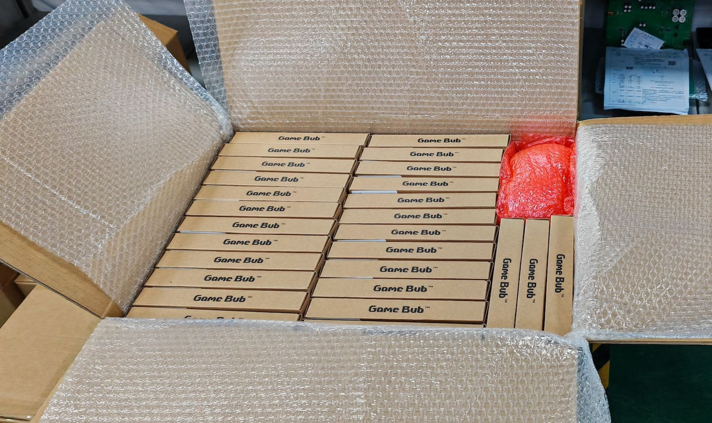
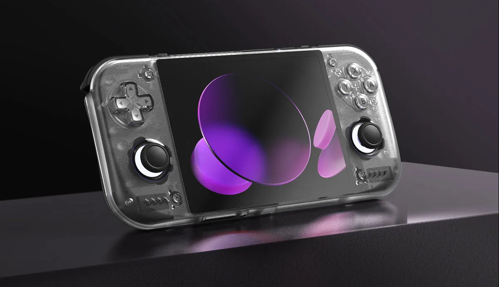
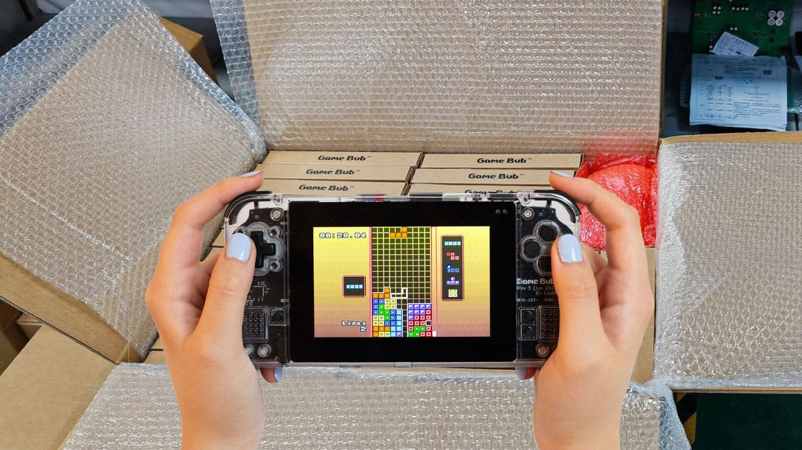
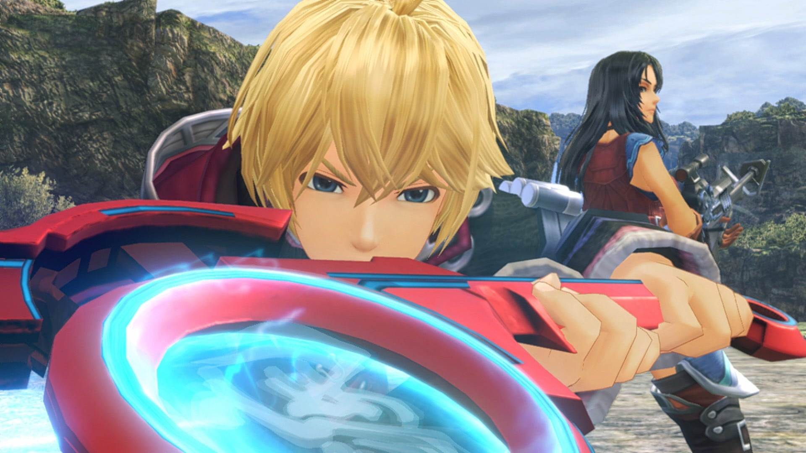

# 游戏设备周报·下 | 2026-W30 (7.25 - 7.29)

> 掌机市场风云突变：Steam Deck销量骤降，联想云掌机逆势登场。

## 🌍 海外资讯

### Steam Deck

### 🔮 新机爆料

#### 1. 像素艺术游戏《Sword & Banner》融合《Mount & Blade》与《Total War》特色

像素艺术策略游戏《Sword & Banner》近日公开，玩法融合《骑马与砍杀》的战场指挥与《全面战争》的宏观战略元素。开发者表示，游戏将提供大规模军团对战与角色养成系统，目前已在Steam Deck上通过Proton兼容性测试。具体发售日期未公布，但已开放Steam商店页面。该作精准切中策略玩家对“轻量化全战”的需求，若优化得当，有望成为Steam Deck上高耐玩度的独立神作。来源: GamingOnLinux

#### 2. MXGP 26 公布，附带全新实机预告片

摩托车越野赛系列新作《MXGP 26》正式公布，同步释出实机预告片。本作由Milestone开发，主打更真实的物理引擎与动态赛道系统，支持4K/60帧运行。游戏预计2026年内登陆PC及主机平台，Steam Deck已验证可流畅运行。作为系列重启之作，画面与手感升级将决定其能否在竞速游戏市场突围，Steam Deck兼容性优化是加分项。来源: GamingOnLinux

#### 3. 《Sanctuary: Shattered Sun》或成《最高指挥官》精神续作

大型即时战略游戏《Sanctuary: Shattered Sun》公布，被媒体视为《最高指挥官》精神续作。游戏支持数千单位同屏作战，并引入模块化基地建造系统。开发团队已针对Steam Deck掌机模式进行UI缩放与键位适配，预计2027年早期发售。RTS在掌机平台稀缺，该作若能解决操作复杂度，有望开辟“掌机RTS”新赛道，对Steam Deck生态是重要补充。来源: GamingOnLinux

#### 4. Rogue Eclipse 是“星际火狐 x 装甲核心”结合体，8月7日推出

太空射击游戏《Rogue Eclipse》宣布8月7日正式发售，玩法被描述为“星际火狐与装甲核心结合体”。玩家可自定义机甲部件，在高速飞行中切换近战与远程武器。游戏已通过Steam Deck验证，支持60帧稳定运行，售价暂未公布。融合街机射击与机甲自定义的玩法极具辨识度，8月档期避开大作竞争，有望成为Steam Deck暑期档爆款独立游戏。来源: GamingOnLinux

### 🆕 新机发售

#### 1. Steam Deck涨价翻车！销量暴跌82%
据Google News报道，Steam Deck在部分地区涨价后，销量环比暴跌82%。涨价涉及LCD与OLED全系机型，涨幅约15%-20%。市场分析认为，消费者对价格敏感度极高，涨价直接导致需求断崖式下滑，Valve尚未对此作出官方回应。此次销量崩盘证明掌机市场属价格敏感型，Valve若想维持份额，需尽快推出促销或调整定价策略，否则将给竞品留下可乘之机。来源: Google News

#### 2. 拯救者C700云掌机发布，无网也能玩3A大作
联想发布拯救者C700云游戏掌机，主打“无网也能玩3A大作”的混合云架构。设备搭载高通骁龙G3x Gen 2芯片，支持本地算力运行轻度游戏，并通过云端串流运行大型3A作品。起售价399美元，直接对标Steam Deck入门款，预计8月中旬开售。C700试图用“云+本地”双模方案解决性能与续航矛盾，但云游戏延迟和网络依赖仍是痛点，能否“吊打”Steam Deck有待市场检验。来源: Google News

#### 3. Rogue Eclipse 确认8月7日登陆Steam，支持Steam Deck原生运行

太空射击游戏《Rogue Eclipse》确认8月7日登陆Steam，支持Steam Deck原生运行。游戏融合高速飞行射击与机甲深度定制，提供超过50种武器模块。开发团队已针对掌机模式优化触控与陀螺仪操作，确保掌上体验流畅。该作精准定位“掌机爽游”需求，8月发售恰逢暑期档，若口碑发酵，有望成为Steam Deck平台8月下载量冠军。来源: GamingOnLinux

### 📱 系统更新

#### 1. Valve发布Proton 11.0-2候选版本供测试

Valve发布Proton 11.0-2候选版本，面向测试通道用户开放。该版本主要修复多款Windows游戏在SteamOS上的崩溃问题，包括《艾尔登法环》的着色器编译卡顿和《赛博朋克2077》的纹理错误。正式版预计两周内推送。Proton的持续迭代是Steam Deck生态核心竞争力，此次针对热门3A的修复将直接提升用户体验，巩固兼容性优势。来源: GamingOnLinux

#### 2. Minecraft: Java版系统需求在支持Vulkan前提升

Mojang宣布《我的世界：Java版》将在下一次更新中引入Vulkan渲染器，为此官方同步提升了最低系统需求。

### Windows 掌机

### 🔮 新机爆料

#### 1. 联想预告轻薄便携设备将带来无延迟PC游戏体验
- **新闻内容**：联想近日发布预告，暗示将推出一款主打“无延迟PC游戏体验”的轻薄便携式设备。外界猜测可能是全新Windows掌机或云游戏终端。联想未公布型号与规格，但强调该设备将解决传统掌机在串流或本地运行时的延迟痛点，预计未来数周内揭晓更多细节。
- **简要分析**：联想意在抢占移动PC游戏细分市场，若实现“无延迟”体验，将直接对标ROG Ally与Steam Deck，但需警惕云游戏方案对网络环境的依赖。
- **来源**: Google News

#### 2. Zach Cregger承认无法超越里昂，新《生化危机》电影将用原创角色

- **新闻内容**：导演Zach Cregger在采访中坦言，认为自己无法超越经典角色里昂·肯尼迪，因此决定在新《生化危机》电影中启用原创角色。该片处于前期筹备阶段，预计重启电影宇宙，具体上映日期未公布。
- **简要分析**：放弃经典角色是险棋，原创角色能带来新鲜感，但可能流失核心粉丝。此举反映片方希望摆脱游戏改编“魔咒”，尝试独立叙事。
- **来源**: PC Gamer

#### 3. Cyan发布20年来首款新《神秘岛》游戏预告片，随后称游戏未在开发

- **新闻内容**：经典解谜游戏《神秘岛》开发商Cyan近日发布名为“Project Anglerfish”的新作预告片，引发热议。但Cyan随后澄清，该预告片仅为概念展示，游戏未获发行商支持，目前未实际开发。玩家短期内可能无法玩到这款20年来的首款正统续作。
- **简要分析**：Cyan此举更像向潜在发行商“抛绣球”，通过预告片展示创意寻求投资。若无人接盘，该IP恐继续沉寂，反映独立工作室在3A项目融资上的困境。
- **来源**: PC Gamer

### 🆕 新机发售

#### 1. 联想预热拯救者云游戏掌机C700：主打10ms超低延迟串流，下月登场

- **新闻内容**：联想正式预热新款拯救者云游戏掌机C700，核心卖点为“10ms超低延迟串流体验”。该设备专为云游戏场景设计，支持通过Wi-Fi或5G网络串流PC及主机大作。官方确认C700将于下月发布，暂未公布售价与配置。
- **简要分析**：C700定位清晰，瞄准云游戏赛道，10ms延迟若属实将提升串流体验。但云游戏对网络要求极高，普及仍取决于运营商基础设施与用户带宽。
- **来源**: Google News

#### 2. Valve未发布Steam Frame再遇坏消息：高通计划提高芯片价格

- **新闻内容**：据PC Gamer报道，高通计划上调芯片价格，给Valve未发布的VR头显“Steam Frame”带来成本压力。Steam Frame原定近期发布，但芯片涨价可能导致最终售价高于预期，或迫使Valve调整硬件规格。Valve官方尚未回应。
- **简要分析**：芯片涨价潮从手机、PC蔓延至VR领域。Steam Frame若定价过高，将难以与Meta Quest系列竞争，Valve可能需要牺牲利润或推迟发布以重新评估成本。
- **来源**: PC Gamer

#### 3. 美光低功耗DRAM在AI数据中心功耗约为DDR5三分之一，但不确定是否是好消息

- **新闻内容**：美光宣布其LPDDR5X内存在AI数据中心工作负载中，功耗仅为传统DDR5的三分之一，占系统总功耗不到7%。理论上可降低数据中心散热成本，但美光未说明性能是否同步下降。该技术主要面向企业级市场，短期内不影响消费级掌机或PC。
- **简要分析**：低功耗内存对掌机等移动设备意义重大，但美光聚焦数据中心，说明技术成熟度尚不足以直接下放。未来LPDDR6普及，掌机续航有望质变。
- **来源**: PC Gamer

#### 4. 《Marvel Tōkon》开发者就测试版性能问题向PC玩家致歉，距正式发售仅一周

- **新闻内容**：格斗游戏《Marvel Tōkon》开发者就PC测试版出现的帧率不稳、卡顿等性能问题向玩家致歉。尽管存在优化问题，测试版仍打破Steam格斗游戏测试记录。正式版将于一周后发售，开发者承诺首日补丁修复大部分问题。
- **简要分析**：测试版火爆证明IP号召力强，但性能问题若未在正式版解决，将影响口碑。对于掌机玩家，优化不佳的游戏在低功耗设备上体验更差，需谨慎观望。
- **来源**: PC Gamer

#### 5. GTA Online游戏内赌博功能在澳大利亚被屏蔽

- **新闻内容**：Rockstar Games宣布，因应澳大利亚当地法规，《GTA Online》中的钻石赌场赌博功能已在澳大利亚被屏蔽。澳大利亚加入全球超过50个无法使用该功能的国家行列。玩家仍可访问赌场其他区域，但无法进行虚拟赌博。
- **简要分析**：此举是

### 安卓掌机

### 🔮 新机爆料
#### 1. Game Bub 终于“即将发货”，你仍可预购一台

FPGA掌机Game Bub进入“即将发货”阶段，目前仍有少量预购名额。该设备被视为Analogue Pocket的替代选择，采用FPGA硬件模拟方案，支持多种经典游戏平台。官方称工厂已开始打包出货，首批订单预计未来几周内交付。预购用户需抓紧最后机会，错过本轮可能需等待下一批次。  
分析：Game Bub的姗姗来迟反映FPGA掌机供应链的复杂性。作为竞品，其能否凭借更亲民定价和开放生态吸引玩家，将决定生存空间。  
来源: Retro Handhelds

### 🆕 新机发售
#### 1. Retroid 公布 Nova 发货日期

Retroid正式公布Pocket Nova发货时间表。该掌机凭借大屏幕和紧凑机身，成为今夏最受关注的安卓掌机之一。首日预购订单优先发货，具体日期按配置和地区分批通知。官方建议用户检查订单状态并确认收货地址。  
分析：Nova的紧凑大屏设计精准切入中高端安卓掌机市场，平衡便携性与视觉体验。发货日期明确标志产品从概念走向落地，有望巩固Retroid竞争力。  
来源: Retro Handhelds

### 📱 系统更新
#### 1. PortMaster 入门指南

Retro Game Corps发布最新PortMaster入门指南。PortMaster最初是ArkOS开发者收集PC移植游戏的工具，现已成为跨平台游戏移植管理平台，支持数百款游戏在安卓掌机上运行。指南涵盖安装、配置及常见问题解决，已更新至2024年7月版本。  
分析：PortMaster的进化降低了安卓掌机玩家获取优质游戏的门槛，正成为生态中不可或缺的软件基础设施。  
来源: Retro Game Corps

#### 2. Mac 平台模拟器入门指南

Retro Game Corps发布面向M系列芯片Mac的模拟器入门指南。指南介绍如何在iMac、Mac Mini及MacBook上配置OpenEmu、ES-DE、RetroArch等模拟器，涵盖PSP、3DS、GameCube、Wii、PS2、Xbox及Switch等平台模拟方案，包括ROM管理、BIOS设置及性能优化技巧，更新至2025年2月版本。  
分析：Apple Silicon性能提升使Mac成为模拟器新阵地。该指南填补了Mac平台系统化教程空白，有望吸引更多开发者关注跨平台模拟体验。  
来源: Retro Game Corps

### 📋 其他资讯
#### 1. 宫本茂谈任天堂“游戏体验优先”策略：硬件性能不再是玩家唯一追求
任天堂制作人宫本茂重申公司“游戏体验优先”策略。他认为玩家越来越重视创意玩法和沉浸感，而非单纯追求硬件参数。他以Switch为例，指出其成功源于独特游戏设计而非顶尖芯片。该言论被解读为对掌机市场“军备竞赛”的间接回应。  
分析：宫本茂观点为安卓掌机厂商提供差异化思路：与其堆砌硬件，不如深耕软件生态和交互创新，对Retroid、AYN等品牌有参考价值。  
来源: Google News

#### 2. 指南：在复古掌机上使用Syncthing

Retro Game Corps发布教程，指导玩家在复古掌机上通过Syncthing实现存档同步。Syncthing是开源点对点文件同步服务，教程重点演示如何在RetroArch中同步游戏存档和即时存档，涵盖主机端配置、掌机端设置及多设备同步策略，已更新至2025年1月版本。  
分析：存档同步是掌机玩家长期痛点。Syncthing的引入提升多设备使用体验，展示开源工具在游戏生态中的实用价值，有望成为安卓掌机玩家标配技能。  
来源: Retro Game Corps

### 开源掌机/Linux掌机

### 🔮 新机爆料
#### 1. 高达机甲乐高套装概念设计含驾驶舱，高16.5英寸，配有支架

近期一款高达机甲乐高套装的概念设计在玩家社群引发热议。该设计包含可开启驾驶舱，整体高度16.5英寸，并配有专用展示支架。目前乐高官方已推出多款任天堂与世嘉主题游戏套装，高达IP的加入为模型与游戏双修玩家提供了新想象空间。该设计仍处概念阶段，尚未确认量产。分析认为，该概念反映玩家对“游戏IP+实体模型”跨界产品的持续热情，若落地将填补乐高在机甲类游戏IP授权领域的空白，拓展成人收藏家市场。来源: Retro Dodo

### 🆕 新机发售
#### 1. Game Bub 开源掌机开始发货

经过近一年等待，“全球首款完全开源掌机”Game Bub开始向预订用户发货。该掌机于2025年10月曝光，主打高度可定制化硬件与开源软件生态。此次发货标志社区驱动设备正式进入玩家手中，具体规格与最终零售价预计未来几周由开发团队公布。分析指出，Game Bub发货是开源掌机社区重要里程碑，验证了从众筹到量产交付的完整链路，有望激励更多开发者投身开源生态，推动行业从“闭源方案”向“开放共创”转型。来源: Retro Dodo

### 📱 系统更新
#### 1. 我的简易TrimUI Brick设置（MinUI指南）

知名复古游戏博主Retro Game Corps发布针对TrimUI Brick掌机的详细MinUI配置指南。指南基于作者数日调校，旨在帮助用户打造极简、定制化游戏体验平台，涵盖固件刷写、界面优化、模拟器核心配置全流程，适合追求即开即玩体验的玩家。分析认为，TrimUI Brick凭借小巧机身与高性价比在入门级市场占有一席之地，此类指南涌现反映社区认可度提升，降低新用户上手门槛，巩固其市场地位。来源: Retro Game Corps

### 📋 其他资讯
#### 1. 粉丝Mod将《上古卷轴3：晨风》移植到任天堂DS平台

在等待《上古卷轴6》之际，玩家社区找到重温经典的新方式。一款粉丝制作的Mod成功将《上古卷轴3：晨风》移植到任天堂DS平台，使其能在双屏掌机上运行。该移植非官方版本，需玩家具备一定技术知识完成安装配置，但为掌机怀旧玩家提供了沉浸式体验。分析指出，该移植证明经典游戏社区生命力，展示开源与Mod文化如何突破硬件限制为老游戏赋予新生，反映市场对“掌机玩3A级老游戏”需求的持续存在。来源: Eurogamer

#### 2. 雅达利与环球影业达成协议，将10款游戏改编为电影

雅达利宣布与环球影业签署重大协议，计划将旗下10款经典游戏改编为电影。具体片单尚未公布，考虑到此前亚马逊《吃豆人》改编项目反响平平，外界持谨慎乐观态度。雅达利近年通过复刻主机与游戏合集重返大众视野，此次进军影视领域是其品牌多元化战略重要一步。分析认为，雅达利意在借助环球影业制作与发行能力最大化IP价值，但游戏改编电影成功率不高，需在剧本与选角上投入足够资源，否则可能重蹈覆辙。来源: Retro Dodo

#### 3. Pepsiman 被重新编译，现可通过网页浏览器游玩

经典PS1游戏《Pepsiman》被爱好者成功重新编译，玩家打开网页浏览器即可直接游玩。该以百事可乐吉祥物为主角的跑酷游戏，因荒诞设定与独特广告属性在复古游戏圈拥有 cult 级地位。网页版移植无需下载模拟器或插件，极大降低体验门槛。分析指出，该事件是“游戏保存”运动成功案例，通过重新编译而非模拟，游戏得以在现代平台原生运行，为因版权或商业原因无法再版的游戏提供新传播途径，对游戏文化遗产保护具有积极意义。来源: Retro Dodo

### PlayStation

### 🔮 新机爆料
（无内容）

### 🆕 新机发售

#### 1. 《Mortal Shell 2》实体典藏版PS5预购售罄

距离类魂游戏《Mortal Shell 2》发售不到一个月，其PS5“Revered Edition”实体典藏版已售罄。售价55英镑（约70美元）的版本在发行商Playstack宣布后迅速被抢购一空，反映玩家对实体光盘版游戏的高涨热情。该作预计2026年8月登陆PS5、Xbox Series X|S及PC平台。
**分析**：在索尼宣布逐步停产光盘的背景下，该典藏版秒速售罄凸显核心玩家对实体收藏品的强烈需求，传递“实体未死”的信号。
来源: Eurogamer

#### 2. PS5版《光环》正式发售
7月28日，PS5版《光环：战役进化》正式发售。这款2001年与初代Xbox同步推出的独占作品，25年后登陆竞争对手平台。购买豪华版的玩家可抢先体验，进入游戏需绑定微软账号。此举被视为游戏史上最具象征意义的“破冰”事件之一，微软看中PS装机量，索尼借此吸引Xbox用户。
**分析**：微软将王牌IP《光环》移植到PS平台，标志主机独占壁垒进一步瓦解，为微软带来直接收入，也迫使索尼反思独占策略。
来源: 触乐

### 📱 系统更新
（无内容）

### 📋 其他资讯

#### 1. 亚马逊和百思买上线PlayStation实体游戏促销
在索尼宣布逐步停产PlayStation实体光盘、转向全数字化未来引发玩家抗议后，亚马逊和百思买等零售商迅速推出PlayStation实体游戏促销活动，旨在消化库存，也是对玩家“实体情怀”的商业回应。促销涵盖多款第一方及第三方大作，折扣力度显著。
**分析**：零售商借势促销，既安抚玩家情绪，也清理库存，反映实体渠道在过渡期仍具市场调节作用。
来源: Google News

#### 2. 今年美国仅七款PlayStation游戏实体销量破10万份
根据Circana数据，尽管玩家对索尼取消光盘生产感到愤怒，但2026年截至目前，美国仅七款PlayStation游戏实体销量突破10万份。这揭示实体光盘市场持续萎缩，数字版销售占比已超80%，实体市场正快速边缘化。
**分析**：数据与民意的反差说明索尼决策基于商业现实。实体销量惨淡，使“光盘停产”成为不可逆转的趋势。
来源: Eurogamer

#### 3. 《幽灵行动：荒野》或推出PS5/Xbox Series X/S终极版

育碧似乎正为《汤姆·克兰西：幽灵行动：荒野》准备次世代“终极版”。该作将于2027年3月迎来发售十周年，此次泄露版本可能是一次周年纪念重新发行。目前不确定是包含所有DLC的简单移植，还是针对次世代进行画面与性能强化的重制版。官方尚未回应。
**分析**：育碧在十周年节点推出次世代版本，意在挖掘老IP长尾价值。若仅为简单移植，难吸引新玩家；若包含实质性重制，有望为经典开放世界合作射击游戏注入新活力。
来源: Eurogamer

#### 4. 索尼取消光盘或摧毁72亿美元二手游戏市场
分析师警告，索尼计划在2028年1月前停止PlayStation光盘生产，可能摧毁全球价值约72亿美元的二手游戏市场。二手交易是玩家节省开支、零售商获利的重要环节，全面数字化后玩家将失去购买、出售和交换实体游戏的权利。此举引发玩家、零售商及游戏保存倡导者的广泛担忧。
**分析**：72亿美元二手市场若被“一键清零”，不仅影响玩家权益，更将重塑游戏经济生态。索尼此举虽能最大化数字平台抽成，但也可能加速玩家对订阅服务的依赖，削弱游戏所有权。
来源: Eurogamer

#### 5. 玩家请愿：让PS5关机一周抗议全数字化未来
针对索尼宣布2028年全面停止光盘生产，一项玩家请愿呼吁所有PlayStation用户在2026年8月的一周内彻底关闭并拔掉PS5电源，进行“数字静默抗议”。该请愿已获数万签名，在Reddit等社区引发激烈讨论。索尼尚未回应。
**分析**：这种“拔电源”抗议象征意义大于实际效果，但反映玩家对失去选择权的强烈不满。若抗议规模扩大，可能迫使索尼在过渡期提供更灵活的折中方案，如保留限量实体生产或加强二手数字交易功能。
来源: Eurogamer

---
**参考资料链接列表：**
- https://news.google

### Xbox

### 🔮 新机爆料
#### 1. Xbox是唯一实现同比增长的平台——但有一个重大前提

市场分析机构Circana发布最新月度报告，追踪美国游戏硬件与软件支出。6月数据整体惨淡，几乎所有平台均呈下滑趋势，但Xbox是唯一实现同比增长的平台。不过，这一增长主要得益于硬件供应改善和促销活动拉动，而非整体市场回暖。分析认为，Xbox的同比增长更多是“补涨”而非市场扩张，反映出其硬件供应危机缓解后的短期红利，但软件和服务端仍面临压力。（来源：Eurogamer）

### 🆕 新机发售
#### 1. 微软Xbox向下兼容功能拓展至PC平台：初代四款作品适配，后续将新增更多游戏

微软正式宣布将Xbox向下兼容功能拓展至PC平台，首批适配四款初代Xbox作品，涉及主机兼容硬件功能。玩家现可在PC上运行部分经典Xbox游戏，后续将陆续新增更多作品。此举标志着微软打通主机与PC生态的关键一步。分析认为，向下兼容上PC是微软跨平台战略的重要落子，既能盘活老游戏资产，也为Game Pass PC版增加差异化竞争力，但技术适配和版权问题仍是挑战。（来源：Google News）

### 📋 其他资讯
#### 1. Xbox在Double Fine裁员25%并转型为独立状态后发声

以《脑航员》闻名的Double Fine工作室在Xbox大规模重组三周后，裁员25.6%并转型为独立状态。Xbox官方随后发声，表示支持工作室的独立运营决定，但未透露具体财务安排。此次调整是Xbox近期裁减3200人及剥离四家工作室的后续动作。分析认为，Double Fine的独立化表明微软正收缩第一方工作室规模，转向更灵活的合作模式，但频繁裁员对开发者士气和品牌信任度造成冲击。（来源：IGN）

#### 2. Xbox承认其游戏独占策略并不“明显”，但坚称《战争机器》和《发条革命》不会是仅有的非PlayStation游戏

Xbox领导层在近期采访中承认，其独占策略确实不够“明显”，引发外界对第一方游戏跨平台计划的猜测。但官方坚称，《战争机器》和《发条革命》不会是仅有的非PlayStation游戏，暗示更多独占作品可能登陆竞品平台。这一表态延续了Xbox模糊的跨平台策略。分析认为，Xbox在独占与多平台之间摇摆不定，既想通过跨平台扩大收入，又担心削弱硬件吸引力，这种表述反而加剧了玩家和投资者的困惑。（来源：Eurogamer）

#### 3. 前《极限竞速：地平线5》总监表示，Xbox Game Pass在理论上是个好主意，但“现实是订阅人数不够多”

Playground Games前《极限竞速：地平线5》总监Mike Brown公开评论Xbox当前困境，认为Game Pass在理论上是个好主意，但“现实是订阅人数不够多”。他指出，订阅模式需要庞大的用户基数才能支撑内容投入，而Xbox目前尚未达到临界点。这一言论引发行业对订阅制可持续性的讨论。分析认为，内部人士的坦诚批评揭示了Game Pass的盈利难题——高投入低转化，若订阅增长持续乏力，微软可能需要调整定价或内容策略。（来源：Eurogamer）

#### 4. 在裁员和模糊的战略调整之后，Xbox宣布推出PC版向下兼容计划，Blinx和Conker领衔首批游戏阵容

在裁员3200人及剥离四家工作室后，Xbox宣布PC版向下兼容计划，首批游戏包括《Blinx: The Time Sweeper》和《Conker: Live & Reloaded》。该计划旨在将经典Xbox游戏引入PC平台，后续将追加更多作品。此举被视为微软在战略调整期安抚玩家、盘活老IP的举措。分析认为，PC向下兼容是微软“硬件+服务”生态的关键拼图，既能提升Game Pass PC版吸引力，也为未来云游戏内容库铺路，但经典IP的移植效果仍有待市场验证。（来源：Eurogamer）

#### 5. Xbox在其内测计划中推出广告支持的游戏串流测试，硬件供应与可负担性危机持续加剧

Xbox宣布在Insider内测计划中测试广告支持的游戏串流服务。玩家可免费串流库中部分游戏，每次限时1小时，但需在游戏前观看广告。该测试正值硬件供应紧张和可负担性危机加剧之际，微软试图通过低价或免费串流降低用户门槛。分析认为，广告串流是Xbox应对硬件成本上涨和订阅增长瓶颈的折中方案，但1小时限时和广告插入可能影响体验，若测试成功，或将成为Xbox在低价市场的差异化武器。（来源：Eurogamer）

### 任天堂 Switch

### 🔮 新机爆料

#### 1. 《拔天海拓史》重制版开发者协助《异度神剑》Switch 2版开发

- **新闻内容**：任天堂曾邀请Panic Button等外部开发商协助第一方游戏更新，现日本开发商Logicalbeat参与《异度神剑：决定版》Switch 2版本开发。公司代表董事Domae Yoshiki在社交媒体及官网确认，团队负责4K和60帧增强工作。该消息由RPG Site翻译披露。
- **简要分析**：任天堂借助外部技术优化Switch 2游戏表现，Logicalbeat的加入体现其对4K/60帧性能升级的重视，为未来重制版提供技术合作范本。
- **来源**: Nintendo Life

#### 2. 《最终幻想14：永寒之寒》扩展预告片公布，新职业与联动突袭系列宣布

- **新闻内容**：Square Enix发布《最终幻想14 Online》第六个扩展包“永寒之寒”全新预告，确认2027年1月登陆Switch 2，并公布新职业及联动突袭系列。该游戏今年4月宣布登陆Switch 2，原定8月上线，现发售窗口进一步明确。
- **简要分析**：作为MMO标杆，《最终幻想14》登陆Switch 2并推出大型扩展，将扩充平台在线游戏阵容，考验任天堂对大型在线游戏的运营支持能力。
- **来源**: Nintendo Life

#### 3. 《异度神剑2》Switch 2版预估文件大小公布

- **新闻内容**：《异度神剑2》Switch 2版将于下周发售，商店页面已上线。任天堂公布预估文件大小为45.8 GB，发售前后可能变动。原版Switch版文件大小仅13.2 GB，新版本容量增长近3.5倍，暗示高清材质与性能增强规模。
- **简要分析**：45.8GB容量远超原版，表明纹理、分辨率和帧率大幅升级，但对玩家存储空间提出更高要求。
- **来源**: Nintendo Life

#### 4. 《最终幻想14》今年晚些时候登陆Switch 2，附带免费试玩版，文件大小庞大

- **新闻内容**：今年4月《最终幻想14》宣布登陆Switch 2，原定8月上线，现发售窗口临近。“永寒之寒”扩展发布大型预告片。游戏附带免费试玩版，但文件大小庞大，具体容量未公布。消息来自Eurogamer。
- **简要分析**：免费试玩版降低入门门槛，但庞大文件体积可能影响下载意愿，优化安装策略是关键。
- **来源**: Eurogamer

#### 5. 宫本茂认为玩家不再在意主机规格，任天堂提供“只有我们才能创造的游戏玩法”

- **新闻内容**：宫本茂接受Eurogamer采访时表示，如今玩家对图形和性能重视程度下降。他强调任天堂核心优势在于提供独特游戏玩法，而非追逐硬件规格竞争。该观点回应外界对Switch 2性能的讨论。
- **简要分析**：宫本茂言论延续“玩法优先”理念，暗示Switch 2不会陷入性能军备竞赛，以独特体验吸引用户，对第三方大作移植策略构成挑战。
- **来源**: Eurogamer

#### 6. 世嘉宣布《疯狂出租车：世界巡游》登陆Switch 2 [更新：新预告片]

- **新闻内容**：世嘉公布《疯狂出租车：世界巡游》，2027年登陆Switch 2。该系列近年鲜有新作，上一款作品可追溯至2017年。此次回归伴随新预告片发布，标志经典IP在次世代平台重启。
- **简要分析**：世嘉复活经典街机IP，回应平台用户怀旧需求，表明第三方厂商对Switch 2装机量及市场潜力的信心。
- **来源**: Nintendo Everything

### 🆕 新机发售

#### 1. 任天堂 Switch 2 版《异度神剑2》数字版明日发售，定价499港币

- **新闻内容**：Switch 2版《异度神剑2》数字版明日发售，港区eShop定价499港币。版本包含4K分辨率与60帧性能增强，独立游戏及升级包同步上架。预估文件大小45.8 GB，玩家需预留存储空间。
- **简要分析**：定价与原版首发价持平，性能升级显著，升级包性价比更高，有望推动数字版销量增长。
- **来源**: Google News (via Switch 2)

#### 2. 《异度神剑2》Switch 2数字版明日发售
- **新闻内容**：据Google News汇总，《异度神剑2》Switch 2数字版明日发售，售价及版本细节与港区信息一致。该游戏是首批性能增强重制作品，支持4K/60帧，包含原版全部DLC内容。
- **简要分析**：作为首发护航作品，快速发售有助于拉动初期硬件销量，验证任天堂第一方重制策略市场效果。
- **来源**: Google News (via Switch 2)

### 📋 其他资讯

#### 1. Bethesda游戏登陆Nintendo Switch™ 2

### 模拟器资讯

### 🆕 新机发售

#### 1. 微软为用户送大礼！移植初代Xbox游戏到PC：同步放出官方模拟器

微软在将初代Xbox游戏移植到PC平台时，同步发布了一款官方模拟器，用于运行这些经典作品。此举不仅让《光环：战斗进化》等老游戏以原生PC版本回归，还通过官方模拟器确保了兼容性与性能优化。该模拟器随特定移植游戏捆绑推出，玩家无需额外配置即可体验。  
**简要分析**：微软开创了官方模拟器与游戏移植协同发布的先河，既解决版权与兼容性痛点，又为Xbox生态在PC端的扩展提供技术基础，可能推动更多厂商效仿。  
**来源**: Google News

### 📋 其他资讯

#### 1. PS5模拟器再取重大进展！已到《给他爱5》北扬克顿

PS5模拟器SharpEmu取得里程碑式进展，已成功进入《GTA 5》的加载画面并抵达北扬克顿区域。此前该模拟器仅能运行部分2D或低负载游戏，此次突破意味着其图形渲染与CPU模拟能力大幅提升。开发团队表示，目前仍处于早期阶段，距离流畅运行3A大作尚有距离。  
**简要分析**：SharpEmu的进展表明PS5模拟器正从理论验证走向实际应用，但受限于PS5复杂的安全架构，短期内难以威胁主机销量，更多是技术社区的重要探索。  
**来源**: Google News

#### 2. PS5模拟器SharpEmu新进展：已可进入《GTA 5》加载画面

SharpEmu模拟器在《GTA 5》上的表现进一步细化——已能稳定进入游戏加载画面，并初步渲染出北扬克顿的雪地场景。开发日志显示，团队通过重写着色器编译器解决了部分图形错误，但帧率仍低于10FPS。该模拟器目前仅支持特定固件版本的PS5游戏。  
**简要分析**：连续两条进展报道凸显了SharpEmu的迭代速度，但《GTA 5》作为PS4移植作品，其模拟难度低于原生PS5游戏，需警惕过度解读。模拟器距离实用化仍需数年。  
**来源**: Google News

#### 3. 微软把480p老游戏拉到4K！Xbox 360模拟器被挖出

技术爱好者通过逆向工程发现，微软在Xbox One及Series X|S的向后兼容功能中，内置了一款隐藏的Xbox 360模拟器。该模拟器能将480p分辨率的Xbox 360游戏，通过AI超分辨率技术提升至4K输出，同时修复纹理闪烁和帧率不稳问题。目前已有《战争机器》《神鬼寓言》等百余款游戏获得增强。  
**简要分析**：微软的模拟器策略已从“兼容”转向“增强”，通过官方技术手段让老游戏焕发新生，这比第三方模拟器更具稳定性和法律优势，可能成为Xbox Game Pass的核心竞争力之一。  
**来源**: Google News

#### 4. Xbox在PC上的向后兼容功能或将开启模拟所有Xbox主机的序幕

继Xbox 360模拟器被曝光后，有分析指出微软正在PC端构建统一的Xbox模拟层，未来可能支持从初代Xbox到Xbox Series的全部主机游戏。该技术基于Hyper-V虚拟化架构，允许PC直接调用Xbox系统组件，目前已在Windows 11 Insider版本中测试。若实现，PC玩家将能原生运行所有Xbox平台游戏。  
**简要分析**：若微软完成全系模拟，将彻底打破主机与PC的壁垒，但可能削弱Xbox硬件销量。此举更可能是为云游戏（xCloud）铺路，通过统一模拟层降低服务器部署成本。  
**来源**: Google News

### 游戏外设

### 📋 其他资讯

#### 1. 罗技将效仿任天堂——仅欧洲版鼠标配备可更换电池

- **新闻内容**：继任天堂宣布仅在欧洲推出可更换电池的Switch 2后，罗技也计划采取类似策略。根据欧盟2027年2月生效的新法规，消费电子产品必须配备用户可更换电池。但罗技不打算在全球统一推行该设计，仅针对欧洲市场推出可换电池版本的鼠标，其他地区用户可能无法享受这一便利。
- **简要分析**：罗技此举虽合规但略显保守，可能引发非欧洲用户不满。在环保和可维修性成为行业趋势的当下，分区策略或将影响品牌在全球市场的口碑一致性。
- **来源**：The Verge

#### 2. 这款可同时播放两个音源的舒适游戏耳机售价25美元

- **新闻内容**：EPOS H3 Hybrid有线游戏耳机目前在Woot平台以24.99美元促销，仅为原价99.99美元的25%。该耳机支持同时播放两个音源，可通过USB-A和3.5mm接口同时连接设备，让玩家在游戏时接听电话或收听其他音频。佩戴舒适度备受好评，是预算有限玩家的高性价比选择。
- **简要分析**：在无线耳机主导市场的今天，EPOS H3 Hybrid凭借双音源和低价打出差异化。促销力度表明有线耳机仍有特定受众，在多设备协同场景下，功能创新比单纯追求无线化更具吸引力。
- **来源**：The Verge

#### 3. Iniu 10,000mAh移动电源可将Nintendo Switch 2游戏时间延长一倍以上，售价不到10美元

- **新闻内容**：Iniu推出10,000mAh移动电源，专为Nintendo Switch 2设计，支持边玩边充。测试显示，该电源可将Switch 2游戏续航延长一倍以上，售价不到10美元。对于经常外出或长时间游戏的玩家，这是极具性价比的配件，能有效缓解续航焦虑。
- **简要分析**：Switch 2续航是玩家关注焦点，Iniu低价高容量电源精准切中痛点。不到10美元的价格门槛极低，预计将带动第三方配件销量，也反映出Switch 2对便携充电配件的旺盛需求。
- **来源**：IGN

## 参考资料链接列表

1. [Google News] Steam Deck涨价翻车！销量暴跌82%: https://news.google.com/rss/articles/CBMiSEFVX3lxTE8xZWdRUkZiV0t4SGJOREJ5VHh4MDMtclgtOERvZmduclFVVkJldWNNVUN6Ylk5RENOZlNlek11bE55N2tzTVl5Mw?oc=5
2. [Google News] 吊打Steam Deck？拯救者C700云掌机来了！无网也能玩3A大作...: https://news.google.com/rss/articles/CBMilwFBVV95cUxQQVYwdDMzNE13YkI4RWdIVXhYTzZGbi03Y1UyTnA0bENrcUJILVVQVTFad1d4b0ZuTGZpcUFiWEZTVnVTOHVCTVkyOEx3M25fR3o1em5iNFIwdjdVb0VXVkJWeDRJRDVrQWVIMk9WM1JxVzRLdjZwNmJRUXVCT3BLeW9kRmF1Z3h3R203UHBLWlg0RkJyR3Jj?oc=5
3. [Google News] 初代 G Cloud 云游戏掌机表现不佳，罗技暂无推出第二代的计划: https://news.google.com/rss/articles/CBMiTEFVX3lxTE0zOGttWUNZWHdKSmpSalNBbWpEeHJpdlNHS1lJVGNPcEwtTUJqT1A5THZCcVViT2RXSmh4ZXpWSEFGNUFkWExqRzQ0M28?oc=5
4. [GamingOnLinux] Mount & Blade meets Total War in the upcoming pixel-art Sword & Banner: https://www.gamingonlinux.com/2026/07/mount-blade-meets-total-war-in-the-upcoming-pixel-art-sword-banner/
5. [GamingOnLinux] MXGP 26 revealed with a new gameplay trailer: https://www.gamingonlinux.com/2026/07/mxgp-26-revealed-with-a-new-gameplay-trailer/
6. [GamingOnLinux] Sanctuary: Shattered Sun could be an interesting Supreme Commander spiritual successor: https://www.gamingonlinux.com/2026/07/sanctuary-shattered-sun-could-be-an-interesting-supreme-commander-spiritual-successor/
7. [GamingOnLinux] Valve puts up a Proton 11.0-2 Release Candidate for testing: https://www.gamingonlinux.com/2026/07/valve-puts-up-a-proton-11-0-2-release-candidate-for-testing/
8. [GamingOnLinux] Minecraft: Java Edition system requirements get bumped up ahead of Vulkan support: https://www.gamingonlinux.com/2026/07/minecraft-java-edition-system-requirements-get-bumped-up-ahead-of-vulkan-support/
9. [GamingOnLinux] Rogue Eclipse is "Starfox x Armored Core" and arrives August 7: https://www.gamingonlinux.com/2026/07/rogue-eclipse-is-starfox-x-armored-core-and-arrives-august-7/
10. [Google News] 联想预告即将推出的轻薄便携式设备将带来无延迟的PC游戏体验: https://news.google.com/rss/articles/CBMiX0FVX3lxTFBINVdIbE8xYW0tN3o0MWYxWUQ3UHpyOFpvLURYbEZDTERCQWlDQktmNVpzSi01X3k2OUYycDZ2Z0VfNHJMMTVRdWM0djlqODJGTXV0OVlnM1cyN1dIVlI0?oc=5
11. [Google News] 联想预热拯救者云游戏掌机 C700：主打 10ms 超低延迟串流体验，下月登场: https://news.google.com/rss/articles/CBMiTEFVX3lxTE9POWNOMnpBWnk2THpzWVl3aDI2d0xveXpTZWxIWUpkelNiMTRKZk1qaVJUZEdIcTlZZEFhaWhTYkRScGh4LWstZWVwNkc?oc=5
12. [Google News] 老掌机获新生，开发者通过串流让索尼 PS Vita 玩上微软 XGP 大作: https://news.google.com/rss/articles/CBMiZEFVX3lxTE9vYy1pUFRGV0hsOWJnU3hwb3Q3N0M3eGpIZmY4YkZXelJxSFFqN2F0TjhPMVpUN1h3M1ZFd2E3LTlqZ0pFRHppSHVlTkhHQTBOc1FEUjhGaFd3R3RoaHVpaTJNaWc?oc=5
13. [PC Gamer] Zach Cregger admits 'I'm not going to be able to improve on Leon' which is why he's using original characters for the upcoming Resident Evil movie: https://www.pcgamer.com/movies-tv/zach-cregger-admits-im-not-going-to-be-able-to-improve-on-leon-which-is-why-hes-using-original-characters-for-the-upcoming-resident-evil-movie/
14. [PC Gamer] Cyan releases teaser for the first new Myst game in 20 years, then breaks the news that it's not actually being made: https://www.pcgamer.com/games/adventure/cyan-releases-teaser-for-the-first-new-myst-game-in-20-years-then-breaks-the-news-that-its-not-actually-being-made/
15. [PC Gamer] More bad news for Valve and its still unreleased Steam Frame as Qualcomm is set to raise the price of its chips, like everyone else: https://www.pcgamer.com/hardware/vr-hardware/more-bad-news-for-valve-and-its-still-unreleased-steam-frame-as-qualcomm-is-set-to-raise-the-price-of-its-chips-like-everyone-else/
16. [PC Gamer] Micron's low power DRAM 'consumes approximately one-third the power of DDR5' in AI data center workloads, but I'm not sure that's good news: https://www.pcgamer.com/hardware/memory/microns-low-power-dram-consumes-approximately-one-third-the-power-of-ddr5-in-ai-data-center-workloads-but-im-not-sure-thats-good-news/
17. [PC Gamer] Marvel Tōkon's developer has apologised to PC players for the beta's performance issues, with only a week until launch: https://www.pcgamer.com/games/fighting/marvel-tokons-developer-has-apologised-to-pc-players-for-the-betas-performance-issues-with-only-a-week-until-launch/
18. [PC Gamer] GTA Online in-game gambling is now blocked in Australia: https://www.pcgamer.com/gaming-industry/gta-online-in-game-gambling-is-now-blocked-in-australia/
19. [Google News] 宫本茂谈任天堂“游戏体验优先”策略：硬件性能不再是玩家唯一追求: https://news.google.com/rss/articles/CBMiTEFVX3lxTE1xVm9tQnFxZ2l5bHd6REF0cklzSzlLc3J1UzQ3SElOZlNTU0Fwa3lnOVZDdW5RWUlZUU5Jbzg4OUxVNE1YN2o5UWFLRzU?oc=5
20. [Retro Game Corps] Guide: Using Syncthing with Retro Handhelds: https://retrogamecorps.com/2024/08/11/guide-using-syncthing-with-retro-handhelds/
21. [Retro Handhelds] Game Bub is Finally ‘Shipping Soon’ and You Can Still Pre-order One: https://retrohandhelds.gg/game-bub-is-finally-shipping-soon-and-you-can-still-pre-order-one/
22. [Retro Handhelds] Retroid Announces Nova Shipping Dates: https://retrohandhelds.gg/retroid-announces-nova-shipping-dates/
23. [Retro Game Corps] PortMaster Starter Guide: https://retrogamecorps.com/2024/07/12/portmaster-starter-guide/
24. [Retro Game Corps] Emulation on Mac Starter Guide: https://retrogamecorps.com/2025/02/23/emulation-on-mac-starter-guide/
25. [Retro Dodo (掌机)] This Gundam Suit LEGO Set Concept Comes Complete With Cockpit & Stands At 16.5" Tall: https://retrododo.com/this-gundam-suit-lego-set-concept-comes-complete-with-cockpit-stands-at-16-5-tall/
26. [Retro Dodo (掌机)] The Game Bub Open Source Handheld Is Finally Shipping: https://retrododo.com/the-game-bub-open-source-handheld-is-finally-shipping/
27. [Retro Game Corps] My Simple TrimUI Brick Setup (MinUI Guide): https://retrogamecorps.com/2024/12/09/my-simple-trimui-brick-setup/
28. [Eurogamer] Ever wanted to play The Elder Scrolls: Morrowind on a dual-screen handheld? Well, now you can - if you don't mind putting in some legwork: https://www.eurogamer.net/morrowind-ds-mod
29. [Retro Dodo (掌机)] Atari Signs Deal With Universal Pictures To Turn 10 Games Into Movies: https://retrododo.com/atari-signs-deal-with-universal-pictures-to-turn-10-games-into-movies/
30. [Retro Dodo (掌机)] Pepsiman Has Been Recompiled And Can Be Played Through Your Web Browser: https://retrododo.com/pepsiman-has-been-recompiled-and-can-be-played-through-your-web-browser/
31. [Google News] 在实体光盘停产引发众怒之际，亚马逊和百思买已上线PlayStation实体游戏促销活动: https://news.google.com/rss/articles/CBMia0FVX3lxTE13bjRNeDNiajJNZ3hBNjVfdmZqaUc3SjhEU2xOWmY2ajJlY3FxT091RWsxLXJQWG1HdWg4WXJFckZmMUU5X01YbDA4Y3NTLWJYOEZveW9HbDVTMG5yNmxLeG1JYWdyS3RmYlBv?oc=5
32. [Eurogamer] Mortal Shell 2 sells out of physical Revered Edition PS5 pre-orders as players rush to buy the highly-anticipated game on disc: https://www.eurogamer.net/mortal-shell-2-revered-edition-ps5-disc-sold-out
33. [触乐] 触乐怪话：活久见的PS5版《光环》来了！: http://www.chuapp.com/article/291511.html
34. [Eurogamer] Despite outrage at Sony's shift towards a discless future, only seven PlayStation games have managed more than 100,000 physical sales in the US this year: https://www.eurogamer.net/playstation-disc-sales--outrage-circana
35. [Eurogamer] Tom Clancy's Ghost Recon Wildlands appears to be getting a PS5 and Xbox Series X/S Definitive Edition, but is it a remaster or a bog standard re-release?: https://www.eurogamer.net/ghost-recon-wildlands-definitive-edition-leak
36. [Eurogamer] Sony's decision to kill off PlayStation discs could destroy the $7.2bn used game market, according to analysts: https://www.eurogamer.net/used-video-game-market-at-risk-sony-killing-playstation-discs
37. [Eurogamer] Will you power down your PS5 for a week in protest of Sony's all-digital future? A new petition encourages you to pull the plug on PlayStation: https://www.eurogamer.net/playstation-blackout-physical-media-august-protest
38. [Google News] 微软 Xbox 向下兼容功能官宣拓展至XBOX ON PC 平台：初代四款作品适配，后续将新增更多游戏: https://news.google.com/rss/articles/CBMiTEFVX3lxTFBDYWVXZ3BuTjRxclBTaEZFZGJwQUl0LXVvQzJWNmRPMDBKYjZrOVhfQUdhU2kwNWlmb2RHVl9ZQU5YSGVmc0tnUlBLdFg?oc=5
39. [Eurogamer] Of all the platforms, Xbox is the only one to have just grown year-on-year - but there's a big catch: https://www.eurogamer.net/circana-june-2026-game-hardware-xbox-growth-software-sales
40. [IGN] Xbox Speaks Out After Double Fine Lays Off 25 Percent of Staff in Transition to Independent Status: https://www.ign.com/articles/xbox-speaks-out-after-double-fine-lays-off-25-percent-of-staff-in-transition-to-independent-status
41. [Eurogamer] Xbox admits its game exclusivity strategy isn't "obvious", but insists Gears of War and Clockwork Revolution won't be the only non-PlayStation games: https://www.eurogamer.net/xbox-leadership-on-future-exclusives
42. [Eurogamer] Xbox Game Pass was a good idea in theory, former Forza Horizon 5 director says, but "the reality is not enough people have subscribed": https://www.eurogamer.net/forza-horizon-5-director-comments-xbox-game-pass
43. [Eurogamer] Following layoffs and muddy strategy shifts, Xbox announces Backward Compatibility on PC program, with Blinx and Conker leading the first wave: https://www.eurogamer.net/xbox-backward-compatibility-on-pc-announced
44. [Eurogamer] Xbox rolls out ad-supported game streaming test for its insider programs, as hardware supply and affordability crisis rages on: https://www.eurogamer.net/xbox-game-advertising-insider-affordability
45. [Nintendo Life] Baten Kaitos Remaster Dev Helped Out With Xenoblade Chronicles' Switch 2 Edition: https://www.nintendolife.com/news/2026/07/baten-kaitos-remaster-dev-helped-out-with-xenoblade-chronicles-switch-2-edition
46. [Nintendo Life] Round Up: Final Fantasy XIV: Evercold Extended Teaser Revealed, New Job And Crossover Raid Series Announced: https://www.nintendolife.com/news/2026/07/round-up-final-fantasy-xiv-evercold-extended-teaser-revealed-new-job-and-crossover-raid-series-announced
47. [Nintendo Life] Xenoblade Chronicles 2 - Nintendo Switch 2 Edition Estimated File Size Revealed: https://www.nintendolife.com/news/2026/07/xenoblade-chronicles-2-nintendo-switch-2-edition-estimated-file-size-revealed
48. [Eurogamer] Final Fantasy 14 comes to Switch 2 later this year with the now-famous free trial, but the file size is going to be absolutely massive: https://www.eurogamer.net/final-fantasy-14-evercold-teaser-trailer-switch-2-details
49. [Eurogamer] Shigeru Miyamoto thinks people don't care about console specs that much anymore, believes Nintendo instead provides "gameplay that only we can create": https://www.eurogamer.net/shigeru-miyamoto-nintendo-switch-hardware-comments
50. [Nintendo Everything] SEGA announces Crazy Taxi: World Tour for Nintendo Switch 2 [update: new trailer]: https://nintendoeverything.com/sega-announces-crazy-taxi-world-tour-for-nintendo-switch-2/
51. [Google News (via Switch 2)] 任天堂 Switch 2 版《异度神剑 2》数字版明日发售，定价 499 港币: https://news.google.com/rss/articles/CBMiTEFVX3lxTE0waDQyYjcwV3UwM2V5OS1SaTVHeGVnNFJwODd1Z19RWTBXaGp4LWM4c1NXU3Q0S1IwUVRsRUVvdk5LTVZKZGpQQ0daWU8?oc=5
52. [Google News (via Switch 2)] 《异度神剑2》Switch 2数字版明日发售: https://news.google.com/rss/articles/CBMiXkFVX3lxTE1sWUY5UHMtYTJzcUlOdmhVc09BYVh1TlFQbkJWMW9tRmFQTDEtYTNNdVFYc3IxQ3lCUG1SR010Vk5BQjE3WUNUSXdwaTM3eFcwX0VEMnhrdEN0UXJXN0E?oc=5
53. [Google News (via Switch 2)] Bethesda游戏登陆Nintendo Switch™ 2: https://news.google.com/rss/articles/CBMif0FVX3lxTE1xamJYbTdyWW1TclVfY0Q1VHpFWFB4bzNWTkRibzZUSXRuM2pDMnFjNVJIcXJKN0hrTnZBU19WZnNhcTJRZGZfZXRUelpIZVh2Q29tMnFsdnRmMjg1d1BUaEdBR05LVXN3N0dCWWlELTV3VDRIeFl1N1U3c2Q5Q00?oc=5
54. [Google News] 微软为用户送大礼！移植初代Xbox游戏到PC：竟同步放出官方模拟器: https://news.google.com/rss/articles/CBMijgFBVV95cUxNOWdrMzVXLV9JajNHVnlfSnppR2syem94WXZLMzFMZlh6Q0JoQUNOSGRIVDBnVlVVZHJvaG15OGJ5ek5WY3pULTk4Q3E0OG9fYUJnb3hxSlVaT2xKbGVkZllLdk9mcVQ3T3F5S1Zka2U3ZG45RTAtZ2dHaXdRUXp4anV5WjZ4VEp2MXdKd19R?oc=5
55. [Google News] PS5模拟器再取重大进展！已到《给他爱5》北扬克顿: https://news.google.com/rss/articles/CBMiZEFVX3lxTE5fSTdxdzFTVzBRWVpmaXNnay1PVFBoNnJfQUdpcm9xT2VQWEs0ZjlLYnRjTEpfNnp0LVlKdjZWSVh6NXM3Z0tmYmFFNUlUTlRpdWg0WHFSb3BYSGtrVzliOWhKT1k?oc=5
56. [Google News] PS5 模拟器 SharpEmu 新进展：已可进入《GTA 5》加载画面: https://news.google.com/rss/articles/CBMiVkFVX3lxTE9aelBOX3l2U1Q1NFE2UWkxeS02VFJ3RFdUM2pNcEJhMlVRSlFibmRpSmhPZXJ4QkxLNDJ2UWVGQlRFeUFLU1JtSGdhMFRVYlUwTmg5OWh3?oc=5
57. [Google News] 微软把480p老游戏拉到4K！Xbox 360模拟器被挖出: https://news.google.com/rss/articles/CBMiWEFVX3lxTE5QcVc3SWppa1N1XzFUeW9qZFg1dGdwR0UzZllXVGZCMzdHQjhlajNXZHdmTzVsa0RSUVRjZ0M1XzlEN2ZfdTFIbEdiUm55QkZjZHJBMmJrMVo?oc=5
58. [Google News] Xbox在PC上的向后兼容功能或将开启模拟所有Xbox主机的序幕: https://news.google.com/rss/articles/CBMibEFVX3lxTE83SVlvRG5VZEVHM19zZ2J0UlhSd0szcDVQT1U5Z3JZYWo1YWhPekxuQ2tjTlR1YW5zYk1wQ0NfMkZyLTcwRzZoUjVuOEhLdDRRVFdTT0V6cDQtX0Z4d05wZUtuTFRVTmVDNW1xZg?oc=5
59. [The Verge] Logitech will pull a Nintendo — only European mice will come with replaceable batteries: https://www.theverge.com/tech/971963/logitech-user-replacable-batteries-europe
60. [The Verge] This comfy gaming headset that can play audio from two sources is $25: https://www.theverge.com/gadgets/972021/epos-h3-hybrid-wired-gaming-headset-deal-sale
61. [IGN] The Iniu 10,000mAh Power Bank Will More Than Double Nintendo Switch 2 Play Time for Less Than $10: https://www.ign.com/articles/the-iniu-10000mah-power-bank-will-more-than-double-nintendo-switch-2-play-time-for-less-than-10

## 🇨🇳 国内资讯

### Windows 掌机

### 📋 其他资讯

#### 1. 要不要买windows掌机？2026年，聊聊华硕ROG Ally掌机（1代）使用感受和购买建议。
- **新闻内容**：B站UP主发布长文评测，回顾2023年上市的华硕ROG Ally（1代）在2026年的使用体验。该机型搭载AMD Z1 Extreme处理器，7英寸120Hz屏幕，起售价约4999元。UP主指出，经过三年系统更新和驱动优化，Ally在《赛博朋克2077》等3A大作中仍能维持30-40帧运行，但电池续航（原装40Wh）在2026年已显不足，建议用户考虑外接电池或升级至2代机型。
- **简要分析**：该评测反映了初代Win掌机在2026年的真实生命周期——性能仍可一战，但电池和散热设计已落后于新机。对华硕而言，这既是对产品耐用性的背书，也暗示了2代机型在续航和散热上的升级空间。
- **来源**: Bilibili

---

### 参考资料链接列表
- [Bilibili: 要不要买windows掌机？2026年，聊聊华硕ROG Ally掌机（1代）使用感受和购买建议。](https://news.google.com/rss/articles/CBMiU0FVX3lxTE5UYURyRTFCN0tzV1ltR045Y0duUTlrQ1lxQVN5VWxlWjFhT3cyN3pKWTNFbmtwRjl3OVpfQVoyMzVtUVlPZEVEN0JQNWVJRDAyODlz?oc=5)

### 安卓掌机

### 📋 其他资讯

#### 1. 近乎完美？！Retroid Pocket Nova 体验与评测 | 掌机配置屏幕4.5寸、4比3、1280*960 OLED，PS2/NGC两倍点对…

- **新闻内容**：Retroid Pocket Nova 近期在中文社区引发热议，知乎用户发布了详细体验与评测。该掌机配备一块4.5英寸、4:3比例的1280*960分辨率OLED屏幕，主打复古游戏点对点显示，尤其在PS2和NGC模拟器上可实现两倍分辨率渲染。评测指出，其屏幕色彩表现和响应速度出色，但机身发热控制与续航表现仍有优化空间。目前该机尚未公布正式发售日期与定价，但已吸引大量怀旧游戏玩家的关注。
- **简要分析**：Retroid Pocket Nova 凭借4:3 OLED屏精准切入复古掌机细分市场，若定价合理，有望成为中高端模拟器掌机的新选择，进一步加剧国产安卓掌机在屏幕素质上的竞争。
- **来源**: 知乎

### 开源掌机/Linux掌机

### 🆕 新机发售

#### 1. 造物100 #02｜能打游戏的「牙套」键盘、众筹 249 万美元的电子假花、能用卫星找狗的项圈
- **新闻内容**：本期“造物100”栏目汇总了多款创意硬件，其中一款“牙套”键盘引发关注，该设备可佩戴在牙齿上，通过咬合动作实现打字输入，理论上可用于掌机等便携设备的盲操。此外，项目还介绍了众筹金额达249万美元的电子假花，以及支持卫星定位的宠物项圈。这些产品展示了硬件创新的多样性，但“牙套”键盘目前仍处于概念或众筹阶段，尚未有明确的掌机适配计划。
- **简要分析**：此类跨界硬件虽具话题性，但距离实际应用于开源掌机场景仍较遥远。目前国内Linux掌机市场更关注性能与系统生态的成熟度，而非输入方式的颠覆性创新。
- **来源**: 知乎专栏

#### 2. Linux 版 GOG Galaxy 游戏分发平台已立项开发

- **新闻内容**：据IT之家7月29日消息，GOG联合首席执行官Krzysztof Papliński确认，Linux版GOG Galaxy已正式立项开发。GOG Galaxy是CD Projekt Red推出的无DRM数字游戏分发平台，用户可真正拥有游戏文件。Papliński在邮件中表示，公司已聘请相关专家并积极探索Linux支持方案，但尚未公布具体时间表。此举意味着Linux掌机用户未来有望直接通过GOG平台购买和运行无DRM游戏，进一步丰富掌机游戏库。
- **简要分析**：GOG对Linux的官方支持将显著提升开源掌机的游戏获取便利性，尤其利好注重游戏所有权和离线游玩的玩家。此举可能推动更多Linux掌机厂商优化系统兼容性，并吸引Steam Deck等竞品用户关注。
- **来源**: IT之家

---

### 📋 参考资料链接
- [造物100 #02｜能打游戏的「牙套」键盘、众筹 249 万美元的电子假花、能用卫星找狗的项圈](https://news.google.com/rss/articles/CBMiXEFVX3lxTE8wZVJNX0x2UUpsdVpzdUZUcEF3RVd2LVd1VDhONHVWRE5OMGcwbWJZNHBxSG1GbklFUFREc25NQkVjRWVWc1NHVFM5V0psNXVCQ0lSVFd5azM3OG1V?oc=5)
- [Linux 版 GOG Galaxy 游戏分发平台已立项开发](https://www.ithome.com/0/982/831.htm)

### PlayStation

### 🆕 新机发售

#### 1. 经典新生！《古墓丽影：亚特兰蒂斯遗迹》官宣2027年2月13日发售，多平台现已开放预购

经典动作冒险系列《古墓丽影》迎来全新作品《古墓丽影：亚特兰蒂斯遗迹》，官方宣布该作将于2027年2月13日全球发售。本作登陆PlayStation 5、Xbox Series X|S及PC平台，数字版及实体版均已开放预购。本作延续系列标志性的解谜与探索玩法，首次引入亚特兰蒂斯沉没文明的完整叙事线，玩家将操控劳拉·克劳馥深入海底遗迹，对抗神秘组织。作为系列沉寂多年后的正统续作，该作选择在2027年初发售，避开年末3A大作扎堆档期，显示出发行商对品质的信心。多平台同步预购策略有助于最大化首波销量，对PlayStation平台而言，这是一款值得期待的独占级第三方大作。

### 📋 其他资讯

#### 1. Switch 2 的 NAT 类型到底怎么测？我用四种 NAT 实测给你答案

随着任天堂Switch 2发售临近，国内玩家关注其网络联机表现。有玩家实测对比四种常见NAT类型（A/B/C/D）在Switch 2上的联机效果，结果显示NAT类型A（开放）下联机延迟最低、匹配最快，NAT类型D（严格）则几乎无法正常联机。测试还发现，Switch 2对UPnP和端口转发支持良好，但部分国内路由器默认设置会导致NAT类型降级。建议玩家在游玩前通过主机网络设置中的“连接测试”功能确认当前NAT类型。该测试对国内主机玩家具有实用参考价值，尤其是Switch 2尚未在国内正式发售，网络环境优化将成为影响用户体验的关键因素。

#### 2. 新游暴涨10倍，心动新AI诞生了，黄一孟：过去2个月，是我创业以来最兴奋的

心动网络旗下新游《出发吧麦芬》国服上线后表现惊人，首月流水较测试期暴涨10倍，带动公司股价及市场关注度飙升。心动创始人黄一孟在内部信中透露，公司已孵化出全新的AI游戏开发工具，能够大幅缩短角色建模和场景生成时间。黄一孟表示，过去两个月是他创业以来最兴奋的时期，AI技术正在彻底改变游戏研发流程。该AI工具预计下半年对外开放部分功能，供中小开发者使用。心动网络凭借AI技术切入游戏开发效率赛道，可能引发行业新一轮工具革命。对PlayStation等主机平台而言，AI辅助开发意味着未来第三方独占内容的产出速度和质量有望提升，但需关注AI生成内容的版权与原创性问题。

#### 3. 维罗妮卡真正的续作？被时代耽误的《生化危机:启示录2》(完全鉴赏)

B站UP主发布深度鉴赏视频，重新审视《生化危机:启示录2》在系列中的历史地位。该作于2015年发售，采用章节式叙事和双主角切换玩法，剧情上承接《生化危机：代号维罗妮卡》的克莱尔线，被部分玩家视为“维罗妮卡真正的续作”。然而，由于当时卡普空将重心放在《生化危机7》的VR开发上，导致《启示录2》在宣发和后续DLC支持上明显不足，销量未达预期。视频指出，该作的突袭模式（Raid Mode）至今仍是系列最耐玩的多人合作玩法之一。该视频的走红反映出玩家对经典生化危机线性叙事风格的怀念，或可给卡普空未来重启“启示录”子系列提供市场信号。

#### 4. RTX 5060暴涨到三千价位！放弃独显吧，CPU核显足以扛起3A大作

显卡市场持续波动，NVIDIA RTX 5060零售价已涨至3000元人民币，较官方建议零售价溢价近30%。与此同时，AMD锐龙8000系列及Intel酷睿Ultra 200系列处理器的集成显卡性能大幅提升，实测可在1080P中等画质下流畅运行《赛博朋克2077》《荒野大镖客2》等3A大作。硬件评测机构指出，对于不追求光追和4K分辨率的玩家，现阶段购买高端CPU核显主机比单独购买溢价显卡更具性价比，且功耗和发热控制更优。显卡价格高企正推动部分玩家转向核显方案，这对主机市场构成间接利好——当PC攒机成本过高时，PlayStation 5等主机的性价比优势更加凸显。不过，核显性能仍无法替代中高端独显，重度PC玩家仍需等待显卡价格回落。

#### 5. 2026年影音游戏神装怎么选？海信U6S Pro、索尼XR50、创维 Q7H、TCL C11L深度横测

针对2026年影音游戏需求，多家媒体对海信U6S Pro、索尼XR50、创维Q7H、TCL C11L四款中高端电视进行了深度横评。测试涵盖HDMI 2.1接口兼容性、VRR可变刷新率、ALLM自动低延迟模式以及HDR游戏亮度表现。结果显示，索尼XR50凭借XR认知芯片在动态画面补偿和色彩还原上表现最佳，适合PS5玩家；海信U6S Pro以更高峰值亮度和更低输入延迟成为性价比之选；TCL C11L在暗部细节和控光分区数量上领先，适合玩《最后生还者》等暗色调游戏。随着PS5 Pro传闻不断，玩家对显示

### Xbox

### 🔮 新机爆料

#### 1. 微软官宣参加科隆游戏展2026，打造“XBOX 25周年庆”大型展区

微软确认将参加2026年科隆游戏展，以XBOX进入游戏行业25周年为主题打造大型展区。展会定于8月26日至30日举行，XBOX展区位于7号馆A-0.61展位，现场设置140个试玩机位，共25款未发售游戏开放体验。玩家可试玩或观看《使命召唤：现代战争4》《神鬼寓言》《我的世界：地下城2》《战争机器：事变日》《地铁2039》《异于天堂》《异形：隔离2》等作品。微软旗下团队将在8月26日和27日进行直播，展示开发者访谈、实机画面和新预告片。展区全面提供无障碍支持，包括轮椅通道、XBOX无障碍控制器、可调节高度的桌面和显示器，并设有“安静室”及多国手语翻译。杰夫·基斯利主持的科隆游戏展开幕之夜直播活动将于8月25日举行，微软可能借此公开更多未公布项目。
- **简要分析**：微软借25周年契机大规模参展，展示第一方阵容并拉拢外部工作室，巩固XBOX生态吸引力。140个试玩机位和全面无障碍支持，体现对玩家体验和包容性的重视，有望重振品牌声量。
- **来源**: IT之家

### 📋 其他资讯

#### 1. “不可接受”：首席技术官回应Xbox服务中断事件

微软Xbox首席技术官Scott Van Vliet就长达约16小时的服务中断事件作出回应。本周一，大量玩家在登录Xbox、查看游戏库和运行游戏时遇到问题，经团队抢修后服务已恢复。Scott Van Vliet坦承此次中断“不可接受”，并承诺未来几周公布改善平台服务的详细信息。宕机源于一个外部授权服务异常，导致部分登录场景失效，加载游戏库和启动已购游戏的权限验证环节失败。Xbox值班团队通过自动监控系统发现预警信号，锁定受损基础设施后将网络流量转移到正常区域。由于各地区恢复进度不一致，部分玩家系统恢复时间较晚。目前团队正在进行全面事故复盘，计划加固登录和游戏启动的底层依赖关系，优化故障发现和控制机制，未来发生系统崩溃时将向玩家提供更快速、明确的通知。
- **简要分析**：此次服务中断暴露了Xbox对外部授权服务的过度依赖及应急恢复机制的不足。首席技术官的公开道歉和承诺改进虽能暂时安抚玩家情绪，但微软需从根本上重构底层架构，避免单一故障引发全局崩溃，否则将损害平台信任度。
- **来源**: 机核

#### 2. Xbox战略重启：以王牌IP为核心的未来会是什么样子？| IGN评论

IGN中国发布评论文章，探讨Xbox战略重启后以王牌IP为核心的未来走向。文章指出，微软正将重心从硬件销量和订阅用户数转向旗下核心IP的深度开发与独占价值，如《光环》《战争机器》《神鬼寓言》等。这一转变旨在通过高质量的第一方作品吸引玩家，而非单纯依赖Game Pass的规模扩张。评论认为，Xbox需要像任天堂那样，让每个IP都成为平台不可替代的招牌，而非仅仅作为服务的一部分。文章还提到，微软在收购动视暴雪后，拥有《使命召唤》《暗黑破坏神》等顶级IP，如何整合并发挥这些IP的独占或首发优势，将是未来战略成败的关键。
- **简要分析**：IGN评论点出Xbox当前战略的核心矛盾：在硬件销量落后于索尼和任天堂的情况下，微软必须通过王牌IP的独占性和品质定义平台价值。然而，IP开发周期长、风险高，且玩家对“独占”的定义已因跨平台策略而模糊，Xbox能否实现“IP为王”仍有待观察。
- **来源**: IGN中国

#### 3. Double Fine独立后裁员四分之一，XBOX回应

据IGN中国报道，Xbox旗下工作室Double Fine在独立运营后裁员四分之一。Double Fine曾以《脑航员》系列闻名，2024年从Xbox游戏工作室体系中剥离，恢复独立运营。此次裁员涉及约25%的员工，Xbox回应称这是工作室独立后为优化运营结构做出的艰难决定，并强调将继续支持Double Fine保留IP的开发工作。Double Fine创始人Tim Schafer表示，裁员是为了确保工作室的长期可持续性，未来将专注于小型、创新性项目。此次裁员是近期游戏行业裁员潮的延续，此前Xbox已关闭Tango Gameworks等工作室，引发业界对微软旗下工作室稳定性的担忧。
- **简要分析**：Double Fine独立后即裁员，反映微软在工作室管理上的矛盾：一方面允许工作室独立以保持创意自由，另一方面无法提供足够资源保障。这可能导致更多工作室对“独立”前景产生疑虑，影响Xbox吸引和留住顶尖开发人才的能力。
- **来源**: IGN中国

### 参考资料链接列表
- https://www.gcores.com/articles/217682
- https://www.ithome.com/0/982/819.htm
- https://www.ign.com.cn/halo-infinite/61563/xbox-de-zhan-lue-zhong-qi-yi-wang-pai-ip-wei-he-xin-de-wei-lai-hui-shi-shi-yao-yang-zi-ign-ping-lun
- https://www.ign.com.cn/xbox/61626/double-finedu-li-hou-cai-yuan-si-fen-zhi-yi-xboxhui-ying

### 任天堂 Switch

### 🔮 新机爆料

#### 1. 《最终幻想14》Switch 2版占近120GB储存空间

据IGN中国报道，即将登陆任天堂Switch 2的《最终幻想14》游戏容量曝光，安装后将占用近120GB储存空间。玩家需提前准备大容量存储卡或清理主机内置空间，才能运行这款大型MMORPG。该作是Switch 2平台首批确认的高规格第三方大作之一，对主机存储性能提出较高要求。分析指出，近120GB容量表明Switch 2在游戏加载和画面表现上可能接近本世代主机水平，但也暴露出初期存储空间紧张的隐患，或将推动玩家购买高速大容量存储扩展卡。（来源：IGN中国）

### 📱 系统更新

#### 1. 研究人员公布usbliter8硬件漏洞越狱iOS 27方案

据知乎专栏消息，安全研究人员近日公开名为“usbliter8”的硬件漏洞，可实现对iOS 27系统的完整越狱。该方案利用设备USB控制器中的底层硬件缺陷，绕过苹果安全防护，允许用户获取系统最高权限。目前该漏洞仅适用于特定芯片型号设备，且需物理连接电脑操作。分析指出，该漏洞虽主要针对iOS设备，但其硬件层面突破思路可能对任天堂Switch系列主机的安全研究产生间接影响，尤其是未来Switch 2若采用类似架构，需警惕类似攻击向量。（来源：知乎专栏）

### 📋 其他资讯

#### 1. Claude Opus 5系统提示词泄露，20万提示词泄露Fable 5原罪

据知乎专栏报道，AI模型Claude Opus 5的系统提示词遭大规模泄露，涉及约20万条内部指令，其中包含与游戏《Fable 5》相关的开发原罪信息。此次泄露揭示了AI在游戏剧情生成、角色对话设计中的具体应用逻辑，可能影响相关游戏项目的保密进度。目前泄露方尚未明确，但已引发行业对AI训练数据安全的讨论。分析指出，该事件虽不直接涉及任天堂硬件，但提示词泄露暴露了AI辅助游戏开发中的版权与安全风险，未来任天堂若引入AI工具进行内容创作，需建立更严格的内部数据管控机制。（来源：知乎专栏）

### 模拟器资讯

### 📋 其他资讯

#### 1. 2026年手游玩家必备神器？告别手机发烫卡顿，一篇看懂云手机怎么选
- **新闻内容**：随着手游画质与运算需求持续攀升，手机发热、卡顿成为玩家痛点。云手机作为远程虚拟设备，将游戏运算放在云端服务器，本地仅传输画面，从而解决硬件瓶颈。该文系统梳理了2026年主流云手机产品的选型要点，包括延迟控制、套餐价格及兼容性，为玩家提供实用参考。
- **简要分析**：云手机正从工具型产品向消费级游戏配件演进，其普及将降低高端手游的硬件门槛，但也对网络基础设施提出更高要求。
- **来源**：知乎专栏

#### 2. 人大系团队、天使轮数千万元融资，境瞳科技给人类社会建一个「世界模型」
- **新闻内容**：由中国人民大学系团队创立的境瞳科技宣布完成数千万元天使轮融资。该公司致力于构建面向人类社会的高精度“世界模型”，通过多模态数据融合与AI推理，实现对复杂物理与社会环境的数字化模拟。该技术未来可应用于智能驾驶、城市管理及游戏引擎等领域。
- **简要分析**：世界模型是AI与仿真技术的交叉前沿，境瞳科技获得资本认可，反映出国内在底层数字孪生技术上的布局加速，或为游戏及模拟器行业带来更真实的物理引擎支持。
- **来源**：知乎专栏

#### 3. Kimi K3 爆单停售，Claude Opus 5 半价屠榜，硅谷初创联名力挺开源！| AI Weekly 7.20-7.26
- **新闻内容**：本周AI大模型市场出现剧烈波动：国产模型Kimi K3因订单激增导致服务器过载，官方宣布暂停销售；Anthropic旗下Claude Opus 5以半价策略迅速抢占市场份额，引发行业价格战。此外，多家硅谷初创公司联合发布开源模型倡议，试图打破巨头垄断。
- **简要分析**：大模型价格战与开源运动并行，将加速AI能力在游戏模拟器、NPC交互等场景的落地，但短期算力瓶颈与商业可持续性仍是挑战。
- **来源**：知乎专栏

#### 4. 西华大学考研专业课真题1233份领取，备考资料刷题题库课件、备考参考书目
- **新闻内容**：西华大学在B站发布考研专业课真题资料包，涵盖1233份历年真题、刷题题库及课件，面向全国考生免费开放领取。该资料覆盖多个学科门类，旨在降低备考信息差，提升复习效率。校方表示将持续更新题库，并计划推出配套解析视频。
- **简要分析**：高校主动公开真题资源，体现教育资源共享趋势，但需注意版权与考试公平性之间的平衡。
- **来源**：Bilibili

#### 5. 面向智能驾驶的驾驶员心理负荷评估：多模态融合、高准确率与轻量化部署
- **新闻内容**：一项最新研究提出面向智能驾驶场景的驾驶员心理负荷评估方案，采用多模态融合技术（眼动、脑电、生理信号），在保持高准确率的同时实现模型轻量化部署。该技术可实时监测驾驶员疲劳与分心状态，为L3级以上自动驾驶的人机共驾提供安全冗余。
- **简要分析**：心理负荷评估是智能座舱与游戏模拟器共用的核心技术，其轻量化突破有望被移植到VR/AR头显中，提升沉浸式体验的生理反馈精度。
- **来源**：知乎专栏

### 游戏外设

### 🆕 新机发售

#### 1. 《赛博朋克2077》周边，可以发光的“热能武士刀”今日发售

- **新闻内容**：Infolens 宣布即日起推出《赛博朋克2077》及《边缘行者》系列新商品，其中最受关注的是1:1还原的“热能武士刀”ERRATA。该武器全长约119厘米，刀刃内置LED灯可发出红光，并配备挥动音效芯片，采用高强度塑料三段式组装，附带展示支架。商品于7月28日上午11点在“INFOLENS GEEK SHOP”开启预购，售价27,500日元（含税）；同期还推出了四季宝金属徽章（1,650日元）、软胶钥匙扣（各2,310日元）及亚克力立牌套组（27,500日元）。
- **简要分析**：该周边精准还原游戏标志性武器，LED与音效设计提升了收藏与展示价值。对Infolens而言，此举能进一步巩固其在高端游戏衍生品市场的定位，同时借助《赛博朋克》IP热度吸引核心粉丝消费。
- **来源**: 机核

#### 2. 雷蛇发布便携键盘保护夹：适配自家乔罗金蛛与苹果妙控键盘，可作为支架使用
- **新闻内容**：Razer（雷蛇）于7月29日晚发布便携键盘保护夹（Travel Case Folio for Portable Keyboards），兼具保护套与多角度设备支架功能。该产品可容纳尺寸不超过310×115×22mm的便携键盘，适配雷蛇乔罗金蛛（Joro）及Apple妙控键盘，并兼容其他相近尺寸第三方产品；支架功能则支持最大13英寸平板电脑、主流游戏掌机及智能手机。其外部采用防污PU皮革，内衬为柔软超细纤维，精准开孔设计允许闭合时直接为键盘充电，内置铰链提供稳定支撑，磁吸闭合结构便于收纳。
- **简要分析**：雷蛇这款保护夹精准切入移动办公与游戏场景的交叉需求，既保护键盘又解决多设备支架痛点。此举有助于雷蛇拓展外设配件生态，吸引内容创作者与多设备用户，提升品牌在便携配件领域的存在感。
- **来源**: IT之家

## 参考资料链接列表

1. [Bilibili] 要不要买windows掌机？2026年，聊聊华硕ROG Ally掌机（1代）使用感受和购买建议。: https://news.google.com/rss/articles/CBMiU0FVX3lxTE5UYURyRTFCN0tzV1ltR045Y0duUTlrQ1lxQVN5VWxlWjFhT3cyN3pKWTNFbmtwRjl3OVpfQVoyMzVtUVlPZEVEN0JQNWVJRDAyODlz?oc=5
2. [知乎] 近乎完美？！Retroid Pocket Nova体验与评测 | 掌机配置屏幕4.5寸、4比3、1280*960 OLEDPS2/NGC两倍点对…: https://news.google.com/rss/articles/CBMiWEFVX3lxTE4yNXVDYnFuejAzeWptYnlMVzZKSkRLWGh1VmZnVDNpN1RCMVlfMVN2ckJ1cTcyMFhYd1lZODlrTzFrNXFDN1NlQ0t0WE43STdFWk1MVGFOdjg?oc=5
3. [知乎专栏] 造物100 #02｜能打游戏的「牙套」键盘、众筹 249 万美元的电子假花、能用卫星找狗的项圈: https://news.google.com/rss/articles/CBMiXEFVX3lxTE8wZVJNX0x2UUpsdVpzdUZUcEF3RVd2LVd1VDhONHVWRE5OMGcwbWJZNHBxSG1GbklFUFREc25NQkVjRWVWc1NHVFM5V0psNXVCQ0lSVFd5azM3OG1V?oc=5
4. [IT之家] Linux 版 GOG Galaxy 游戏分发平台已立项开发: https://www.ithome.com/0/982/831.htm
5. [知乎专栏] 经典新生！《古墓丽影：亚特兰蒂斯遗迹》官宣2027年2月13日发售，多平台现已开放预购: https://news.google.com/rss/articles/CBMiXEFVX3lxTE1xQlVUXzZ2eGlaR3ZyTmFGcTJYa3JILXN3VllKWmFSMDUtdEVUcWU2SVg0MFQ3VHlZbHdNaWQzRnZ4bHdiT2ZNYjBRZ1VLMEZ2bFhlTWNldmJHUXlP?oc=5
6. [知乎专栏] Switch 2 的 NAT 类型到底怎么测？我用四种 NAT 实测给你答案: https://news.google.com/rss/articles/CBMiXEFVX3lxTE1iOXFOX3NzSEJ6a3JuZnZqR0ZOLTFiR1FvbXdRU2hUMmZVcG1XSGhsbTF0azhXN1l5eG5haWVXcEpxbm84X3lUYnA1emJrZUpEWXdTRE43N3JlR3lR?oc=5
7. [知乎专栏] 新游暴涨10倍，心动新AI诞生了，黄一孟：过去2个月，是我创业以来最兴奋的: https://news.google.com/rss/articles/CBMiXEFVX3lxTE5WX1hZb3E1N3NFTE44ZjFrcXhIVjJ3ekczaGx1ak16VGtVVUdPT3JyM29vTnM5cUk2blJNdmRKSkJtYzE4MzBCeFNxcGxUOVktdkVRWHR4Wk5sRG9Y?oc=5
8. [Bilibili] 维罗妮卡真正的续作？被时代耽误的《生化危机:启示录2》(完全鉴赏): https://news.google.com/rss/articles/CBMiV0FVX3lxTE5VTzJ1WWFrVnBoVWlUTnVna2NQOERES0dHX2JldjAzVzhDV3RaWFNxb2VmN01DS19yb2JOMGYzN3ByYkdudE5yQUdQR2hDczl3UGdhSEg5MA?oc=5
9. [知乎专栏] RTX 5060暴涨到三千价位！放弃独显吧，CPU核显足以扛起3A大作: https://news.google.com/rss/articles/CBMiXEFVX3lxTE43WTVrZVo2OGlPVFZkejhqd3pMNnd4dzh6QUZaNjdBa2l3dHJoYVc5QjY2SnppbmZUdE1lNDFnTFVGejJEQ3hzY2taY3VURFlZODNxR2V3cms4dzhG?oc=5
10. [知乎专栏] 2026年影音游戏神装怎么选？海信U6S Pro、索尼XR50、创维 Q7H、TCL C11L深度横测，这才是爽看电视的“版本答案”: https://news.google.com/rss/articles/CBMiXEFVX3lxTE1nOG5Gc3g1LWRnTEtBRFFsSkxZYWdraEphS0Nnb3VRdHo3VFJUN2Vscy1CbWNLYmZnN1JlZGcweTg1WHl6eVNFLVg4bEJMbkRMVmxjcFo0V1B6Yzcx?oc=5
11. [机核] “不可接受”：首席技术官回应Xbox服务中断事件: https://www.gcores.com/articles/217682
12. [IT之家] 微软官宣参加科隆游戏展 2026，将打造“XBOX 25 周年庆”大型展区: https://www.ithome.com/0/982/819.htm
13. [IGN中国] Xbox 的战略重启：以王牌 IP 为核心的未来会是什么样子？| IGN 评论: https://www.ign.com.cn/halo-infinite/61563/xbox-de-zhan-lue-zhong-qi-yi-wang-pai-ip-wei-he-xin-de-wei-lai-hui-shi-shi-yao-yang-zi-ign-ping-lun
14. [IGN中国] Double Fine独立后裁员四分之一，XBOX回应: https://www.ign.com.cn/xbox/61626/double-finedu-li-hou-cai-yuan-si-fen-zhi-yi-xboxhui-ying
15. [知乎专栏] Claude Opus 5 系统提示词泄漏，20 万提示词泄漏 Fable 5 原罪: https://news.google.com/rss/articles/CBMiXEFVX3lxTE1lMko1OFd6QXJrZEkxYURpcHA5U1NBeGVWd1NsWFhzNTNCT21QY2tUaUVTYjdpUGx2a040dktST2lnWlZwdHFQeXRFVWNIQ1dGYVBNaTBhR1kwV25J?oc=5
16. [知乎专栏] 研究人员公布usbliter8 硬件漏洞越狱iOS 27方案: https://news.google.com/rss/articles/CBMiXEFVX3lxTFBtbG15V29uSEhsd0NnNjQ2WEQxcDg4OW1hUzFSdTZ0Sk5Fb1NIUDNyRXh5VXNWUGt1aUNsd19IN3I4cDVTWm5qRkhobTU2UHRKUFRYa0sybWVheFRJ?oc=5
17. [IGN中国] 《最终幻想14》Switch 2版占近120g储存空间: https://www.ign.com.cn/zzhx14/61605/zui-zhong-huan-xiang-14-switch-2ban-zhan-jin-120gchu-cun-kong-jian
18. [知乎专栏] 2026年手游玩家必备神器？告别手机发烫卡顿，一篇看懂云手机怎么选: https://news.google.com/rss/articles/CBMiXEFVX3lxTE1QbV92d193eHFxX256eTRSalhiNUE2ZkE2LTIxWUNjblRtNkZvU2szMV9FdGdOcVVINnpFakNuV2pGY3h0cnFERlp1ZGwzQ25FcUF2TWMyT01WdFhr?oc=5
19. [知乎专栏] 人大系团队、天使轮数千万元融资，境瞳科技给人类社会建一个「世界模型」: https://news.google.com/rss/articles/CBMiXEFVX3lxTE0zUTFoRDZsa3Q3R2Y0UkJoNVhtQXJMcnBnYXFPNi04MW5CMUxMT2FxbnFOTGxrWjltcDhoY3lENlVmNjZsVTk0X0RhbjE4SXBWWU0zWk9ERWhVb21r?oc=5
20. [知乎专栏] Kimi K3 爆单停售，Claude Opus 5 半价屠榜，硅谷初创联名力挺开源！| AI Weekly 7.20-7.26: https://news.google.com/rss/articles/CBMiXEFVX3lxTE16SzZiVm16ekEwYS1HM0czOXV1MDB5RjJXRTFUeFRDb2JscWphbndRU1RKYW9nOUhFZDBmdXlnOGN2UVFOQm9vRTJYYTQ1MDNEYjZQNkdGeHlDa05r?oc=5
21. [Bilibili] 西华大学考研专业课真题1233份领取，备考资料刷题题库课件、备考参考书目: https://news.google.com/rss/articles/CBMiUkFVX3lxTE5rQ2RUc241Q0kwcjJ3ZkVOVVpCODdxeC1hUk9mQ2o3cTZ2VHpWVGtrUk94YktySEF3ak9VUm16RzVRME0yNVlidUtfUjJ1Q2pxWUE?oc=5
22. [知乎专栏] 面向智能驾驶的驾驶员心理负荷评估：多模态融合、高准确率与轻量化部署: https://news.google.com/rss/articles/CBMiXEFVX3lxTFBRMkNTQVA1OWxuMS1RRl95TkcyN3RScXc1eEJ2cnNrLTQ3NXVmWk13bkc3eS1uM0hOa3otaXN1Z0R0dFdVaDE3cnlaWkxJNEs1QTdsbDZrWTFNcEE2?oc=5
23. [机核] 《赛博朋克2077》周边，可以发光的“热能武士刀”今日发售: https://www.gcores.com/articles/217658
24. [IT之家] 雷蛇发布便携键盘保护夹：适配自家乔罗金蛛与苹果妙控键盘，可作为支架使用: https://www.ithome.com/0/982/841.htm

---

> 85条动态，浓缩一周游戏装备风向。下期见，别让手柄落灰。
