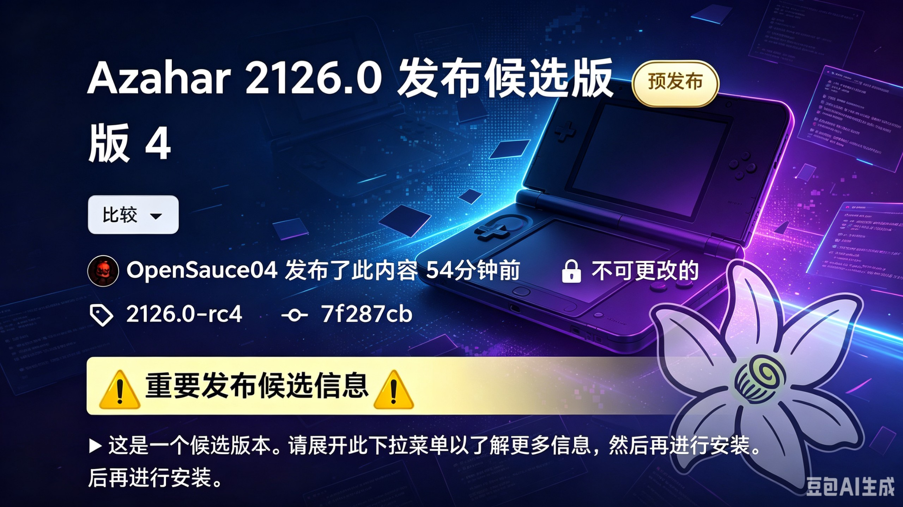

# 游戏设备周报·下 | 2026-W30 (7.25 - 7.29)

> Steam Deck销量暴跌，云掌机与AI联盟成焦点。

## 🌍 海外资讯

### Steam Deck

### 🔮 新机爆料
#### 1. Minecraft: Java Edition 系统需求在支持 Vulkan 前有所提升

《Minecraft: Java Edition》即将迎来基于 Vulkan 的重大渲染升级，Mojang 同步调整了游戏最低系统需求，旨在确保新渲染管线在 Steam Deck 等设备上获得稳定性能，具体配置已更新至官方支持页面。分析认为，Vulkan 支持将提升游戏在 Linux 和 Steam Deck 上的运行效率，但硬件门槛提高可能使部分老旧设备玩家面临升级压力。（来源：GamingOnLinux）

### 🆕 新机发售
#### 1. Steam Deck涨价翻车！销量暴跌82%
Steam Deck 在部分地区实施涨价后，市场反应剧烈，销量环比暴跌 82%。涨价涉及多款存储版本，但未公布具体幅度。分析认为，用户对价格敏感度极高，尤其在掌机市场竞争加剧背景下，涨价策略挫伤了消费意愿。Valve 的定价试水遭遇滑铁卢，说明 Steam Deck 已形成“高性价比”标签，任何背离这一认知的调整都可能引发销量雪崩。（来源：Google News）

#### 2. 吊打Steam Deck？拯救者C700云掌机来了！无网也能玩3A大作

联想发布拯救者 C700 云掌机，主打“无网也能玩 3A 大作”的混合云游戏体验，支持本地算力与云端渲染协同，离线状态下可运行部分 AAA 级游戏，直接对标 Steam Deck。具体规格和售价未完全公布，预计下半年上市。分析认为，联想以“云+端”差异化切入掌机市场，但云游戏体验依赖网络环境，离线玩 3A 效果有待验证，短期内难以撼动 Steam Deck 生态地位。（来源：Google News）

#### 3. Allogloom 是一款画面精美的点击式冒险游戏，将于10月推出

手绘风格点击式冒险游戏《Allogloom》宣布将于今年 10 月发售，登陆 PC 及 Steam Deck。游戏以诡异唯美画风和沉浸式叙事为卖点，玩家将探索充满谜题的黑暗世界。开发商已针对 Steam Deck 触控和手柄操作进行优化。分析认为，点击式冒险游戏与 Steam Deck 便携触控屏高度契合，该游戏有望成为该品类在掌机上的新标杆。（来源：GamingOnLinux）

### 📱 系统更新
#### 1. Wine 11.14 为 DirectSound、BCrypt、FreeBSD 带来改进

Wine 11.14 开发版发布，重点改进了 DirectSound 音频支持、BCrypt 加密功能及 FreeBSD 平台兼容性，进一步提升了 Windows 游戏和应用程序在 Steam Deck（基于 Linux）上的运行稳定性，尤其修复了部分老游戏的声音异常问题。分析认为，Wine 的持续迭代是 Steam Deck 游戏兼容性提升的核心驱动力。（来源：GamingOnLinux）

#### 2. GE-Proton 11-3 带来更好的 OptiScaler 集成、AMD FSR4 改进以及大量游戏修复

社区维护的兼容层 GE-Proton 11-3（及此前发布的 11-2）迎来重大更新，改进了 OptiScaler 集成，优化 AMD FSR4 技术，并修复了《赛博朋克 2077》《艾尔登法环》等数十款游戏的运行问题。该版本可通过 ProtonUp-Qt 工具安装。分析认为，GE-Proton 已成为 Steam Deck 玩家提升体验的“必备神器”，FSR4 优化将让更多游戏在低功耗下实现高画质。（来源：GamingOnLinux）

### 📋 其他资讯
#### 1. NVIDIA、Red Hat、Cloudflare、The Linux Foundation 等联合发起“开放安全AI联盟”

NVIDIA、Red Hat、Cloudflare 及 Linux 基金会等多家科技巨头联合宣布成立“开放安全 AI 联盟”，旨在共享开源工具以促进 AI 的负责任使用与信任建设，聚焦 AI 安全评估、模型透明度等标准制定，首批工具预计年底发布。分析认为，该联盟对 Steam Deck 生态具有间接意义——更安全的 AI 工具链将推动 Linux 平台 AI 应用开发，可能催生智能帧生成、语音助手等功能。（来源：GamingOnLinux）

#### 2. Valve在最新的Steam Beta中开始改进账户切换功能

Valve 在最新 Steam Beta 版本中优化账户切换体验，新增更直观的登录界面和快速切换入口，减少多用户共用设备时的操作步骤。该更新仅限 Beta 通道测试，正式版上线时间未定。分析认为，账户切换改进将提升 Steam Deck 在家庭或多人场景下的易用性，巩固其“共享游戏机”定位。（来源：GamingOnLinux）

### Windows 掌机

### 🔮 新机爆料

#### 1. 联想预告轻薄便携设备将带来无延迟PC游戏体验
联想发布预告，暗示将推出一款主打“无延迟PC游戏体验”的轻薄便携设备，可能为全新Windows掌机或云游戏串流终端。官方未公布具体型号与规格，外界猜测该设备将是拯救者系列新成员，旨在解决移动端游戏延迟痛点。此举意在抢占高端移动游戏市场，若实现“无延迟”体验，将挑战现有掌机及云游戏设备性能天花板。（来源：Google News）

#### 2. Zach Cregger承认无法超越里昂，将在新《生化危机》电影中使用原创角色

导演Zach Cregger接受PC Gamer采访时坦言，认为自己无法超越经典角色里昂·肯尼迪，决定在执导的《生化危机》电影中采用原创角色。电影处于前期筹备阶段，将围绕全新人物展开故事线，而非直接改编游戏剧情。Cregger强调原创角色能给予更大创作自由度，避免与粉丝心中经典形象冲突。该决策体现对游戏IP的尊重，但原创角色能否获粉丝认可仍是未知数。（来源：PC Gamer）

#### 3. Cyan发布20年来首款新《神秘岛》游戏预告片，随后称游戏未在开发

Cyan工作室发布名为“Project Anglerfish”的预告片，宣称是20年来首款全新《神秘岛》游戏。但工作室随后透露，该游戏未获发行商支持，目前未进入实际开发阶段，预告片仅作为概念展示以吸引投资者。Cyan表示项目虽有潜力，但缺乏商业合作导致开发无法启动。此举引发玩家热议，反映独立工作室在经典IP重启时面临的融资困境。（来源：PC Gamer）

### 🆕 新机发售

#### 1. 联想预热拯救者云游戏掌机C700：主打10ms超低延迟串流，下月登场

联想正式预热新款拯救者云游戏掌机C700，核心卖点为10ms超低延迟串流体验。该设备专为云游戏场景设计，通过优化网络协议与硬件解码降低操作延迟。官方确认C700将于下月发布，未公布售价与配置细节。业界推测将搭载专为串流优化的处理器，支持主流云游戏平台。此举标志联想正式入局云游戏硬件领域，10ms延迟若属实将提升云游戏掌机实用性。（来源：Google News）

#### 2. Valve未发布VR头显Steam Frame面临成本压力：高通计划提高芯片价格

据PC Gamer报道，高通计划上调芯片价格，给Valve尚未发布的VR头显Steam Frame带来成本压力。Steam Frame原定近期发布，但芯片涨价可能导致最终售价高于预期。Valve尚未发表官方声明，业内人士分析若成本无法消化，定价策略或将被迫调整，影响市场竞争力。芯片涨价潮波及VR硬件领域，Steam Frame需在价格与性能间找到平衡。（来源：PC Gamer）

#### 3. 美光低功耗DRAM在AI数据中心功耗约为DDR5三分之一

美光宣布其LPDDR5X内存在AI数据中心工作负载中，功耗仅为传统DDR5的三分之一，占总系统功耗不到7%。该数据表明低功耗DRAM在服务器领域具有显著能效优势。但有分析指出，低功耗内存可能牺牲部分带宽或延迟性能，在AI训练等密集型任务中未必全面优于DDR5。美光计划将LPDDR5X推广至更多数据中心客户，需平衡能效与性能。（来源：PC Gamer）

#### 4. 《Marvel Tōkon》开发者就测试版性能问题致歉，距正式发售仅剩一周

《Marvel Tōkon》开发者就PC测试版出现的性能问题向玩家致歉，此时距游戏正式发售仅剩一周。尽管存在优化问题，测试版仍打破Steam格斗游戏测试记录，显示极高玩家期待。开发者承诺在正式版中修复卡顿、掉帧等问题，优化多显卡兼容性。游戏将于下周全球上线。测试版高热度证明漫威IP号召力，但性能问题若未彻底解决可能影响首周口碑与销量。（来源：PC Gamer）

#### 5. GTA Online游戏内赌博功能在澳大利亚被屏蔽

Rockstar Games已屏蔽《GTA Online》在澳大利亚地区的游戏内赌博功能，包括钻石赌场大部分内容。此次屏蔽使澳大利亚加入全球多个限制该功能的地区行列。

### 安卓掌机

### 🔮 新机爆料

#### 1. 复古掌机周报：Anbernic RG SP、MagicX Mini Dream、Pepsiman 等更多资讯

- **新闻内容**：本周复古掌机圈迎来多款新品动态。Anbernic 翻盖机型 RG SP 与 MagicX 小尺寸机型 Mini Dream 成为焦点，前者延续经典 Game Boy Advance SP 造型，后者主打极致便携。此外，Pepsiman Recompiled 项目让 PS1 邪典游戏可在浏览器运行，同时还有多款掌机评测与模拟器更新资讯。这些新品与软件项目共同推动了复古掌机生态的活跃度。
- **简要分析**：Anbernic 与 MagicX 分别瞄准情怀与便携细分市场，表明安卓掌机厂商正通过差异化设计争夺用户。Pepsiman 的浏览器化展示了模拟器社区的技术进步，为老游戏焕发新生提供了新思路。
- **来源**: Retro Handhelds

### 🆕 新机发售

#### 1. Retroid 公布 Nova 发货日期

- **新闻内容**：Retroid 官方宣布，其夏季热门机型 Pocket Nova 将于近期开始发货。该掌机凭借“抵押贷款级”大屏幕以及比近期多数高性能设备更紧凑的机身设计，成为社区热议焦点。首批预订用户已等待数月，此次发货日期确认意味着他们即将收到这款主打便携与视觉体验的安卓掌机。
- **简要分析**：Retroid Pocket Nova 的发货标志着中端安卓掌机市场迎来新竞争者。其“小机身+大屏幕”的差异化定位，可能吸引追求便携但不愿牺牲显示效果的玩家，对同价位竞品形成压力。
- **来源**: Retro Handhelds

### 📋 其他资讯

#### 1. 宫本茂谈任天堂“游戏体验优先”策略：硬件性能不再是玩家唯一追求
- **新闻内容**：任天堂传奇制作人宫本茂近日接受采访时重申，公司坚持“游戏体验优先”策略，认为硬件性能已不再是玩家选择的唯一标准。他指出，任天堂更注重通过创意玩法和独特交互吸引用户，而非单纯堆砌芯片参数。这一表态正值掌机市场性能竞赛白热化之际，暗示任天堂未来硬件可能继续走差异化路线。
- **简要分析**：宫本茂的言论为安卓掌机厂商敲响警钟：单纯追求跑分和硬件规格可能并非长久之计。若任天堂能持续以游戏性取胜，安卓掌机需在内容生态和独占体验上寻找突破口，否则难以撼动其市场地位。
- **来源**: Google News

#### 2. Pepsiman Recompiled 让你在浏览器中畅玩这款邪典经典游戏

- **新闻内容**：开源项目 Pepsiman Recompiled 现已上线，让玩家可直接在浏览器中运行这款PS1邪典游戏。该版本支持60帧流畅运行、16:9宽屏显示、离线游玩、存档持久化以及全球排行榜功能。项目通过反编译技术将原版游戏移植到Web平台，无需模拟器即可体验，降低了游玩门槛。
- **简要分析**：Pepsiman Recompiled 展示了反编译技术在复古游戏领域的潜力。对于安卓掌机用户而言，这类浏览器化项目意味着未来可能无需安装模拟器，直接通过云端或本地Web应用畅玩经典游戏，简化了复古游戏体验流程。
- **来源**: Retro Handhelds

#### 3. Kamrui Hyper Series H2 i5-14500HX 评测

- **新闻内容**：外媒对 Kamrui Hyper Series H2 迷你主机进行了评测，该机搭载英特尔 i5-14500HX 处理器，CPU性能强劲，但受限于集成 Intel UHD Graphics，游戏表现平平。评测者指出，其图形短板使其更适合作为家庭服务器或办公机，而非游戏设备。不过，强大的CPU性能使其成为升级老旧 Proxmox 主机的理想选择。
- **简要分析**：虽然 Kamrui H2 并非掌机，但其“强CPU弱GPU”的配置思路对安卓掌机设计有参考价值。若掌机厂商能平衡功耗与图形性能，或通过外接显卡坞弥补短板，有望在便携与性能之间找到新平衡点。
- **来源**: Retro Handhelds

#### 4. 台湾当局拘留一名英伟达员工，涉嫌试图将AI芯片走私至中国

- **新闻内容**：据PC Gamer报道，台湾当局拘留了一名英伟达员工，该员工涉嫌试图将受管制的AI芯片走私至中国大陆。报道强调英伟达公司本身未被指控有任何不当行为。此事件发生在全球AI芯片出口管制收紧的背景下，可能进一步影响高端芯片的流通渠道。
- **简要分析**：该事件虽不直接涉及安卓掌机，但AI芯片的走私风波可能间接影响掌机供应链。若出口管制导致芯片短缺或价格上涨，依赖高性能芯片的安卓掌机可能面临成本压力或供货延迟。
- **来源**: PC Gamer

---
**参考资料链接列表：**
- https://news.google.com/rss/articles/CBMiTEFVX3lxTE1xVm9tQnFxZ2l5bHd6REF0cklzSzlLc3J1UzQ3SElOZlNTU0Fwa3lnOVZDdW5RWUlZUU5Jbzg4OUxVNE1YN2o5UWFLRzU?oc=5
- https://retrohandhelds.gg/retroid-announces-nova-shipping-dates/
- https://retrohandhelds.gg/pepsiman-recompiled-lets-you-play-this-cult-classic-in-your-browser/
- https://retrohandhelds.gg/retro-handhelds-weekly-edition-109/
- https://retrohandhelds.gg/kamrui-h2-14500hx-review/

### 开源掌机/Linux掌机

### 🔮 新机爆料  
（无条目）

### 🆕 新机发售  

#### 1. Game Bub 开源掌机终于开始发货  

- **新闻内容**：2025年10月报道的全球首款开源掌机Game Bub，现已正式向预订用户发货。该掌机主打完全开源设计，允许用户自由修改硬件和软件，旨在为复古游戏社区提供极致DIY体验。目前官方未公布最终零售价，早期预订用户已陆续收到设备。  
- **简要分析**：Game Bub发货标志开源掌机从概念走向量产，为社区驱动硬件开发树立新标杆，但能否持续获得社区支持并形成生态，仍是关键挑战。  
- **来源**：Retro Dodo（掌机）  

#### 2. Neo Geo AES+复古主机开启预售，起售价249美元  

- **新闻内容**：Neo Geo AES+复古主机现已开启预售，标准版起售价249美元，游戏卡带需单独购买，每张售价90美元。官方还推出包含全部游戏及配件的终极版，售价1000美元。考虑到90年代原版Neo Geo卡带经通胀调整后的价格，当前定价相对合理。  
- **简要分析**：Neo Geo AES+以高定价瞄准核心收藏玩家，通过“物理介质+怀旧情怀”实现差异化，但90美元单卡价格可能将普通玩家拒之门外，市场反应待观察。  
- **来源**：Tom's Hardware  

### 📱 系统更新  
（无条目）  

### 📋 其他资讯  

#### 1. 《迪迪金刚赛车》移植至Dreamcast  

- **新闻内容**：经典N64赛车游戏《迪迪金刚赛车》已被社区开发者成功移植至Dreamcast平台。移植版利用Dreamcast硬件特性，实现更高分辨率和更流畅帧率，同时保留原版核心玩法。目前可通过Dreamcast烧录卡或模拟器运行，为怀旧玩家提供新体验。  
- **简要分析**：此次移植再次证明Dreamcast社区强大的逆向工程与开发能力，也反映经典游戏跨平台移植已成为复古游戏生态的重要补充。  
- **来源**：Retro Dodo（掌机）  

#### 2. 《宝可梦竞技场》“儿童俱乐部”小游戏移植至PICO-8  

- **新闻内容**：开发者正将N64游戏《宝可梦竞技场》中的“儿童俱乐部”小游戏合集移植至PICO-8平台。项目旨在保留原版趣味性，同时适配PICO-8的像素风格和性能限制。目前仍在开发中，预计包含“鲤鱼王飞溅”等经典小游戏。  
- **简要分析**：PICO-8作为极简游戏开发平台，正成为复古游戏“降级移植”的热门选择，这种“反向移植”降低怀旧门槛，激发社区创作活力。  
- **来源**：Retro Dodo（掌机）  

#### 3. 《宝可梦 心金/魂银》登陆GAME BOY Advance  

- **新闻内容**：社区开发者通过逆向工程和素材重制，将NDS经典《宝可梦 心金/魂银》移植至GBA平台。移植版保留核心剧情和宝可梦收集要素，画面压缩为GBA的2D像素风格。目前ROM可在GBA实机或模拟器运行，为无法体验NDS版本的玩家提供新选择。  
- **简要分析**：该项目展示社区对经典宝可梦作品的高度热情，也反映GBA平台作为复古游戏载体的持久生命力，但版权问题可能成为传播风险。  
- **来源**：Retro Dodo（掌机）  

#### 4. Retroid Pocket Nova明日发货，价格可能上涨  

- **新闻内容**：Retroid宣布新款掌机Pocket Nova将于明日向预订用户发货。官方暗示因零部件成本上升，零售价可能在首批发货后上调。该掌机定位中端开源，搭载联发科处理器，支持PSP及以下级别游戏模拟，标准版预订价199美元。  
- **简要分析**：Retroid在发货前夕释放涨价信号，意在刺激潜在用户尽快下单，但也可能引发观望情绪。Pocket Nova能否在中端市场站稳脚跟，取决于最终定价与性能表现。  
- **来源**：Retro Dodo（掌机）  

---  
### 参考资料链接  
- [Game Bub 开源掌机终于开始发货](https://retrododo.com/the-game-bub-open-source-handheld-is-finally-shipping/)  
- [Neo Geo AES+复古主机现已开启预售](https://www.tomshardware.com/video-games/console-gaming/the-neo-geo-aes-retro-console-is-now-available-to-pre-order-starting-from-usd249-game-cartridges-cost-usd90-each-the-ultimate-edition-with-all-games-and-accessories-will-run-you-usd1-000)  
- [《迪迪金刚赛车》已移植至Dreamcast](https://retrododo.com/diddy-kong-racing-has-been-ported-to-the-dreamcast/)  
- [《宝可梦竞技场》的“儿童俱乐部”小游戏正在被移植到PICO-8](https://retrododo.com/magikarps-splash/)  
- [《宝可梦 心金/魂银》现已登陆GAME BOY Advance](https://retrododo.com/pokemon-heartgold-and-soulsilver-have-been-ported-to-the-game-boy-advance/)  
- [Retroid的Pocket Nova明日发货，价格可能上涨](https://retrododo.com/retroids-pocket-nova-ships-tomorrow-and-the-price-may-increase/)

### PlayStation

### 🔮 新机爆料
#### 1. 索尼发布最严格社交媒体准则，前开发者谈实体光盘争议

- **新闻内容**：在PlayStation宣布逐步淘汰实体光盘引发玩家强烈反弹后，索尼已向其第一方工作室员工发布了有史以来最严格的社交媒体准则。一位前第一方开发者向Eurogamer透露，此举并不意外，索尼内部正全力管控舆论，避免开发人员公开讨论实体介质话题。该准则要求员工在个人社交账号上不得就公司硬件策略发表任何未经授权的看法。
- **简要分析**：此举反映索尼在转向全数字化战略时面临内部沟通压力。严格管控虽能暂时压制争议，但可能加剧外界对索尼“封闭”和“不透明”的负面印象，损害品牌与核心玩家的信任。
- **来源**: Eurogamer

### 🆕 新机发售
#### 1. PS5版《光环》正式发售，主机圈“活久见”

- **新闻内容**：7月28日，PS5版《光环：战役进化》正式发售。这款原为Xbox独占、2001年与初代Xbox同步推出的第一人称射击游戏，如今登陆索尼平台，堪称历史性时刻。购买豪华版的玩家已可抢先体验，进入游戏需绑定微软账号。微软看中PS5庞大的装机量，索尼则借此吸引竞争对手头部IP入驻，双方各取所需。
- **简要分析**：微软将最具代表性的IP移植到PS5，标志平台独占壁垒加速瓦解。此举不仅带来直接收入，也传递信号：跨平台发行已成趋势，独占策略的“护城河”效应正在减弱。
- **来源**: 触乐

### 📱 系统更新
#### 1. 《007 First Light》发布首个重大补丁，PS5版更新显著

- **新闻内容**：《007 First Light》发布发售后首个重大更新，补丁版本1.1.0。据Eurogamer报道，该补丁针对社区和内部测试人员报告的超过200个问题进行了修复和改进，涵盖性能优化、Bug修复及游戏平衡性调整。在PS5上体验的玩家将显著提升游戏稳定性和流畅度。
- **简要分析**：发售后迅速推出大规模修复补丁，体现开发团队对玩家反馈的重视。及时解决首发问题有助于挽回口碑，为后续内容更新和长期运营打下基础。
- **来源**: Eurogamer

### 📋 其他资讯
#### 1. 实体光盘停产引发众怒，亚马逊和百思买上线PlayStation实体游戏促销

- **新闻内容**：在PlayStation宣布计划于2028年前停止实体光盘制造和销售、引发玩家大规模抗议后，亚马逊和百思买等零售商迅速上线PlayStation实体游戏促销活动。此举被解读为在实体介质“末日前”清库存，也为愤怒的玩家提供低价囤积实体游戏的机会。目前多款第一方大作均有折扣。
- **简要分析**：零售商借争议热点促销，既消化库存，也迎合玩家对实体版的“最后留念”心理。这一现象侧面印证实体光盘仍有忠实用户群，索尼的全数字化路线面临的市场阻力不容小觑。
- **来源**: Google News

#### 2. 玩家请愿“断电一周”抗议索尼全数字化未来
- **新闻内容**：针对索尼计划在2028年前全面淘汰实体光盘的决策，玩家社区抗议行动持续升级。一项新请愿呼吁所有PlayStation用户在8月某一周内拔掉PS5电源插头，以“断电一周”表达对全数字化未来的不满。此前已有多个请愿获得大量签名，索尼官方社交账号下也充斥着负面评论。Eurogamer报道称，抗议正从线上蔓延至实际行动。
- **简要分析**：“断电抗议”象征意义大于实际影响，但反映核心玩家对索尼战略的强烈抵触情绪。如果索尼不做出妥协或沟通，这种情绪可能转化为对PS6初期销量的实质性冲击。
- **来源**: Eurogamer

#### 3. 《光与暗：远征33号》主创批评索尼停止光盘发行，称“实体版具有特殊意义”

- **新闻内容**：《光与暗：远征33号》主创团队公开批评PlayStation停止光盘发行的决定，称其为“令人遗憾的决定”。该团队透露，他们刚购买了自家RPG游戏的实体版，并强调“实体版对我们而言具有特殊意义”。尽管光盘制造成本更高，但他们认为实体介质是游戏文化中不可替代的组成部分。GamesRadar报道称，这是又一家知名开发商公开反对索尼的全数字化战略。
- **简要分析**：来自开发者的反对声音比玩家抗议更具分量。当第一方和第三方开发者都开始质疑实体介质消亡的合理性时，索尼需重新评估其激进策略可能带来的生态连锁反应，尤其是对收藏版、典藏版等高端实体产品的冲击。
- **来源**: GamesRadar

### Xbox

### 🔮 新机爆料
#### 1. Xbox 在 Double Fine 裁员 25% 并转型为独立状态后发声

- **新闻内容**：以2005年平台游戏《脑航员》闻名的开发商Double Fine，在Xbox大规模重组三周后，宣布裁员25.6%并转型为独立工作室。Xbox官方回应表示支持团队独立发展，但未透露具体财务安排。此次裁员涉及约30名员工，工作室将不再隶属于Xbox游戏工作室群。
- **简要分析**：Double Fine的独立化标志着Xbox在收购工作室后调整策略，通过剥离非核心团队优化成本结构，但可能削弱第一方创意多样性。
- **来源**: IGN

### 🆕 新机发售
#### 1. 微软 Xbox 向下兼容功能官宣拓展至XBOX ON PC 平台：初代四款作品适配，后续将新增更多游戏

- **新闻内容**：微软正式宣布将Xbox向下兼容功能拓展至PC平台，首批适配四款初代Xbox作品，包括《光环：战斗进化》《忍者龙剑传》等经典游戏。该功能通过模拟器技术实现，支持Xbox手柄及部分主机兼容硬件。微软承诺后续每月新增更多兼容游戏，并计划在2026年底前覆盖超过100款作品。
- **简要分析**：此举打破主机与PC平台壁垒，通过向下兼容吸引老玩家回归，同时为Xbox Game Pass PC版扩充内容库，增强订阅服务竞争力。
- **来源**: Google News

### 📋 其他资讯
#### 1. Xbox服务现已中断，玩家无法游玩任何数字版或实体版游戏，而上周PlayStation Network也出现类似问题。

- **新闻内容**：7月26日，Xbox全球服务发生严重中断，持续约16小时，导致玩家无法登录、购买或下载游戏，实体版游戏也无法运行。故障影响Xbox One、Series X|S及部分PC用户，一周前PlayStation Network也遭遇类似宕机。Xbox官方在服务恢复后确认问题源于外部许可服务故障。
- **简要分析**：连续两周主机网络服务瘫痪暴露云依赖风险，玩家对数字版游戏信任度可能下降，迫使平台加速本地化离线验证方案。
- **来源**: Eurogamer

#### 2. Xbox CTO 解释服务中断原因，向玩家致歉，并概述后续改进措施

- **新闻内容**：Xbox首席技术官Scott Van Vliet就7月26日服务中断事件发表声明，承认故障导致玩家无法游玩数字版和实体版游戏，并公开致歉。他解释称，一个外部许可服务系统出现故障，影响Xbox平台认证流程，导致三代主机无法正常启动游戏。Van Vliet承诺将引入冗余备份系统，优化故障切换机制，确保类似事件不再发生。
- **简要分析**：CTO公开道歉和详细技术解释有助于重建用户信任，但“外部服务”归因可能引发对Xbox供应链依赖性的质疑。
- **来源**: Eurogamer

#### 3. 16小时Xbox服务中断甚至导致实体游戏无法运行——公司归咎于许可问题，称事件致使三代主机无法进行游戏

- **新闻内容**：Tom's Hardware报道，Xbox CTO Scott Van Vliet确认7月26日16小时服务中断源于外部许可服务故障。该服务负责验证游戏授权，其失效导致Xbox One、Series X|S及初代Xbox均无法运行任何游戏，包括实体光盘版。Van Vliet表示团队已修复问题并加强监控，但未透露外部服务提供商具体信息。
- **简要分析**：实体游戏因许可服务中断而失效，凸显“物理介质”在数字时代已名存实亡，玩家对游戏所有权的认知面临根本性挑战。
- **来源**: Tom's Hardware

#### 4. Xbox已恢复在线，技术负责人承诺“我们会做得更好”，确保类似故障“不会再毁掉你的夜晚”

- **新闻内容**：GamesRadar报道，Xbox服务在中断16小时后全面恢复，CTO Scott Van Vliet在声明中强调：“我不在乎单行根因，重要的是确保类似故障不会再毁掉你的夜晚。”他承诺改进服务架构，包括增加本地缓存许可数据功能，使玩家在离线状态下也能游玩已购买游戏。目前Xbox所有功能已恢复正常，用户无需额外操作。
- **简要分析**：技术负责人以玩家体验为中心的承诺值得肯定，但“本地缓存”方案能否彻底解决离线游玩问题，仍需后续更新验证。
- **来源**: GamesRadar

#### 5. 分析师称Xbox Game Pass未能达到订阅目标，因大多数人不会玩很多游戏，转向独立游戏也无法挽救局面

- **新闻内容**：行业分析师指出，Xbox Game Pass未能达成内部订阅目标，核心原因在于大多数玩家不会在订阅期内游玩大量游戏。即便微软近期转向引入更多独立游戏以丰富内容库，分析师仍认为“如果有什么能奏效，那他们早就试过了”，并直言“我看不到解决方案”。该分析基于用户行为数据调研，显示平均订阅者每月仅游玩2-3款游戏。
- **简要分析**：Game Pass的“自助餐”模式面临用户消费习惯瓶颈，单纯增加游戏数量无法提升活跃度，微软可能需要探索分层订阅或按需付费模式。
- **来源**: GamesRadar

### 任天堂 Switch

### 🔮 新机爆料

#### 1. 《拔天海拓史》重制版开发者协助《异度神剑》Switch 2版开发

- **新闻内容**：任天堂邀请外部开发商协助第一方游戏更新，日本开发商Logicalbeat参与《异度神剑：决定版》Switch 2版本开发。该公司官网及代表董事Domae Yoshiki确认，其团队协助实现了4K分辨率与60帧性能增强。
- **简要分析**：任天堂借助外部技术优化Switch 2游戏表现，第三方工作室在次世代移植中角色日益重要，有助于缓解第一方开发压力。
- **来源**: Nintendo Life

#### 2. 《最终幻想14：永寒之寒》扩展预告片公布，新职业与联动突袭系列宣布

- **新闻内容**：Square Enix发布《最终幻想14 Online》第六个扩展包“永寒之寒”全新预告，确认2027年1月登陆任天堂新平台，公布新职业及联动突袭系列，展示冰封世界场景与战斗机制。
- **简要分析**：作为MMO标杆，《最终幻想14》登陆Switch 2并同步扩展内容，将丰富新平台在线游戏阵容，吸引核心MMO玩家。
- **来源**: Nintendo Life

#### 3. 《异度神剑2》Switch 2版预估文件大小公布

- **新闻内容**：《异度神剑2》Switch 2版将于下周发售，任天堂eShop显示预估文件大小为45.8 GB，相比原版13.2 GB大幅增加。任天堂提示发售前后可能变动。
- **简要分析**：45.8GB容量暗示包含高分辨率纹理与增强素材，符合4K/60帧升级需求，但对玩家存储空间提出更高要求。
- **来源**: Nintendo Life

#### 4. 《最终幻想14》将于今年晚些时候登陆Switch 2，附带免费试玩版，文件大小庞大

- **新闻内容**：今年4月公布的《最终幻想14》Switch 2版确认8月发售，官方同步发布“永寒之寒”扩展预告。版本包含免费试玩内容，文件大小极为庞大，具体容量未公布。
- **简要分析**：免费试玩版是吸引新玩家的关键策略，但庞大文件体积可能成为便携设备用户顾虑，任天堂需优化存储方案。
- **来源**: Eurogamer

#### 5. 宫本茂认为人们不再关心主机规格，任天堂提供“只有我们才能创造的游戏玩法”

- **新闻内容**：任天堂制作人宫本茂表示，消费者对图形和性能的关心程度已下降，强调任天堂核心竞争力在于提供“只有我们才能创造的游戏玩法”，而非追逐硬件规格竞赛。
- **简要分析**：宫本茂延续“玩法优先”理念，为Switch 2在性能非顶尖情况下提供差异化竞争策略。
- **来源**: Eurogamer

#### 6. 世嘉宣布《疯狂出租车：世界巡游》登陆Switch 2

- **新闻内容**：世嘉公布《疯狂出租车：世界巡游》将登陆Switch 2，预计2027年发售。该系列上一款作品可追溯至2017年，此次重启伴随新预告片，展示经典快节奏载客玩法。
- **简要分析**：世嘉重启经典IP并选择Switch 2作为首发平台，体现对新主机装机量的信心，填补复古游戏阵容空白。
- **来源**: Nintendo Everything

### 🆕 新机发售

#### 1. 007《First Light Switch 2》发布日期可能泄露
- **新闻内容**：据Google News聚合信息，007系列游戏《First Light》Switch 2版本发布日期可能通过商店页面泄露。该游戏此前因性能优化问题延期，泄露日期暗示开发接近完成，官方尚未确认。
- **简要分析**：延期后泄露日期表明优化问题基本解决，但未经官方证实的信息需谨慎对待，建议关注开发商后续公告。
- **来源**: Google News (via Switch 2)

### 📋 其他资讯

#### 1. Bethesda游戏登陆Switch 2
- **新闻内容**：据Google News聚合信息，Bethesda多款游戏确认将登陆Switch 2。具体阵容未完整公布，考虑到此前已带来《上古卷轴5：天际》《毁灭战士》等作品，此次可能包含《星空》或《夺宝奇兵》等新作移植版本。
- **简要分析**：Bethesda作为微软旗下工作室，其游戏登陆Switch 2意味着跨平台合作深化，有望为任天堂平台带来更多3A级RPG与射击游戏。
- **来源**: Google News (via Switch 2)

### 模拟器资讯

### 🆕 新机发售

#### 1. 微软为用户送大礼！移植初代Xbox游戏到PC：同步放出官方模拟器

微软近日将一批初代Xbox经典游戏移植至PC平台，并同步发布官方模拟器，用于在Windows系统上运行这些作品。此举让《光环：战斗进化》等老游戏重获新生，并通过官方模拟器确保兼容性与性能优化。移植版已在Microsoft Store上架，模拟器随游戏免费提供，支持4K分辨率与键鼠操作。

**简要分析**：微软通过官方模拟器打通Xbox与PC生态壁垒，既保护经典游戏资产，又为玩家提供便捷怀旧途径。该策略可能推动其他厂商效仿，加速主机游戏跨平台移植标准化进程。

---

### 📋 其他资讯

#### 1. PS5模拟器再取重大进展！已到《给他爱5》北扬克顿

PS5模拟器SharpEmu近日取得突破性进展，已成功进入《GTA 5》加载画面并抵达北扬克顿区域。开发者表示，模拟器目前能渲染部分游戏场景，但帧率较低且存在图形错误。这是继去年实现基础启动后，SharpEmu首次在3A游戏中达到可交互状态，标志着PS5模拟进入新阶段。

**简要分析**：SharpEmu的进展表明PS5模拟器正从“能启动”迈向“能游玩”，但距离流畅运行仍有数年差距。该突破可能刺激更多开发者投入，但也可能引发索尼对版权保护的进一步强化。

#### 2. PS5模拟器SharpEmu新进展：已可进入《GTA 5》加载画面

PS5模拟器SharpEmu最新版本已能进入《GTA 5》加载画面，并短暂显示游戏内模型。开发团队在GitHub上透露，模拟器目前支持部分PS5图形API调用，但CPU指令翻译效率仍是瓶颈。该版本基于开源框架构建，社区已贡献超过200次代码提交，目标是在年底前实现可玩帧率。

**简要分析**：SharpEmu迭代速度超出预期，但PS5定制硬件架构仍是模拟最大障碍。若社区能持续优化，未来两年内或可运行部分2D/轻量级3D游戏，但大型3A作品仍需更长时间。

### 游戏外设

### 📋 其他资讯

#### 1. 我一直避免入手Switch 2 Pro手柄，但一款《塞尔达传说》主题型号的到来可能会改变这一点。

- **新闻内容**：据外媒GamesRadar报道，传闻任天堂可能正在开发一款《塞尔达传说》主题的Switch 2 Pro手柄。此前，不少玩家因价格或功能原因对标准版Pro手柄持观望态度，但一款带有经典塞尔达元素（如大师剑或海拉尔纹章）的限定版，可能会大幅提升吸引力。目前任天堂尚未官方确认该产品，但爆料称其设计已接近完成。
- **简要分析**：限定主题外设一直是任天堂拉动硬件销量的利器。若该手柄成真，不仅能刺激Switch 2 Pro手柄的销量，还能进一步巩固《塞尔达传说》IP的周边生态，对核心粉丝有极强号召力。
- **来源**：GamesRadar

#### 2. 这款可同时播放两个音源的舒适游戏耳机售价25美元

- **新闻内容**：EPOS H3 Hybrid游戏耳机目前在Woot平台以24.99美元促销，仅为原价99.99美元的25%。这款耳机支持同时播放两个音源——可通过USB-A和3.5mm接口分别连接不同设备，让玩家在游戏时还能接听手机通话或收听其他音频。它采用有线设计，佩戴舒适，适合预算有限但追求多功能的用户。
- **简要分析**：EPOS H3 Hybrid的降价幅度惊人，凸显了有线耳机在无线时代仍具性价比优势。其双音源功能是差异化卖点，尤其适合需要同时处理游戏与通讯的玩家，但品牌需注意后续产品迭代以维持竞争力。
- **来源**：The Verge

#### 3. Iniu 10,000mAh移动电源可将Nintendo Switch 2游戏时间延长一倍以上，售价不到10美元

- **新闻内容**：据IGN报道，Iniu推出的一款10,000mAh移动电源目前售价不到10美元，专为Nintendo Switch 2设计。该移动电源支持边玩边充，可将Switch 2的续航时间延长一倍以上，适合长途旅行或外出场景。其小巧轻便的机身兼容USB-C输出，无需额外转接线即可直连主机，性价比极高。
- **简要分析**：Switch 2的续航一直是玩家痛点，Iniu这款低价高容量的移动电源精准切入市场。不到10美元的价格几乎无竞品可比，可能带动第三方配件厂商进一步压低Switch 2配件价格，利好消费者。
- **来源**：IGN

---
**参考资料链接：**
- https://www.gamesradar.com/hardware/gaming-controllers/ive-avoided-picking-up-the-switch-2-pro-controller-but-the-arrival-of-a-legend-of-zelda-model-could-change-that/
- https://www.theverge.com/gadgets/972021/epos-h3-hybrid-wired-gaming-headset-deal-sale
- https://www.ign.com/articles/the-iniu-10000mah-power-bank-will-more-than-double-nintendo-switch-2-play-time-for-less-than-10

## 参考资料链接列表

1. [Google News] Steam Deck涨价翻车！销量暴跌82%: https://news.google.com/rss/articles/CBMiSEFVX3lxTE8xZWdRUkZiV0t4SGJOREJ5VHh4MDMtclgtOERvZmduclFVVkJldWNNVUN6Ylk5RENOZlNlek11bE55N2tzTVl5Mw?oc=5
2. [Google News] 吊打Steam Deck？拯救者C700云掌机来了！无网也能玩3A大作...: https://news.google.com/rss/articles/CBMilwFBVV95cUxQQVYwdDMzNE13YkI4RWdIVXhYTzZGbi03Y1UyTnA0bENrcUJILVVQVTFad1d4b0ZuTGZpcUFiWEZTVnVTOHVCTVkyOEx3M25fR3o1em5iNFIwdjdVb0VXVkJWeDRJRDVrQWVIMk9WM1JxVzRLdjZwNmJRUXVCT3BLeW9kRmF1Z3h3R203UHBLWlg0RkJyR3Jj?oc=5
3. [GamingOnLinux] Minecraft: Java Edition system requirements get bumped up ahead of Vulkan support: https://www.gamingonlinux.com/2026/07/minecraft-java-edition-system-requirements-get-bumped-up-ahead-of-vulkan-support/
4. [GamingOnLinux] NVIDIA, Red Hat, Cloudflare, The Linux Foundation and more launch the "Open Secure AI Alliance": https://www.gamingonlinux.com/2026/07/nvidia-red-hat-cloudflare-the-linux-foundation-and-more-launch-the-open-secure-ai-alliance/
5. [GamingOnLinux] Allogloom is a gorgeous looking point and click adventure launching in October: https://www.gamingonlinux.com/2026/07/allogloom-is-a-gorgeous-looking-point-and-click-adventure-launching-in-october/
6. [GamingOnLinux] Wine 11.14 brings improvements for DirectSound, BCrypt, FreeBSD: https://www.gamingonlinux.com/2026/07/wine-11-14-brings-improvements-for-directsound-bcrypt-freebsd/
7. [GamingOnLinux] GE-Proton 11-3 brings better OptiScaler integration, AMD FSR4 improvements and lots of game fixes: https://www.gamingonlinux.com/2026/07/ge-proton-11-3-brings-better-optiscaler-integration-amd-fsr4-improvements-and-lots-of-game-fixes/
8. [GamingOnLinux] Valve begin improving account switching in the latest Steam Beta: https://www.gamingonlinux.com/2026/07/valve-begin-improving-account-switching-in-the-latest-steam-beta/
9. [Google News] 联想预告即将推出的轻薄便携式设备将带来无延迟的PC游戏体验: https://news.google.com/rss/articles/CBMiX0FVX3lxTFBINVdIbE8xYW0tN3o0MWYxWUQ3UHpyOFpvLURYbEZDTERCQWlDQktmNVpzSi01X3k2OUYycDZ2Z0VfNHJMMTVRdWM0djlqODJGTXV0OVlnM1cyN1dIVlI0?oc=5
10. [Google News] 联想预热拯救者云游戏掌机 C700：主打 10ms 超低延迟串流体验，下月登场: https://news.google.com/rss/articles/CBMiTEFVX3lxTE9POWNOMnpBWnk2THpzWVl3aDI2d0xveXpTZWxIWUpkelNiMTRKZk1qaVJUZEdIcTlZZEFhaWhTYkRScGh4LWstZWVwNkc?oc=5
11. [Google News] 老掌机获新生，开发者通过串流让索尼 PS Vita 玩上微软 XGP 大作: https://news.google.com/rss/articles/CBMiZEFVX3lxTE9vYy1pUFRGV0hsOWJnU3hwb3Q3N0M3eGpIZmY4YkZXelJxSFFqN2F0TjhPMVpUN1h3M1ZFd2E3LTlqZ0pFRHppSHVlTkhHQTBOc1FEUjhGaFd3R3RoaHVpaTJNaWc?oc=5
12. [PC Gamer] Zach Cregger admits 'I'm not going to be able to improve on Leon' which is why he's using original characters for the upcoming Resident Evil movie: https://www.pcgamer.com/movies-tv/zach-cregger-admits-im-not-going-to-be-able-to-improve-on-leon-which-is-why-hes-using-original-characters-for-the-upcoming-resident-evil-movie/
13. [PC Gamer] Cyan releases teaser for the first new Myst game in 20 years, then breaks the news that it's not actually being made: https://www.pcgamer.com/games/adventure/cyan-releases-teaser-for-the-first-new-myst-game-in-20-years-then-breaks-the-news-that-its-not-actually-being-made/
14. [PC Gamer] More bad news for Valve and its still unreleased Steam Frame as Qualcomm is set to raise the price of its chips, like everyone else: https://www.pcgamer.com/hardware/vr-hardware/more-bad-news-for-valve-and-its-still-unreleased-steam-frame-as-qualcomm-is-set-to-raise-the-price-of-its-chips-like-everyone-else/
15. [PC Gamer] Micron's low power DRAM 'consumes approximately one-third the power of DDR5' in AI data center workloads, but I'm not sure that's good news: https://www.pcgamer.com/hardware/memory/microns-low-power-dram-consumes-approximately-one-third-the-power-of-ddr5-in-ai-data-center-workloads-but-im-not-sure-thats-good-news/
16. [PC Gamer] Marvel Tōkon's developer has apologised to PC players for the beta's performance issues, with only a week until launch: https://www.pcgamer.com/games/fighting/marvel-tokons-developer-has-apologised-to-pc-players-for-the-betas-performance-issues-with-only-a-week-until-launch/
17. [PC Gamer] GTA Online in-game gambling is now blocked in Australia: https://www.pcgamer.com/gaming-industry/gta-online-in-game-gambling-is-now-blocked-in-australia/
18. [Google News] 宫本茂谈任天堂“游戏体验优先”策略：硬件性能不再是玩家唯一追求: https://news.google.com/rss/articles/CBMiTEFVX3lxTE1xVm9tQnFxZ2l5bHd6REF0cklzSzlLc3J1UzQ3SElOZlNTU0Fwa3lnOVZDdW5RWUlZUU5Jbzg4OUxVNE1YN2o5UWFLRzU?oc=5
19. [Retro Handhelds] Retroid Announces Nova Shipping Dates: https://retrohandhelds.gg/retroid-announces-nova-shipping-dates/
20. [Retro Handhelds] Pepsiman Recompiled Lets You Play This Cult-Classic in Your Browser: https://retrohandhelds.gg/pepsiman-recompiled-lets-you-play-this-cult-classic-in-your-browser/
21. [Retro Handhelds] Retro Handhelds Weekly: Anbernic RG SP, MagicX Mini Dream, Pepsiman, and More: https://retrohandhelds.gg/retro-handhelds-weekly-edition-109/
22. [Retro Handhelds] Kamrui Hyper Series H2 i5-14500HX Review: https://retrohandhelds.gg/kamrui-h2-14500hx-review/
23. [PC Gamer] Taiwanese authorities detain Nvidia employee for alleged attempt to smuggle AI chips into China: https://www.pcgamer.com/hardware/taiwanese-authorities-detain-nvidia-employee-for-alleged-attempt-to-smuggle-ai-chips-into-china/
24. [Retro Dodo (掌机)] The Game Bub Open Source Handheld Is Finally Shipping: https://retrododo.com/the-game-bub-open-source-handheld-is-finally-shipping/
25. [Tom's Hardware] The Neo Geo AES+ retro console is now available to pre-order starting from $249 — game cartridges cost $90 each; the Ultimate Edition with all games and accessories will run you $1,000: https://www.tomshardware.com/video-games/console-gaming/the-neo-geo-aes-retro-console-is-now-available-to-pre-order-starting-from-usd249-game-cartridges-cost-usd90-each-the-ultimate-edition-with-all-games-and-accessories-will-run-you-usd1-000
26. [Retro Dodo (掌机)] Diddy Kong Racing Has Been Ported To The Dreamcast: https://retrododo.com/diddy-kong-racing-has-been-ported-to-the-dreamcast/
27. [Retro Dodo (掌机)] Pokémon Stadium's 'Kids' Club' Minigames Are Being Demade For PICO-8: https://retrododo.com/pokemon-stadiums-kids-club-minigames-are-being-demade-for-pico-8/
28. [Retro Dodo (掌机)] Pokémon Heart Gold & Soul Silver Is Now On GAME BOY Advance (Again): https://retrododo.com/pokemon-heart-gold-soul-silver-is-now-on-game-boy-advance/
29. [Retro Dodo (掌机)] Retroid's Pocket Nova Ships Tomorrow & Could Possibly Increase In Price: https://retrododo.com/retroids-pocket-nova-ships-tomorrow-could-possibly-increase-in-price/
30. [Google News] 在实体光盘停产引发众怒之际，亚马逊和百思买已上线PlayStation实体游戏促销活动: https://news.google.com/rss/articles/CBMia0FVX3lxTE13bjRNeDNiajJNZ3hBNjVfdmZqaUc3SjhEU2xOWmY2ajJlY3FxT091RWsxLXJQWG1HdWg4WXJFckZmMUU5X01YbDA4Y3NTLWJYOEZveW9HbDVTMG5yNmxLeG1JYWdyS3RmYlBv?oc=5
31. [Eurogamer] "Sony had the strictest social media guidelines they've ever seen issued," says former first-party dev about physical disc backlash: https://www.eurogamer.net/sony-disc-backlash-no-surprise-says-former-dev
32. [触乐] 触乐怪话：活久见的PS5版《光环》来了！: http://www.chuapp.com/article/291511.html
33. [Eurogamer] 007 First Light's first major patch is here – and it's a doozy if you're playing on PS5: https://www.eurogamer.net/007-first-light-first-major-patch-details
34. [Eurogamer] Will you power down your PS5 for a week in protest of Sony's all-digital future? A new petition encourages you to pull the plug on PlayStation: https://www.eurogamer.net/playstation-blackout-physical-media-august-protest
35. [GamesRadar] Clair Obscur: Expedition 33 leads call PlayStation killing discs a "sad decision" after buying boxed copies of their own RPG – "For us, physical was something special": https://www.gamesradar.com/games/rpg/clair-obscur-expedition-33-leads-call-playstation-killing-discs-a-sad-decision-after-buying-boxed-copies-of-their-own-rpg-for-us-physical-was-something-special/
36. [Google News] 微软 Xbox 向下兼容功能官宣拓展至XBOX ON PC 平台：初代四款作品适配，后续将新增更多游戏: https://news.google.com/rss/articles/CBMiTEFVX3lxTFBDYWVXZ3BuTjRxclBTaEZFZGJwQUl0LXVvQzJWNmRPMDBKYjZrOVhfQUdhU2kwNWlmb2RHVl9ZQU5YSGVmc0tnUlBLdFg?oc=5
37. [IGN] Xbox Speaks Out After Double Fine Lays Off 25 Percent of Staff in Transition to Independent Status: https://www.ign.com/articles/xbox-speaks-out-after-double-fine-lays-off-25-percent-of-staff-in-transition-to-independent-status
38. [Eurogamer] Xbox service is down, with outages meaning players can't play any digital or physical games, after similar PlayStation Network issues last week: https://www.eurogamer.net/xbox-outage-july-2026
39. [Eurogamer] Xbox CTO explains what caused the Xbox outage, apologises to players, and outlines what's being done going forward: https://www.eurogamer.net/xbox-outage-response-failing-service-apology
40. [Tom's Hardware] 16-hour Xbox outage even stopped physical games from working — company blames licensing issue for incident that prohibited gaming across three generations of console: https://www.tomshardware.com/video-games/xbox/xbox-blames-a-licensing-service-outside-xbox-for-the-16-hour-outage-that-blocked-disc-games
41. [GamesRadar] Xbox is back online, tech lead pledges "we'll do better" so similar failures "can't ruin your night again" after outage stopped fans playing digital and physical games: https://www.gamesradar.com/games/xbox-is-back-online-tech-lead-pledges-well-do-better-so-similar-failures-cant-ruin-your-night-again-after-outage-stopped-fans-playing-digital-and-physical-games/
42. [GamesRadar] Xbox Game Pass failed to hit subscriber targets because most people don't play lots of games, says analyst, and going indie won't save it: "I don't see a solution": https://www.gamesradar.com/platforms/xbox/xbox-game-pass-failed-to-hit-subscriber-targets-because-most-people-dont-play-lots-of-games-says-analyst-and-going-indie-wont-save-it-i-dont-see-a-solution/
43. [Nintendo Life] Baten Kaitos Remaster Dev Helped Out With Xenoblade Chronicles' Switch 2 Edition: https://www.nintendolife.com/news/2026/07/baten-kaitos-remaster-dev-helped-out-with-xenoblade-chronicles-switch-2-edition
44. [Nintendo Life] Round Up: Final Fantasy XIV: Evercold Extended Teaser Revealed, New Job And Crossover Raid Series Announced: https://www.nintendolife.com/news/2026/07/round-up-final-fantasy-xiv-evercold-extended-teaser-revealed-new-job-and-crossover-raid-series-announced
45. [Nintendo Life] Xenoblade Chronicles 2 - Nintendo Switch 2 Edition Estimated File Size Revealed: https://www.nintendolife.com/news/2026/07/xenoblade-chronicles-2-nintendo-switch-2-edition-estimated-file-size-revealed
46. [Eurogamer] Final Fantasy 14 comes to Switch 2 later this year with the now-famous free trial, but the file size is going to be absolutely massive: https://www.eurogamer.net/final-fantasy-14-evercold-teaser-trailer-switch-2-details
47. [Eurogamer] Shigeru Miyamoto thinks people don't care about console specs that much anymore, believes Nintendo instead provides "gameplay that only we can create": https://www.eurogamer.net/shigeru-miyamoto-nintendo-switch-hardware-comments
48. [Nintendo Everything] SEGA announces Crazy Taxi: World Tour for Nintendo Switch 2 [update: new trailer]: https://nintendoeverything.com/sega-announces-crazy-taxi-world-tour-for-nintendo-switch-2/
49. [Google News (via Switch 2)] 007《First Light Switch 2》的发布日期可能已泄露，此前该游戏曾因优化而推迟发布: https://news.google.com/rss/articles/CBMifEFVX3lxTFBMS1pYQVZ6LVVubnczbXV3cjVYVXpNaHBFUWk3TXVQREx5MHBnckdyLVBGRnhqandIVmJva0FrYXhuck9kX3pmRFhUOTltRFhWNGZuOVNkUU1tbUplZS1VWFZ4ZlMwNG8xN3VCX3RPZ1ZEcktzTnU3RWxWRTM?oc=5
50. [Google News (via Switch 2)] Bethesda游戏登陆Nintendo Switch™ 2: https://news.google.com/rss/articles/CBMif0FVX3lxTE1xamJYbTdyWW1TclVfY0Q1VHpFWFB4bzNWTkRibzZUSXRuM2pDMnFjNVJIcXJKN0hrTnZBU19WZnNhcTJRZGZfZXRUelpIZVh2Q29tMnFsdnRmMjg1d1BUaEdBR05LVXN3N0dCWWlELTV3VDRIeFl1N1U3c2Q5Q00?oc=5
51. [Google News] 微软为用户送大礼！移植初代Xbox游戏到PC：竟同步放出官方模拟器: https://news.google.com/rss/articles/CBMijgFBVV95cUxNOWdrMzVXLV9JajNHVnlfSnppR2syem94WXZLMzFMZlh6Q0JoQUNOSGRIVDBnVlVVZHJvaG15OGJ5ek5WY3pULTk4Q3E0OG9fYUJnb3hxSlVaT2xKbGVkZllLdk9mcVQ3T3F5S1Zka2U3ZG45RTAtZ2dHaXdRUXp4anV5WjZ4VEp2MXdKd19R?oc=5
52. [Google News] PS5模拟器再取重大进展！已到《给他爱5》北扬克顿: https://news.google.com/rss/articles/CBMiZEFVX3lxTE5fSTdxdzFTVzBRWVpmaXNnay1PVFBoNnJfQUdpcm9xT2VQWEs0ZjlLYnRjTEpfNnp0LVlKdjZWSVh6NXM3Z0tmYmFFNUlUTlRpdWg0WHFSb3BYSGtrVzliOWhKT1k?oc=5
53. [Google News] PS5 模拟器 SharpEmu 新进展：已可进入《GTA 5》加载画面: https://news.google.com/rss/articles/CBMiVkFVX3lxTE9aelBOX3l2U1Q1NFE2UWkxeS02VFJ3RFdUM2pNcEJhMlVRSlFibmRpSmhPZXJ4QkxLNDJ2UWVGQlRFeUFLU1JtSGdhMFRVYlUwTmg5OWh3?oc=5
54. [GamesRadar] I've avoided picking up the Switch 2 Pro Controller, but the arrival of a Legend of Zelda model could change that: https://www.gamesradar.com/hardware/gaming-controllers/ive-avoided-picking-up-the-switch-2-pro-controller-but-the-arrival-of-a-legend-of-zelda-model-could-change-that/
55. [The Verge] This comfy gaming headset that can play audio from two sources is $25: https://www.theverge.com/gadgets/972021/epos-h3-hybrid-wired-gaming-headset-deal-sale
56. [IGN] The Iniu 10,000mAh Power Bank Will More Than Double Nintendo Switch 2 Play Time for Less Than $10: https://www.ign.com/articles/the-iniu-10000mah-power-bank-will-more-than-double-nintendo-switch-2-play-time-for-less-than-10

## 🇨🇳 国内资讯

### Steam Deck

### 🆕 新机发售

#### 1. GPD Win Max3将亮相ChinaJoy，Steam Deck涨价后销量暴跌82%

据B站UP主“麦克人”报道，GPD Win Max3将在ChinaJoy展会正式亮相，具体规格和售价待现场公布。同时，Steam Deck在涨价后销量出现断崖式下滑，跌幅达82%。该数据反映价格调整对掌机市场的敏感影响，尤其在国内玩家群体中，性价比仍是核心考量因素。  
简要分析：GPD Win Max3亮相将为国产掌机市场注入活力，但Steam Deck销量暴跌警示厂商，定价策略需谨慎，否则可能失去用户信任。  
来源: B站(via Steam Deck 掌机)

### 📱 系统更新

#### 1. Steam Deck OLED / 《废品机械师》1.0 性能测试 / SteamOS 3.8.24

B站UP主“Deck_HQ”发布Steam Deck OLED版运行《废品机械师》1.0版本的性能测试视频，覆盖低、中、高、极高四档预设，并额外测试高预设下配合“小黄鸭补帧Lossless Scaling”2倍帧率的表现。测试基于SteamOS 3.8.24系统版本，提供详细帧率与画质参考。结果显示，OLED版在中低预设下可流畅运行，极高预设需借助补帧技术才能达到稳定体验。  
简要分析：该测试为玩家提供直观性能参考，凸显SteamOS 3.8.24对第三方补帧工具的兼容性，但极高预设下的性能瓶颈仍需优化。  
来源: B站(via Steam Deck 掌机)

### 📋 其他资讯

#### 1. 《木筏求生（Raft）》#23发动机控制器，抵达神秘工地

B站UP主“唯吾知梦”发布《木筏求生》第23期游戏实况，聚焦发动机控制器的获取与使用，并成功抵达神秘工地场景。该游戏由Raft Developer开发，玩家需在海洋竹筏上生存并收集资源。本期视频展示如何利用发动机控制器推进剧情，为生存冒险增添新挑战。  
简要分析：该实况对玩家有直接攻略价值，但作为单一游戏内容，与Steam Deck平台关联性较弱，更多是社区分享。  
来源: B站(via Steam 控制器)

#### 2. 风暴怕死队内置物品编辑器 | 武器编辑+宝物添加+塔罗牌获取

B站UP主“最后的天锁斩月月”分享《风暴怕死队》内置物品编辑器教程，支持武器编辑、宝物添加及塔罗牌获取等功能。视频提供编辑器下载链接（kdocs.cn），方便玩家快速修改游戏数据。该工具旨在降低游戏难度，提升娱乐性，但可能影响游戏平衡性。  
简要分析：此类修改器虽受部分玩家欢迎，但可能违反游戏服务条款，建议玩家谨慎使用，避免账号风险。  
来源: B站(via Steam 控制器)

#### 3. 纵横秘湾修改器护肝控制台，无限弹药|生命|金钱，风灵mod下载安装教程

B站UP主“星星会有猫的”发布《纵横秘湾》修改器教程，提供无限弹药、生命、金钱等功能的控制台下载（kdocs.cn），并附带风灵mod安装攻略。视频旨在帮助玩家“护肝”，快速体验游戏核心内容。该修改器适用于Steam版，但需注意第三方工具的安全性。  
简要分析：修改器教程在社区中热度较高，但玩家需自行承担使用风险，建议优先体验原版游戏设计。  
来源: B站(via Steam 控制器)

#### 4. 《风暴怕死队》最新适配内置控制台！轻松获取传奇药品！

B站UP主“cyycl游戏福利超级大王”发布《风暴怕死队》最新内置控制台教程，支持轻松获取传奇药品等稀有道具。视频提供控制台下载链接（kdocs.cn），并强调适配最新游戏版本。该工具旨在简化游戏流程，但可能降低挑战性。  
简要分析：与前述《风暴怕死队》修改器内容类似，此类工具在社区中重复出现，反映玩家对快速获取资源的强烈需求，但需注意游戏更新可能导致兼容性问题。  
来源: B站(via Steam 控制器)

## 参考资料链接列表
- https://www.bilibili.com/video/BV1Qx3w6pEmt
- https://www.bilibili.com/video/BV1rqgZ6bEN5
- https://www.bilibili.com/video/BV13o3E6TEZH
- https://www.bilibili.com/video/BV1Zr3E6jEpF
- https://www.bilibili.com/video/BV1hR3E6BEX1
- https://www.bilibili.com/video/BV1dP3E6kEZE

### Windows 掌机

### 🆕 新机发售

#### 1. GPD 将携 WIN MAX 3 样机亮相 2026 ChinaJoy，展位号：S392

GPD 官方宣布，将于 7 月 31 日至 8 月 3 日在上海新国际博览中心举办的 2026 ChinaJoy 上，于智能娱乐硬件 E7 展区 S392 展位首次公开展示第三代掌上游戏本 WIN MAX 3 样机。该机定位“掌上游戏本”，兼顾办公与游戏，搭载 9.06 英寸 2400×1504 165Hz OLED 屏幕，可选 AMD Ryzen AI Max+ 395 或 388 处理器，板载最高 128GB LPDDR5x-8000 内存，配备 M.2 2280 与 M.2 2230 双固态硬盘位，采用模块化可拆卸设计。分析认为，WIN MAX 3 的亮相标志着 GPD 在高端掌机市场继续深耕，其旗舰级配置和模块化设计有望吸引硬核玩家与移动办公用户，巩固 GPD 在“掌上游戏本”细分领域的领先地位。来源：B站动态@GPD掌机官方

#### 2. 倒计时 3 天！GPD BOX & GPD G2 预售 7 月 30 日截单
GPD 官方提醒，全球首款 MCIO 设备 GPD BOX 迷你主机与 GPD G2 显卡坞的预售将于 7 月 30 日正式结束，付完尾款即发货。该组合自 6 月 19 日开启预售以来，凭借“迷你主机 + 显卡坞”的全新形态成为高端玩家焦点。GPD BOX 搭载英特尔 Panther Lake 处理器，通过 MCIO 8i 接口与 GPD G2 连接，实现 256Gbps 全对称带宽，外接 RTX 4090 性能损耗仅约 2%，基本等同于满血桌面体验。分析指出，该组合创新性地解决了迷你主机图形性能瓶颈，MCIO 接口的高带宽低延迟特性为行业树立新标杆，预售即将截止将推动最后一波销量冲刺。来源：B站动态@GPD掌机官方

#### 3. 价值 1750 美元的壹号本 ONEXPLAYER 3 PC游戏掌机开箱+游戏体验

知名 UP 主“讲究哥”发布了壹号本 ONEXPLAYER 3 的开箱与游戏体验视频，该掌机售价 1750 美元。视频展示了其外观设计、性能表现及多款游戏运行情况，吸引大量玩家关注。ONEXPLAYER 3 作为壹号本最新旗舰，定位高端 PC 游戏掌机市场，定价与配置直接对标顶级移动游戏设备。分析认为，1750 美元的定价表明壹号本正冲击超高端掌机市场，但高昂售价考验目标用户接受度。视频传播有助于提升品牌知名度，能否转化为销量仍需观察市场反馈。来源：B站(via 壹号本 掌机)

### 📋 其他资讯

#### 4. 微星 CLAW 8 EX AI+ 体验：Arc G3 Extreme，全新掌机SoC

UP 主 SPlusTech 发布了微星 CLAW 8 EX AI+ 的详细体验视频，重点介绍其搭载的全新 Arc G3 Extreme SoC。该芯片基于 Intel 18A 工艺，集成 12 个 Xe 核心，低功耗下性能下限高，高功耗下上限也高，续航持久，能流畅运行 3A 大作和网游。但该掌机售价超过五位数，UP 主感叹硬件涨价潮对玩家不友好。分析指出，微星 CLAW 8 EX AI+ 展现了 x86 掌机在能效和图形性能上的新高度，但过万售价可能使其成为小众发烧友的玩具，难以大规模普及。来源：B站(via MSI Claw 掌机)

#### 5. 《house of puso》逃生模式更新（安卓端+Windows端）

独立游戏《house of puso》发布“逃生模式”更新，同时支持安卓和 Windows 平台。玩家可通过网盘或 itch.io 平台获取最新版本。该更新增加了新的逃生玩法机制，丰富了游戏内容，适合掌机玩家在碎片时间体验。分析认为，此类小体量独立游戏的多平台更新，有助于丰富掌机游戏生态，为玩家提供更多轻量级选择，但影响力有限。来源：B站(via Windows 游戏模式)

#### 6. 要不要买Windows掌机？2026年，聊聊华硕ROG Ally掌机（1代）使用感受和购买建议

有 UP 主发布了关于华硕 ROG Ally 初代掌机的使用感受与购买建议视频，针对 2026 年是否值得入手 Windows 掌机进行分析。视频结合长期使用体验，讨论了 ROG Ally 的性能、续航、便携性及软件生态，为潜在买家提供参考。随着新一代掌机陆续发布，初代产品的性价比成为关注焦点。分析指出，在掌机快速迭代的背景下，初代 ROG Ally 的讨论反映了玩家对“够用”与“追新”之间的权衡，有助于引导理性消费，但也凸显了 Windows 掌机市场更新换代过快的问题。来源：Bilibili

### 安卓掌机

### 🔮 新机爆料

#### 1. AYANEO推出KONKR Pocket Advance掌机，提供橙色与蓝色两款配色

- **新闻内容**：AYANEO官方于7月25日发布动态，正式推出KONKR Pocket Advance掌机。该设备采用复古设计，配备方向键、ABXY按键及功能按钮，屏幕显示“KONKR POCKET ADVANCE”字样。提供橙色与蓝色两款配色，主打怀旧风格便携游戏体验，目前官方尚未公布具体售价与发售日期。
- **简要分析**：AYANEO在高端Windows掌机之外，持续布局复古便携市场。KONKR Pocket Advance的命名与设计明显致敬经典掌机，有望吸引怀旧玩家群体，但需关注其性能配置与定价是否能与Retroid Pocket等竞品拉开差距。
- **来源**: B站动态@AYANEO官方

### 🆕 新机发售

#### 1. 4比3寨机Rp nova终结比赛

- **新闻内容**：UP主dnhyl搬运并翻译了Retro Game Corps关于Retroid Pocket Nova（RP Nova）的评测视频。该视频在YouTube上分别于6天前和2天前发布，各自获得33万和38万次播放，评论热度极高。RP Nova采用4:3屏幕比例，被众多海外玩家视为今年最适配复古游戏的安卓掌机，国内玩家也对其表现高度关注。
- **简要分析**：RP Nova凭借4:3屏幕与强劲性能，在复古掌机圈引发现象级热度。其成功表明，精准定位复古玩家需求（如屏幕比例、模拟器兼容性）比盲目堆参数更能赢得市场，Retroid Pocket品牌影响力借此再上台阶。
- **来源**: B站(via 安卓掌机)

### 📱 系统更新

#### 1. 安卓Azahar模拟器v2126.0-rc4汉化版发布

- **新闻内容**：UP主dreamboyn81于7月25日发布安卓Azahar模拟器v2126.0-rc4汉化版，提供百度网盘和123云盘下载链接。该版本为3DS模拟器Azahar的最新候选版，汉化版降低了国内玩家的使用门槛。UP主还提供了Gitee永久链接，方便用户持续获取更新。
- **简要分析**：Azahar模拟器作为3DS模拟器的新兴力量，汉化版的推出有助于其在国内安卓掌机用户中快速普及。稳定的汉化更新对于提升模拟器生态的本地化体验至关重要，尤其对RP Nova等性能较强的安卓掌机是利好。
- **来源**: B站(via 安卓 模拟器 掌机)

### 📋 其他资讯

#### 1. ABXYLUTE S8 Lite拉伸手柄开箱测评

- **新闻内容**：UP主玩具窝于7月27日发布ABXYLUTE品牌S8 Lite拉伸手柄的开箱测评视频，播放量达3825次。该手柄主打稳定性和性价比，适合搭配手机或小尺寸安卓掌机使用。视频详细展示了手柄的做工、按键手感以及实际游戏试玩表现。
- **简要分析**：拉伸手柄市场持续内卷，S8 Lite以“稳定小卷”为卖点，强调实用性与价格优势。对于不想购买整机、希望用手机体验模拟器的玩家来说，这类手柄是低成本入门方案，但需注意其兼容性与长期耐用性。
- **来源**: B站(via 拉伸手柄)

#### 2. 芒米科技预热AIR Y系列安卓掌机

- **新闻内容**：芒米科技于7月27日发布动态，预热其AIR Y系列安卓掌机。该系列定位竖版掌机，主打复古游戏便携体验，官方配图展示了多角度外观。目前尚未公布具体型号、配置及售价，仅以“游戏，随时开始”为宣传语，暗示其即开即玩的特性。
- **简要分析**：芒米科技此前在竖版掌机领域已有布局，AIR Y系列延续其复古便携路线。竖版设计在怀旧玩家中有固定受众，但性能与屏幕素质将是决定其能否在RP Nova等热门机型夹击下突围的关键。
- **来源**: B站动态@芒米科技

#### 3. AYANEO POCKET S机身外壳保护膜贴膜教程

- **新闻内容**：UP主KURO贴于7月25日发布AYANEO POCKET S机身外壳保护膜贴膜教程，播放量464次。该保护膜提供多色可选，旨在保护掌机外壳免受划痕与磨损。教程详细演示了贴膜步骤，方便用户自行操作。
- **简要分析**：AYANEO POCKET S作为高端安卓掌机，配件生态逐渐丰富。官方或第三方推出保护膜等周边，反映出该机型用户群体对设备保养有较高需求，也侧面说明POCKET S的市场保有量正在增长。
- **来源**: B站(via AYANEO Pocket)

#### 4. RP Nova新手教程：天马G配置和256G整合包

- **新闻内容**：UP主千夏的铲子于7月25日发布RP Nova新手教程视频，播放量达1.0万。视频提供天马G配置包及256G整合包下载，包含PSV、NS模拟器的配置教程。整合包通过百度网盘分享，解压密码为“跳坑者联盟”，大幅降低了新手玩家的上手难度。
- **简要分析**：RP Nova的热度催生了大量第三方教程与整合资源。256G整合包的出现，意味着玩家可“开箱即玩”，进一步降低了复古掌机的使用门槛，有助于扩大用户基础。
- **来源**: B站(via 安卓掌机)

### 开源掌机/Linux掌机

### 🔮 新机爆料

#### 1. 一款灰色便携式游戏掌机谍照流出，重239克，形似Switch Lite

- **新闻内容**：UP主“千夏的铲子”曝光了一款灰色便携式游戏掌机实物图。该机配备双摇杆、方向键和ABXY按键，屏幕处于关闭状态。机身背面可见圆形扬声器孔和多个螺丝位，称重显示为239.32克。整体设计紧凑，风格类似任天堂Switch Lite，但机身无任何品牌标识，疑似为某厂商未发布的新品。
- **简要分析**：239克的重量在同类Linux掌机中属于轻量级，若性能与续航达标，有望成为便携市场的有力竞争者。无品牌标识的工程机状态，暗示该产品可能仍处于早期测试阶段。
- **来源**: B站动态@千夏的铲子

### 🆕 新机发售

#### 1. 【掌机周报特别篇】老张GKD小金刚的发售风波，一波未平一波又起

- **新闻内容**：UP主“Xigua今天打游戏了吗”发布特别篇视频，详细回顾了老张GKD小金刚从预售到发售期间引发的系列争议。事件涉及预售规则变动、玩家资格审核争议以及后续的砍单操作，过程一波三折。视频播放量达4458次，引发社区对寨机厂商销售流程专业性的广泛讨论。
- **简要分析**：GKD小金刚的发售风波暴露了部分国产寨机在预售机制和用户沟通上的短板。虽然产品本身关注度高，但混乱的销售策略正在消耗核心玩家的信任，品牌方亟需建立更透明的规则。
- **来源**: B站(via GKD 掌机)

#### 2. 黄牛扫货，小金刚和APM2等一票寨机一机难求

- **新闻内容**：UP主“想吃胖的响介”指出，AYANEO APM2、老张小金刚等机型开启预售后，遭遇黄牛脚本批量扫货。大量玩家准时蹲守却瞬间看到售罄，二手平台随即出现加价倒卖。更令人无奈的是，源头厂家几乎没有有效的反制手段，导致“尾巴家”和“老张家”的机器在闲鱼加价首发成为常态。UP主直言，寨机在宣发销售的专业性上与一线大厂差距明显，且三无产品的售后难以保证，建议谨慎购买。
- **简要分析**：黄牛问题长期困扰小众数码产品，但寨机厂商缺乏电商风控经验，导致首发红利被黄牛截胡。这不仅损害玩家利益，也严重透支品牌口碑，厂商需尽快引入限购、实名验证等基础反制措施。
- **来源**: B站(via 寨机)

#### 3. 安伯尼克 ANBERNIC：RG SP 官方开箱体验

- **新闻内容**：安伯尼克官方发布了RG SP翻盖掌机的开箱视频，播放量达1.5万。官方表示，翻盖造型是许多玩家心中复古掌机的灵魂形态，兼具游戏性与便携性。RG SP作为安伯尼克对经典翻盖掌机的重新诠释，在开箱中展示了其外观设计、按键布局及整体质感。
- **简要分析**：RG SP是安伯尼克对翻盖形态的又一次尝试，官方高调发布开箱视频，表明对该产品市场表现寄予厚望。翻盖设计在便携性和保护屏幕方面有天然优势，若能保持合理定价，有望吸引怀旧玩家和日常通勤用户。
- **来源**: B站(via RG 掌机)

#### 4. Linux 版 GOG Galaxy 游戏分发平台已立项开发
- **新闻内容**：据IT之家7月29日消息，GOG联合首席执行官克日什托夫·帕普林斯基确认，Linux版GOG Galaxy已正式立项开发。GOG Galaxy是CD Projekt Red推出的数字游戏分发平台，坚持无DRM策略。帕普林斯基表示，Linux一直是社区热门话题，公司已聘请相关专家，正积极探索为GOG Galaxy提供Linux支持的最佳方案。目前尚未公布具体计划和时间表，但强调已投入大量时间和精力。
- **简要分析**：GOG Galaxy原生支持Linux，对开源掌机生态是重大利好。Linux掌机用户将能更便捷地访问海量无DRM游戏库，摆脱对模拟器和第三方前端的依赖，有望推动Linux掌机从“模拟器玩具”向“正经游戏平台”进化。
- **来源**: IT之家

### 📱 系统更新

#### 1. GKD350H Ultra小金刚自制音乐播放器——小妙音（Rocknix系统通用）

- **新闻内容**：UP主“W4n9_cD”针对Rocknix系统音乐播放器体验不佳的问题，利用AI工具自制了一款名为“小妙音”的音乐播放器，并已发布分享。该播放器适用于所有基于Rocknix系统的设备，包括GKD350H Ultra小金刚。用户下载解压后放入roms/ports文件夹即可使用，百度网盘链接已公开。
- **简要分析**：社区自制软件是开源掌机生态活力的重要体现。“小妙音”解决了Rocknix系统的一个长期痛点，提升了掌机的多媒体娱乐属性。这种用户驱动的优化，比官方更新更灵活，也更能满足小众需求。
- **来源**: B站(via GKD 掌机)

### 📋 其他资讯

#### 1. 开源掌机 trimui brick pro 运行《拳皇97》

- **新闻内容**：UP主“宏越hy”发布了一段视频，展示TrimUI Brick Pro掌机流畅运行经典街机游戏《拳皇97》。视频中演示了基本的拳脚操作，画面运行流畅。

### PlayStation

### 🔮 新机爆料

#### 1. PS6手柄，可能没有一颗实体按键

近日，一则关于PS6手柄的专利信息引发热议。据YouTube博主DreamcastGuy解读，该专利显示索尼正考虑在新一代手柄上取消所有实体按键，转而采用全触控或压感反馈方案。这并非索尼首次尝试颠覆交互——此前PS5已推出无光驱版。该专利目前处于概念阶段，但预示索尼在探索更沉浸的游戏交互未来。若设计落地，PS6手柄将改变玩家交互方式，但面临精准度、盲操作反馈等难题。索尼意在抢占下一代交互标准，市场接受度仍是未知数。

#### 2. 2026科隆展将推出PS6独占游戏预测

距离2026年科隆游戏展尚有数月，已有UP主预测索尼将在展会上公布首批PS6独占游戏阵容。分析指出，PS5生命周期已进入后半程，索尼需通过次世代独占内容提振玩家期待。预测名单可能包含第一方工作室新IP及经典系列重启作品。官方尚未确认参展计划，但业界认为科隆展将是PS6游戏阵容的首个重要展示窗口。独占阵容的曝光节奏将直接影响玩家购买决策，若科隆展能拿出有分量作品，将巩固索尼在次世代竞争中的领先地位。

### 🆕 新机发售

#### 1. 《古墓丽影：亚特兰蒂斯遗迹》官宣2027年2月13日发售
经典动作冒险系列《古墓丽影》迎来新作《古墓丽影：亚特兰蒂斯遗迹》。官方宣布该作将于2027年2月13日全球发售，登陆PlayStation、Xbox及PC平台，现已开启预购。本作将带领玩家探索亚特兰蒂斯遗迹，在保留经典解谜与战斗元素基础上，引入全新开放世界探索机制。该作定档2027年初，避开年末大作扎堆，显示出发行商对品质的信心，有望吸引新一代玩家并满足老粉丝怀旧需求。

#### 2. GTA6 11.19铁定发售，预告3股东会上见分晓

《GTA6》发售日期尘埃落定。据可靠消息，Rockstar Games已确认游戏将于2026年11月19日正式发售，不再跳票。但第三支正式预告片仍未公布。分析指出，R星可能将预告3发布时机与母公司Take-Two股东会挂钩，向投资者展示最终成品以提振股价。官方尚未回应。R星将预告3与股东会绑定的策略，显示出对游戏品质的自信，意在最大化商业回报，确保发售前营销热度精准引爆。

### 📋 其他资讯

#### 1. Switch 2 NAT类型实测：四种环境联机表现
随着Switch 2发售临近，其网络联机性能成为焦点。技术玩家通过四种NAT类型环境（A/B/C/D）实测，结果显示：NAT类型A和B下联机流畅，类型C出现偶发掉线，类型D完全无法连接。测试为玩家提供网络优化方向——需确保路由器开启UPnP或手动设置端口转发。任天堂尚未公布官方网络适配建议。该实测为玩家提供了操作性强的网络优化指南，网络稳定性已成为影响用户体验的关键因素。

#### 2. 心动网络新游预约暴涨10倍，AI工具诞生
心动网络旗下某新游在TapTap平台预约量暴涨10倍。CEO黄一孟在内部信中表示，过去两个月是其创业以来“最兴奋的时期”，并透露公司已研发新一代AI工具，将深度应用于游戏开发与运营，能大幅提升内容生成效率并实现智能玩家行为分析。目前心动网络尚未公布AI具体名称及商业化时间表，但多家投资机构已上调其评级。该案例显示中小厂商在技术浪潮中的弯道超车潜力，若AI工具落地，将为行业提供“AI+游戏”范本。

#### 3. 《生化危机:启示录2》被称《维罗妮卡》真正续作
有玩家发布深度鉴赏视频，将《生化危机:启示录2》称为“《维罗妮卡》真正的续作”。视频指出，该作剧情延续《维罗妮卡》的克莱尔线，并引入双主角切换、合作解谜等创新机制，但因发售时正值系列转型期，未能获得应有市场关注。视频详细分析了关卡设计、敌人AI及剧情伏笔，认为其品质远超同期部分正传作品。

### Xbox

### 🔮 新机爆料

#### 1. 微软泄露Xbox 360官方模拟器，忍龙2原版有望登陆PC

- **新闻内容**：B站UP主“幽儿希卡的小铃铛”发布视频，爆料微软内部泄露了Xbox 360官方模拟器。若用于PC平台，有望让《忍者龙剑传2》等Xbox 360独占游戏以原生画质和兼容性登陆PC。视频播放量达8548次，引发热议。信息来自B站用户爆料，可信度待微软证实。
- **简要分析**：若属实，将是Xbox生态向PC开放的关键一步，盘活经典游戏资产，巩固微软“游戏无处不在”战略，对PC玩家和怀旧党是重大利好。
- **来源**: B站(via 微软 主机)

#### 2. “不可接受”：首席技术官回应Xbox服务中断事件

- **新闻内容**：微软Xbox首席技术官Scott Van Vliet就周一长达约16小时的服务中断事件回应。宕机源于外部授权服务异常，导致玩家登录、查看游戏库及运行游戏大面积失败。服务已恢复。Scott Van Vliet称中断“完全不可接受”，承诺未来几周公布改进方案，包括加固底层依赖、优化故障发现与控制机制、提供更快速通知。
- **简要分析**：事件暴露Xbox服务对单一外部依赖的脆弱性。公开道歉和后续承诺是维护玩家信任的必要举措，但能否解决底层架构问题，将直接影响Xbox云服务和订阅制的长期稳定性。
- **来源**: 机核

#### 3. 微软官宣参加科隆游戏展2026，打造“XBOX 25周年庆”大型展区

- **新闻内容**：微软确认参加2026年科隆游戏展，以“XBOX进入游戏行业25周年”为主题打造大型展区。展会于8月26日至30日举行，展位位于7号馆A-0.61，设置140个试玩机位，提供25款未发售游戏体验，包括《使命召唤：现代战争4》《神鬼寓言》《战争机器：事变日》《地铁2039》《异形：隔离2》等。微软将在8月26日和27日直播，展示开发者访谈和实机画面。展区提供无障碍支持，设有“安静室”。
- **简要分析**：微软借25周年之际大规模展示第一方及合作工作室阵容，意在重振XBOX品牌声量，传递内容储备丰富度，并对竞争对手强势宣示，表明XBOX在内容独占和第三方合作上仍具号召力。
- **来源**: IT之家

### 📋 其他资讯

#### 1. ROG XBOX Ally X游玩《真三国无双：起源》原生1080P离电25W中画质实测

- **新闻内容**：B站UP主“贝尔蒙多丶”发布ROG XBOX Ally X掌机运行《真三国无双：起源》实测视频。测试显示，离电状态下，原生1080P分辨率、中画质、25W功耗模式下，游戏流畅运行。UP主强调视频为手机实拍，实际显示效果更佳，并指出网上相关参数设置内容较少，此测试可供参考。
- **简要分析**：测试为Ally X性能提供真实场景参考，证明其在3A大作上的便携游玩能力，有助于打消玩家对续航与性能平衡的顾虑。
- **来源**: B站(via Xbox 掌机)

#### 2. 「抽」RogXboxAllyX掌机配件清单：这几样东西让它终于“完整”了

- **新闻内容**：B站UP主“爱好比钱多”分享ROG XBOX Ally X掌机实用配件清单，包括钢化膜、收纳包、手感贴膜、摇杆帽、背键增高和拓展坞。UP主表示Ally X使用频率高，但配件生态不如Switch丰富。视频播放量达8594次，旨在提供配件选购指南，鼓励评论区互相种草。
- **简要分析**：配件生态成熟度影响用户体验和日常使用率。清单走红反映玩家对Ally X配件需求旺盛，提示厂商和第三方配件商应加速完善生态，提升产品竞争力。
- **来源**: B站(via Xbox 掌机)

#### 3. ROG XBOX Ally X掌机省电模式运行《战争机器5》帧率表现

- **新闻内容**：B站UP主“zhenbushutan”发布ROG XBOX Ally X掌机省电模式下运行《战争机器5》的帧率测试视频。播放量243次，为玩家提供低功耗设定下第一方射击大作的运行性能数据，帮助了解续航优先模式下的游戏体验。
- **简要分析**：省电模式性能是掌机用户核心痛点。测试为Ally X移动场景实用性提供数据支撑，表明其在优化功耗与性能平衡方面具备潜力。
- **来源**: B站(via Xbox 掌机)

#### 4. 沐丨ROG XBOX 掌机X试玩《光环：战役进化》

- **新闻内容**：B站UP主发布ROG XBOX掌机X试玩《光环：战役进化》视频，展示该经典游戏在掌机上的运行表现。
- **简要分析**：试玩为玩家提供经典游戏在掌机上的实际体验参考，进一步验证Ally X对Xbox第一方游戏的兼容性。
- **来源**: B站(via Xbox 掌机)

### 任天堂 Switch

### 🔮 新机爆料

#### 1. Claude Opus 5 系统提示词泄露，20万提示词泄露Fable 5原罪

- **新闻内容**：近日，Claude Opus 5系统提示词泄露事件引发关注。据知乎专栏报道，泄露涉及20万字提示词，包含游戏《神鬼寓言5》原始设计文档。该事件暴露AI模型训练数据安全风险，相关方尚未回应。
- **简要分析**：该事件凸显游戏行业在AI辅助开发时代的数据安全挑战，对Switch 2等未发布硬件的保密工作具有警示意义。
- **来源**: 知乎专栏

#### 2. 全新宝可梦黑白复刻版Switch 2合众地区新作预测与移植版前瞻

- **新闻内容**：B站UP主“宝可梦情报”预测，任天堂可能在Switch 2上推出《宝可梦 黑/白》复刻版或高清移植版，并同步公布以合众地区为背景的全新正统续作。视频播放量达2.3万，引发粉丝讨论。
- **简要分析**：宝可梦系列是任天堂主机销量引擎。在Switch 2初期推出《黑/白》复刻，既能满足老玩家情怀，又能快速建立软件阵容，符合商业逻辑。
- **来源**: B站(via Switch 2 爆料)

#### 3. [中配]《塞尔达传说40周年》传闻出现有趣新进展... - AndresRestart

- **新闻内容**：B站UP主“环球游戏摸鱼社”分享YouTuber AndresRestart爆料，塞尔达传说40周年纪念活动传闻有新进展，涉及一款塞尔达主题Switch 2 Pro手柄。爆料人称设计细节已从多个独立信源印证，最早可能下月揭晓。
- **简要分析**：塞尔达40周年是任天堂明年重要营销节点。推出限定版Switch 2主机及Pro手柄几乎板上钉钉，此次传闻强化市场预期，维持玩家关注度。
- **来源**: B站(via Switch 2 传闻)

#### 4. [中配]Monolith Soft《异度传说》三部曲HD即将登陆任天堂Switch 2？！ - PlayerEssence

- **新闻内容**：B站UP主“环球游戏摸鱼社”带来传闻：Monolith Soft《异度传说》三部曲高清复刻版可能登陆Switch 2。视频作者PlayerEssence分析证据，认为任天堂可能已收购该IP版权或与万代南梦宫达成合作，促成经典系列回归。
- **简要分析**：Monolith Soft是任天堂第一方工作室，若《异度传说》三部曲登陆Switch 2，将丰富新主机JRPG阵容，表明任天堂积极扩充IP库，构建差异化内容壁垒。
- **来源**: B站(via Switch 2 传闻)

#### 5. [中配]这些关于《时之笛》Switch 2的新传闻令人兴奋！ - Nintendo Prime

- **新闻内容**：B站UP主“环球游戏摸鱼社”搬运Nintendo Prime爆料，讨论《塞尔达传说：时之笛》在Switch 2上的新传闻，包括游戏重制或复刻，以及相关硬件或配件。爆料人称消息最早可能下月公布。
- **简要分析**：《时之笛》被誉为游戏史上最伟大作品之一，重制版玩家呼声最高。若传闻属实，将是任天堂在Switch 2上的情怀王牌，吸引核心玩家和怀旧用户。
- **来源**: B站(via Switch 2 传闻)

#### 6. 爆料：塞尔达40周年！Switch2塞尔达主题限定机或要登场

- **新闻内容**：知名爆料人Shpeshal Nick称，任天堂正在开发塞尔达传说主题Switch 2限定主机，并配套推出专属Pro手柄。B站UP主“硬核视界HCHorizon”引用该消息，询问观众对配色期待。消息仍处传闻阶段，有待官方确认。
- **简要分析**：限定主机是任天堂拉动硬件销量的手段。塞尔达40周年主题限定机若能推出，将刺激粉丝购买欲，成为Switch 2上市初期爆款硬件。
- **来源**: B站(via Switch 2 爆料)

### 🆕 新机发售

#### 1. 肉鸽构筑 弹珠版小丑牌：炖完兽人炖哥布林，炖不好就炖自己

- **新闻内容**：融合Roguelike构筑与弹珠玩法的独立游戏《旧日铁锅炖主理人》于7月27日在Steam平台发售。玩家扮演宇宙铁锅炖主厨，通过放入食材碰撞融合，为异世界食客烹饪美食。游戏画风独特，玩法创意十足，被部分玩家称为“弹珠版小丑牌”。
- **简要分析**：该游戏虽非Switch独占，但其独特玩法融合思路值得关注。

### 模拟器资讯

### 🔮 新机爆料

#### 1. Switch Drastic NDS模拟器1.0.4汉化版

- **新闻内容**：UP主“高达未来”于7月25日发布Switch平台Drastic NDS模拟器1.0.4汉化版，由i大汉化，提供百度网盘下载（提取码bd6w）。该模拟器以在Switch上流畅运行NDS游戏著称，汉化版降低了国内用户使用门槛。
- **简要分析**：汉化版反映国内模拟器社区对本地化需求旺盛，有助于扩大NDS经典游戏在Switch平台的玩家群体。
- **来源**: B站

#### 2. 小宇4K【大商场模拟器】最高画质全流程通关

- **新闻内容**：UP主“小宇热游解说”于7月25日发布PS4模拟器运行《大商场模拟器》的4K最高画质全流程通关视频，播放量达1.4万。视频展示PC端以4K分辨率流畅运行PS4游戏的能力。
- **简要分析**：视频热度反映玩家对PS4模拟器性能突破的关注，预示PC端模拟PS4游戏的潜力。
- **来源**: B站

### 🆕 新机发售

#### 1. Switch NGC+Wii模拟器独立版1.00正式发布

- **新闻内容**：UP主“高达未来”于7月27日发布Switch平台NGC+Wii模拟器独立版1.00，无需依赖其他软件即可独立运行，支持NGC和Wii游戏，提供百度网盘下载（提取码a26s）。标志Switch上NGC/Wii模拟进入更成熟阶段。
- **简要分析**：独立版简化操作流程，有望吸引更多Switch用户尝试经典游戏，丰富模拟生态。
- **来源**: B站

#### 2. 安卓PSV模拟器vta3k主线版更新4067+汉化版发布

- **新闻内容**：UP主“妖妖的夜”于7月28日发布安卓PSV模拟器vta3k主线版更新（版本号4067）及汉化版，旨在让安卓设备运行PSV游戏，更新可能包含性能优化和兼容性改进。下载链接通过B站动态提供。
- **简要分析**：PSV模拟器在安卓平台持续更新，表明移动端模拟可行性提升，但距离完美运行仍有距离。
- **来源**: B站

#### 3. 安卓XenDroid模拟器汉化版发布（Xbox360模拟器）
- **新闻内容**：UP主“dreamboyn81”于7月28日发布安卓Xbox360模拟器XenDroid汉化版，提供123云盘和百度网盘双下载渠道。汉化版降低国内用户使用门槛，但性能表现仍需观望。
- **简要分析**：XenDroid汉化版填补安卓端Xbox 360模拟空白，为未来移动端模拟高端主机游戏奠定基础。
- **来源**: B站

#### 4. 【NS汉化游戏分享】混沌之子XCI整合版

- **新闻内容**：UP主“媛神游戏屋”于7月28日分享NS汉化游戏《混沌之子》XCI整合版，为视觉小说类型。用户关注UP主后可通过私信获取资源，方便中文玩家在Switch上体验该作品。
- **简要分析**：汉化整合版延续社区分享精神，利好视觉小说爱好者，但需注意版权风险。
- **来源**: B站

### 📋 其他资讯

#### 1. 2026年手游玩家必备神器？云手机选购指南
- **新闻内容**：7月25日，知乎专栏发布云手机选购指南，介绍云手机通过云端运行游戏解决手机发烫、卡顿问题，并对比主流服务。反映云手机作为模拟器替代方案在手游领域兴起。
- **简要分析**：云手机为低配设备玩家提供高性能体验，但依赖网络质量，与本地模拟器的竞争关系值得关注。
- **来源**: 知乎专栏

#### 2. 境瞳科技获天使轮数千万元融资，构建“世界模型”
- **新闻内容**：7月27日，知乎专栏报道境瞳科技获得天使轮数千万元融资，由人大系团队创立，致力于通过AI技术构建“世界模型”模拟真实世界场景。该技术可能对游戏模拟器、虚拟现实等领域产生影响。
- **简要分析**：融资事件表明资本对“世界模型”概念看好，未来或为模拟器提供更逼真的环境模拟能力，推动行业技术升级。
- **来源**: 知乎专栏

### 游戏外设

### 🆕 新机发售

#### 1. 【手柄测评】八位堂猎户座二代 N64透明配色版开箱测评  

- 内容：B站UP主“玩具窝”发布八位堂猎户座二代手柄开箱测评，重点展示N64透明配色版。视频播放量达1.1万，介绍设计细节与手感，为玩家提供购买参考。  
- 分析：八位堂复刻经典N64透明配色，唤起老玩家情怀，结合现代硬件升级，平衡怀旧与实用，巩固复古游戏外设市场地位。  
- **来源**: B站（via 八位堂）

#### 2. 《赛博朋克2077》周边“热能武士刀”今日发售  

- 内容：Infolens推出1:1比例“热能武士刀”ERRATA周边，预购于7月28日上午11点在“INFOLENS GEEK SHOP”开启。刀长约119厘米，内置LED红光与挥动音效芯片，采用高强度塑料三段式组装，附带展示支架，售价27,500日元（含税）。同期推出四季宝金属徽章（1,650日元）、软胶钥匙扣（2,310日元）及亚克力立牌套组（27,500日元）。  
- 分析：周边精准还原游戏标志性武器，LED与音效提升沉浸感。高定价瞄准核心粉丝，体现IP衍生品向高端陈列品升级趋势。  
- **来源**: 机核

#### 3. 新品 | 百元双霍尔，秒插畅玩！S8lite拉伸手柄即将发布  

- 内容：abxylute预告新款S8lite拉伸手柄，主打“百元双霍尔”配置，搭载霍尔效应全尺寸摇杆与霍尔线性扳机，杜绝漂移，支持256级线性采样。配备可编程双背键、静音超大ABXY按键，支持死区App自由调节，为手游玩家提供高性价比秒插即用体验。  
- 分析：S8lite将双霍尔配置下探至百元价位，降低高品质拉伸手柄入门门槛，有望刺激移动游戏外设销量，对同价位竞品形成技术配置压力。  
- **来源**: B站（via 拉伸手柄）

#### 4. 飞机哥MOZA全国首发AY90力反馈YOKE MFY PRO新盘面握把开箱  

- 内容：UP主“机智的飞机哥”发布MOZA AY90力反馈YOKE基座及MFY PRO新款盘面全国首发开箱。MOZA针对桌面空间狭窄的飞行模拟玩家，推出AY90 YOKE与MFY PRO盘面，两者非固定组合，用户可自由搭配两种盘面与两种握把，自由度极高。  
- 分析：MOZA通过模块化设计解决飞行模拟外设占用空间大、适配性差痛点。“自由组合”策略满足硬核玩家定制需求，有助于品牌在细分市场扩大用户覆盖面。  
- **来源**: B站（via 飞行摇杆）

#### 5. MOZA AY90力反馈Yoke基座、MFY Pro驾驶盘正式发布  

- 内容：MOZA魔爪官方发布AY90力反馈Yoke基座与MFY Pro驾驶盘，专为微软模拟飞行2020/2024及X-Plane 11/12等平台设计，提供真实力回馈操控体验。官方发布视频播放量达495次，标志MOZA在飞行模拟外设产品线的重要扩充。  
- 分析：MOZA从赛车模拟跨界进入飞行模拟赛道，AY90完善其模拟驾驶生态。凭借力反馈技术积累，有望快速在飞行外设市场占据一席之地，对传统品牌形成挑战。  
- **来源**: B站（via 飞行摇杆）

#### 6. Xbox手柄开箱：支持PC、安卓、iOS，蓝牙4.0连接  
- 内容：B站UP主“佣乐抑胀Zy3”发布Xbox手柄开箱视频，强调支持PC、安卓及iOS多平台，采用蓝牙4.0连接。视频展示跨平台兼容性与日常使用体验，为多设备玩家提供操控方案参考。  
- 分析：Xbox手柄凭借成熟生态与广泛兼容性，仍是跨平台游戏首选外设。用户自发分享内容强化“即连即用”口碑，有助于维持中高端手柄市场领先地位。  
- **来源**: B站（via Xbox手柄）

#### 7. 雷蛇发布便携键盘保护夹：适配乔罗金蛛与苹果妙控键盘，可作为支架使用  

- 内容：IT之家7月29日消息，雷蛇发布便携键盘保护夹，可容纳不大于310×115×22mm的便携式键盘，适配雷蛇乔罗金蛛与苹果妙控键盘，同时可作为支架使用。  
- 分析：该产品兼顾保护与支架功能，提升便携键盘使用场景，进一步丰富雷蛇配件生态。  
- **来源**: IT之家

## 参考资料链接列表

1. [B站(via Steam Deck 掌机)] 【掌机快讯】GPD Win Max3将正式亮相ChinaJoy、Steamdeck涨价后销量暴跌82%: https://www.bilibili.com/video/BV1Qx3w6pEmt
2. [B站(via Steam Deck 掌机)] Steam Deck OLED / 《废品机械师》1.0 性能测试 / SteamOS 3.8.24: https://www.bilibili.com/video/BV1rqgZ6bEN5
3. [B站(via Steam 控制器)] 《木筏求生（Raft）》#23发动机控制器，抵达神秘工地: https://www.bilibili.com/video/BV13o3E6TEZH
4. [B站(via Steam 控制器)] 风暴怕死队内置物品编辑器 | 武器编辑+宝物添加+塔罗牌获取: https://www.bilibili.com/video/BV1Zr3E6jEpF
5. [B站(via Steam 控制器)] 纵横秘湾修改器护肝控制台，无限弹药|生命|金钱，风灵mod下载安装教程攻略来啦！: https://www.bilibili.com/video/BV1hR3E6BEX1
6. [B站(via Steam 控制器)] 《风暴怕死队》最新适配内置控制台！轻松获取传奇药品！: https://www.bilibili.com/video/BV1dP3E6kEZE
7. [B站动态@GPD掌机官方] GPD 将携 WIN MAX 3 样机亮相 2026 ChinaJoy，展位号：S392。: https://t.bilibili.com/1229625132317671428
8. [B站动态@GPD掌机官方] 倒计时 3 天！GPD BOX & GPD G2 预售 7 月 30 日截单: https://t.bilibili.com/1229626081462452230
9. [B站(via 壹号本 掌机)] 价值 $1750 美元的壹号本 ONEXPLAYER 3  PC游戏掌机开箱+游戏体验｜作者 讲究哥: https://www.bilibili.com/video/BV1GY3K6NE8P
10. [B站(via MSI Claw 掌机)] 【SPT】微星 CLAW 8 EX AI+体验：Arc G3 Extreme，全新掌机SoC，超勇的！: https://www.bilibili.com/video/BV1k93M6tE5w
11. [B站(via Windows 游戏模式)] 【house of puso】逃生模式更新（安卓端+windows端）: https://www.bilibili.com/video/BV1h93T6zEUm
12. [Bilibili] 要不要买windows掌机？2026年，聊聊华硕ROG Ally掌机（1代）使用感受和购买建议。: https://news.google.com/rss/articles/CBMiU0FVX3lxTE5UYURyRTFCN0tzV1ltR045Y0duUTlrQ1lxQVN5VWxlWjFhT3cyN3pKWTNFbmtwRjl3OVpfQVoyMzVtUVlPZEVEN0JQNWVJRDAyODlz?oc=5
13. [B站(via 安卓 模拟器 掌机)] 安卓Azahar模拟器 v2126.0-rc4汉化版发布: https://www.bilibili.com/video/BV1Hm3L61Ek5
14. [B站(via 拉伸手柄)] 【手柄测评】稳定小卷!ABXYLUTE，s8lite拉伸手柄。分享，开箱，试玩，测评: https://www.bilibili.com/video/BV1Sy3g6GEua
15. [B站(via 安卓掌机)] 【搬运+翻译】4比3寨机Rp nova终结比赛: https://www.bilibili.com/video/BV1uy3k6YEzD
16. [B站动态@AYANEO官方] AYANEO推出KONKR Pocket Advance掌机，提供橙色与蓝色两款配色。设备采用复古设计，配备方向键、ABXY按键及功能按钮，屏幕显示“KONKR...: https://t.bilibili.com/1228884070082019331
17. [B站动态@芒米科技] AIR Y 系列｜游戏，随时开始: https://t.bilibili.com/1229590592152928262
18. [B站(via AYANEO Pocket)] 【教程】AYANEO POCKET S机身外壳保护膜贴膜教程: https://www.bilibili.com/video/BV1nZ3M6dEFG
19. [B站(via Retroid Pocket)] RP NOVA新手教程，天马G配置和256G整合包，PSV、NS模拟器配置教程: https://www.bilibili.com/video/BV1PR3g6iEZE
20. [B站(via GKD 掌机)] 【掌机周报特别篇】老张GKD小金刚的发售风波，一波未平一波又起，精彩程度堪比三顾茅庐 七擒孟获: https://www.bilibili.com/video/BV1CWg96QEfR
21. [B站(via 寨机)] 黄牛扫货，小金刚和APM2等一票寨机一机难求: https://www.bilibili.com/video/BV1cUgX62E8a
22. [知乎专栏] 造物100 #02｜能打游戏的「牙套」键盘、众筹 249 万美元的电子假花、能用卫星找狗的项圈: https://news.google.com/rss/articles/CBMiXEFVX3lxTE8wZVJNX0x2UUpsdVpzdUZUcEF3RVd2LVd1VDhONHVWRE5OMGcwbWJZNHBxSG1GbklFUFREc25NQkVjRWVWc1NHVFM5V0psNXVCQ0lSVFd5azM3OG1V?oc=5
23. [B站(via RG 掌机)] 安伯尼克 ANBERNIC：RG SP 官方开箱体验: https://www.bilibili.com/video/BV1sN3B6CEjZ
24. [IT之家] Linux 版 GOG Galaxy 游戏分发平台已立项开发: https://www.ithome.com/0/982/831.htm
25. [B站(via GKD 掌机)] GKD350H Ultra小金刚自制音乐播放器——小妙音（Rocknix系统通用）: https://www.bilibili.com/video/BV1XJ3w64EQK
26. [B站动态@千夏的铲子] 一款灰色便携式游戏掌机，配备双摇杆、方向键和ABXY按键，屏幕关闭。机身背面有圆形扬声器孔和多个螺丝位。称重显示其重量为239.32克，整体设计紧凑，类似任天堂...: https://t.bilibili.com/1229647500527271956
27. [B站(via TrimUI 掌机)] 开源掌机 trimui brick pro玩拳皇97: https://www.bilibili.com/video/BV1p23L6jEu8
28. [B站(via RG 掌机)] 安伯尼克RG ROTATE机身外壳保护膜推荐: https://www.bilibili.com/video/BV156356aE1y
29. [B站官号@TrimUI掌机] 5.4万12000:44: https://www.bilibili.com/video/BV165ybYwEE7/
30. [B站官号@Anbernic官方] 2.6万4705:09: https://www.bilibili.com/video/BV1qCgY6EEK8/
31. [B站官号@Anbernic官方] 3824107:18: https://www.bilibili.com/video/BV1yG411W7QB/
32. [B站(via PS6 游戏)] PS6手柄，可能没有一颗实体按键: https://www.bilibili.com/video/BV1bX3q6QELA
33. [B站(via PS6 游戏)] 2026科隆展将会推出PS6独占游戏预测: https://www.bilibili.com/video/BV1Mn3z6pEHG
34. [知乎专栏] 经典新生！《古墓丽影：亚特兰蒂斯遗迹》官宣2027年2月13日发售，多平台现已开放预购: https://news.google.com/rss/articles/CBMiXEFVX3lxTE1xQlVUXzZ2eGlaR3ZyTmFGcTJYa3JILXN3VllKWmFSMDUtdEVUcWU2SVg0MFQ3VHlZbHdNaWQzRnZ4bHdiT2ZNYjBRZ1VLMEZ2bFhlTWNldmJHUXlP?oc=5
35. [B站(via PS6 游戏)] 稳如老狗！GTA6 11.19铁定发售，但预告3嘛…股东会上见分晓: https://www.bilibili.com/video/BV1wM3B6rEzf
36. [知乎专栏] Switch 2 的 NAT 类型到底怎么测？我用四种 NAT 实测给你答案: https://news.google.com/rss/articles/CBMiXEFVX3lxTE1iOXFOX3NzSEJ6a3JuZnZqR0ZOLTFiR1FvbXdRU2hUMmZVcG1XSGhsbTF0azhXN1l5eG5haWVXcEpxbm84X3lUYnA1emJrZUpEWXdTRE43N3JlR3lR?oc=5
37. [知乎专栏] 新游暴涨10倍，心动新AI诞生了，黄一孟：过去2个月，是我创业以来最兴奋的: https://news.google.com/rss/articles/CBMiXEFVX3lxTE5WX1hZb3E1N3NFTE44ZjFrcXhIVjJ3ekczaGx1ak16VGtVVUdPT3JyM29vTnM5cUk2blJNdmRKSkJtYzE4MzBCeFNxcGxUOVktdkVRWHR4Wk5sRG9Y?oc=5
38. [Bilibili] 维罗妮卡真正的续作？被时代耽误的《生化危机:启示录2》(完全鉴赏): https://news.google.com/rss/articles/CBMiV0FVX3lxTE5VTzJ1WWFrVnBoVWlUTnVna2NQOERES0dHX2JldjAzVzhDV3RaWFNxb2VmN01DS19yb2JOMGYzN3ByYkdudE5yQUdQR2hDczl3UGdhSEg5MA?oc=5
39. [知乎专栏] RTX 5060暴涨到三千价位！放弃独显吧，CPU核显足以扛起3A大作: https://news.google.com/rss/articles/CBMiXEFVX3lxTE43WTVrZVo2OGlPVFZkejhqd3pMNnd4dzh6QUZaNjdBa2l3dHJoYVc5QjY2SnppbmZUdE1lNDFnTFVGejJEQ3hzY2taY3VURFlZODNxR2V3cms4dzhG?oc=5
40. [知乎专栏] 2026年影音游戏神装怎么选？海信U6S Pro、索尼XR50、创维 Q7H、TCL C11L深度横测，这才是爽看电视的“版本答案”: https://news.google.com/rss/articles/CBMiXEFVX3lxTE1nOG5Gc3g1LWRnTEtBRFFsSkxZYWdraEphS0Nnb3VRdHo3VFJUN2Vscy1CbWNLYmZnN1JlZGcweTg1WHl6eVNFLVg4bEJMbkRMVmxjcFo0V1B6Yzcx?oc=5
41. [B站(via PS6 游戏)] 游戏机电子产品图片1.6: https://www.bilibili.com/video/BV1vz3q6hEQy
42. [B站(via PS6 游戏)] 【战地6皮肤】PRO路径《黑潮之怒》《触手恐怖》最实用蝎子手枪皮肤，第一人称上手效果！: https://www.bilibili.com/video/BV1qR3i6hEaZ
43. [B站(via 微软 主机)] 微软泄露x360官方模拟器，忍龙2原版完美pc版要来了: https://www.bilibili.com/video/BV1Rp3P6AExZ
44. [机核] “不可接受”：首席技术官回应Xbox服务中断事件: https://www.gcores.com/articles/217682
45. [IT之家] 微软官宣参加科隆游戏展 2026，将打造“XBOX 25 周年庆”大型展区: https://www.ithome.com/0/982/819.htm
46. [B站(via Xbox 掌机)] ROG XBOX Ally X游玩真三国无双起源原生1080P离电25W中画质实测: https://www.bilibili.com/video/BV1zE376VEsd
47. [B站(via Xbox 掌机)] 「抽」RogXboxAllyX掌机配件清单：这几样东西让它终于“完整”了: https://www.bilibili.com/video/BV1ML3j64E8V
48. [B站(via Xbox 掌机)] rog xbox ally x掌机省电模式运行战争机器5帧率表现: https://www.bilibili.com/video/BV1Qug96wEAX
49. [B站(via Xbox 掌机)] 沐丨ROG XBOX 掌机 X试玩《光环：战役进化》: https://www.bilibili.com/video/BV12tgZ6vEdf
50. [B站(via 微软 主机)] Switch试玩同乐会 我的世界：地下城 教你如何免费试玩 附赠微软账户绑定switch＋账号注册 手把手攻略: https://www.bilibili.com/video/BV1kr3F6eE8b
51. [IGN中国] 育碧向XBOX玩家免费赠送指定游戏的PC版: https://www.ign.com.cn/ybentertainment/61611/yu-bi-xiang-xboxwan-jia-mian-fei-zeng-song-zhi-ding-you-xi-de-pcban
52. [IGN中国] Xbox 的战略重启：以王牌 IP 为核心的未来会是什么样子？| IGN 评论: https://www.ign.com.cn/halo-infinite/61563/xbox-de-zhan-lue-zhong-qi-yi-wang-pai-ip-wei-he-xin-de-wei-lai-hui-shi-shi-yao-yang-zi-ign-ping-lun
53. [IGN中国] Double Fine独立后裁员四分之一，XBOX回应: https://www.ign.com.cn/xbox/61626/double-finedu-li-hou-cai-yuan-si-fen-zhi-yi-xboxhui-ying
54. [知乎专栏] Claude Opus 5 系统提示词泄漏，20 万提示词泄漏 Fable 5 原罪: https://news.google.com/rss/articles/CBMiXEFVX3lxTE1lMko1OFd6QXJrZEkxYURpcHA5U1NBeGVWd1NsWFhzNTNCT21QY2tUaUVTYjdpUGx2a040dktST2lnWlZwdHFQeXRFVWNIQ1dGYVBNaTBhR1kwV25J?oc=5
55. [B站(via Switch 2 爆料)] 全新宝可梦黑白复刻版Switch 2合众地区新作预测与移植版前瞻: https://www.bilibili.com/video/BV1Ek3u6REv8
56. [B站(via Switch 2 传闻)] [中配]《塞尔达传说40周年》传闻出现有趣新进展... - AndresRestart: https://www.bilibili.com/video/BV1xW3E6fEZt
57. [B站(via Switch 2 传闻)] [中配]Monolith Soft《异度传说》三部曲HD即将登陆任天堂Switch 2？！ - PlayerEssence: https://www.bilibili.com/video/BV1CWg96QEX4
58. [B站(via Switch 2 传闻)] [中配]这些关于《时之笛》Switch 2的新传闻令人兴奋！ - Nintendo Prime: https://www.bilibili.com/video/BV1Kv3i6LE9L
59. [B站动态@游民星空官方] 肉鸽构筑 弹珠版小丑牌：炖完兽人炖哥布林，炖不好就炖自己: https://t.bilibili.com/1229720046756954152
60. [B站动态@游民星空官方] 10W+愿望单! Steam硬核策略《黄昏远征军》现已上线: https://t.bilibili.com/1230025702460358662
61. [B站动态@二柄APP] 《漫威蜘蛛侠2》游戏宣传图，展示经典红蓝战衣及灵感源自《蜘蛛侠：崭新之日》和《漫威：托贡灵魂》的特别战服。画面中蜘蛛侠在城市间摆荡，呈现高自由度动作玩法。游戏由...: https://t.bilibili.com/1230054884596776965
62. [B站动态@二柄APP] 《幻兽帕鲁》1.0正式版发布，游戏支持多人联机与幻兽养成，画面风格融合奇幻与科幻元素。第二张图为科幻题材游戏场景，展示载具战斗与冰洞环境，疑似《光环》系列内容。...: https://t.bilibili.com/1230289016150032393
63. [B站(via Switch 2 爆料)] 爆料：塞尔达40周年！Switch2塞尔达主题限定机或要登场: https://www.bilibili.com/video/BV1cP3i6iEfj
64. [知乎专栏] 研究人员公布usbliter8 硬件漏洞越狱iOS 27方案: https://news.google.com/rss/articles/CBMiXEFVX3lxTFBtbG15V29uSEhsd0NnNjQ2WEQxcDg4OW1hUzFSdTZ0Sk5Fb1NIUDNyRXh5VXNWUGt1aUNsd19IN3I4cDVTWm5qRkhobTU2UHRKUFRYa0sybWVheFRJ?oc=5
65. [B站(via Drastic 模拟器)] switch drastic NDS模拟器1.0.4汉化版【i大汉化】: https://www.bilibili.com/video/BV1EE3K6yE2F
66. [B站(via PS4 模拟器)] 小宇4K【大商场模拟器】一起开商场 最高画质 全流程通关: https://www.bilibili.com/video/BV1KL356UEdu
67. [B站(via NGC 模拟器)] switch ngc+wii模拟器独立版1.00正式发布: https://www.bilibili.com/video/BV1Fm3F6hEjB
68. [B站(via 模拟器 汉化)] 安卓psv模拟器vta3k主线版更新4067+汉化版发布: https://www.bilibili.com/video/BV1wT3i6eEGm
69. [B站(via 模拟器 汉化)] 安卓XenDroid模拟器 - 20260727汉化版发布，这是一款Xbox360模拟器: https://www.bilibili.com/video/BV1UD3v6LEnK
70. [B站(via 模拟器 汉化)] 【NS汉化游戏分享】混沌之子+XCI整合版 类型：视觉小说: https://www.bilibili.com/video/BV1D83i6mEJ2
71. [知乎专栏] 2026年手游玩家必备神器？告别手机发烫卡顿，一篇看懂云手机怎么选: https://news.google.com/rss/articles/CBMiXEFVX3lxTE1QbV92d193eHFxX256eTRSalhiNUE2ZkE2LTIxWUNjblRtNkZvU2szMV9FdGdOcVVINnpFakNuV2pGY3h0cnFERlp1ZGwzQ25FcUF2TWMyT01WdFhr?oc=5
72. [知乎专栏] 人大系团队、天使轮数千万元融资，境瞳科技给人类社会建一个「世界模型」: https://news.google.com/rss/articles/CBMiXEFVX3lxTE0zUTFoRDZsa3Q3R2Y0UkJoNVhtQXJMcnBnYXFPNi04MW5CMUxMT2FxbnFOTGxrWjltcDhoY3lENlVmNjZsVTk0X0RhbjE4SXBWWU0zWk9ERWhVb21r?oc=5
73. [B站(via 八位堂)] 【手柄测评】八位堂教你如何设计手柄！猎户座二代。N64 透明配色版。开箱。测评: https://www.bilibili.com/video/BV1qmgx6aErh
74. [B站(via 游戏手机 掌机)] RPG最终幻想-龙之预言汉化预告: https://www.bilibili.com/video/BV1WLgf6YE1z
75. [机核] 《赛博朋克2077》周边，可以发光的“热能武士刀”今日发售: https://www.gcores.com/articles/217658
76. [B站(via 拉伸手柄)] 新品 | 百元双霍尔，秒插畅快玩！S8lite拉伸手柄即将发布！: https://www.bilibili.com/video/BV1Nr3i63E9o
77. [B站(via 飞行摇杆)] 飞机哥MOZA 全国首发AY90 力反馈YOKE MFY PRO新盘面握把开箱分享 微软模拟飞行2020 2024 xplane11 12 c172 波音 空客: https://www.bilibili.com/video/BV15z3c6REVG
78. [B站(via 飞行摇杆)] MOZA AY90力反馈Yoke基座、MFY Pro驾驶盘，正式发布！: https://www.bilibili.com/video/BV15e3Y6EEYW
79. [B站(via Xbox 手柄)] 这个手柄我一直也在用，支持PC端，手机端支持安卓和iOS，蓝牙40连接。#xbox手柄开箱#xbox手柄#游戏手柄-7459590412265671972: https://www.bilibili.com/video/BV1mr366dE7V
80. [IT之家] 雷蛇发布便携键盘保护夹：适配自家乔罗金蛛与苹果妙控键盘，可作为支架使用: https://www.ithome.com/0/982/841.htm
81. [B站动态@盖世小鸡] 2026电竞世界杯《街头霸王6》正赛将于7月29日至8月1日在法国巴黎举行，总奖金100万美元，冠军获卡林门票。赛事共32名选手参赛，采用三阶段赛制：首轮32进...: https://t.bilibili.com/1229676921020743700
82. [B站(via 盖世小鸡 手柄)] 百元价位还送底座的游戏手柄是真香啊#游戏手柄#盖世小鸡#steam#小鸡手柄-7454490074139348250: https://www.bilibili.com/video/BV1Db3i6EE48
83. [B站动态@盖世小鸡] 盖世小鸡宣布其全球代言人MenaRD、曾卓君（XiaoHai）和Blaz将出征EWC 2026《街霸6》赛事。三人身穿印有GAMESIR标志的黑色卫衣，背景为红...: https://t.bilibili.com/1230054096433578020
84. [B站(via 盖世小鸡 手柄)] 人生第一个手柄~盖世小鸡启明星2: https://www.bilibili.com/video/BV14J3q65EHD

---

> 140条动态，浓缩成一周的脉搏。游戏未歇，资讯不止。
