# 游戏设备周报·下 | 2026-W30 (7.24 - 7.28)

> 高通芯片涨价推高VR门槛，Steam Deck销量暴跌，多款游戏与硬件动态更新。

## 🌍 海外资讯

### Steam Deck

### 🔮 新机爆料

#### 1. 高通芯片涨价冲击VR市场，Valve Steam Frame头显售价或超1000美元
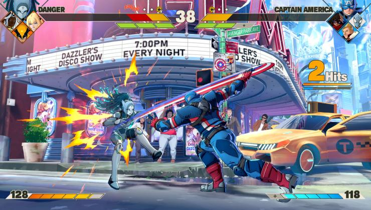

受高通芯片全面涨价影响，Valve正在研发的Steam Frame VR头显最终零售价可能突破1000美元。该设备原定位为高性能PC VR头显，但上游芯片成本增加迫使Valve重新评估定价策略。官方尚未公布具体规格与发售日期，但行业分析认为，若售价过高，将直接影响其与Meta Quest系列等竞品的竞争力。

简要分析：高通涨价直接冲击依赖其芯片的VR硬件厂商。Valve若想维持SteamVR生态吸引力，必须在定价与功能间找到平衡，否则可能重蹈Steam Deck涨价的覆辙。

来源: Google News

### 🆕 新机发售

#### 1. 《MARVEL Tōkon: Fighting Souls》疑似屏蔽SteamOS/Linux

漫威格斗新作《MARVEL Tōkon: Fighting Souls》近日开启公开测试，但玩家发现该游戏在Steam Deck及Linux系统上无法运行。据外媒GamingOnLinux测试，游戏启动后直接报错，疑似因使用不兼容的反作弊系统而主动屏蔽了SteamOS/Linux平台。目前官方尚未就此问题发表声明。

简要分析：这再次凸显反作弊系统与Linux兼容性之间的核心矛盾。若主流格斗游戏持续屏蔽Steam Deck，将严重削弱该掌机作为“便携游戏平台”的吸引力，Valve需加速推动Proton对反作弊系统的适配。

来源: GamingOnLinux

#### 2. 007 First Light 已移除 Denuvo 反篡改 DRM

今年5月底发售的《007 First Light》，在不到两个月后便移除了Denuvo反篡改DRM。该游戏在Steam Deck上原本存在性能波动，移除Denuvo后有望显著改善加载速度和帧率稳定性。目前Steam商店页面已更新，但官方未说明移除原因。

简要分析：Denuvo快速移除表明，对中小体量游戏而言，高昂授权费与对正版玩家的性能惩罚可能得不偿失。这对Steam Deck玩家是利好消息，意味着更多游戏可能效仿，优化Linux原生体验。

来源: GamingOnLinux

#### 3. NVIDIA、Red Hat、Cloudflare、The Linux Foundation 等联合发起“开放安全 AI 联盟”

NVIDIA、Red Hat、Cloudflare与Linux基金会等多家巨头联合宣布成立“开放安全AI联盟”（Open Secure AI Alliance），旨在共享开源工具，促进AI技术的负责任使用与信任。该联盟将重点开发跨平台的安全AI框架，并确保其与Linux生态的深度兼容。

简要分析：这一联盟成立对Steam Deck长期生态有积极意义。随着AI驱动的游戏功能（如NPC对话、动态渲染）增多，底层安全框架的开放与标准化将帮助Valve更轻松地将这些技术集成到SteamOS中。

来源: GamingOnLinux

### 📋 其他资讯

#### 1. Steam Deck涨价翻车！销量暴跌82%

据最新市场报告，Steam Deck在近期涨价后遭遇严重销量滑坡，环比跌幅达82%。消费者对价格上涨抵触情绪强烈，尤其在二手市场与竞品（如ROG Ally）价格相对稳定的背景下。Valve尚未回应是否调整定价策略，但分析师指出，若持续高价，Steam Deck市场份额将被进一步蚕食。

简要分析：涨价策略是一次失败试探。Steam Deck核心竞争力在于性价比与Steam生态，一旦价格脱离“亲民”定位，其硬件性能短板便会暴露。Valve可能需要通过捆绑游戏或推出低价版来挽回用户。

来源: Google News

#### 2. 《我的世界：Java版》系统需求在支持Vulkan前有所提升

随着《我的世界：Java版》即将引入Vulkan渲染器以大幅提升图形性能，Mojang同步上调了游戏最低系统需求。新需求要求至少8GB内存及支持Vulkan 1.1的显卡，旧款集成显卡将被淘汰。这一更新将显著改善Steam Deck上的运行表现，因为Vulkan能更高效地利用AMD定制芯片的潜力。

简要分析：Vulkan支持是《我的世界》在Steam Deck上实现60帧流畅运行的关键。系统需求提升虽会淘汰部分老旧设备，但对掌机玩家是正向优化，也展示了Vulkan在低功耗平台上的优势。

来源: GamingOnLinux

#### 3. Beam Eye Tracker 应用测试版新增对 Linux 和 macOS 的支持

广受好评的Steam应用Beam Eye Tracker发布公开测试版，正式新增对Linux和macOS的支持。该应用允许玩家通过普通网络摄像头实现眼动追踪，在《微软模拟飞行》《赛博朋克2077》等游戏中实现视线控制视角。测试版已上架Steam，支持Steam Deck的桌面模式。

简要分析：眼动追踪技术向Linux平台的扩展，为Steam Deck带来新的交互可能性。尽管目前仍依赖外接摄像头，但这一趋势表明开发者对SteamOS生态的兴趣正从游戏本身扩展到外设与辅助功能领域。

来源: GamingOnLinux

#### 4. 《Weather the Swarm》是一款画面有趣的合作动作类Roguelite游戏，拥有可破坏地形

科幻题材合作Roguelite游戏《Weather the Swarm》公布了首批实机画面，其最大特色是拥有完全可破坏的地形环境。玩家需与队友合作，在随机生成的关卡中利用环境破坏来消灭虫群。游戏支持单人及最多四人联机，预计202...

### Windows 掌机

### 🔮 新机爆料

#### 1. 拉瑞安再次澄清未参与《博德之门3》衍生项目
拉瑞安工作室再次声明，其未参与任何与《博德之门3》相关的衍生项目。此番回应针对近期官方公布的卡拉克主题漫画，旨在消除外界关于拉瑞安可能参与制作的猜测。拉瑞安强调，尽管漫画基于其游戏角色，但开发团队目前专注于全新原创项目。分析认为，拉瑞安反复切割与《博德之门3》IP后续开发的关系，表明其战略重心已转向新IP，意味着威世智将完全掌控该IP未来走向。（来源：PC Gamer）

#### 2. 《龙与地下城》与《魔兽世界》联动内容泄露

据外媒PC Gamer报道，一份疑似《龙与地下城》与《魔兽世界》的联动内容资料已在网络泄露。与之前《怪奇物语》《瑞克和莫蒂》等跨界合作仅推出简易入门套装不同，此次泄露暗示联动规模更大，可能包含完整规则书、战役模组或角色扩展，具体细节尚未获官方确认。分析指出，若泄露属实，这将是两大奇幻IP的史诗级碰撞，有望吸引大量《魔兽世界》用户尝试TRPG，进一步扩大D&D在电子游戏玩家中的影响力。（来源：PC Gamer）

#### 3. Zach Cregger承认无法超越里昂，新版《生化危机》电影将用原创角色

即将执导新版《生化危机》电影的导演Zach Cregger坦言，他认为自己无法超越游戏经典角色里昂·肯尼迪，因此决定在新电影中采用原创角色阵容。Cregger表示，与其冒险重塑玩家心中已封神的角色，不如创作全新幸存者故事，在保留生存恐怖内核的同时带来新鲜感。分析认为，这一决策避免了与游戏粉丝固有认知的冲突，给予导演更大创作自由度，可能为重启电影系列开辟独立但忠于系列精神的新叙事线。（来源：PC Gamer）

#### 4. Cyan发布20年来首款新《神秘岛》游戏预告，随后称该作未实际制作

经典解谜游戏《神秘岛》开发商Cyan Studios发布了一款代号“Project Anglerfish”的新作预告，声称这是20年来首款全新《神秘岛》游戏。然而预告发布后不久，Cyan透露该作未获发行商支持，目前并未实际投入制作，预告片仅为概念展示，项目处于搁置状态。分析指出，此举更像是向业界和玩家展示创意的“求救信号”，反映了传统解谜游戏在3A预算和商业回报压力下的生存困境。（来源：PC Gamer）

### 🆕 新机发售

#### 1. V社将Frame欢迎指南添加至Steam后台，暗示Steam Frame头显即将发售

Valve在Steam后台悄然添加了名为“Frame欢迎指南”的新页面，进一步暗示其传闻已久的VR/AR头显设备Steam Frame即将发售。该指南通常用于帮助用户首次设置硬件，被视为产品进入上市前准备阶段的关键信号。此前已有多次关于Steam Frame的硬件规格泄露。分析认为，作为Index头显的继任者，Frame若能在VR/AR融合体验上取得突破，有望重新定义PC端沉浸式交互标准，推动Steam平台在元宇宙领域的布局。（来源：Google News）

#### 2. 联想预热拯救者云游戏掌机C700：主打10ms超低延迟串流体验，下月登场

联想正式预热拯救者系列新款云游戏掌机C700，主打10ms超低延迟串流体验，预计下月正式发布。该设备专注于云游戏串流场景，而非本地运行游戏，旨在通过高速网络连接实现主机级画质的便携游玩，具体硬件配置和售价尚未公布。分析指出，C700精准切入云游戏普及期的硬件缺口，10ms延迟若能在实际网络环境中实现，将极大改善云游戏操作响应体验，但市场表现将受限于5G和宽带基础设施的普及程度。（来源：Google News）

#### 3. 《地狱潜者2》将于10月向玩家免费赠送汽车，6月已获奖励者除外
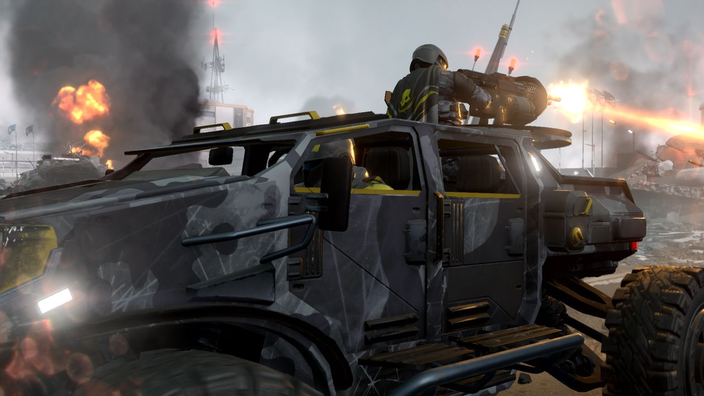

开发商Arrowhead宣布，《地狱潜者2》将于今年10月向所有玩家免费发放M-103 Supply FRV补给车。不过，曾在6月通过限时活动提前解锁该载具的玩家将不会重复获得。这辆FRV具备物资运输和火力支援功能，将大幅提升玩家战场机动性和战术选择。分析认为，这种“早买早享受，晚买享折扣”的发放策略既奖励了活跃玩家，又为回归玩家和新人提供了入坑动力，补给车的加入标志着游戏从纯步兵作战向载具协同作战的玩法扩展。（来源：PC Gamer）

#### 4. Valve及其Steam Frame迎来更多坏消息：高通计划提高芯片价格

Valve及其尚未发布的Steam Frame面临更多挑战。高通与其他厂商一样，计划提高其芯片价格。此举可能影响Steam Frame的硬件成本与最终定价，进一步增加该设备在VR/AR市场竞争中的不确定性。（来源：PC Gamer）

### 安卓掌机

### 🆕 新机发售

#### 1. Retroid 宣布 Nova 发货日期

Retroid 正式公布新款掌机 Pocket Nova 的发货时间表。该设备凭借高素质屏幕和比近期多数高性能掌机更紧凑的机身，成为今夏最受关注的安卓掌机之一。官方表示，首日预购订单将从本周开始陆续发出，具体发货日期将根据订单批次通过邮件通知用户。Pocket Nova 的发货标志着 Retroid 在高端安卓掌机市场迈出关键一步，其紧凑设计与高素质屏幕的组合有望吸引追求便携与画质平衡的硬核玩家。

#### 2. Game Bub 终于“即将发货”，你仍可预购一台

作为 Analogue Pocket 的替代选择，FPGA 掌机 Game Bub 进入“即将发货”阶段。官方确认工厂已完成首批量产，目前仍有少量预购名额开放。该设备主打硬件级模拟低延迟，支持多种经典游戏平台，但具体发货日期和最终售价尚未完全公布。Game Bub 的姗姗来迟反映了 FPGA 掌机从众筹到量产的高门槛，对于追求精确模拟的复古玩家而言，它提供了一个非 Analogue 阵营的差异化选择。

### 📋 其他资讯

#### 1. Anbernic RG SP 在首次实机演示中亮相
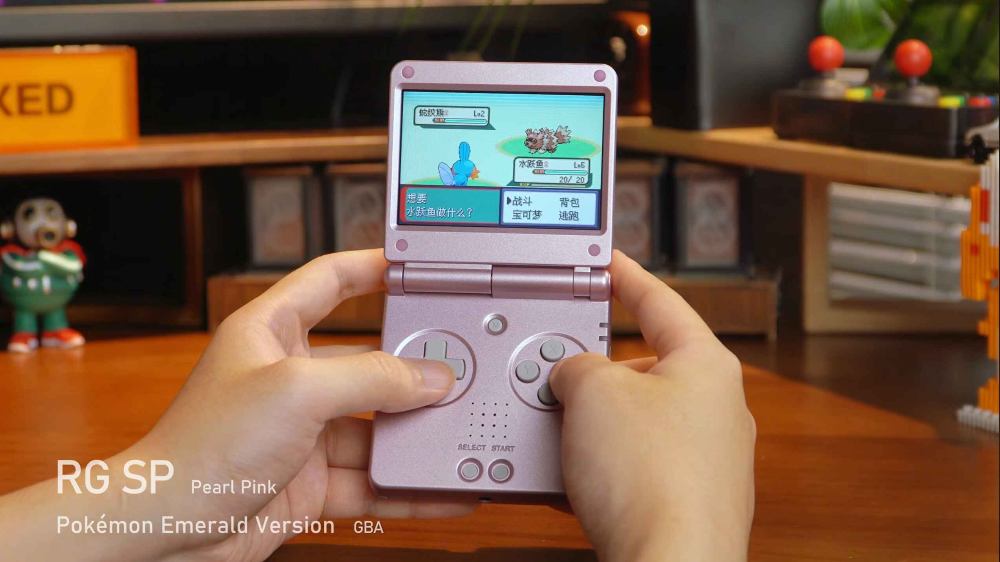

Anbernic 发布 RG SP 的首个实机游戏演示视频。该设备流畅运行了 GBA、Dreamcast、DS 游戏，并通过串流游玩了《星露谷物语》和《茶杯头》。官方仍未公布具体定价和发售日期，仅表示设备处于最终调试阶段。RG SP 的跨平台兼容性和串流能力展示了 Anbernic 对中端安卓掌机的性能调校水平，若定价合理，可能成为复古玩家兼顾本地模拟与云游戏场景的性价比之选。

#### 2. Pepsiman Recompiled 让你在浏览器中游玩这款邪典经典游戏

粉丝重制项目 Pepsiman Recompiled 正式上线，将 PS1 邪典游戏移植到浏览器中。该版本支持 60 帧运行、16:9 宽屏显示、离线游玩、存档持久化及在线排行榜。玩家无需模拟器，直接通过网页即可体验这款以百事可乐为主题的跑酷游戏。该项目展示了社区逆向工程与重编译技术的成熟，为经典游戏的保存与传播提供了新思路。

#### 3. 复古掌机周报：Anbernic RG SP、MagicX Mini Dream、Pepsiman 等更多资讯

本期周报汇总了本周复古掌机圈核心动态，包括 Anbernic RG SP 实机演示、MagicX Mini Dream 新进展、Pepsiman Recompiled 上线，以及多款设备评测与折扣信息。周报显示，安卓掌机市场正呈现“硬件迭代加速、软件生态丰富”的双轮驱动趋势，从 FPGA 到网页重制，复古游戏体验的边界正在被拓宽。

#### 4. Kamrui Hyper Series H2 i5-14500HX 评测

评测显示，Kamrui Hyper Series H2 搭载的 i5-14500HX 处理器性能强劲，但受限于集成 Intel UHD 显卡，游戏表现平庸。其强大 CPU 使其成为升级老旧 Proxmox 服务器的理想选择，定位更偏向迷你工作站而非游戏掌机。该案例提醒用户，安卓掌机选购需明确场景：CPU 性能不等于游戏体验，追求模拟器性能的玩家仍需独立显卡或更强 GPU 的机型。

### 开源掌机/Linux掌机

### 🔮 新机爆料

#### 1. Anbernic RG SP：游戏实机视频展示全部配色方案和模拟能力

Anbernic 即将推出的翻盖复古掌机 RG SP 近日曝光实机演示视频，展示全部配色方案及模拟运行游戏的能力。该设备是经典 SP 系列的升级版，机身厚度减少10%，采用全新屏幕边框设计。视频显示其流畅运行多款复古游戏，但处理器型号及最终售价尚未公布。  
**分析**：减薄设计和配色方案显示 Anbernic 对经典翻盖掌机市场的精准把控，有望在复古玩家中引发换机潮，巩固其开源掌机领先地位。  
来源：Retro Dodo

#### 2. ANBERNIC 展示 RG SP 复古掌机游戏画面及部分规格

继上周曝光后，ANBERNIC 再次公布 RG SP 更多细节，包括实机游戏画面及部分规格。该掌机延续经典翻盖设计，整体更轻薄，官方称比前代薄10%。新机配备全新屏幕边框，提升视觉沉浸感。已知支持多平台模拟，核心芯片方案仍待揭晓。  
**分析**：连续两周密集爆料显示 ANBERNIC 为 RG SP 正式发布造势，轻薄化设计是主要卖点，若定价合理，有望成为下半年最受关注的复古掌机之一。  
来源：Retro Dodo

#### 3. Mattel & Hot Wheels 可拼装《光环》UNSC 疣猪号现已在亚马逊开启预购

在圣地亚哥动漫展上，Mattel 与 Hot Wheels 正式公布可拼装的《光环》UNSC M12 疣猪号模型，并已在亚马逊开启预购。该模型此前有泄露传闻，现已获官方证实。产品定位为收藏级拼装玩具，零件数和售价尚未完全公开，已引发光环粉丝广泛关注。  
**分析**：此次合作将经典游戏载具实体化，借助 Hot Wheels 拼装工艺，有望吸引硬核玩家和模型收藏者，拓展游戏IP衍生品市场。  
来源：Retro Dodo

#### 4. 高达机甲乐高概念套装配有驾驶舱，高16.5英寸，附带支架

一款高达机甲乐高概念套装在网络曝光，高度达16.5英寸，配备可开启驾驶舱及展示支架。该设计仍处于概念阶段，非乐高官方正式产品。近期乐高推出多款游戏主题套装，但以任天堂和世嘉IP为主，高达题材缺失促使玩家社区创作此概念设计。  
**分析**：该概念套装反映玩家对高达与乐高联名的强烈期待，若获官方授权，将填补乐高在机甲类游戏IP领域的空白，市场潜力巨大。  
来源：Retro Dodo

### 🆕 新机发售

#### 1. Game Bub 开源掌机终于开始发货

号称“全球首款完全开源掌机”的 Game Bub 开始向预订用户发货。该掌机于2025年10月公布，经过近一年等待，首批产品现已交付。Game Bub 主打完全开源硬件和软件生态，允许用户自由修改系统、更换组件，支持多种复古游戏模拟。具体发货批次和后续订单情况有待官方更新。  
**分析**：Game Bub 发货标志开源掌机从“闭源定制”向“完全开放”迈出重要一步，虽量产周期较长，但其开源理念将吸引极客玩家和开发者，推动社区生态建设。  
来源：Retro Dodo

### 📋 其他资讯

#### 1. 老掌机获新生：开发者通过串流让索尼 PS Vita 玩上微软 XGP 大作

有开发者成功通过串流技术，让索尼 PS Vita 掌机运行微软 Xbox Game Pass 云游戏服务中的大作。这一突破使已停产经典掌机能畅玩《光环》等现代3A游戏。开发者通过自制客户端实现XGP登录与串流，但操作适配和网络延迟仍是体验关键瓶颈。  
**分析**：该技术为老掌机赋予新生命力，展示开源社区在逆向工程和云游戏适配上的创造力，但受限于Vita硬件性能和网络条件，实际体验可能难达主流掌机水平。  
来源：Google News

#### 2. Arcade1Up 计划今年晚些时候发布两款索尼克街机机台
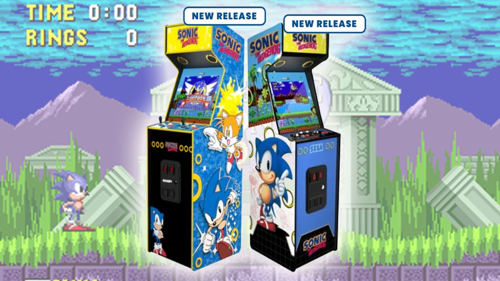

Arcade1Up 宣布计划于今年晚些时候推出两款《索尼克》主题街机机台，将还原经典索尼克游戏的街机体验。具体收录游戏阵容和机台尺寸尚未公布。Arcade1Up 此前已推出多款复古街机复刻产品，此次与世嘉合作将进一步丰富其产品线。  
**分析**：索尼克作为世嘉招牌IP，其街机化复刻将吸引怀旧玩家，巩固 Arcade1Up 在复古街机市场的地位。  
来源：Retro Dodo

### PlayStation

### 🔮 新机爆料

#### 1. 曝PS6性能达PS5两倍！120帧无压力 轻松应对光追
据Google News援引爆料，下一代PlayStation 6主机性能将达到PS5的两倍，可轻松实现120帧运行，并更好应对光线追踪技术。消息称，PS6可能从Zen 2架构直接跃升至Zen 6，带来CPU和GPU的显著提升。目前该信息尚未获索尼官方证实，但已引发玩家对次世代主机性能的广泛讨论。若爆料属实，PS6将大幅提升高帧率游戏和光追体验，巩固PlayStation在高端主机市场的竞争力。但性能翻倍也意味着开发成本和售价可能上升，需平衡玩家接受度。

#### 2. 开发者：若PlayStation消灭实体媒体，也应“连硬件一起淘汰”

自7月1日索尼宣布逐步停止生产和销售实体光盘以来，业界和玩家反响强烈。《魔界战记》系列创作者表示，若PlayStation要消灭实体媒体，那它也该“连硬件一起淘汰”，强调实体光盘对游戏收藏和硬件生态的重要性。这一言论反映了部分开发者对索尼全数字化战略的担忧。实体光盘争议持续发酵，开发者公开反对凸显了行业对数字独占风险的警惕。索尼需在推动数字化与维护实体用户基础间找到平衡，否则可能影响第三方合作。

#### 3. 前开发者：索尼发布“史上最严格”社交媒体准则
据Eurogamer报道，在实体光盘争议引发强烈反弹后，索尼已向其第一方工作室员工发布了“史上最严格”的社交媒体准则。前第一方开发者透露，新准则要求员工在公开讨论实体媒体相关话题时格外谨慎，避免发表个人观点。此举旨在控制舆论，但也被批评为压制内部声音。索尼的严格管控反映出其对品牌形象的重视，但也可能引发员工不满。在玩家和开发者双重压力下，索尼的全数字化路线面临更大挑战。

### 🆕 新机发售

#### 1. PlayStation Network宕机，数万玩家无法游玩《漫威格斗之魂》测试版

7月24日，PlayStation Network（PSN）出现大规模宕机，数万名玩家报告无法登录在线服务。正值《漫威格斗之魂》新测试版上线，大量玩家排队等待游玩，但受宕机影响无法连接。索尼尚未公布具体原因，但已开始紧急修复。此次宕机持续数小时，引发玩家不满。PSN宕机在新游测试期间发生，暴露了索尼在线服务的稳定性短板。随着数字游戏和在线服务占比增加，网络可靠性将成为用户体验的关键。

### 📱 系统更新

#### 1. 《007 First Light》首个重大补丁上线，PS5版本优化显著

7月26日，《007 First Light》发布了首个重大更新补丁1.1.0，修复了社区和内测人员报告的超过200个问题。补丁针对PS5版本进行了优化，包括性能提升和稳定性改进。开发商表示，此次更新旨在改善整体游戏体验，并感谢玩家的反馈。大规模补丁修复显示了开发商对玩家反馈的重视，PS5版本的针对性优化有助于提升主机平台口碑。频繁更新也反映了现代游戏“发布后完善”的趋势。

### 📋 其他资讯

#### 1. 最新PS5模拟器测试显示，多款游戏无法运行
据Google News报道，最新的PS5模拟器测试结果显示，目前多款游戏在该模拟器上无法正常运行。测试表明，模拟器仍处于早期开发阶段，兼容性有限，仅能运行部分简单游戏。开发者表示，模拟器距离成熟还需大量优化工作。PS5模拟器进展缓慢，短期内难以对主机市场构成威胁。但长期来看，若兼容性突破，可能影响PS5硬件销量，索尼需关注技术保护。

#### 2. PS6取消光盘意味着什么？
文章探讨了PS6可能取消光盘驱动器的影响，包括对实体游戏收藏、二手交易以及数字版依赖度的讨论。分析指出，取消光盘将加速全数字化进程，但可能削弱玩家对游戏的拥有感，并影响二手市场。索尼尚未确认PS6是否取消光驱，但业界普遍认为这是趋势。取消光盘是双刃剑：降低硬件成本、推动数字生态，但可能失去实体收藏玩家。索尼需权衡用户习惯与商业利益，避免重蹈Xbox One初期争议。

#### 3. 世嘉总裁公开支持光盘：我们仍重视实体媒介的文化
在索尼计划于2028年前停止光盘生产和销售之际，世嘉总裁内海州志公开表示，实体媒介仍然重要。他指出，尽管数字发行“至关重要”，尤其是PC玩家数量稳步增长，但实体光盘的文化价值不可忽视。世嘉成为最新一家公开支持实体媒体的发行商。世嘉的立场与索尼形成对比，反映了发行商对实体渠道的依赖。全数字化可能削弱零售合作，世嘉的表态或影响其他厂商的决策。

#### 4. 育碧老板：PlayStation放弃实体光盘不会对行业造成太大“干扰”

（内容缺失，无法提供完整信息）

### Xbox

### 🆕 新机发售

#### 1. 微软 Xbox 向下兼容功能官宣拓展至 PC 平台：初代四款作品适配，后续将新增更多游戏
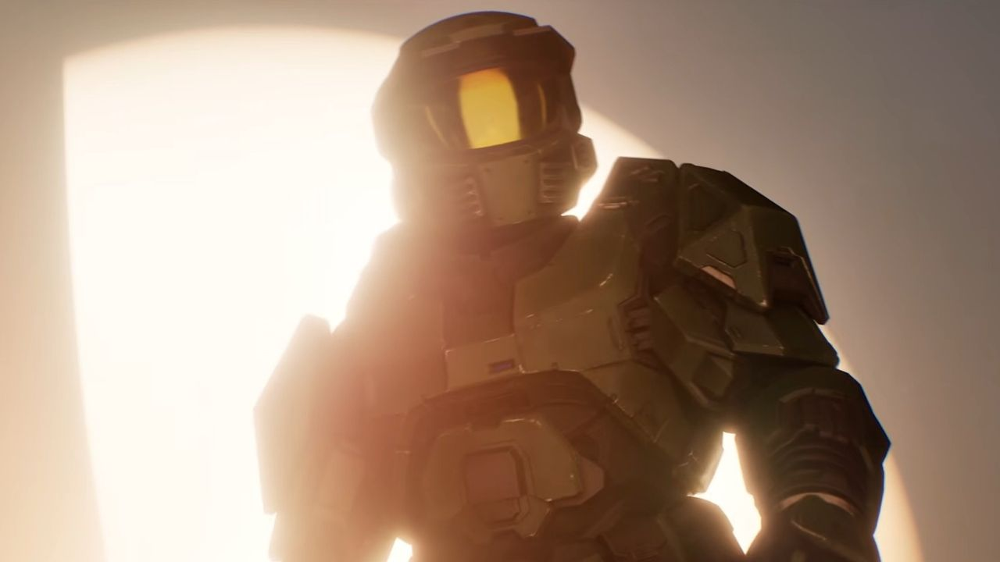

微软正式宣布将 Xbox 向下兼容功能拓展至 PC 平台，首批适配四款初代 Xbox 作品，玩家现可在 Windows 系统上直接运行这些经典游戏。此次拓展涉及硬件兼容性层面的技术突破，微软表示后续将根据玩家反馈和测试结果，逐步增加更多兼容游戏阵容，进一步打通主机与 PC 生态壁垒。此举标志着微软跨平台战略的深化，通过将向下兼容从主机延伸至 PC，有效盘活经典 IP 资产，同时增强 Xbox Game Pass 对 PC 用户的吸引力，巩固其“设备+服务”生态优势。（来源: Google News）

### 📋 其他资讯

#### 1. Xbox 出现故障，就在 PlayStation 宕机几天后，此次故障同时影响数字版和“光盘版”游戏

Xbox 于 7 月 27 日晚间发生大规模服务中断，距离 PlayStation Network 宕机仅隔数日。此次故障不仅影响数字版游戏的登录、商店访问和游戏启动，还意外阻止了玩家运行实体光盘游戏。据 GamesRadar 报道，Xbox 状态页面在美东时间晚 11 点首次确认问题，波及范围包括登录、应用启动及游戏库访问。连续的主机平台宕机事件暴露了数字时代服务依赖性的脆弱，尤其“光盘游戏无法运行”凸显了在线验证机制对实体体验的捆绑，或促使玩家和行业重新审视离线游玩保障的必要性。（来源: GamesRadar）

#### 2. Xbox 的大规模宕机甚至阻止了光盘游戏的运行

据 The Verge 报道，此次 Xbox 宕机从周日晚间持续至周一，影响远超数字游戏范畴——玩家无法运行任何实体光盘游戏。Xbox 状态页面于美东时间周日晚 11 点首次报告故障，期间用户无法登录账户、启动应用或查找游戏，系统层面的验证机制全面瘫痪，导致实体光盘同样无法通过初始授权检查。该事件揭示了现代主机“始终在线”验证架构的潜在风险，即便实体游戏也需联网授权，削弱了光盘作为“离线保障”的传统优势，可能推动微软加速优化离线模式设计。（来源: The Verge）

#### 3. Xbox 高管解释宕机事件，承诺“做得更好”

Xbox 首席技术官 Scott Van Vliet 就此次大规模宕机事件公开发声，详细解释了系统和服务中断的技术原因，该故障从周日晚间持续至周一，影响游戏库访问、登录及游戏启动。Van Vliet 在声明中向玩家致歉，并承诺团队将“做得更好”，包括加强基础设施冗余和应急响应机制，防止类似事件重演。高管主动透明化沟通有助于缓解玩家不满，但承诺能否兑现取决于后续技术投入。此次事件也提醒微软，在服务化转型中需平衡云端依赖与本地体验的稳定性。（来源: IGN）

#### 4. Xbox 在其内测计划中推出广告支持的游戏串流测试，与此同时硬件供应与可负担性危机持续加剧

Xbox 宣布在 Insider 内测计划中启动广告支持的游戏串流服务测试。该服务允许玩家免费串流其库中指定游戏，每次会话时长 1 小时，播放前需观看广告。此举正值硬件供应紧张与主机可负担性危机加剧之际，微软试图通过低门槛串流模式吸引预算有限的玩家，扩大用户覆盖面。广告串流是 Xbox 在订阅制之外探索的变现新路径，既能降低用户入门成本，又能为广告主提供精准触达。但 1 小时限时和广告插播可能影响体验，需平衡商业收益与用户留存。（来源: Eurogamer）

#### 5. 在最近的 Xbox 动荡中，微软似乎正在取消取消某件事，这对《帝国时代3》的粉丝来说至少是个好消息

在 Xbox 近期动荡中，微软罕见地“取消了一项取消决定”——此前被宣布放弃的《帝国时代3》DLC 现已恢复开发，并定于今年 9 月发布。该 DLC 最初在 2024 年公布，后因内部调整被搁置，如今在社区持续请愿下重新启动。Eurogamer 报道称，这一反转在 Xbox 经历服务宕机等负面事件后，为策略游戏粉丝带来了难得的好消息。微软“反取消”操作体现了对核心粉丝反馈的重视，尤其在品牌信任受挫时期，通过兑现经典 IP 承诺可有效修复社区关系。此举也暗示 Xbox 在内容策略上更倾向于灵活调整而非一刀切。（来源: Eurogamer）

#### 6. Xbox 服务现已中断，导致玩家无法游玩任何数字版或实体版游戏，而上周 PlayStation Network 也出现了类似问题

Xbox 在线服务于 7 月 27 日全面中断，导致玩家无法游玩任何数字版或实体版游戏，而竞争对手 PlayStation Network 在仅一周前也遭遇了类似故障。此次宕机时间点敏感，两大平台接连出现服务问题，引发行业对主机网络基础设施可靠性的广泛讨论。Xbox 状态页面确认故障影响登录、商店、游戏库及应用启动等核心功能。双平台接连宕机凸显了游戏行业对云端服务的过度依赖，玩家对“离线可玩”的需求日益迫切。

### 任天堂 Switch

### 🔮 新机爆料

#### 1. 《拔天海拓史》重制版开发者协助《异度神剑》Switch 2版开发

- **新闻内容**：任天堂邀请外部开发商协助第一方游戏更新，日本开发商Logicalbeat参与了《异度神剑：决定版》Switch 2版本的开发。该公司代表董事Domae Yoshiki确认，团队协助实现了该游戏的4K分辨率和60帧性能增强。
- **简要分析**：任天堂借助外部技术力量优化次世代移植，表明Switch 2性能提升依赖第三方协作，也暗示第一方工作室资源紧张。
- **来源**: Nintendo Life

#### 2. 《最终幻想14：永寒之寒》扩展预告片公布，新职业与联动突袭系列揭晓

- **新闻内容**：Square Enix发布第六个扩展包“永寒之寒”预告片，确认于2027年1月登陆包括Switch 2在内的所有平台。预告展示了新职业及一个联动突袭系列，合作IP尚未公布。
- **简要分析**：FF14通过跨平台同步扩展维持热度，新职业和联动突袭是吸引老玩家回归和拉新用户的关键手段。
- **来源**: Nintendo Life

#### 3. 《异度神剑2》Switch 2版预估文件大小公布

- **新闻内容**：《异度神剑2 Switch 2版》将于下周发售，商店页面显示预估文件大小为45.8 GB，可能变动。原版Switch版文件大小为13.2 GB。
- **简要分析**：容量暴涨近3.5倍，暗示包含高分辨率材质包、更高码率音频及额外内容，对玩家存储空间提出更高要求。
- **来源**: Nintendo Life

#### 4. 《最终幻想14》将于今年晚些时候登陆Switch 2，附带免费试玩版，文件大小极为庞大

- **新闻内容**：四月公布的《最终幻想14》Switch 2移植版原定8月发售，现发售日临近。该版本包含免费试玩内容，但安装文件极为庞大，可能占据主机近一半存储空间。
- **简要分析**：MMO登陆新平台的门槛是存储与网络优化，FF14的庞大体积既是内容丰富的证明，也可能劝退存储空间有限的玩家。
- **来源**: Eurogamer

#### 5. 宫本茂认为玩家不再在意主机规格，任天堂提供“唯有我们才能创造的游戏玩法”

- **新闻内容**：宫本茂表示，与过去相比，玩家对图形和性能的重视程度下降。他强调任天堂核心竞争力在于提供“唯有我们才能创造的游戏玩法”，而非追逐硬件规格竞赛。
- **简要分析**：此言论既是对Switch 2性能未达顶尖的辩护，也重申任天堂以创意和独占体验取胜的差异化竞争策略。
- **来源**: Eurogamer

### 🆕 新机发售

#### 1. 《最终幻想14：在线版》将于2026年8月4日登陆Switch 2

- **新闻内容**：Square Enix确认《最终幻想14 Online》Switch 2版发售日为2026年8月4日，预购已开启，玩家可提前下载客户端。
- **简要分析**：作为Switch 2最重磅的MMO作品，FF14准时上线将丰富首发后软件阵容，并验证第三方大型在线游戏在任天堂新硬件上的表现。
- **来源**: Nintendo Life

### 📋 其他资讯

#### 1. Bethesda游戏登陆Nintendo Switch 2
- **新闻内容**：Bethesda多款游戏确认将登陆Switch 2，具体作品名单及发售日期尚未公布。此前Bethesda已为Switch移植《上古卷轴5：天际》和《毁灭战士》等作品。
- **简要分析**：Bethesda的加入丰富了Switch 2第三方阵容，对开放世界和FPS玩家是利好，暗示新主机性能足以运行更复杂的Bethesda引擎作品。
- **来源**: Google News (via Switch 2)

#### 2. 《最终幻想14》将成为Switch 2上安装体积最大的游戏，占据近一半存储空间

- **新闻内容**：据多家外媒报道，《最终幻想14 Online》Switch 2版安装文件大小将使其成为该主机上体积最大的游戏。考虑到Switch 2内置存储空间（传闻为256GB），FF14安装包预计占用超过100GB。
- **简要分析**：巨大体积对数字版玩家不友好，可能迫使玩家购买microSD卡或外接存储设备，也凸显实体版卡带在存储成本上的优势。
- **来源**: Google News (via Switch 2)

### 模拟器资讯

### 📋 其他资讯

#### 1. 微软在其PC端新的向下兼容版本中内置了原生Xbox 360模拟器——模组作者通过微调迅速让360游戏得以运行

- **新闻内容**：微软近日在PC端发布了四款初代Xbox向下兼容游戏，令人意外的是，这些游戏包内嵌了一个原生的Xbox 360模拟器。这些游戏被封装为Xbox 360文件格式，模拟器会先以360环境运行，随后再通过另一层模拟器处理初代Xbox的代码。模组作者发现这一结构后，仅通过少量微调便成功让其他Xbox 360游戏直接运行，大幅提升了PC端的兼容潜力。
- **简要分析**：微软此举相当于在PC上“白送”了一个官方Xbox 360模拟器，虽然目前仅针对特定游戏开放，但模组社区的快速破解可能迫使微软加速官方兼容计划的推进，或调整其模拟器策略。
- **来源**: Tom's Hardware

---

**参考资料链接：**
- https://www.tomshardware.com/video-games/xbox/microsoft-shipped-a-native-xbox-360-emulator-with-its-new-backwards-compatible-releases-on-pc-modders-quickly-got-360-games-running-with-minor-tweaks

### 游戏外设

### 📋 其他资讯

#### 1. 雷蛇的模拟光轴 Huntsman V3 Pro 降价超过20%

- **新闻内容**：雷蛇旗下搭载模拟光轴（Analog Optical Switch）的 Huntsman V3 Pro TKL 键盘近期迎来超过20%的降价。该键盘采用紧凑的无数字键盘区设计，其核心卖点在于可调节的按键行程与极速响应，相比传统机械轴体提供了更高的自定义空间。此次促销使得这款原本定位高端的电竞键盘性价比显著提升。
- **简要分析**：此次降价可能是为了清库存以迎接新品，或是应对竞品在模拟光轴领域的跟进。对于玩家而言，这是以更低成本体验光轴可调手感的好时机，同时也反映出高端外设市场竞争的激烈程度。
- **来源**: The Verge

---

### 参考资料链接
- [Razer Huntsman V3 Pro TKL 降价报道 - The Verge](https://www.theverge.com/gadgets/971557/razer-huntsman-v3-pro-tkl-optical-analog-gaming-keyboard-deal-sale)

## 参考资料链接列表

1. [Google News] 高通芯片涨价冲击 VR 市场，Valve Steam Frame 头显售价或超 1000 美元: https://news.google.com/rss/articles/CBMiTEFVX3lxTE05YUVPZHpKSUYxdXlmeHdaeVFnQ055Y0lsNjRTaTI5MmQyLTk3cWJoLWdQVzJ6UHg5QTZFa181U2RCMUJ2U25ONUIwN0E?oc=5
2. [Google News] Steam Deck涨价翻车！销量暴跌82%: https://news.google.com/rss/articles/CBMiSEFVX3lxTE8xZWdRUkZiV0t4SGJOREJ5VHh4MDMtclgtOERvZmduclFVVkJldWNNVUN6Ylk5RENOZlNlek11bE55N2tzTVl5Mw?oc=5
3. [GamingOnLinux] Minecraft: Java Edition system requirements get bumped up ahead of Vulkan support: https://www.gamingonlinux.com/2026/07/minecraft-java-edition-system-requirements-get-bumped-up-ahead-of-vulkan-support/
4. [GamingOnLinux] MARVEL Tōkon: Fighting Souls appears to block SteamOS / Linux: https://www.gamingonlinux.com/2026/07/marvel-tokon-fighting-souls-appears-to-block-steamos-linux/
5. [GamingOnLinux] 007 First Light has Denuvo Anti-Tamper DRM removed: https://www.gamingonlinux.com/2026/07/007-first-light-has-denuvo-anti-tamper-drm-removed/
6. [GamingOnLinux] NVIDIA, Red Hat, Cloudflare, The Linux Foundation and more launch the "Open Secure AI Alliance": https://www.gamingonlinux.com/2026/07/nvidia-red-hat-cloudflare-the-linux-foundation-and-more-launch-the-open-secure-ai-alliance/
7. [GamingOnLinux] Beam Eye Tracker app adds Linux and macOS support in Beta: https://www.gamingonlinux.com/2026/07/beam-eye-tracker-app-adds-linux-and-macos-support-in-beta/
8. [GamingOnLinux] Weather the Swarm is a fun looking co-op action roguelite with destructible terrain: https://www.gamingonlinux.com/2026/07/weather-the-swarm-is-a-fun-looking-co-op-action-roguelite-with-destructible-terrain/
9. [Google News] V社将 Frame 欢迎指南添加至 Steam 后台，暗示 Steam Frame 头显即将发售: https://news.google.com/rss/articles/CBMiTEFVX3lxTE5ONGhnV3RWTTBJTnNJYjFSME9xVGpsX3JXZUNPWnJUVllvUkRjcUtXRENKMW55blBpYU5mdnZJeFRLQkVUX2lVdHotS00?oc=5
10. [Google News] 联想预热拯救者云游戏掌机 C700：主打 10ms 超低延迟串流体验，下月登场: https://news.google.com/rss/articles/CBMiTEFVX3lxTE9POWNOMnpBWnk2THpzWVl3aDI2d0xveXpTZWxIWUpkelNiMTRKZk1qaVJUZEdIcTlZZEFhaWhTYkRScGh4LWstZWVwNkc?oc=5
11. [Google News] 安伯尼克 ANBERNIC 展示 RG SP 掌机：3.4 寸 IPS 屏幕、1GB 内存，支持 3 倍点对点模拟 GBA: https://news.google.com/rss/articles/CBMiTEFVX3lxTE9mZW1fQ3A2cXFnX3NXbVpQMGNBWEZXWjRmQ1ZiZnZEWTk3NDk5bi04bGE3MkJYMFhGa0tvejhnYzNQa0JxaFFTb2ZxUlI?oc=5
12. [PC Gamer] Larian once again reminds us it's 'not involved in any BG3-related projects' in response to Karlach comic reveal: https://www.pcgamer.com/games/baldurs-gate/larian-once-again-reminds-us-its-not-involved-in-any-bg3-related-projects-in-response-to-karlach-comic-reveal/
13. [PC Gamer] A crossover between Dungeons & Dragons and World of Warcraft has leaked: https://www.pcgamer.com/games/world-of-warcraft/a-crossover-between-dungeons-and-dragons-and-world-of-warcraft-has-leaked/
14. [PC Gamer] Zach Cregger admits 'I'm not going to be able to improve on Leon' which is why he's using original characters for the upcoming Resident Evil movie: https://www.pcgamer.com/movies-tv/zach-cregger-admits-im-not-going-to-be-able-to-improve-on-leon-which-is-why-hes-using-original-characters-for-the-upcoming-resident-evil-movie/
15. [PC Gamer] Cyan releases teaser for the first new Myst game in 20 years, then breaks the news that it's not actually being made: https://www.pcgamer.com/games/adventure/cyan-releases-teaser-for-the-first-new-myst-game-in-20-years-then-breaks-the-news-that-its-not-actually-being-made/
16. [PC Gamer] Helldivers 2 is giving players a free car in October, except for those who already earned it in June: https://www.pcgamer.com/games/action/helldivers-2-is-giving-players-a-free-car-in-october-except-for-those-who-already-earned-it-in-june/
17. [PC Gamer] More bad news for Valve and its still unreleased Steam Frame as Qualcomm is set to raise the price of its chips, like everyone else: https://www.pcgamer.com/hardware/vr-hardware/more-bad-news-for-valve-and-its-still-unreleased-steam-frame-as-qualcomm-is-set-to-raise-the-price-of-its-chips-like-everyone-else/
18. [Retro Handhelds] Game Bub is Finally ‘Shipping Soon’ and You Can Still Pre-order One: https://retrohandhelds.gg/game-bub-is-finally-shipping-soon-and-you-can-still-pre-order-one/
19. [Retro Handhelds] Retroid Announces Nova Shipping Dates: https://retrohandhelds.gg/retroid-announces-nova-shipping-dates/
20. [Retro Handhelds] Anbernic RG SP Gets Shown Off in First Gameplay Showcase: https://retrohandhelds.gg/anbernic-rg-sp-gets-shown-off-in-first-gameplay-showcase/
21. [Retro Handhelds] Pepsiman Recompiled Lets You Play This Cult-Classic in Your Browser: https://retrohandhelds.gg/pepsiman-recompiled-lets-you-play-this-cult-classic-in-your-browser/
22. [Retro Handhelds] Retro Handhelds Weekly: Anbernic RG SP, MagicX Mini Dream, Pepsiman, and More: https://retrohandhelds.gg/retro-handhelds-weekly-edition-109/
23. [Retro Handhelds] Kamrui Hyper Series H2 i5-14500HX Review: https://retrohandhelds.gg/kamrui-h2-14500hx-review/
24. [Google News] Anbernic RG SP：游戏实机视频展示了其全部配色方案和模拟能力: https://news.google.com/rss/articles/CBMib0FVX3lxTE5HWUYwZEdSdHdteUVqNkpOeS1jMmpaR2VoYk1oOVc5R01VOXUwX21jQ0NGRldvNjFYMEhxZWFRTlBsUlVPNnpTNElUbmxKTUxpLUdjbVpOSlYxOUkzMGswQ3JDUWtmYWF6Yy1LQjdNMA?oc=5
25. [Google News] 老掌机获新生，开发者通过串流让索尼 PS Vita 玩上微软 XGP 大作: https://news.google.com/rss/articles/CBMiTEFVX3lxTFBaR1BkQlpqNUkyRXlNOXFlcGRpdlp0QWRtcV9paVhfNTBJemZLQWJST01TM2NZQlFUeDBoczdqazhQaHRQeWZ3MnYzRnk?oc=5
26. [Retro Dodo (掌机)] Mattel & Hot Wheels Buildable Halo UNSC Warthog Is Up For Pre-Order On Amazon: https://retrododo.com/mattel-hot-wheels-buildable-halo-unsc-warthog-is-up-for-pre-order-on-amazon/
27. [Retro Dodo (掌机)] ANBERNIC Shows Gameplay & A Few Specs Of Upcoming RG SP Retro Handheld: https://retrododo.com/anbernic-shows-gameplay-a-few-specs-of-upcoming-rg-sp-retro-handheld/
28. [Retro Dodo (掌机)] This Gundam Suit LEGO Set Concept Comes Complete With Cockpit & Stands At 16.5" Tall: https://retrododo.com/this-gundam-suit-lego-set-concept-comes-complete-with-cockpit-stands-at-16-5-tall/
29. [Retro Dodo (掌机)] The Game Bub Open Source Handheld Is Finally Shipping: https://retrododo.com/the-game-bub-open-source-handheld-is-finally-shipping/
30. [Retro Dodo (掌机)] Arcade1Up Set To Release Two Sonic Arcade Cabinets Later This Year: https://retrododo.com/arcade1up-set-to-release-two-sonic-arcade-cabinets-later-this-year/
31. [Retro Dodo (掌机)] Atari Signs Deal With Universal Pictures To Turn 10 Games Into Movies: https://retrododo.com/atari-signs-deal-with-universal-pictures-to-turn-10-games-into-movies/
32. [Google News] 曝PS6性能达PS5两倍！120帧无压力 轻松应对光追: https://news.google.com/rss/articles/CBMiSEFVX3lxTE5OX19QdzA5aEtPb0NIQktKcGh6UW1YczlNdS13Tlg2Qk9ETmdPelR1dzRYYlNnQWRyNG5mYmtURnNrd000a0F5MA?oc=5
33. [Google News] 最新的PlayStation 5模拟器测试显示，多款游戏无法运行: https://news.google.com/rss/articles/CBMibkFVX3lxTE1vbkpMRFpuUUpsc3I3SVJBbXJhU0xuU3NvRTNjdHMydGN2LWJzVFBsYkVvc3M2bG14YUl1WnVsckFXcGtqVml0WEZLU3dpczNyR0JMNVhFZ1dTVlJhTkJjWGd1ZWpMSFM3WVBxdV9R?oc=5
34. [Google News] PS6取消光盘意味着什么？: https://news.google.com/rss/articles/CBMiVEFVX3lxTE45cU05NGtzc2J2d2pHVzNrZzVSTkVnR1hIR2w4LWxtZlNNTEdTRGRLV1hHUTFpbmNnVkl0ZUo4NUM4ajN1ZVdtalduckgtUmp5MHBzVw?oc=5
35. [Eurogamer] If PlayStation kills physical media, it should "get rid of the hardware" too, says the creator of popular RPG series Disgaea: https://www.eurogamer.net/playstation-physical-media-hardware-disgaea-creator
36. [Eurogamer] "Sony had the strictest social media guidelines they've ever seen issued," says former first-party dev about physical disc backlash: https://www.eurogamer.net/sony-disc-backlash-no-surprise-says-former-dev
37. [Eurogamer] PlayStation Network down, as tens of thousands of players queue to play Marvel Tokon Fighting Souls newly-launched beta: https://www.eurogamer.net/psn-network-down-login-failure
38. [Eurogamer] 007 First Light's first major patch is here – and it's a doozy if you're playing on PS5: https://www.eurogamer.net/007-first-light-first-major-patch-details
39. [Eurogamer] "We still value the culture of physical media" As PlayStation prepares for an all-digital future, Sega president comes out in support of discs: https://www.eurogamer.net/playstation-physical-media-sega-ceo
40. [Eurogamer] Ubisoft boss Yves Guillemot doesn't believe PlayStation ditching physical discs will "disturb" the industry much: https://www.eurogamer.net/ubisoft-ceo-playstation-disc-wont-disturb-industry
41. [Google News (via PS5 Pro)] 六千多的PS5 Pro算便宜？好小众的话术_游戏大杂烩: https://news.google.com/rss/articles/CBMiXkFVX3lxTFA3Ty14TFplbkVwOWhEZnN1bnZMQVNZaFpFNEloVEFQS1dMeGFfZENHWDl0S3ByUEdfZ3VEejJDQnpZZGs4T1h1eWlvMnJ0b2NacU9LbW1YSkhsWHgwVnc?oc=5
42. [Google News (via PS5 Pro)] 从Zen 2直跳Zen 6：PS6性能达PS5两倍！120帧无压力: https://news.google.com/rss/articles/CBMiWEFVX3lxTFBNdmI1OVlUeVRqNzBNN25RbHl5N2FMaW95SnBrUnVyWFBmSEtRRVFnZXpPWm1jN3hfN1JTdkNlLVZPOHhHUzAwTnNYQlYzckxGRzFUc2RvQ24?oc=5
43. [Google News] 微软 Xbox 向下兼容功能官宣拓展至XBOX ON PC 平台：初代四款作品适配，后续将新增更多游戏: https://news.google.com/rss/articles/CBMiTEFVX3lxTFBDYWVXZ3BuTjRxclBTaEZFZGJwQUl0LXVvQzJWNmRPMDBKYjZrOVhfQUdhU2kwNWlmb2RHVl9ZQU5YSGVmc0tnUlBLdFg?oc=5
44. [GamesRadar] Xbox is down, just days after PlayStation outage, and it affects both digital and "disc-based" games: https://www.gamesradar.com/games/xbox-is-down-just-days-after-playstation-outage-and-it-affects-both-digital-and-disc-based-games/
45. [The Verge] Xbox’s huge outage even blocked games on disc: https://www.theverge.com/games/971545/xbox-outage-disc-physical-games
46. [IGN] Xbox Executive Explains Outage, Vows to 'Do Better': https://www.ign.com/articles/xbox-executive-explains-outage-vows-to-do-better
47. [Eurogamer] Xbox rolls out ad-supported game streaming test for its insider programs, as hardware supply and affordability crisis rages on: https://www.eurogamer.net/xbox-game-advertising-insider-affordability
48. [Eurogamer] Amid the recent Xbox devastation, Microsoft is seemingly uncancelling something, which is good news for Age of Empires 3 fans at least: https://www.eurogamer.net/microsoft-age-of-empires-3-dlc-uncancelled
49. [Eurogamer] Xbox service is down, with outages meaning players can't play any digital or physical games, after similar PlayStation Network issues last week: https://www.eurogamer.net/xbox-outage-july-2026
50. [Nintendo Life] Baten Kaitos Remaster Dev Helped Out With Xenoblade Chronicles' Switch 2 Edition: https://www.nintendolife.com/news/2026/07/baten-kaitos-remaster-dev-helped-out-with-xenoblade-chronicles-switch-2-edition
51. [Nintendo Life] Round Up: Final Fantasy XIV: Evercold Extended Teaser Revealed, New Job And Crossover Raid Series Announced: https://www.nintendolife.com/news/2026/07/round-up-final-fantasy-xiv-evercold-extended-teaser-revealed-new-job-and-crossover-raid-series-announced
52. [Nintendo Life] Xenoblade Chronicles 2 - Nintendo Switch 2 Edition Estimated File Size Revealed: https://www.nintendolife.com/news/2026/07/xenoblade-chronicles-2-nintendo-switch-2-edition-estimated-file-size-revealed
53. [Eurogamer] Final Fantasy 14 comes to Switch 2 later this year with the now-famous free trial, but the file size is going to be absolutely massive: https://www.eurogamer.net/final-fantasy-14-evercold-teaser-trailer-switch-2-details
54. [Eurogamer] Shigeru Miyamoto thinks people don't care about console specs that much anymore, believes Nintendo instead provides "gameplay that only we can create": https://www.eurogamer.net/shigeru-miyamoto-nintendo-switch-hardware-comments
55. [Nintendo Life] Final Fantasy XIV Online Releases For Switch 2 On 4th August 2026: https://www.nintendolife.com/news/2026/07/final-fantasy-xiv-online-releases-for-switch-2-on-4th-august-2026
56. [Google News (via Switch 2)] Bethesda游戏登陆Nintendo Switch™ 2: https://news.google.com/rss/articles/CBMif0FVX3lxTE1xamJYbTdyWW1TclVfY0Q1VHpFWFB4bzNWTkRibzZUSXRuM2pDMnFjNVJIcXJKN0hrTnZBU19WZnNhcTJRZGZfZXRUelpIZVh2Q29tMnFsdnRmMjg1d1BUaEdBR05LVXN3N0dCWWlELTV3VDRIeFl1N1U3c2Q5Q00?oc=5
57. [Google News (via Switch 2)] 《最终幻想14》将成为 Nintendo Switch 2 上安装体积最大的游戏，占据该主机近一半的存储空间。: https://news.google.com/rss/articles/CBMiZkFVX3lxTE9nMWNmZ0ZZZnJmc25DdXFpUnVwQTZQdjJQaWJMaGMtbzNFWTdXY3pYVkEzQVJMZXdTRUNtNWVqUUdyYWM5dEg1WFNPQVpJamNYSmE2MHFLOUFOTU5YSkk5YllWaHAyUQ?oc=5
58. [Tom's Hardware] Microsoft shipped a native Xbox 360 emulator with its new backwards-compatible releases on PC — modders quickly got 360 games running with minor tweaks: https://www.tomshardware.com/video-games/xbox/microsoft-shipped-a-native-xbox-360-emulator-with-its-new-backwards-compatible-releases-on-pc-modders-quickly-got-360-games-running-with-minor-tweaks
59. [The Verge] Razer’s analog Huntsman V3 Pro is over 20 percent off: https://www.theverge.com/gadgets/971557/razer-huntsman-v3-pro-tkl-optical-analog-gaming-keyboard-deal-sale

## 🇨🇳 国内资讯

### Steam Deck

### 📋 其他资讯

#### 1. 《007：First Light》确认支持Steam Deck，已获官方验证

- **新闻内容**：经典007系列新作《007：First Light》已通过Steam Deck官方验证，玩家可在掌机上流畅运行。游戏画面展示了阿斯顿·马丁跑车、雪山潜行等标志性邦德元素，支持高画质体验，让玩家随时随地展开特工冒险。
- **简要分析**：该作获得官方验证，意味着掌机玩家无需额外调试即可获得稳定体验，进一步丰富了Steam Deck的3A游戏库，对吸引动作冒险类玩家有积极意义。
- **来源**: B站动态@二柄APP

#### 2. 榜单公布时间：2026年06月30日 23:59
- **新闻内容**：一则来自贴吧steam吧的资讯显示，某项与Steam Deck相关的榜单或活动结果将于2026年6月30日23:59公布。目前具体榜单内容尚未披露，但该时间节点可能涉及社区投票、游戏推荐排行或硬件性能评比等。
- **简要分析**：此类社区榜单通常能反映玩家对Steam Deck游戏的实际偏好，对厂商优化和玩家选购游戏有一定参考价值，建议关注后续结果。
- **来源**: 贴吧steam吧

#### 3. 侠影录修改器护肝控制台，无限金钱|生命|一击必杀|物品编辑|伤害属性设置，风灵mod下载使用方法教程攻略！

- **新闻内容**：B站UP主“法葡挞智商低”发布《侠影录》修改器教程，提供无限金钱、生命、一击必杀、物品编辑及伤害属性设置等功能，并附有风灵mod下载链接。该控制台旨在帮助玩家“护肝”，减少重复刷取时间，视频播放量已达218次。
- **简要分析**：此类修改器在Steam Deck上通过控制器映射可实现便捷操作，但需注意部分游戏可能因修改导致存档异常或封号风险，建议玩家谨慎使用。
- **来源**: B站(via Steam 控制器)

#### 4. 《木筏求生（Raft）》#23发动机控制器，抵达神秘工地

- **新闻内容**：B站UP主“唯吾知梦”发布《木筏求生》第23期实况，内容聚焦发动机控制器制作及探索神秘工地。该游戏是一款海洋生存冒险作品，玩家需在竹筏上收集资源、对抗恶劣环境并努力生存。本期视频播放量452次，展示了Steam Deck上生存类游戏的游玩体验。
- **简要分析**：作为一款支持Steam Deck的生存游戏，《木筏求生》的掌机化游玩进一步拓展了其便携性，适合碎片化时间体验，但复杂操作可能需要玩家自定义按键布局。
- **来源**: B站(via Steam 控制器)

#### 5. 风暴怕死队内置物品编辑器 | 武器编辑+宝物添加+塔罗牌获取

- **新闻内容**：B站UP主“最后的天锁斩月月”分享《风暴怕死队》内置物品编辑器，支持武器编辑、宝物添加及塔罗牌获取等功能，并提供下载链接。该工具可帮助玩家快速获取稀有道具，视频播放量136次，主要面向希望简化游戏进程的Steam Deck用户。
- **简要分析**：内置编辑器虽能提升游戏爽感，但可能破坏游戏平衡性，且部分联机模式使用修改器存在违规风险，建议玩家在单机模式下体验。
- **来源**: B站(via Steam 控制器)

### Windows 掌机

### 🔮 新机爆料

#### 1. Intel G3extreme 20瓦 2077 1200p Steam 预设 benchmark

- **新闻内容**：B站UP主“blueinded”发布微星Claw掌机搭载Intel G3extreme芯片的性能测试视频。视频显示，在《赛博朋克2077》1200p分辨率、Steam Deck预设下，该芯片仅以20瓦功耗运行。UP主提及“听说20瓦就被395吊打”，暗示性能可能不及AMD Ryzen AI Max+ 395，引发对新一代掌机SoC能效比的讨论。
- **简要分析**：测试展示了Intel G3extreme在低功耗下的游戏表现，但对比竞品AMD 395存在差距。若属实，Intel在掌机市场的能效竞争仍需追赶，微星Claw系列市场定位将面临挑战。
- **来源**: B站(via 微星 Claw 掌机)

### 🆕 新机发售

#### 1. GPD 将携 WIN MAX 3 样机亮相 2026 ChinaJoy，展位号：S392。

- **新闻内容**：GPD官方宣布，将于7月31日至8月3日参加2026 ChinaJoy，在E7展区S392展位首次公开展示WIN MAX 3样机。该机定位“掌上游戏本”，搭载9.06英寸2400×1504分辨率165Hz OLED屏幕，可选AMD Ryzen AI Max+ 395或388处理器，板载最高128GB LPDDR5x-8000内存，配备M.2 2280与M.2 2230双固态硬盘位，采用模块化可拆卸设计。
- **简要分析**：WIN MAX 3标志着GPD在高端掌机市场的迭代，双SSD槽和超大内存瞄准硬核玩家与移动办公需求。ChinaJoy现场展示将检验其工业设计与散热表现，为量产预热。
- **来源**: B站动态@GPD掌机官方

#### 2. 倒计时 3 天！GPD BOX & GPD G2 预售 7 月 30 日截单
- **新闻内容**：GPD官方提醒，全球首款MCIO设备GPD BOX迷你主机与GPD G2显卡坞预售将于7月30日结束，付尾款后立即发货。GPD BOX搭载英特尔Panther Lake处理器，通过MCIO 8i接口与G2连接，实现256Gbps全对称带宽，外接RTX 4090性能损耗仅约2%。该组合为高端玩家提供接近桌面独显性能的移动解决方案，预售期间为“史低价”。
- **简要分析**：GPD BOX与G2组合创新解决迷你主机图形性能瓶颈，MCIO接口低延迟是核心卖点。预售截单倒计时制造紧迫感，若市场反响热烈，可能推动MCIO生态在迷你PC领域普及。
- **来源**: B站动态@GPD掌机官方

### 📱 系统更新

#### 1. OneXConsole 又双叒叕更新啦!
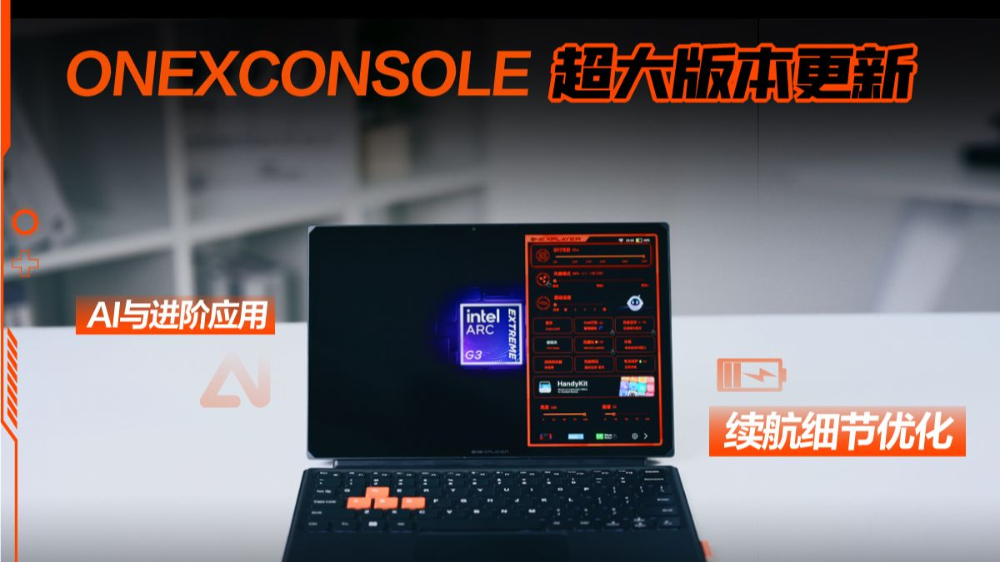

- **新闻内容**：壹号本科技宣布掌机控制软件OneXConsole迎来超大版本更新。官方邀请用户查看此前建议是否被采纳，未公布具体更新日志。该软件负责功耗调节、按键映射、性能监控等功能，此次更新预计优化界面交互与系统稳定性。
- **简要分析**：OneXConsole频繁迭代反映壹号本对用户反馈的重视，软件优化提升硬件体验是差异化竞争关键。若加入新功能（如AI功耗调度），将增强OneXPlayer系列竞争力。
- **来源**: B站动态@壹号本科技

#### 2. ROG Ally X Z2 Extreme / 《阿凡达：潘多拉边境》性能测试 / SteamOS 3.8.24

- **新闻内容**：B站UP主“Deck_HQ”发布ROG Ally X掌机（搭载Z2 Extreme芯片）运行《阿凡达：潘多拉边境》的性能测试视频。视频对比FSR超性能、FSR性能、XeSS超性能等画质设置，覆盖720p至1080p分辨率及17W至35W功耗档位，并测试帧生成技术。测试基于SteamOS 3.8.24系统，提供不同功耗下的画质与帧率参考。
- **简要分析**：测试为ROG Ally X用户提供优化指南，展示Z2 Extreme在不同功耗下的性能弹性。SteamOS 3.8.24兼容性表现值得关注，若稳定，将增强华硕掌机在SteamOS生态中的吸引力。
- **来源**: B站(via ROG Ally 掌机)

### 📋 其他资讯

#### 1. 微星Claw 8 EX 光环战役进化性能实测
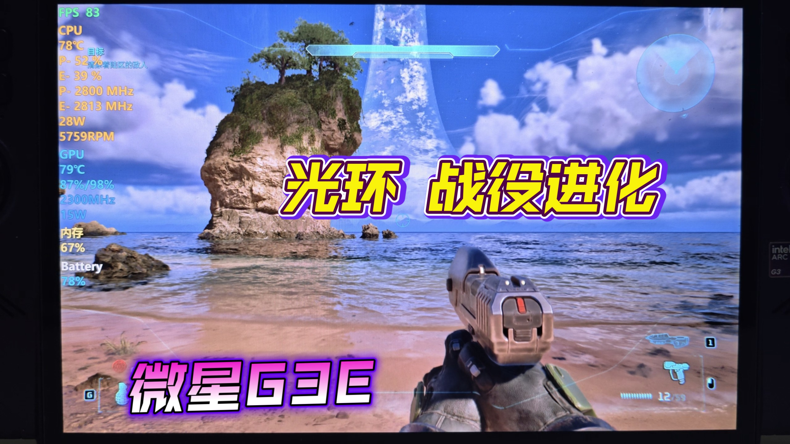

- **新闻内容**：B站UP主“山山呐”发布微星Claw 8 EX掌机运行《光环：战役进化》的性能实测视频，播放量446次。UP主以“战斗爽！！！”评价游戏体验，未提供具体帧率或功耗数据。该视频为玩家自发分享，展示Claw 8 EX在经典FPS游戏中的运行表现。
- **简要分析**：测试缺乏量化数据，但侧面印证Claw 8 EX对老游戏的兼容性。对怀旧玩家而言，流畅运行《光环》系列是加分项，但微星需更多专业评测证明综合游戏性能。
- **来源**: B站(via 微星 Claw 掌机)

### 安卓掌机

### 🆕 新机发售

#### 1. 【开源掌机】高性能4:3？这次对了！Retroid Pocket Nova沙雕小钢炮。详细测评。开箱。试玩。
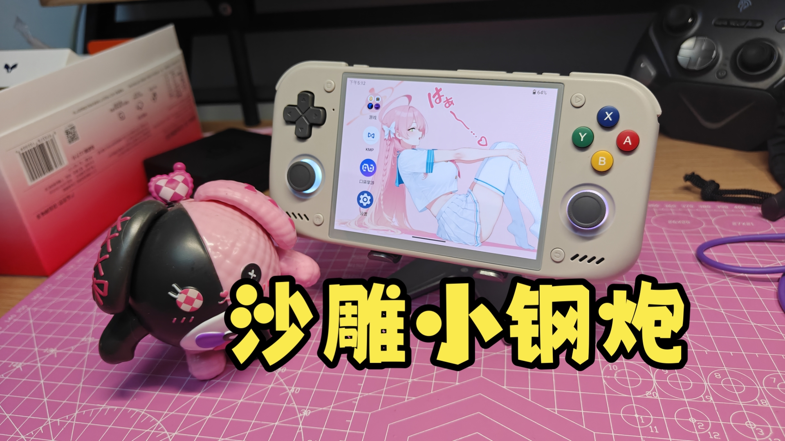

- **新闻内容**：知名UP主“玩具窝”发布Retroid Pocket Nova（沙雕小钢炮）详细测评视频，播放量达3.3万。该掌机主打高性能4:3屏幕比例，定位开源掌机市场，视频涵盖开箱、试玩及性能实测。作为Retroid Pocket系列新成员，延续了品牌在复古游戏掌机领域的高性价比路线。
- **简要分析**：Retroid Pocket Nova丰富了4:3比例安卓掌机选择，满足复古游戏玩家对点对点显示的需求，有望巩固Retroid在开源掌机市场的竞争力。
- **来源**: B站(via Retroid Pocket)

#### 2. 安卓Azahar模拟器 v2126.0-rc4汉化版发布

- **新闻内容**：UP主“dreamboyn81”发布安卓Azahar模拟器v2126.0-rc4汉化版，提供百度网盘和123云盘下载链接及永久更新地址。该版本为3DS模拟器Azahar最新候选版，针对安卓平台优化，汉化版降低了国内用户使用门槛。模拟器支持多款3DS游戏流畅运行，是掌机玩家体验任天堂经典作品的重要工具。
- **简要分析**：汉化版持续更新降低了安卓掌机用户运行3DS游戏的难度，Azahar模拟器生态的完善将提升安卓掌机作为复古游戏平台的可玩性。
- **来源**: B站(via 安卓 模拟器 掌机)

### 📱 系统更新

#### 1. Y700五代【盖世游戏】模拟运行PC对马岛之魂导剪版效果演示

- **新闻内容**：UP主“二度混合”发布视频，演示在联想Y700五代平板上使用“盖世游戏”6.0.9版本模拟运行PC游戏《对马岛之魂导剪版》的效果。视频展示了游戏运行流畅度及画质表现，并上传推荐配置方案供同设备玩家应用。该演示表明安卓设备通过模拟器运行PC大作已具备初步可行性。
- **简要分析**：盖世游戏持续迭代使安卓设备运行PC游戏成为可能，Y700五代作为高性能安卓平板，其演示效果为掌机形态设备运行PC游戏提供了技术参考，但破解版游戏使用需注意版权风险。
- **来源**: B站(via 安卓 模拟器 掌机)

### 📋 其他资讯

#### 1. AYANEO推出KONKR Pocket Advance掌机，提供橙色与蓝色两款配色。设备采用复古设计，配备方向键、ABXY按键及功能按钮，屏幕显示专属界面。

- **新闻内容**：AYANEO官方发布KONKR Pocket Advance掌机，提供橙色与蓝色两款复古配色。设备采用经典掌机设计，配备方向键、ABXY按键及功能按钮，屏幕显示专属界面。该产品主打便携游戏体验，支持多款游戏运行，延续了AYANEO在复古掌机领域的探索。目前官方尚未公布具体售价及发售日期。
- **简要分析**：AYANEO通过KONKR Pocket Advance进一步细分复古掌机市场，双色设计兼顾怀旧与个性化需求，但具体配置和性能表现仍需等待官方完整参数公布。
- **来源**: B站动态@AYANEO官方

#### 2. AIR Y 系列｜游戏，随时开始

- **新闻内容**：芒米科技通过B站动态发布AIR Y系列安卓掌机宣传信息，配图展示竖版掌机设计，主打“游戏，随时开始”的便携理念。该系列定位复古游戏市场，采用竖版造型，适合单手或便携场景游玩。目前官方未公布具体型号、配置及售价，仅以图片形式预热。
- **简要分析**：芒米科技推出竖版掌机系列，瞄准复古游戏玩家的差异化需求，竖版设计在便携性和操作手感上可能带来新体验，但市场接受度有待验证。
- **来源**: B站动态@芒米科技

#### 3. 超便携 高性能四比三 你的梦中情机来了 沙雕RP NOVA

- **新闻内容**：UP主“十万伏特BOLT”发布视频介绍Retroid Pocket Nova（沙雕RP NOVA），播放量达1.1万，称其为“超便携高性能四比三”掌机。视频中除展示掌机功能外，还分享了宝可梦改版游戏《宝可梦纹章-上吧，宝可梦训练家！》的百度网盘下载链接。该掌机主打便携与复古游戏体验，延续了RP系列在开源掌机圈的热度。
- **简要分析**：RP NOVA凭借4:3屏幕和便携设计成为近期复古掌机热点，UP主同步分享改版游戏资源提升了掌机可玩性，但改版游戏版权问题需玩家自行注意。
- **来源**: B站(via RP 掌机)

#### 4. 【掌机快讯】安伯尼克RG SP公布掌机配置与游戏演示

- **新闻内容**：UP主“麦克人”发布掌机快讯，公布安伯尼克RG SP的详细配置与游戏演示。该掌机采用翻盖设计致敬任天堂GBA SP，配备3.4英寸720×480分辨率IPS屏幕，为原版GBA分辨率的3倍，支持点对点显示。硬件搭载全志H700处理器、1GB运行内存，运行Linux系统，支持GBA、PS1、NDS等30多个平台游戏。
- **简要分析**：安伯尼克RG SP以翻盖设计和高清屏幕吸引复古玩家，硬件配置满足主流模拟需求，有望在复古掌机市场获得关注。
- **来源**: B站(via 掌机快讯)

### 开源掌机/Linux掌机

### 📱 系统更新

#### 1. GKD350H Ultra小金刚自制音乐播放器——小妙音（Rocknix系统通用）

- **新闻内容**：UP主“W4n9_cD”因不满Rocknix系统自带音乐播放器操作体验，利用AI工具自制“小妙音”播放器，适用于所有基于Rocknix系统的开源掌机，包括GKD350H Ultra小金刚。用户下载解压后放入roms/ports文件夹即可使用，下载链接通过百度网盘分享（提取码: amrf）。
- **简要分析**：社区自制软件丰富Rocknix系统实用性，降低使用门槛，有助于提升系统在玩家群体中的好感度和装机率。
- **来源**: B站(via 开源掌机)

### 📋 其他资讯

#### 2. 灰色便携式游戏掌机谍照曝光
- **新闻内容**：UP主“千夏的铲子”在B站动态晒出一款灰色便携式游戏掌机谍照。正面配备触摸屏、双摇杆、方向键及ABXY按键，背面有圆形扬声器开孔。电子秤显示重量239.32克，设计紧凑，适合手持。品牌及型号尚未公布，引发玩家猜测。
- **简要分析**：239克轻量化设计在开源掌机中具竞争力，若为量产机型，将主打便携与手感，可能对标3.5英寸屏掌机市场。
- **来源**: B站动态@千夏的铲子

#### 3. 安伯尼克 ANBERNIC：RG SP 游戏演示

- **新闻内容**：ANBERNIC官方发布RG SP掌机游戏演示视频。该机搭载3.4英寸720×480分辨率IPS屏幕，配备1GB运行内存，可实现GBA游戏3倍点对点显示，画面清晰锐利。支持PSP、PS1、DC、NDS、GB、GBC等30多个复古平台游戏，主打经典翻盖设计与便携体验。
- **简要分析**：RG SP以GBA SP翻盖造型切入市场，配合点对点显示优化，精准击中怀旧玩家痛点。ANBERNIC通过差异化设计巩固千元内复古掌机市场地位。
- **来源**: B站(via Anbernic 掌机)

#### 4. 老张小金刚掌机（GKD350h Ultra）一机难求
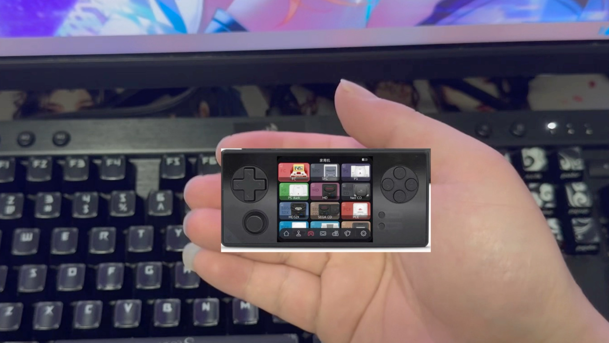

- **新闻内容**：UP主“南落白阳”发布视频吐槽未能成功购买GKD350h Ultra（小金刚）掌机。该机近期热度极高，多次开售迅速售罄，导致玩家“一机难求”。视频播放量超2000，引发同好共鸣讨论。
- **简要分析**：GKD350h Ultra抢购热潮反映开源掌机市场供不应求，尤其是高性价比机型。品牌方需提升产能或优化发售策略，避免消耗玩家热情。
- **来源**: B站(via GKD 掌机)

#### 5. 抽不到GKD小金刚？熊猫送你一台！

- **新闻内容**：针对GKD小金刚（GKD350h Ultra）一机难求，UP主“真忘私绵”发起抽奖活动，自费送出一台小金刚掌机。活动视频播放量近500，旨在回馈粉丝并缓解玩家“求购焦虑”。
- **简要分析**：KOL自发抽奖送机，侧面印证GKD小金刚高人气。社区互动有助于维持产品热度，但提醒品牌方正视供需矛盾。
- **来源**: B站(via GKD 掌机)

#### 6. 老张GKD350H Ultra（小金刚）简单拆机视频
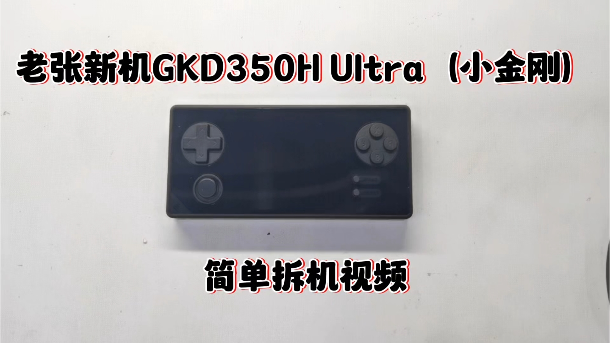

- **新闻内容**：UP主“Riky_Lin”发布GKD350H Ultra（小金刚）拆机视频，展示内部主板布局、芯片型号及散热设计。视频播放量超1200，为潜在买家提供内部做工参考，帮助了解硬件用料与可维护性。
- **简要分析**：拆机视频流行说明玩家对硬件品质要求提高。GKD小金刚内部设计若获好评，将提升口碑，反之可能影响销量。
- **来源**: B站(via 开源掌机)

#### 7. TrimUI掌机发布神秘预热视频
- **新闻内容**：TrimUI掌机官方账号发布标题为“3.5万 700:18”的短视频，疑似新机预热或性能测试数据。视频未给出明确机型信息，“3.5万”可能指跑分或价格区间，“700:18”或为屏幕比例与刷新率参数，引发玩家对下一代产品猜测。
- **简要分析**：TrimUI以隐晦方式放出信息，意在制造悬念、维持社区讨论热度。若数据属实，新机可能在屏幕规格或性能上有较大提升。
- **来源**: B站官号@TrimUI掌机

#### 8. TrimUI再发神秘数据“4.9万 2200:35”
- **新闻内容**：TrimUI掌机官方账号再次发布标题为“4.9万 2200:35”的短视频，延续此前神秘风格。数据含义尚未明确，但“4.9万”与“2200:35”可能分别指向更高性能参数或新机规格，进一步引发玩家对TrimUI下一代产品的关注与猜测。
- **简要分析**：连续发布神秘数据，TrimUI正通过悬念营销保持社区热度。若数据对应实际产品，新机可能在性能或屏幕规格上实现突破。
- **来源**: B站官号@TrimUI掌机

### PlayStation

### 🔮 新机爆料

#### 1. 次世代主机最终规格敲定！PS6与新Xbox核心配置曝光

- **新闻内容**：B站UP主“灰有小观察”发布视频，声称次世代主机PS6与新款Xbox的最终核心规格已敲定。视频播放量342次，内容涉及处理器、显卡及内存等关键配置。目前索尼与微软官方均未回应，该爆料尚处传闻阶段。
- **简要分析**：次世代主机规格提前曝光，预示研发进入尾声。若消息属实，硬件差异将影响玩家阵营选择，并倒逼游戏开发商提前适配新平台。
- **来源**: B站(via PS6)

#### 2. 图为官方PSSR对比效果。若能适应手柄且主要玩PS端游戏，可考虑PS5、PS5 Pro及未来PS6
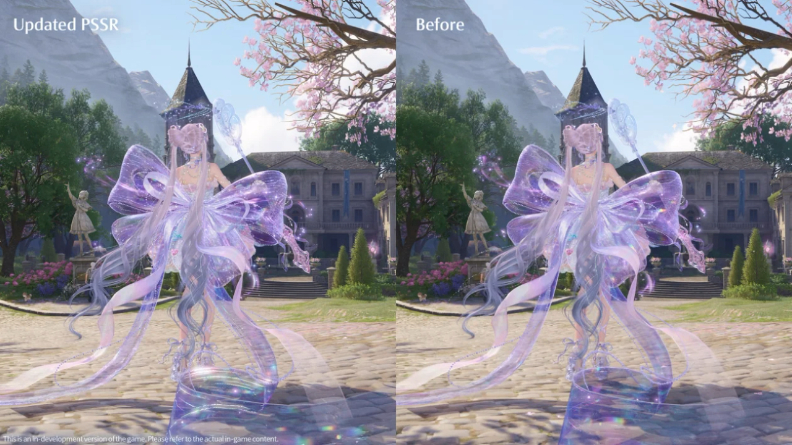

- **新闻内容**：B站UP主“法法的祝福”展示PlayStation官方PSSR技术对比效果。视频指出，PS5 Pro及未来PS6支持PSSR，该技术堪比NVIDIA DLSS，相比TSR/FSR 2/FSR 3/TAAU有显著提升。目前PS5标准版不支持PSSR，若对画面动态拖影和水体质量要求高，建议选择PS5 Pro或后续机型。
- **简要分析**：PSSR是索尼自研超分技术，为PS5 Pro核心卖点。其效果对标DLSS，表明索尼通过技术差异化提升主机画质竞争力，为PS6图形性能铺路。
- **来源**: B站(via PS5 Pro)

### 🆕 新机发售

#### 1. 经典新生！《古墓丽影：亚特兰蒂斯遗迹》官宣2027年2月13日发售，多平台现已开放预购

- **新闻内容**：《古墓丽影：亚特兰蒂斯遗迹》正式官宣，将于2027年2月13日发售，登陆PlayStation、Xbox及PC。各平台已开放预购，售价及版本信息暂未公布。该作为系列早期作品现代化重制，旨在吸引老玩家与新世代用户。
- **简要分析**：经典IP重制是主机市场重要趋势。该作选择2027年初发售，避开年末大作扎堆期，同时为次世代主机初期游戏库提前布局。
- **来源**: 知乎专栏

#### 2. 育碧CEO称PlayStation放弃光盘也有积极一面

- **新闻内容**：育碧CEO Yves Guillemot接受IGN中国采访时表示，PlayStation若完全转向纯数字主机，有望降低售价，吸引更多玩家。该表态正值索尼推广无光驱版PS5，业界对光盘与数字版未来走向讨论升温。
- **简要分析**：育碧作为第三方大厂，其CEO言论反映发行商对数字分发模式的偏好。纯数字主机可降低硬件成本，但会加速实体游戏收藏市场萎缩，冲击二手流通和零售商。
- **来源**: IGN中国

### 📱 系统更新

#### 1. 【GTA：罪恶都市PS2汉化】罪城祥子实录，罪城大佬竟成为外卖小哥 百分百怀旧攻略向流程解说#4（披萨小子）

- **新闻内容**：B站UP主“老萌新Anson”发布《GTA：罪恶都市》PS2汉化版怀旧攻略流程解说第4期。视频使用pcsx2模拟器以4K分辨率录制，安装日版宽屏补丁、去除黑边补丁及60FPS补丁。汉化版基于GTAMODX平台发布的“GTAVC - PS2 RockStar Classic 罪恶都市汉化”，是PS2平台R星游戏汉化先锋。
- **简要分析**：社区汉化项目为经典PS2游戏注入活力。通过模拟器实现4K/60FPS运行，反映玩家对老游戏高清化需求旺盛，为索尼推出PS2经典游戏重制或兼容功能提供市场参考。
- **来源**: B站(via PS6)

### 📋 其他资讯

#### 1. 优派VX24G26J-4K与华硕ROG XG27UCGR区别对比

- **新闻内容**：知乎专栏解析优派VX24G26J-4K与华硕ROG绝神27二代XG27UCGR差异，涵盖分辨率、刷新率、色域覆盖及HDR表现等核心参数，为PlayStation玩家选购4K游戏显示器提供参考。两款产品面向中高端电竞市场，定位和价格不同。
- **简要分析**：PS5 Pro及未来PS6支持更高画质输出，4K高刷显示器成为主机玩家刚需。此类对比反映玩家对显示设备与主机性能匹配的关注度提升。
- **来源**: 知乎专栏

#### 2. 雷鸟25Q6A Pro显示器全面解析及选购建议
- **新闻内容**：知乎专栏解析雷鸟25Q6A Pro显示器，涵盖面板类型、响应时间、接口配置及游戏模式优化等特性。该显示器主打高性价比，适合预算有限但追求流畅游戏体验的PlayStation玩家。文章给出针对不同游戏类型的选购建议。
- **简要分析**：雷鸟作为新兴品牌，通过高性价比产品切入主机游戏市场。此类解析帮助玩家在预算内找到适配PS5/PS5 Pro的显示方案，推动主机外设市场多元化。
- **来源**: 知乎专栏

### Xbox

### 🆕 新机发售

#### 1. 如何评价Anthropic发布的Claude Opus 5？
- **新闻内容**：Anthropic于7月24日发布旗舰模型Claude Opus 5，在推理、代码生成和多模态理解方面显著提升。官方称其在多项基准测试中超越GPT-4o和Gemini Ultra，尤其在复杂数学和长文本处理上表现突出。模型已通过API向开发者开放，个人用户可通过Claude Pro订阅使用，月费20美元。
- **简要分析**：Claude Opus 5发布标志AI大模型竞争进入新阶段，Anthropic凭借安全对齐和性能优势挑战OpenAI，可能推动行业加速迭代。
- **来源**: 知乎

### 📋 其他资讯

#### 2. 美财政部威胁制裁中国模型，硅谷200家企业联名反对，硅谷的态度反弹说明了什么？
- **新闻内容**：美国财政部近期威胁对中国AI模型实施制裁，引发硅谷强烈反弹，谷歌、微软、Meta等200多家科技企业联名反对。企业界认为制裁将破坏全球AI供应链，阻碍技术交流与创新，并可能导致美国企业失去中国市场。事件发生在中美科技竞争加剧背景下，凸显AI领域地缘政治与商业利益冲突。
- **简要分析**：硅谷企业集体反对表明美国科技行业不愿因政治因素割裂全球AI生态，可能影响美国政府最终决策，但短期内中美AI脱钩风险依然存在。
- **来源**: 知乎

#### 3. 微软重磅MoGe-3：单张图像重建突破极致3D几何细节、深度估计屠榜9大基准、细粒度结构清晰无扭曲！
- **新闻内容**：微软研究院于7月24日发布新一代3D重建模型MoGe-3，能从单张2D图像重建高精度3D几何结构，在深度估计任务上横扫9大基准测试，取得SOTA成绩。模型擅长处理毛发、织物纹理等细粒度结构，输出无扭曲变形。技术可应用于游戏资产快速生成、AR/VR内容制作及工业设计等领域，论文和部分模型权重已开源。
- **简要分析**：MoGe-3突破将降低3D内容创作门槛，对游戏和元宇宙行业意义重大，微软通过开源策略有望巩固AI+3D生态影响力。
- **来源**: 知乎专栏

### 任天堂 Switch

### 🔮 新机爆料

#### 1. [中配]Monolith Soft《异度传说》三部曲HD即将登陆任天堂Switch 2？！ - PlayerEssence

- **新闻内容**：B站UP主“环球游戏摸鱼社”搬运外媒PlayerEssence视频，指出越来越多证据和传闻表明，任天堂可能已收购《异度传说》IP或与万代南梦宫达成协议，计划将《异度传说》三部曲以HD高清重制形式登陆Switch 2。视频发布于7月25日，播放量近2000次，引发系列粉丝热议。
- **简要分析**：若传闻属实，将是Monolith Soft在Switch 2时代的重要布局，补全“异度”系列在任天堂平台的拼图，强化Switch 2的JRPG阵容吸引力。
- **来源**: B站(via Switch 2 传闻)

### 🆕 新机发售

#### 1. 【掌机周报特别篇】老张GKD小金刚发售风波，一波未平一波又起

- **新闻内容**：B站UP主“Xigua今天打游戏了吗”7月26日发布动态，报道国产掌机“老张GKD小金刚”发售前后引发的系列争议。从预售到发货环节出现多次波折，包括配置调整、发货延迟及玩家维权事件，在掌机玩家社群中引发广泛讨论。
- **简要分析**：GKD小金刚风波折射出国产小众掌机品牌在品控、供应链和用户沟通上的短板，对品牌信誉造成冲击，为后续同类产品敲响警钟。
- **来源**: B站动态@Xigua今天打游戏了吗

#### 2. 柚子社《千恋*万花》官宣动画化 2027年推出

- **新闻内容**：知名美少女游戏品牌柚子社（Yuzusoft）7月27日通过官方X账号宣布，经典作品《千恋*万花》将正式动画化，预计2027年播出。游民星空官方在B站动态转发，引发大量Galgame爱好者关注。原作以高质量立绘和剧情在玩家中口碑极高，此次动画化被视为IP跨媒体拓展的重要一步。
- **简要分析**：柚子社首次将旗下作品动画化，标志其从游戏领域向泛娱乐IP运营转型，有望吸引更广泛受众，为同类作品提供改编参考。
- **来源**: B站动态@游民星空官方

#### 3. 肉鸽构筑 弹珠版小丑牌：炖完兽人炖哥布林，炖不好就炖自己

- **新闻内容**：国产独立游戏《旧日铁锅炖主理人》7月27日在Steam正式发售。游戏融合Roguelike构筑与弹珠玩法，玩家扮演宇宙铁锅炖主厨，为异世界怪物烹饪美食，食材在锅中碰撞融合引发不可名状反应。风格荒诞幽默，被玩家戏称为“弹珠版小丑牌”。
- **简要分析**：该作以独特题材和玩法切入独立游戏市场，延续“小丑牌”式轻量策略游戏趋势，但能否在Switch等掌机平台获得适配表现仍有待观察。
- **来源**: B站动态@游民星空官方

#### 4. 10W+愿望单! Steam硬核策略《黄昏远征军》现已上线

- **新闻内容**：暗黑回合战术RPG《黄昏远征军》7月28日在Steam正式发售，发售前已积累超过10万愿望单。游戏由曾参与迪士尼、苹果、FF、我的世界等项目的资深艺术家联合创制，玩家扮演退役铁匠索伦，在废土绝境中收拢战友，对抗圣战军团与异界魔物，战局强调策略博弈与理智管理。
- **简要分析**：10万+愿望单表明硬核策略品类仍有强劲市场需求，该作凭借豪华美术阵容和独特“理智值”机制脱颖而出，未来若移植Switch 2，有望填补平台硬核策略游戏缺口。
- **来源**: B站动态@游民星空官方

### 📱 系统更新

#### 1. 研究人员公布usbliter8 硬件漏洞越狱iOS 27方案

- **新闻内容**：7月25日，研究人员在知乎专栏公布名为“usbliter8”的硬件漏洞，声称可实现对iOS 27系统越狱。该方案利用特定硬件接口底层缺陷，绕过系统安全限制，理论上可获取设备最高权限。目前漏洞细节已部分公开，苹果官方尚未回应。
- **简要分析**：硬件越狱思路对游戏设备安全有警示意义。若类似漏洞出现在Switch 2上，可能影响任天堂数字版权保护与在线服务生态。
- **来源**: 知乎专栏

### 📋 其他资讯

#### 1. 《Sorcerian》与《英雄传说III：白发魔女》经典RPG回顾，Dragon Slayer系列45周年启动

- **新闻内容**：7月27日，二柄APP发布动态回顾两款经典RPG：《Sorcerian》为SEGA发行的角色扮演游戏，支持单人游玩与记忆存档；《英雄传说III：白发魔女》是Falcom出品作品，描绘两位角色在森林篝火旁休憩场景。同时，Dragon Slayer系列宣布启动45周年纪念项目，标志以金色龙形设计呈现。

### 模拟器资讯

### 🔮 新机爆料

#### 1. Switch Drastic NDS模拟器1.0.4汉化版

- **新闻内容**：B站UP主“高达未来”发布Switch平台Drastic NDS模拟器1.0.4汉化版，由i大完成汉化。该版本基于官方最新代码本地化，支持中文菜单与界面，方便国内玩家在Switch上运行NDS游戏。资源通过百度网盘分享，需超级会员下载。
- **简要分析**：Drastic作为NDS模拟器标杆，此次汉化降低国内用户使用门槛，但网盘会员分享方式可能限制传播效率。
- **来源**: B站

### 🆕 新机发售

#### 1. Switch NGC+Wii模拟器独立版1.00正式发布

- **新闻内容**：B站UP主“高达未来”发布Switch平台NGC+Wii模拟器独立版1.00正式版。该版本将NGC与Wii模拟功能整合为独立应用，无需依赖其他系统组件，旨在提升兼容性与运行效率。资源通过百度网盘提供，提取码a26s。
- **简要分析**：独立版发布标志Switch平台NGC/Wii模拟进入新阶段，但实际性能与游戏兼容性仍需玩家实测。
- **来源**: B站

#### 2. 安卓PSV模拟器vta3k主线版更新4067+汉化版

- **新闻内容**：B站UP主“妖妖的夜”发布安卓PSV模拟器vta3k主线版更新，版本号4067，并同步推出汉化版。该模拟器允许安卓设备运行PSV游戏，此次更新修复部分图形错误并提升帧率稳定性。资源通过B站动态长期更新。
- **简要分析**：PSV模拟器在安卓平台持续迭代，4067版本标志兼容性逐步成熟，但距离完美运行大型3A游戏仍有差距。
- **来源**: B站

### 📱 系统更新

#### 1. PS3模拟器Rpcs3 v0.0.41-19607+4.93固件+Debug菜单+测试《Razing Storm》
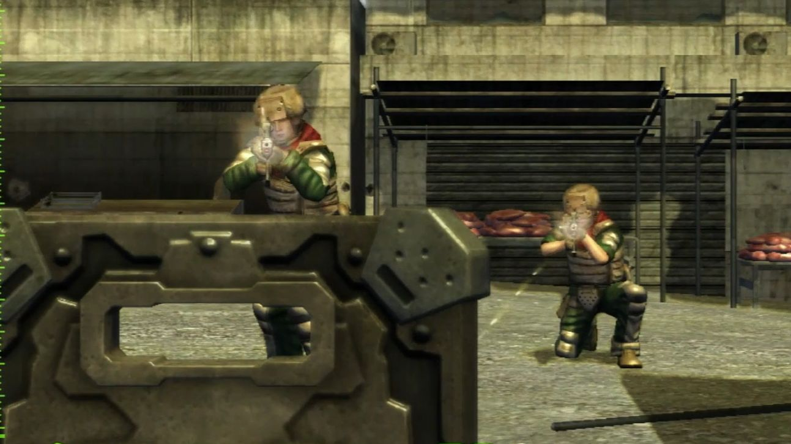

- **新闻内容**：B站UP主“Leon2023X”发布PS3模拟器Rpcs3最新版本v0.0.41-19607，包含4.93固件及Debug侦错菜单。该版本针对射击游戏《Razing Storm》进行专项测试，优化图形渲染与输入延迟。用户关注后自动获取资源。
- **简要分析**：Rpcs3通过小版本迭代提升游戏兼容性，Debug菜单为高级用户提供调试便利，但普通玩家更关注主流大作表现。
- **来源**: B站

#### 2. Batocera系统hbmame游戏名修复包

- **新闻内容**：B站UP主“大帅plus”发布Batocera系统hbmame游戏名修复包，修正模拟器中街机游戏名称显示错误或乱码问题。用户需一键三连并关注后私信索取。该修复包适用于Batocera整合系统，提升游戏库管理体验。
- **简要分析**：游戏名修复虽是小众需求，但对追求完美游戏库的复古玩家至关重要，体现社区对细节的持续打磨。
- **来源**: B站

#### 3. 乌班图Batocera游戏系统整合包下载 懒人包 插上U盘即玩

- **新闻内容**：B站UP主“Ryan_余”发布基于Ubuntu的Batocera游戏系统整合包，支持插上U盘即玩。该包整合FC、街机、PS、PSP等平台数千款游戏，并附带详细教程。资源通过夸克网盘分享，建议尽快转存以防失效。
- **简要分析**：Batocera的U盘即用特性降低复古游戏入门门槛，但整合包版权风险与网盘失效问题是用户需注意的潜在隐患。
- **来源**: B站

### 📋 其他资讯

#### 1. RP NOVA新手教程，天马G配置和256G整合包，PSV、NS模拟器配置教程

- **新闻内容**：B站UP主“千夏的铲子”发布RP NOVA新手教程，涵盖天马G前端配置及256G整合包，同时包含PSV和NS模拟器配置指导。资源通过百度网盘分享，解压密码为“跳坑者联盟”。该教程旨在帮助新手快速搭建多平台模拟器环境。
- **简要分析**：天马G前端整合包是复古游戏社区常见方案，教程降低新手学习成本，但256G容量对存储空间要求较高。
- **来源**: B站动态@千夏的铲子

#### 2. 用了四个月CC-switch后弃置，转向国产和开源agent软件

- **新闻内容**：知乎专栏作者分享使用CC-switch四个月后决定弃置，转向国产及开源agent软件。文章未说明具体原因，暗示CC-switch在功能或体验上未能满足需求。
- **简要分析**：该内容与模拟器核心关联较弱，更多反映用户对特定工具的个人选择，对行业参考价值有限。
- **来源**: 知乎

### 游戏外设

### 🆕 新机发售

#### 1. 福袋-50！ns大表哥1/128 双点博物馆/166 ns2涂击队国内现货 福袋宝森 pro2手柄

B站UP主“欢乐多EX”发布视频，展示多款Switch及Switch 2配件福袋促销活动。内容包括《大表哥1》NS卡带（1/128概率）、双点博物馆（166元）、Switch 2涂击队主题保护壳国内现货，并重点介绍“宝森 Pro2手柄”福袋选项，为玩家提供多种外设组合。福袋模式降低玩家尝试新外设门槛，尤其针对Switch 2初期配件市场，能快速拉动Pro2手柄等新品销量，是品牌清库存与推广新品的有效手段。来源：B站（via Switch Pro 手柄）

#### 2. 黏土扭曲噩梦降临！班班花园：畸变黏土 Banban’s Garten PS5 & PS VR2 官宣预告

恐怖游戏《班班花园：畸变黏土》正式公布，确认登陆PS5与PS VR2平台。预告片展示诡异黏土怪物和压抑乐园场景，玩家需在危机四伏环境中探索并躲避可怖生物。该作将充分利用PS VR2沉浸式特性，带来临场感惊悚体验。PS VR2独占恐怖游戏阵容再添新丁，表明索尼仍在拉拢中小型开发商丰富VR内容库，以维持平台在VR领域竞争力。来源：B站（via PSVR 2）

#### 3. 抽奖丨Skull&Co的斯普拉遁 涂击队 限定保护壳 居然多了这么多细节？！Switch2丨分体壳丨一体壳丨开箱

知名配件品牌Skull&Co推出Switch 2专用《斯普拉遁》涂击队限定保护壳。B站UP主“更生_Su”发布开箱视频，展示分体壳与一体壳两种形态，并指出其在纹理、按键覆盖等细节上比前代更丰富。该保护壳已在国内现货发售。Skull&Co紧跟Switch 2上市节奏推出主题限定壳，精准抓住任天堂核心粉丝收藏与个性化需求，有望在第三方配件市场占据先机。来源：B站（via Switch 配件）

#### 4. 第110集 - Switch2 Pro手柄开箱｜ASMR 我的 Switch2 Pro 手柄终于收到了，来个 ASMR 版开箱吧，建议戴耳机观看。

B站UP主“阿贵吉吉”发布Switch 2 Pro手柄ASMR开箱视频，以沉浸式声音录制展示手柄包装、外观及握持手感。该手柄作为Switch 2官方标配高端外设，按键手感、连接稳定性及新功能成为玩家关注焦点。ASMR开箱形式新颖，能直观传递产品质感。随着Switch 2用户基数扩大，Pro手柄作为提升游戏体验核心配件，市场需求将持续旺盛。来源：B站（via Switch Pro 手柄）

#### 5. 《赛博朋克2077》周边，可以发光的“热能武士刀”今日发售

Infolens宣布推出《赛博朋克2077》1:1比例“热能武士刀”ERRATA，于7月28日上午11点开启预购。道具长约119厘米，采用高强度塑料三段式组装，内置LED灯可发出红光，配备挥动音效芯片及展示支架，售价27,500日元（含税）。同期推出四季宝金属徽章（1650日元）等小件周边。高还原度游戏武器周边是核心粉丝收藏目标，此次“热能武士刀”兼具发光与音效，定价适中，有望成为《赛博朋克》IP衍生品爆款。来源：机核

### 📋 其他资讯

#### 1. 盖世小鸡在巴西干了件大事！全球代言人“冠军天团”“包围”巴西！
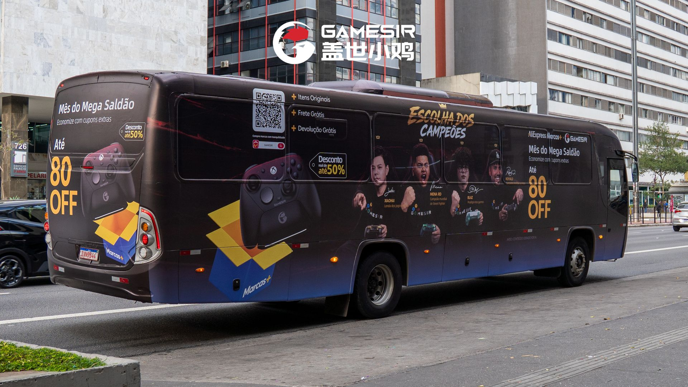

国产外设品牌盖世小鸡在巴西市场展开大规模营销活动，全球代言人“冠军天团”以“包围”式策略覆盖巴西当地。官方发布动态展示宣传物料，旨在强化品牌在南美游戏市场影响力，推广手柄等核心产品。盖世小鸡积极布局海外新兴市场，巴西作为游戏人口大国潜力巨大，通过代言人矩阵进行本地化营销，有助于快速建立品牌认知，为后续渠道拓展铺路。来源：B站动态@盖世小鸡

#### 2. 2026电竞世界杯《街头霸王6》正赛将于7月29日至8月1日在法国巴黎举行，总奖金100万美元，冠军获卡林门票。赛事共32名选手参赛，采用多阶段赛制：首轮分四组...

## 参考资料链接列表

1. [B站动态@二柄APP] 《007：First Light》确认支持Steam Deck，已获官方验证。游戏画面展示经典邦德元素，包括阿斯顿·马丁跑车和雪山场景中的潜行动作。玩家可在掌机...: https://t.bilibili.com/1229994024924872712
2. [贴吧steam吧] 榜单公布时间：2026年06月30日 23:59: https://news.google.com/rss/articles/CBMid0FVX3lxTE5DUnJYdFdZVFU5UFNFemVhdS1rdHloZ2x0SDBTMTdFYmxRV240MDAyVERPSDFzOXpRZFhsR0NLTFd6cW5ubjNtT3NUMjdkZzZEUjNHSlJfekl6bWVJTUpmYmFBdGRWemFJaUQ5ajRwUjM2Ul9scE5j?oc=5
3. [B站(via Steam 控制器)] 侠影录修改器护肝控制台，无限金钱|生命|一击必杀|物品编辑|伤害属性设置，风灵mod下载使用方法教程攻略！: https://www.bilibili.com/video/BV1MK3J6cEFj
4. [B站(via Steam 控制器)] 《木筏求生（Raft）》#23发动机控制器，抵达神秘工地: https://www.bilibili.com/video/BV13o3E6TEZH
5. [B站(via Steam 控制器)] 风暴怕死队内置物品编辑器 | 武器编辑+宝物添加+塔罗牌获取: https://www.bilibili.com/video/BV1Zr3E6jEpF
6. [B站(via 微星 Claw 掌机)] Intel G3extreme 20瓦2077 1200p Steam 预设 benchmark: https://www.bilibili.com/video/BV1wK3w6TEMk
7. [B站动态@GPD掌机官方] GPD 将携 WIN MAX 3 样机亮相 2026 ChinaJoy，展位号：S392。: https://t.bilibili.com/1229625132317671428
8. [B站动态@GPD掌机官方] 倒计时 3 天！GPD BOX & GPD G2 预售 7 月 30 日截单: https://t.bilibili.com/1229626081462452230
9. [B站动态@壹号本科技] OneXConsole 又双叒叕更新啦!快来看看你的建议有被采纳吗: https://t.bilibili.com/1228794446996308001
10. [B站(via ROG Ally 掌机)] ROG Xbox Ally X Z2 Extreme / 《阿凡达：潘多拉边境》性能测试 / SteamOS 3.8.24: https://www.bilibili.com/video/BV16qgZ6bEoc
11. [B站(via 微星 Claw 掌机)] 微星claw8EX 光环战役进化性能实测: https://www.bilibili.com/video/BV1YV3u6yETw
12. [B站(via 微星 Claw 掌机)] 【SPT】微星 CLAW 8 EX AI+体验：Arc G3 Extreme，全新掌机SoC，超勇的！: https://www.bilibili.com/video/BV1k93M6tE5w
13. [B站(via 微星 Claw 掌机)] 【第120期】 微星g3e 卡赞狂战士13w/17w/30w 多倍插针 测试分享: https://www.bilibili.com/video/BV1V93u67Eq1
14. [B站(via Retroid Pocket)] 【开源掌机】高性能4:3？这次对了！Retroid Pocket Nova沙雕小钢炮。详细测评。开箱。试玩。: https://www.bilibili.com/video/BV12U3g6zECL
15. [B站(via 安卓 模拟器 掌机)] 安卓Azahar模拟器 v2126.0-rc4汉化版发布: https://www.bilibili.com/video/BV1Hm3L61Ek5
16. [B站(via 安卓 模拟器 掌机)] Y700五代【盖世游戏】模拟运行PC对马岛之魂导剪版效果演示: https://www.bilibili.com/video/BV1W7gf6wE3t
17. [B站动态@AYANEO官方] AYANEO推出KONKR Pocket Advance掌机，提供橙色与蓝色两款配色。设备采用复古设计，配备方向键、ABXY按键及功能按钮，屏幕显示“KONKR...: https://t.bilibili.com/1228884070082019331
18. [B站动态@芒米科技] AIR Y 系列｜游戏，随时开始: https://t.bilibili.com/1229590592152928262
19. [B站(via RP 掌机)] 超便携 高性能四比三 你的梦中情机来了 沙雕RP NOVA: https://www.bilibili.com/video/BV1VDgv6HEQY
20. [B站(via RG 安卓掌机)] 【掌机快讯】安伯尼克RG SP公布掌机配置与游戏演示: https://www.bilibili.com/video/BV1mC3K64EMU
21. [B站(via AYANEO Pocket)] 【教程】AYANEO POCKET S机身外壳保护膜贴膜教程: https://www.bilibili.com/video/BV1nZ3M6dEFG
22. [B站官号@AYN掌机] 1.4万600:38: https://www.bilibili.com/video/BV1edeczYEZV/
23. [B站(via 开源掌机)] GKD350H Ultra小金刚自制音乐播放器——小妙音（Rocknix系统通用）: https://www.bilibili.com/video/BV1XJ3w64EQK
24. [B站动态@千夏的铲子] 一款灰色便携式游戏掌机，正面配备触摸屏、双摇杆、方向键及ABXY按键，背面有圆形扬声器开孔。设备放置于电子秤上，显示重量为239.32克，整体设计紧凑，适合手持...: https://t.bilibili.com/1229647500527271956
25. [B站(via Anbernic 掌机)] 安伯尼克 ANBERNIC：RG SP 游戏演示: https://www.bilibili.com/video/BV1qCgY6EEK8
26. [B站(via GKD 掌机)] 老张小金刚掌机（GKD350h Ultra），没买到！: https://www.bilibili.com/video/BV1FQgX6yE81
27. [B站(via GKD 掌机)] 抽不到GKD小金刚？熊猫送你一台！: https://www.bilibili.com/video/BV1Cr3w6GEEz
28. [B站(via 开源掌机)] 老张GKD350H Ultra（小金刚）简单拆机视频: https://www.bilibili.com/video/BV17h3c6cEyt
29. [B站官号@TrimUI掌机] 3.5万700:18: https://www.bilibili.com/video/BV1Hug3zGEPZ/
30. [B站官号@TrimUI掌机] 4.9万2200:35: https://www.bilibili.com/video/BV1UX4y1779w/
31. [B站(via PS6)] 次世代主机最终规格敲定！PS6与新Xbox核心配置曝光: https://www.bilibili.com/video/BV1dG3e6HEiM
32. [B站(via PS5 Pro)] 图为官方PSSR对比效果。如果能适应手柄，玩的游戏几乎只是PS端的游戏，那还是能入PlayStation（PS5、PS5 Pro以及经后的PS6）: https://www.bilibili.com/video/BV1Rn3i69Epv
33. [知乎专栏] 经典新生！《古墓丽影：亚特兰蒂斯遗迹》官宣2027年2月13日发售，多平台现已开放预购: https://news.google.com/rss/articles/CBMiXEFVX3lxTE1xQlVUXzZ2eGlaR3ZyTmFGcTJYa3JILXN3VllKWmFSMDUtdEVUcWU2SVg0MFQ3VHlZbHdNaWQzRnZ4bHdiT2ZNYjBRZ1VLMEZ2bFhlTWNldmJHUXlP?oc=5
34. [IGN中国] 育碧CEO称PlayStation放弃光盘也有积极一面: https://www.ign.com.cn/playstation-5/61577/yu-bi-ceocheng-playstationfang-qi-guang-pan-ye-you-ji-ji-yi-mian
35. [B站(via PS6)] 【GTA：罪恶都市PS2汉化】罪城祥子实录，罪城大佬竟成为外卖小哥 百分百怀旧攻略向流程解说#4（披萨小子）: https://www.bilibili.com/video/BV1oJ3P6KEEm
36. [知乎专栏] 优派VX24G26J-4K和华硕ROG XG27UCGR区别对比：优派VX24G26J-4K和华硕ROG绝神27二代XG27UCGR哪个好？: https://news.google.com/rss/articles/CBMiXEFVX3lxTFA4M0k5QUFfazVXWlB0ZE1hLVJPTzVfd1VDOG5xYXVLSFdRWGozNWRKZW9WZThJcGZreG1IRXljRXIyWFRKbHhMaExmTkVjVmZPaVk0MVhwZnZSTnpT?oc=5
37. [知乎专栏] 雷鸟25Q6A Pro显示器（雷鸟Q6APro）全面解析，雷鸟 25Q6APro选购建议: https://news.google.com/rss/articles/CBMiXEFVX3lxTE1SWEx1aVdMM29Gc1NCel82TWJKdms0SHZxWGxOY3JnMGs1SGpRSHNSWFZZTmlLZXBwQmFTSTJXbDQ0YlVyY2hNRnZfTXRDRlZyajh3eWZxcDN4b1lw?oc=5
38. [知乎] 如何看待某博主称“客厅游戏PC只需插两根线”，被网友吐槽“过度吹捧，所有主机不都这样”？: https://news.google.com/rss/articles/CBMiX0FVX3lxTE1XeVA3YnF5Y0FWZDkzVjNBbDFwTTZheDhhUDZacEtFR2dyU3VFUEl0Y0oyNjhIM3FQeWxDWXp2eWdhNUpYUHFGMU9PTFpFTl9STmhWUVlYUE9reUdLRElN?oc=5
39. [知乎专栏] 新游暴涨10倍，心动新AI诞生了，黄一孟：过去2个月，是我创业以来最兴奋的: https://news.google.com/rss/articles/CBMiXEFVX3lxTE5WX1hZb3E1N3NFTE44ZjFrcXhIVjJ3ekczaGx1ak16VGtVVUdPT3JyM29vTnM5cUk2blJNdmRKSkJtYzE4MzBCeFNxcGxUOVktdkVRWHR4Wk5sRG9Y?oc=5
40. [知乎] 如何评价Anthropic发布的Claude Opus 5？: https://news.google.com/rss/articles/CBMiX0FVX3lxTFBOTEgtSnZuV1NVMnVIZTRkcFYxMXEwcXJNM09XVmF6VDMtQ3JjY0lvNGRwZGhfcFZITEotakh1SkxnUlZPUnYzb1NTQmdtZlRRN1pJMVVQdEpkUUE4TG5j?oc=5
41. [知乎] 美财政部威胁制裁中国模型，硅谷 200 家企业联名反对，硅谷的态度反弹说明了什么？: https://news.google.com/rss/articles/CBMiX0FVX3lxTFBvY0Z2WVAwWnFaZUFLMFRSeTV0d0RJdm1nQ2dZTGRzVWluRllRcXJrc1VBSFBPaEdLbU5PWDBORGljZGJwVHJva1doSDRuVlZLWUZnZTdEdFlZdDY1SGdv?oc=5
42. [知乎专栏] 微软重磅MoGe-3：单张图像重建突破极致3D几何细节、深度估计屠榜9大基准、细粒度结构清晰无扭曲！: https://news.google.com/rss/articles/CBMiXEFVX3lxTE9IY01IU0VMVEhIdDQxWS0tQnRyUnJuTnNlLVR4aE5LcF9rNlcwcEMwNG1VXzg3cnhybUV2TXpMSEJwdmhlNGUzR1pmUUo2bVlDUm5iWGRESS1RempT?oc=5
43. [知乎专栏] Claude Opus 5 系统提示词泄漏，20 万提示词泄漏 Fable 5 原罪: https://news.google.com/rss/articles/CBMiXEFVX3lxTE1lMko1OFd6QXJrZEkxYURpcHA5U1NBeGVWd1NsWFhzNTNCT21QY2tUaUVTYjdpUGx2a040dktST2lnWlZwdHFQeXRFVWNIQ1dGYVBNaTBhR1kwV25J?oc=5
44. [B站(via Switch 2 传闻)] [中配]Monolith Soft《异度传说》三部曲HD即将登陆任天堂Switch 2？！ - PlayerEssence: https://www.bilibili.com/video/BV1CWg96QEX4
45. [B站动态@Xigua今天打游戏了吗] 【掌机周报特别篇】老张GKD小金刚的发售风波，一波未平一波又起，精彩程度堪比三顾茅庐 七擒孟获: https://t.bilibili.com/1229359179327602709
46. [B站动态@游民星空官方] 柚子社《千恋*万花》官宣动画化 2027年推出: https://t.bilibili.com/1229562511653601280
47. [B站动态@游民星空官方] 肉鸽构筑 弹珠版小丑牌：炖完兽人炖哥布林，炖不好就炖自己: https://t.bilibili.com/1229720046756954152
48. [B站动态@游民星空官方] 10W+愿望单! Steam硬核策略《黄昏远征军》现已上线: https://t.bilibili.com/1230025702460358662
49. [知乎专栏] 研究人员公布usbliter8 硬件漏洞越狱iOS 27方案: https://news.google.com/rss/articles/CBMiXEFVX3lxTFBtbG15V29uSEhsd0NnNjQ2WEQxcDg4OW1hUzFSdTZ0Sk5Fb1NIUDNyRXh5VXNWUGt1aUNsd19IN3I4cDVTWm5qRkhobTU2UHRKUFRYa0sybWVheFRJ?oc=5
50. [B站动态@二柄APP] 《Sorcerian》为SEGA发行的经典角色扮演游戏，支持单人游玩并具备记忆存档功能。《英雄传说III：白发魔女》为Falcom出品的RPG作品，描绘两位角色...: https://t.bilibili.com/1229646390242574376
51. [B站动态@游民星空官方] 我和兄弟合伙开商场，最后4个人各自打车走的…: https://t.bilibili.com/1229657069713358854
52. [B站专栏@游民星空官方] 2026年的RTS玩家，想吃口好的就这么难？: https://www.bilibili.com/read/cv51777317
53. [Bilibili] 【IGN】Switch 2版《异度神剑2》介绍视频_游戏热门视频: https://news.google.com/rss/articles/CBMiV0FVX3lxTE0wQnZCNXc5SUx1RjdwWTAtd2tWUDhmM25ESjZ6WktJbHlwQ1dIaEMzMHB1Rl9yRG1OcDBFMEp3Z3lXbmlyZG1uLXpKZVBQVDA5X2tGdk1tTQ?oc=5
54. [B站(via Switch OLED)] Nintendo 任天堂 Switch OLED 日版: https://www.bilibili.com/video/BV1EG3L66EUa
55. [B站(via Drastic 模拟器)] switch drastic NDS模拟器1.0.4汉化版【i大汉化】: https://www.bilibili.com/video/BV1EE3K6yE2F
56. [B站(via NGC 模拟器)] switch ngc+wii模拟器独立版1.00正式发布: https://www.bilibili.com/video/BV1Fm3F6hEjB
57. [知乎专栏] 开源AI的里程碑时刻！月之暗面重磅发布Kimi K3：2.8万亿参数“混合专家”模型的巅峰之作: https://news.google.com/rss/articles/CBMiXEFVX3lxTE5yNGtUaTdiWGxVSEw4eHhRQURaMHlkcVNCUnFaM1NWbDRUX2U0RFJfMnBJYUtvSkVyR1BScFdjaHpJSUFVOXRGVm9NYTZKcWJmNWtYU3NJSHZOQk9O?oc=5
58. [B站(via 模拟器 汉化)] 安卓psv模拟器vta3k主线版更新4067+汉化版发布: https://www.bilibili.com/video/BV1wT3i6eEGm
59. [B站(via PS4 模拟器)] PS3模拟器-Rpcs3 v0.0.41-19607+4.93固件+Debug(侦错菜单)+测试《Razing Storm》，关注自动获取。: https://www.bilibili.com/video/BV14x3u6iEum
60. [B站(via Batocera 系统)] batocera系统hbmame游戏名修复包: https://www.bilibili.com/video/BV1pG3M64ENX
61. [B站(via Batocera 系统)] 乌班图Batocera游戏系统整合包下载 懒人包 插上U盘即玩复古掌机主机街机游戏！附教程: https://www.bilibili.com/video/BV1qEgX6TEbz
62. [B站动态@千夏的铲子] RP NOVA新手教程，天马G配置和256G整合包，PSV、NS模拟器配置教程: https://t.bilibili.com/1228935429246418980
63. [知乎专栏] 用了四个月CC-switch后我现在基本弃置了，已转向国产和开源agent软件: https://news.google.com/rss/articles/CBMiXEFVX3lxTE5WV1RwTWZCTzlsdnZJM0sycU9hbzRBalpyTy1faU0yRlpLN3Nsc3R2SXZZLXpWa3RYTm9IdHNoTENrSEtMWU90bm5sTUlydk10eTZ6SmtYREtUSDZj?oc=5
64. [知乎] 长征三号乙运载火箭飞行途中被闪电击中，为啥依然能够发射成功？闪电会对它造成什么影响吗？: https://news.google.com/rss/articles/CBMiX0FVX3lxTE56bkRNUXZKYmRNeUVWcmJQVU93T3g5ZkJSQUhROGhKc0oyTFVhbGZzVnJhZW9qNUkzUGxYRXFuYXJuemJrQnBLX1BQdEw3VXdYYjhoSUNWSVZIbGEtanZ3?oc=5
65. [Bilibili] 无需三连[奶茶店模拟器]&&免费游戏下载#祄低诶七咧并哉诶气及岗汢: https://news.google.com/rss/articles/CBMiV0FVX3lxTE8yTTRlb2ZONW83dzBfYm1KNG9lbEpQcWZKTHhlSGh3SU5hOTNMUDVIWFpSSC01VTZPVFNiTEhfTkRGRUtFdTdNMWlVd3pMenJ4aV9LR1U2dw?oc=5
66. [知乎专栏] 聊天机器人时代迎来黄昏，AI Agent 开启指数级生产力革命: https://news.google.com/rss/articles/CBMiXEFVX3lxTE5vajZmT2dPX29LN0ZhazVJR0dBWUJKaVNHWC1EdEJ3Q0RzUWp1Y181VDhIaXkyQnRReWd1MzBiaTFJcmIwR1pJalZNYXhoUFprWTlJMWwwdU5UR1h6?oc=5
67. [B站(via Switch Pro 手柄)] 福袋-50！ns大表哥1/128 双点博物馆/166 ns2涂击队国内现货 福袋宝森 pro2手柄: https://www.bilibili.com/video/BV1Qjgv6yEjY
68. [B站(via PSVR 2)] 黏土扭曲噩梦降临！班班花园：畸变黏土 Banban’s Garten PS5 &amp; PS VR2 官宣预告: https://www.bilibili.com/video/BV1FJgi6aEid
69. [B站(via Switch 配件)] 抽奖丨Skull&amp;Co的斯普拉遁 涂击队 限定保护壳 居然多了这么多细节？！Switch2丨分体壳丨一体壳丨开箱: https://www.bilibili.com/video/BV1Ah3j6jEwT
70. [B站(via Switch Pro 手柄)] 第110集-Switch2Pro手柄开箱｜ASMR我的Switch2Pro手柄终于收到了，来个ASMR版开箱吧，建议戴耳机观看。_#Switch2#NS2#Sw: https://www.bilibili.com/video/BV1BQ3e6REJM
71. [机核] 《赛博朋克2077》周边，可以发光的“热能武士刀”今日发售: https://www.gcores.com/articles/217658
72. [B站动态@盖世小鸡] 盖世小鸡在巴西干了件大事！全球代言人“冠军天团”“包围”巴西！: https://t.bilibili.com/1228554895206907943
73. [B站动态@盖世小鸡] 2026电竞世界杯《街头霸王6》正赛将于7月29日至8月1日在法国巴黎举行，总奖金100万美元，冠军获卡林门票。赛事共32名选手参赛，采用多阶段赛制：首轮分四组...: https://t.bilibili.com/1229676921020743700
74. [B站(via Stream Deck)] 键盘也能控制智能家居？保姆级教程 Home Assistant+键盘自动化: https://www.bilibili.com/video/BV1mpgv66Eti
75. [B站(via 主机 积木)] 精工蛮牛pro2，蛮牛五周年，空仓，精工积木主机，积木仓: https://www.bilibili.com/video/BV1Qzgi6mEaz
76. [B站官号@盖世小鸡] 16.3万11105:53: https://www.bilibili.com/video/BV1osQuBUEAM
77. [B站官号@盖世小鸡] 7024000:49: https://www.bilibili.com/video/BV1zqgY6pE4A/
78. [B站官号@盖世小鸡] 4369000:43: https://www.bilibili.com/video/BV1o9gD6eEJa/

---

> 137条动态，浓缩一周硬核情报，下期继续追踪前沿。
